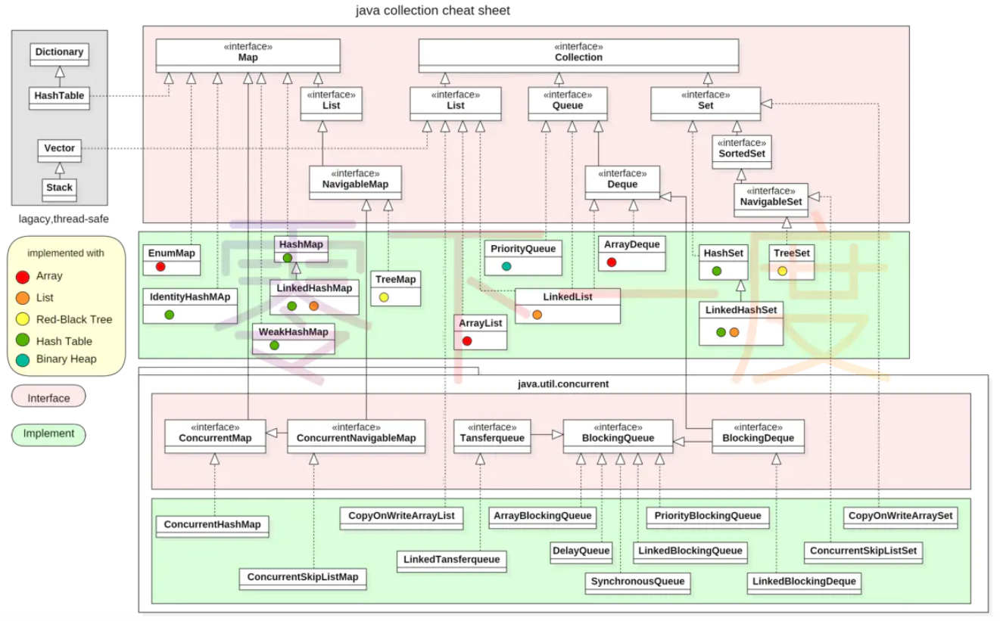
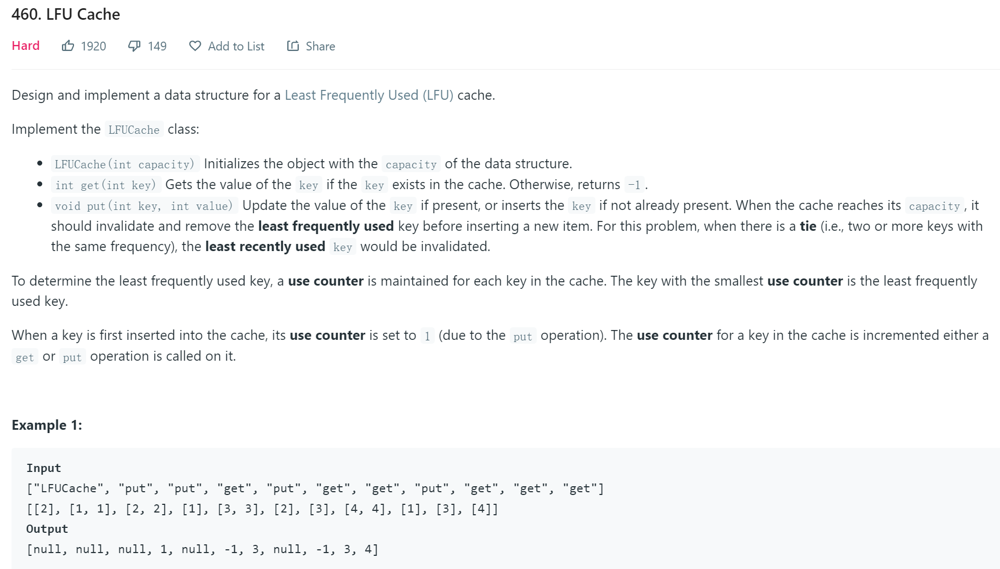
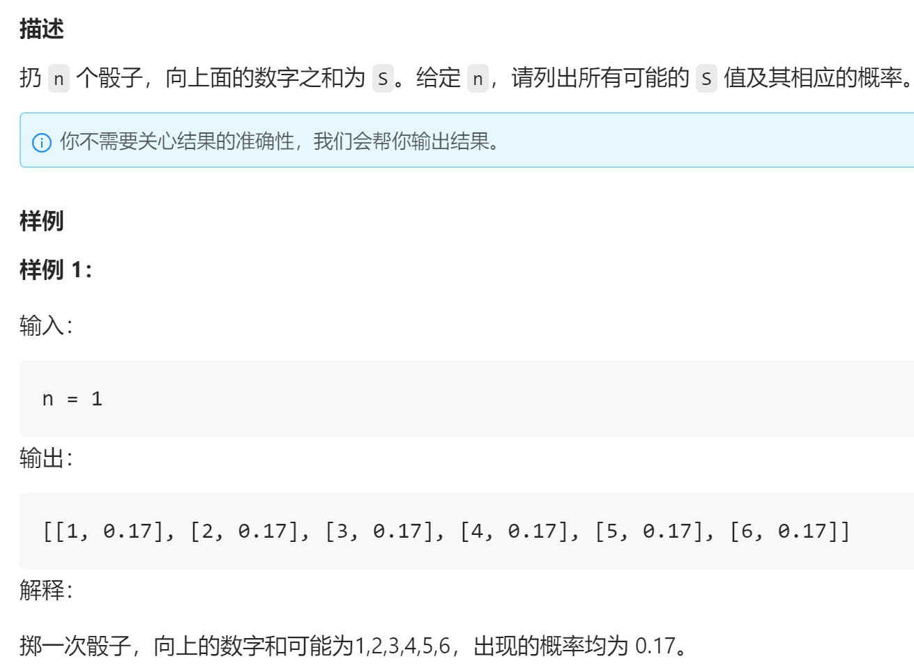
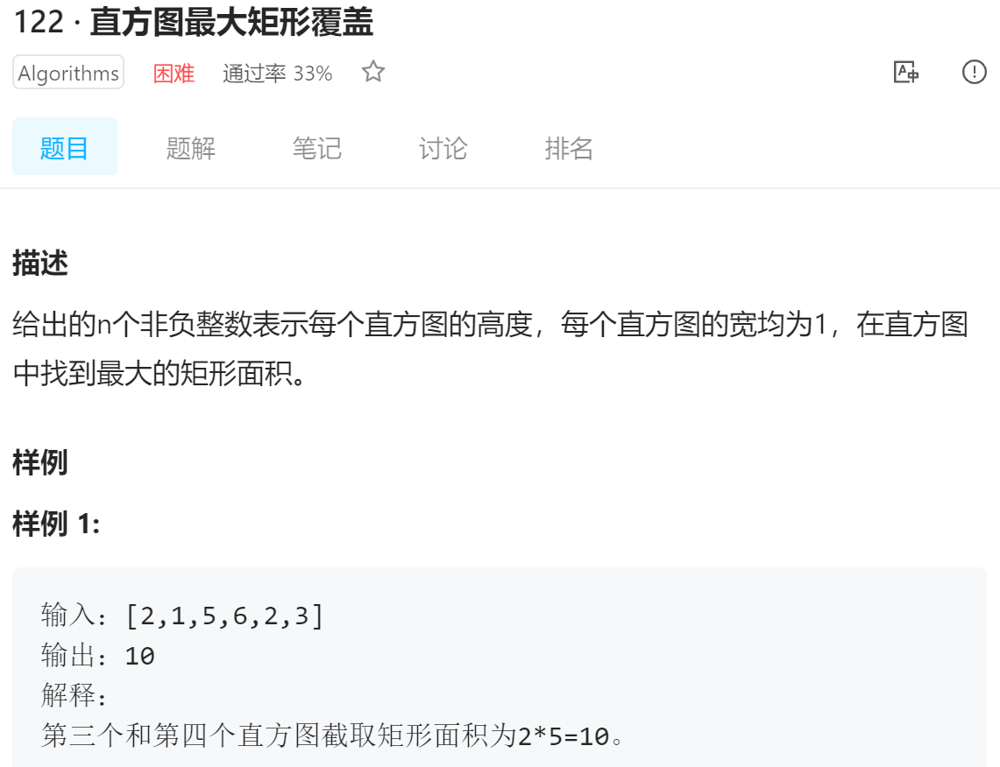
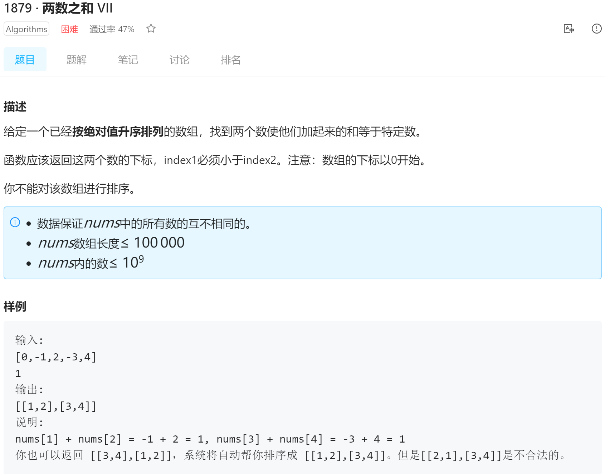
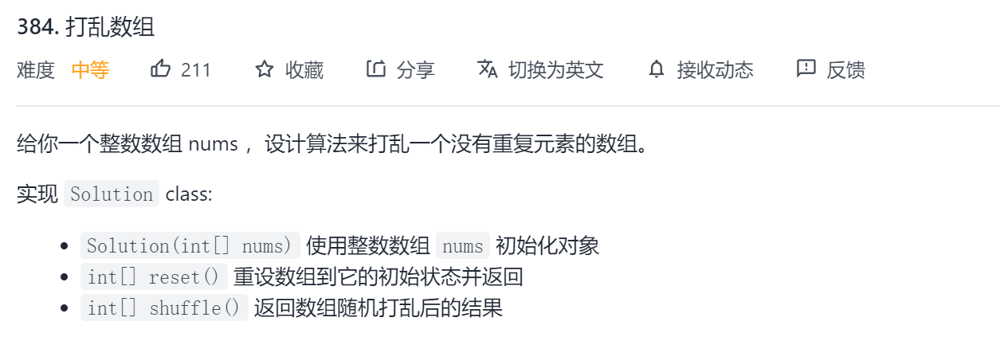
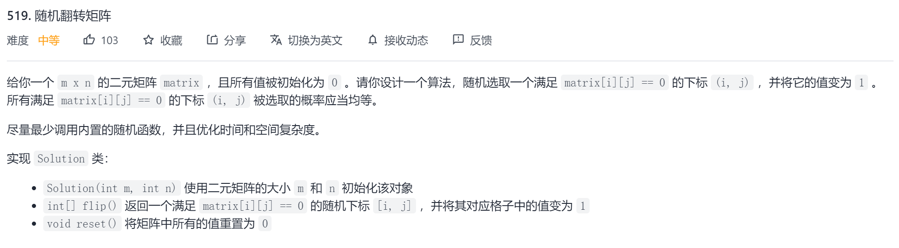

# 数组理论知识

## Arrays工具类

#### Arrays.sort()

**Arrays.sort()的2中形式**

```java
static <T> void sort(T[] a) 
要求类型T实现了Comparable接口，并根据compareTo方法对指定的对象数组进行排序。
static <T> void sort(T[] a, Comparator<? super T> c) 
根据指定的比较器引发的顺序对指定的对象数组进行排序。
```

**Arrays.sort()的实现**

对于基本类型，Arrays.sort()采用了DualPivotQuicksort.sort()（插入排序+归并排序+[双基准快速排序](https://www.xuebuyuan.com/3205101.html)）。

实际采用的排序方式如下：

​	*len=right-left*

​	*数组中的逆序数列>67,则认为数组不具备结构。*


双基准快排代码

```java
public class QuickSortDualPivot {
 
  public void sort (int[] input){
      sort (input, 0, input.length-1);
  }
 
  private void sort(int[] input, int lowIndex, int highIndex) {
      if (highIndex<=lowIndex) return;
 
      int pivot1=input[lowIndex];
      int pivot2=input[highIndex];
 
      if (pivot1>pivot2){
          exchange(input, lowIndex, highIndex);
          pivot1=input[lowIndex];
          pivot2=input[highIndex];
      }
      else if (pivot1==pivot2){
          while (pivot1==pivot2 && lowIndex<highIndex){
              lowIndex++;
              pivot1=input[lowIndex];
          }
      }
 
      int i=lowIndex+1;
      int lt=lowIndex+1;
      int gt=highIndex-1;
 
      while (i<=gt){
          if (less(input[i], pivot1)){
              exchange(input, i++, lt++);
          }
          else if (less(pivot2, input[i])){
              exchange(input, i, gt--);
          }
          else{
              i++;
          }
      }
 
      exchange(input, lowIndex, --lt);
      exchange(input, highIndex, ++gt);
 
      sort(input, lowIndex, lt-1);
      sort (input, lt+1, gt-1);
      sort(input, gt+1, highIndex);
 
  }
}
```

## Collection类



**通用方法**


### Stack,Queue,Deque

**Stack**

java集合框架中没有Stack接口，仅仅有java早期遗留下来的一个Stack类。

```java
public Stack extends Vector
```

官方一般建议这样使用ArrayDeque代替Stack

```
因为继承自Vector，所以Stack类是同步的，效率不高。
Stack仅支持pop(),push(),peek(),功能弱.
```

**Queue接口**

offer，add区别：

> 一些队列有大小限制，因此如果想在一个满的队列中加入一个新项，多出的项就会被拒绝。
>
> 这时新的 offer 方法就可以起作用了。它不是对调用 add() 方法抛出一个 unchecked 异常，而只是得到由 offer() 返回的 false。 

poll，remove区别：

> remove() 和 poll() 方法都是从队列中删除第一个元素。remove() 的行为与 Collection 接口的版本相似，
>
> 但是新的 poll() 方法在用空集合调用时不是抛出异常，只是返回 null。

peek，element区别：

> element() 和 peek() 用于在队列的头部查询元素。与 remove() 方法类似，在队列为空时， element() 抛出一个异常，而 peek() 返回 null

| 功能              | 超出限制返回null | 超出限制抛出异常 |
| ----------------- | ---------------- | ---------------- |
| 向queue中加入一项 | offer            | add              |
| 从queue中移除一项 | poll             | remove           |
| 查看queue队头元素 | peek             | element          |

**Deque接口**
Deque是Queue的子接口。
Deque有两个比较重要的类：ArrayDeque(栈/队)和LinkedList(随机访问)

> 使用栈时，用ArrayDeque的push和pop方法；
> 使用队列时，使用ArrayDeque的offer,poll和peek方法,这3个方法都有一套\*\*\*First()和\*\*\*Last()方法

### PriorityQueue

PriorityQueue底层数据结构是堆,可保证依次从队头移除元素有序.

**常用构造方法**

1. 通过比较器构造

```java
public PriorityQueue(Comparator<? super E> comparator) {
    //默认尺寸为11
    this(DEFAULT_INITIAL_CAPACITY, comparator);
}
```

2. 通过Collection构造(通常元素实现了Comparable接口)

```java
public PriorityQueue(Collection<? extends E> c){
	if (c instanceof SortedSet<?>) {
        SortedSet<? extends E> ss = (SortedSet<? extends E>) c;
        this.comparator = (Comparator<? super E>) ss.comparator();
        initElementsFromCollection(ss);
    }
    else if (c instanceof PriorityQueue<?>) {
        PriorityQueue<? extends E> pq = (PriorityQueue<? extends E>) c;
        this.comparator = (Comparator<? super E>) pq.comparator();
        initFromPriorityQueue(pq);
    }
    else {
        this.comparator = null;
        initFromCollection(c);
    }
}
```

**常用方法**

`boolean add(E e) `将指定的元素插入到此优先级队列中。  

`Comparator<? super E> comparator() `返回比较器

`boolean offer(E e) `将指定的元素插入到此优先级队列中。  

`E peek()` 检索但不删除此队列的头，如果此队列为空，则返回 null 。  

`E poll() `检索并删除此队列的头，如果此队列为空，则返回 null 。  

`boolean remove(Object o) `从该队列中删除指定元素的单个实例（如果存在）。  

`int size() `返回此集合中的元素数。  

`<T> T[] toArray(T[] a) `返回一个包含此队列中所有元素的数组; 返回的数组的运行时类型是指定数组的运行时类型。

## Map

**通用方法**

### TreeSet

TreeSet由TreeMap实现,而TreeMap的底层是红黑树(<font color='cornflowerblue'>完全有序</font>).

**PriorityQueue与TreeSet**

PriorityQueue(部分有序)

```
E poll()返回队列中最小元素
```

TreeSet(完全有序)

- TreeSet不仅可以返回最小/大元素

- 还可以找出集合中**大于等于**某个数值的**最小值**（`ceiling()`方法），或**小于等于**某个数值的**最大值**（`floor()`方法），即有**不等关系**的需求（时间复杂度为**二分法**的时间复杂度）（还有`higher()`和`lower()`方法分别代表**大于**以及**小于**某个值）  

# 问题实例

### 460 [LFU](https://zhuanlan.zhihu.com/p/311942904)

**问题描述**



**要求分析**

LFU 算法是淘汰访问频次最低的数据

如果访问频次最低的数据有多条，需要淘汰最旧的数据。

> 需要统计每个key的访问频次，可采用HashMap<key,freq>保存。
>
> 要求淘汰频次最低数据，可采用HashMap<freq,list\<key>\>保存数据，可以保证最早插入的key在list头部，便于删除。
>
> 当key再次被访问，则需要将key从freq1提升到freq2，这涉及到从list\<key>随机访问可以，所以采用LinkedHashSet保存keys，保证了插入顺序的同时提高了随机访问效率。

**代码**

```java
public class LFUCache{
    // key 到 val 的映射，我们后文称为 KV 表
    HashMap<Integer, Integer> keyToVal;
    // key 到 freq 的映射，我们后文称为 KF 表
    HashMap<Integer, Integer> keyToFreq;
    // freq 到 key 列表的映射，我们后文称为 FK 表
    HashMap<Integer, LinkedHashSet<Integer>> freqToKeys;
    // 记录最小的频次
    int minFreq;
    // 记录 LFU 缓存的最大容量
    int cap;

    public LFUCache(int capacity) {
        keyToVal = new HashMap<>();
        keyToFreq = new HashMap<>();
        freqToKeys = new HashMap<>();
        this.cap = capacity;
        this.minFreq = 0;
    }

    public int get(int key) {
        if (!keyToVal.containsKey(key)) {
            return -1;
        }
        // 增加 key 对应的 freq
        increaseFreq(key);
        return keyToVal.get(key);
    }


    public void put(int key, int val) {
        if (this.cap <= 0) return;

        /* 若 key 已存在，修改对应的 val 即可 */
        if (keyToVal.containsKey(key)) {
            keyToVal.put(key, val);
            // key 对应的 freq 加一
            increaseFreq(key);
            return;
        }

        /* key 不存在，需要插入 */
        /* 容量已满的话需要淘汰一个 freq 最小的 key */
        if (this.cap <= keyToVal.size()) {
            removeMinFreqKey();
        }

        /* 插入 key 和 val，对应的 freq 为 1 */
        // 插入 KV 表
        keyToVal.put(key, val);
        // 插入 KF 表
        keyToFreq.put(key, 1);
        // 插入 FK 表
        freqToKeys.putIfAbsent(1, new LinkedHashSet<>());
        freqToKeys.get(1).add(key);
        // 插入新 key 后最小的 freq 肯定是 1
        this.minFreq = 1;
    }

    private void removeMinFreqKey() {
        // freq 最小的 key 列表
        LinkedHashSet<Integer> keyList = freqToKeys.get(this.minFreq);
        // 其中最先被插入的那个 key 就是该被淘汰的 key
        int deletedKey = keyList.iterator().next();
        /* 更新 FK 表 */
        keyList.remove(deletedKey);
        if (keyList.isEmpty()) {
            freqToKeys.remove(this.minFreq);
            // 问：这里需要更新 minFreq 的值吗？
        }
        /* 更新 KV 表 */
        keyToVal.remove(deletedKey);
        /* 更新 KF 表 */
        keyToFreq.remove(deletedKey);
    }

    private void increaseFreq(int key) {
        int freq = keyToFreq.get(key);
        /* 更新 KF 表 */
        keyToFreq.put(key, freq + 1);
        /* 更新 FK 表 */
        // 将 key 从 freq 对应的列表中删除
        freqToKeys.get(freq).remove(key);
        // 将 key 加入 freq + 1 对应的列表中
        freqToKeys.putIfAbsent(freq + 1, new LinkedHashSet<>());
        freqToKeys.get(freq + 1).add(key);
        // 如果 freq 对应的列表空了，移除这个 freq
        if (freqToKeys.get(freq).isEmpty()) {
            freqToKeys.remove(freq);
            // 如果这个 freq 恰好是 minFreq，更新 minFreq
            if (freq == this.minFreq) {
                this.minFreq++;
            }
        }
    }
}

```

### 20(lintcode) 骰子求和

**问题描述**



**算法思路**

类似动态规划,不过压缩成了一维(2个数组)

```
对于n个骰子得到点数s,dp[n][s]=dp[n-1][s-7:s-1].
由于每次都只用到上一行数组,所以可使用2个一维数组迭代
```

**代码**

```java
    public List<Map.Entry<Integer, Double>> dicesSum(int n) {
        Map<Integer,Double> hm=new HashMap<>();
        long[][] arr=new long[2][(n+1)*6+1];
        double sum=Math.pow(6,n);
        Arrays.fill(arr[0],7,13,1l);
        
        for(int i=3;i<=n+1;i++){
        	long sum6=0l;
            for(int j=7;j<=i*6;j++){
                sum6=sum6+arr[0][j-1]-arr[0][j-7];
                arr[1][j]=sum6;
            }
            arr[0]=Arrays.copyOf(arr[1],arr[1].length);
        }
        for(int j=7;j<=(n+1)*6;j++){
            if(j-6>=n){
                hm.put(j-6,arr[0][j]/sum);
            }
        }
        return new ArrayList(hm.entrySet());
    }
```

注意:

```
1.使用sum6减少求和次数
2.使用long避免数值越界
3.使用Arrays.copyOf而不是=赋值,避免浅复制导致数据被出乎意料地修改.
```

## 单调栈

单调栈常用于查找数组中arr[0:i]或arr[i+1:len]中第一个大于(<font color='cornflowerblue'>符合题目条件</font>)arr[i]的值.

单调栈使用stack保存数组信息,确保栈中元素具有单调性(具体比较策略由具体问题而定),并根据arr[i]从stack中找到第一个符合条件的索引.

### 122(lintcode) 直方图最大矩形覆盖

**问题描述**



**解题思路**

使用2次单调栈,分别找到位置i左边第一个小于heights[i]的索引<font color='cornflowerblue'>il</font>和右边第一个小于heights[i]的索引<font color='cornflowerblue'>ir</font>,以heights[i]为高的直方图最大面积为heights[i]*(ir-il-1).

**代码**

```java
public int largestRectangleArea(int[] heights) {
    // write your code here
    //避免数组为空的异常
    int len=heights.length;
    if(len==0){
        return 0;
    }
    //保存左右边界
    int[][] arr=new int[len][2];
    int res=0;
    Stack<Integer> stack=new Stack<>();
    //便于处理stack中的值都大于当前处理值
    stack.push(-1);
    //统计左边第一个小于height[i]的索引位置
    for(int i=0;i<len;i++){
        //从栈中找到第一个小于heights[i]的索引
        int idx=stack.peek();
        while(idx!=-1&&heights[idx]>=heights[i]){
            stack.pop();
            idx=stack.peek();
        }
        stack.push(i);
        arr[i][0]=idx;
    }
    stack.clear();
    stack.push(len);
    //统计右边第一个小于height[i]的索引位置
    for(int i=len-1;i>=0;i--){
        int idx=stack.peek();
        while(idx!=len&&heights[idx]>=heights[i]){
            stack.pop();
            idx=stack.peek();
        }
        stack.push(i);
        arr[i][1]=idx;
    }
    for(int i=0;i<len;i++){
        res=Math.max(res,heights[i]*(arr[i][1]-arr[i][0]-1));
    }
    return res;
}
```

## 双指针

### 1879(lintcode) 两数之和IV

**问题描述**



**算法思路**

仍采取经典双指针算法,不过大数指针移动修改成smaller函数,小数指针移动修改为bigger函数,并采用pf和nf标志位表示指针移动顺序.

结束条件为大数<小数(本例题不存在数字相等情况,因为是严格递增/)

**代码**

```java
public class Solution {
    /**
     * @param nums: the input array
     * @param target: the target number
     * @return: return the target pair
     */
    boolean nf=false;
    boolean pf=false;
    public List<List<Integer>> twoSumVII(int[] nums, int target) {
        List<List<Integer>> res=new ArrayList<>();
        // write your code here
        int len=nums.length;
        int n=len;
        int p=len;
        n=bigger(n,nums);
        p=smaller(p,nums);
        while(nums[n]<nums[p]){
            if(nums[n]+nums[p]==target){
                List<Integer> tmp=new ArrayList<>();
                tmp.add(n);
                tmp.add(p);
                Collections.sort(tmp);
                res.add(tmp);
                n=bigger(n,nums);
            }else if(nums[n]+nums[p]>target){
                p=smaller(p,nums);
            }else{
                n=bigger(n,nums);
            }
        }
        return res;
    }
     //返回下一个更大的数的索引
    public int bigger(int idx,int[] nums){
        if(nf){
            while(++idx<=nums.length-1){
                if(nums[idx]>=0){
                    return idx;
                }
            }
        }else{
            while(--idx>=0){
                if(nums[idx]<0){
                    return idx;
                }
            }
            if(idx<0){
                nf=true;
                return bigger(-1,nums);
            }
        }
        //不会运行的return
        return -2;
    }

    //返回下一个更小的数的索引
    public int smaller(int idx,int[] nums){
        if(pf){
            while(++idx<=nums.length-1){
                if(nums[idx]<0){
                    return idx;
                }
            }
        }else{
            while(--idx>=0){
                if(nums[idx]>=0){
                    return idx;
                }
            }
            if(idx<0){
                pf=true;
                return smaller(-1,nums);
                
            }
        }
        //不会运行的return
        return -2;
    }
}
```

## 洗牌(shuffle)算法

适用洗牌算法的问题

1. 逐个选取而不是一次选取
2. 每次都是等概率随机选取

### 384

**问题描述**



<font color='red'>注意:</font>shuffle()随机返回的所有结果可能性相同;

**代码**

1. 普通算法

```java
class Solution {
    int[] nums;
    int[] original;

    public Solution(int[] nums) {
        this.nums = nums;
        this.original = new int[nums.length];
        System.arraycopy(nums, 0, original, 0, nums.length);
    }
    
    public int[] reset() {
        System.arraycopy(original, 0, nums, 0, nums.length);
        return nums;
    }
    
    public int[] shuffle() {
        int[] shuffled = new int[nums.length];
        List<Integer> list = new ArrayList<Integer>();
        for (int i = 0; i < nums.length; ++i) {
            list.add(nums[i]);
        }
        Random random = new Random();
        for (int i = 0; i < nums.length; ++i) {
            int j = random.nextInt(list.size());
            shuffled[i] = list.remove(j);
        }
        System.arraycopy(shuffled, 0, nums, 0, nums.length);
        return nums;
    }
}
```

list保存了所有未选中的元素,每次选择随机从list中选择一个数并删除.时间复杂度O(n<sup>2</sup>),其中list.remove()时间复杂度为O(n)

在返回数组结果时,需要考虑是否应该返回<font color='cornflowerblue'>深拷贝</font>.

2. shuffle算法

```java
class Solution {
    int[] nums;
    int[] original;

    public Solution(int[] nums) {
        this.nums = nums;
        this.original = new int[nums.length];
        System.arraycopy(nums, 0, original, 0, nums.length);
    }
    
    public int[] reset() {
        System.arraycopy(original, 0, nums, 0, nums.length);
        return nums;
    }
    
    public int[] shuffle() {
        Random random = new Random();
        for (int i = 0; i < nums.length; ++i) {
            int j = i + random.nextInt(nums.length - i);
            if(i==j){
                continue;
            }
            //不同位置的两个数可实现交换,但不能自己和自己交换
            nums[i]^=nums[j];
            nums[j]^=nums[i];
            nums[i]^=nums[j];
        }
        return nums;
    }
}
```

时间复杂度O(n),且每种排列概率相等.

### [519. 随机翻转矩阵](https://leetcode-cn.com/problems/random-flip-matrix/)

**问题描述**



**普通算法**

普通算法使用lst保留未选取的对象位置,频繁remove效率低

```java
class Solution {
    //使用list保留未选取的对象位置
    List<Integer> lst;
    Random r;
    int m,n;

    public Solution(int m, int n) {
        this.m=m;
        this.n=n;
        lst=new ArrayList<Integer>();
        for(int i=0;i<m*n;i++){
            lst.add(i);
        }
        r=new Random();
    }
    
    public int[] flip() {
        //移除选取对象
        int idx=lst.remove(r.nextInt(lst.size()));
        return new int[]{idx/n,idx%n};
    }
    
    public void reset() {
        lst=new ArrayList<Integer>();
        for(int i=0;i<m*n;i++){
            lst.add(i);
        }
        r=new Random();
    }
}
```

**shuffle算法**

使用map[]数组通过自身索引将对象分为"已选择"和"未选择"2部分,而对象实际的位置为数组中的值.选择算法为洗牌算法.

> 该算法解决了频繁删除和移动的问题,但reset仍需要O(N<sup>2</sup>)

```java
class Solution {
    int[] map;
    int m;
    int n;
    int flipped;
    Random r;
    public Solution(int m, int n) {
        this.m=m;
        this.n=n;
        flipped=0;
        map=new int[m*n];
        for(int i=0;i<map.length;i++){
            map[i]=i;
        }
        r=new Random();
    }
    
    public int[] flip() {
        int idx=flipped+r.nextInt(m*n-flipped);
        int tmp=map[idx];
        map[idx]=map[flipped];
        map[flipped]=tmp;
        return new int[]{map[flipped]/n,map[flipped++]%n};
    }
    
    public void reset() {
        flipped=0;
        for(int i=0;i<map.length;i++){
            map[i]=i;
        }
    }
}
```

**shuffle算法优化**

上文中map[]数组在重置时仍需要O(N<sup>2</sup>),改用map<int,int>时间复杂度大大减小,对于map<>中没有的key则是没有交换过的对象,此时key=value.

```java
class Solution {
    Map<Integer, Integer> map = new HashMap<>();
    int m, n, total;
    Random rand = new Random();

    public Solution(int m, int n) {
        this.m = m;
        this.n = n;
        this.total = m * n;
    }
    
    public int[] flip() {
        int x = rand.nextInt(total);
        total--;
        // 查找位置 x 对应的映射
        int idx = map.getOrDefault(x, x);
        // 将位置 x 对应的映射设置为位置 total 对应的映射
        map.put(x, map.getOrDefault(total, total));
        return new int[]{idx / n, idx % n};
    }
    
    public void reset() {
        total = m * n;
        map.clear();
    }
}
```

