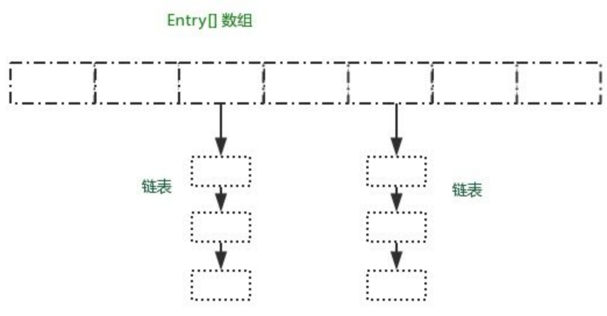
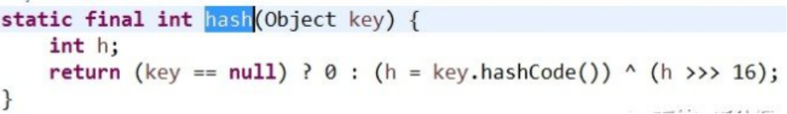
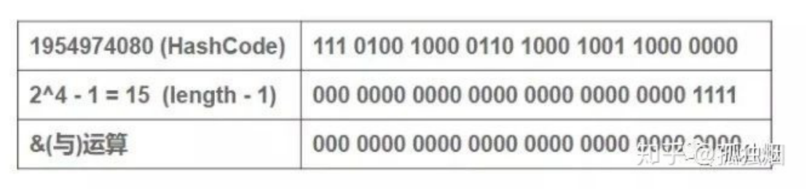
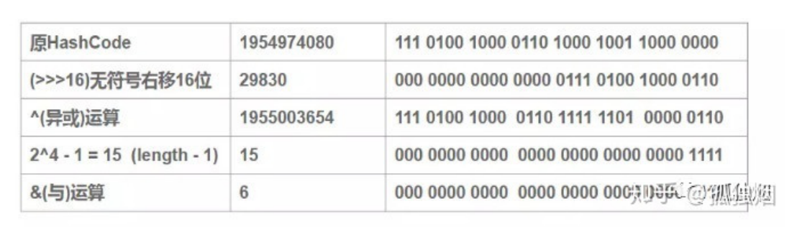
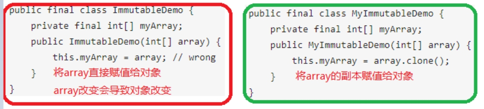

## HashMap

### 1.HashMap实现原理

#### HashMap结构

哈希表结构（链表散列：数组+链表）实现，<font color='red'>结合数组和链表的优点</font>。当链表长度超过 8 时，链表转换为红黑树

 

HashMap使用Node<k,v>(实现Map.Entry)数组,Node是单向链表结构,每个节点的值是key-value，它具有Next指针，可以连接下一个Node<k,v>实体。 

#### 使用Entry数组的原因

**1）不使用LinkedList原因**

在HashMap中，定位桶的位置是利用元素的key的哈希值对数组长度取模得到。通过桶的位置查找数组效率比LinkedList高

**2）不使用ArrayList原因**

ArrayList为数组，查找效率比LinkedList高。但是ArrayList扩容时是1.5倍,而HashMap扩容是2倍,更有利于hash计算

<font color='red'>在JDK1.8中，链表长度大于8的时候，链表会转成红黑树</font>

> <=8时，红黑树的**调整操作**代价高于链表**顺序遍历**
>
> \>8时，红黑树的调整操作代价小于链表顺序遍历

### 2.HashMap的get/put

#### 1）put元素的过程

1) 如果bucket满了(超过load factor*current capacity)，就要resize。

2) 对key的hashCode()做hash运算，计算index; 

3) 如果没碰撞直接放到bucket里； 如果碰撞了，以链表的形式存在buckets后（JDK 1.7 之前使用头插法、JDK 1.8 使用<font color='red'>尾插法</font>）； 

4) 如果碰撞导致链表过长(大于等于TREEIFY_THRESHOLD)，就把链表转换成红黑树

5) 如果节点已经存在就替换old value(保证key的唯一性) 

#### 2）get元素的过程

1) 对key的hashCode()做hash运算，计算index; 

2) 如果在bucket里的第一个节点里直接命中，则直接返回； 

3) 如果有冲突，则通过key.equals(k)去查找对应的Entry;

> 若为树，则在树中通过key.equals(k)查找，O(logn)；
>
> 若为链表，则在链表中通过key.equals(k)查找，O(n)。

### 3.HashMap扩容

#### 扩容条件

bucket满了(超过load factor*current capacity)，为了最大程度<font color='red'>避免哈希冲突</font>，就要resize。

>  load factor为0.75
>
>  current capacity为当前数组大小

#### 扩容方式

**<font color='red'>二次幂扩容</font>：定位效率高，hash冲突少**

> 将数据放在HashMap中,位置为hash%length,但是hash%length==hash&(length-1),且hash&(length-1)效率高.最终使用hash&(length-1)确定位置
>
> 长度为8时候，3&(8-1)=3 2&(8-1)=2 ，不同位置上，不碰撞。 而长度为5的时候，3&(5-1)=0 2&(5-1)=0，都在0上，出现碰撞了.所以二次幂扩容可以减少碰撞.

扩容后，对于每个key需要重新计算下标：**新下标=原下标 或 原下标+旧数组的大小**

### 4.Hash值获取

#### HashMap中的hash算法

 

 

若直接使用hashCode&(length-1)

当我们的length为16的时候，哈希码(字符串“abcabcabcabcabc”的key对应的哈希码)对(16-1)与操作，对于多个key生成的hashCode，只要哈希码的后4位为0(<font color='red'>高位需要参与计算</font>）,最终的结果均为0,容易碰撞.

 

加上高16位异或低16位的“扰动函数”,并采用异或（<font color='red'>任意一位变化，hash值变化</font>）计算，减小碰撞几率

 

#### 其他hash算法

hash算法作用:Hash函数是指把一个大范围映射到一个小范围,以节省空间，使得数据容易保存。 比较出名的有MurmurHash、MD4、MD5等等

#### hash冲突的解决办法

(1)开放定址法

(2)链地址法

(3)再哈希法

#### String中hashcode的实现
**代码**

```java
    public int hashCode() {
       int h = hash;
       if (h == 0 && value.length > 0) {
            char val[] = value;
            for (int i = 0; i < value.length; i++) {
                h = 31 * h + val[i];
            }
            hash = h;
        }
        return h;
	}
```

**计算公式**
hash(s)=s[0]\*31^(n-1) + s[1]\*31^(n-2) + ... + s[n-1]

> 以<font color='red'>31</font>为权，每一位为字符的ASCII值进行运算，用自然溢出来等效取模。
> 31是一个奇质数，所以31\*i=32*i-i=(i<<5)-i，这种位移与减法结合的计算相比一般的运算快很多。

### 5. HashMap与其他相似结构

#### HashMap，LinkedHashMap，TreeMap 有什么区别？

**LinkedHashMap**

 保存了记录的**插入顺序**，在用 Iterator 遍历时，先取到的记录肯定是先插入的；遍历比 HashMap 慢；

**TreeMap**

 实现 SortMap 接口，能够把它保存的记录**根据键排序**（默认按键值升序排序，也可以指定排序的比较器）


#### HashMap 和 HashTable 有什么区别？
①、HashMap 是线程不安全的，HashTable 是线程安全的；所以 HashTable 的效率比不上 HashMap；

②、HashMap 需要重新计算 hash 值，而 HashTable 直接使用对象的 hashCode；

③、HashMap最多只允许一条记录的键为null，允许多条记录的值为null，而 HashTable不允许；

④、HashMap 默认初始化数组的大小为16，HashTable 为 11，前者扩容时，扩大两倍，后者扩大两倍+1；

 

### 6. Jdk1.8 对HashMap的改进

**1） 数组+链表的结构改为数组+链表+红黑树**

当元素小于8个时候，链表结构已经能保证查询性能。红黑树需要进行左旋，右旋，变色这些操作来保持平衡，性能较低

当元素大于8个的时候，此时需要红黑树来加快查询速度，但是新增节点的效率变慢了。

**2）优化了高位运算的hash算法：h^(h>>>16)**

**3）链表扩展使用尾插法,避免头插法引起的死循环**

https://blog.csdn.net/chenyiminnanjing/article/details/82706942

### 7.ConCurrentHashMap

#### 并发环境HashMap的问题

> 1）多个put线程导致扩容，形成循环链表,导致死循环（jdk1.8已解决）
>
> 2）多线程put的时候可能导致元素丢失(对同一位置存储,导致存储覆盖)
>
> 3）put非null元素后get出来的却是null

#### 怎么解决这些问题的？

比如ConcurrentHashmap，Hashtable等线程安全等集合类。

对HashMap加锁效率较ConcurrentHashMap低,HashMap会锁整个对象

​	ConcurrentHashMap在对象中保存了一个Segment数组，即将整个Hash表划分为多个分段；在执行put操作时首先根据hash算法定位到元素属于哪个Segment，然后对该Segment加锁即可。因此，ConcurrentHashMap在多线程并发编程中可是实现多线程put操作

 

### 8. HashMap的key?

#### HashMap的key

一般用Integer、String这种不可变类当HashMap当key，而且String最为常用。

 

(1)因为字符串是不可变的，所以在它创建的时候hashcode就被缓存了，不需要重新计算。这就使得字符串很适合作为Map中的键，字符串的处理速度要快过其它的键对象。这就是HashMap中的键往往都使用字符串。

(2)因为获取对象的时候要用到equals()和hashCode()方法，那么键对象正确的重写这两个方法是非常重要的,这些类已经很规范的覆写了hashCode()以及equals()方法。

 

#### 实现一个自定义的class作为HashMap的key

**重写hashcode和equals方法**

a) hashcode与equals

> 重写equals()方法后,必须重写hashcode()方法,hashcode与对象是一对多关系,但一般是一对一
>
> HashSet与HashMap判断两个对象是否相同,先比较hashcode;若相等,再执行eqauls

b) equals()设计原则

> l 自反性：A.equals(A)要返回true
>
> l 对称性：如果A.equals(B)返回true，那么B.equals(A)也要返回true
>
> l 传递性：如果A.equals(B)返回true，B.equals(C)为true, 则A.equals(C)也要为true. 说白了就是 A = B , B = C , 那么A = C.
>
> l equals(null) 要返回false.


**设计一个不变类**

(1)类添加final修饰符，保证类不被继承。

(2)保证所有成员变量必须私有，并且加上final修饰 通过这种方式保证成员变量不可改变。但只做到这一步还不够，因为如果是对象成员变量有可能在外部改变其值。所以第5点弥补这个不足。

(3)不提供改变成员变量的方法，包括setter 避免通过其他接口改变成员变量的值，破坏不可变特性。

(4) 在getter方法中，不要直接返回对象本身，而是克隆对象，并返回对象的拷贝 这种做法也是防止对象外泄，防止通过getter获得内部可变成员对象后对成员变量直接操作，导致成员变量发生改变。

(5) 通过构造器初始化所有成员，进行深拷贝(deep copy) 如果构造器传入的对象直接赋值给成员变量，还是可以通过对传入对象的修改进而导致改变内部变量的值

