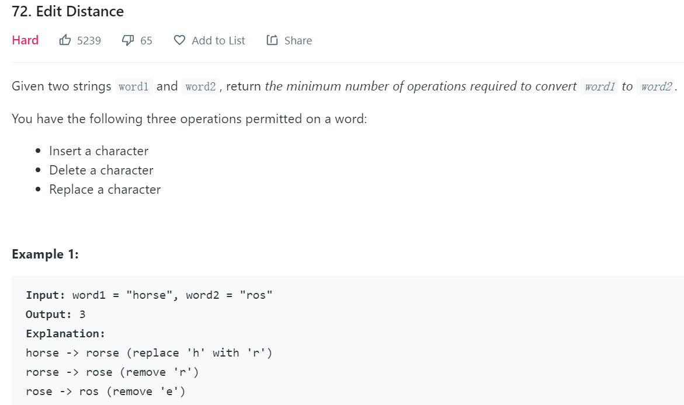

## 	动态规划算法

### [理论知识](https://www.cnblogs.com/steven_oyj/archive/2010/05/22/1741374.html)

#### 基本概念

动态规划过程是：每次决策依赖于当前状态，决策又引起状态的转移。

一个决策序列就是在变化的状态中产生出来的，这种多阶段最优化决策解决问题的过程就称为动态规划。

#### 动态规划问题的性质

符合以下条件的问题才适合用动态规划解题。

**最优化原理**

问题的最优解所包含的子问题的解也是最优的，就称该问题具有最优子结构，即满足最优化原理。

**无后效性**

某状态的决策只与当前状态有关，不受之后的决策和状态影响。

**有重叠子问题**

子问题之间是不独立的，一个子问题在下一阶段决策中被不同的子问题用到。*（该性质并不是动态规划适用的必要条件，但是如果没有这条性质，动态规划算法同其他算法相比就不具备优势）*

### 动态规划解题模板

> 动态规划、问题**存在「重叠子问题」**，暴力穷举的话效率低下，需要「备忘录」或者「DP table」来优化穷举过程。
>
> 动态规划三要素：重叠子问题、最优子结构、状态转移方程。

#### 确定动态规划可解

**判断问题是否符合动态规划的性质？**

最优化原理，无后效性，重叠子问题

#### 确定状态转移方程

##### 青蛙跳台阶为例

1、**确定基本状态**

```
f(1)=1;//1级台阶只有一种跳法
```

2、**确定「选择」，即导致「状态」产生变化的行为**。

```
在n级台阶
可选择向上跳1级到n+1
可选择向上跳2级到n+2
```

3、**汇总「状态」，即选择导致的状态转移**。

```
n级台阶可由n-2级台阶跳2阶和由n-1级台阶跳1阶到达。
f(n)=f(n-2)+f(n-1)
```

##### [629. K个逆序对数组](https://leetcode-cn.com/problems/k-inverse-pairs-array/)

```
给出两个整数 n 和 k，找出所有包含从 1 到 n 的数字，且恰好拥有 k 个逆序对的不同的数组的个数。
逆序对的定义如下：对于数组的第i个和第 j个元素，如果满i < j且 a[i] > a[j]，则其为一个逆序对；否则不是。
```

若f\[i][j]表示i个数字恰好拥有j个逆序对的数量,那么可以得到以下递推关系(因为每新增一个数i,可以与i-1个数的组合得到现有结果)


> 连续多项和可使用前n项和数组可以提高时间和空间效率,但代码编写有点复杂

**<font color='red'>递推关系不一定是一个式子得到,可能由多个式子组合得到</font>**

由以下两个式子组合


可得到


#### **明确 `dp` 函数/数组的定义**。

确定了状态转移方程后，就可对问题进行暴力求解。


由于动态规划规划问题具有重叠子问题的性质，使用dp对子问题状态进行保存（**状态压缩**），避免暴力求解。


优化结构后，得到一维dp数组：


## [动态规划实例](https://zhuanlan.zhihu.com/p/93771521)

### 坐标型动态规划

状态: f(x)表示从起点到坐标x的结果值, f(x，y)表示从起点走到坐标x,y的结果值;

选择:在x/(x,y)走下一步

#### 64 最小路径和

**问题描述**


**确认状态**

使用dp\[i][j]表示到达(i,j)的最小路径和。

**基本状态**

dp\[0][0]=arr\[0][0]

> 某些情况使用空余位置，使代码更整洁。
>
> int\[][] dp=new int\[row+1][col+1];
>
> 并从i=1,j=1开始遍历，就不必单独处理基本状态了。

**汇总选择导致的状态转移**

dp\[i][j]=min(dp\[i][j-1],dp\[i-1][j])+arr\[i][j]

#### 70 跳台阶

**问题描述**


#### 120 三角形中的最小路径和

​	**问题描述**

**确认状态**

使用dp\[i][j]表示从底部到(i,j)的最小路径和

**基本状态**

dp\[n-1][j]=arr\[n-1][j],n为三角形的高度

**汇总选择导致的状态转移**

dp\[i][j]=min(dp\[i+1][j],dp\[i+1][j+1])+arr\[i][j]

#### 62 路径总数

**问题描述**


**汇总选择导致的状态转移**

dp\[i][j]=dp\[i-1][j]+dp\[i][j-1]

**数学解决方法**

dp\[m][n]=C<sub>m+n</sub><sup>m</sup>

#### 63 路径总数2

**问题描述**


**汇总选择导致的状态转移**

dp\[i][j]=dp\[i-1][j]+dp\[i][j-1]

石头所在处的dp\[i][j]=0，并不进行更新。

### 单序列动态规划

状态: f[i]表示前i个位置/数字/字符, 第i个; 

状态转移方程: f[i] = f(f[j]), j是i之前的一个位置;

 初始化: f[0]; 答案: f[n-1]; 

小技巧: 一般有N个数字/字符, 就开N+1个位置的数组, 第0个位置单独留出来作初始化

#### 300 最长递增序列

**问题描述**


**确定dp数组/备忘录**

方式1

> 使用dp数组最长递增数信息，dp[i]表示截止到nums[i]时的最长递增序列长度。
>
> 对于序列1,4,5,2,3,4，在处理i=4，dp[4]=1,3,5;处理i=5，dp[5]=1,2,3,4,改变了dp[4]=1,2,3

方式2

> 使用dp数组存储最长递增序列，dp[i]表示截止到nums[i]时的最长递增序列
>
> 对于序列1,4,5,2,3,4，在处理i=3，dp[2]=1,4,5→dp[3]=1,2,5(最终结果不变，但却仍能处理之后的3,4)
>
> 本问题可共用一个list存储最长递增序列，不毕为每个索引分配一个list

**汇总选择导致的状态转移**

dp[i-1]→dp[i]

> 若num[i]>list[-1],直接将nums[i]添加到list末尾
>
> 否则使用插入排序的方式将nums[i]置于list中，并将list原来位置的数值剔除。便于后序更新list，但不影响list长度（最终结果）

#### 198 打家劫舍

**问题描述**


**基本状态**

dp[0]=nums[0]

dp[1]=max(nums[0],nums[1])

**汇总选择导致的状态转移**

对于第i家

> 若第i-1家被偷，则dp[i]=dp[i-1]
>
> 若第i-1家不被偷,则第i家可被偷，则dp[i]=dp[i-2]+nums[i]

#### 213 打家劫舍2

**问题描述**


**解题思路**

环形房子，那么第一家和最后一家不能同时打劫。

问题可拆分成

> A:不打劫第一家，问题转换为nums[0:len-1]
>
> B:不打劫最后一家，问题转换为nums[1:len]
>
> ------
>
> 以上两种情况包含了所有合理情况。AUB+A∩B=1，而A∩B表示第一家和最后一家都打劫，不属于合理情况。

#### 55 跳跃游戏

**问题描述**


**贪心解决**

使用x记录从0开始，能到达的最远距离。

遍历nums，若x>=nums.len-1,则返回true

#### 45 跳跃游戏2

**问题描述**


**代码实现**

使用dp数组作为备忘录，dp[i]表示到索引i所需跳跃的最小次数。

使用longest作为最远可达位置，若某次跳跃没超出longest，则无需更新dp，因为一定比原dp大。

```java
class Solution {
    public int jump(int[] nums) {
        int[] dp=new int[nums.length];
        Arrays.fill(dp,1,nums.length,Integer.MAX_VALUE);
        int longest=0;
        for(int i=0;i<nums.length;i++){
            if(i+nums[i]>longest){
                longest=i+nums[i];
                for(int j=i+1;j<=longest&&j<nums.length;j++){
                    dp[j]=Math.min(dp[j],dp[i]+1);
                }
            }
        }
        return dp[nums.length-1];
    }
}
```

#### 跳跃游戏3,4,5待完成

#### 139 word break

**问题描述**


**解题思路**

本题可看作完全背包问题，背包容量为字符串s，物品为word（不受限制）

**dp数组确认**

dp=new boolean\[s.length+1][wordDict.size()]

dp\[i][j]表示已字符wordDict[j]结尾能否表示s[0:i]

**基本状态**

dp\[0][i]=true,初始为真（相当于s为空）

**汇总终点一致的选择**

len(idx)=wordDict[idx].len

U<sub>idx</sub>表示表达式中所有项并运算结果

dp\[i][j]=∪<sub>idx</sub>{U<sub>wd</sub>dp\[i-len(idx)][wd]&&wordDict[idx].equals(s[i-len(idx):i])}

#### 132 回文串分割

**问题描述**


**问题分析**

使用arr\[][]保存字符串的回文信息，若arr\[i][j]=true,则表示s[i:j+1]是回文串

使用dp[]保存字符串最短回文数，dp[i]表示s[0:i]的最短回文数。

### 双序列动态规划

状态: f\[i][j]表示第一个sequence的前i个数字/字符, 配上第二个sequence的前j个;

状态转移方程: f\[i][j] = 研究第i个和第j个的匹配关系; 

初始化: f\[i][0]和f\[0][i];

结果: f\[n][m], 其中n = s1.length(); m = s2.length();

#### 1143 最长公共子串

**问题描述**


**状态设置**

使用dp\[m+1][n+1]保存公共子串的匹配信息，dp\[i][j]=num表示text1[0:i]与text2\[0:j]的最长公共子串为num

**初始状态**

dp\[0][j]=0

dp\[i][0]=0

**汇总状态转移**

若text1[i-1]==text2[j-1]，dp\[i][j]=dp\[i-1][j-1]+1

若text1[i-1]!=text2[j-1]，dp\[i][j]=max(dp\[i-1][j],dp\[i][j-1],dp\[i-1][j-1])

#### 72 Edit Distance

**问题描述**



**状态设置**

使用dp\[m+1][n+1]保存编辑信息，dp\[i][j]表示word1\[0:i]到word2\[0:j]的最小编辑距离。

**初始状态**

dp\[0][j]=j

dp\[i][0]=i

**汇总状态转移**

若text1[i-1]==text2[j-1]，dp\[i][j]=dp\[i-1][j-1]

若text1[i-1]!=text2[j-1]，dp\[i][j]=min(dp\[i-1][j],dp\[i][j-1],dp\[i-1][j-1])+1

#### 115 Distinct Subsequences

**问题描述**


**状态设置**
使用dp\[m+1][n+1]保存子串匹配信息，dp\[i][j]表示t[0:i]与s[0:j]的匹配数量

**初始状态**

dp\[0][j]=0

dp\[i][0]=1

**汇总状态转移**

若t[i-1]==s[j-1]，dp\[i][j]=dp\[i-1][j-1]+dp\[i][j-1]

若t[i-1]!=s[j-1]，dp\[i][j]=dp\[i][j-1]

#### 97 Interleaving String


**状态设置**

使用dp\[m+1][n+1]保存数组的拼接信息。dp\[i][j]=true表示s1[0:i]与s2[0:j]能拼接成s3[0:i+j-1]

**汇总状态转移**

若dp\[i-1][j]==true&&s1[i-1]==s[i+j-1]，dp\[i][j]=true	s1与s3匹配

若dp\[i][j-1]==true&&s2[j-1]==s[i+j-1]，dp\[i][j]=true	s2与s3匹配

### 划分型dp

给定长度为N的序列或字符串，要求划分成若干段

1. 段数不限，或指定K段
2. 每一段满足一定的性质

#### 股票买卖

https://leetcode-cn.com/circle/article/qiAgHn/

将股票的买入和卖出都作为一个状态，再对每个状态、每个日期进行动态规划。

#### 43 最大子数组3（领扣）

**问题描述**


##### 划分型dp

dp\[m+1][n+1]存储状态，dp\[i][j]表示List[0:i]分成j组的和最大值

max\[m][m+1]存储连续最大和，max\[i][j]表示List[i:j]中连续最大和

**max的求解**

max\[left][right]求解，这里不直接对max\[i][j]进行动态规划。

```java
	public int maxNums(int[] nums, int left, int right){
        int max = Integer.MIN_VALUE;
        int[] dp = new int[nums.length];
        dp[left] = nums[left];
        max = dp[left];
        for (int i = left + 1; i < right; i ++){
            dp[i] = Math.max(dp[i - 1], 0) + nums[i];
            max = Math.max(dp[i], max);
        }
        return max;
    }
```

若将max\[i][j]动态规划，则需要判断List[j-1]是否被选来判断所代表的最大值是否连续。

**汇总状态转移**
dp\[i][j]=max(dp\[k][j-1]+max\[j][k])   j-1<=k<=i

##### 局部dp与全局dp

**dp状态**

local\[m+1][k+1]和global\[m+1][k+1]存储状态

local\[i][j]表示List[i-1]**一定**在分组中的和最大值。

global\[i][j]表示List[i-1]不一定在分组中的和最大值。

**基本状态**

local\[i][i]=local\[i-1][i-1]+List[i-1]	每组一个数字

global\[i][i]=local\[i-1][i-1]+List[i-1]	每组一个数字

**汇总状态转移**

local\[i][j]=max(local[i-1]\[j],global[i-1]\[j-1])+List[i-1]	List[i-1]进入原分组/创建新分组

global\[i][j]==max(global[i-1]\[j],local[i]\[j])					  List[i-1]是否进入分组。

#### 抄书

**问题描述**


**dp状态**

dp\[m+1][n+1]存储状态，dp\[i][j]表示i个人抄j本书最少时间

**基本状态**
dp\[i][i]=max(book[0:i])

**汇总状态转移**
dp\[i][j]=min(dp\[i-1][i-1]+sum(book[i:j]),...dp\[i-1][k]+sum(book[k:j]))   最后一人抄(j-k)本书，i-1<k<j


### 背包问题

参考链接：https://zhuanlan.zhihu.com/p/150676736?from_voters_page=true

#### 背包问题概述

**特点:** 

> 1) 背包容量作为DP维度,
>
> 2) DP过程就是填写矩阵, 
>
> 3) 可以滚动数组优化

**状态**: 

f\[i][S]前i个物品, 取出一些能否组成和为S

**状态转移方程**: 

> i装入背包：f\[i][S] = f\[i-1][S-a[i]] 
>
> i不装入背包：f\[i][S]=f\[i-1][S]; 

**初始化**: 

f\[i][0]=true; 

f\[0][1...target]=false; 

**结果**: 

检查所有f\[n][j]

#### 背包问题分类

1.如果是0-1背包，即数组中的元素不可重复使用，nums放在外循环，target在内循环，且内循环倒序；

```text
for num in nums:
    for i in range(target, num-1, -1):
```

2.如果是完全背包，即数组中的元素可重复使用，nums放在外循环，target在内循环。且内循环正序。

```text
for num in nums:
    for i in range(num, target+1):
```

3.<font color='red'>如果组合问题需考虑元素之间的顺序，需将target放在外循环，将nums放在内循环</font>（**未遇到**）。

```text
for i in range(1, target+1):
    for num in nums:
```

#### 416 分割等和子集（medium）

**问题描述**


##### 二维dp

**dp状态**
dp\[m][n+1]记录长度为m的物品数组，背包空间为n的状态，dp\[i][j]=true表示前i个物品恰能装满j-1空间的包

**汇总状态转移**

dp\[i][j]=dp\[i-1][j]||dp\[i-1][j-nums[i]]	不装第i个物品时∪装第i个物品时

##### 一维dp

**dp状态**

dp[n+1]记录背包空间为n的状态，dp[i]表示容量为i的背包是否恰能装满

**汇总状态转移**

对于每个物品j，从后往前遍历dp

若dp[i-nums[j]]==true，dp[i]=dp[i-nums[j]]

**代码**

空间优化后

```java
    public boolean canPartition(int[] nums) {
        int total= Arrays.stream(nums).sum();
        if(total%2!=0){
            return false;
        }
        int cap=total/2;
        boolean[] dp=new boolean[cap+1];
        dp[0]=true;
        for(int i=1;i<=nums.length;i++){
            //0-1背包问题，从后往前计算，避免数字重复计算。
            for(int j=nums[i-1];j<=cap;j++){
                if(dp[j-nums[i-1]]){
                    dp[j]=true;
                }
            }

        }
        return dp[cap];
    }
```

#### 494 Target sum

**问题描述**


**dp状态**

dp\[m+1][n+1]记录数字的和状态，dp\[i][j]表示前i-1个数可以计算得到j-1的种类数

这里n为2*len<sub>num</sub>+1,先认为所有数都为-，不放入背包，+操作表示将数放进背包。

**汇总状态转移**

dp\[i][j]=dp\[i-1][j-nums[i-1]]+dp\[i-1][j]

**本题也可使用一维dp完成**

#### 474 Ones and Zeroes

**问题描述**


**dp状态**

dp\[i]\[m][n]记录状态，dp\[i]\[j][k]表示第i个字符串时，对于容量为j和k的最大子集数

**汇总状态转移**

dp\[i]\[j][k]=dp\[i-1]\[j][k]+dp\[i-1]\[j-zero(i)][k-one(i)]

**本题可用二维dp**


```java
public class Solution {
    public int findMaxForm(String[] strs, int m, int n) {
        int[][] dp = new int[m + 1][n + 1];
        for (String s: strs) {
            int[] count = countzeroesones(s);
            for (int zeroes = m; zeroes >= count[0]; zeroes--)
                for (int ones = n; ones >= count[1]; ones--)
                    dp[zeroes][ones] = Math.max(1 + dp[zeroes - count[0]][ones - count[1]], dp[zeroes][ones]);
        }
        return dp[m][n];
    }
    public int[] countzeroesones(String s) {
        int[] c = new int[2];
        for (int i = 0; i < s.length(); i++) {
            c[s.charAt(i)-'0']++;
        }
        return c;
    }
}
```

#### 322 Coin Change

**问题描述**


**dp状态**

dp\[m+1][n+1]存储状态，dp\[i][j]表示coins[0:i]构成j-1的最小硬币数。

**dp基本状态**
dp\[0][j]=amount+1	**相当于本题的最大值**

dp\[0][0]=0

**汇总状态转移**

dp\[i][j]的最小硬币数为硬币数<sub>coins[0:i-1]构成j-1</sub>与硬币数<sub>coins[0:i-1]构成j-1-coins[i-1]再加上coins[i-1]</sub>的最小值

dp\[i][j]=Math.min(dp\[i-1][j],dp\[i-1][j-coins[i-1]]+1)

**最终结果**

dp\[m][n]==amount+1?-1:dp\[m][n]	若结果为amount+1则说明不能组成amount

#### 518 coins change 2

**问题描述**


**dp状态**

dp\[m+1][n+1]存储状态，dp\[i][j]表示coins[0:i]构成j-1的方法数。

**汇总状态转移**
dp\[i][j]=dp\[i-1][j]+dp\[i-1][j-coins[i-1]]+1

#### 139 word break

**问题描述**


**dp状态**
dp\[m+1][n+1]存储状态，dp\[i][j]=true表示wordDict[0:i]可组成s[0:j]

**汇总状态转移**
dp\[i][j]=dp\[i-1][j]||dp\[i-1][j-len(wordDict[i])]

#### 377 combination Sum IV

**问题描述**


**dp状态**
dp\[m+1][n+1]保存状态，dp\[i][j]表示num[0:i]组成j-1的组合数

**汇总状态转移**
dp\[i][j]=dp\[i-1][j]+dp\[i-1][j-nums[i-1]]

### 区间型动态规划

#### 区间动态规划特点

 1). 求一段区间的解max/min/count;

 2). 初始化状态一般为dp\[i][i+1]（最小区间）

 3). 转移方程通过区间更新; 一个大区间由多个小区间构成：dp\[i][j]=max(dp\[i][k]+dp\[k][j])  i<k<j

 4). 从大到小的更新; 这种题目共性就是区间最后求[0, n-1]

 

#### 476 石子归并（lintcode）

**问题描述**


**dp状态**
dp\[m][m+1]存储状态，dp\[i][j]表示stones[i:j]的最小合并代价

**基础状态**
dp\[i][i+1]=stones[i]	只有一个石子

**汇总状态转移**

dp\[i][j]=min<sub>i<k<j</sub>{dp\[i][k]+dp\[k][j]}

#### 312 burst balloons

**问题描述**


**dp状态**
dp\[m+2][m+3]存储状态，dp\[i][j]表示newNums[i:j]的最大coins

**基础状态**
newNums={1,nums,1}

dp\[i][i+1]=nums[i-1]\*nums[i]\*nums[i+1]

**汇总状态转移**

dp\[i][j]=max<sub>i<k<j</sub>{dp\[i][k]+dp\[k][j]}

#### 87 scramble string

**问题描述**


**dp状态**

使用dp\[len]\[len][len+1]存储状态，dp\[i]\[j][k]=true表示s1[i:i+k]能通过scramble到s2[j:j+k]

**dp基本状态**

dp\[i]\[j][0]=true

**汇总dp状态转移**

dp[i]\[j][k]=true 如果满足以下条件

> 1. s1[i:i+k]=s2[j:j+k]	相等
> 2. dp[i]\[j][l]==true&&dp[i+l]\[j+l][k-l]==true 0<l<k      2个子串scramble
> 3. dp[i]\[j+k-l][l]==true&&dp\[i+l]\[j][k-l]==true  0<l<k  2个子串未scramble但子串本身scrable

#### 1563 stone game5

**问题描述**


**dp状态**

dp[m]\[m]存储状态，dp[i]\[j]表示stoneValue[i:j+1]中alice获取的最大值

**汇总状态转移**

对于dp[i]\[j],对于每个中间值k,取left最大值

若sum[i:k+1]==sum[k+1:j+1] ，则取left=sum[k+1:j+1]+max(dp[i]\[i+k],dp[i+k+1]\[j])

若sum[i:k+1]>sum[k+1:j+1] ，则取left=sum[k+1:j+1]+dp[i+k+1]\[j]

若sum[i:k+1]==sum[k+1:j+1] ，则取left=sum[i:k+1]+dp[i]\[i+k]

**状态转移代码**

左上→右下对角线遍历，索引的变量方式有与上不同。

```java
		for(int i=1;i<len;i++){
            for(int j=0;j+i<len;j++){
                int max=Integer.MIN_VALUE;
                int left=0;
                for(int k=0;k<i;k++){
                    if(sum[j+k+1]-sum[j]==sum[j+i+1]-sum[j+k+1]){
                        left=sum[j+k+1]-sum[j]+Math.max(dp[j][j+k],dp[j+k+1][j+i]);
                    }else if(sum[j+k+1]-sum[j]<sum[j+i+1]-sum[j+k+1]){
                        left=sum[j+k+1]-sum[j]+dp[j][j+k];
                    }else{
                        left=sum[j+i+1]-sum[j+k+1]+dp[j+k+1][j+i];
                    }
                    max=Math.max(max,left);
                }
                dp[j][j+i]=max;
            }
        }
```


### [博弈型动态规划](https://zhuanlan.zhihu.com/p/107741899)

**特点**

一般博弈型动态规划有n人进行轮流操作数组arr，此时需要对arr的每个位置为每人设置一个状态，所以dp数组一般为dp[arr.length]\[n]

**基本状态**

每次操作都有限制条件，将符合限制条件的一次操作取完数组作为基本子问题。

此时，dp[i]\[0]=true,dp[i]\[1]=false（boolean值可被int等其他信息代替）

**状态转移**

对于当前状态，可能存在多种选择，但要做出最有利的选择。

dp[i]\[0]=max(f(i,j)+dp[j]\[1])	j为i选择后的状态，取j状态后手 **加上** i→j的状态转移值的最大值 **作为** i状态的先手最大值。

dp[i]\[1]后手的最大值为dp[i]\[0]操作后的剩余值（<font color='red'>dp[:,1]为被动的数组，所以可通过一定的操作对dp数组降维，dp[]\[]→dp[]</)。

#### 877 stone game

**问题描述**


**dp状态**

dp\[i][j]\[0]表示先手在piles[i:j+1]中获取的最大值

dp[i]\[j][1]表示后手在piles[i:j+1]中获取的最大值

在博弈问题中，先后手的状态是交替的。

**基本状态**

dp[i]\[i][0]=piles[i]

dp[i]\[i][1]=piles[0]

**汇总状态转移**

先手为两种选择的最大值

后手为上一次的先手

```java
		for(int i=1;i<piles.length;i++){
            for(int j=0;i+j<piles.length;j++){
                int left = piles[j] + dp[j+1][j+i][1];
                int right = piles[j+i] + dp[j][j+i-1][1];
                // 套用状态转移方程
                // 先手肯定会选择更大的结果，后手的选择随之改变
                if (left > right) {
                    dp[j][j+i][0] = left;
                    dp[j][j+i][1] = dp[j+1][j+i][0];
                } else {
                    dp[j][j+i][0] = right;
                    dp[j][j+i][1] = dp[j][j+i-1][0];
                }
            }
        }
```

#### 1140 stone Game 2

**问题描述**


**dp状态**

dp[m]\[m][0]存储先手状态，dp[i]\[j][0]表示在piles[i:]中先手拿取j堆石子后能获取的最大石子数

dp[m]\[m][1]存储先手状态，dp[i]\[j][1]表示在piles[i:]中后手拿取j堆石子后能获取的最大石子数

**dp基本状态**

当2*m>len-i时，dp[i]\[m][0]=sum[i:]，dp[i]\[m][1]=0

**汇总状态转移**

dp[i]\[j][0]=max(sum[i:]-dp[i+x]\[max(2*x,j)][0])	所有i,j状态下选择的最大值

dp[i]\[j][1]=sum[i:]-dp[i]\[j][0]	先手的剩余值

<font color='red'>注意：从转移方程上看，dp矩阵的填写方向为，从右到左，从下到上。</font>

#### 1406 stone game 3

**问题描述**


**dp状态确认**
dp\[m+1][0]存储先手状态，dp[i]\[0]表示先手从values[i:]石子的最大值

dp\[m+1][1]存储先手状态，dp[i]\[0]表示后手从values[i:]石子的最大值

**dp基本状态**

考虑到values中可能

**汇总状态转移**

状态从右往左（<font color='red'>从小到大</font>）动态规划

dp[i]\[0]为max（sum<sub>values[i:i+j]</sub>+dp[i+j]\[1]）**当前拿取的石子+之后的后手值**的最大值

dp[i]\[1]为**总值减去先手值**  sum<sub>values[i:]</sub>-dp[i]\[0]

```java
 			dp[i][0] = sum[i + 1] - sum[i] + dp[i + 1][1];
            dp[i][1] = dp[i][1] = sum[len]-sum[i]-dp[i][0];
            for (int j = 1; j < 3&&i+j+1<=len; j++) {
                if (dp[i][0] < sum[i + j + 1] - sum[i] + dp[i + j + 1][1]) {
                    dp[i][0] = sum[i + j + 1] - sum[i] + dp[i + j + 1][1];
                    dp[i][1] = sum[len]-sum[i]-dp[i][0];
                }
            }
```

#### 1510 stone game4

**问题描述**


**dp状态**

dp[m+1]\[0]存储先手状态，dp[i]\[0]=true表示剩余i个石子时，先手取定能获胜

dp[m+1]\[1]存储先手状态，dp[i]\[1]=true表示剩余i个石子时，后手取定能获胜

**dp基本状态**

dp[0]\[0]=false;

dp[0]\[1]=true;

**汇总状态转移**

对于所有j<sup>2</sup><=i

​	若存在dp[i-j<sup>2</sup>]\[1]=true,则dp[i]\[0]=true，dp[i]\[1]=false

​	否则dp[i]\[0]=false，dp[i]\[1]=true

```java
        for(int i=1;i<n+1;i++){
            for(int j=1;j*j<=i;j++){
                dp[i][1]=true;
                if(dp[i-j*j][1]){
                    dp[i][0]=true;
                    dp[i][1]=false;
                    break;
                }
            }
        }
```

#### 1563 stone game5

**问题描述**

该问题不为典型的博弈型动态规划，因为bob只会选择最大值丢弃（仅2个选择），更适合用区间动态规划解决。

