## 图算法

### 图基本概念

#### 图结构

图是一种复杂的非线性结构。

**线性结构**

> 数据元素之间满足唯一的线性关系，每个数据元素(除第一个和最后一个外)只有一个直接前趋和一个直接后继；

**树形结构**

> 数据元素之间有着明显的层次关系，并且每个数据元素只与上一层中的一个元素(parent node)及下一层的多个元素(孩子节点)相关；

**图形结构**

> 节点之间的关系是任意的，图中任意两个数据元素之间都有可能相关

**图G由两个集合V(顶点Vertex)和E(边Edge)组成，定义为G=(V，E)**

#### 图的分类

**有向图和无向图**

     如果边是有方向的则称为有向图，如果边没有方向则称为无向图


​                                                        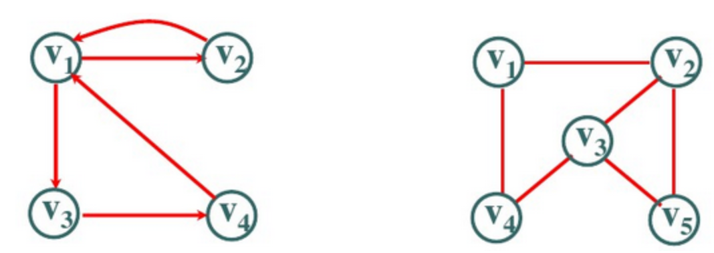

**无权图和带权图**

      对图中的边赋予具有一定意义的数值(路程、费用等等)的图称为带权图


​           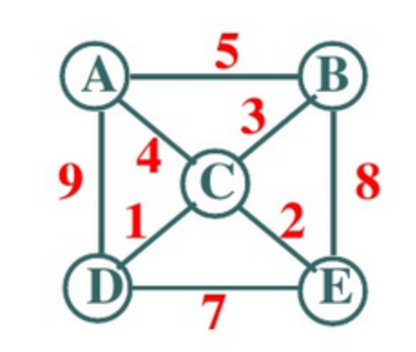               	               

**完全图**

任意两个顶点之间都存在一条边

**稀疏图**

有很少的边

 **稠密图**

有很多的边，最稠密的图就是完全图5、邻接：如果两个顶点在同一条边上，则称它们互为邻接点。即(v, v') ∈ E，v和v'互为邻接点

#### 顶点的度

对于无向图，顶点v的度就是和v相关联的边的条数

对于有向图，顶点v的度分为入度和出度（总入度=总出度）

#### 路径

非空序列V<sub>0</sub> E<sub>1</sub>  V<sub>1</sub>  E<sub>2</sub>  ... V<sub>k</sub> 称为顶点V<sub>0</sub> 到顶点V<sub>k</sub> 的一条路径。

> 无权图的路径长就是路径包含的边数。
> 有权图的路径长要乘以每条边的权。                    

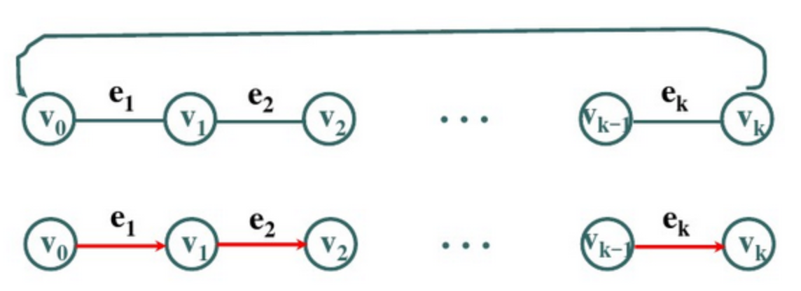

 #### 图的连通性

如果从顶点v到顶点v'有路径或从顶点v'到顶点v有路径，则称顶点v和顶点v'是连通的。

>  如果图中任意两个顶点都是连通的，则称该图是**连通图**。
>  对于有向图，如果图中每一对顶点V<sub>i</sub>和V<sub>j</sub>是双向连通的，则该图是**强连通图**。

#### 生成树

**一个连通图G的一个包含所有顶点的极小连通子图T**

​     ①T包含G的所有顶点(n个)

​     ②T为连通图

​     ③T包含的边数最少(n-1条)


 **生成树的性质**

   ⑴一个有n个顶点的连通图的生成树有且仅有n-1条边

   ⑵一个连通图的生成树并不唯一

### [图的存储](https://blog.csdn.net/weixin_37853880/article/details/80320765)

#### 邻接矩阵

**邻接矩阵用两个数组保存数据**：

> 一维数组存储图中顶点信息
>
> 二维数组存储图中边的信息

**无向图中二维数组是个对称矩阵**

​                   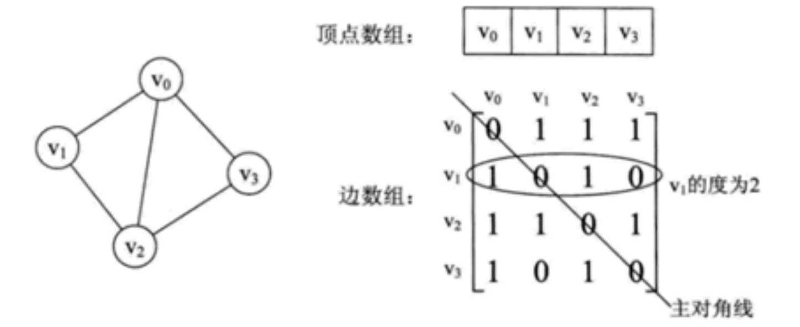


**特点**：

1. 0表示这两个顶点之间没有边，1表示有边

2. 顶点的度是行内数组之和

3. 求顶点的邻接点，遍历行内元素即可

4. 有向图的邻接矩阵：各行之和是出度，各列之和是入度

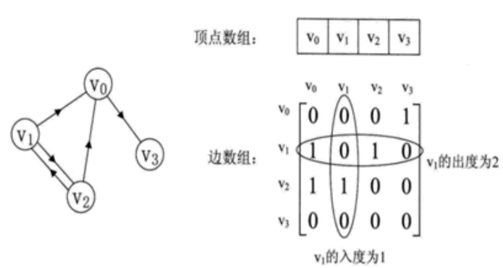

**带权图的邻接矩阵表示:**

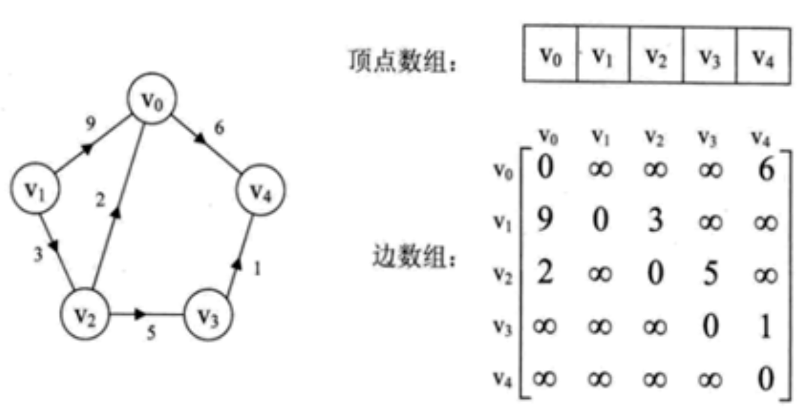

**邻接矩阵的缺点：**邻接矩阵的存储方式对于边数远远小于顶点数的图，在空间上是极大的浪费！

#### 邻接表

用数组和链表相结合的方式存储图（类似于链表的数组）

```java
class Graph{
	Vertex[] VTables;//节点数组
	boolean[] visited;//是否访问过
}
```


​                 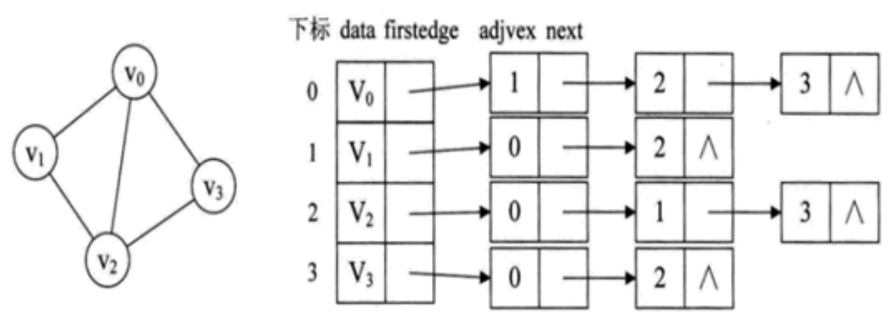


数组元素的类型可以表示为一个类：

```c
class Vertex  {
    Value v; // 值
    Adjacent p;   // 指向链表节点的第一个节点
};
```


链表节点的类型也声明为一个结构体：   

```c
class Adjacent {
    int index;  // 存储某顶点的邻接点在数组中的下标位置 
    Adjacent next; // 指向下一邻接
};
```

有向图可以用两个邻接表存储:

> 出度表叫邻接表
>
> 入度表叫逆邻接表

​                  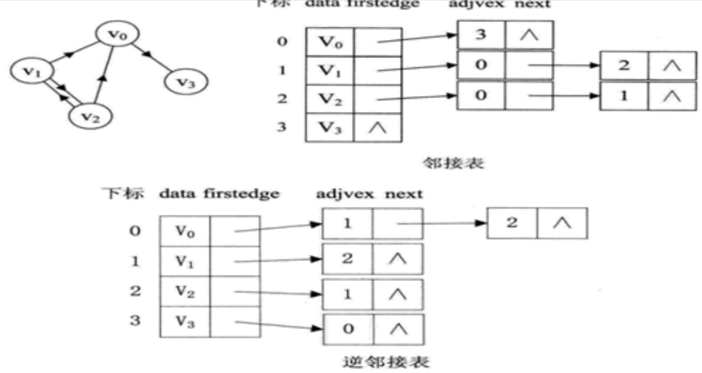

**邻接表缺点：**邻接表对于有向图的表示分为邻接表和逆邻接表，无法从一个表中获取某顶点的出度和入度情况

#### 十字链表

邻接表对于有向图的表示分为邻接表和逆邻接表，无法从一个表中获取某顶点的出度和入度情况，所以提出了十字链表的存储方式。

**顶点表：**

​              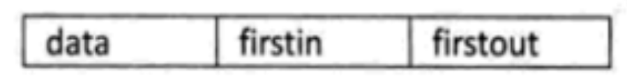

> firstin：入边表头指针，指向顶点入边表的第一个节点
>
> firstout：出边表头指针，指向顶点出边表的第一个节点
>

**边表：**

​              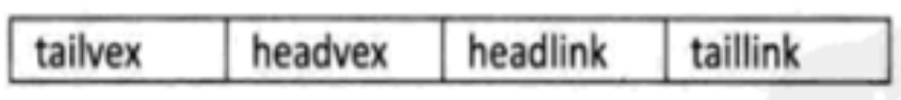 

> tailvex：边起点在顶点表的下标
>
> headvex：边终点在顶点表的下标
>
> headlink：入边表指针，指向终点相同的下一条入边；
>
> taillink：出边表指针，指向起点相同的下一条出边

### 图常用算法

#### DFS深度优先遍历

**邻接表**

```java
  public void DFS(int[][] Graph){
      for(int i=0;i<Graph.length;i++){
          if(!visited[i]){
              DFS(Graph,i)
          }
      }
  }
  public void DFS(int[][] Graph,int i){
      int j;
      visited[i]=true;
      System.out.print("顶点"+i+"\t");
      for(j=0;j<Graph.length;j++){
          if(Graph[i][j]!=0&&visited[j]==false){
              DFS(Graph,j);
          }
      }
  }
```

**邻接表**

```java
	public void DFS(Graph G){
        for(int i=0;i<G.VTables.length;i++){
            if(!G.visited[i]){
                DFS(G,i);
            }
        }
    }
	public void DFS(Graph G, int i) {
		System.out.println(G.VTables[i].value);
		G.visited[i] = true;
		
		for(Adjacent p = G.VTables[i].p;p!=null;p=p.next;)
			if(!G.visited[p.index]){
				DFS(G,p.index);
			}
		}
	}
```

#### BFS广度优先遍历

**邻接矩阵**

```java
	public void BFS(int[][] G){
        for(int i=0;i<G.length;i++){
            if(!visited[i]){
                BFS(G,i);
            }
        }
    }
	public void BFS(int[][] G,int i){	
		Queue<Integer> queue = new LinkedList<Integer>();//创建一个队列
		queue.add(i);
		while(!queue.isEmpty()){
			Integer v = queue.poll();
			System.out.println(v);
			visited[i]= true;

			for(int j=0;j<G[v].length;j++){
                if(!visited[j]){
                    queue.push(j)
                }
            }
		}
	}
```

**邻接表**

```java
	public void BFS(Graph G){
        for(int i=0;i<G.VTables.length;i++){
            if(!G.visited[i]){
                BFS(G,i);
            }
        }
    }
	public void BFS(Graph G, int i) {
        Queue<Integer> queue = new LinkedList<Integer>;
        queue.add(i);
		System.out.println(G.VTables[k].value);
		
        while(!queue.isEmpty()){
            Integer v=queue.poll();
            G.visited[v]=true;
            for(Adjacent p = G.VTables[k].p;p!=null;p=p.next;){
                if(!G.visited[p.index]){
                    queue.add(p.index)
                }
        	}
        }
	}
```

#### 最小生成树算法

**Prim算法**
将图分为A(最小生成树的子集)和G-A两部分，每次向A中添加G-A中到A距离最短的节点。

```java
void Prim(G,T){
    T=∅;//初始化空树
    U={w};//添加任一顶点w
    while((V-U)!=∅){//若树中不含全部顶点
		设(u,v)是使u∈U与v∈(V-U),且权值最小边;
        T=T∪{(u,v)};//边归入树
        U=U∪{v};//顶点归入树
    }
}
```

**Kruskal算法（并查集）**

将图视为n个不连通分量，每次取出节点属于不同连通分量且具有最小权值的边加入结果。

```java
void Kruskal(V,T){
    T=V;//初始化树T,仅含顶点
    numS=n;//不连通分量树
    while(numS>1){//若不连通分量数大于1
        从E中取出权值最小的边(v,u);
        if(v和u属于T中不同的连通分量){
            T=T∪{(u,v)};//将次变加入生成树
            numS--;//不连通分量树减1
        }
    }
}
```

**Prim与Kruskal算法对比**

Prim算法对节点进行处理，适用于稠密图。

Kruskal算法对边进行处理，适用于稀疏图。

#### 拓扑排序

**定义**

对一个有向无环图G进行拓扑排序，是将G中所有顶点排成一个线性序列，使得图中任意一对顶点u和v，若边<u,v>∈E(G)，则u在线性序列中出现在v之前。

**算法思路**

1. 扫描所有有向边，统计所有节点的入度，并使用队列保存入度为0的节点。

2. 从队列头遍历，对于出队的每个节点，将与其相邻的节点入度减1。
3. 重复步骤2，直至队列为空。

**代码**

```java
class Solution {
    public void canFinish(int numCourses, int[][] prerequisites) {
        int[] indegrees = new int[numCourses];
        List<List<Integer>> adjacency = new ArrayList<>();
        Queue<Integer> queue = new LinkedList<>();
        for(int i = 0; i < numCourses; i++)
            adjacency.add(new ArrayList<>());
        // Get the indegree and adjacency of every course.
        for(int[] cp : prerequisites) {
            indegrees[cp[0]]++;
            adjacency.get(cp[1]).add(cp[0]);
        }
        // Get all the courses with the indegree of 0.
        for(int i = 0; i < numCourses; i++)
            if(indegrees[i] == 0) queue.add(i);
        // BFS TopSort.
        while(!queue.isEmpty()) {
            int pre = queue.poll();
            //visit node
            System.out.println(pre);
            for(int cur : adjacency.get(pre))
                if(--indegrees[cur] == 0) queue.add(cur);
        }
    }
}
```

#### [最短路径](https://leetcode-cn.com/problems/network-delay-time/solution/dirkdtra-by-happysnaker-vjii/)

##### [Dijkstra算法](https://blog.csdn.net/mayifan_blog/article/details/85684916)

要求:无负权边

**算法思路**

核心是贪心算法，每次获取距离start节点最近的节点距离，并认定该距离为最短距离（要求无后效性，所以不允许有负权边）

将获取到的最近节点作为枢纽，更新其他节点到start节点的距离。

**算法步骤**

1. 初始化dst[\][]，若i,j之间无边，edge[i\][j]=∞
   $$
   dst[i][j]=\begin{cases} 0,i=j\\edge[i][j],i≠j \end{cases}
   $$

2. 遍历所有未访问过的节点，找出离start节点最近的节点closest，设置visited[closest]=true
3. 遍历所有未访问过的节点，并更新这些节点与start的距离(经过closest可能距离缩短)。
4. 重复2-3步骤，直至所有节点都被访问。

**代码**

图中节点为1...n.

edges需要保存的是有向边，若为无向图，则需要保存2次。

使用TreeMap保存边信息是为了顺序输出，实际可采用基本的HashMap

```java
    public Map<Integer,Integer> dijkstra(Map<Integer, TreeMap<Integer,Integer>> edges, int len , int start){
        boolean[] visited=new boolean[len+1];
        visited[start]=true;
        TreeMap<Integer,Integer> startMap=edges.get(start);
        //执行n-1次
        for(int i=1;i<len;i++){
            int minIdx=0;
            int min=Integer.MAX_VALUE;
            //找到最近节点
            for(Integer k:edges.get(start).keySet()){
                if(!visited[k]&&startMap.get(k)<min){
                    minIdx=k;
                    min=startMap.get(k);
                    visited[k]=true;
                }
            }
            //通过最近节点更新其他节点距离。
            //节点是1->n
            for(int j=1;j<=len;j++){
                if(!visited[j]&&edges.containsKey(minIdx)&&edges.get(minIdx).containsKey(j)){
                    if(!startMap.containsKey(j)){
                        startMap.put(j,startMap.get(minIdx)+edges.get(minIdx).get(j));
                    }else{

                    }
                    startMap.put(j,Math.min(startMap.get(minIdx)+edges.get(minIdx).get(j),startMap.get(j)));
                }
            }

        }
        return startMap;
    }
```

**性能分析**

优点

> 时间复杂度O(N<sup>2</sup>),效率较高

缺点

> 不支持负权图

##### [Bellman-Ford 算法](https://www.cnblogs.com/wt869054461/p/3678044.html)

要求:无负权环路

**算法思路**

对所有边进行n-1次松弛,获得每个节点到start节点的最短路径.

第i次松弛获得**最多**经过i-1个中转节点,每个节点到start节点的最小距离.

**算法伪代码**

```c
Bellman-Ford(G,w,s) ：boolean   //图G ，边集 函数 w ，s为源点

   for each vertex v ∈ V（G） do        //初始化 1阶段

       d[v] ←+∞

   d[s] ←0;                             //1阶段结束

   for i=1 to |v|-1 do               //2阶段开始，双重循环。

      for each edge（u,v） ∈E(G) do //边集数组要用到，穷举每条边。

         if d[v]> d[u]+ w(u,v) then      //松弛判断

            d[v]=d[u]+w(u,v)               //松弛操作   2阶段结束

   for each edge（u,v） ∈E(G) do

       If d[v]> d[u]+ w(u,v) then

        Exit false

   Exit true
```

**代码**

```java
    public int[] bellman_ford(int[][] edges,int len,int start){
        int[] dst=new int[len+1];
        Arrays.fill(dst,Integer.MAX_VALUE/2);
        dst[start]=0;
        for(int i=0;i<len;i++){
            for(int[] edge:edges){
                if(dst[edge[1]]>dst[edge[0]]+edge[2]){
                    if(i==len-1){
                        return null;
                    }else{
                        dst[edge[1]]=dst[edge[0]]+edge[2];
                    }
                }
                if(dst[edge[0]]>dst[edge[1]]+edge[2]){
                    if(i==len-1){
                        return null;
                    }else{
                        dst[edge[0]]=dst[edge[1]]+edge[2];
                    }
                }
            }
        }
        return dst;
    }
```

**性能分析**

优点

> 可处理负权图

缺点

> 时间复杂度为O(N\*V),若为稠密图,时间复杂度较高
>
> 尽管一次松弛可能得到结果,仍要进行n次松弛.

要求:无负权环路

**算法思路**

采取的方法是动态逼近法：

>  1.设立一个先进先出的队列用来保存待优化的结点。
>  2.优化时每次取出队首结点u，并且用u点当前的最短路径估计值对离开u点所指向的结点v进行松弛操作，如果v点的最短路径估计值有所调整，且v点不在当前的队列中，就将v点放入队尾。
>  3.这样不断从队列中取出结点来进行松弛操作，直至队列空为止

期望的时间复杂度O(kE)， 其中k为所有顶点进队的平均次数，可以证明一般小于等于2。

**伪代码**

> 　**1.**存入图。可以使用**链式前向星或者voctor**。
>
> ​    **2.**开一个队列，先将开始的节点放入。
>
> ​    **3.**每次从队列中取出一个节点X，遍历与X相通的Y节点，查询比对 **Y的长度** 和 **X的长度+ X与Y的长度**
>
> ​      如果**X的长度+ X与Y的长度** > **Y的长度**,说明需要更新操作。
>
> ​          1）.存入最短路。
>
> ​          2）.由于改变了原有的长度，所以需要往后更新，与这个节点相连的最短路。(即：判断下是否在队列，在就不用重复，不在就加入队列，等待更新)。
>
> ​          3）.在这期间可以记录这个节点的进队次数，判断是否存在负环。
>
> ​    **4.**直到队空。

**判断有无负环**：如果某个点进入队列的次数超过N次则存在负环

**代码**

```java
    public int[] spfa(Map<Integer, TreeMap<Integer,Integer>> edges, int len , int start){
        int[] dst=new int[len+1];
        Arrays.fill(dst,Integer.MAX_VALUE/2);
        int[] count=new int[len+1];
        Queue<Integer> queue=new LinkedList<>();
        for(int i=1;i<=len;i++){
            queue.offer(i);
            count[i]++;
        }
        while(!queue.isEmpty()){
            int node=queue.poll();
            for(Map.Entry<Integer,Integer> entry:edges.get(node).entrySet()){
                if(dst[entry.getKey()]>dst[node]+entry.getValue()){
                    dst[entry.getKey()]=dst[node]+entry.getValue();
                    if(!queue.contains(entry.getKey())){
                        queue.offer(entry.getKey());
                        count[entry.getKey()]++;
                        if(count[entry.getKey()]>len){
                            return null;
                        }
                    }
                }

            }
        }
        return dst;
    }
```

**性能分析**

优点

>  1.**时间复杂度**比普通的Dijkstra和Ford**低**。
>
>   2.能够**计算负权图**问题。
>
>   3.能够判断是否有**负环** (即：每跑一圈，路径会减小，所以会一直循环跑下去)。

##### [Floyd算法](https://blog.csdn.net/ytuyzh/article/details/88617987)

要求:无负权环路

**算法思路**

动态规划思路.

dp[k]\[i][j]表示可经过0-k中转节点,i到j的最短路径.

状态转移:dp[k]\[i][j]=min(dp[k-1]\[i][j],dp[k-1]\[i][k]+dp[k-1]\[k][j])


是否存在一轮k更新过程中,之后的更新会影响之前的更新(后效性)

> 不存在,若dp[k]\[i][j]之后会不更新了dp[k]\[i][k]或dp[k]\[k][j]?
> 因为dp[k]\[i][k]和dp[k]\[k][j]不会以起点和终点作为中转再次更新.

**代码**

由于无后效性,所以可不必保存中间节点信息，直接覆盖之前的值。

```java
    public int[] floyd(int[][] edges,int len ,int start){
        for(int k=1;k<=len;k++){
            for(int i=1;i<=len;i++){
                for(int j=1;j<=len;j++){
                    edges[i][j]=Math.min(edges[i][j],edges[i][k]+edges[k][j]);
                }
            }
        }
        return edges[start];
    }
```

**性能分析**

优点：

> 容易理解，可以算出任意两个节点之间的最短距离，代码编写简单

缺点：

> 时间复杂度比较高，不适合计算大量数据。
>
> 时间复杂度:O(n^3)；空间复杂度:O(n^2)；

##### dfs

使用记忆化搜索,期间需要对节点的访问状态进行回溯.

**代码**

```java
    int[] dist;
    boolean[] visited;
    int[][] g;//邻接矩阵

    void dfs(int v, int now, int n) {
        if (now >= dist[v]) return;
        dist[v] = now;
        for (int i = 1; i <= n; i++) {
            if (g[v][i] != Integer.MAX_VALUE / 2 && !visited[i]) {
                visited[i] = true;
                dfs(i, now + g[v][i], n);
                //回溯标志
                visited[i] = false;
            }
        }
        return;
    }
```


## 图题实例

### 207 Course Schedule

**问题描述**

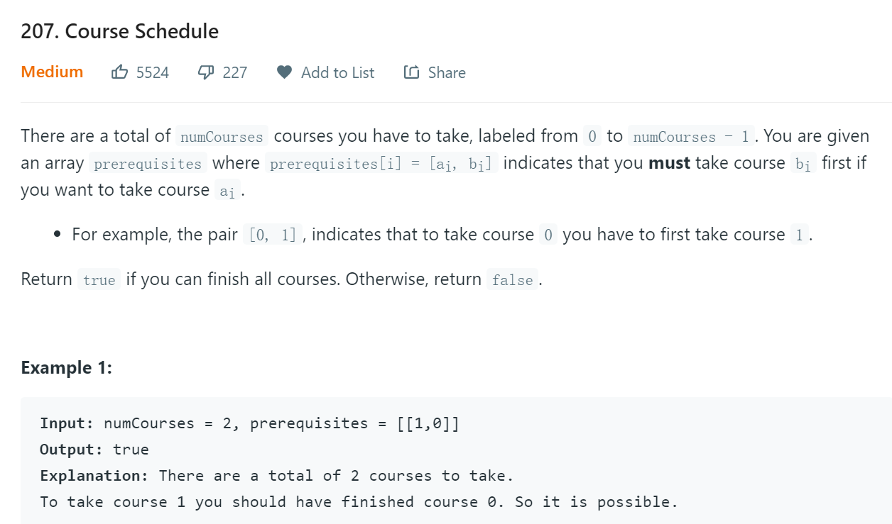

**解题思路**

1. 采用**拓扑排序**，若最终从队列中出队的课程数==numCourses，则可完成；否则不可完成
2. 采用DFS遍历有向图，若在一次深度遍历中遇到相同的节点，说明存在环路，直接返回false。

**DFS代码及解析**

```java
    public boolean canFinish(int numCourses, int[][] prerequisites) {
        List<List<Integer>> adjacency = new ArrayList<>();
        for(int i = 0; i < numCourses; i++)
            adjacency.add(new ArrayList<>());
        int[] flags = new int[numCourses];
        for(int[] cp : prerequisites)
            adjacency.get(cp[1]).add(cp[0]);
        for(int i = 0; i < numCourses; i++)
            if(!dfs(adjacency, flags, i)) return false;
        return true;
    }
    private boolean dfs(List<List<Integer>> adjacency, int[] flags, int i) {
        if(flags[i] == 1) return false;
        if(flags[i] == -1) return true;
        flags[i] = 1;
        for(Integer j : adjacency.get(i))
            if(!dfs(adjacency, flags, j)) return false;
        flags[i] = -1;
        return true;
    }
```

使用flags[]保存节点的访问信息，0(未访问)，1(本轮访问)，-1(其他轮访问)。

一轮访问：沿着有向边前进，没有回溯。

访问节点时将节点flags信息设置为1，表明节点正在被本轮访问；回溯时将节点的flags信息设置为-1，表明节点被其他轮访问过。

### 210 课程表2

**问题描述**

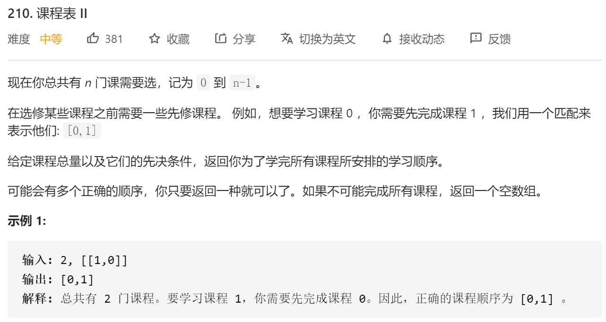

**解题思路**

同207,使用拓扑排序输出结果.但不能使用深度优先遍历.


### 310 Minimum Height Trees

**问题描述**

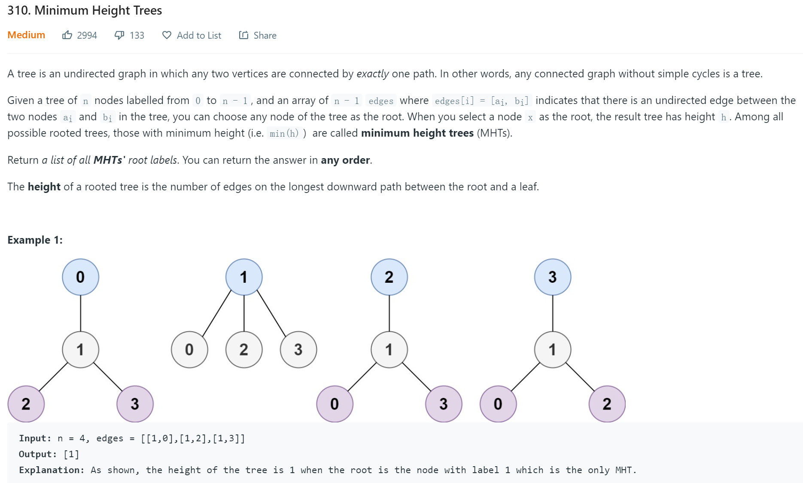

**解题思路**

1. BFS

   > 以每个节点为起点BFS，求得最小深度

2. DFS

   > 以每个节点为起点做DFS，若深度>当前最小深度，可提前终止。时间复杂度低于BFS

3. 外围BFS

   > 单纯的BFS和DFS的时间复杂度为O(N<sup>2</sup>)
   >
   > 采用外围BFS,从度为1的节点由外都内进行遍历得到的深度即为最小深度,时间复杂度为O(N).

**代码**
外围BFS

```java
    public List<Integer> findMinHeightTrees01(int n, int[][] edges) {
        //统计入队数量
        int count=0;
        //存储邻边
        List<Integer>[] adjs=new List[n];
        //队列保存节点
        List<Integer> queue =new LinkedList<>();
        //保存节点的度
        int[] edgeCount=new int[n];
        for(int i=0;i<n;i++){
            adjs[i]=new LinkedList<>();
        }
        for(int[] edge:edges){
            //统计邻边
            adjs[edge[0]].add(edge[1]);
            adjs[edge[1]].add(edge[0]);
            //统计节点度
            edgeCount[edge[0]]++;
            edgeCount[edge[1]]++;
        }
        //记录度为1到队列中
        for(int i=0;i<n;i++){
            //存在度为0的节点说明只有一个节点
            if(edgeCount[i]<=1){
                queue.add(i);
                count++;
            }
        }
        if(count==n){
            return queue;
        }
        int tail=queue.get(queue.size()-1);
        while(!queue.isEmpty()){
            int cur=queue.remove(0);
            //度减1
            for(int adj:adjs[cur]){
                if(--edgeCount[adj]==1) {
                    queue.add(adj);
                    //入队数+1
                    count++;
                }
            }
            //每轮处理完需要进行额外操作
            if(cur==tail){
                //若已经全部入队,则输出结果
                if(count==n){
                    return queue;
                }
                //更新tail
                tail=queue.get(queue.size()-1);
            }
        }
        return null;
    }
```

### 322 重新安排行程

**问题描述**
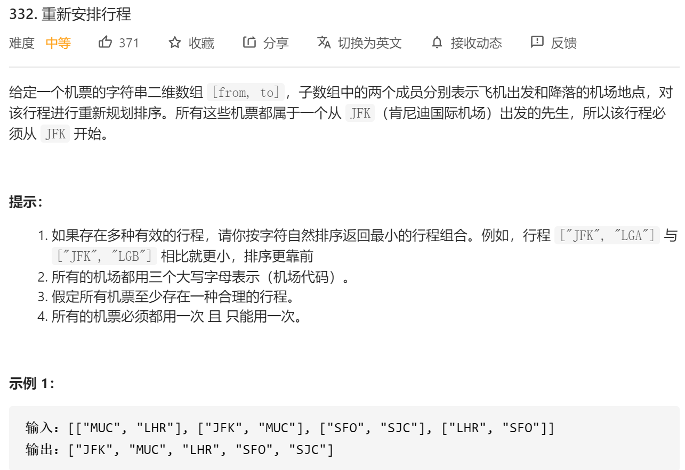

**欧拉[半]图**

给定一个 n 个点 m 条边的图，要求从指定的顶点出发，经过所有的边恰好一次（一笔画），使得路径的字典序最小。「一笔画」问题与欧拉图或者半欧拉图有着紧密的联系，下面给出定义：

> 通过图中所有边恰好一次且行遍所有顶点的通路称为**欧拉通路**。
>
> 通过图中所有边恰好一次且行遍所有顶点的回路称为**欧拉回路**。
>
> 具有欧拉回路的无向图称为欧拉图。
>
> 具有欧拉通路但不具有欧拉回路的无向图称为半欧拉图。

**Hierholzer 算法过程**：

1. 选择任一顶点为起点，遍历所有相邻边。
2. 深度搜索，访问相邻顶点。将经过的边都删除。
3. 如果当前顶点没有相邻边，则将顶点入栈。
4. 栈中的顶点倒序输出，就是从起点出发的欧拉回路/通路。

**问题分析**

​	对于行程(边)进行字典排序,优先选择字典序小的.

​	由于行程中对同一个节点可能会经过多次,所以无需设置visited[]记录访问情况.

​	使用DFS进行遍历,直到所有边都经过一遍.

**特殊案例**

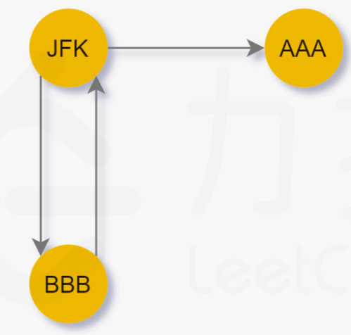

对于上图,JFK若优先选择AAA,则会进入**死胡同**,得出问题无解的错误结果.

为兼容**死胡同**情况,该问题可采用后序遍历的方式:

	1. 若**死胡同**最后才选择,会被最先加入结果.最后结果reverse,结果正确.
 	2. 若**死胡同**被并非最后被选择选择,那么**死胡同**也会最先加入结果(没有后序节点).最后结果,reverse,结果正确.

**代码**

```java
    public List<String> findItinerary(List<List<String>> tickets) {
        List<String> res = new LinkedList<String>();
        if (tickets.isEmpty())
            return res;
        String start = "JFK";
        //善用自定以排序
        Map<String, PriorityQueue<String>> m = new HashMap<>();
        for (List<String> ft : tickets) {
            if (!m.containsKey(ft.get(0))) {
                m.put(ft.get(0), new PriorityQueue<String>());
            }
            m.get(ft.get(0)).add(ft.get(1));
        }
        DFS(start,m,res);
        Collections.reverse(res);
        return res;
    }

    private void DFS(String start, Map<String, PriorityQueue<String>> m, List<String> res) {
        PriorityQueue<String> tmpQueue=m.get(start);
        while(tmpQueue!=null&&!tmpQueue.isEmpty()){
            String dest= tmpQueue.poll();
            DFS(dest,m,res);
        }
        res.add(start);
    }
```

### 753 破解保险箱

**问题描述**

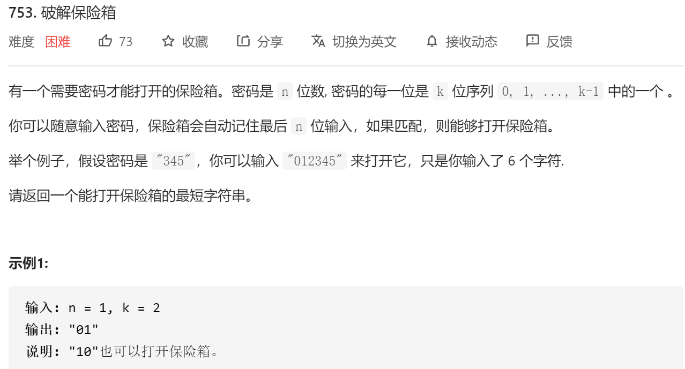

**问题分析**

1. 需要最短的字符串打开保险箱

   > 相邻的长度为n的密码共用n-1个字符(<font color='red'>如何证明恰能共用n-1个</font>).

2. 需要列出所有的字符组合

   > 将n-1个字符的全排列作为节点,共k<sup>n-1</sup>个
   >
   > 每个节点由k个出边(包括到本节点的边)

3. 需要走过所有的边有且仅有一次

   > 使用Hieholzer算法遍历图

**代码**

<font color='red'>对图进行处理时,不一定要保存边信息.</font>

> 对于可通过节点计算得到的边信息(如本题),可直接计算,使用<前节点,后节点>保存边信息更耗费时间和空间.
>
> 只有对无规律可言的边信息采用<前节点,后节点>保存.

```java
    //保存密码组合
	Set<Integer> seen = new HashSet<Integer>();
	//保存结果
    StringBuffer ans = new StringBuffer();
	//用于取密码组合的后n-1位
    int highest;
    int k;

    public String crackSafe(int n, int k) {
        this.k=k;
        highest=(int)Math.pow(10,n-1);
        int node=0;
        dfs(0);
        //从0{n-1}节点出发
        for(int i=1;i<n;i++){
            ans.append(0);
        }
        //结果没有反转,因为随便从哪个节点出发,结果都对
        return ans.toString();
    }

    private void dfs(int node) {
        for(int i=0;i<k;i++){
            //人为制造边
            int newNode=node*10+i;
            //仅处理未处理过的密码
            if(!seen.contains(newNode)){
                seen.add(newNode);
                //取密码的后n-1位
                dfs(newNode%highest);
                ans.append(i);
            }
        }
    }
```

### 684 Redundant Connection

**问题描述**

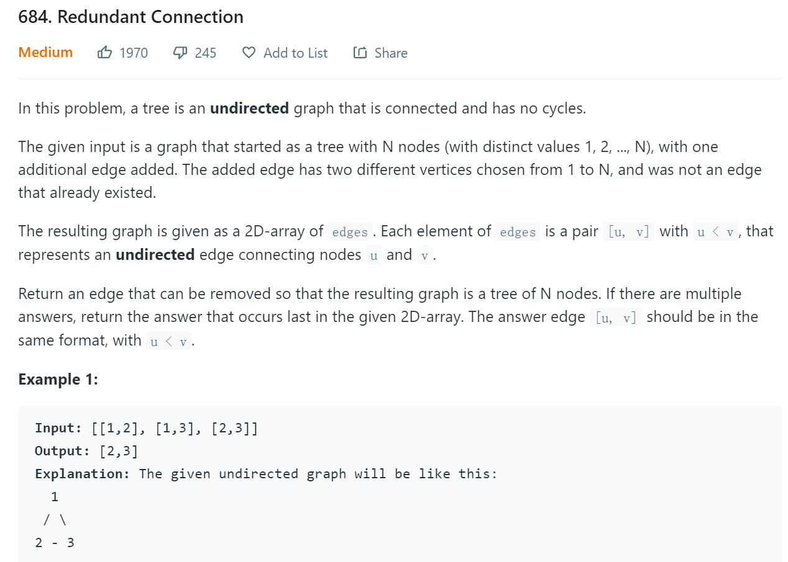

**解题思路**
采用并查集

1. 起初每个节点各为一棵并查树。

2. 遍历每一条边，若边的2个节点在一棵并查树中，返回边

​		否则union边的2个节点。

**代码**

```java
    public int[] findRedundantConnection(int[][] edges) {
        int[] parent = new int[edges.length + 1];
        for (int i = 0; i < parent.length; i++) {
            parent[i] = i;
        }
        for (int[] edge : edges) {
            if (find(parent, edge[0]) != find(parent, edge[1])) {
                union(parent, edge[0], edge[1]);
            } else {
                return edge;
            }
        }
        return null;
    }

    private void union(int[] parent, int i, int j) {
        i = find(parent, i);
        j = find(parent, j);
        //压缩路径,提高效率
        parent[i] = j;
    }

    public int find(int[] parent, int index) {
        int i=index;
        while (parent[i] != i) {
            i = parent[i];
        }
        //压缩路径,提高效率
        parent[index]=i;
        return i;
    }
```

### 685 冗余连接2

**问题描述**
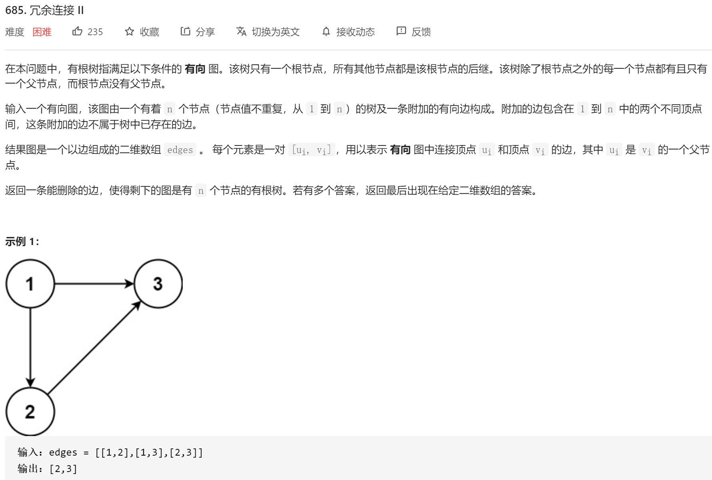

**问题分析**
该问题仍是并查集问题.但需要分析违例的情况.

1. 包含冲突(某个节点有2个入度),但无环

   如示例1.

   > 删除后出现的冲突违例(违例一定是后者产生的)

2. 包含冲突(某个节点有2个入度),并且有环.

   [[3,4],[4,1],[1,2],[2,3],[5,1]]

   > 删除先出现的冲突违例(违例一定是前者产生的)

3. 不包含冲突,且有环

   [[3,4],[4,1],[1,2],[2,3]]

   > 删除成环的违例

<font color='red'>因为需要保存违例的边,所以不能对并查树进行路径压缩</font>

**代码**

```java
    public int[] findRedundantDirectedConnection(int[][] edges) {
        int len = edges.length;
        parent = new int[len+1];
        int[][] conflict=new int[3][2];
        boolean cycle=false;
        boolean cflt=false;
        for (int i = 0; i < len+1; i++) {
            parent[i] = i;
        }
        for (int[] edge : edges) {
            if(parent[edge[1]]==edge[1]){
                if (find(edge[0]) != find(edge[1])){
                    union(edge[0],edge[1]);
                }else{
                    cycle=true;
                    conflict[2]=edge;
                }
            }else{
                conflict[0]=new int[]{parent[edge[1]],edge[1]};
                conflict[1]=edge;
                cflt=true;
            }
        }
        if(cycle&&cflt){
            return conflict[0];
        }else if(!cycle&&cflt){
            return conflict[1];
        }else{
            return conflict[2];
        }

    }

    private void union(int i, int j) {
        parent[j]=i;
    }

    private int find(int i) {
        while (parent[i] != i) {
            i = parent[i];
        }
        return i;
    }
```

### 765 情侣牵手

**问题描述**

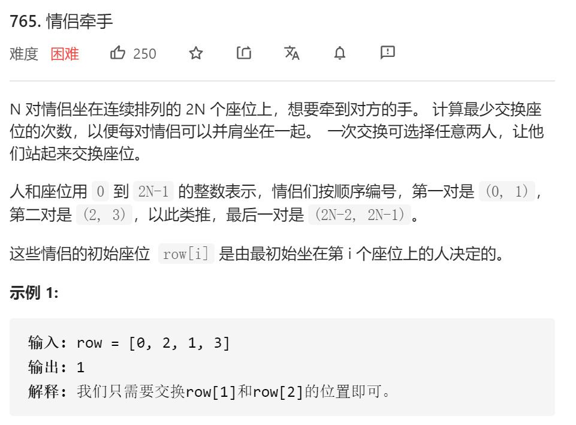

**问题分析**

该问题更适合用并查树解答

> 1. parent[i]=i
> 2. 将偶数i与i+1归为一组
> 3. 将row[i]与row[i+1]\(i为偶数)归为一组
> 4. 经过以上合并,可交换得到情侣的全部归为一组.而组的尺寸决定了最小交换数=size/2-1.(2:刚好一组,不用交换.)

**代码**

```java
    int[] parent;
    int[] size;
    public int minSwapsCouples(int[] row) {
        parent=new int[row.length];
        size=new int[row.length];
        Arrays.fill(size,1);
        for(int i=0;i<row.length;i++){
            parent[i]=i;
        }
        for(int i=0;i<row.length;i+=2){
            union(i,i+1);
        }
        for(int i=0;i<row.length;i+=2){
            if(find(row[i])!=find(row[i+1])){
                union(row[i],row[i+1]);
            }
        }
        int res=0;
        for(int s:size){
            if(s>0){
                res+=s/2-1;
            }
        }
        return res;
    }

    public int find(int i){
        int tmp=i;
        while(i!=parent[i]){
            i=parent[i];
        }
        parent[i]=i;
        return i;
    }

    public int size(int i){
        return size[parent[i]];
    }

	//合并时更新size
    public void union(int i,int j){
        int pi=find(i);
        int pj=find(j);
        if(pi>pj) {
            parent[pi] = pj;
            size[pj]+=size[pi];
            size[pi]=0;
        }else{
            parent[pj]=pi;
            size[pi]+=size[pj];
            size[pj]=0;
        }
    }
```

**图的深度遍历方式**

思路与并查树一致,将