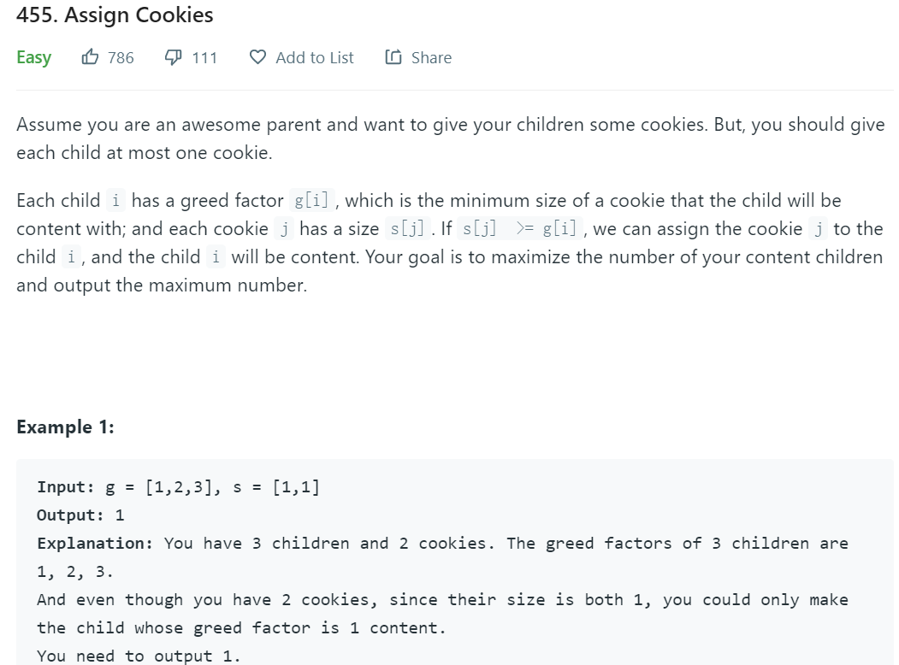
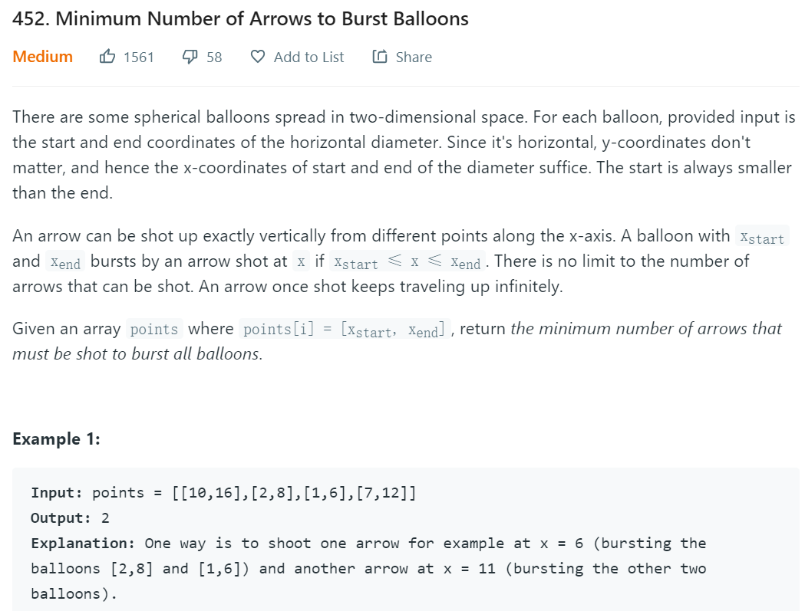
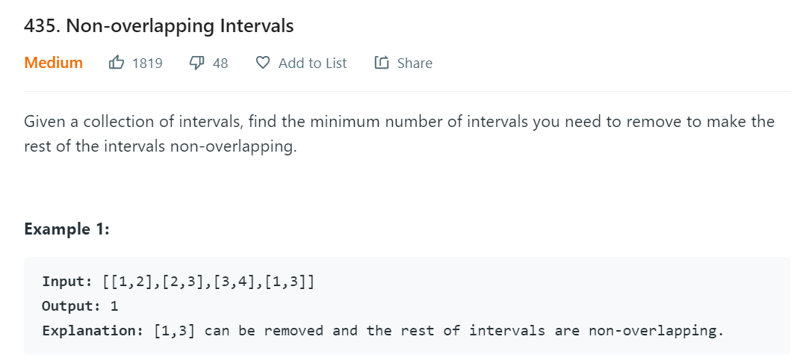
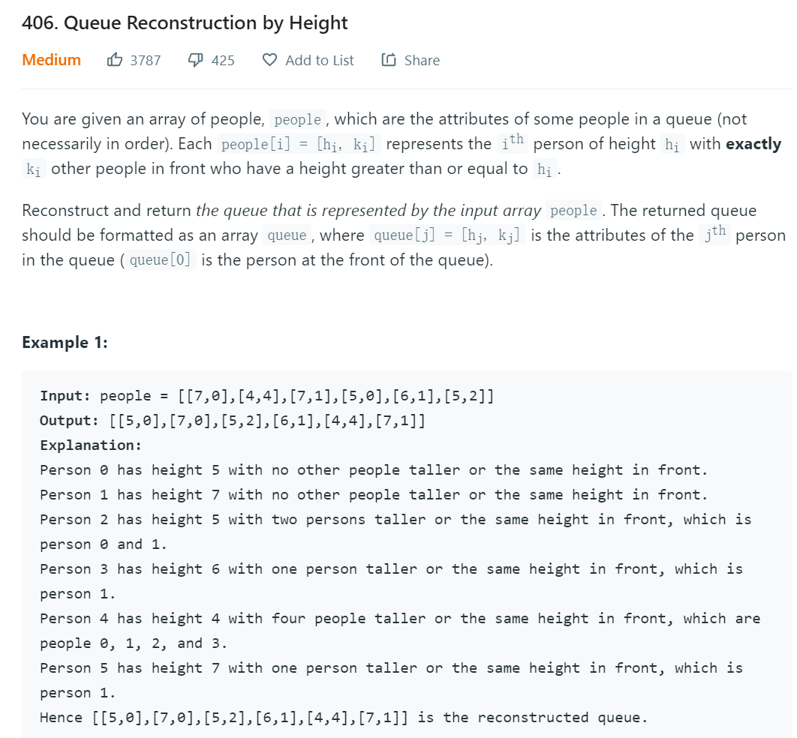
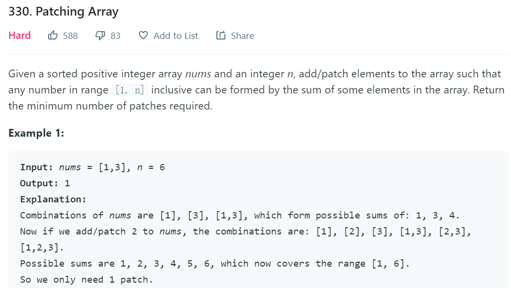
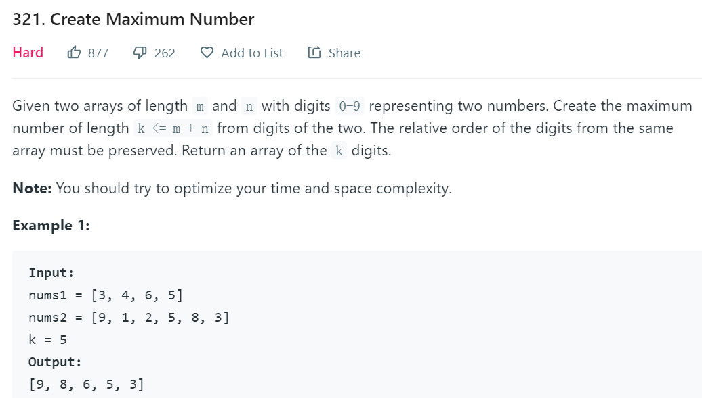
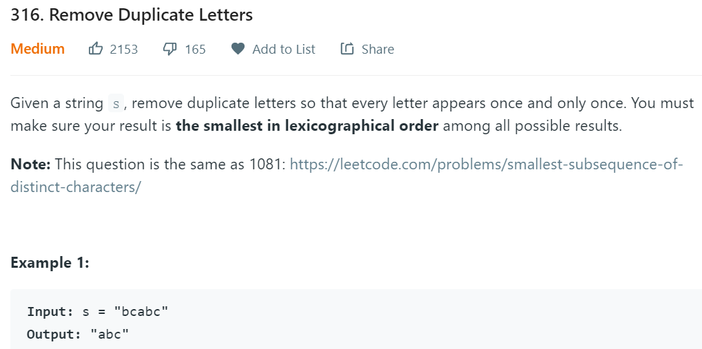
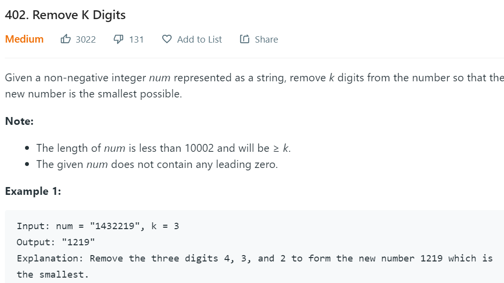

## [分治法，动态规划及贪心算法](https://zhuanlan.zhihu.com/p/33048876)

### 1.分治法

**算法原理**

分治法(Divide-and-Conquer) : 将原问题划分成n个规模较小而结构与原问题相似的子问题；递归地解决这些子问题，然后再合并其结果，就得到原问题的解。

分治模式在每一层递归上都有三个步骤：

- 分解(Divide)：将原问题分解成一系列子问题；
- 解决(Conquer)：递归地解决各个子问题。若子问题足够小，则直接求解。
- 合并(Combine)：将子问题的结果合并成原问题的解。

**典型问题**

合并排序(Merge Sort)是一个典型分治法的例子。其对应的直观的操作如下:

分解： 将n个元素分成各含n/2个元素的子序列；

解决：用合并排序法对两个子序列递归地排序；

合并：合并两个已排序的子序列以得到排序结果。

### 2. 动态规划法

**算法原理**

动态规划算法的设计可以分为如下4个步骤：

- 描述最优解的结构
- 递归定义最优解的值
- 按自底向上的方式计算最优解的值
- 由计算出的结果构造一个最优解

适合采用动态规划方法的最优化问题中的两个要素：最优子机构和重叠子问题。

> **最优子机构**：如果问题的一个最优解中包含了子问题的最优解，则该问题具有最优子机构。
>
> **重叠子问题**：适用于动态规划求解的最优化问题必须具有的第二个要素是子问题的空间要很小，也就是用来求解原问题的递归算法反复地解同样的子问题，而不是总是在产生新的子问题。对两个子问题来说，如果它们确实是相同的子问题，只是作为不同问题的子问题出现的话，则它们是重叠的。

**动态规划法与分治法的异同**

分治法是指将问题划分成一些独立的子问题，递归的求解各子问题，然后合并子问题的解而得到原问题的解。

动态规划适用于子问题独立且重叠的情况，也就是各子问题包含公共的子问题。在这种情况下，若用分治法则会做许多不必要的工作，即重复地求解公共的子问题。动态规划算法对每个子问题只求解一次，将其结果保存在一张表中，从而避免每次遇到各个子问题时重新计算答案。

分治法 —— 各子问题独立；动态规划 —— 各子问题重叠。

算法导论： **动态规划要求其子问题既要独立又要重叠，这看上去似乎有些奇怪。虽然这两点要求听起来可能矛盾的，但它们描述了同一个问题的两个方面。如果同一个问题的两个子问题不共享资源，则它们就是独立的。对两个子问题俩说，如果它们确实是相同的子问题，只是作为不同问题的子问题出现的话，是重叠的，则它们是重叠**

### 3. [贪心算法](https://www.jianshu.com/p/fe4a781f3486
对许多最优化问题来说，采用动态规划方法来决定最佳选择有点“杀鸡用牛刀”了，只要采用另一些更简单有效的算法就行了。

**算法原理**

贪心算法设计步骤：

1. 设计问题的最优子结构
2. 设计一个递归算法
3. 证明如果我们做出了贪心选择，则只剩下一个子问题。
4. 证明贪心算法是有效的。
5. 设计算法实现贪心策略。

**贪心算法与动态规划算法**

> 贪心算法中，是以自顶向下的方式使用最优子结构的。贪心算法会先做选择，在当时看起来是最优的选择，然后再求解一个结果子问题，而不是先寻找子问题的最优解，然后再做选择。**贪心算法划分子问题的结果，通常是仅存在一个非空的子问题。**
>
> 在动态规划中，每一步都要做出选择，但是这些选择依赖于子问题的解。因此，解动态规划问题一般是自底向上，从小子问题处理至大子问题。贪心算法所做的当前选择可能要依赖于已经做出的所有选择，但不依赖于有待于做出的选择或子问题的解。

**典型问题**

假定有一个n个活动的集合,这些活动使用同一个资源，而这些资源在某个时刻只能供一个活动使用。每个活动都有开始时间和结束时间，如果被选中，任务占据该资源)期间。如果两个活动的区间不重叠，则称他们是兼容的。在活动选择问题中，我们希望选择出一个最大兼容活动集。

## 贪心算法实例

### 455 分糖果

**问题描述**

**问题思路**

思路：因为最小的孩子最容易得到满足，因此先满足最小孩子。给一个孩子的饼干应当尽量小又能满足该孩子，这样大饼干就能拿来给满足度比较大的孩子。
假设在某次选择中，贪心策略选择给第 i 个孩子分配第 m 个饼干，并且第 i 个孩子满足度最小，第 m 个饼干为可以满足第 i 个孩子的最小饼干，利用贪心策略最终可以满足 k 个孩子。假设最优策略在这次选择中给 i 个孩子分配第 n 个饼干，并且这个饼干大于第 m 个饼干。我们发现使用第 m 个饼干去替代第 n 个饼干完全不影响后续的结果，因此不存在比贪心策略更优的策略，即贪心策略就是最优策略。

**贪心分析**

1. 设计最有子结构和递归算法

   设count[i,j]为g与s分别从i，j数组的结果，那么：

   ​	
   $$
   count[i+1,j+1]=
   \begin{cases}
   count[i,j]+1, &s[j]能满足g[i]且s[j+1]能满足g[i+1]\\
   count[i,j], &s[j]能满足g[i]但s[j+1]不能满足g[i+1]\\
   count[i+1,j]+1，&s[j]不能满足g[i+1]且s[j]能满足g[i+1]\\
   \end{cases}
   $$
   
2. 只有一个子问题

   选择[i,j]后，将会根据[i,j]决定下一子问题

   ​	s[j]可满足g[i]，下一子问题为count[i+1,j+1]

   ​    s[j]不满足g[i]，下一子问题为count[i,j+1]

3. 证明贪心算法有效

   贪心算法：将数组g和s排序，恰好（s[j]空闲且是大于g[i]的最小值）能满足g[i]的s[j]一定在结果中。

   假设结果中s[j']满足g[i]，那么s[j]<=s[j'],那么结果集需要将s[j]代替s[j]，不存在比贪心算法更优的策略

### 452 射气球

**问题描述：**

**解题思路**

1. 将气球列表lst按照xstart进行排序
2. 遍历排序后列表，若相邻两项有重叠，则使用重叠代替这两项
3. 最终列表长度为结果

**贪心分析**

1. 子问题与递归算法

   res[i]表示lst[0,i]区间气球所需的箭数，那么

$$
res[i+1]=
\begin{cases}
res[i]+1, &lst[i]与lst[i+1]无重叠\\
res[i], &lst[i]与lst[i+1]有重叠
\end{cases}
$$

2. 只有一个子问题

3. 证明贪心算法有效

   贪心算法：排序后的气球中，结果集必须是的箭必须射中重叠部分（气球会更新）。

   假设结果集中的箭不射在重叠部分，那么一定存在射在重叠部分的箭得到一个更小的结果集。

### 453 不重叠数对

**问题描述**

**解题思路**

1. 将数组按首位数字排序
2. 若数对重叠，保留最早结束的数对，给后续数对留下更多空间。

### 406 重建排列

**问题描述**

**解题思路**

1. 将数组排序，首数字递增（先放排列靠前的数字，空位就是高于自身的数字），次数字递减（先放排列靠后的数字，避免与自己想同的数字位置错误）
2. 遍历数组，对于每个people，根据ki找到结果集中people所在的位置，每进过一个空位才计算ki自减，为0的空位就是people在结果集中的位置。

**贪心算法**

1. 子问题

   创建一个结果数组res，使用people中的元素将其填满。

   将people排序，之后依次取出填入res中 ，只有空位置计数（子问题与原问题类型相同）

2. 只有一个子问题

3. 贪心算法有效证明

   1）若[i,j]所在位置前的空位数<j,则该people排列数<j

   2)   若[i,j]所在位置前的空位数>j,则该people排列数>j

### 330 补齐数组

**问题描述**

**解题思路**

1. 对于nums[i],若nums[0,i）可组成[1,total]

   > 如果nums[i]<=total+1,那么nums[0,i]可组成[1,total*2+1]
   >
   > 如果nums[i]>total+1,那么nums[0,i）添加一个数字total+1可组成[1,total*2+1]

2. nums[0,i）可组成[1,total]的假设依赖于上述2个操作，否则不成立。

贪心证明

### 321 由2个数组组合最大数

**问题描述**

**解题思路**

1. 将问题分解为从nums1取k1个数，从nums2取k2个数，且k1+k2=k

2. 在nums1取k1个数问题中，采用贪心算法。

   1)  对于nums1[i],当前取用结果为res，若res.len<k1,则将nums[i]直接追加到res之后

   2）若res.len=k1,将nums1[i]追加到res之后，并从res头部开始检测是否存在res[j]<res[j+1].

   ​	   若存在，则移除res[j]

   ​		不存在，移除res[k1]

### 316 去除重复字母

**问题描述**

**解题思路**

1. 扫描s一遍，记录每个字符的出现频次

2. 对于字符处理，需要对相邻的2个字符进行比较，这里有两种方案

   1） cur与cur+1比较，若s[cur]>s[cur+1],则删除s[cur],但这种方案处理“bcabc”需要在每次删除时判断删除位置之前的字符，因为每次删除会影响之前的判断结果，而不会影响之后的判断（之后还未判断）

   2)    cur与cur-1比较，若s[cur]<s[cur-1],则删除s[cur-1]

### 402 删除k位数字

**问题描述**

**解题思路**

与316相似