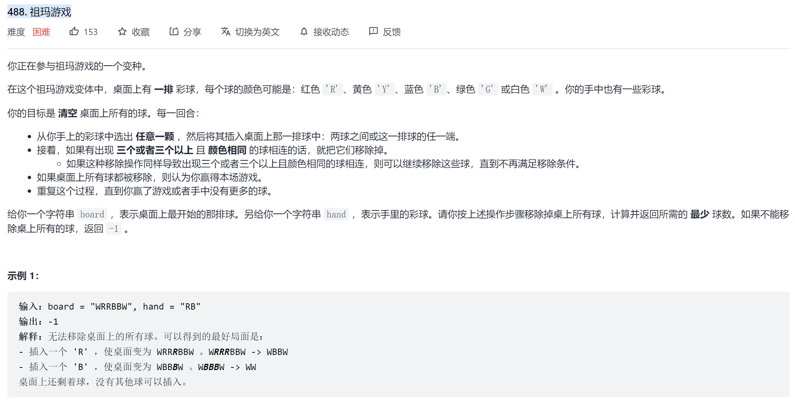

#### [488. 祖玛游戏](https://leetcode-cn.com/problems/zuma-game/)

**问题描述**

**错误贪心思路**

对于任意排列,插入球的颜色只能与插入位置相邻的球颜色相同,否则相当于插入单个球,后期还要通过插入其他球来消除此次插入的球.

1. 已考虑的特殊情况

   "ABBCCA"插入A得到"ABBACCA"是无意义的,因为可在"B"和"C"消除后再插入"A",总插入次数不变.

2. 未考虑的特殊情况

   "WWRRWWBBWW"可通过2次插入完成消除,即"WBWRRRWWBBWW"