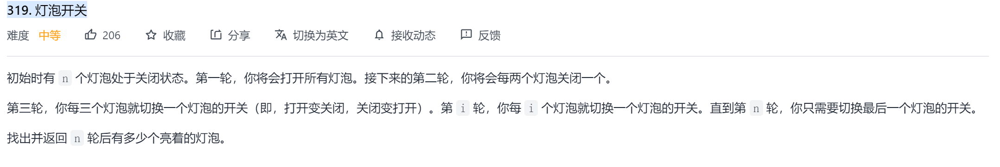
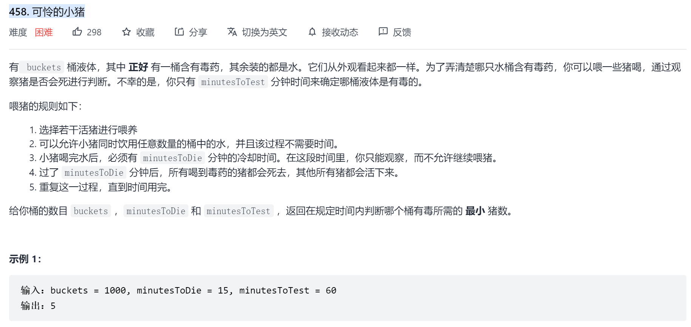
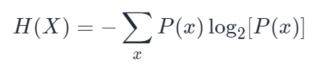
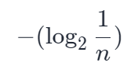
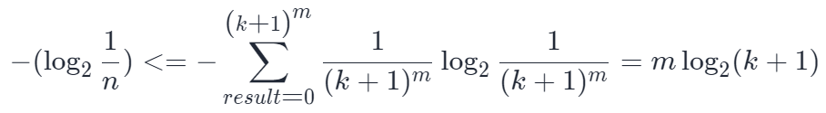
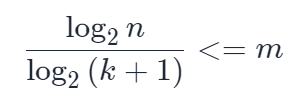
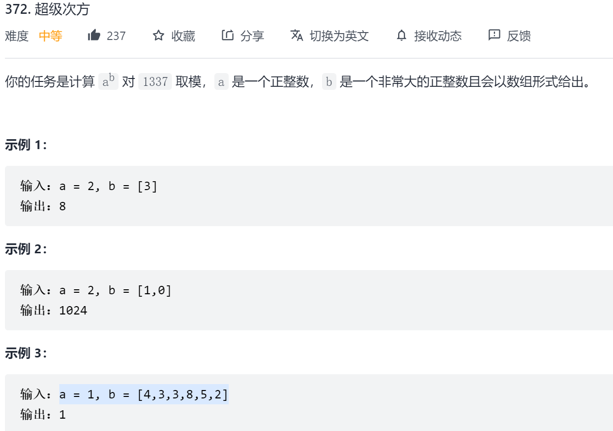

许多算法题与数学知识相关

# 奇偶

对于数据的操作,操作结果与操作次数奇偶性相关,如异或操作.

## 题目示例

### [319. 灯泡开关](https://leetcode-cn.com/problems/bulb-switcher/)

**问题描述**



**问题分析**

对于第i个灯泡,在第j轮时会改变状态,如果i%j==0;

- 若对每一个i判断j是否为其因子,则时间复杂度过高

如果i%j==0;则存在k使i=j*k;

- 如果j!=k,则对于因子j和k,灯泡i会改变2次状态,相当于状态不变
- 如果j==k,则对于因子j/k,灯泡i只改变1次状态

所以对于灯泡i,若i是平方数则会改变状态,否则状态与原状态相同

**代码**

```java
class Solution {
    public int bulbSwitch(int n) {
        int count=0;
        for(int i=1;i<=n;i++){
            if(i==(int)Math.sqrt(i)*(int)Math.sqrt(i)){
                count++;
            }
        }
        return count;
    }
}
```

# 信息熵

## 信息熵理论

https://blog.csdn.net/u011208984/article/details/102519019?ops_request_misc=%257B%2522request%255Fid%2522%253A%2522163784390516780357278238%2522%252C%2522scm%2522%253A%252220140713.130102334..%2522%257D&request_id=163784390516780357278238&biz_id=0&utm_medium=distribute.pc_search_result.none-task-blog-2~all~sobaiduend~default-2-102519019.pc_search_result_control_group&utm_term=%E9%A6%99%E5%86%9C%E7%86%B5&spm=1018.2226.3001.4187


https://blog.csdn.net/theonegis/article/details/79890407?ops_request_misc=%257B%2522request%255Fid%2522%253A%2522163784390516780357278238%2522%252C%2522scm%2522%253A%252220140713.130102334..%2522%257D&request_id=163784390516780357278238&biz_id=0&utm_medium=distribute.pc_search_result.none-task-blog-2~all~sobaiduend~default-1-79890407.pc_search_result_control_group&utm_term=%E9%A6%99%E5%86%9C%E7%86%B5&spm=1018.2226.3001.4187

## 题目实例

### [458. 可怜的小猪](https://leetcode-cn.com/problems/poor-pigs/)

**题目描述**



**题目分析**

我们用实验对象来代指题干的小动物。同时为了方便，我们使用 n 代指有多少桶水，d 为实验对象的反应时间，t 为测试总时间。

根据题意，最大测试次数为k=math.floor(t/d);

可以先考虑 k = 1的情况，最简单的情况是，我们使用与水同等数量的实验对象数量来进行测试。此时哪个实验对象有反应，则可以推断出哪一桶水有问题。但这样的测试方式，每个实验动物承载的信息量是很低的，每个实验对象仅承载了某一桶水是否有问题。

为减少实验对象数量，我们需要增大每个实验对象承载的信息量（让每个实验对象同时测试多桶水），然后从最终所有实验对象的状态（是否有所反应）来反推哪一桶水有问题。

用最小单位表示最大信息量，这引导我们使用「进制表示」相关方式。由于我们只有 1次测试机会，因此我们可以使用二进制的方式进行测试。

当 k = 1，使用二进制的方式测试哪桶水有问题，我们至少需要 m 个实验对象（其中 m 为 n的二进制表示的长度），然后让编号为 x（0 <= x < m）的实验对象喝掉二进制表示中第 x 位为 1的水。最终这 m 个实验对象会对应一个结果序列：如果编号 x<sub>1</sub> 的实验对象没有反应，说明有问题的水的二进制表示中第x<sub>1</sub> 位为 0，如果编号为x<sub>2</sub>的实验对象有反应，则说明有问题的水的二进制表示中第 x<sub>2</sub> 为 1。即根据最终每个实验对象的状态，我们可以完整地反推回有问题的水的编号是多少。

当 k >1 时，相当于在原问题基础上，多考虑一层「轮数」维度，即不仅考虑某个实验对象是否有所反应，还需要考虑是在哪一轮有所反应。我们还是使用「进制表示」的方式来最大化每个单位所能承载的最大信息量。我们先使用k+1 进制对所有水进行编号，此时每桶水都有唯一的进制表示编码。然后我们考虑「什么时候」将水喂给「哪个实验对象」。其中一种可行的测试方式是：设定需要的实验对象数量 m为 k + 1进制数的长度，若某桶水的k+1 进制中的第 x 位为 i（0 <= i <= k），则代表将该水在第 i 轮喂给编号为 x 的实验对象。

同理，利用最终的结果矩阵，我们可以反推回是哪一桶水是有问题的。

上述做法，只是阐述了我们存在这样的可行解，需要证明这样的做法是最优解。利用 香农熵，我们可以计算明确熵值，公式为：



其中 P(x)代表随机事件 x 的发生概率。

对于本题，记系统 A 为 n 桶水有1个桶有问题，A系统的信息熵:



记系统B 为在测试轮数为 k时，所有实验对象的最终状态，每个实验对象的状态共有 k + 1种，即共有 C=(k+1) <sup>m</sup>种最终结果.

为保证最少m头猪检测出有毒的水,需要满足 H(A) <= H(B) 前提下的最小m值,即系统A的可能数比系统B少.

代入公式可得：



移项化简得：



**代码**

```java
class Solution {
    public int poorPigs(int buckets, int minutesToDie, int minutesToTest) {
        int times=minutesToTest/minutesToDie;
        return (int)Math.ceil(Math.log(buckets)/Math.log(times+1));
    }
}
```

# 取余运算

**乘法取模分配律**
$$
(a⋅b)modm=[(amodm)⋅(bmodm)]modm
$$

### 题目实例

### [372. 超级次方](https://leetcode-cn.com/problems/super-pow/)

**问题描述**



**问题分析**

1. 进制数的处理

   以十进制为例,radix=10,数值$1234=(((1)×10+2)×10+3)×10$

2. 指数处理
   $$
   a^b=
   \begin{cases}
   a^{b/2}*a^{b/2} & b\%2==0 \\
   a^{b/2}*a^{b/2}*a & b\%2==1 \\
   \end{cases}
   $$
   类似指数这类运算都可采用上述处理方式,提高效率

**代码**

```java
class Solution {
    static final int MOD = 1337;

    public int superPow(int a, int[] b) {
        int ans=1;
        for(int e:b){
            //使用进制数处理美化代码
            ans=(int)((long)pow(ans,10)*pow(a,e)%MOD);
        }
        return ans;
    }
	//使用递归指数处理提高效率
    public int pow(int x, int n) {
        int res=1;
        if(n!=0){
            if(n%2==1){
                res=(int)((long)res*x%MOD);
            }
            n/=2;
            x=(int)((long)x*x%MOD);
        }
        return res;
    }
}
```

