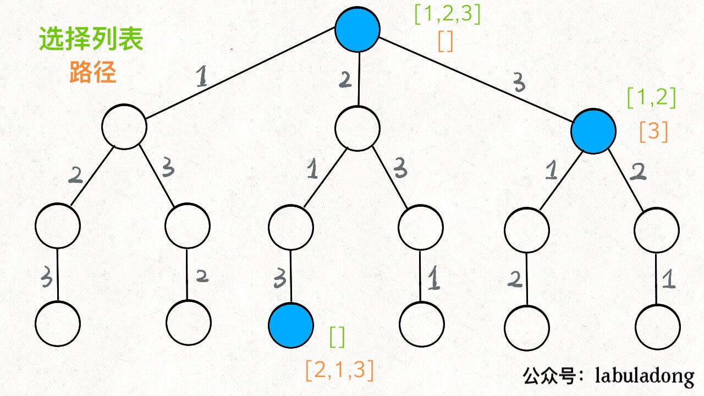
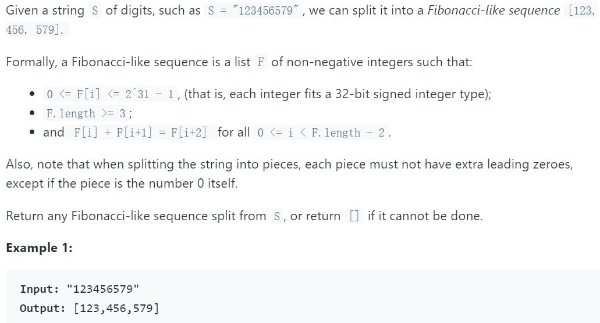
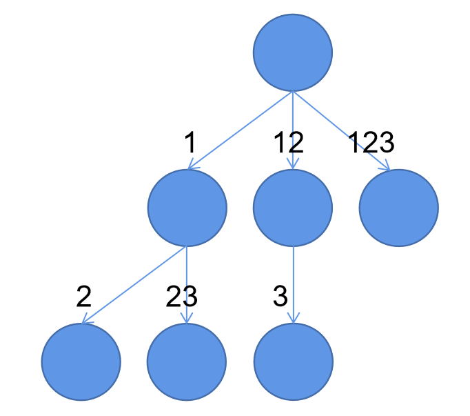
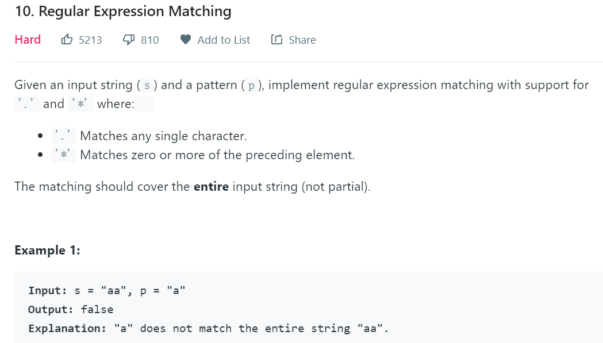
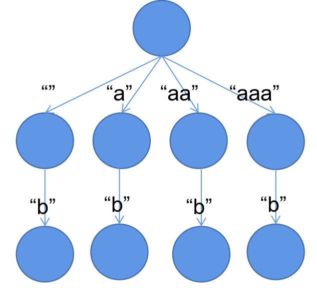
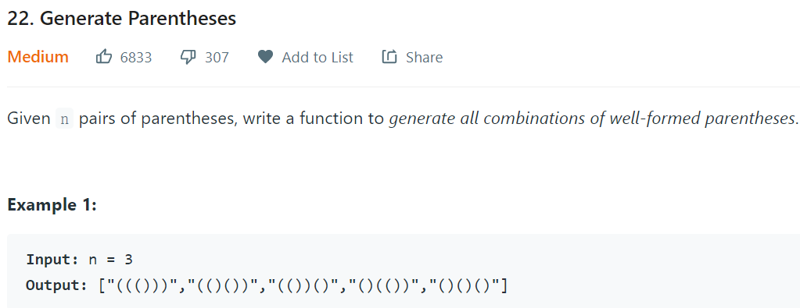
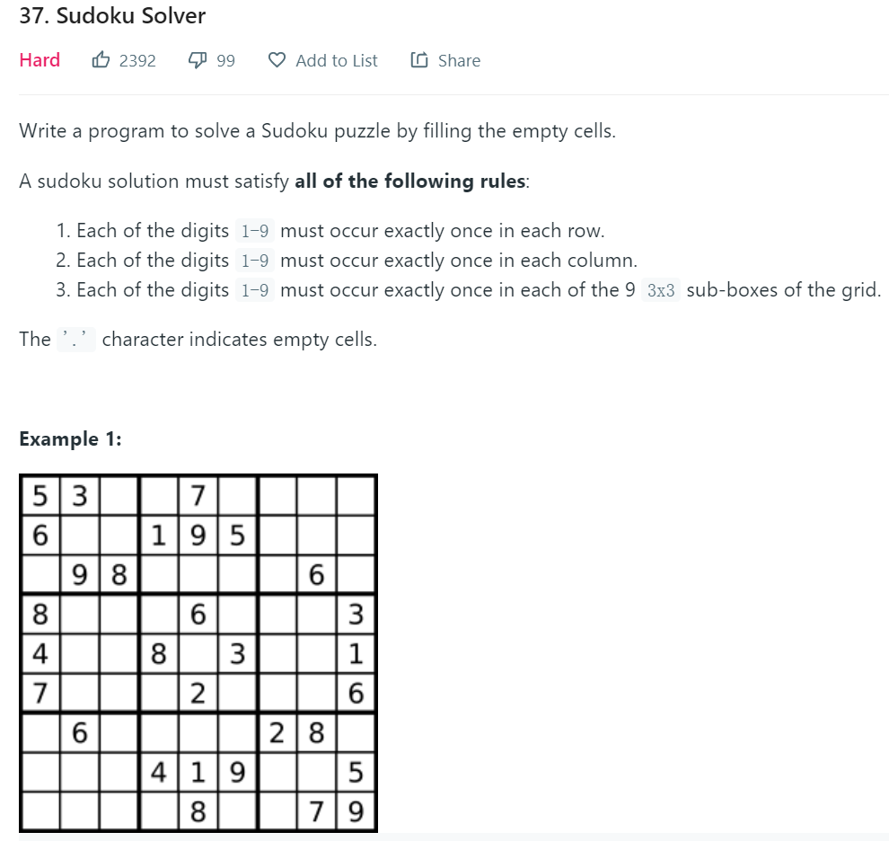
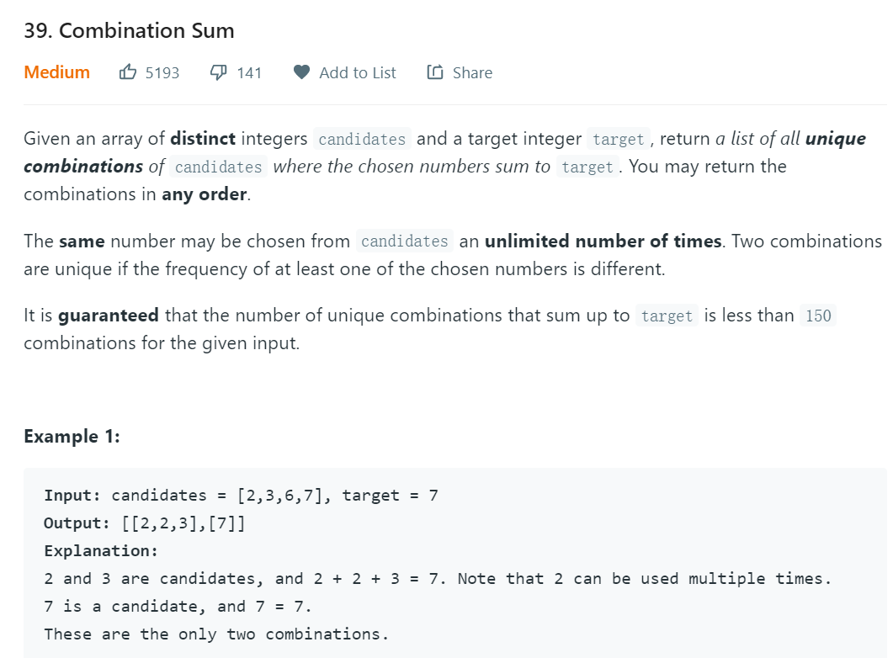
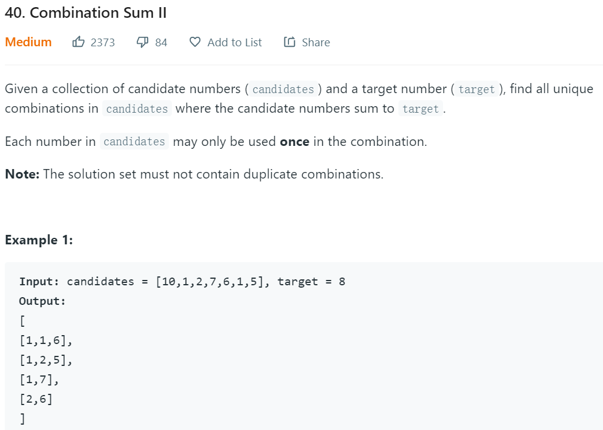
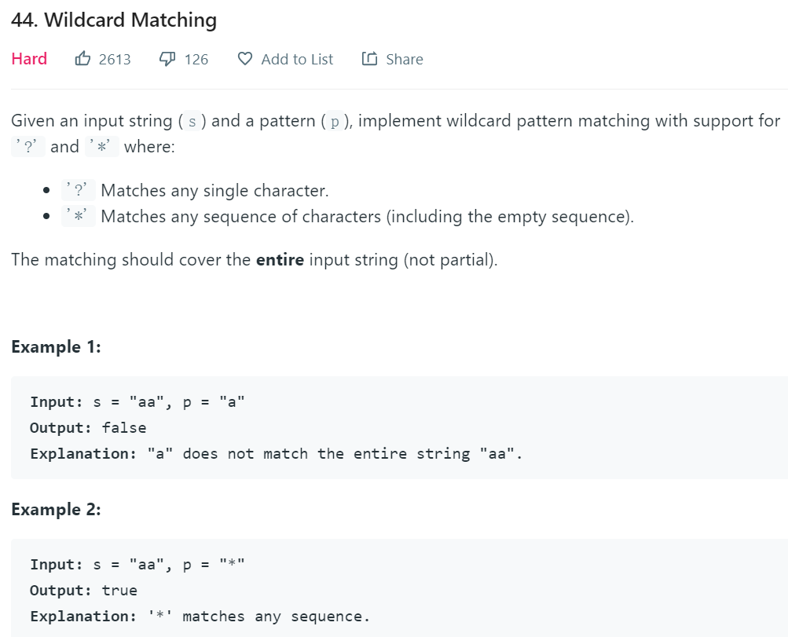

## 回溯算法的解题思路

### [解题模板](https://leetcode-cn.com/problems/permutations/solution/hui-su-suan-fa-xiang-jie-by-labuladong-2/)

解决一个回溯问题，实际上就是一个决策树的遍历过程。你只需要思考 3 个问题：

1、路径：已经做出的选择。

2、选择列表：当前可以做的选择(<font color='red'>尽量剪枝</font>)。

3、结束条件：到达决策树底层，无法再做选择的条件。

**代码框架**

```python
result = []
def backtrack(路径, 选择列表):
    if 满足结束条件:
        result.add(路径)
        return
    
    for 选择 in 选择列表:
        做选择
        backtrack(路径, 选择列表)
        撤销选择

```

### 解题示例

问题描述：输出[1,2,3]所组成的全排列。



**决策树的组成**

> 每个节点代表一个状态
>
> 节点的分支代表**选择列表**
>
> 到达指定节点状态的选择集合为该节点的**路径**

**决策树遍历**

> 遍历决策树的节点表示处理所有状态
>
> 选择:将选择加入路径
>
> 回溯:将选择从路径中删除,恢复到上一步选择状态,以便进行下一次选择

**决策树剪枝**

> 剪枝：遍历决策树的节点时，若状态已不满足条件，可提前回溯，不再遍历节点下的子节点。
>
> 作用：减少计算量

## 问题记录

### 842.斐波那契数列

**问题描述：**



**解题思路**

> 斐波那契数列仅有前2项决定，仅需对前两项进行回溯即可。

**以"123"为例的决策树**




### 10. 字符串与通配符匹配

**问题描述**



**解题思路**

> 使用通配字符串p匹配s
>
> 仅对p中*进行回溯操作，其余字符仅匹配一个，无需回溯

**决策树**

以s=“aaab”，p="a*b"为例



**注意：该问题用动态规划更简单**

### 22.有效括号对

**问题描述**


**解题思路**

1. 决策树的每个节点有2个分支，分别为"("和")"。
2. 决策树剪枝条件：右括号不多于左括号。

### 37.数独（尚未实现）

**问题描述**


**解题思路**

1. 决策树的节点由“."构成，每个节点有9个分支
2. 剪枝条件：数独的规则

### 39.组和（尚未完成）

**问题描述**



**解题思路**

1. 决策树的每个节点有4个分支（由candidates决定）

2. 剪枝条件：

   ​	和超过target；

   ​	本次选择数>上次选择数(避免出现重复的结果)

**注意：该问题可用动态规划完成（类似青蛙跳台阶）**

### 40.组和2（尚未实现）

**问题描述**



**解题思路**

1. 先将candidates排序

2. 决策树的每个节点的分支为candidates的长度

3. 剪枝条件：

   ​	和超过targets

   ​	分支上的选择数不排在上一选择之后

### 44. 字符串与通配符匹配（类似10）

**问题描述**


