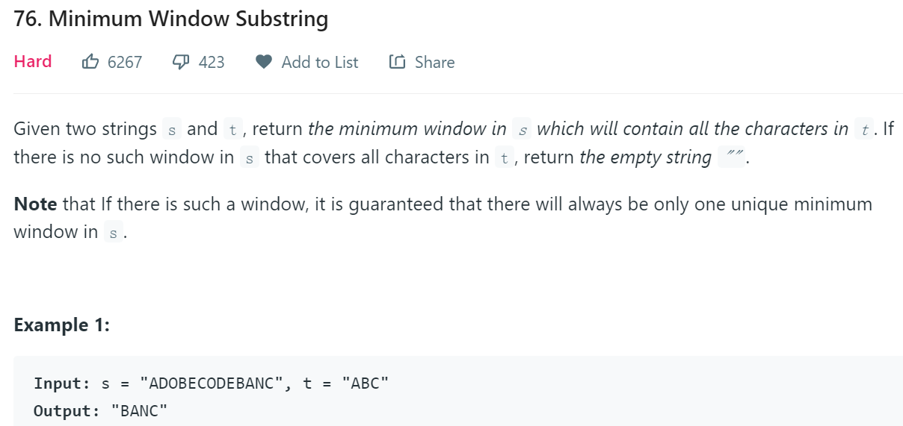
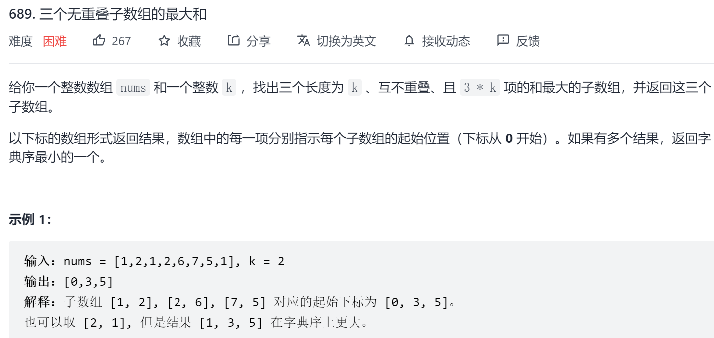
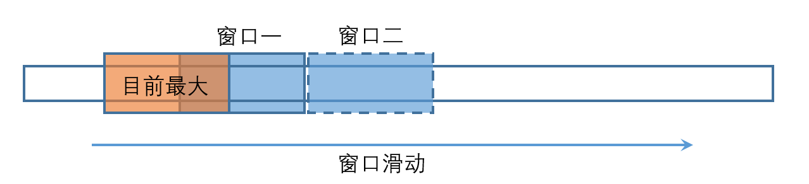
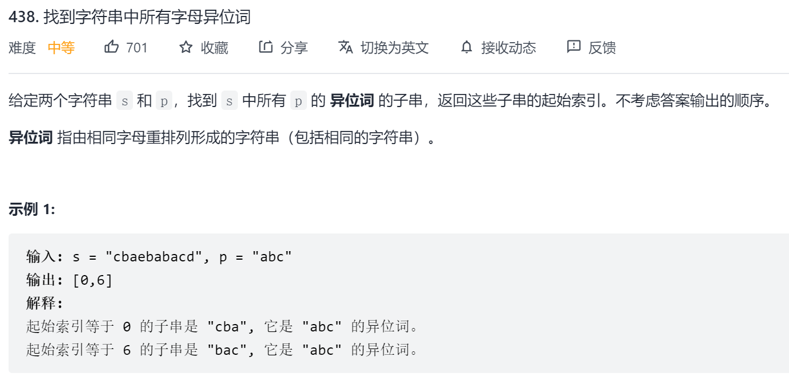
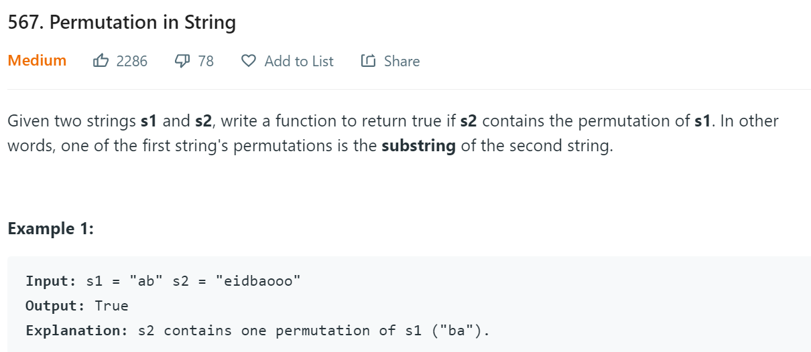
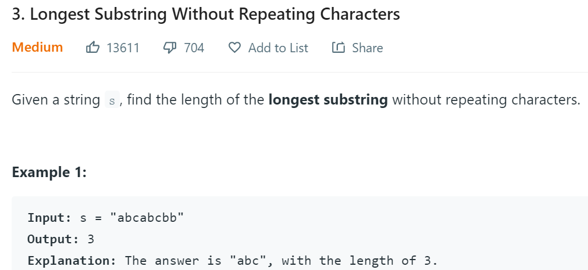
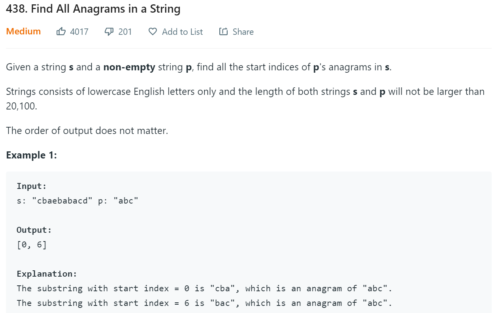

## 滑动窗口算法

滑动窗口通常是在[0,len)的数组中找到符合条件的最小窗口[l,r).

**暴力遍历**

使用两个for循环找到符合条件的最小窗口

```java
for(int l=0;l<len;l++){
	for(int r=l+1;r<len;r++){
        //若[l,r)为当前符合条件的最小窗口,更新数据
        update(l,r);
    }
}
```

**滑动窗口**

1. 对于窗口[l,r),若窗口不满足条件,则r++向右扩展窗口直到符合条件,此时窗口[l,r)为以r为右边界的*最大*窗口.

2. 为找到最小窗口,需要通过l++左缩窗口直到窗口[l,r)不再符合条件,窗口滑动过程中获得每个符合条件的窗口可用与更新最终结果.

对于滑动过程中产生的*最大*窗口[l,r),对[l-i,r)的操作是无意义的,因为[l,r)符合条件那么[l-i,r)肯定符合条件,但[l-i,r)一定不是最小窗口.这种判断相当于<font color='cornflowerblue'>剪枝</font>.

### [滑动窗口模板](https://zhuanlan.zhihu.com/p/107786714)

#### 模板代码

```java
/* 滑动窗口算法框架 */
void slidingWindow(string s, string t) {
    Map<char, int> need, window;
    //设置条件
    for (char c : t) need[c]++;
	//设置窗口边界，左闭右开
    int left = 0, right = 0;
    int valid = 0; 
    while (right < s.size()) {
        // c 是将移入窗口的字符
        char c = s[right];
        // 右移窗口
        right++;
        // 进行窗口内数据的一系列更新,若窗口满足条件则加入结果
        ...

        // 判断左侧窗口是否要收缩
        while (window needs shrink) {
            // d 是将移出窗口的字符
            char d = s[left];
            // 左移窗口
            left++;
            // 进行窗口内数据的一系列更新,若窗口满足条件则加入结果
            ...
        }
    }
}
```

#### 模板解析

1. need用于存储条件，window表示当前窗口的状态，通过比较need和window便可知窗口是否满足条件。

2. right++；扩张窗口，并更新window

   若窗口不满足条件，继续扩张窗口

   若满足条件（记录状态）

   ​	通过left++收缩窗口并更新window

   ​		若仍满足条件，记录状态

   ​		若不满足，则回到第2步扩张窗口


## 滑动窗口问题

### 76. Minimum Window Substring

**问题描述**


**need条件与window窗口**
need存储t中字符的个数

window则采用count判断是否符合条件

**窗口扩张**

若s[right]在t中，则对应的need--

​	若自减后need>=0，则count--（有效字符）

​	若自减后need<0,则count不变（无效字符，不更新window条件，即不影响count）

**窗口缩减**
若s[left]在t中，则对应的need++

​	若自增后need>0,则count++(有效字符)

​	若自增后need<=0,则count不变(无效字符，不更新window条件)

**窗口移动**

right++获取以right为右边界符合条件的窗口，结果是最大窗口

left++是获取以right为右边界符合条件的其他窗口，一般希望获得最小窗口

**代码**

```java
    public String minWindow(String s, String t) {
        //保存条件
        Map<Character, Integer> need = new HashMap<>();
        //保存条件总数
        int count = t.length();
        for (char c : t.toCharArray()) {
            int pre = need.getOrDefault(c, 0);
            need.put(c, pre + 1);
        }
        //定义左右边界
        int left = 0, right = 0;
        int rl = 0, rr = Integer.MAX_VALUE;
        char c = ' ';
        while (right < s.length()) {
            c = s.charAt(right++);
            if(t.indexOf(c)==-1){
                continue;
            }
            need.put(c, need.get(c) - 1);
            //有效计数,多余的为无效计数
            if (need.get(c) >= 0) {
                count--;
            }

            while (count == 0) {
                if (right - left < rr - rl) {
                    rl = left;
                    rr = right;
                }
                c = s.charAt(left++);
                if(t.indexOf(c)==-1){
                    continue;
                }
                need.put(c, need.get(c) + 1);
                //有效计数,多余的为无效计数
                if (need.get(c) > 0) {
                    count++;
                }
            }

        }
        if(rr-rl==Integer.MAX_VALUE){
            return "";
        }
        return s.substring(rl,rr);
    }
```

### [689. 三个无重叠子数组的最大和](https://leetcode-cn.com/problems/maximum-sum-of-3-non-overlapping-subarrays/)

**问题描述**



**回溯算法**

问题是找到3个索引,那么通过回溯算法遍历所有.

```java
class Solution {
    int[] sumK;
    int gap;
    int len;
    int max=Integer.MIN_VALUE;
    int[] res=new int[3];
    int[] tmp=new int[3];
    public int[] maxSumOfThreeSubarrays(int[] nums, int k) {
        sumK=new int[nums.length];
        gap=k;
        int part=0;
        for(int i=0;i<nums.length;i++){
            part+=nums[i];
            if(i>=k-1){
                sumK[i-k+1]=part;
                part-=nums[i-k+1];
            }
        }
        recur(0,0);
        return res;
    }
    private void recur(int idx,int time){
        if(time==3){
            if(sumK[tmp[0]]+sumK[tmp[1]]+sumK[tmp[2]]>max){
                max=sumK[tmp[0]]+sumK[tmp[1]]+sumK[tmp[2]];
                res=Arrays.copyOf(tmp,3);
            }
            return;
        }
        if(idx>sumK.length-gap){
            return;
        }
        //确定使用当前索引
        tmp[time]=idx;
        //处理tmp下一个位置
        recur(idx+gap,time+1);
        //不使用当前索引,处理下一个idx
        recur(idx+1,time);
    }
}
```

此次回溯算法并没有高效的剪枝,导致超时

```
sumK数组确实提高了部分效率,但远远不够
```

这里的回溯可用三个for循环代替

```java
for(int i=0;i<len-3*k;i++){
    for(int j=i+k;j<len-2*k;j++){
        for(int l=j+k;l<len-k;l++){
            ...
        }
    }
}
```

**滑动窗口算法**

3个窗口一起滑动,但每个窗口保留目前组合的最大值(例如窗口一保留窗口一的最大值位置,窗口二保留*窗口二+窗口一最大值*的最大值位置,一次类推)

```java
class Solution {
    public int[] maxSumOfThreeSubarrays(int[] nums, int k) {
        int[] ans = new int[3];
        int sum1 = 0, maxSum1 = 0, maxSum1Idx = 0;
        int sum2 = 0, maxSum12 = 0, maxSum12Idx1 = 0, maxSum12Idx2 = 0;
        int sum3 = 0, maxTotal = 0;
        for (int i = k * 2; i < nums.length; ++i) {
           	//窗口一右扩
            sum1 += nums[i - k * 2];
            //窗口二右扩
            sum2 += nums[i - k];
            //窗口三右扩
            sum3 += nums[i];
            if (i >= k * 3 - 1) {
                //保存窗口一最大的位置
                if (sum1 > maxSum1) {
                    maxSum1 = sum1;
                    maxSum1Idx = i - k * 3 + 1;
                }
                //保存窗口二最大的位置(窗口一肯定最大并且不会与窗口二重叠)
                if (maxSum1 + sum2 > maxSum12) {
                    maxSum12 = maxSum1 + sum2;
                    maxSum12Idx1 = maxSum1Idx;
                    maxSum12Idx2 = i - k * 2 + 1;
                }
                //保存窗口三最大的位置
                if (maxSum12 + sum3 > maxTotal) {
                    maxTotal = maxSum12 + sum3;
                    ans[0] = maxSum12Idx1;
                    ans[1] = maxSum12Idx2;
                    ans[2] = i - k + 1;
                }
                //窗口左缩
                sum1 -= nums[i - k * 3 + 1];
                sum2 -= nums[i - k * 2 + 1];
                sum3 -= nums[i - k + 1];
            }
        }
        return ans;
    }
}
```

滑动窗口相当于对回溯剪枝.



**窗口一的最大值**与**窗口二**更新**窗口二的最大值**,滑动过程中**两个最大值**不断更新.

窗口二无需再与**窗口一目前最大之前的窗口**进行组合,相当于剪枝(回溯算法多考虑了这些被减去的支)

### [438. 找到字符串中所有字母异位词](https://leetcode-cn.com/problems/find-all-anagrams-in-a-string/)

**问题描述**



**普通移动窗口**

```java
class Solution {
    private Map<Character,Integer> need=new HashMap<>();
    private Map<Character,Integer> needBak=new HashMap<>();
    public List<Integer> findAnagrams(String s, String p) {
        List<Integer> res=new LinkedList<>();
        for(char c:p.toCharArray()){
            need.put(c,need.getOrDefault(c,0)+1);
        }
        needBak.putAll(need);
        int count=p.length();
        int left = 0, right = 0;
        while (right < s.length()) {
            // c 是将移入窗口的字符
            char c = s.charAt(right);
            // 右移窗口
            right++;
            // 若c不在need中,则重置所有变量
            if(!need.containsKey(c)){
                left=right;
                need.clear();
                need.putAll(needBak);
                count=p.length();
                continue;
            }
            int pre=need.put(c,need.get(c)-1);
            count--;
            //若c为多余字符,则需从left开始剔除
            if(pre!=0){
                pre=-1;
            }
            while(pre!=-1){
                c=s.charAt(left);
                left++;
                pre=need.put(c,need.get(c)+1);
                count++;
            }
            //窗口右移与左移都可能获得结果,所以把结果判断放在最后
            if(count==0){
                res.add(left);
                c=s.charAt(left);
                need.put(c,need.get(c)+1);
                left++;
                count++;
            }
        }
        return res;      
    }
}
```

**特殊移动窗口**

```java
class Solution {
    public List<Integer> findAnagrams(String s, String p) {
        int sLen = s.length(), pLen = p.length();

        if (sLen < pLen) {
            return new ArrayList<Integer>();
        }

        List<Integer> ans = new ArrayList<Integer>();
        int[] count = new int[26];
        for (int i = 0; i < pLen; ++i) {
            ++count[s.charAt(i) - 'a'];
            --count[p.charAt(i) - 'a'];
        }

        int differ = 0;
        for (int j = 0; j < 26; ++j) {
            if (count[j] != 0) {
                ++differ;
            }
        }

        if (differ == 0) {
            ans.add(0);
        }

        for (int i = 0; i < sLen - pLen; ++i) {
            if (count[s.charAt(i) - 'a'] == 1) {  // 窗口中字母 s[i] 的数量与字符串 p 中的数量从不同变得相同
                --differ;
            } else if (count[s.charAt(i) - 'a'] == 0) {  // 窗口中字母 s[i] 的数量与字符串 p 中的数量从相同变得不同
                ++differ;
            }
            --count[s.charAt(i) - 'a'];

            if (count[s.charAt(i + pLen) - 'a'] == -1) {  // 窗口中字母 s[i+pLen] 的数量与字符串 p 中的数量从不同变得相同
                --differ;
            } else if (count[s.charAt(i + pLen) - 'a'] == 0) {  // 窗口中字母 s[i+pLen] 的数量与字符串 p 中的数量从相同变得不同
                ++differ;
            }
            ++count[s.charAt(i + pLen) - 'a'];
            
            if (differ == 0) {
                ans.add(i + 1);
            }
        }

        return ans;
    }
}
```


### 567. Permutation in String

**问题描述**


**need和window窗口**
need存储s1中字符

window可和need共用，无需额外使用

**窗口扩张**
若s2[right++]在need中，则need--

​	若need<0,则说明本字符超出，需要缩减窗口到need==0（left++，期间还包括其他字符的更新）

​	若need==0,则判断right-left==s1.length，若不相等则继续扩张窗口

​		<font color='red'>注意</font>：right-left>s1.length不存在，因为之前肯定会先存在need<0

**窗口缩减**
见窗口扩张

**窗口移动**

right++获取以right为右边界满足条件的窗口，若提前确认不符合条件，则停止滑动，开始移动左边界

left++使窗口不打破条件，若窗口再次符合条件，移动右边界

<font color='red'>满足条件</font>：窗口恰好与need要求一致

<font color='red'>符合条件</font>：窗口没有打破need的要求

**代码**

将s1外的字符区别对待

```java
    public boolean checkInclusion(String s1, String s2) {
        Map<Character, Integer> need = new HashMap<>();
        for (char c : s1.toCharArray()) {
            int pre = need.getOrDefault(c, 0);
            need.put(c, pre + 1);
        }
        Map<Character, Integer> needCp = new HashMap<>();
        needCp.putAll(need);
        int left = 0, right = 0;
        while (right < s2.length()) {
            char c = s2.charAt(right++);
            if (needCp.containsKey(c)) {
                int cur = needCp.get(c)-1;
                if (cur< 0) {
                    char c1=s2.charAt(left++);
                    while (c1!= c) {
                        needCp.put(c1,needCp.get(c1)+1);
                        c1=s2.charAt(left++);
                    }
                    cur=0;
                }else if (cur == 0) {
                    if (right - left == s1.length()) {
                        return true;
                    }
                }
                needCp.put(c,cur);
            } else {
                left = right;
                needCp=new HashMap<>();
                needCp.putAll(need);
            }
        }
        return false;
    }
```

遇到s1外的字符，直接need--，然后走need<0的if分支（<font color='red'>代码更优美</font>）

```java
    public boolean checkInclusion(String s1, String s2) {
        Map<Character, Integer> need = new HashMap<>();
        for (char c : s1.toCharArray()) {
            int pre = need.getOrDefault(c, 0);
            need.put(c, pre + 1);
        }
        Map<Character, Integer> needCp = new HashMap<>();
        needCp.putAll(need);
        int left = 0, right = 0;
        while (right < s2.length()) {
            char c = s2.charAt(right++);
                int cur = needCp.getOrDefault(c,0)-1;
                if (cur< 0) {
                    char c1=s2.charAt(left++);
                    while (c1!= c) {
                        needCp.put(c1,needCp.get(c1)+1);
                        c1=s2.charAt(left++);
                    }
                    cur=0;
                }else if (cur == 0) {
                    if (right - left == s1.length()) {
                        return true;
                    }
                }
                needCp.put(c,cur);
            } 
        return false;
    }
```

**注意**
在处理字符时，推荐使用字符数组处理。

```java
	public boolean checkInclusion(String s1, String s2) {
        int n = s1.length(), m = s2.length();
        if (n > m) {
            return false;
        }
        int[] cnt = new int[26];
        for (int i = 0; i < n; ++i) {
            --cnt[s1.charAt(i) - 'a'];
        }
        int left = 0;
        for (int right = 0; right < m; ++right) {
            int x = s2.charAt(right) - 'a';
            ++cnt[x];
            while (cnt[x] > 0) {
                --cnt[s2.charAt(left) - 'a'];
                ++left;
            }
            if (right - left + 1 == n) {
                return true;
            }
        }
        return false;
    }
```

因为滑动窗口在滑动时涉及到频繁的自增和自减，使用数组自增或自减更方便，而HashMap就更加繁琐。

### 3.Longest Substring Without Repeating Characters

**问题描述**




**结果**

使用max存储满足条件的窗口大小right-left的最大值

**need与window**

使用int[128]作为need数组，保存字符信息

**右边界移动**
right++，并更新need数组，若need[i]>1,开始左边界移动

**左边界移动**

left++，并更新need数组，直到need[i]==1

根据情况，使用right-left更新max值

### 483.Find All Anagrams in a String

**问题描述**



**解题思路**
与题578相似，不过不是找到一组满足条件的子串后终止，而是找到所有的子串地址。

