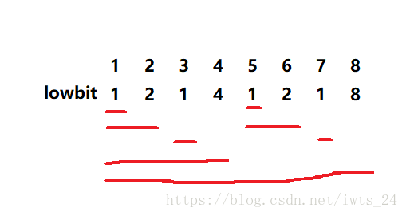

## [线段树解题思路](https://www.cnblogs.com/xenny/p/9801703.html)

**问题：**

有一个数组`a`，下标从`0`到`n-1`，现在给你`w`次修改，`q`次查询，修改的话是修改数组中某一个元素的值；查询的话是查询数组中任意一个区间的和，`w + q < 500000`。

**解决方案：**

> 1. 通常做法：修改是O(1)的时间复杂度，查询是O(*n*)的复杂度，总体时间复杂度为O(q*n)
>
> 2. 前缀树：使用前缀和优化查询，查询是O(1)复杂度；而修改时，之后的所有前缀和都要更新，所以修改的时间复杂度是O(n)。

以上两种做法，要么查询是O(1)，修改是O(n)；要么修改是O(1)，查询是O(n)。

可通过线段树减低整体时间复杂度。

### 线段树概念

**线段树结构**

线段树是一种二叉搜索树，每个结点都存储了一个区间。

**线段树作用**

线段树可以在线**修改**、**查询区间**上的最值，求和。

一维线段树可以扩充到二维线段树（矩阵树）和三维线段树（空间树）。

对于一维线段树来说，每次更新以及查询的时间复杂度为O(logN)

**线段树问题要求**

1. 查询区间

​	若$节点区间\subseteq查询区间$：直接返回节点区间结果

​	若$节点区间\nsubseteq查询区间$：继续查询节点区间的两个子区间，并合并结果

​	合并结果时，要求<font color='red'>合并操作符合结合律</font>

2. 区间更新

​    为避免每次更新都更新叶子节点，可设置一个懒更新数组记录节点区间需要更新的值，并把更新操作推迟到子区间查询，合并多个更新操作。

$$seg[parent]*lazy[parent]=seg[child1]*lazy[child1]+...+seg[childn]*lazy[childn] \\+为区间合并操作\\*为懒更新操作$$

<font color='red'>懒更新操作和区间合并操作需要符合分配律</font>

**线段树和其他RMQ算法的区别**

常用的解决RMQ问题有**线段树算法**和**稀疏表（ST)算法**

*相同点*

> 二者预处理时间都是O(NlogN)

*不同点*

> ST算法的单次查询操作是O(1)，而线段树算法查询操作是O(logN)
>
> 线段树支持在线更新值，而ST算法不支持在线操作

### 线段树操作

线段树常用的操作包括build，pushUp，query，update，pushDown

> build用于构建线段树，通常是一个递归的过程
>
> pushUp用于处理父节点，通常采用后序遍历，其处理结果依赖于子节点
>
> query用于查询子区间的值
>
> update用于更新指定索引的值，同时更新相关的线段树节点，需要pushUp来更新父节点
>
> pushDown一般用于区间更新，将区间子节点的更新延迟到子节点查询

#### 数组操作（zwk线段树）

利用数组结构表示线段树，便于处理区间索引范围相关统计的问题

> 例如，数组arr={1,8,6,4,3,5}，获取指定索引区间最大值，如求索引位置[1,3]的最大值是8

若求其他更加通用的统计问题，简单的数组结构则不再满足，需要使用树结构来处理

> 数组arr={1,8,6,4,3,5}，获取指定数值区间个数，如求arr在[2,7]范围内的个数是4

**问题描述**

对于数组arr={1,8,6,4,3,5}，使用线段树获取指定区间最大值。


**build建立线段树**

```java
const int maxn = 100005;
int a[maxn],t[maxn<<2];        //a为原来区间，t为线段树

void pushup(int k){        //更新函数，这里是实现最大值 ，同理可以变成，最小值，区间和等
    t[k] = max(t[k<<1],t[k<<1|1]);
}

//递归方式建树 build(1,1,n);
void build(int k,int l,int r){    //k为当前需要建立的结点，l为当前需要建立区间的左端点，r则为右端点
    if(l == r)    //左端点等于右端点，即为叶子节点，直接赋值即可
        t	[k] = a[l];
    else{
        int m = (r+l)>>1;    //m则为中间点，左儿子的结点区间为[l,m],右儿子的结点区间为[m+1,r]
        build(k<<1,l,m);    //递归构造左儿子结点
        build(k<<1|1,m+1,r);    //递归构造右儿子结点
        pushup(k);    //更新父节点
    }
}
```

代码分析：

> 代码始位置，表示左子树和右子树更简便。
>
> 以1为起始位置，表示左子树和右子树更简便。
>
> ×/÷2都采用位运算，提高计算效率
>
> 更新父节点使用**后序处理**，因为依赖于子节点的值（取子节点最大值）
>
> 取l,r中点时，一般采用（r+l)/2，但l+r可能超出边界，使用l+(l-r)/2更安全。

**query查询区间值**

```java
//递归方式区间查询 query(L,R,1,n,1);
int query(int L,int R,int l,int r,int k){    //[L,R]即为要查询的区间，l，r为结点区间，k为结点下标
    if(L <= l && r <= R)    //如果当前结点的区间真包含于要查询的区间内，则返回结点信息且不需要往下递归
        return t[k];
    else{
        int res = -INF;    //返回值变量，根据具体线段树查询的什么而自定义
        int mid = (r+l)>>1;    //m则为中间点，左儿子的结点区间为[l,m],右儿子的结点区间为[m+1,r]
        if(L <= m)    //如果左子树和需要查询的区间交集非空
            res = max(res, query(L,R,l,m,k<<1));
        if(R > m)    //如果右子树和需要查询的区间交集非空，注意这里不是else if，因为查询区间可能同时和左右区间都有交集
            res = max(res, query(L,R,m+1,r,k<<1|1));
        return res;    //返回当前结点得到的信息
    }
}
```

代码分析：

> 从[l,r]区间中查询[L,R]区间的值，包含以下三个步骤
>
> 1. [l,r]⊆[L,R]，直接返回线段树结果
> 2. 将[l,r]拆分，直到[l,r]⊆[L,R]
> 3. 对多个子结果进行归并处理(求和/求最值等)

**update点单值**

```java
//递归方式更新 updata(p,v,1,n,1);
void updata(int p,int v,int l,int r,int k){    //p为下标，v为要加上的值，l，r为结点区间，k为结点下标
    if(l == r)    //左端点等于右端点，即为叶子结点，直接加上v即可
        a[k] += v,t[k] += v;    //原数组和线段树数组都得到更新
    else{
        int m = l + ((r-l)>>1);    //m则为中间点，左儿子的结点区间为[l,m],右儿子的结点区间为[m+1,r]
        if(p <= m)    //如果需要更新的结点在左子树区间
            updata(p,v,l,m,k<<1);
        else    //如果需要更新的结点在右子树区间
            updata(p,v,m+1,r,k<<1|1);
        pushup(k);    //更新父节点的值
    }
}
```

代码分析：

> 点更新类似二叉搜索树的搜索过程，不过更新子节点后需要通过pushUp对父节点进行同步更新

##### 懒更新

**update区间更新**

```java
void Pushdown(int k){    //更新子树的lazy值，这里是RMQ的函数，要实现区间和等则需要修改函数内容
    if(lazy[k]！=0){    //如果有lazy标记
        lazy[k<<1] += lazy[k];    //更新左子树的lazy值
        lazy[k<<1|1] += lazy[k];    //更新右子树的lazy值
        t[k<<1] += lazy[k];        //左子树的最值加上lazy值
        t[k<<1|1] += lazy[k];    //右子树的最值加上lazy值
        lazy[k] = 0;    //lazy值归0
    }
}

//递归更新区间 updata(L,R,v,1,n,1);
void updata(int L,int R,int v,int l,int r,int k){    //[L,R]即为要更新的区间，l，r为结点区间，k为结点下标
    if(L <= l && r <= R){    //如果当前结点的区间真包含于要更新的区间内
        lazy[k] += v;    //懒惰标记
        t[k] += v;    //最大值加上v之后，此区间的最大值也肯定是加v
    }
    else{
        Pushdown(k);    //重难点，查询lazy标记，更新子树
        int m = l + ((r-l)>>1);
        if(L <= m)    //如果左子树和需要更新的区间交集非空
            update(L,R,v,l,m,k<<1);
        if(m < R)    //如果右子树和需要更新的区间交集非空
            update(L,R,v,m+1,r,k<<1|1);
        pushup(k);    //更新父节点
    }
}
```

lazy标签的作用：

> 对于一个区间[L,R]来说，我们可能每次都更新区间中的每个值，那样的话更新的复杂度将会是O(NlogN)。
>
> 为了降低区间更新的复杂度，线段树将每个值的更新延迟至查询该节点的时机(**延迟更新不影响使用**)，并且没有增加查询的时间复杂度
>
> 一个节点有lazy标签，表示该节点的**子节点**未更新，而更新内容就保存在lazy标签中。

pushDown作用：

> pushDown用于将当前节点的lazy标签向下传递，并重置当前节点的lazy标签

update分析：

> 区间更新是**区间查询**与**点更新**的结合
>
> 1. [l,r]⊆[L,R]，更新结果并设置lazy标签
>
> 2. 更新区间也是对区间的一次查询，先使用pushDown完成lazy标签向下传递，解决了多次更新一次查询可能引发的问题
>
>    之后将[l,r]拆分，直到[l,r]⊆[L,R]。
>
> 3. 更新父节点。

query代码加入pushDown更新操作

```java
//递归方式区间查询 query(L,R,1,n,1);
int query(int L,int R,int l,int r,int k){    //[L,R]即为要查询的区间，l，r为结点区间，k为结点下标
    if(L <= l && r <= R)    //如果当前结点的区间真包含于要查询的区间内，则返回结点信息且不需要往下递归
        return t[k];
    else{
        Pushdown(k);    /**每次都需要更新子树的Lazy标记*/
        int res = -INF;    //返回值变量，根据具体线段树查询的什么而自定义
        int mid = l + ((r-l)>>1);    //m则为中间点，左儿子的结点区间为[l,m],右儿子的结点区间为[m+1,r]
        if(L <= m)    //如果左子树和需要查询的区间交集非空
            res = max(res, query(L,R,l,m,k<<1));
        if(R > m)    //如果右子树和需要查询的区间交集非空，注意这里不是else if，因为查询区间可能同时和左右区间都有交集
            res = max(res, query(L,R,m+1,r,k<<1|1));

        return res;    //返回当前结点得到的信息
    }
}
```

query分析：

> 在查询子区间前，先判断是否带有lazy标签，若有则需先更新子节点再进行下一步操作。

#### 树操作

再看数组操作的问题

> 数组arr={1,8,6,4,3,5}，获取指定数值区间最大值，如求arr在[1,7]范围内的最大值是6

首先对数组进行排序，得到有序数组sortedArr={1,3,4,5,6,8}，之后根据sortedArr构建线段树


```java
public class SegmentTree{
    public int query(Node  node, int l, int r) {
        if(l<=node.lb&&r>=node.rb){// return result if range of node in [l,r]
            return node.count;
        }else if(l>node.rb||r<node.lb){// return 0 if range of node doesn't intersect [l,r]
            return 0;
        }else{// query in the children of node
            if(node.left!=null&&node.right!=null){
                return query(node.left,l,r)+query(node.right,l,r);
            }else{
                return 0;
            }

        }
    }
    
    private void pushup(Node node) {
        // update count
        node.count=node.left.count+node.right.count;
    }
    
	private Node build(long[] arr,int l,int r) {
        Node node = new Node();
        if(l==r){// build the leaf node
            node.lb=arr[l];
            node.rb=arr[r];
            node.count=1;
            return node;
        }
        int m=l+((r-l)>>1);
        // build the left child and right child
        node.left=build(arr,l,m);
        node.right=build(arr,m+1,r);
        // update child
        node.lb= node.left.lb;
        node.rb= node.right.rb;
        pushup(node);
        return node;
    }

    class Node{
        Node left;
        Node right;
        long lb;
        long rb;
        int count;
    }
}
```

**数组线段树操作**

若执意要使用数组线段树实现问题，则需要对分散的数据进行离散化处理，将数值离散化连续的索引。

> 数组arr={1,8,6,4,3,5}，获取指定数值区间最大值，如求arr在[1,7]范围内的最大值是6

- 离散化

```java
public int queryRange(int[] sortedArr,int lb,int rb){
    Map<Integer> tm=new TreeMap<>();
    // 离散化
    for(int i=0;i<sortedArr.length;i++){
        tm.put{sortedArr[i],i};
    }
    int len=tm.size();
    int seg[]=new int[len<<2];

    for(int n:sortedArr){
        update(tm.get(n),1,1,n,0);
    }
    //获取离散化后的边界
    int left=tm.ceilingKey(lb);
    int right=tm.floorKey(rb);
    
    return query(left,right,0,len-1,1);
}

public update(int idx,int val,int l,int r,int k){
    if(l==r){
        seg[k]+=val;
    }else{
        int m=l+((r-l)>>1);
        if(idx<=m){
            update(idx,val,l,m,k<<1);
        }else{
            update(idx,val,m+1,r,k<<1|1);
        }
        pushup(k);
    }
}

public int query(int left,int right,int l,int r,int k){
    if(left<=l&&right>=r){
        return seg[k];
    }else{
        int res=0;
        int m=l+((r-l)>>1);
        if(left<=m){
            res+=query(left,right,l,m,k<<1);
        }
        if(right>=m+1){
            res+=query(left,right,m+1,r,k<<1|);
        }
        return res;
    }
}

public void pushup(int k){
    seg[k]=seg[k<<1]+seg[k<<1|1];
}
```

**线段树更新**

在数组线段树和之前提到的树型线段树中，线段树的结构在初始时就确定了，不能再改变。对于不适合解决结构变化的区间查询问题

> 给定一个顺序链表lst，偶尔在lst中添加数据，并需要频繁进行区间值个数查询，该如何实现

对于以上问题，由于初始链表数据个数不确定，不能构造普通的线段树。但可以动态构造**平衡树线段树**，但设计平衡操作，比较麻烦。

## [树状数组](https://blog.csdn.net/FlushHip/article/details/79165701)

参考链接：

https://blog.csdn.net/iwts_24/article/details/82497026

https://blog.csdn.net/FlushHip/article/details/79165701

### 树状数组概念

线段树最多需要4*n个空间来构建一棵线段树，其中一部分空间被浪费。可利用树状数组可降低空间使用。

**树状数组结构与性质**


> 树状数组规定，对于arr数组，c数组保留了arr部分索引位置的和；
>
> c数组的索引从1开始，对应arr数组的索引0
>
> 对于c数组中的索引i，lowbit(i)取出i的零头*（二进制，lowbit(110)=10,lowbit(1000)=1000）*；
>
> c[i]表示arr中第i-lowbit(i)+1位到i的和。

树状数组实现了O(N)空间复杂度**（常数项为1）**，区间查询和单点更新时间复杂度为O(logN)。

### 树状数组操作

**取零操作**

```java
int lowbit(int x){
	return x&(-x)
}
```

**构造树状数组**

```java
int[] build(int[] arr){
    // build bitTree from 1, convenient for & operation 
	int[] c=new int[arr.length+1];
    for(int i=1;i<c.length;i++){
        update(i,arr[i-1],c);
    }
}
```

**查询区间和**

```java
int sum(int l,int r, int[] c){
    int ret = 0;
    // get preSum ahead of r
    for ( ; r > 0; ret += c[r], r -= lowbit(r));
    // get preSum ahead of l, then substract it from ret
    for ( ; l > 0; ret -= c[l], l -= lowbit(l));
    return ret;
}
```

for循环操作：获取的是前序和

**单点更新**

```java
void update(int x, int val, int[] c){
    for ( ; x < c.length; c[x] += val, x += lowbit(x));
}
```

单点更新一次更新多个位置，即c数组中包含了当前arr数组被更新索引位置的所有索引位置，例如arr[3]->c[3,4,8]



### 树状数组与线段树的异同

**同**

> 区间和查询和单点更新的时间复杂度为O(logN)
>
> 空间复杂度为O(N)

**异**

> 线段树的空间利用率低于树状数组

**运用场景**

使用树状数组的场景都能使用线段树。

差异详见：


幺半群


交换群


在进行区间和查询时，树状数组实际是进行了一个减法操作，即与逆元运算。

> 求区间[3,7]，实际计算的是c[7]+(-c[3])

支持逆元操作的问题

- 区间和
- 区间xor和

不支持逆元的操作

- 求区间最值

### [树状数组求最值](https://blog.csdn.net/qq_41661809/article/details/86667055)


由于求最值操作不是可逆操作（不存在逆元），所以不能通过区间相减获得，但可以拆分为多个区间相加.

> 对于区间[4,7],可分解为max{arr[4],c[6],c[7]}

具体代码如下

```java
若y-lowbit(y) > x，则query(x,y) = max( c[y] , query(x, y-lowbit(y)));
若y-lowbit(y) <=x，则query(x,y) = max( arr[y] , query(x, y-1);
int query(int x, int y){
	int ans = 0;
	while (y >= x){
		ans = max(arr[y], ans);
		y --;
		for (; y-lowbit(y) >= x; y -= lowbit(y))
			ans = max(c[y], ans);
	}
	return ans;
}
```

以上操作的时间复杂度**(log<sup>n</sup>)<sup>2</sup>**

## 问题记录

### 307 区间求和

**问题描述**


**解题思路(线段树）**

1. 构建线段树，pushUp采用t[k]=t[k<<1]+t[k<<1|1]
2. 在query中，res要分别加上左右子树的值

**解题思路（数组）**

使用sum数组统计从开始到当前索引的和，如sum[i+1]=arr[0]+...+arr[i].

range[i,j]=sum[j+1]-sum[i];

### 327 区间和个数

**问题描述**


**暴力解法**

使用前序和数组preSum双层循环遍历，判断以下式子是否成立

$$preSum[j+1]-preSum[i]\in[lower,upper]\quad i<=j$$

若成立，则count++；

**线段树解法**

$$lower\leqslant preSum[j+1]-preSum[i]\leqslant upper \quad i<=j \\ \Rightarrow preSum[j+1]-lower\geqslant preSum[i]\geqslant preSum[j+1]-upper \quad i<=j$$

问题转换为

> 对于索引j，之前有多少个前序和preSum[i]在指定区间中，即区间统计问题

1. 排序

为了找出在j之前有多少个preSum[i]在j区间内，需要先对preSum[i]进行排序

> 例如，在2，3，-1，5，4中多次查找指定区间的值个数，首先也需要排序，再通过二分法找到左右边界对应的索引值，右索引-索引+1便是属于指定区间的个数。若仅仅查询一次，则直接遍历即可。

2. 区间离散化

由于问题是要查找区间和个数，所以线段数中存储的应该是属于区间值的个数，而不是前序和。

为了便于区间查找，preSum的相对顺序不能变，所以使用离散化处理解决问题。

> 例如， 2，3，-1，5，4排序后-1，2，3，4，5；对应的索引为0，1，2，3，4.

3. 先插入preSum[j],在进行更新操作。

对于preSum[j],在线段树中统计$[preSum[j+1]-lower,preSum[j+1]-upper]$区间的个数，之后将preSum加入线段树进行更新操作，**保证了$i<=j$,查询的是j之前的前序和**。

4. 确定叶子节点数

由于线段树是在区间统计前构造好的，而线段树的构造取决于叶子节点的个数，所以首先需要确定叶子节点个数。

- 所有的前序和preSum[j]应该作为叶子节点
- 对于离散化的数据，在进行区间查询时，查询边界也需要作为叶子节点，否则无法确定边界。

**线段树代码**

```java
class Solution {
    //保存前序和i在区间j范围内的个数
    int[] seg;

    public int countRangeSum(int[] nums, int lower, int upper) {
        long[] preSum = new long[nums.length + 1];
        for (int i = 0; i < nums.length; i++) {
            preSum[i + 1] = preSum[i] + nums[i];
        }

        TreeSet<Long> ts = new TreeSet<>();
        //获取前序和以及对应的边界值
        for (Long i : preSum) {
            ts.add(i);
            ts.add(i - lower);
            ts.add(i - upper);
        }
        int len = ts.size();
        seg = new int[len << 2];
        HashMap<Long, Integer> helper = new HashMap<>();
		//离散化处理
        int idx = 0;
        for (long i : ts) {
            helper.put(i, idx++);
        }
        int res = 0;
        for (long x : preSum) {
            //查询
            res += query(helper.get(x - upper), helper.get(x - lower), 0, len - 1, 1);
            //插入更新
            update(helper.get(x), 1, 0, len - 1, 1);
        }
        return res;

    }

    private void pushup(int k) {
        seg[k] = seg[k << 1] + seg[k << 1 | 1];
    }
	//区间更新
    private void update(int idx, int v, int l, int r, int k) {
        if (l == r) {
            seg[k] += v;
        } else {
            int m = l + ((r - l) >> 1);
            if (idx <= m) {
                update(idx, v, l, m, k << 1);
            } else {
                update(idx, v, m + 1, r, k << 1 | 1);
            }
            pushup(k);
        }
    }

    //区间查询
    private int query(int left, int right, int l, int r, int k) {
        if (left <= l && right >= r) {
            return seg[k];
        } else {
            int res = 0;
            int m = l + ((r - l) >> 1);
            if (left <= m) {
                res += query(left, right, l, m, k << 1);
            }
            if (right >= m + 1) {
                res += query(left, right, m + 1, r, k << 1 | 1);
            }
            return res;
        }
    }
}
```


### 218 天际线

**问题描述**


### 315 统计逆序对

**问题描述**


**[解题思路](https://blog.csdn.net/m0_38033475/article/details/80330157)**

1. 将数组的值与索引绑定，并对数组的值进行排序。

   

2. 根据排序后的索引，对arr（树状数组）进行赋值。并统计之后的空位数，即在原序列中小于该索引对应值并排在之后的数目。

   

