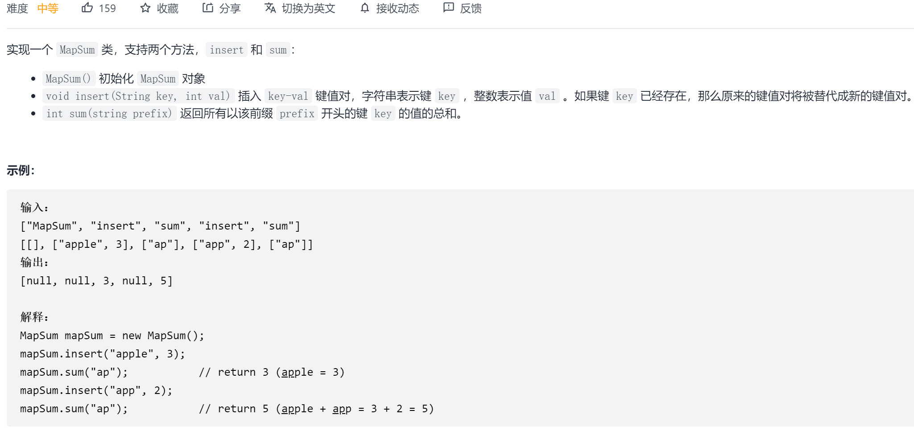

## 前缀树

### 概念

**定义**

Trie树，即字典树，又称单词查找树或键树，是一种树形结构，是一种哈希树的变种。典型应用是用于统计和排序大量的字符串（但不仅限于字符串），所以经常被搜索引擎系统用于文本词频统计。它的优点是：最大限度地减少无谓的字符串比较，查询效率比哈希表高。


 **核心思想**

Trie的核心思想是空间换时间。利用字符串的公共前缀来降低查询时间的开销以达到提高效率的目的。

**基本性质**

1. 根节点不包含字符，除根节点外每一个节点都只包含一个字符。
2. 从根节点到某一节点，路径上经过的字符连接起来，为该节点对应的字符串。
3. 每个节点的所有子节点包含的字符都不相同。

### 代码表示

```java
class TrieNode {
    //节点的值
    int val = 0;
    //节点字符
    char c=' ';
    //下一个字符节点
    TrieNode[] next = new TrieNode[26];
    
    //从该节点开始,插入(key,val),一般通过root.insert(key,val)插入
    public void insert(String key, int val) {        
        TrieNode node = this;
        for (char c : key.toCharArray()) {
            // 若节点不存在则创建
            if (node.next[c - 'a'] == null) {
                node.next[c - 'a'] = new TrieNode();
            }
            node = node.next[c - 'a'];
            //更新节点的值
            update(node);
        }
    }
    
    //从该节点开始,获取前缀为prefix节点的val,一般通过root.getVal(prefix)获取
    public int getVal(String prefix) {
        TrieNode node = this;
        for (char c : prefix.toCharArray()) {
            if (node.next[c - 'a'] == null) {
                //如果前缀不存在,则返回默认空值
                return 0;
            }
            //处理下一个节点
            node = node.next[c - 'a'];
        }
        return node.val;
    }
}
```

- <font color='red'>前缀中一般使用节点数组表示下一层次的所有节点(已知节点类型,如小写字符),若节点类型为未知,推荐使用map<Object,TrieNode></font>

- <font color='cornflowerblue'>update()</font>操作是关键,需要依据题意而定.

  注意update()是否需要更新root

### 题目

#### [677. 键值映射](https://leetcode-cn.com/problems/map-sum-pairs/)

**题目描述**



**解题思路**

1. 构造一棵前缀树,用以保存所有字符
2. 节点需要保存对应prefix的sum值和val值(后期可优化除去)
3. update()需要更新sum和val
4. 对于节点值受所有子节点影响的，通常可采用后序遍历处理，如线段树的pushUp操作

#### 212 单词搜索II

**问题描述**


**解题思路**

1. 对board中每个位置进行深度遍历，并将此遍历的字符添加到字典树中，**直到字典树深度与words中最大长度相同**