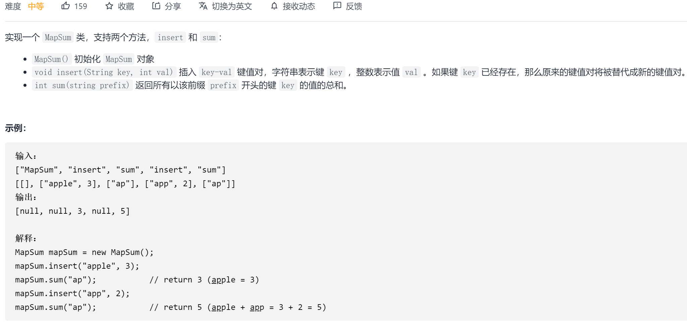

## 二叉树遍历
### 深度遍历
#### 前序遍历
**101：[判断树是否对称](https://leetcode.com/problems/symmetric-tree/)**


**108：[有序序列转化为平衡二叉搜索树](https://leetcode.com/problems/convert-sorted-array-to-binary-search-tree/)**

**105：[根据中序遍历和先序遍历还原树](https://leetcode.com/problems/construct-binary-tree-from-preorder-and-inorder-traversal/)**

**解题思路：**
1. 首先从先序序列中找到根节点3
2. 在中序序列中找到根序列3，并将树分为左子树[9]与右子树[15,20,7]
3. 先序序列根据中序左右子树长度，得到左子树[9]与右子树[20,15,7]
4. 重复1,2,3步骤，知道先序和中序序列中只有一个节点，构造叶子节点

**114：[将树拉直](https://leetcode.com/problems/flatten-binary-tree-to-linked-list/)**


**129:[树的路径和](https://leetcode.com/problems/sum-root-to-leaf-numbers/)**


#### 中序遍历
94：[中序遍历二叉树](https://leetcode.com/problems/binary-tree-inorder-traversal/)

99：[恢复搜索二叉树序列](https://leetcode.com/problems/recover-binary-search-tree/)

**解题思路：**
中序遍历排列1,2...i...j...n，其中i，j顺序需要交换，找出i，j节点即可。
1. 若i，j相邻
2. 若i，j不相邻
#### 后序遍历

**110：[判断是否为平衡二叉树](https://leetcode.com/problems/balanced-binary-tree/)**


**解题思路：**

 1. 后序遍历判断每个结点的左右子树深度差是否大于1
    &emsp;大于1，返回-1
    &emsp;不大于1，返回该节点深度
  2. 若根节点返回值为-1则不是平衡二叉树；反之则是。

 **113：[列出树路径和](https://leetcode.com/problems/path-sum-ii/)**


**124：[最大路径](https://leetcode.com/problems/binary-tree-maximum-path-sum/)**


**解题思路：**

1. 后序遍历节点
2. 计算该节点**两路径**（左右子树）的最大值，并试图更新最大值
3. 计算该节点**单路径**（左/右子树）的最大值，并结合节点值返回

### 广度遍历
#### 层次遍历
102：[层次遍历](https://leetcode.com/problems/binary-tree-level-order-traversal/)

103：[Z字形遍历树](https://leetcode.com/problems/binary-tree-zigzag-level-order-traversal/)

**解题思路：**
类似层次遍历，但需要设置boolean，控制偶数序号的数组反转

**116：[为完全二叉树补全next指针](https://leetcode.com/problems/populating-next-right-pointers-in-each-node/)**

**解题思路：**

 1. 层次遍历适用于普通二叉树，完全二叉树更特殊，可寻求更简解法
 2. 使用相邻的两个节点递归
 &emsp;left.left->left.right
 &emsp;left.right->right.left
 &emsp;right.left->right.right


> 若不是完全二叉树，可充分使用多余的next指针，代替层次遍历的队列，将空间复杂度降低到O(0)

**199：[树的右视图](https://leetcode.com/problems/binary-tree-right-side-view/)**


## 动态规划
**95：[获取所有的二叉查找树](https://leetcode.com/problems/unique-binary-search-trees-ii/)**

**解题思路：**
 

1)	该问题实际是一个动态规划问题，i树可由j为root，左子树j-1，右子树为i-j（j<=i）
2)	左子树j-1可沿用之前计算的结果，右子树i-j沿用之前的结果并将每个结点+j

96：[计算所有二叉搜索树数目](https://leetcode.com/problems/unique-binary-search-trees/)
	
**解题思路：**
 

1)	该问题实际是一个动态规划问题，i树可由j为root，左子树j-1，右子树为i-j（j<=i）
2)	i树的总数=（j-1）树总数*（i-j）树总数。

> 该问题可看作给定中序遍历序列对应的二叉树数目（卡特兰数）

## 二叉搜索树

### 二叉搜索树的删除

**根据值删除**

- 如果 key > root.val，说明要删除的节点在右子树，root.right = deleteNode(root.right, key)。
- 如果 key < root.val，说明要删除的节点在左子树，root.left = deleteNode(root.left, key)。
- 如果 key == root.val，则该节点就是我们要删除的节点，则：
  - 如果该节点是叶子节点，则直接删除它：root = null。
  - 如果该节点不是叶子节点且有右节点，则用它的后继节点的值替代 root.val = successor.val，然后删除后继节点。
  - 如果该节点不是叶子节点且只有左节点，则用它的前驱节点的值替代 root.val = predecessor.val，然后删除前驱节点。
    返回 root。

```java
class Solution {
  /*
  One step right and then always left
  */
  public int successor(TreeNode root) {
    root = root.right;
    while (root.left != null) root = root.left;
    return root.val;
  }

  /*
  One step left and then always right
  */
  public int predecessor(TreeNode root) {
    root = root.left;
    while (root.right != null) root = root.right;
    return root.val;
  }

  public TreeNode deleteNode(TreeNode root, int key) {
    if (root == null) return null;

    // delete from the right subtree
    if (key > root.val) root.right = deleteNode(root.right, key);
    // delete from the left subtree
    else if (key < root.val) root.left = deleteNode(root.left, key);
    // delete the current node
    else {
      // the node is a leaf
      if (root.left == null && root.right == null) {
          root = null;
      } 
      // the node is not a leaf and has a right child
      else if (root.right != null) {
        root.val = successor(root);
        root.right = deleteNode(root.right, root.val);
      }
      // the node is not a leaf, has no right child, and has a left child    
      else {
        root.val = predecessor(root);
        root.left = deleteNode(root.left, root.val);
      }
    }
    return root;
  }
}
```

根据值删除只适用于严格二叉搜索树,即没有重复值的二叉搜索树.

## 前缀树

### 概念


**定义**

Trie树，即字典树，又称单词查找树或键树，是一种树形结构，是一种哈希树的变种。典型应用是用于统计和排序大量的字符串（但不仅限于字符串），所以经常被搜索引擎系统用于文本词频统计。它的优点是：最大限度地减少无谓的字符串比较，查询效率比哈希表高。


 **核心思想**

Trie的核心思想是空间换时间。利用字符串的公共前缀来降低查询时间的开销以达到提高效率的目的。

**基本性质**

1. 根节点不包含字符，除根节点外每一个节点都只包含一个字符。
2. 从根节点到某一节点，路径上经过的字符连接起来，为该节点对应的字符串。
3. 每个节点的所有子节点包含的字符都不相同。

**代码表示**

```java
class TrieNode {
    //节点的值
    int val = 0;
    //节点字符
    char c=' ';
    //下一个字符节点
    TrieNode[] next = new TrieNode[26];
    
    //从该节点开始,插入(key,val),一般通过root.insert(key,val)插入
    public void insert(String key, int val) {        
        TrieNode node = this;
        for (char c : key.toCharArray()) {
            if (node.next[c - 'a'] == null) {
                node.next[c - 'a'] = new TrieNode();
            }
            node = node.next[c - 'a'];
            //更新节点的值
            update(node);
        }
    }
    
    //从该节点开始,获取前缀为prefix节点的val,一般通过root.getVal(prefix)获取
    public int getVal(String prefix) {
        TrieNode node = this;
        for (char c : prefix.toCharArray()) {
            if (node.next[c - 'a'] == null) {
                //如果前缀不存在,则返回默认空值
                return 0;
            }
            //处理下一个节点
            node = node.next[c - 'a'];
        }
        return node.val;
    }
}
```

- <font color='red'>前缀中一般使用节点数组表示下一层次的所有节点(已知节点类型,如小写字符),若节点类型为未知,推荐使用map<Object,TrieNode></font>
- <font color='cornflowerblue'>update()</font>操作是关键,需要依据题意而定.

### 题目

#### [677. 键值映射](https://leetcode-cn.com/problems/map-sum-pairs/)

**题目描述**



**解题思路**

1. 构造一棵前缀树,用以保存所有字符
2. 节点需要保存对应prefix的sum值和val值(后期可优化除去)
3. update()需要更新sum和val