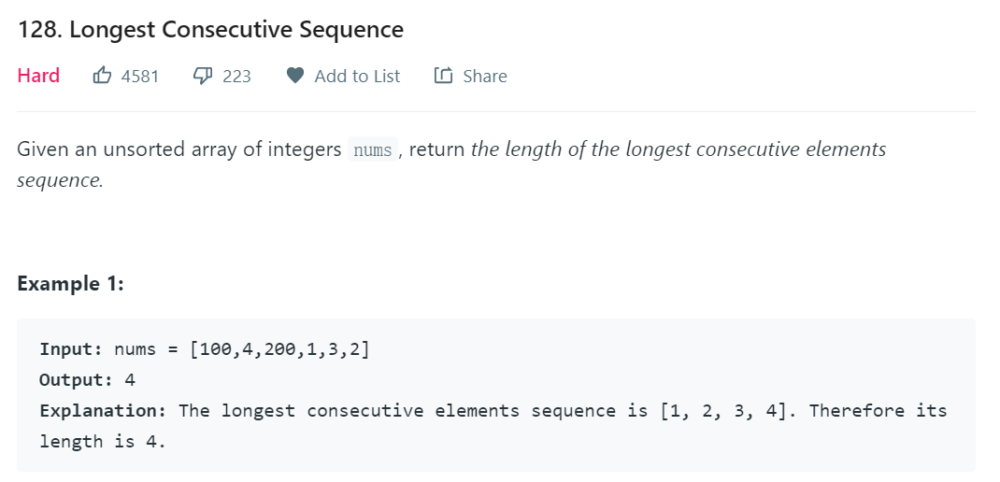
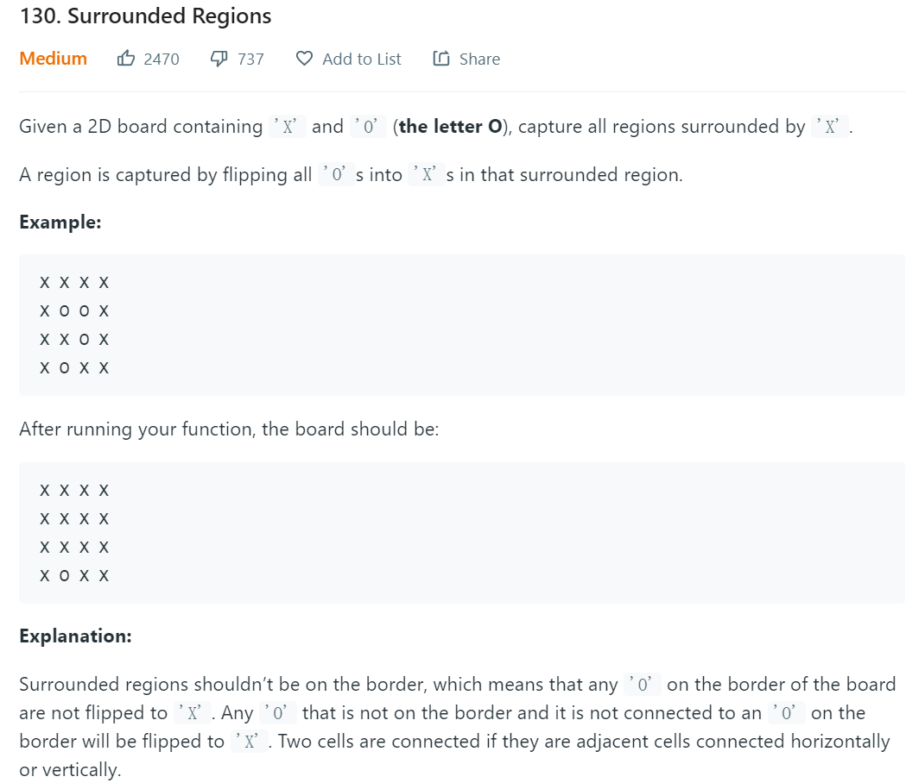
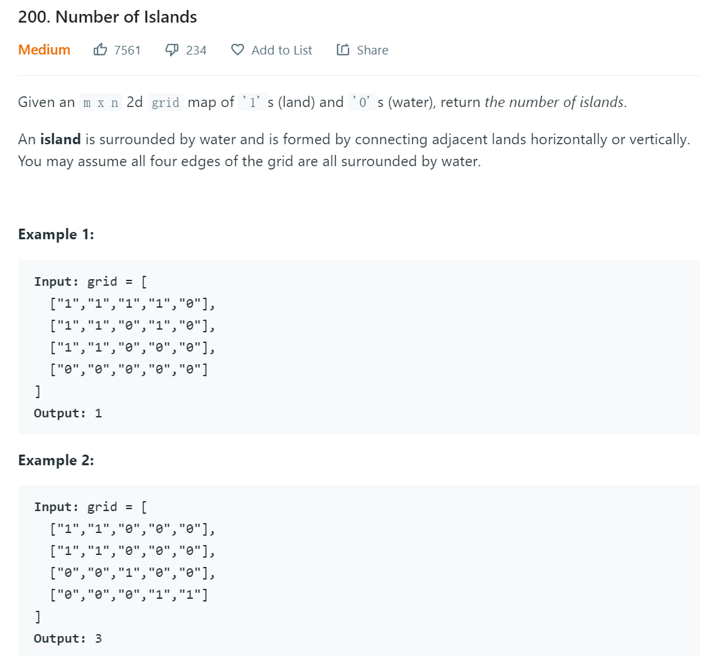
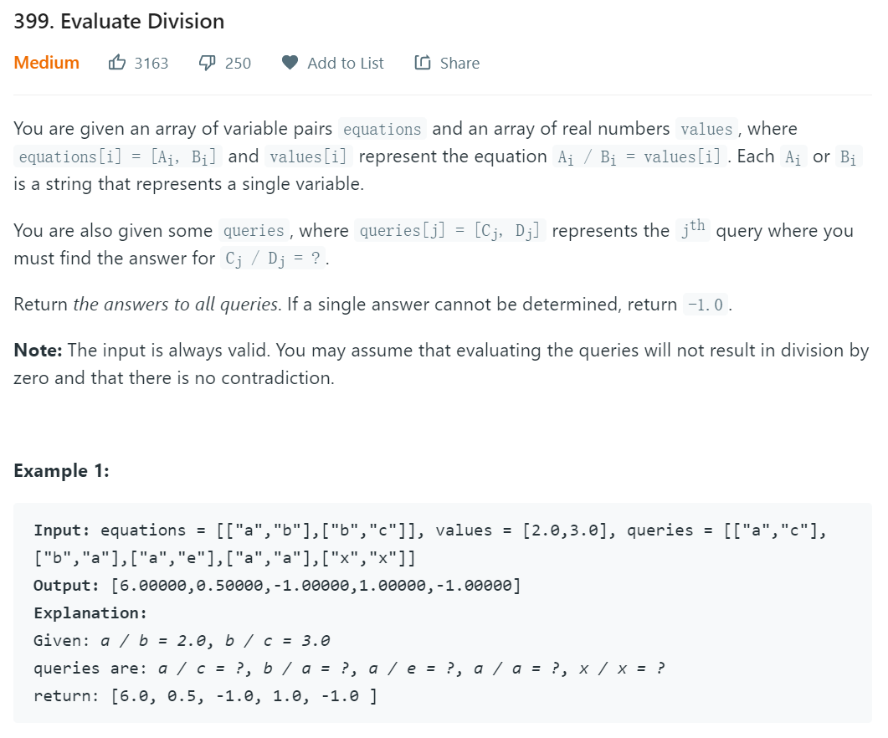
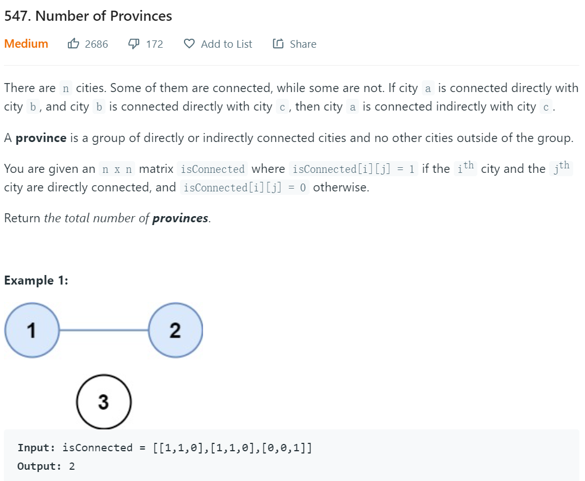
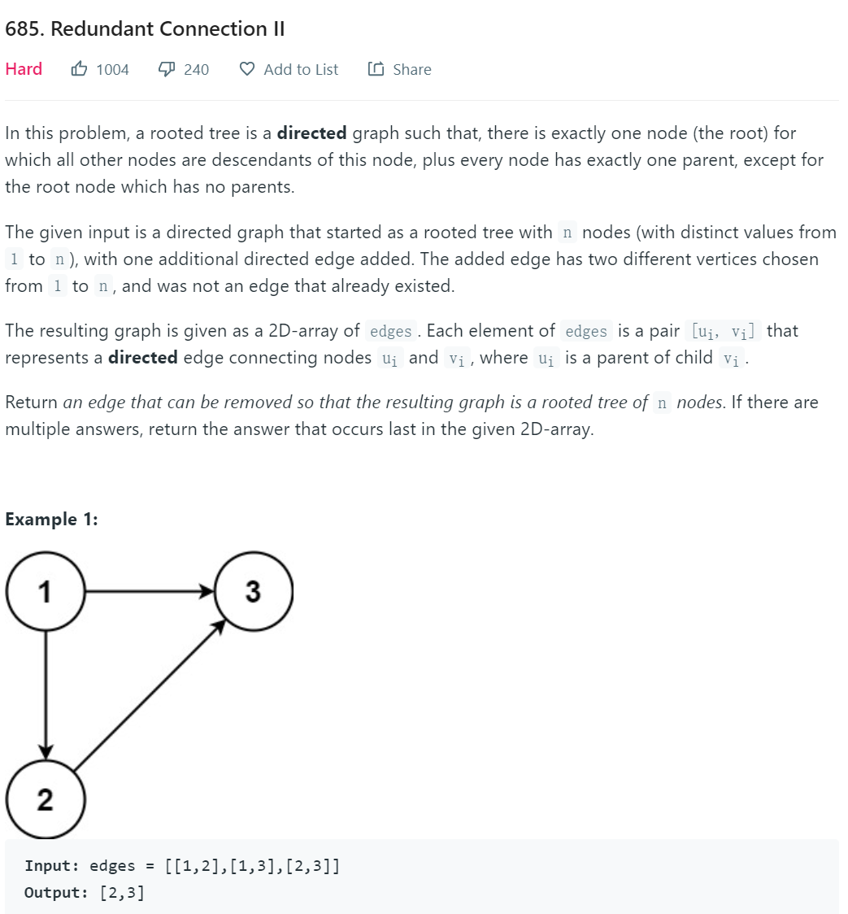

## [并查集问题解题思路](https://blog.csdn.net/the_ZED/article/details/105126583)

### 并查集概念
并查集由一个整型数组pre[ ],treeSize[]以及函数find( )、join( )、connected()构成

> 数组pre[ ]记录了每个点的前导节点
>
> treeSize[]记录了当前root对应树的大小
>
> 函数find(x)用于查找根节点
>
> 函数join(x,y)用于合并两棵树
>
> 函数connected(x,y)用于判断两个节点是否相连

### 并查集作用
并查集的主要作用是求连通分支数（分类）

> 如果一个图中所有点都存在可达关系（直接或间接相连），则此图的连通分支数为1；如果此图有两大子图各自全部可达，则此图的连通分支数为2……

### 路径压缩

路径压缩能够提高并查树的查找效率,但会丢失节点原始的parent信息.

若需要保留child与parent直接的原始关系(边),则不能进行路径压缩.

## 问题记录

### 138 最长连续数字

**问题描述**


**解题代码**

```java
public int longestConsecutive(int[] nums) {
   int res=0;
   UnionFind uf=new UnionFind(nums);
   //第一次遍历nums
   for(int v:nums){
       uf.union(v,v+1);
   }
   //第二次遍历nums
   for(int v:nums){
       res=Math.max(res,uf.find(v)-v+1);
   }
   return res;
}
class UnionFind{
    HashMap<Integer,Integer> hm=new HashMap<>();
    public UnionFind(int[] nums){
        //初始状态，每个数字都是一棵树
        for(int v:nums){
            hm.put(v,v);
        }
    }
    //合并
    public void union(int p,int q){
        Integer pRoot=find(p);
        Integer qRoot=find(q);
        if(pRoot==null||qRoot==null||pRoot==qRoot){
            return;
        }
        hm.put(p,q);
    }
	//查找root
    public Integer find(int n) {
        if(!hm.containsKey(n)){
            return null;
        }
        int root=n;
        while(hm.get(root)!=root){
            root=hm.get(root);
        }
        //压缩树，每个子节点直接连接root
        while(hm.get(n)!=n){
            int parent=hm.get(n);
            hm.put(n,root);
            n=parent;
        }
        return root;
    }
}
```

**解题思路**

1. 初始条件是nums中每个数字各为一棵树
2. 第一次遍历nums期待找到nums[i]的下一个数字，并建立新的并查树
3. 第二次遍历nums找到以nums[i]开头的连续序列的结尾数字（find压缩了并查树）

union将连续的数字归为1类，而find用于查找root（这里是指树中的最大值）

### 130 被围区域

**问题描述**



**解题思路**

1. 先将二维数组映射为一维数组pre[],以保存之前的节点信息。二维数组需要使用int[]作为key，不利于使用。
2. 初始状态pre[i]=i,这里将所有没有被包围的O作为一个分组，并最终将其归到root为dummy=row*col的并查树中。
3. 从左上到右下扫描数组，若当前位置的上/左也为O，则合并两个节点，并以root更大的作为合并的root(**趋向于合并到dummy中**)
4. 从左上到右下扫描数组，若O位置对应的root为dummy，则无需改变；否则变为X

### 200 计算岛屿数量

**问题描述**



**解题思路**

1. 先将二维数组映射为一维数组pre[],以保存之前的节点信息。二维数组需要使用int[]作为key，不利于使用。
2. 初始状态pre[i]=i
3. 从左上到右下扫描数组，若当前位置的上/左也为1，则合并两个节点
4. 从左上到右下扫描数组，并统计所有1对应并查树数目（root相同为同一个并查树），即为结果。

### 399 除法计算

**问题描述**



**代码**

```java
class Solution {
    //将对象映射为int，便于操作parent和weight
    Map<String, Integer> hm;
    //记录上一节点
    List<Integer> parent;
    //记录到上一节点的weight
    List<Double> weight;

    public void init(List<List<String>> equations,double[] values) {
        hm = new HashMap<>();
        parent=new ArrayList<>();
        weight=new ArrayList<>();
        int count = 0;
        for (int i=0;i<values.length;i++) {
            List<String> strs=equations.get(i);
            String str0=strs.get(0);
            String str1=strs.get(1);
            if (!hm.containsKey(str0)) {
                parent.add(count);
                weight.add(1.0);
                hm.put(str0, count++);
            }
            if (!hm.containsKey(str1)) {
                parent.add(count);
                weight.add(1.0);
                hm.put(str1, count++);
            }
            //合并并查树
            union(hm.get(str0),hm.get(str1),values[i]);
        }
    }

    //查找节点root，但不压缩路径（weight更新太复杂）
    public int find(int leaf) {
        int root = leaf;
        while (parent.get(root)!= root) {
            root = parent.get(root);
        }
        return root;
    }
	//合并并查树，并更新root的weight
    public void union(int a,int b,double value){
        int ap=find(a);
        int bp=find(b);
        if (ap != bp) {
            parent.set(ap,bp);
            weight.set(ap,rootWeight(b)*value/rootWeight(a));
        }
    }
	//求leaf到root的weight
    public double rootWeight(int leaf){
        double w=1.0;
        while(leaf!=parent.get(leaf)){
            w*=weight.get(leaf);
            leaf=parent.get(leaf);
        }
        return w;
    }

    public double[] calcEquation(List<List<String>> equations, double[] values, List<List<String>> queries) {
        init(equations,values);
        double[] res = new double[queries.size()];
        for(int i=0;i<queries.size();i++){
            String str0=queries.get(i).get(0);
            String str1=queries.get(i).get(1);
            Integer i0=hm.get(str0);
            Integer i1=hm.get(str1);
            if(i0==null||i1==null||find(i0)!=find(i1)){
                res[i]=-1;
            }else{
                //通过root来比较leaf节点的商
                res[i]=rootWeight(i0)/rootWeight(i1);
            }
        }
        return res;
    }
}
```

**解题思路**

1. 使用weight链表来存储相邻节点的weight值
2. find获取root，但不压缩并查树，因为压缩需要更新weight链表（太复杂）
3. 利用{‘a'，’b'}来合并并查树，合并时仅需更新被合并节点的weight
4. 需要提供一个方法来获取leaf→root的weight

### 547 省份数目

**问题描述**



**解题思路**

与200（计算岛屿数量相似），不过判断是否相连的条件由**上下左右**改为了**连接矩阵**。

### 685 冗余连接

**问题描述**



**解题思路**

1. 使用parent数组保存每个数的父节点，初始parent[i]=i。

2. 对于每一条edge，首先判断parent[edge[1]]==edge[1]?

   若相等，则union(edge[0],edge[1])，先通过find获取parent1与parent2，判断parent1==parent2？

   ​	若相等，则存在环路，应该删除该edge

   ​	若不相等，则令parent[edge[1]]==edge[0]。

   若不相等，那么edge[1]的入度为2，应该删除。

### 京东笔试(试剂分组)

**问题描述**

有n个试剂需要转在2个盒子中,任意两个试剂放在一起会产生一定的伤害,在伤害统计时,只统计2个盒子中的最大伤害,其他伤害忽略不计.求合理放置试剂的最小伤害.

示例

```
输入:
4 6
1 4 2354
2 3 3512
1 2 28351
1 3 6618
2 4 1805
3 4 12884
输入解释:第一行为试剂数量和试剂组合数量,2-n行是试剂组合的伤害
输出:3512
```

**解题思路**

按照伤害排序,使用试剂编号构建并查集,用于分组与合并.其中并查集的root节点包含2个set,分别表示2个试剂盒.在合并时,需要将root的set也合并,出现冲突的伤害就是结果.

**代码**

```java
public class Solution {
    public static int[] parent;
    // 保存并查树根节点的2个试剂盒
    public static Map<Integer, TwoBoxes> map = new HashMap<>();
    public static void main(String[] args) {
        Scanner sc = new Scanner(System.in);
        String[] line = sc.nextLine().split(" ");
        int n = Integer.parseInt(line[0]);
        int m = Integer.parseInt(line[1]);
        if (n <= 2) {
            System.out.println(0);
            return;
        }
        TreeMap<Integer, Pair> tm = new TreeMap<>();
        for (int i = 0; i < m; i++) {
            line = sc.nextLine().split(" ");
            // 优先取最大伤害
            tm.put(Integer.parseInt(line[2]), new Pair(Integer.parseInt(line[0]), Integer.parseInt(line[1])));
        }
        sc.close();
		// 构建并查树
        parent = new int[n+1];
        for(int i=0;i<n+1;i++){
            parent[i]=i;
            map.put(i,new TwoBoxes(i));
        }

        while (!tm.isEmpty()) {
            Pair pair = tm.lastEntry().getValue();
            if(!union(pair.m,pair.n)){
                System.out.println( tm.lastKey());
                return;
            }
            tm.remove(tm.lastKey());
        }
        System.out.println(0);
    }
	// 合并并查树
    private static boolean union(int m, int n) {
        int mp=getParent(m);
        int np=getParent(n);
        if(mp==np){// 已经在一个分组里
            TwoBoxes tb=map.get(mp);
            if(tb.box1.contains(m)&&tb.box1.contains(n)||tb.box2.contains(m)&&tb.box2.contains(n)){
                return false;
            }else{
                return true;
            }
        }else if(mp<np){
            parent[np]=mp;
            return unionBoxes(mp,np);
        }else {
            parent[mp]=np;
            return unionBoxes(np,mp);
        }
    }
	// 合并试剂盒
    private static boolean unionBoxes(int m, int n) {
        TwoBoxes mtb=map.get(m);
        TwoBoxes ntb=map.get(n);
        // m中含m的集合
        Set<Integer> mbxm=mtb.box1;
        // m中不含m的集合
        Set<Integer> mbxn=mtb.box2;
        
        if(mtb.box2.contains(m)){
            mbxm=mtb.box2;
            mbxn=mtb.box1;
        }
        // n中含n的集合
        Set<Integer> nbxn=ntb.box1;
        // n中不含n的集合
        Set<Integer> nbxm=ntb.box2;

        if(ntb.box2.contains(n)){
            nbxn=ntb.box2;
            nbxm=ntb.box1;
        }

        if(!Collections.disjoint(mbxm,nbxm)){//如果有重叠
            return false;
        }else{
            mbxm.addAll(nbxm);
        }
        if(!Collections.disjoint(mbxn,nbxn)){
            return false;
        }else{
            mbxn.addAll(nbxn);
        }
        map.remove(n);
        return true;
    }
	// 获取根节点
    private static int getParent(int n){
        if(parent[n]==n){
            return n;
        }
        return getParent(parent[n]);
    }

}

class Pair {
    int m;
    int n;

    public Pair(int m, int n) {
        this.m = m;
        this.n = n;
    }
}

class TwoBoxes {
    Set<Integer> box1 = new HashSet<>();
    Set<Integer> box2 = new HashSet<>();

    public TwoBoxes(int i) {
        box1.add(i);
    }
}
```

