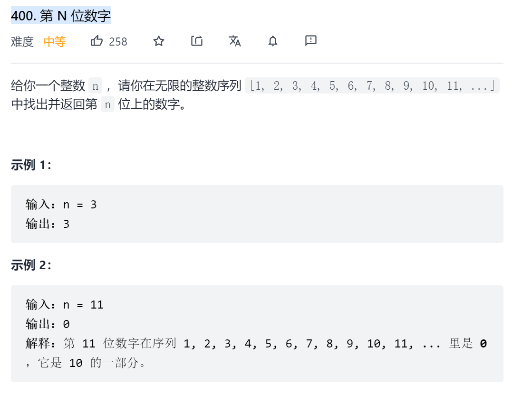
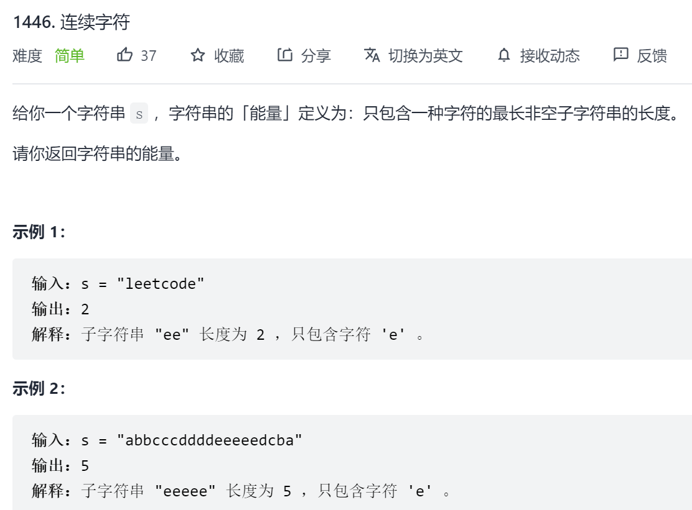
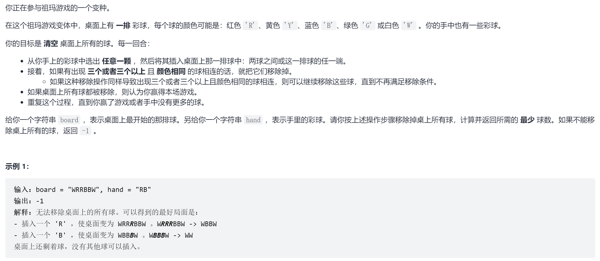
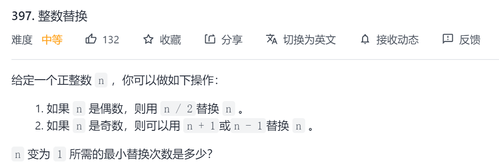

# 思绪混乱

**索引位置混乱**

常识认为1是第一位,而忽略了0,今后在计算机领域应该习惯从0开始.

1. 以i为一组分组时,[0,i-1]为第0组.(<font color='cornflowerblue'>400题</font>)

**变量含义不清**

写代码时,常为了提高速度不写注释,导致变量含义不清.应积极编写变量含义,从源头弄清代码功能.

**最后位置的更新**

在统计时,往往是区间统计条件不符合时获得区间统计值,并尝试用该统计值更新最终结果.但在最后一个位置属于最后一个区间,后续不再有不符合条件的值,所以最后一个区间的统计值需要额外一次更新最终结果.(<font color='cornflowerblue'>1446题</font>)

#### [400. 第 N 位数字](https://leetcode-cn.com/problems/nth-digit/)

**问题描述**



**解题思路**

n位数字的关键是数字存在位数的差别,但其中有规律.

对于[1,10)之间的数为一位数,[10,100)间有两位数,以此类推[10<sup>i-1</sup>,10<sup>i</sup>)间有i位数.

所以当n处于[10<sup>i-1</sup>,10<sup>i</sup>)之间时,n减去之前的位数($\sum$9\*i\*10<sup>i-1</sup>),剩余的都是i位数. n对应的实际值num
$$
num=(n-\sum9*i*10^{i-1}-1)/i+10^{i}
$$
而结果则是num的第$(n-\sum9*i*10^{i-1}-1)/i$位数

**代码实现**

```java
class Solution {
    List<Integer> lst=new ArrayList<>();
    public int findNthDigit(int n) {
        //位数
        int i=0;
        //位数对应的数字总个数
        int j=0;
        while(n>j&&j>=0){
            n-=j;
            i++;
            j=(int)(9*i*Math.pow(10,i-1)); 
        }
        //n对应的实际值
        int num=(int)Math.pow(10,i-1)+(n-1)/i;
        int idx=(n-1)%i;
        return num/(int)Math.pow(10,i-1-idx)%10;
    }
}
```

**注意**

代码逻辑结果较为清晰,但是在细节部分比较容易出错.

比如n在减去10<sup>i-1</sup>前所有位数后,差值用于求实际值num时,(n-1)/i才能得到才是实际的剩余值,而不是n/i.

```
这是因为在计算剩余值时除以i,此时对应的起始值应该为0而不是1,即[0,i-1]为一组.
由于习惯性思维,我们认为第i位数属于恰好属于第一组,但在计算时应使用(i-1)/i=0得到才是第一组.
```

#### [1446. 连续字符](https://leetcode-cn.com/problems/consecutive-characters/)

**问题描述**



**问题分析**

令count为区间最大连续值,res为s最大连续值,每次判断s[i]==s[i-1]?

​	如果相等,则count++

​	如果不相等,尝试用count更新res,并设置count=1;

**代码**

```java
class Solution {
    public int maxPower(String s) {
        if(s.length()==0){
            return 0;
        }
        int res=1;
        //当前连续长度
        int count=1;
        for(int i=1;i<s.length();i++){
            if(s.charAt(i)==s.charAt(i-1)){//相等则相加
                count++;
            }else{//不相等则更新res和count
                res=Math.max(res,count);
                count=1;
            }
        }
        //最后一个区间需手动更新
        res=Math.max(res,count);
        return res;
    }
}
```

**注意**

问题分析时只考虑了s[i]!=s[i-1]时更新res,不能处理最大连续区间在最后的情况,所以需对最后一次结果做手动更新.

#### [488. 祖玛游戏](https://leetcode-cn.com/problems/zuma-game/)

**问题描述**



**关键提示**

- 1 <= board.length <= 16
- 1 <= hand.length <= 5
- board 和 hand 由字符 'R'、'Y'、'B'、'G' 和 'W' 组成
- <font color='red'>桌面上一开始的球中，不会有三个及三个以上颜色相同且连着的球</font>

**原始代码**

对于玩过祖玛的人,很容易想到祖玛游戏的运行方式,最爽的莫过于"AAABBCCBBAA"这种排列,若使用"C"击中"CC"则可以连续触发消除结束游戏.所以插入代码如下

```java
/**
 * 
 * @param board:插入前排列
 * @param c:插入的颜色
 * @param index:插入的位置
 * @return 插入后消除的排列
 */
public String insert(String board,char c,int index){
    board=board.substring(0,index)+c+board.substring(index);
    while(true){
        //左第一个不为c
        int l=index-1;
        //右第一个不为c
        int h=index+1;
        while(l>=0&&board.charAt(l)==c){
            l--;
        }
        while(h<board.length()&&board.charAt(h)==c){
            h++;
        }
        if(h-l-1>=3){
            boolean flag=false;
            if(l==-1||h==board.length()){
                flag=true;
            }
            board=board.substring(0,l+1)+board.substring(h);
            if(flag){
                break;
            }
            index=l;
            c=board.charAt(l);
        }else{
            return board;
        }
    }
    return board;
}
```

考虑到初始时可能存在3个及以上同颜色的排列,所以只能从插入点进行消除.

**改进代码**

由于提示"初始排列中不存在3个及以上同颜色的球",所以消除代码可简化为清除插入后所有的3个及以上连续相同颜色的球.改进代码如下

```java
/**
 * 
 * @param board: 插入后排列
 * @return:消除后排列
 */
private String eliminate(String board) {
    for (int left = 0, right = 0; right <= board.length(); right++) {
        if (right < board.length() && board.charAt(right) == board.charAt(left)) continue;
        if (right - left >= 3) {
            board = board.substring(0, left) + board.substring(right);
            //若经历了消除,则从头开始扫
            right = 0;
        }
        left = right;
    }
    return board;
}
```

由于初始时不存在3个及以上同颜色的排列,可通过滑动窗口扫描3个及以上相同颜色的球进行消除.

#### [397. 整数替换](https://leetcode-cn.com/problems/integer-replacement/)

**题目描述**



**代码分析**

```java
class Solution {
    public int integerReplacement(int n) {
        int count=0;
        while(n!=1){
            if(n%2==0){
                n=n>>1;
                count++;
            }else{
                //计算速度慢
                // if(n!=3&&(n+1)%4==0){
                //     n=(n+1)>>1;
                // }else{
                //     n=(n-1)>>1;
                // }
                //计算速度快
                if(n%4==1){
                    n=n>>1;
                }else{
                    if(n==3){
                        n=1;
                    }else{
                        n=(n>>1)+1;
                    }
                }
                count+=2;
            }
        }
        return count;
    }
}
```

当使用(n-1)%4==0时,计算了3次;改用n%4==1只计算了2次.