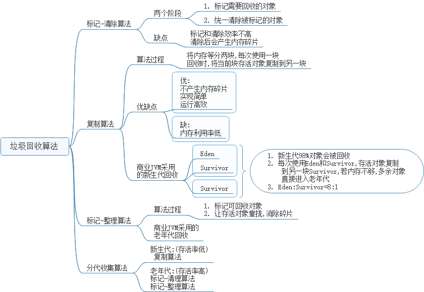
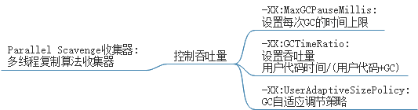
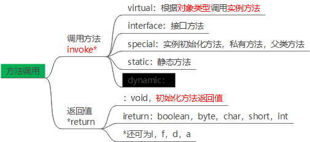
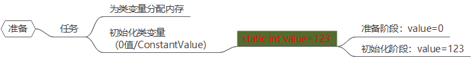
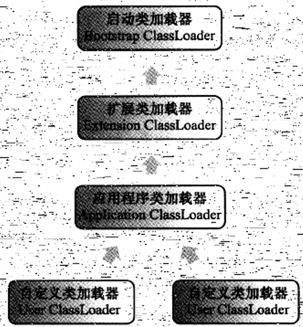

# 运行时数据区

## JVM内存参数设置

堆内存分配

- -Xms设置堆的最小空间大小。
- -Xmx设置堆的最大空间大小。

> 默认空余堆内存小于40%时，JVM就会增大堆直到-Xmx的最大限制；空余堆内存大于70%时，JVM会减少堆直到 -Xms的最小限制。
>
> 服务器一般设置-Xms、-Xmx相等以避免在每次GC 后调整堆的大小。对象的堆内存由称为垃圾回收器的自动内存管理系统回收。

- -Xmn:设置新生代大小
- -XX:NewSize设置新生代最小空间大小。
- -XX:MaxNewSize设置新生代最大空间大小。
- -XX:SurvivorRatio，设置新生代中Eden区与Survivor区的比值。

堆外内存分配

- -XX:PermSize设置永久代最小空间大小。
- -XX:MaxPermSize设置永久代最大空间大小。
- -Xss设置每个线程的堆栈大小

垃圾回收器

- -XX:+UseParallelGC:选择垃圾收集器为并行收集器。此配置仅对年轻代有效
- -XX:ParallelGCThreads=20:配置并行收集器的线程数,即:同时多少个线程一起进行垃圾回收。此值最好配置与处理器数目相等。

# 垃圾收集器

## 对象存活判定

### [引用类型](https://www.cnblogs.com/mark5/p/12792151.html)

**引用队列（ReferenceQueue）**

引用队列可以与软引用、弱引用以及虚引用一起配合使用，当垃圾回收器准备回收一个对象时，如果发现它还有引用，那么就会在回收对象之前，把这个引用加入到与之关联的引用队列中去。

程序可以通过判断引用队列中是否已经加入了引用，来判断被引用的对象是否将要被垃圾回收，这样就可以在对象被回收之前采取一些必要的措施。

虚引用必须和引用队列一起使用。

**ThreadLocal**和**WeakHashMap**内部都是使用了弱引用，用来保证那些不被用到的key值，在垃圾回收的时候可以被回收掉。

## 垃圾回收算法

## hotSpot算法实现

## 垃圾收集器

### serial 收集器

### parNew收集器

### Parallel Scavenge收集器

### Serial Old收集器

### Paralled Old收集器

### CMS收集器

### G1收集器

## 内存分配与回收策略

# 性能监控与故障处理

## java命令行工具

## jps:虚拟机进程状况工具

## jstat:虚拟机统计信息监视工具

## jinfo:Java配置信息

## jmap:Java内存映像工具

## jhat:堆转储快照分析工具

## jstack:Java堆跟踪工具

## HSDIS:JIT生成代码反编译

# 类文件结构

## 语言无关性与平台无关性

、

## class类文件结构

### 概述

### 魔数

### class文件版本

### 常量池

### 访问标志

### 索引

### 字段表集合

### 方法表集合

### 属性表集合

## 字节码指令

### 概述

### 字节码与数据类型

### 加载和存储

### 运算指令

### 类型转换

### 对象操作与创建

### 操作数栈管理

### 控制转移

### 方法调用

### 异常处理

### 

# jvm类加载机制

## 类加载机制概述

类数据从Class文件中加载到内存，并对数据校验，转换解析和初始化，形成jvm能直接处理的Java类型

类型加载，连接和初始化都在程序运行时完成。

> 缺：性能开销增大
>
> 优：灵活性

## 类的生命周期

加载，验证，准备，初始化，卸载的顺序是固定的

> 解析在初始化之前：**静态绑定**
>
> 解析在初始化之后：**动态绑定**

## 类加载过程

### 加载

#### 加载的任务

> 由类全限定名获取定义类的**二进制字节流**
>
> 字节流代表的静态存储结构转换为**方法区运行时数据结构**
>
> 生成方法区数据结构的访问入口（**字节码对象**）

#### [非]数组类型加载

**非数组类型**

> 使用系统提供的引导类加载器
> 自定义类加载器（重写loadClass()）

**数组类型**

数组类本身由jvm创建，数组元素类型使用类加载器创建

### 验证

**验证的任务**

确保Class文件字节流符合jvm要求，且不会危害jvm，否则抛出VerifyError异常

**验证的内容**

> **文件格式**：魔数，版本号是否符合规范
>
> **元数据**：字段，方法是否与父类或接口冲突
>
> **字节码**：验证code属性，语法是否错误
>
> **符号引用**：是否能访问到

### 准备

**准备的任务**

> 为类变量分配内存
>
> 初始化类变量（0值/ConstantValue）

### 解析

将常量池中符号引用替换为直接引用

### 初始化

执行类构造器\<clinit>()方法

> 类变量赋值动作
>
> 静态语句块

## 类加载器

### 类与类加载器

jvm中，类及其类加载器确定类的唯一性

Class对象的equals(),instanceof()都以同一个类加载器为前提

### 双亲委派模型

#### 类加载器类型

**启动类加载器**

> 使用C++实现，为jvm一部分
>
> 加载lib，-Xbootclasspath中jvm识别的类库
>
> 启动类加载器无法直接被java程序引用(将classloader=null指定启动类加载器)

**扩展类加载器**

加载lib\ext和java.ext.dirs指定路径的类库

**应用程序加载器**

加载用户类路径上指定文件中的类库，getSystemClassLoader()返回值

**自定义类加载器**

#### 类加载器关系

双亲委派模型：以组合的形式服用上层代码

#### 双亲委派模型工作方式

1.类加载器收到加载请求，委派父类加载器加载

2.父类加载器无法加载，子加载器尝试加载

*例：Object类都由启动类加载器加载，保证只有一个object类不使用双亲委派，则可能由多个Object类*

### 破坏双亲委派模型

**1. 双亲委派模型出现前**

用户重写的classloader只调用自身，而不调用启动类加载器

**2.JDBC服务**

厂商提供的代码启动类加载器不识别，线程上下文类加载器加载厂商代码

**3. OSGi热部署**

