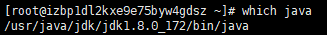
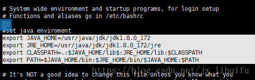

# 软件安装

## jdk

**安装JDK**

通过安装包安装 [ https://blog.csdn.net/jx_lihuifu/article/details/80761038](https://blog.csdn.net/jx_lihuifu/article/details/80761038)

1、从官网上下载linux版本的JDK并上传到Linux

2、新建一个java文件夹 mkdir /usr/local/java用于解压 tar -zxvf 

3、配置环境变量 

`vim /etc/profile`

```bash
# 在文件末尾追加
export JAVA_HOME=/usr/local/java/jdk1.8.0_301
export JRE_HOME=/usr/local/java/jdk1.8.0_301/jre
export CLASSPATH=.:$JAVA_HOME/lib$:JRE_HOME/lib:$CLASSPATH
export PATH=$JAVA_HOME/bin:$JRE_HOME/bin/$JAVA_HOME:$PATH
```

` source /etc/profile` 重新加载环境变量

**卸载JDK**

1、先输入java -version 查看是否安装了jdk

2、如果安装了，检查下安装的路径 which java（查看JDK的安装路径） 



3、卸载 rm -rf JDK地址（卸载JDK） rm -rf /usr/java/jdk/jdk1.8.0_172/

4、vim命令编辑文件profile vim /etc/profile



删除配置的环境变量，至此JDK卸载完毕

5、检查下自带的jdk

命令：

```
rpm -qa |grep java
rpm -qa |grep jdk
rpm -qa |grep gcj
```

如果没有输入信息表示没有安装。

如果安装可以使用rpm -qa | grep java | xargs rpm -e --nodeps 批量卸载所有带有Java的文件 这句命令的关键字是java

## maven

# 常用软件使用

## 流和重定向

Bash 有很强大的工具来处理程序之间的协同工作。使用流，我们能将一个程序的输出发送到另一个程序或文件，因此，我们能方便地记录日志或做一些其它我们想做的事。

管道给了我们创建传送带的机会，控制程序的执行成为可能。

学习如何使用这些强大的、高级的工具是非常非常重要的。

### 输入、输出流

Bash 接收输入，并以字符序列或 **字符流** 的形式产生输出。这些流能被重定向到文件或另一个流中。

有三个文件描述符：

| 代码 | 描述符   | 描述         |
| ---- | -------- | ------------ |
| `0`  | `stdin`  | 标准输入     |
| `1`  | `stdout` | 标准输出     |
| `2`  | `stderr` | 标准错误输出 |

### 重定向

重定向让我们可以控制一个命令的输入来自哪里，输出结果到什么地方。这些运算符在控制流的重定向时会被用到：

| Operator | Description                                                  |
| -------- | ------------------------------------------------------------ |
| `>`      | 重定向输出                                                   |
| `&>`     | 重定向输出和错误输出                                         |
| `&>>`    | 以附加的形式重定向输出和错误输出                             |
| `<`      | 重定向输入                                                   |
| `<<`     | [Here 文档](https://link.juejin.cn?target=http%3A%2F%2Ftldp.org%2FLDP%2Fabs%2Fhtml%2Fhere-docs.html) 语法 |
| `<<<`    | [Here 字符串](https://link.juejin.cn?target=http%3A%2F%2Fwww.tldp.org%2FLDP%2Fabs%2Fhtml%2Fx17837.html) |

以下是一些使用重定向的例子：

```
### ls的结果将会被写到list.txt中
ls -l > list.txt

### 将输出附加到list.txt中
ls -a >> list.txt

### 所有的错误信息会被写到errors.txt中
grep da * 2> errors.txt

### 从errors.txt中读取输入
less < errors.txt
复制代码
```

### `/dev/null` 文件

如果希望执行某个命令，但又不希望在屏幕上显示输出结果，那么可以将输出重定向到 /dev/null：

```
$ command > /dev/null
复制代码
```

/dev/null 是一个特殊的文件，写入到它的内容都会被丢弃；如果尝试从该文件读取内容，那么什么也读不到。但是 /dev/null 文件非常有用，将命令的输出重定向到它，会起到"禁止输出"的效果。

如果希望屏蔽 stdout 和 stderr，可以这样写：

```
$ command > /dev/null 2>&1
//https://blog.csdn.net/weixin_41988331/article/details/86215802
```

## Debug

shell 提供了用于 debug 脚本的工具。

如果想采用 debug 模式运行某脚本，可以在其 shebang 中使用一个特殊的选项：

```
#!/bin/bash options
复制代码
```

options 是一些可以改变 shell 行为的选项。下表是一些可能对你有用的选项：

| Short | Name        | Description                                                |
| ----- | ----------- | ---------------------------------------------------------- |
| `-f`  | noglob      | 禁止文件名展开（globbing）                                 |
| `-i`  | interactive | 让脚本以 *交互* 模式运行                                   |
| `-n`  | noexec      | 读取命令，但不执行（语法检查）                             |
| `-t`  | —           | 执行完第一条命令后退出                                     |
| `-v`  | verbose     | 在执行每条命令前，向`stderr`输出该命令                     |
| `-x`  | xtrace      | 在执行每条命令前，向`stderr`输出该命令以及该命令的扩展参数 |

举个例子，如果我们在脚本中指定了`-x`例如：

```
#!/bin/bash -x

for (( i = 0; i < 3; i++ )); do
  echo $i
done
复制代码
```

这会向`stdout`打印出变量的值和一些其它有用的信息：

```
$ ./my_script
+ (( i = 0 ))
+ (( i < 3 ))
+ echo 0
0
+ (( i++  ))
+ (( i < 3 ))
+ echo 1
1
+ (( i++  ))
+ (( i < 3 ))
+ echo 2
2
+ (( i++  ))
+ (( i < 3 ))
复制代码
```

有时我们值需要 debug 脚本的一部分。这种情况下，使用`set`命令会很方便。这个命令可以启用或禁用选项。使用`-`启用选项，`+`禁用选项：

**:keyboard: 『示例源码』** [debug-demo.sh](https://link.juejin.cn?target=https%3A%2F%2Fgithub.com%2Fdunwu%2Fos-tutorial%2Fblob%2Fmaster%2Fcodes%2Fshell%2Fdemos%2Fdebug-demo.sh)

```
# 开启 debug
set -x
for (( i = 0; i < 3; i++ )); do
  printf ${i}
done
# 关闭 debug
set +x
#  Output:
#  + (( i = 0 ))
#  + (( i < 3 ))
#  + printf 0
#  0+ (( i++  ))
#  + (( i < 3 ))
#  + printf 1
#  1+ (( i++  ))
#  + (( i < 3 ))
#  + printf 2
#  2+ (( i++  ))
#  + (( i < 3 ))
#  + set +x

for i in {1..5}; do printf ${i}; done
printf "\n"
#  Output: 12345
复制代码
```

## 12. 更多内容

> :notebook: 本文已归档到：「[blog](https://link.juejin.cn?target=https%3A%2F%2Fgithub.com%2Fdunwu%2Fblog)」

- [awesome-shell](https://link.juejin.cn?target=https%3A%2F%2Fgithub.com%2Falebcay%2Fawesome-shell)，shell 资源列表
- [awesome-bash](https://link.juejin.cn?target=https%3A%2F%2Fgithub.com%2Fawesome-lists%2Fawesome-bash)，bash 资源列表
- [bash-handbook](https://link.juejin.cn?target=https%3A%2F%2Fgithub.com%2Fdenysdovhan%2Fbash-handbook)
- [bash-guide](https://link.juejin.cn?target=https%3A%2F%2Fgithub.com%2Fvuuihc%2Fbash-guide) ，bash 基本用法指南
- [bash-it](https://link.juejin.cn?target=https%3A%2F%2Fgithub.com%2FBash-it%2Fbash-it)，为你日常使用，开发以及维护 shell 脚本和自定义命令提供了一个可靠的框架
- [dotfiles.github.io](https://link.juejin.cn?target=http%3A%2F%2Fdotfiles.github.io%2F)，上面有 bash 和其它 shell 的各种 dotfiles 集合以及 shell 框架的链接
- [Runoob Shell 教程](https://link.juejin.cn?target=http%3A%2F%2Fwww.runoob.com%2Flinux%2Flinux-shell.html)
- [shellcheck](https://link.juejin.cn?target=https%3A%2F%2Fgithub.com%2Fkoalaman%2Fshellcheck) 一个静态 shell 脚本分析工具，本质上是 bash／sh／zsh 的 lint。

最后，Stack Overflow 上 [bash 标签下](https://link.juejin.cn?target=https%3A%2F%2Fstackoverflow.com%2Fquestions%2Ftagged%2Fbash)有很多你可以学习的问题，当你遇到问题时，也是一个提问的好地方。


