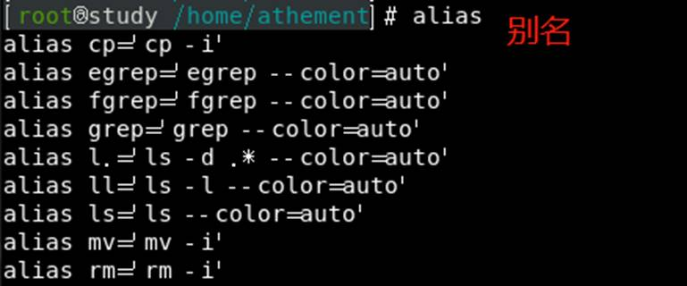

## vim编辑器

在所有的 Linux distributions 上都会有的一套文书编辑器就是 vi ，而且很多软件默认也是使用 vi 做为他们编辑的接口

### vi与vim

- 所有的 Unix Like 系统都会内建 vi 文书编辑器

- 很多软件的编辑接口都会主动调用 vi (例如未来会谈到的 crontab, visudo, edquota 等指令)

- vim 具有程序编辑的能力，可以辨别语法的正确性(shell script或基础配置文件)

### vi的使用

**一般指令模式 (command mode)**

以 vi 打开一个文件就直接进入一般指令模式。

```
使用**上k下j左h右l**按键来移动光标，使用『删除字符』来处理文件内容， 使用『复制、粘贴』处理文件数据。
```

**编辑模式 (insert mode)**

按下『i, I, o, O, a, A, r, R』等任何一个字母之后进入编辑模式。

```
按下这些按键时，在画面的左下方会出现『 INSERT 或 REPLACE 』 的字样，此时才可以进行编辑。按下『Esc』这个按键即可退出编辑模式,进入一般指令模式.
```

**指令行模式 (command-line mode)**

在一般模式当中，输入 **: / ?** 三个中的任何一个按钮，就可以将光标移动到最底下那一列。

```
可以提供『搜索』的动作，而读取、存盘、大量取代字符、离开 vi 、显示行号等等的动作则是在此模式中实现的
```

**三种模式的转换关系**


**简易执行**

- 使用『 vi filename 』进入一般指令模式


- 按下 i 进入编辑模式，进入编辑模式


- 按下 [ESC] 按钮回到一般指令模式，INSERT消失

- 进入指令列模式， 文件储存并离开 vi 环境


### 按键说明

https://www.cnblogs.com/yangjig/p/6014198.html

 


 **一般指令模式可用的按钮**

a.     移动

| 按键                                   | 功能                                                         |
| -------------------------------------- | ------------------------------------------------------------ |
| 多次移动: "30j" 或 "30↓ "向下移动 30行 |                                                              |
| [Ctrl] + [f]                           | 屏幕『向下』移动一页，相当于 [Page Down]按键 (常用)          |
| [Ctrl] + [b]                           | 屏幕『向上』移动一页，相当于 [Page Up] 按键 (常用)           |
| [Ctrl] + [d]                           | 屏幕『向下』移动半页                                         |
| [Ctrl] + [u]                           | 屏幕『向上』移动半页                                         |
| +                                      | 下一行行首                                                   |
| -                                      | 上一行行首                                                   |
| n<space>                               | 那个 n 表示『数字』，如 20<space> 则光标会向后面移动 20 个字符距离。 |
| 0 或功能键[Home]                       | 这是数字『 0 』：移动到这一行的最前面字符处 (常用)           |
| $ 或功能键[End]                        | 移动到这一行的最后面字符处(常用)                             |
| H                                      | 光标移动到这个屏幕的最上方那一行的第一个字符                 |
| M                                      | 光标移动到这个屏幕的中央那一行的第一个字符                   |
| L                                      | 光标移动到这个屏幕的最下方那一行的第一个字符                 |
| G                                      | 移动到这个文件的最后一行(常用)                               |
| nG                                     | n 为数字。移动到这个文件的第 n 行。                          |
| gg                                     | 移动到这个文件的第一行，相当于 1G 啊！ (常用)                |
| n<Enter>                               | n 为数字。光标向下移动 n 行(常用)                            |

b.     搜索与替换

| 按键                  | 功能                                                         |
| --------------------- | ------------------------------------------------------------ |
| /word                 | 向光标之下寻找一个名称为 word 的字符 (常用)                  |
| ?word                 | 向光标之上寻找一个字符串名称为 word 的字符串。               |
| n                     | 这个 n 是英文按键。代表『重复前一个搜寻的动作』              |
| N                     | 这个 N 是英文按键。与 n 刚好相反，为『反向』进行前一个搜寻动作。 |
| :n1,n2s/word1/word2/g | 在第 n1 与 n2 行之间寻找 word1 这个字符串，并将该字符串取代为 word2   举例来说，在 100 到 200 行之间搜寻 vbird 并取代为 VBIRD 则：『:100,200s/vbird/VBIRD/g』。 (常用) |
| :1,$s/word1/word2/g   | 从第一行到最后一行寻找 word1 字符串，并将该字符串取代为 word2 ！ (常用) |
| :1,$s/word1/word2/gc  | 从第一行到最后一行寻找 word1 字符串，并将该字符串取代为 word2 ！且在取代前显示提示字符给用户确认 (confirm) 是否需要取代！ (常用) |

c.  删除,复制与粘贴

| 按键     | 功能                                                         |
| -------- | ------------------------------------------------------------ |
| x, X     | x 为向后删除一个字符 ( [del] 按键)， X 为向前删除一个字符(退格键) (常用) |
| nx       | n 为数字，连续向后删除 n 个字符。连续删除 10 个字符: 『10x』。 |
| dd       | 剪切游标所在的那一整列(常用)                                 |
| ndd      | n 为数字。删除光标所在的向下 n 列(常用)                      |
| d1G      | 剪切光标所在到第一列的所有数据                               |
| dG       | 剪切光标所在到最后一列的所有数据                             |
| d$       | 剪切游标所在处，到该列的最后一个字符                         |
| d0       | 剪切游标所在处，到该列的最前面一个字符                       |
| y        | 复制选中区域                                                 |
| yy       | 复制游标所在的那一列(常用)                                   |
| nyy      | n 为数字。复制光标所在的向下 n 列，例如 20yy 则是复制 20 列(常用) |
| y1G      | 复制光标所在列到第一列的所有数据                             |
| yG       | 复制光标所在列到最后一列的所有数据                           |
| y0       | 复制光标所在的那个字符到该列行首的所有数据                   |
| y$       | 复制光标所在的那个字符到该列行尾的所有数据                   |
| p, P     | p 为将已复制的数据在光标下一列贴上， P 则为贴在游标上一列！  |
| J        | 将光标所在列与下一列的数据结合成同一列,中间由空格隔开        |
| ncj      | 重复删除多个数据，例如向下删除 10 列， [ 10cj ]              |
| u        | 复原前一个动作。 (常用)                                      |
| [Ctrl]+r | 重做上一个动作。 (常用)                                      |
| .        | 重复前一个动作 (常用)                                        |

 **一般指令模式切换到编辑模式**

| 按键 | 功能                                                         |
| ---- | ------------------------------------------------------------ |
| i, I | 进入插入模式(Insert  mode)：   i 为『从目前光标所在处插入』， I 为『在目前所在列的第一个非空格符处开始插入』。(常用) |
| a, A | 进入插入模式(Insert  mode)：   a 为『从目前光标所在的下一个字符处开始插入』， A 为『从光标所在列的最后一个字符处开始插入』。 (常用) |
| o, O | 进入插入模式(Insert  mode)：   o 为『在目前光标所在的下一列处插入新的一列』； O 为在目前光标所在处的上一列插入新的一列！ (常用) |
| r, R | 进入取代模式(Replace  mode)：   r 只会取代光标所在的那一个字符一次； R 会一直取代光标所在的文字，直到按下 ESC为止； (常用) |

 **一般指令模式切换到指令列模式**

a.    指令列模式的储存、离开

| 按键                                                        | 功能                                                         |
| ----------------------------------------------------------- | ------------------------------------------------------------ |
| :w                                                          | 将编辑的数据写入硬盘文件中(常用)                             |
| :w!                                                         | 若文件属性为『只读』时，强制写入该文件。  到底能不能写入，还是跟你对该文件的文件权限有关啊！ |
| :q                                                          | 离开 vi (常用)                                               |
| :q!                                                         | 若曾修改过文件，又不想储存，使用 ! 为强制离开不储存文件。    |
| 注意一下啊，惊叹号 (!) 在 vi 当中，常常具有『强制』的意思～ |                                                              |
| :wq                                                         | 储存后离开，若为 :wq! 则为强制储存后离开 (常用)              |
| ZZ                                                          | 若文件没有更动，则不储存离开，若文件已经被更动过，则储存后离开！ |
| :w [filename]                                               | 将编辑的数据储存成另一个文件（类似另存新档）                 |
| :r  [filename]                                              | 在编辑的数据中，读入另一个文件的数据。亦即将 『filename』 这个文件内容加到游标所在列后面 |
| :n1,n2 w [filename]                                         | 将 n1 到 n2 的内容储存成 filename 这个文件。                 |
| :!  command                                                 | 暂时跳出vim 到指令列模式下执行 command 的显示结果！  例如『:! ls /home』即可在 vi 当中察看 /home 底下以 ls 输出的文件信息！ |

b.    vim环境变更

| :set nu   | 显示行号，设定之后，会在每一列的前缀显示该列的行号 |
| --------- | -------------------------------------------------- |
| :set nonu | 与 set nu 相反，为取消行号                         |

### vim 的暂存档、救援回复与开启时的警告讯息

**暂存档**

vim具有恢复功能,该功能是通过”暂存档”实现的

使用 vim 编辑时， vim 会在与被编辑的文件的目录下， 再建立一个名为 .filename.swp 的文件。

若文件正常被保存.filename.swp会被自动删除

若文件在编辑时被意外中断,.filename.swp就会被保存下来,用于恢复


在 vim 的一般指令模式下按下 [ctrl]-z 的组合按键时，vim 会在后台执行

**查看暂存档**


 暂存档为隐藏文件夹,需要ls –a才能显示

 

模拟vim异常中断


​     杀死vim进程,模拟vim异常中断,filename.swp仍然存在

 

再次编辑文件

 

​     暂存档存在的两种可能

​          可能有其他人在编辑该文件

​          文件在编辑时,异常中断

​     6种对暂存档的操作

[O]pen Read-Only： 打开此文件成为只读档，

(E)dit anyway：用正常的方式打开要文件， 并不会载入暂存盘的内容。容易出现两个使用者互相改变文件等问题！！

(R)ecover：就是加载暂存盘的内容，救回之前未储存的工作。 之后还是要手动自行删除那个暂存档喔！

(D)elete it：开启文件前会先将这个暂存盘删除！

(Q)uit：按下 q 就离开 vim 

(A)bort：忽略这个编辑行为，感觉上与 quit 非常类似！ 也会送你回到命令提示字符！

### 区块选择(Visual Block)

| v        | 字符选择，会将光标经过的地方反白选择！ |
| -------- | -------------------------------------- |
| V        | 列选择，会将光标经过的列反白选择！     |
| [Ctrl]+v | 列编辑，可以用长方形的方式选择资料     |
| y        | 将反白的地方复制起来                   |
| d        | 将反白的地方删除掉                     |
| p        | 将刚刚复制的区块，在游标所在处贴上！   |

**示例**

vim hosts

v字符选择


V行选择


[ctrl]+v区块选择


- 删除列

```
1.光标定位到要操作的地方。
2.CTRL+v 进入“可视 块”模式，选取这一列操作多少行。
3.d 删除。
```

- 插入列，例如我们在每一行前都插入"() "：

```
1.光标定位到要操作的地方。
2.CTRL+v 进入“可视 块”模式，选取这一列操作多少行。
3.SHIFT+i(I) 输入要插入的内容。
4.ESC 按两次，会在每行的选定的区域出现插入的内容。
```

###  多文件编辑

| :n     | 编辑下一个文件                    |
| ------ | --------------------------------- |
| :N     | 编辑上一个文件                    |
| :files | 列出目前这个 vim 的开启的所有文件 |

vim hosts /etc/hosts开启两个文件

:files查看多文件信息


在多文件之间实现复制与粘贴


### 多窗口功能

两个特殊的使用场景

- 当我有一个文件非常的大，我查阅到后面的数据时，想要『对照』前面的数据， 是否需要使用 [ctrl]+f 与[ctrl]+b (或 pageup, pagedown 功能键) 来跑前跑后查阅？

- 我有两个需要对照着看的文件，不想使用前一小节提到的多文件编辑功能；

“分区窗口”或”冻结窗口”将一个文件分区成多个窗口展现

| 按键                     | 功能                                                         |
| ------------------------ | ------------------------------------------------------------ |
| :sp [filename]           | 开启一个新窗口，如果有加 filename， 表示在新窗口开启一个新文件 |
| [ctrl]+w+ j   [ctrl]+w+↓ | 按键的按法是：先按下 [ctrl] 不放， 再按下 w 后放开所有的按键，然后再按下 j (或向下箭头键)，则光标可移动到下方的窗口。 |
| [ctrl]+w+ k   [ctrl]+w+↑ | 同上，不过光标移动到上面的窗口。                             |
| [ctrl]+w+ q              | 退出当前窗口                                                 |

sp:水平分屏


​     多个窗口之间也能复制粘贴

vsp:垂直分屏

 

### vim 的挑字补全功能

不同人的说法不同,我的编辑器也不同

<c-n/p>-文件内容关键字

<c-x><c-n>-当前缓冲区

<c-x><c-f>-包含文件关键字

<c-x><c-]>-标签文件关键字

<c-x><c-k>-字典查找

文件内容补齐


### vim 环境设定与记录： ~/.vimrc, ~/.viminfo

vim会主动将用户的行为记录在~/viminfo中

```
1.以 vim 软件来搜寻文件的某个字符串时，这个字符串会被反白；下次我们再次以 vim 编辑这个文件时，该搜寻的字符串反白情况还是存在；在编辑其他文件时， 如果其他文件内也存在这个字符串，还是主动反白
2.当我们重复编辑同一个文件时，当第二次进入该文件时， 光标竟然就在上次离开的那一列上
```

vim的环境设定值放在/etc/vimrc中

| :set nu   :set nonu                  | 设定与取消行号啊！                                           |
| ------------------------------------ | ------------------------------------------------------------ |
| :set  hlsearch   :set nohlsearch     | hlsearch 就是 high light search(高亮度搜寻)。 设定是否将搜寻的字符串反白的设定值。默认值是 hlsearch |
| :set  autoindent   :set noautoindent | 是否自动缩排？ autoindent 就是自动缩排。                     |
| :set backup                          | 是否自动储存备份档？一般是 nobackup 的， 如果设定 backup 的话，更动任何一个文件时，则源文件会被另存成一个档名为 filename~ 的文件。 |
| :set ruler                           | ruler 设置在显示或不显示右下角状态栏                         |
| :set  showmode                       | 是否要显示 --INSERT-- 之类的字眼在左下角的状态栏。           |
| :set  backspace=(012)                | 一般来说， 如果我们按下 i 进入编辑模式后，可以利用退格键 (backspace) 来删除任意字符的。   某些 distribution 则不许如此。 当 backspace 为 2 时，可以删除任意值； 0 或 1 时，仅可删除刚刚输入的字符， 而无法删除原本就已经存在的文字了！ |
| :set all                             | 显示目前所有的环境参数设定值。                               |
| :set                                 | 显示与系统默认值不同的设定参数， 就是你有自行变动过的设定参数啦！ |
| :syntax on   :syntax off             | 是否依据程序相关语法显示不同颜色？                           |
| :set  bg=dark   :set bg=light        | 可用以显示不同的颜色色调，预设是『 light 』。                |

  /etc/vimrc不建议修改,但可以修改~/.vimrc文件,会覆盖默认的环境设定


### vim常用指令图


### vim 个性化设置

查看vi/vim

使用 vi 后，却看到画面的右下角有显示目前光标所在的行列号码，那么 vi 已经被 vim 所取代

alias:显示简写命令的实际命令(不存在vi=’vim’,仍要使用vim)



 

vim /etc/services


​     /etc/services 是配置文件，因此 vim 会进行语法检验，深蓝色那一列是以批注符号 (#) 为开头；

### 其他 vim 使用注意事项

**中文编码问题**

文件编码显示的影响因素

Linux 系统默认支持的语系数据：这与 /etc/locale.conf 有关；

终端界面 (bash) 的语系： 这与 LANG, LC_ALL 这几个变数有关；

文件原本的编码；

开启终端机的软件，例如在 GNOME 底下的窗口接口。

若文本原编码与开启终端机软件的编码一致,文件就能以正确的编码显示

​     文件原编码难以修改,修改终端机软件编码更简单

​          LANG=…

​          export LC_ALL=…

**DOS 与 Linux 的断行字符**

DOS的换行符是CR+LF

Linux的换行符是LF

DOS下编辑的文件一般不能直接在Linux下运行,尤其是shell script.需要将文件格式转为Linux格式

安装文件转换软件


命令

​     dos2unix [-kn] file [newfile]

​     unix2dos [-kn] file [newfile]

-k ：保留该文件原本的 mtime 时间格式

-n ：保留原本的旧档，将转换后的内容输出到新文件

 **语系编码转换**

`iconv -f 原本编码 -t 新编码 filename [-o newfile]`

--list ：列出 iconv 支持的语系数据

-f ： from ，亦即来源之意，后接原本的编码格式；

-t ： to ，亦即后来的新编码要是什么格式；

-o file：如果要保留原本的文件，那么使用 -o 新档名，可以建立新编码文件。


查看文件编码

​     file 文件名

在vim中使用:fileencoding