# 一、  例行性工作排程(crontab)

## 1.    例行性工作排程

排程就是将各项工作安排执行的流程

### 1)    linux工作排程种类:at,cron

两种工作排程方式:

​     例行性.每隔一定周期执行

​     突发性,某事件导致执行

 

at

at 是个可以处理仅执行一次就结束排程的指令.执行 at必须要有 atd 这个服务的支援。

crontab 

crontab所设定的工作将会循环的一直进行下去！ crontab 可以使用指令执行外，亦可编辑 /etc/crontab 来支持。 让 crontab 可以生效的服务则是 crond 服务

 

### 2)    CentOS Linux 系统上常见的例行性工作

常见的例行性任务

​     

a.     登录档的轮替 (log rotate)：

Linux 会主动的将系统所发生的各种信息都记录下来，这就是登录档。让旧的数据与新的数据分别存放，则比较可以有效的记录登录信息。这就是 log rotate 的任务

 

b.    登录文件分析 logwatch 的任务：

系统发生的软件问题、硬件错误、资安问题等，绝大部分的错误信息都会被记录到登录文件中,系统管理员的重要任务之一就是分析登录档。不可能透过 vim 等软件去检视登录文件，因为数据太复杂了！ CentOS 提供了一只程序『 logwatch 』来主动分析登录信息

 

c.    建立 locate 的数据库

locate 指令是透过已经存在的文件名数据库来进行系统上文件名的查询。我们的文件名数据库是放置到 /var/lib/mlocate/ 中。 系统会主动的进行 updatedb

 

d.    man page 查询数据库的建立：

提供快速查询的 man page db 也是个数据库，但如果要使用 man page 数据库时，就得要执行 mandb 才能够建立好

 

e.    RPM 软件登录文件的建立：

RPM是一种软件管理的机制。由于系统可能会常常变更软件， 包括软件的新安装、非经常性更新等，都会造成软件文件名的差异。为了方便未来追踪，系统也帮我们将文件名作个排序的记录

 

f.    移除暂存档：

某些软件在运作中会产生一些暂存档，软件关闭时这些暂存盘可能并不会主动的被移除。 有些暂存盘则有时间性，系统透过例行性工作排程执行名为 tmpwatch 的指令来删除这些过期暂存档

 

g.     与网络服务有关的分析行为：那么你的 Linux 系统通常就会主动分析WWW 服务器软件的登录文件。 同时某些凭证与认证的网络信息是否过期的问题

 

## 2.    仅执行一次的工作排程

### 1)    atd 的启动与 at 运作的方式

systemctl restart atd è重新启动 atd 这个服务

systemctl enable atd è让这个服务开机就自动启动

systemctl status atd è查阅一下 atd 目前的状态

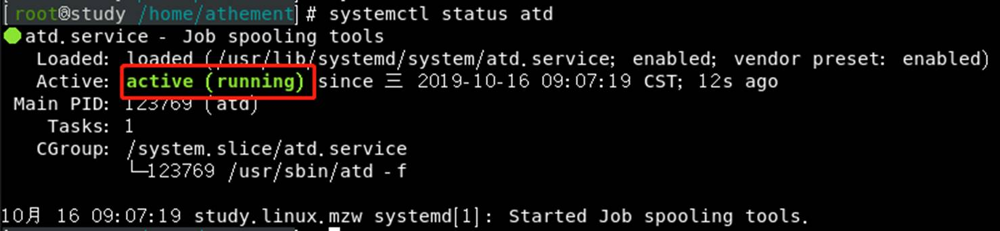

#### A.    at的运作方式

使用 at 这个指令来产生所要运作的工作，并将这个工作以文本文件的方式写入 /var/spool/at/ 目录内，该工作便能等待 atd 这个服务的取用与执行

 

利用/etc/at.allow与/etc/at.deny两个文件限制at使用

​    在at.allow且不在at.deny的用户才能使用at

​    root可以使用at

### 2)    实际运作单一工作排程

at [-mldv] TIME

at -c 工作号码

-m ： 当 at 的工作完成后，以 email 通知使用者该工作已完成。默认没有讯息则不发email

-l ： at -l 相当于 atq，列出目前系统上面的所有该用户的 at 排程；

-d ： at -d 相当于 atrm ，可以取消一个在 at 排程中的工作；

-v ：可以使用较明显的时间格式栏出 at 排程中的任务栏表；

-c ：可以列出后面接的该项工作的实际指令内容

​     

​     TIME： 时间格式， 定义出『进行 at 这项工作』的时间，格式有：

HH:MM ex> 04:00

在今日的 HH:MM 时刻进行，若该时刻已超过， 则明天的 HH:MM 进行此工作。

HH:MM YYYY-MM-DD ex> 04:00 2015-07-30

强制规定在某年某月的某一天的特殊时刻进行该工作！

HH:MM[am|pm] [Month] [Date] ex> 04pm July 30

强制在某年某月某日的某时刻进行！

HH:MM[am|pm] + number [minutes|hours|days|weeks]

在某个时间点『再加几个时间后』才进行,可使用now + 时间

 

设置时间为5分钟后,输入内容只能重定向,ctrl+d结束at环境

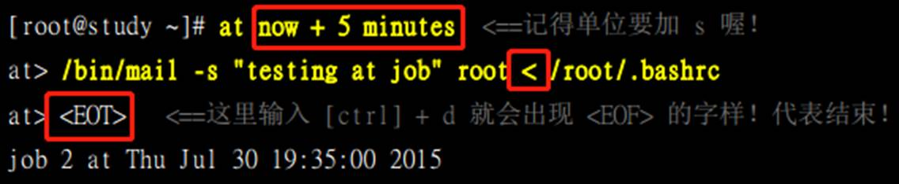

​          注意:建议使用绝对路径下达命令(命令与PATH,工作目录有关)

​     

​     在at中设置echo “hello”,讯息不会再屏幕上显示,使用echo “hello” > /dev/[终端名]可显示到终端

​          查看用户当前终端

​      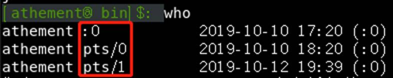

​          将讯息重定向到终端

​         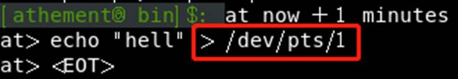

​          讯息显示

​          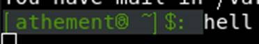

​          at 的执行与终端机环境无关，而所有 standard output/standard error output 都会传送到执行者的mailbox

 

at 工作排程的使用上，系统会将该项 at 工作独立出你的 bash 环境中， 直接交给系统的 atd程序(at shell)来接管，当下达了 at 的工作之后就可以立刻脱机了， 剩下的工作就完全交给 Linux 管理即可.

 

#### A.    at的工作管理

atq

​     查看当前主机的工作排程

atrm jobnumber

​     移除工作排程

 

#### B.    batch:系统有空时才进行背景任务

batch会在 CPU 的工作负载小于 0.8 的时候，才进行下达的工作任务(实际调用的也是at)

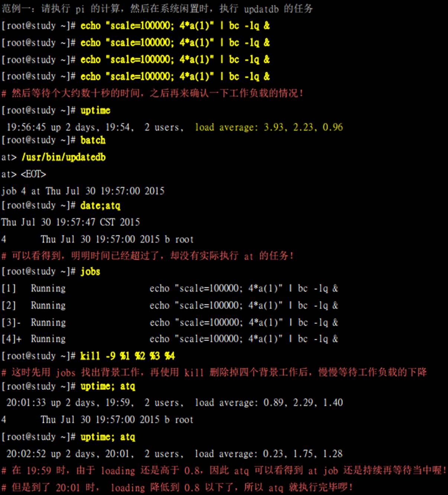

## 3.    循环执行的例行性工作排程

循环执行的例行性工作排程则是由 **cron (crond)** 这个系统服务来控制的

### 1)    使用者设定

/etc/cron.allow：

将可以使用 crontab 的账号写入其中，若不在这个文件内的使用者则不可使用 crontab；

/etc/cron.deny：

将不可以使用 crontab 的账号写入其中，若未记录到这个文件当中的使用者，就可以使用 crontab

 

与at不同,两个文件一般只使用一个,系统默认保留/etc/cron.deny

 

crontab [-u username] [-l|-e|-r]

-u ：只有 root 才能进行这个任务，帮其他使用者建立/移除 crontab 工作排程；

-e ：编辑 crontab 的工作内容

-l ： 查阅 crontab 的工作内容

-r ：移除所有的 crontab 的工作内容，若仅要移除一项， 请用 -e 去编辑。

 

设置一个每天12点给自己发邮件的循环任务

​      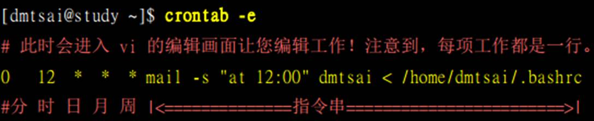

| 代表意义 | 分钟 | 小时 | 日期 | 月份 | 周   | 指令 |
| -------- | ---- | ---- | ---- | ---- | ---- | ---- |
| 数字范围 | 0-59 | 0-23 | 1-31 | 1-12 | 0-7  | 指令 |

​          

 

 

| 特殊字符 | 代表意义                                                     |
| -------- | ------------------------------------------------------------ |
| *(星号)  | 代表任何时刻都接受                                           |
| ,(逗号)  | 代表分隔时段  如果要下达的工作是 3:00 与 6:00 时，就会是：0 3,6 * * * command |
| -(减号)  | 代表一段时间范围内，  8 点到 12 点之间的每小时的 20 分都进行一项工作：20 8-12 * * * command |
| /n(斜线) | 那个 n 代表数字，每隔 n 单位间隔  例如每五分钟进行一次，则：*/5 * * * * command |

​              

 

 

 

 

 

 

### 2)    系统的配置文件： /etc/crontab, /etc/cron.d/*

系统的例行性工作排程需要通过root修改/etc/crontab

 

cron 这个服务的最低侦测限制是分钟，所以 cron 会每分钟去读取一次 /etc/crontab 与/var/spool/cron 里面的数据内容

#### A.    /etc/crontab

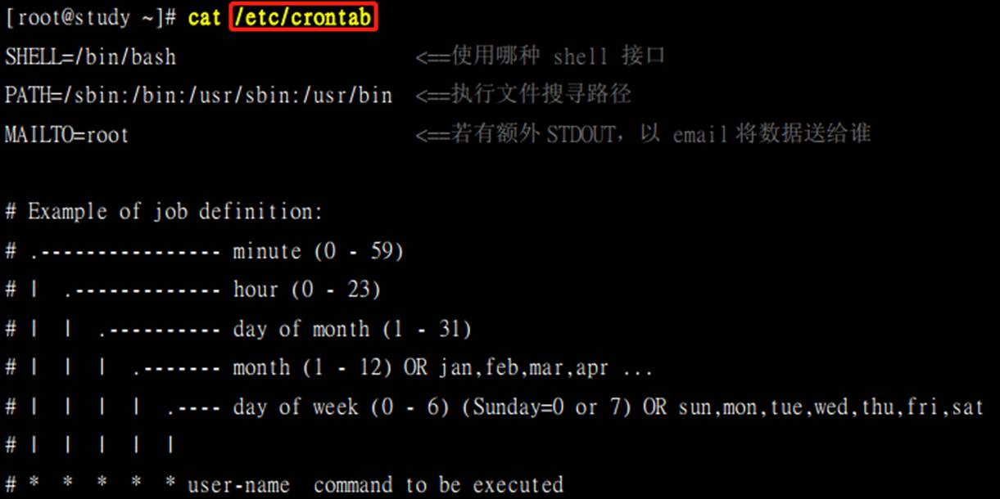

MAILTO=root：

工作的执行结果有 STDOUT/STDERR 时，会将错误讯息或者是屏幕显示的讯息传给指定的用户.

默认是由系统寄发一封 mail 给 root

PATH=....：

​     执行文件路径

『分 时 日 月 周 身份 指令』七个字段的设定:

​     默认以root身份执行

#### B.    crond 服务读取配置文件的位置

/etc/crontab       与系统运作相关

/etc/cron.d/*      与系统运作相关

/var/spool/cron/*  与用户自己的工作相关

 

为软件自定义的执行任务可置于/etc/cron.d目录中

 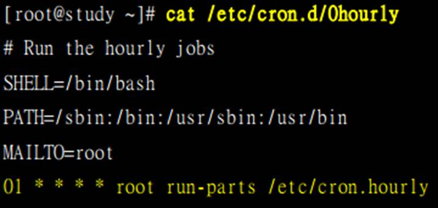

​     run-parts 脚本会在大约 5 分钟内随机选一个时间来执行 /etc/cron.hourly 目录内的所有执行文件

 

### 3)    注意事项

#### A.    资源分配不均的问题

当有多个任务在同一时刻执行,会消耗大量的系统资源.为避免这种情况,可以将任务错开执行

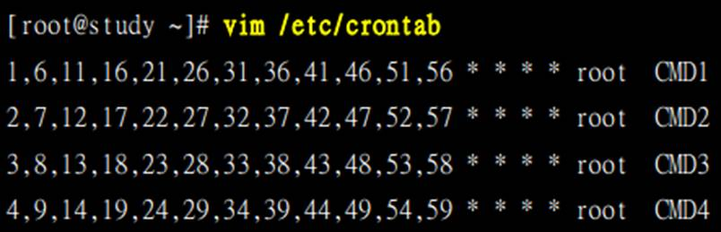

#### B.    取消不要的输出项目

当一个排程一直出错,会有大量的数据通过买了发送到MAILTO设置的账号.

解决:

​     直接以『数据流重导向』将输出的结果输出到 /dev/null 这个垃圾桶当中

#### C.    安全检验

多时候被植入木马都是以例行命令的方式植入的，所以可以藉由检查 /var/log/cron 的内容来视察是否有非预期设定的 cron被执行.

#### D.    周与日月不可共存

## 4.    可唤醒停机期间的工作任务

### 1)    什么是 anacron

anacron处理非 24 小时一直启动的 Linux 系统的 crontab 的执行, 以及因为某些原因导致的超过时间而没有被执行的排程工作。

 

anacron 每个小时被 crond 执行一次，然后 anacron 再去检测相关的排程任务有没有被执行.如果有超过期限的工作在， 就执行该排程任务，执行完毕或无须执行任何排程时， anacron 就停止

 

anacron 分析现在的时间与时间记录文件(timestamps)所记载的上次执行 anacron 的时间，若发现有差异，说明某些时刻没有进行 crontab ,此时 anacron 就会开始执行未进行的 crontab 任务

### 2)    anacron 与 /etc/anacrontab

anacron是一个程序而非服务.anacron进入类crontab的排程,每小时主动执行一次(在/etc/cron.hourly中)

 

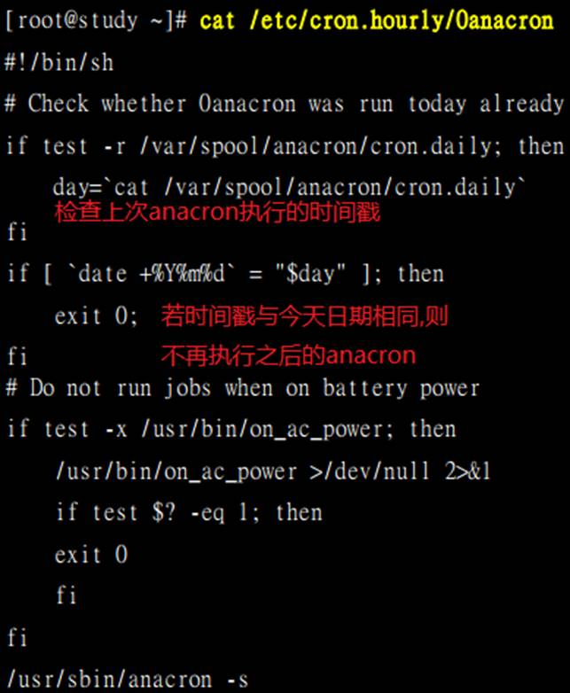

使用0anacron作为文件名:

​     若在hourly目录中有anacron的相关文件,可以保证0anacron优先执行,更新时间戳

 

anacron [-sfn] [job]..

anacron -u [job]..

-s ： 开始一连续的执行各项工作 (job)， 会依据时间记录文件的数据判断是否进行；

-f ： 强制进行，而不去判断时间记录文件的时间戳；

-n ：立刻进行未进行的任务，而不延迟 (delay) 等待时间；

-u ： 仅更新时间记录文件的时间戳，不进行任何工作。

job ：由 /etc/anacrontab 定义的各项工作名称

 

anacron的配置文件是/etc/anacrontab

 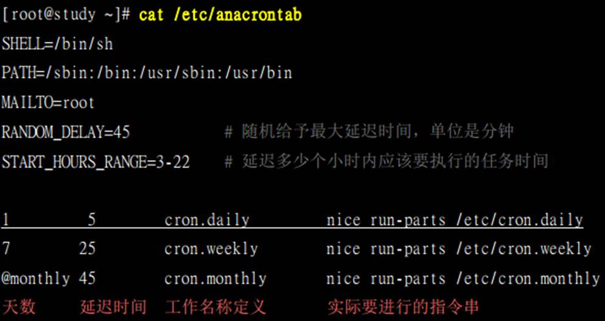

天数： anacron 执行当下与时间戳相差的天数，若超过此天数，就准备开始执行

延迟时间：超过天数排程工作执行的延迟时间，担心立即启动会有其他资源冲突的问题

工作名称定义：会在 /var/log/cron 里头记载该项任务的名称这样！通常与后续的目录资源名称相同即可。

实际要进行的指令串：透过 run-parts 来处理的！

 

anacron的执行流程

由 /var/spool/anacron/cron.daily 取出最近执行 anacron 的时间戳；若与目前的时间不同，就准备进行指令；

根据 /etc/anacrontab 的设定，将延迟 5 分钟 + START_HOURS_RANGE,执行后续指令,run-part /etc/cron.daily

执行完毕后， anacron 程序结束

 

crond 与anacron 的关系

crond 会主动去读取 /etc/crontab, /var/spool/cron/*, /etc/cron.d/* 等配置文件，并依据『分、时、日、月、周』

的时间设定去各项工作排程；

根据 /etc/cron.d/0hourly 的设定，主动去 /etc/cron.hourly/ 目录下，执行所有在该目录下的执行文件；

因为 /etc/cron.hourly/0anacron 这个脚本，主动的每小时执行 anacron ，并呼叫 /etc/anacrontab的配置文件；

根据 /etc/anacrontab 的设定，依据每天、每周、每月去分析 /etc/cron.daily/, /etc/cron.weekly/, /etc/cron.monthly/内的执行文件，以进行固定周期需要执行的指令