## AOP

**AOP全称为Aspect-Orienied Programming**

- OOP是纵向逻辑,通过继承完成功能扩展
- AOP是横向逻辑,通过织入完成功能扩展

### 静态AOP与动态AOP

**静态AOP**

相应的横切关注点以Aspect形式实现之后， 会通过特定的编译器， 将实现后的Aspect编译并织入到系统的静态类中

> 比如， Aspect会使用ajc编译器将各个Aspect以Java字节码的形式编译到系统的各个功能模块中， 以达到融合Aspect
> 和Class的目的。  

优缺点

- 优点：

  Aspect直接以Java字节码的瑕式编译到Java类中， JVM可以像通常一样加载Java类运行，<font color='cornflowerblue'>没有性能损失</font>

- 缺点：

  <font color='cornflowerblue'>灵活性不够</font>。 如果横切关注点需要改变织入到系统的位置， 就需要修改Aspect定义文件， 再重新编译并重新织入到系统中  

**动态AOP**

AOP的织入过程在系统通行开始之后进行，织入信息大都釆用外部XML文件格式保存，可以在系统运行时动态更改织入逻辑

优缺点

- 优点

  灵活性高

- 缺点

  动态织入会造成性能损失

### Java的AOP实现

**1. 动态代理**

通过共同继承接口实现代理，不能代理非接口方法

**2. 动态字节码增强**

通过继承实现，不能代理final类

**3.自定义类加载器  **

通过自定义类加载器的方式完成横切逻辑到系统的织入， 自定义类加载器通过读取外部文件规定的织入細则和必要信息， 在加载class文件期间就可以将横切逻辑添加到系统模块类的现有逻辑中，然后将改动后的class交给Java虚拟机运行。  

**4.AOL 扩展  **

AspectJ，JVM可以像加载平常类那样加载已织入相应逻辑的AO组件所在的类文件并运行

### AOP成员

**Joinpoint  **

Joinpoint是织入操作的执行点。

Joinpoint类型

- 方法调用
- 方法调用执行
- 构造方法调用
- 字段设置
- 字段获取
- 异常处理执行
- 类初始化

**Pointcut**

Pointcut概念代表的足Joinpoint的表述方式

Pointcut表述方式

- 直接指定JoinPoint名称
- 正则表达式
- 特定的Pointcut表述语言：Aspectj

Pointcut运算

- Spring的配置文件中使用and、or等单词作为逻辑运算符
- 在AspecJ中， 则可以使用&&以及||运算符

**Advice**

Advice代表将会织入到Joinpoint的横切逻辑  

Advice的不同形式

- Before Advice:先于切点执行

- After Advice：在切点之后执行

  - After returning Advice：在方法正常执行后

  - After throwing Advice： 在方法异常抛出后

  - After Advice：在方法结束后

    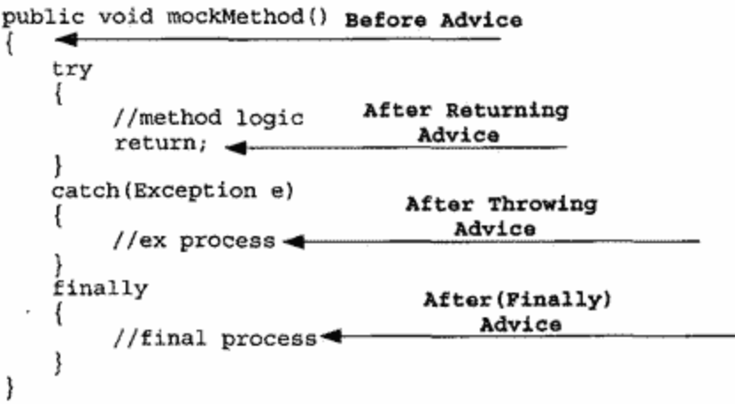

- Around Advice：在Joinpoint之前和之后指定相应的逻辑，甚至中断或者忽略处原来Joinpoint流程的执行 

- Introduction：可以为对象添加属性和方法

**Aspect**

Aspect是对系统中的横切关注点逻辑进行模块化封装的AOP概念体  

**织入器**

在AOP中，有织入器完成织入操作。

不同技术采用不同的织入器：

- AspectJ:ajc编译器
- JBOSS：自定义加载器
- Spring：ProxyFactory

**目标对象（Target）**

符合Pointcut所指定的条件，将在织入过程中被织入横切逻辑的对象， 称为目标对象。

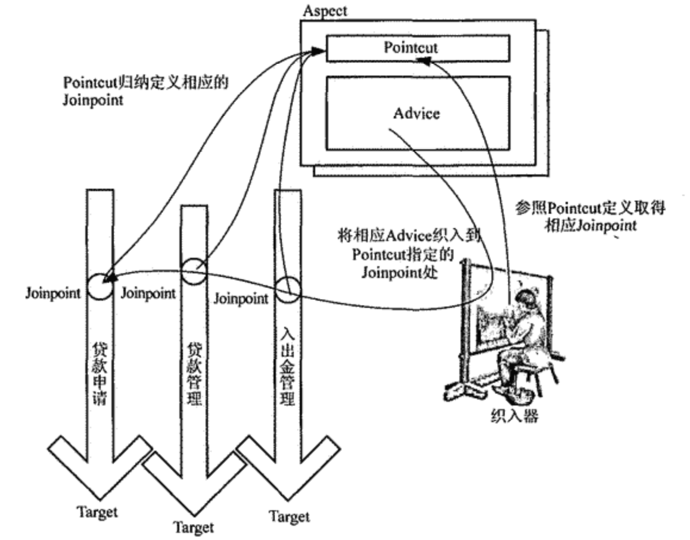

## Spring AOP实现机制

Spring AOP选择Java作为AOL

SpringAOP 采用动态代理机制和字节码生成技术实现  

> 动态代理机制和字节码生成都是在运行期间生成一个代理对象，将横切逻辑织入，系统最终使用的是代理对象。

### 动态代理实现

```java
public interface Flyable {
    void fly();
}
 
public class Bird implements Flyable {
    @Override
    public void fly() {
        System.out.println("Bird is flying...");
        try {
            Thread.sleep(new Random().nextInt(1000));
        } catch (InterruptedException e) {
            e.printStackTrace();
        }
    }
}
```

开发之后希望能够统计bird共飞行了多久时间,需要对方法进行加强.

**实现方法加强的两种手段**

- 继承

  ```java
  public class Bird2 extends Bird {
      @Override
      public void fly() {
          long start = System.currentTimeMillis();
          
          super.fly();
          
          long end = System.currentTimeMillis();
          System.out.println("Fly time = " + (end - start));
      }
  }
  ```

- 聚合

```java
public class BirdLogProxy implements Flyable {
    private Flyable flyable;
 
    public BirdLogProxy(Flyable flyable) {
        this.flyable = flyable;
    }
 
    @Override
    public void fly() {
        System.out.println("Bird fly start...");
 
        flyable.fly();
 
        System.out.println("Bird fly end...");
    }
}
```


**静态代理**

> 类BirdTimeProxy在fly方法中直接调用了flyable->fly()方法. BirdTimeProxy其实代理了传入的Flyable对象，是典型的静态代理实现.

静态代理局限性问题:

- 如果同时代理多个类，依然会导致类无限制扩展

- 如果类中有多个方法，同样的逻辑需要反复实现

解决方案

> 使用一个代理类代理任意对象,如用TimeProxy计算任意一个对象的执行时间

**动态代理**

动态生成Java源文件可使用 [JavaPoet](https://link.jianshu.com/?t=https%3A%2F%2Fgithub.com%2Fsquare%2Fjavapoet) 第三方库,以此模拟jdk动态代理

1. 生成TimeProxy源码

```java
public class Proxy {
 
    public static Object newProxyInstance() throws IOException {
        //1.生成类
        TypeSpec.Builder typeSpecBuilder = TypeSpec.classBuilder("TimeProxy")
                .addSuperinterface(Flyable.class);
 		//2.生成属性
        FieldSpec fieldSpec = FieldSpec.builder(Flyable.class, "flyable", Modifier.PRIVATE).build();
        typeSpecBuilder.addField(fieldSpec);
 		//3.生成构造方法
        MethodSpec constructorMethodSpec = MethodSpec.constructorBuilder()
                .addModifiers(Modifier.PUBLIC)
                .addParameter(Flyable.class, "flyable")
                .addStatement("this.flyable = flyable")
                .build();
        typeSpecBuilder.addMethod(constructorMethodSpec);
 		//4.生成方法
        Method[] methods = Flyable.class.getDeclaredMethods();
        for (Method method : methods) {
            MethodSpec methodSpec = MethodSpec.methodBuilder(method.getName())
                    .addModifiers(Modifier.PUBLIC)
                    .addAnnotation(Override.class)
                    .returns(method.getReturnType())
                    .addStatement("long start = $T.currentTimeMillis()", System.class)
                    .addCode("\n")
                    .addStatement("this.flyable." + method.getName() + "()")
                    .addCode("\n")
                    .addStatement("long end = $T.currentTimeMillis()", System.class)
                    .addStatement("$T.out.println(\"Fly Time =\" + (end - start))", System.class)
                    .build();
            typeSpecBuilder.addMethod(methodSpec);
        }
 		//5.生成file文件
        JavaFile javaFile = JavaFile.builder("com.youngfeng.proxy", typeSpecBuilder.build()).build();
        // 为了看的更清楚，我将源码文件生成到桌面
        javaFile.writeTo(new File("/Users/ouyangfeng/Desktop/"));
 
        return null;
    }
 
}
```

在main方法中调用Proxy.newProxyInstance()，将看到桌面已经生成了TimeProxy.java文件

2. 编译TimeProxy源码

编译TimeProxy源码我们直接使用JDK提供的编译工具即可，为了使你看起来更清晰，我使用一个新的辅助类来完成编译操作：

```java
public class JavaCompiler {
 
    public static void compile(File javaFile) throws IOException {
        javax.tools.JavaCompiler javaCompiler = ToolProvider.getSystemJavaCompiler();
        StandardJavaFileManager fileManager = javaCompiler.getStandardFileManager(null, null, null);
        Iterable iterable = fileManager.getJavaFileObjects(javaFile);
        javax.tools.JavaCompiler.CompilationTask task = javaCompiler.getTask(null, fileManager, null, null, null, iterable);
        task.call();
        fileManager.close();
    }
}
```

3. 加载到内存中并创建对象

```java
  URL[] urls = new URL[] {new URL("file:/" + sourcePath)};
  URLClassLoader classLoader = new URLClassLoader(urls);
  Class clazz = classLoader.loadClass("com.youngfeng.proxy.TimeProxy");
  Constructor constructor = clazz.getConstructor(Flyable.class);
  Flyable flyable = (Flyable) constructor.newInstance(new Bird());
  flyable.fly();
```

4. 增加InvocationHandler接口

查看Proxy->newProxyInstance()的源码，代理类继承的接口(Flyable)是写死的，为了增加灵活性，我们将接口类型作为参数传入

```java
public class Proxy {
    public static Object newProxyInstance(Class inf) throws IOException {
    	...
    }
}
```

为了增加控制的灵活性，将代理的处理逻辑也抽离出来（这里的处理就是打印方法的执行时间）。新增`InvocationHandler`接口，用于处理自定义逻辑

```java
public interface InvocationHandler {
    void invoke(Object proxy, Method method, Object[] args);
}
proxy => 这个参数指定动态生成的代理类，这里是TimeProxy
method => 这个参数表示传入接口中的所有Method对象
args => 这个参数对应当前method方法中的参数
```

newProxyInstance方法修改为

```java
  public static Object newProxyInstance(Class inf, InvocationHandler handler) throws Exception {
        TypeSpec.Builder typeSpecBuilder = TypeSpec.classBuilder("TimeProxy")
                .addModifiers(Modifier.PUBLIC)
                .addSuperinterface(inf);
 
        FieldSpec fieldSpec = FieldSpec.builder(InvocationHandler.class, "handler", Modifier.PRIVATE).build();
        typeSpecBuilder.addField(fieldSpec);
 
        MethodSpec constructorMethodSpec = MethodSpec.constructorBuilder()
                .addModifiers(Modifier.PUBLIC)
                .addParameter(InvocationHandler.class, "handler")
                .addStatement("this.handler = handler")
                .build();
 
        typeSpecBuilder.addMethod(constructorMethodSpec);
 
        Method[] methods = inf.getDeclaredMethods();
        for (Method method : methods) {
            MethodSpec methodSpec = MethodSpec.methodBuilder(method.getName())
                    .addModifiers(Modifier.PUBLIC)
                    .addAnnotation(Override.class)
                    .returns(method.getReturnType())
                    .addCode("try {\n")
                    .addStatement("\t$T method = " + inf.getName() + ".class.getMethod(\"" + method.getName() + "\")", Method.class)
                    // 为了简单起见，这里参数直接写死为空
                    .addStatement("\tthis.handler.invoke(this, method, null)")
                    .addCode("} catch(Exception e) {\n")
                    .addCode("\te.printStackTrace();\n")
                    .addCode("}\n")
                    .build();
            typeSpecBuilder.addMethod(methodSpec);
        }
 
        JavaFile javaFile = JavaFile.builder("com.youngfeng.proxy", typeSpecBuilder.build()).build();
        // 为了看的更清楚，我将源码文件生成到桌面
        String sourcePath = "/Users/ouyangfeng/Desktop/";
        javaFile.writeTo(new File(sourcePath));
 
        // 编译
        JavaCompiler.compile(new File(sourcePath + "/com/youngfeng/proxy/TimeProxy.java"));
 
        // 使用反射load到内存
        URL[] urls = new URL[] {new URL("file:" + sourcePath)};
        URLClassLoader classLoader = new URLClassLoader(urls);
        Class clazz = classLoader.loadClass("com.youngfeng.proxy.TimeProxy");
        Constructor constructor = clazz.getConstructor(InvocationHandler.class);
        Object obj = constructor.newInstance(handler);
 
        return obj;
 }
```

**改进后的方法使用示例**

1. MyInvocationHandler.java增强方法

```java
public class MyInvocationHandler implements InvocationHandler {
    private Bird bird;
 
    public MyInvocationHandler(Bird bird) {
        this.bird = bird;
    }
 
    @Override
    public void invoke(Object proxy, Method method, Object[] args) {
        long start = System.currentTimeMillis();
 
        try {
            method.invoke(bird, new Object[] {});
        } catch (IllegalAccessException e) {
            e.printStackTrace();
        } catch (InvocationTargetException e) {
            e.printStackTrace();
        }
 
        long end = System.currentTimeMillis();
        System.out.println("Fly time = " + (end - start));
    }
}
```

2. 生成代理对象

```java
Proxy.newProxyInstance(Flyable.class, new MyInvocationHandler(new Bird()));
```

生成的代理类代码

```java
package com.youngfeng.proxy;
 
import java.lang.Override;
import java.lang.reflect.Method;
 
public class TimeProxy implements Flyable {
  private InvocationHandler handler;
 
  public TimeProxy(InvocationHandler handler) {
    this.handler = handler;
  }
 
  @Override
  public void fly() {
    try {
        Method method = com.youngfeng.proxy.Flyable.class.getMethod("fly");
        this.handler.invoke(this, method, null);
    } catch(Exception e) {
        e.printStackTrace();
    }
  }
}
```

**JDK源码**

1. Proxy.newProxyInstance()

```java
public static Object newProxyInstance(ClassLoader loader,	#类加载器,保持类的唯一性
                                      Class<?>[] interfaces,#接口数组,可同时代理多个方法
                                      InvocationHandler h)	#增强方法
```

2. InvocationHandler

```java
public interface InvocationHandler {
    public Object invoke(Object proxy, Method method, Object[] args)
        throws Throwable;
}
```

### 动态字节码生成  

动态字节码生成技术是对目标对象进行继承扩展， 为其生成对应的子类， 而子类可以通过覆写来扩展父类的行为， 只要将横切逻辑的实现放到子类中， 然后让系统使用扩展后的目标对象的子类  

**CGLIB**可以对实现了某种接口的类, 或者没有实现任何接口的类迸行扩展  

## 一代Spring AOP

### JoinPoint

Spring AOP仅支持方法级别的JoinPoint，是基于以下考虑：

- 二八原则，以免Spring  AOP为了某些复杂且不常用的功能变得臃肿
- 对类属性级别的JoinPoint进行横切，会破坏面向对象封装
- 复杂的功能可以使用AspectJ对java平台的支持

### Pointcut

Pointcut作为其AOP框架中所有Pointcut的最顶层抽象  

```java
public interface Pointcut {
    Pointcut TRUE = TruePointcut.INSTANCE;
	//类过滤器
    ClassFilter getClassFilter();
	//方法匹配器
    MethodMatcher getMethodMatcher();
}
```

getClassFilter和getMethodMatcher分别用于E配将被执行织入操作的对象以及相应的方法  

```java
public interface ClassFilter {
    //是否判断类型匹配情况
    ClassFilter TRUE = TrueClassFilter.INSTANCE;
	//判断类是否匹配
    boolean matches(Class<?> var1);
}

public interface MethodMatcher {
    MethodMatcher TRUE = TrueMethodMatcher.INSTANCE;
	//判断方法是否匹配
    boolean matches(Method var1, @Nullable Class<?> var2);
	//是否检查方法参数
    boolean isRuntime();
	//增加对方法参数的判断
    boolean matches(Method var1, @Nullable Class<?> var2, Object... var3);
}
```

**常见的Pointcut**

Pointcut类图

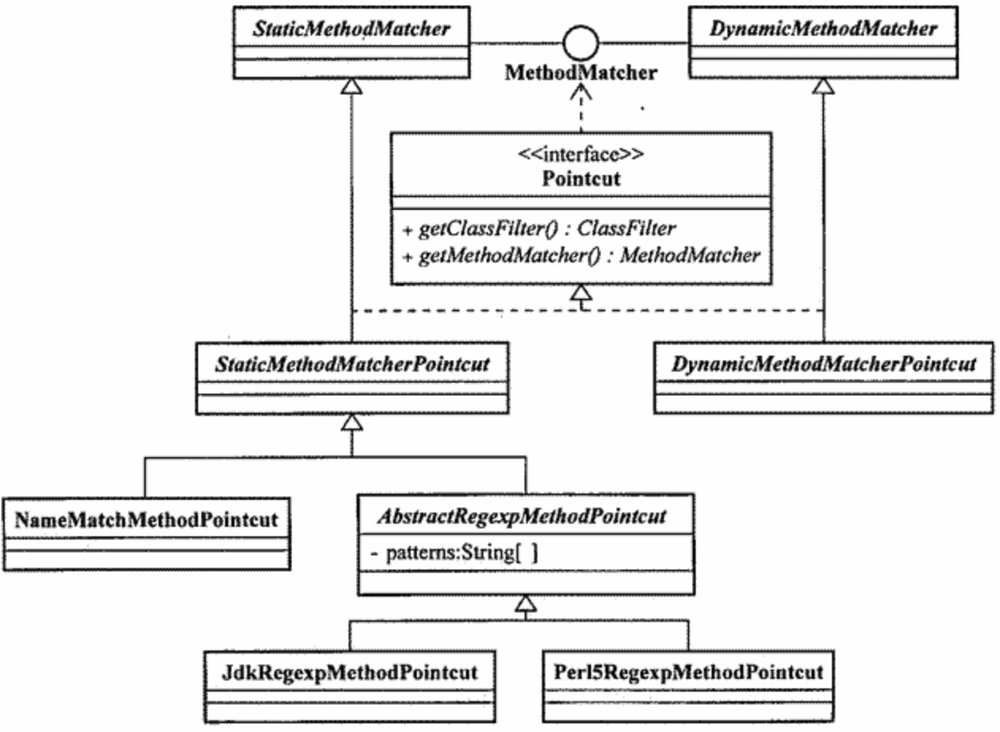

Pointcut类型

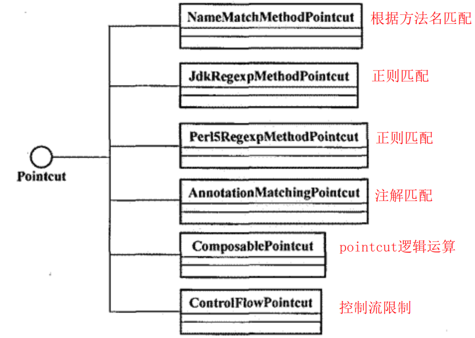

**自定义Pointcut**

实现StaticMethodMatcherPointcut/DynamicMethodMethodMatcherPointcut，默认不进行/进行类型检查

**IoC容器中的Pointcut**

spring中的Pointcut都是java对象，可使用IoC容器来管理。

### Advice

Spring AOP加入了开源组织AOP Alliance ，Advice实现全部遵循AOPAlliance规定的接口  

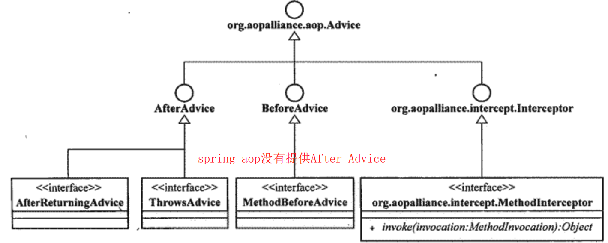

Advice按照其自身能否在目标对象类的所有实例中共享这一标准划分为两大类  

- per-class：除Introduction外的Advice,该类型的Advice的实例可以在目标对象类的所有实例之间共享  
- per-instance：Introduction，会为不同的实例对象保存它们各自的状态以及相关逻辑  

**Before Advice**

```java
public interface MethodBeforeAdvice extends BeforeAdvice {
    void before(Method var1, Object[] var2, @Nullable Object var3) throws Throwable;
}
```

**ThrowsAdvice**

ThrowsAdvice通常用于对系统中特定的异常情况进行监控， 以统一的方式对所发生的异常进行处理  

```java
public class ExceptionBarrierThrowsAdvice implements ThrowsAdvice {
	//普通异常处理逻辑
	public void aftarThrowing(Throwable t){...}
	//运行时异常处理逻辑
	public void afterThrowing(RuntimeException e){...}
	//处理应用租序生成的异常
	public void afterThrowing(Method mrObject[] args,Object target,ApplicationExcepEion e){...}
}
```

**AfterReturningAdvice **

AfterReturningAdvice可以获取方法返回值，但不能对返回值进行更改  

```java
public interface AfterReturningAdvice extends AfterAdvice {
    void afterReturning(@Nullable Object var1, Method var2, Object[] var3, @Nullable Object var4) throws Throwable;
}
```

**Around Advice（可代替上述3种Advice）**

Spring AOP没有提供After (Finally )advice，可通过Around Advice实现After advice，并可修改方法返回值。

Spring中没有直接定义对应Around Advice的实现接口，而是直接采用AOP Alliance的标准接口MethodInterceptor

```java
public interface MethodInterceptor extends Interceptor {
    Object invoke(MethodInvocation var1) throws Throwable;
}
```

**Introduction**

Introduction可以在不改动目标类定义的情况下， 为目标类添加新的**属性**以及**行为**。

```java
public interface IntroductionInterceptor extends MethodInterceptor, DynamicIntroductionAdvice {
}
```

### Aspect

Advisor一般只有一个Pointcut和Advice，理论上Aspect可包含多个Pointcut和Advice

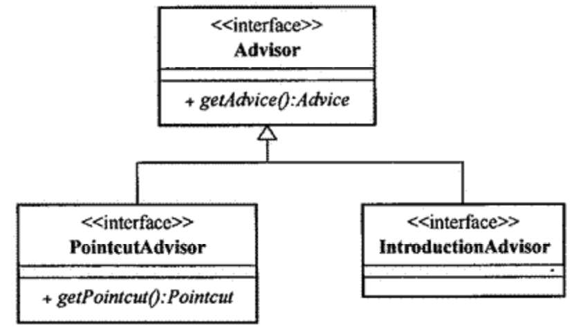

**PointcutAdvisor 家族  **

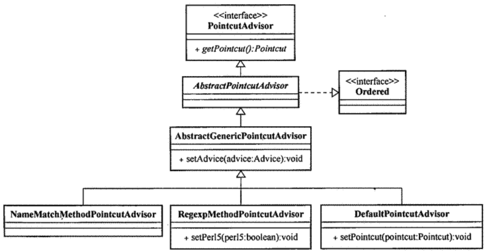

**IntroductionAdvisor 分支  **

IntroduetionAdVisor只能应用于类级别的拦截， 只能使用Introduction型的Advice.

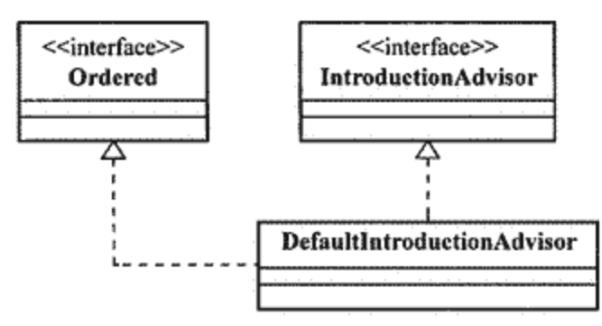  

Ordered作用

```
Spring在处理同一JoinPoint处的多个Advisor时，会按照指定的顺序和优先级来执行它们。
Ordered顺序号决定优先级， 顺序号越小， 优先级越高， 优先级排在前面的， 将被优先执行
```

### Spring AOP 的织入  

**ProxyFactory **

Spring A0P是基于代理模式的AOP的实现，织入过程完成后，会返回织入了横切逻辑的目标对象的代理对象  

ProxyFactory织入所需的内容

- 织入的目标对象
- 应用到对象的Aspect

基于接口代理（动态代理）

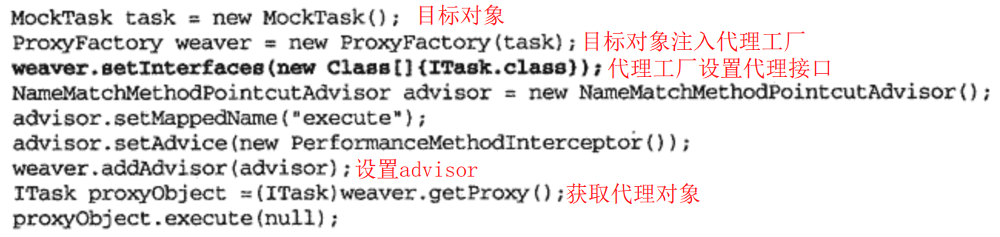

基于类的代理（CGLIB）

> 基于类的代理是依赖CGLIB实现的，无需设置代理接口，可对目标对象的所有接口进行代理

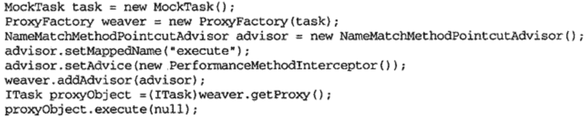

动态代理和CGLIB的选择（以下情况优先使用CGLIB）

- 目标对象没有实现接口
- ProxyFactiory的proxyTargetClass屈性值被设置为true   
- ProxyFaetory的optimise属性值被设置为true  

**ProxyFactory 的本质**
Spring AOP框架内使用AopProxy对使用的不同的代理实现机制进行了适度的抽象  

```java
public interface AopProxy {
    Object getProxy();

    Object getProxy(@Nullable ClassLoader var1);
}
```

AopProxy结构图

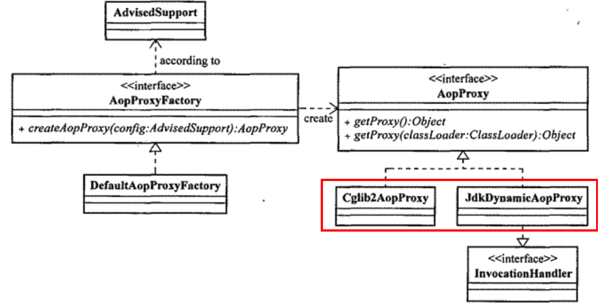

不同AopProxy实现的实例化.过程采用工厂模式（ 确切地说是抽象工厂模式） 进行封装，创建JDK动态代理工厂/CGLIB工厂

```java
public class DefaultAopProxyFactory implements AopProxyFactory, Serializable {
	...
    public AopProxy createAopProxy(AdvisedSupport config) throws AopConfigException {
        if (!config.isOptimize() && !config.isProxyTargetClass() && !this.hasNoUserSuppliedProxyInterfaces(config)) {
           //返回JDK动态代理工厂
        } else {
           //返回CGLIG代理工厂
        }
    }
	...
}
```

AdvisedSupport其实就是一个生成代理对象所需要的信息的载体

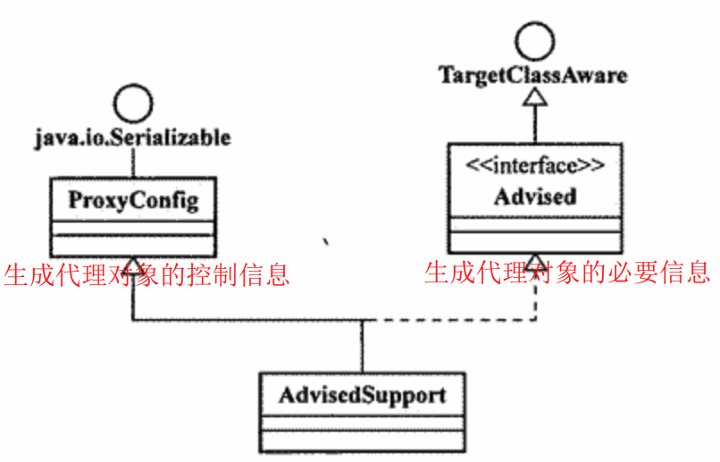

- ProxyConfig定义了5个boolean型的属性， 分别控制在生成代理对象时釆取的行为措施  
  - proxyTargetClass：是否采用CGLIB生成代理对象
  - optimize：是否进一步优化，优化则采用CGLIB
  - opaque：代理对象是否可强转为Advised
  - exposedProxy：是否将代理对象绑定到ThreadLocal
  - frozen：后序是否不允许再修改代理对象的配置

ProxyFactory集成了AdvisedSupport和AopProxy的功能

- 设置代理对象配置信息
- 创建代理对象

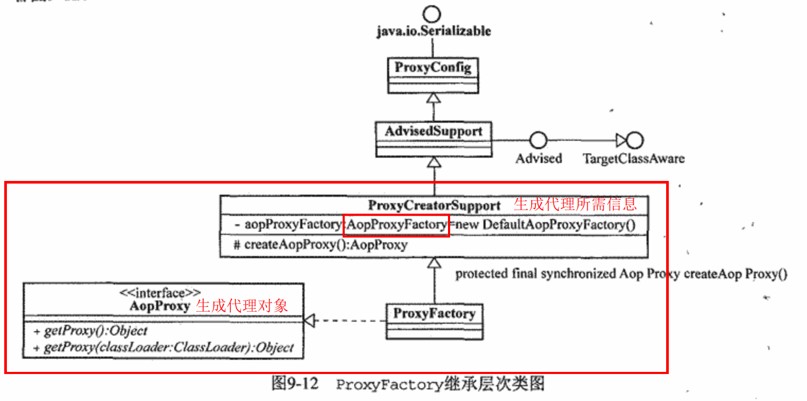

其他代理工厂

> ProxyFaesiory只是Spring AOP中最基本的织入器实现  

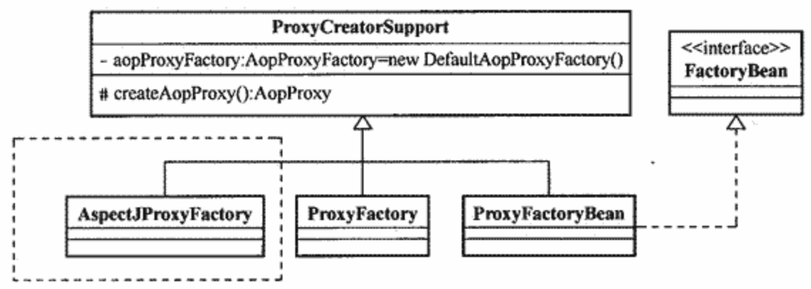

**ProxyFactoryBean**

ProxyFactoryBean将Spring AOP与Spring的loC容器支持相结合， 通过Spring容器可以在容器中对Pointcut和Advice等进行管理， 即使它们依赖于其他业务对象， 也可以很容易地注入其中。  

> ProxyFactoryBean本质上是一个用来生产Proxy的FactoryBean 

主要属性

- proxyInterfaces：基于接口代理所需要执行的接口
- interceptorNames：指定Advisor
- singleton：指定是否返回单例

ProxyFactoryBean工作原理

```
在ProxyFactoryBean的getObject()方法中调用父类的createAopProxy取得aopProxy;
return AopProxy.getProxy();
```

**自动代理**

自动代理（ AutoProxy ) 机制， 用以帮助我们解决使用ProxyFactoryBean配置工作比较大的问题  

Spring AOP的自动代理的实现建立在ApplicationContext容器的BeanPostProeessor概念之上,通过拦截Bean的实例化创建代理对象

- 设置拦截条件
  - 外部配置文件
  - 类的元数据
- 可用的AutoProxyGreator
  - BeanNameAutoProxyCreator：拦截指定beanName的bean实例化过程
  - DefaultAdvisorAutoProxyCreator：对所有符合Advisor条件的bean进行拦截

所有的AutoProxyCreator 都是InstantiationAwareBeanPostProcessor类型，Spring IoC容器会直接根据其中逻辑构造对象并返回，而不会走正常的对象实例化流程 。

### TargetSource

**设置目标对象的方式**

1. setTarget
   - ProxyFactory：setTarget()
   - ProxyFactoryBean：SetTargetName()

2. setTargetSource

**TargetSource作用**

TargetSource是一个target容器，setTarget()所设置的对象需要通过TargetSource进行封装

- 作为目标对象池，返回符合条件的目标对象

**常用TargetSource**

- SingletonTargetSource
- PrototypeTargetSource：目标对象bean必须是prototype
- HotSwappableTargetSource：可动态替换目标对象实现类
- CommonPoolTargetSource：目标对象池
- ThreadLocalTargetSource：目标对象与线程绑定

**自定义TargetSource**

继承TargetSource

```java
public interface TargetSource extends TargetClassAware {
    @Nullable
    Class<?> getTargetClass();
	//是否返回同一目标对象
    boolean isStatic();
	//核心方法
    @Nullable
    Object getTarget() throws Exception;

    void releaseTarget(Object var1) throws Exception;
}
```

## 二代Spring AOP之AspectJ

Spring AOP2.0虽然集成了Aspectj，但只是形式上使用了Aspectj，底层原理还是Spring AOP1.x

```
@Aspectj代表一种定义Aspect的风格， 它让我们能够以POJO类形式定义Aspectj。
Spring AOP会根据标注的注解搜索这些Aspect定义类，然后将其织入系统。
```

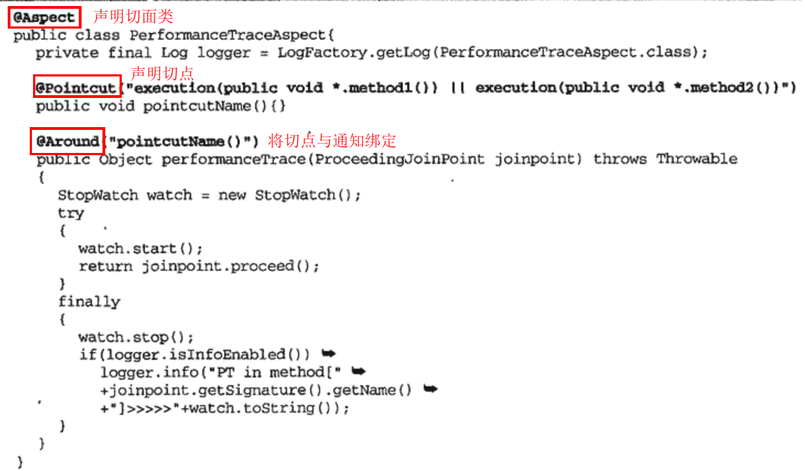

Spring AOP织入Aspect定义类的方法

- 编程方式织入：AspectJProxyFactory  

- 自动代理织入：AnnotationAwareAspectJProxyCreator

  ```
  需要将proxyCreator注册到容器
   1> 声明对应的bean标签
   2> 使用<aop:aspectj-autoproxy/>
  ```

### PointCut

@PointCut用于注解方法，存在与@Aspect注解的切面类中

**PointCut的组成**

- PointCut表达式：@PointCut指定的PointCut表达式由2部分组成
  - PointCut标识符：指定匹配行为
  - 表达式匹配模式
- PointCut签名：作为PointCut表达式载体，必须为void方法

<font color='cornflowerblue'>PointCut表达式之间，PointCut签名之间可以进行逻辑运算</font>

**PointCut标识符**

- execution：指定方法签名
- within：指定类，匹配类下所有方法
- this：指定调用方法的一方的类型

- that：指定被调用方法的一方的类型
- arg：指定参数类型
- @within：指定类注解，包括注解子类
- @target：指定类注解

- @args：指定方法参数注解
- @annotation：指定方法注解

**PointCut解析**

1. AnnotationAwareAutoAspectJProxyCreator会通过反射获取Aspect类中@PointCut定义的切点，并构造一个AspectJExpressionPointcut实例；

2. AspectJExpressionPointcut的ClassFilter和MethodMatcher会调用AspectJ类库，解析得到PointCutExpression对象；

3. 由PointCutExpression对象完成方法匹配的任务


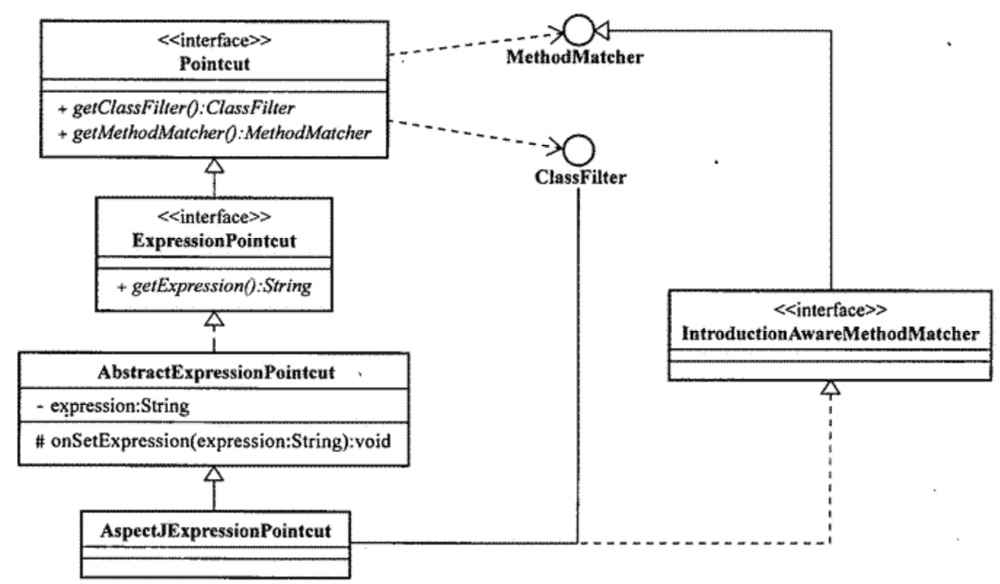

### Advice

- @Before

- @AfterReturning：使用returning属性指定返回对象

- @AfterThrowing：使用throwing属性指定异常对象

- @After

- @Around

- @DeclareParent

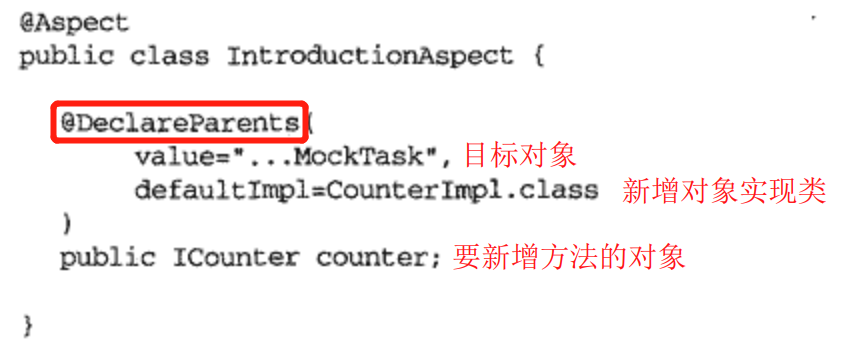

### Advice执行顺序与Aspect实例化类型

**Advice执行顺序**

- 在同一个切面类中，先声明的Advice先织入（离目标方法越远，与Interceptor相反）
- 不同切面类中可通过Ordered接口指定
- 未指定的Advice执行顺序不定

**Aspect实例化类型**

AspectJ支持多种实例化类型

Spring AOP2.0仅支持以下3种实例化类型

- singleton：仅实例化一个Aspect
- perthis：为每个代理对象实例化一个Aspect
- pertarget：为每个目标对象实例化一个Aspect


**Spring AOP2.0还支持Schema的配置方式**（不再细述）

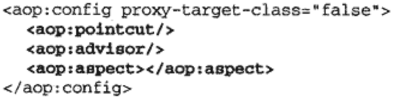

## AOP应用案例

### 异常处理

**Java 异常处理**

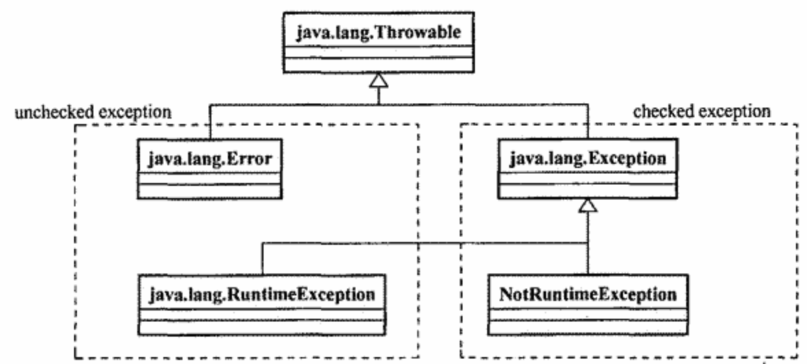

unchecked Exception（fault）

```
一般指系统严重的异常情况，无法恢复。
该信息是提供给维护人员进行人为干预维护的。
```

checked Exception（contingency）

```
一般指可恢复的，意料中的异常。
编译器会对其进行检查
```

**Barrier Fault**

unchecked exception实际上做的事情很少， 通常就是记录日志、 通知相应人员。 这些相同的逻辑实现可以归并于一处进行处理， 而不是让它们散落到系统的各处。

专职处理Fault的Aspect被称为Barrier Fault（ThrowAdvice）

### 安全检查

安全检査属于系统的一种横切关注点， 按照原先的方法进行系统开发， 势必让这些安全检査逻辑散落系统各处， 所以最好是使用AOP

### 缓存

在现有方法论的基础上为系统添加缓存支持， 就会因为系统中缓存需求的广泛分布， 造成实现上的代码分散。

解决：

```
将系统中的缓存需求通过AOP的Aspect进行封装， 只在系统中某个点确切需耍绥存支持的情况下，才为其织入。
```

### AOP调用代理对象

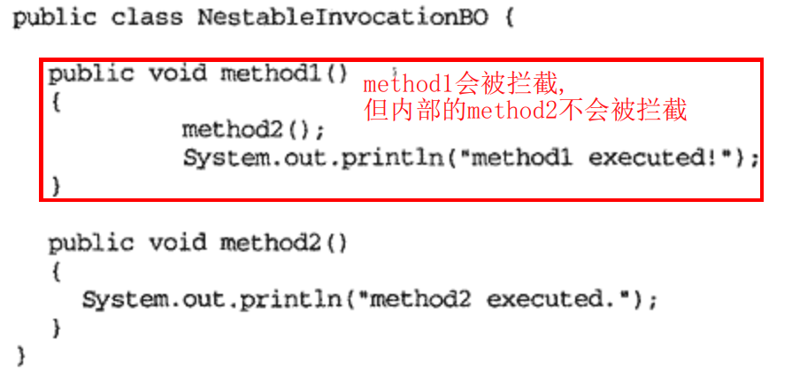

若依赖其他对象的代理对象，可通过依赖注入实现。

而依赖自身的代理对象时，可通过AppContext.currentProxy()获取当前代理对象（与invoke()中的proxy相似）