## IoC基本概念

IoC为Inversion of Control(控制反转)，别名叫做依赖注入（ Dependency Injection）  

### IoC模型

IoC Service Provider实现了依赖注入功能的功能.

> 对象获取过程从主动获取依赖关系的方式转向IoC方式  

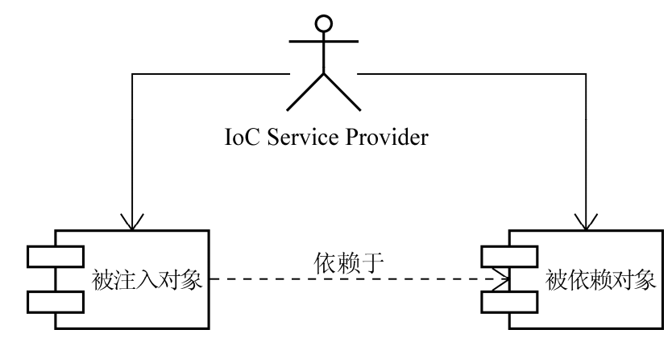  

### 依赖注入方式

| 依赖注入方式   | 实现                              | 优                            | 缺                                                           |
| -------------- | --------------------------------- | ----------------------------- | ------------------------------------------------------------ |
| 接口注入       | 实现接口,接口方法相当于setter方法 |                               | 实现不必要接口,具有侵入性                                    |
| 构造方法注入   | 从构造方法的形参注入              | 对象构造完,就进入就绪状态     | 1. 依赖对象较多时,参数列表过长<br />2. 构造方法无法被继承,无法设置默认值 |
| setter方法注入 | 从setter形参注入                  | setter允许被继承,可设置默认值 | 对象不能构造后马上进入就绪状态                               |

### IoC的附加值

不会对业务对象构成很强的侵入性，使用IoC后，对象具有更好的可测试性、可重用性和可扩展性  

## IoC Service Provider

### IoC Service Provider 的职责  

IoC Service Provider的2个主要功能:**业务对象的构建管理**和**业务对象间的依赖绑定**    

### 管理对象间的依赖关系

IoC Service Provider需要寻求其他方式来记录诸多对象之间的对应关系.

**直接编码方式**

在容器启动之前，我们就可以通过程序编码的方式将被注入对象和依赖对象注册到容器中，并明确它们相互之间的依赖注入关系.

```java
IoContainer container = ...;
container.register(FXNewsProvider.class,new FXNewsProvider());
container.register(IFXNewsListener.class,new DowJonesNewsListener());
...
FXNewsProvider newsProvider = (FXNewsProvider)container.get(FXNewsProvider.class);
newProvider.getAndPersistNews();
```

接口注入:为IFXNewsListenerCallable接口的IFXNewsListener参数注入

```java
IoContainer container = ...;
container.register(FXNewsProvider.class,new FXNewsProvider());
container.register(IFXNewsListener.class,new DowJonesNewsListener());
...
container.bind(IFXNewsListenerCallable.class, container.get(IFXNewsListener.class));
...
FXNewsProvider newsProvider = (FXNewsProvider)container.get(FXNewsProvider.class);
newProvider.getAndPersistNews();
```

**配置文件方式**  

像普通文本文件、 properties文件、 XML文件等，都可以成为管理依赖注入关系的载体.

```xml
<bean id="newsProvider" class="..FXNewsProvider">
    <property name="newsListener">
    	<ref bean="djNewsListener"/>
    </property>
    <property name="newPersistener">
    	<ref bean="djNewsPersister"/>
    </property>
</bean>
<bean id="djNewsListener" class="..impl.DowJonesNewsListener">
</bean>
<bean id="djNewsPersister" class="..impl.DowJonesNewsPersister">
</bean>
```

从读取配置文件完成对象组装 

```java
...
container.readConfigurationFiles(...);
FXNewsProvider newsProvider = (FXNewsProvider)container.getBean("newsProvider");
newsProvider.getAndPersistNews();
```

**元数据方式**

元数据的 代表实现是Google Guice,直接在类中使用元数据信息来标注各个对象之间的依赖关系，然后由Guice框架根
据这些注解所提供的信息将这些对象组装后，交给客户端对象使用 .

通过@Inject指明IoC Service Provider通过构造方法注入方式，为FXNewsProvider注入其所依赖的对象  

```java
public class FXNewsProvider{ 
    private IFXNewsListener newsListener;
    private IFXNewsPersister newPersistener;
    @Inject
    public FXNewsProvider(IFXNewsListener listener,IFXNewsPersister persister) 5
    {
    this.newsListener = listener;
    this.newPersistener = persister;
    } 
    ...
}
```

通过Module指定进一步的依赖注入相关信息 

```java
public class NewsBindingModule extends AbstractModule {
    @Override
    protected void configure() {
        bind(IFXNewsListener.class).to(DowJonesNewsListener.class).in(Scopes.SINGLETON);
        bind(IFXNewsPersister.class).to(DowJonesNewsPersister.class).in(Scopes.SINGLETON);
    } 
}
```

从Guice获取对象

```java
Injector injector = Guice.createInjector(new NewsBindingModule());
FXNewsProvider newsProvider = injector.getInstance(FXNewsProvider.class);
newsProvider.getAndPersistNews();
```

## IoC容器--BeanFactory

Spring的IoC容器和IoC Service Provider所提供的服务之间存在一定的交集  

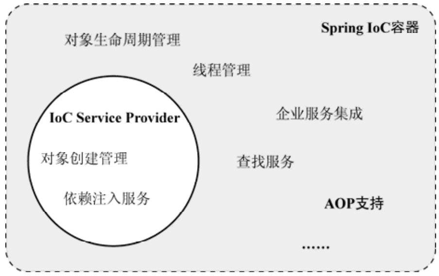

Spring提供了两种容器类型： BeanFactory和ApplicationContext。  

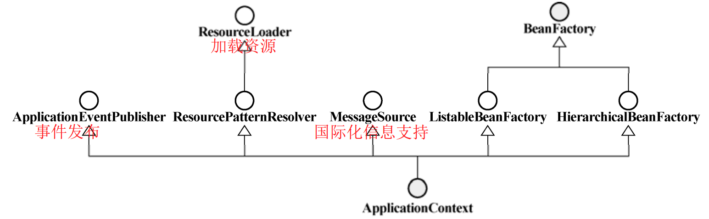

**BeanFactory**

```
基础类型IoC容器，提供完整的IoC服务支持。如果没有特殊指定，默认采用延迟初始化策略（ lazy-load）。只有当客户端对象需要访问容器中的某个受管对象的时候，才对该受管对象进行初始化以及依赖注入操作。  
```

**ApplicationContext**。 

```
ApplicationContext在BeanFactory的基础上构建，是相对比较高级的容器实现.
ApplicationContext还提供了其他高级 特性，比如事件发布、国际化信息支持等.
ApplicationContext所管理的对象，在该类型容器启动之后，默认全部初始化并绑定完成 ,初始化时间长.
```

BeanFactory可以完成作为IoC Service Provider的所有职责，包括业务**对象的注册**和**对象间依赖关系的绑定**  

```java
public interface BeanFactory {
    String FACTORY_BEAN_PREFIX = "&";
    Object getBean(String name) throws BeansException;
    //获取指定name和指定class的bean
    Object getBean(String name, Class requiredType) throws BeansException;
    Object getBean(String name, Object[] args) throws BeansException;
    //判断容器中是否有bean
    boolean containsBean(String name);
    //判断是否为单例
    boolean isSingleton(String name) throws NoSuchBeanDefinitionException;
    boolean isPrototype(String name) throws NoSuchBeanDefinitionException;
    boolean isTypeMatch(String name, Class targetType) throws NoSuchBeanDefinitionException;
    //获取bean的类型
    Class getType(String name) throws NoSuchBeanDefinitionException;
    //获取bean的别名
    String[] getAliases(String name);
}
```

### BeanFactory的对象注册与依赖绑定方式  

### 直接编码方式  

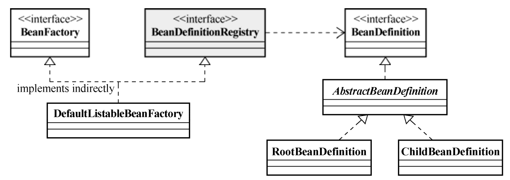

**BeanFactory**接口只定义如何访问容器内管理的Bean的方法 ;**BeanDefinitionRegistry**接口定义抽象了Bean的注册逻辑和依赖绑定

> 每一个受管的对象，在容器中都会有一个BeanDefinition的实例（instance）与之相对应，该BeanDefinition的实例负责保存对象的所有必要信息，包括其对应的对象的class类型、是否是抽象类、构造方法参数以及其他属性等。当客户端向BeanFactory请求相应对象的时候，BeanFactory会通过这些信息为客户端返回一个完备可用的对象实例。

```java
public static void main(String[] args)
{
    DefaultListableBeanFactory beanRegistry = new DefaultListableBeanFactory();
    //从BeanRegistry获取BeanFactory
    BeanFactory container = (BeanFactory)bindViaCode(beanRegistry);
    //从BeanFactory中获取实例
    FXNewsProvider newsProvider = (FXNewsProvider)container.getBean("djNewsProvider");
    newsProvider.getAndPersistNews();
}
public static BeanFactory bindViaCode(BeanDefinitionRegistry registry)
{
    //1 创建Bean定义
    AbstractBeanDefinition newsProvider = new RootBeanDefinition(FXNewsProvider.class,true);
    AbstractBeanDefinition newsListener = new RootBeanDefinition(DowJonesNewsListener.class,true);
    AbstractBeanDefinition newsPersister = new RootBeanDefinition(DowJonesNewsPersister.class,true);
    //2 将bean定义注册到容器中
    registry.registerBeanDefinition("djNewsProvider", newsProvider);
    registry.registerBeanDefinition("djListener", newsListener);
    registry.registerBeanDefinition("djPersister", newsPersister);
    //3 指定依赖关系
    //3.1可以通过构造方法注入方式
    ConstructorArgumentValues argValues = new ConstructorArgumentValues();
    argValues.addIndexedArgumentValue(0, newsListener);
    argValues.addIndexedArgumentValue(1, newsPersister);
    newsProvider.setConstructorArgumentValues(argValues);
    //3.2或者通过setter方法注入方式
    MutablePropertyValues propertyValues = new MutablePropertyValues();
    propertyValues.addPropertyValue(new ropertyValue("newsListener",newsListener));
    propertyValues.addPropertyValue(new PropertyValue("newPersistener",newsPersister));
    newsProvider.setPropertyValues(propertyValues);
    //4 绑定完成,转换类型返回
    return (BeanFactory)registry;
}
```

### 外部配置文件方式  

Spring的IoC容器支持两种配置文件格式： Properties文件格式和XML文件格式 (也可以实现自定义文件格式)

根据配置文件创建一个BeanFactory的过程:

```
1.创建BeanDefinitionRegistry(registry)
2.创建BeanDefinitionReader(reader),并与registry绑定
3.reader读取bean配置文件
4.将redistry强转为BeanFactory
```

**Properties配置格式的加载**  

properties文件:

```properties
djNewsProvider.(class)=..FXNewsProvider
# ----------通过构造方法注入的时候-------------
djNewsProvider.$0(ref)=djListener
djNewsProvider.$1(ref)=djPersister
# ----------通过setter方法注入的时候---------
# djNewsProvider.newsListener(ref)=djListener
# djNewsProvider.newPersistener(ref)=djPersister
djListener.(class)=..impl.DowJonesNewsListener
djPersister.(class)=..impl.DowJonesNewsPersister
```

加载过程:

```java
public static void main(String[] args)
{ 
    DefaultListableBeanFactory beanRegistry = new DefaultListableBeanFactory();
    BeanFactory container = (BeanFactory)bindViaPropertiesFile(beanRegistry);
    FXNewsProvider newsProvider = (FXNewsProvider)container.getBean("djNewsProvider"); 
    newsProvider.getAndPersistNews();
}

public static BeanFactory bindViaPropertiesFile(BeanDefinitionRegistry registry)
{
    PropertiesBeanDefinitionReader reader = new PropertiesBeanDefinitionReader(registry);
    reader.loadBeanDefinitions("classpath:../../binding-config.properties");
    return (BeanFactory)registry;
} 
```

**XML配置格式的加载  **

xml配置文件:

```xml
<?xml version="1.0" encoding="UTF-8"?>
<!DOCTYPE beans PUBLIC "-//SPRING//DTD BEAN//EN" ➥
"http://www.springframework.org/dtd/spring-beans.dtd">
<beans>
	<bean id="djNewsProvider" class="..FXNewsProvider">
        <constructor-arg index="0">
        	<ref bean="djNewsListener"/>
        </constructor-arg>
        <constructor-arg index="1">
        	<ref bean="djNewsPersister"/>
        </constructor-arg>
    </bean>
    <bean id="djNewsListener" class="..impl.DowJonesNewsListener">
    </bean>
    <bean id="djNewsPersister" class="..impl.DowJonesNewsPersister">
    </bean>
</beans>
```

加载过程:

```java
public static void main(String[] args)
{
    DefaultListableBeanFactory beanRegistry = new DefaultListableBeanFactory();
    BeanFactory container = (BeanFactory)bindViaXMLFile(beanRegistry);
    FXNewsProvider newsProvider = (FXNewsProvider)container.getBean("djNewsProvider");
    newsProvider.getAndPersistNews(); 
}
public static BeanFactory bindViaXMLFile(BeanDefinitionRegistry registry)
{
    XmlBeanDefinitionReader reader = new XmlBeanDefinitionReader(registry);
    reader.loadBeanDefinitions("classpath:../news-config.xml");
    return (BeanFactory)registry; 
    // 或者直接 return new XmlBeanFactory(new ClassPathResource("../news-config.xml"));
}
```

### 注解方法

通过注解标注的方式为FXNewsProvider注入所需要的依赖，可以使用**@Autowired**以及**@Component**对相关类进行标记  

```java
@Component
public class FXNewsProvider{
    @Autowired
    private IFXNewsListener newsListener;
    @Autowired
    private IFXNewsPersister newPersistener;
    public FXNewsProvider(IFXNewsListener newsListner,IFXNewsPersister newsPersister)
    {
    this.newsListener = newsListner;
    this.newPersistener = newsPersister;
    }
    ...
}
@Component
public class DowJonesNewsListener implements IFXNewsListener{
	...
}
@Component
public class DowJonesNewsPersister implements IFXNewsPersister{
	...
}
```

@Component需要自动扫描的支持

> \<context:component-scan/>会到指定的包（ package）下面扫描标注有@Component的类，如果找到，则将它们添加到容器进行管理，并根据它们所标注的@Autowired为这些类注入符合条件的依赖对象  

### BeanFactory的xml使用

#### \<beans>和\<bean>  

**\<beans>  **

\<beans>是XML配置文件中最顶层的元素，它下面可以包含0或者1个\<description>和多个\<bean>以及\<import>或者\<alias>  

\<beans>作为所有\<bean>的“统帅”，它拥有相应的属性（ attribute）对所辖的<bean>进行统一的默认行为设置  

```
default-lazy-init。 其值可以指定为true或者false，默认值为false。用来标志是否对所有的<bean>进行延迟初始化。
default-autowire。 可以取值为no、 byName、 byType、 constructor以及autodetect。默认值为no，如果使用自动绑定的话，用来标志全体bean使用哪一种默认绑定方式。
default-dependency-check。 可以取值none、 objects、 simple以及all，默认值为none，即不做依赖检查。
default-init-method。 如果所管辖的<bean>按照某种规则，都有同样名称的初始化方法的话，可以在这里统一指定这个初始化方法名，而不用在每一个<bean>上都重复单独指定。
default-destroy-method。 与default-init-method相对应，如果所管辖的bean有按照某种规则使用了相同名称的对象销毁方法，可以通过这个属性统一指定。
```

**\<description>、 \<import>和\<alias>**

 \<description>

> 可以通过\<description>在配置的文件中指定一些描述性的信息。

\<import>

> 根据模块功能或者层次关系，可以将配置信息分门别类地放到多个配置文件中。
> 想加载主要配置文件，并将主要配置文件所依赖的配置文件同时加载时，可以在这个主要的配置文件中通过<import>元素对其所依赖的配置文件进行引用。比如，如果A.xml中的<bean>定义可能依赖

\<alias>

> 可以通过<alias>为某些<bean>起一些“外号”（别名），通常情况下是为了减少输入。

#### \<bean>

每个业务对象作为个体，在Spring的XML配置文件中是与\<bean> 元素一一对应的  

```xml
<bean id="djNewsListener" class="..impl.DowJonesNewsListener"></bean>
```

**id属性**

每个注册到容器的对象都需要一个唯一标志来将其与其他对象区分.

**name属性**

使用name属性来指定\<bean>的别名(alias）,name可以使用id不能使用的一些字符，比如/  

**class属性**

每个注册到容器的对象都需要通过\<bean>元素的class属性指定其类型(*抽象配置模板不需要*)

**depend-on属性**

depends-on适用于表面上看起来两个bean之间没有使用属性之类的强连接的bean，但是两个bean又确实存在前后依赖关系的情况，使用了depends-on的时候，依赖他人的bean是先于被依赖bean销毁的

**autowire属性**

通过\<bean>的autowire属性，可以指定当前bean定义采用某种类型的自动绑定模式  

```
no:默认的自动绑定模式，也就是不采用任何形式的自动绑定；当我们需要使用依赖注入，只能用<ref/>标签。
byName:自动绑定到与bean的id相同对象属性上
byType:自动绑定到与bean的class相同对象属性上
constructor:以byType模式自动绑定到构造参数与id相同的构造函数上；若有多个符合条件的构造函数，则报错
autodetect:如果对象拥有默认无参数的构造方法，容器会先考虑byType的自动绑定模式。否则，会使用constructor模式
default：采用父级标签（即beans的default-autowire属性）的配置。
```

对“原生类型、 String类型和Classes类型”以及“这些类型的数组”应用自动绑定是无效的.

**dependency-check**

使用每个\<bean>的dependency-check属性对其所依赖的对象进行最终检查

```
none:不做依赖检查。将dependency-check指定为none跟不指定这个属性等效，
simple:那么容器会对简单属性类型以及相关的collection进行依赖检查。
object:只对对象引用类型依赖进行检查。  
all:将simple和object相结合  
```

**lazy-init**

ApplicationContext在容器启动的时候，就会马上对所有的“ singleton的bean定义” 进行实例化操作。
通过设置\<bean>的lazy-init=”true“,可以延迟实例化到使用取用对象.

*设置了lazy-init=true不一定就会延迟实例化，因为该对象可能被其他立即实例化的对象依赖，导致延迟实例化失效。*

可通过设置default-lazy-init保证全局延迟实例化

```xml
<beans default-lazy-init="true">
    <bean id="lazy-init-bean" class="..."/>
    <bean id="not-lazy-init-bean" class="..."> 15
        <property name="propName">
        <ref bean="lazy-init-bean"/>
    </property>
    </bean>
...
</beans>
```


#### \<bean>的注入

**构造函数注入\<constructor-arg>**

仅有唯一匹配的构造函数时

```xml
<bean id="djNewsProvider" class="..FXNewsProvider">
    <constructor-arg>
    	<ref bean="djNewsListener"/>
    </constructor-arg>
    <constructor-arg>
    	<ref bean="djNewsPersister"/>
    </constructor-arg>
</bean>
```

```xml
<bean id="djNewsProvider" class="..FXNewsProvider">
    <constructor-arg ref="djNewsListener"/>
    <constructor-arg ref="djNewsPersister"/>
</bean>
```

存在多个匹配的构造函数时

```
1.使用<constructor-arg>的index属性指定参数索引
2.使用<constructor-arg>的type属性指定参数的类型
```

**setter方法注入\<property>  **

```xml
<bean id="djNewsProvider" class="..FXNewsProvider"> 2
    <property name="newsListener">
    	<ref bean="djNewsListener"/>
    </property>
    <property name="newPersistener">
    	<ref bean="djNewsPersister"/>
    </property>
</bean> 
```

```xml
<bean id="djNewsProvider" class="..FXNewsProvider">
    <property name="newsListener" ref="djNewsListener"/>
    <property name="newPersistener" ref="djNewsPersister"/>
</bean>
```

**构造与setter方法混用**

setter在构造方法之后执行

```xml
<bean id="mockBO" class="..MockBusinessObject"> 8
    <constructor-arg value="11111"/>
    <property name="dependency2" value="22222"/>
</bean>
```

**配置项**

\<value>

> 可以通过value为主体对象注入简单的数据类型及其包装类，也指定String类型的数据

\<ref>

> 使用ref来引用容器中其他的对象实例  

\<idref>

> 如果要为当前对象注入所依赖的对象的名称，而不是引用
> 容器在解析配置的时候就可以帮你检查这个beanName到底是否存在

内部<bean>

> 使用内嵌的<bean>，将这个私有的对象定义仅局限在当前对象
>
> 可以不设置id

\<list>,\<set>,\<map>,\<pros>

\<null>

> <value></value>为"",而不是null

#### 继承

使用parent属性继承父bean的默认值,仅需对特定值进行设定

```xml
<bean id="superNewsProvider" class="..FXNewsProvider">
    <property name="newsListener">
    	<ref bean="djNewsListener"/>
    </property>
    <property name="newPersistener">
    	<ref bean="djNewsPersister"/>
    </property>
</bean>
<bean id="subNewsProvider" parent="superNewsProvider" class="..SpecificFXNewsProvider">
	<property name="newsListener">
   		<ref bean="specificNewsListener"/>
    </property>
</bean>
```

abstract="true"表明容器不会实例化该\<bean>,仅作为抽象父bean,并且该\<bean>不需要指定class.

```xml
<bean id="newsProviderTemplate" abstract="true">
    <property name="newPersistener">
    <ref bean="djNewsPersister"/> 
	</property>
</bean>
<bean id="superNewsProvider" parent="newsProviderTemplate" class="..FXNewsProvider">
    <property name="newsListener">
    </property> <ref bean="djNewsListener"/>
</bean>
```

#### scope

scope用来声明容器中的对象所应该处的限定场景或者说该对象的存活时间  

**singleton**

该实例从容器启动，并因为第一次被请求而初始化之后，将一直存活到容器退出 .

**prototype **

对象的实例化以及属性设置等工作都是由容器负责的，但是只要准备完毕，并且对象实例返回给请求方之后，容器就不再拥有当前返回对象的引用  

**request、 session和global session  **

只适用于Web应用程序，通常是与XmlWebApplicationContext共同使用

- request 

>  为 每 个 HTTP 请 求 创建 一 个 全 新的RequestProcessor对象供当前请求使用，当请求结束后，该对象实例的生命周期即告结束

- session  

> Spring容器会为每个独立的session创建属于它们自己的全新的对象实例。  

- global session  

> global session只有应用在基于portlet的Web应用程序中才有意义，它映射到portlet的global范围的session 
>
> 在普通web中,作为session使用 

**自定义scope**

spring的作用域由接口org.springframework.beans.factory.config.Scope来定 义，自定义自己的作用域只要实现该接口即可

```java
public interface Scope {
    Object get(String name, ObjectFactory objectFactory); 
    Object remove(String name);
    void registerDestructionCallback(String name, Runnable callback);
    String getConversationId();
}
```

自定义ThreadScope：Spring5已经加入了线程Scope

```java
public class SimpleThreadScope implements Scope {
    private static final Log logger = LogFactory.getLog(SimpleThreadScope.class);
    private final ThreadLocal<Map<String, Object>> threadScope = new NamedThreadLocal<Map<String, Object>>("SimpleThreadScope") {
        protected Map<String, Object> initialValue() {
            return new HashMap();
        }
    };

    public SimpleThreadScope() {
    }

    public Object get(String name, ObjectFactory<?> objectFactory) {
        Map<String, Object> scope = (Map)this.threadScope.get();
        Object scopedObject = scope.get(name);
        if (scopedObject == null) {
            scopedObject = objectFactory.getObject();
            scope.put(name, scopedObject);
        }

        return scopedObject;
    }

    @Nullable
    public Object remove(String name) {
        Map<String, Object> scope = (Map)this.threadScope.get();
        return scope.remove(name);
    }

    public void registerDestructionCallback(String name, Runnable callback) {
        logger.warn("SimpleThreadScope does not support destruction callbacks. Consider using RequestScope in a web environment.");
    }

    @Nullable
    public Object resolveContextualObject(String key) {
        return null;
    }

    public String getConversationId() {
        return Thread.currentThread().getName();
    }
}
```

在容器中注册ThreadScope,key为scope的名

```java
Scope threadScope = new SimpleThreadScope();
beanFactory.registerScope("thread",threadScope);
```

为对象设置scope

```xml
<bean id="beanName" class="..." scope="thread"/>
```

Spring还提供了CustomScopeConfigurer专门用于统一注册自定义scope的BeanFactoryPostProcessor实现  

```xml
<bean class="org.springframework.beans.factory.config.CustomScopeConfigurer">
    <property name="scopes">
        <map>
        	<entry key="thread" value="com.foo.SimpleThreadScope"/>
    	</map>
    </property>
</bean>
```

[PageScope的实现]( http://jroller.com/eu/entry/more_fun_with_spring_scopes)

#### 工厂方法与 FactoryBean

通过依赖注入，让容器帮助我们解除接口与实现类之间的耦合性。  

```java
public class Foo {
	private BarInterface barInstance;
    public Foo() {
        // 我们应该避免这样做
        // instance = new BarInterfaceImpl();
        // ...
    }
}
```

若接口对象的构造不是简单的构造函数实例化,而是需要加工后的实例化对象

```
1.在对象注入前加工,需要通过工厂方法模式来解耦接口和实现类.
2.在对象注入后加工,需要修改主体方法使用对象的逻辑.
```

```java
public class Foo {
    private BarInterface barInterface; 
    public Foo() {
        // barInterface = BarInterfaceFactory.getInstance();
        // 或者
        // barInterface = new BarInterfaceFactory().getInstance();
    }
}
```

主体对象只需要依赖工厂类，具体使用的实现类有变更的话，只是变更工厂类，而主体对象不需要做任何变动  

**静态工厂方法**

工厂类

```java
public class StaticBarInterfaceFactory {
    public static BarInterface getInstance(Foobar foobar)
        BarInterface barInterface = new BarInterfaceImpl(foobar);
        //对barInterface进行加工
        return barInterface;
    }
}
```

xml配置(*使用\<constructor-arg>调用含有参数的工厂方法* )

```xml
<bean id="foo" class="...Foo">
    <property name="barInterface">
    	<ref bean="bar"/>
    </property>
</bean>
<bean id="bar" class="...StaticBarInterfaceFactory" factory-method="getInstance">
    <constructor-arg>
    	<ref bean="foobar"/>
    </constructor-arg>
</bean>
<bean id="foobar" class="...FooBar"/>
class:静态方法工厂类
factory-method:工厂方法名称
```

为foo注入的bar实际上是BarInterfaceImpl的实例，即方法调用后的结果，而不是静态工厂方法类（ StaticBarInterfaceFactory）。  

**非静态工厂方法** 

工厂类

```java
public class NonStaticBarInterfaceFactory { 
    public BarInterface getInstance()
    {
        return new BarInterfaceImpl();
    }
    ...
}
```

xml配置

```xml
<bean id="foo" class="...Foo"> 
    <property name="barInterface">
    	<ref bean="bar"/>
    </property>
</bean> 
<!--实例化工厂类-->
<bean id="barFactory" class="...NonStaticBarInterfaceFactory"/>
<bean id="bar" factory-bean="barFactory" factory-method="getInstance"/>
class:静态方法工厂类
factory-bean:工厂方法所在的工厂类实例
factory-method:工厂方法名称
```

**FactoryBean**

FactoryBean(*主语是Bean，定语为Factory*)，这种类型的Bean本身就是生产对象的工厂（Factory)

```java
public interface FactoryBean {
    Object getObject() throws Exception;//返回该FactoryBean“生产”的对象实例
    Class getObjectType();//返回getObject()方法所返回的对象的类型
    boolean isSingleton();//设置对象实例存在与容器中的形式
}
```

示例:获取第二天日期实例对象（自定义Bean的产生）

```java
public class NextDayDateFactoryBean implements FactoryBean {
    public Object getObject() throws Exception {
    return new DateTime().plusDays(1);
    }
    public Class getObjectType() {
    return DateTime.class;
    }
    public boolean isSingleton() {
    return false;
    }
}
public class NextDayDateDisplayer
{
    //注入的是getObject返回值,而不是FactoryBean
    private DateTime dateOfNextDay;
    // 相应的setter方法
    // ...
}
```

xml配置

```xml
<bean id="nextDayDateDisplayer" class="...NextDayDateDisplayer">
    <property name="dateOfNextDay">
    	<ref bean="nextDayDate"/>
    </property>
</bean>
<bean id="nextDayDate" class="...NextDayDateFactoryBean">
</bean>
```

FactoryBean类型的bean定义，通过正常的id引用，容器返回的是FactoryBean所“生产”的对象类型，而非FactoryBean实现本身。  

如果一定要取得FactoryBean本身的话，可以通过在bean定义的id之前加前缀&来达到目的.

### 方法注入与方法替换

```java
public class MockNewsPersister implements IFXNewsPersister {
    private FXNewsBean newsBean;
    public void persistNews(FXNewsBean bean) {
    	persistNewes();
    }
    public void persistNews(){ 
        System.out.println("persist bean:"+getNewsBean());
    }
    public FXNewsBean getNewsBean() {
    	return newsBean;
    }
    public void setNewsBean(FXNewsBean newsBean) {
    	this.newsBean = newsBean;
    }
}
```

xml配置

```xml
<bean id="newsBean" class="..domain.FXNewsBean" singleton="false">
</bean>
<bean id="mockPersister" class="..impl.MockNewsPersister">
    <property name="newsBean">
    	<ref bean="newsBean"/>
    </property>
</bean>
```

bean获取

```java
BeanFactory container = new XmlBeanFactory(new ClassPathResource(".."));
MockNewsPersister persister = (MockNewsPersister)container.getBean("mockPersister");
persister.persistNews();
persister.persistNews();
输出：
persist bean:..domain.FXNewsBean@1662dc8
persist bean:..domain.FXNewsBean@1662dc8
```

获取同一个对象的原因

> 虽然FXNewsBean拥有prototype类型的scope，但容器将一个FXNewsBean的实例注入MockNewsPersister之后， MockNewsPersister就会一直持有这个FXNewsBean实例的引用。
>
> 虽然每次输出都调用了getNewsBean()方法并返回了 FXNewsBean 的实例，但实际上每次返回的都是MockNewsPersister持有的容器第一次注入的实例。  

为实现每次使用不同的对象,可以使用方法注入/方法替换

**[方法注入](https://chenssy.blog.csdn.net/article/details/83006651)**

xml配置(*使用\<lookup-method>*)

```xml
<bean id="newsBean" class="..domain.FXNewsBean" singleton="false">
</bean>
<bean id="mockPersister" class="..impl.MockNewsPersister">
	<lookup-method name="getNewsBean" bean="newsBean"/>
</bean>
```

Spring在初始化容器的时候对配置\<lookup-method/>的bean做了特殊处理，Spring会对bean指定的class做Cglib动态代理，代理\<lookup-method/>标签中name属性所指定的方法，返回bean属性指定的bean实例对象。

**方法替换**

方法替换更多体现在方法的实现层面上，可以灵活替换或者说以新的方法实现覆盖掉原来某个方法的实现逻辑.

```java
public class FXNewsProviderMethodReplacer implements MethodReplacer {
    private static final transient Log logger = LogFactory.getLog(FXNewsProviderMethodReplacer.class);
    public Object reimplement(Object target, Method method, Object[] args) throws Throwable {
        logger.info("before method["+method.getName()+"] on Object["+target.getClass().getName()+"].");
        System.out.println("sorry,We will do nothing this time.");
        logger.info("end of method["+method.getName()+"] on Object["+target.getClass().getName()+"].");
        return null;
    } 
}
```

xml配置(*使用<replaced-method>*)

```xml
<bean id="djNewsProvider" class="..FXNewsProvider">
    <constructor-arg index="0">
    	<ref bean="djNewsListener"/>
    </constructor-arg>
    <constructor-arg index="1">
    	<ref bean="djNewsPersister"/>
    </constructor-arg>
    <replaced-method name="getAndPersistNews" replacer="providerReplacer">
    </replaced-method>
</bean>
<bean id="providerReplacer" class="..FXNewsProviderMethodReplacer">
</bean>
```

**使用BeanFactoryAware每次从容器中获取bean **

Spring框架提供了一个BeanFactoryAware接口，容器在实例化实现了该接口的bean定义的过程中，会自动将容器本身注入该bean。

```java
public class MockNewsPersister implements IFXNewsPersister,BeanFactoryAware {
    private BeanFactory beanFactory;
    
    public void setBeanFactory(BeanFactory bf) throws BeansException {
        this.beanFactory = bf;
    }
    public void persistNews(FXNewsBean bean) {
    	persistNews();
    }
    public void persistNews(){ 
    	System.out.println("persist bean:"+getNewsBean());
    }
    public FXNewsBean getNewsBean() { 
        //每次从容器中获取bean
    	return beanFactory.getBean("newsBean");
    }
}
```

xml配置

```xml
<bean id="newsBean" class="..domain.FXNewsBean" singleton="false">
</bean>
<bean id="mockPersister" class="..impl.MockNewsPersister">
</bean>
```

通过每次从容器中获取newsBean也可获得不同的对象(prototype)

## IoC容器的工作流程

### 2个工作阶段

Spring的IoC容器会以某种方式加载Configuration Metadata（通常也就是XML格式的配置信息）,然后根据这些信息绑定整个系统的对象，最终组装成一个可用的基于轻量级容器的应用系统.

IoC的工作可分为2个阶段:**容器启动阶段**+**Bean实例化阶段**

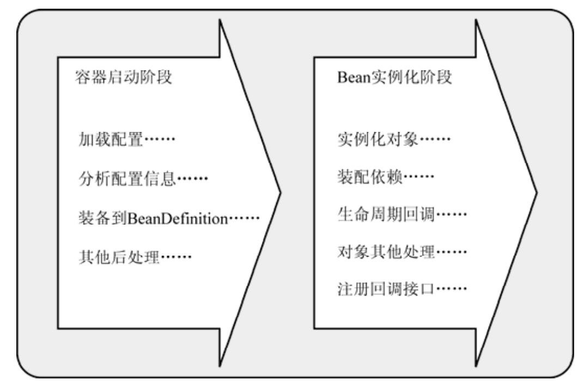


**容器启动阶段**

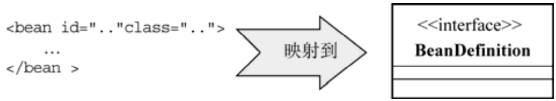

1. 容器通过某种途径加载Configuration元数据

2. 容器需要依赖某些工具类（ BeanDefinitionReader）对加载的Configuration元数据进行解析和分析，并将分析后的信息编组为相应的BeanDefinition  

3. 最后把这些保存了bean定义必要信息的BeanDefinition，注册到相应的BeanDefinitionRegistry  

**Bean实例化阶段**

当请求方通过容器的getBean方法明确地请求某个对象，或者因依赖关系容器需要隐式地调用getBean方法时，就会触发第二阶段的活动  

1. 容器会首先检查所请求的对象之前是否已经初始化 
2. 如果没有，则会根据注册的BeanDefinition所提供的信息实例化被请求对象，并为其注入依赖.若该对象实现了某些回调接
   口，也会根据回调接口的要求来装配它。  

3. 当该对象装配完毕之后，容器会立即将其返回请求方使用.

### 容器的启动

Spring提供了一种叫做BeanFactoryPostProcessor的容器扩展机制。该机制允许我们在容器实例化相应对象之前，对注册到容器的BeanDefinition所保存的信息做相应的修改.

```
自定义实现BeanFactoryPostProcessor,需要实现BeanFactoryPostProcessor接口 
若一个容器有多个BeanFactoryPostProcessor接口,可通过实现Ordered接口设置执行顺序.
```

BeanFactory需要用手动方式应用所有的BeanFactoryPostProcessor

```java
// 声明将被后处理的BeanFactory实例
ConfigurableListableBeanFactory beanFactory = new XmlBeanFactory(new ClassPathResource("..."));
// 声明要使用的BeanFactoryPostProcessor
PropertyPlaceholderConfigurer propertyPostProcessor = new PropertyPlaceholderConfigurer();
propertyPostProcessor.setLocation(new ClassPathResource("..."));
// 执行后处理操作
propertyPostProcessor.postProcessBeanFactory(beanFactory); 
```

ApplicationContext会自动识别配置文件中的BeanFactoryPostProcessor并应用它  

```xml
<beans>
    <bean class="org.springframework.beans.factory.config.PropertyPlaceholderConfigurer">
        <property name="locations"> 9
            <list>
                <value>conf/jdbc.properties</value>
                <value>conf/mail.properties</value>
            </list>
        </property>
    </bean>
    ... 
</beans>
```


#### Spring提供的BeanFactoryPostProcessor实现类  

**1. PropertyPlaceholderConfigurer**

PropertyPlaceholderConfigurer允许我们在XML配置文件中使用占位符（ PlaceHolder），并将这些占位符所代表的资源单独配置到简单的properties文件中来加载。  

- xml配置

```xml
<bean id="dataSource" class="org.apache.commons.dbcp.BasicDataSource" destroy-method="close">
    <property name="url">
    	<value>${jdbc.url}</value>
    </property>
    <property name="driverClassName">
    	<value>${jdbc.driver}</value>
    </property>
    <property name="username">
    	<value>${jdbc.username}</value>
    </property>
    <property name="password">
    	<value>${jdbc.password}</value>
    </property>
</bean>
```

- properties文件

```properties
jdbc.url=jdbc:mysql://server/MAIN
jdbc.driver=com.mysql.jdbc.Driver
jdbc.username=your username
jdbc.password=your password
```

当BeanFactory在第一阶段加载完成所有配置信息时， BeanFactory中保存的对象的属性信息还只是以占位符的形式存在，如${jdbc.url}、 ${jdbc.driver}。当PropertyPlaceholderConfigurer作为BeanFactoryPostProcessor被应用时，它会使用properties文件中的配置信息来替换相应BeanDefinition中占位符所表示的属性值 .

**2. PropertyOverrideConfigurer**  

PropertyOverrideConfigurer可以对容器中配置的bean定义的property信息进行覆盖替换 ,这种覆盖替换对于bean定义来说是透明的 .

- pool-adjustment.properties文件

```properties
# beanName.propertyName=value
dataSource.minEvictableIdleTimeMillis=1000
dataSource.maxActive=50
```

- xml文件

```xml
<bean class="org.springframework.beans.factory.config.PropertyOverrideConfigurer">
	<property name="location" value="pool-adjustment.properties"/>
</bean>
```

当容器中配置的多个PropertyOverrideConfigurer对同一个bean定义的同一个property值进行处理的时候，最后一个将会生效。  

PropertyOverrideConfigurer

>   PropertyResourceConfigurer提供了一个protected类型的方法convertPropertyValue，允许子类覆盖这个方法对相应的配置项进行转换，如对加密后的字符串解密之后再覆盖到相应的bean定义中  

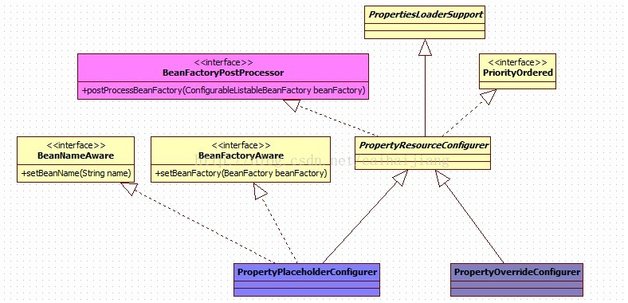


**3.CustomEditorConfigurer**

处理配置文件中的数据类型与真正的业务对象所定义的数据类型转换

容器从XML格式的文件中读取的都是字符串形式，最终应用程序却是由各种类型的对象所构成.Spring内部通过JavaBean的PropertyEditor来帮助进行String类型到其他类型的转换工作  

[自定义PropertyEditor 步骤](https://www.cnblogs.com/chenpi/p/9785946.html)

```
1.实现PropertyEditor接口
2.通过CustomEditorConfigurer注册自定义的PropertyEditor
上述方法比较原始,现在在Controller类中采取@InitBinder绑定自定义PropertyEditor
```

### bean的实例化过程

容器启动之后，仅仅拥有所有对象的BeanDefinition来保存实例化阶段将要用的必要信息,只有当请求方通过BeanFactory的<font color='cornflowerblue'>getBean()</font>方法来请求某个对象实例的时候，才有可能触发Bean实例化阶段的活动.

getBean()的隐式调用

- 被动实例化:B对象显式实例化，但B依赖了A对象，所以A会被隐式实例化
- 主动实例化:ApplicationContext容器在启动阶段后，紧接着调用注册到该容器的所有bean定义的实例化方法getBean()  

getBean()首次执行会调用createBean()方法.


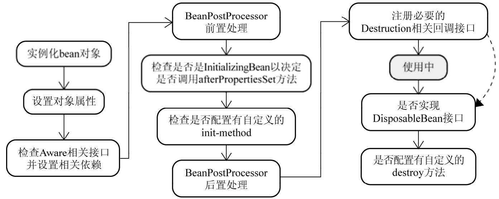

<center>bean实例化过程</center>

**bean实例化与BeanWrapper**

容器在内部实现的时候，采用<font color='cornflowerblue'>策略模式（Strategy Pattern)</font>来决定采用何种方式初始化bean实例  

> 通过<font color='cornflowerblue'>反射</font>或者<font color='cornflowerblue'>CGLIB动态字节码</font>生成来初始化相应的bean实例或者动态生成其子类  

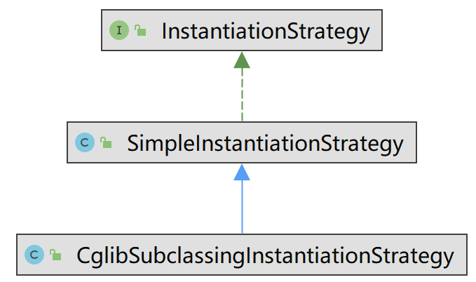

- 实例化第一步:返回BeanWrapper

容器只要根据相应bean定义的BeanDefintion取得实例化信息，结合CglibSubclassingInstantiationStrategy以及不同的bean定义类型，就可以返回实例化完成的对象实例.但不是直接返回构造完成的对象实例，而是以BeanWrapper对构造完成的对象实例进行包裹，返回相应的BeanWrapper实例。  

- 实例化第二步:设置"对象"属性

BeanWrapper接口通常在Spring框架内部使用,其作用是对某个bean进行“包裹”，然后对这个“包裹”的bean进行操作.  
*第一步结束后返回BeanWrapper实例而不是原先的对象实例，就是为了第二步“设置对象属性*“


BeanWrapper通过实现以上接口,实现了属性访问和[属性]类型转换的功能.

**Aware接口 **

当对象实例化完成并且相关属性以及依赖设置完成后， Spring容器会检查当前对象实例是否实现了一系列的以Aware命名结尾的接口定义  

Aware接口的实现会为当前对象实例注入对应的依赖

- BeanFactory容器支持的Aware接口

| Aware接口            | 作用                                                   |
| -------------------- | ------------------------------------------------------ |
| BeanNameAware        | 将该对象实例的bean定义对应的beanName设置到当前对象实例 |
| BeanClassLoaderAware | 会将对应加载当前bean的Classloader注入当前对象实例      |
| BeanFactoryAware     | BeanFactory容器会将自身设置到当前对象实例              |

- ApplicationContext容器支持的Aware接口

| Aware接口               | 作用                                       |
| ----------------------- | ------------------------------------------ |
| ResourceLoaderAware     | 将当前ApplicationContext自身设置到对象实例 |
| ...                     |                                            |
| ApplicationContextAware | 将当前ApplicationContext自身设置到对象实例 |

**BeanPostProcessor  **

BeanPostProcessor会处理容器内所有符合条件的实例化后的对象实例.

```java
public interface BeanPostProcessor{
    Object postProcessBeforeInitialization(Object bean, String beanName);//BeanPostProcessor前置处理
    Object postProcessAfterInitialization(Object bean, String beanName) ;//BeanPostProcessor后置处理
}
```

ApplicationContext对应的那些Aware接口实际上就是通过BeanPostProcessor的方式进行处理的 

> 通过BeanPostProcessor对当前对象实例做更多的处理。比如<font color='cornflowerblue'>替换当前对象实例或者字节码增强当前对象实例  </font>

自定义BeanPostProcessor

```
1.实现相应的BeanPostProcessor对符合条件的Bean实例进行处理
2.将自定义的BeanPostProcessor注册到容器(可注册多个)
```

实例化短路

```
在实例化bean对象步骤之前，容器会首先检查容器中是否注册有InstantiationAwareBeanPostProcessor类型的BeanPostProcessor。如果有，首先使用相应的InstantiationAwareBeanPostProcessor来构造对象实例。构造成功后直接返回构造完成的对象实例，而不会按照“正
规的流程”继续执行。这就是它可能造成“短路”的原因。
```

**InitializingBean和init-method  **

在对象实例化过程调用过“BeanPostProcessor的前置处理”之后，会接着检测当前对象是否实现了InitializingBean接口，如果是，则会调用其afterPropertiesSet()方法进一步调整对象实例的状态

```java
public interface InitializingBean {
	void afterPropertiesSet() throws Exception;
}
```

Spring还提供了另一种方式来指定自定义的对象初始化操作，那就是在XML配置的时候，使用\<bean>的init-method属性  

**DisposableBean与destroy-method **

容器将检查singleton类型的bean实例，看其是否实现了org.springframework.beans.factory.DisposableBean接口。或者其对应的bean定义是否通过\<bean>的destroy-method属性指定了自定义的对象销毁方法。 如果是，就会为该实例注册一个用于对象销毁的回调（ Callback）  

```java
public interface DisposableBean {
    void destroy() throws Exception;
}
```

回调方法注册后，返回的对象实例即处于使用状态，只有该对象实例不再被使用的时候才会执行相关的自定义销毁逻辑 

通知容器何时调用销毁回调(容器不会自动调用)

```
BeanFactory:调用ConfigurableBeanFactory提供的destroySingletons()方法销毁容器中管理的所有singleton类型的对象实例
ApplicationContext:registerShutdownHook()方法，使用标准的Runtime类的addShutdownHook()方式来调用相应bean对象的销毁逻辑，从而保证在Java虚拟机退出之前，这些singtleton类型的bean对象实例的自定义销毁逻辑会被执行
```

## ApplicationContext容器

ApplicationContext常用实现

```
FileSystemXmlApplicationContext:从文件系统加载bean定义以及相关资源的ApplicationContext实现。
ClassPathXmlApplicationContext:从Classpath加载bean定义以及相关资源的ApplicationContext实现。
XmlWebApplicationContext:Spring提供的用于Web应用程序的ApplicationContext实现
```

### 统一资源加载策略 

理想情况下，资源查找完成后，返回给客户端的应该是一个统一的资源抽象接口，客户端要对资源进行什么样的处理，应该由资源抽象接口来界定 

**Resource**

Spring框架内部使用org.springframework.core.io.Resource接口作为所有资源的抽象和访问接口

```java
public interface Resource extends InputStreamSource {
    boolean exists();
    boolean isOpen();
    URL getURL() throws IOException;
    File getFile() throws IOException;
    Resource createRelative(String relativePath) throws IOException;
    String getFilename();
    String getDescription();
}
```

Resource接口可以根据资源的不同类型，或者资源所处的不同场合，给出相应的具体实现

| Resource            | 作用                                              |
| ------------------- | ------------------------------------------------- |
| ByteArrayResource   | 将字节（ byte）数组提供的数据作为一种资源进行封装 |
| ClassPathResource   | 从Java应用程序的ClassPath中加载具体资源并进行封装 |
| FileSystemResource  | 以文件或者URL的形式对该类型资源进行访问           |
| UrlResource         | 通过java.net.URL进行的具体资源查找定位的实现类    |
| InputStreamResource | 将给定的InputStream视为一种资源的Resource实现类   |

**ResourceLoader  **

ResourceLoader接口是<font color='cornflowerblue'>资源查找定位策略</font>的统一抽象，具体的资源查找定位策略则由相应的ResourceLoader实现类给出  

```java
public interface ResourceLoader {
    String CLASSPATH_URL_PREFIX = ResourceUtils.CLASSPATH_URL_PREFIX;
    Resource getResource(String location);
    ClassLoader getClassLoader();
}
```

| ResourceLoader           | 作用                                                         |
| ------------------------ | ------------------------------------------------------------ |
| DefaultResourceLoader    | 检查资源路径是否以classpath:开头，是则尝试构造ClassPathResource类型资源并返回<br/>否则尝试通过URL，根据资源路径来定位资源 |
| FileSystemResourceLoader | 从文件系统加载资源并以FileSystemResource类型返回             |

ResourcePatternResolver批量查找的ResourceLoader

```java
public interface ResourcePatternResolver extends ResourceLoader {
    String CLASSPATH_ALL_URL_PREFIX = "classpath*:";
    Resource[] getResources(String locationPattern) throws IOException;
}
```

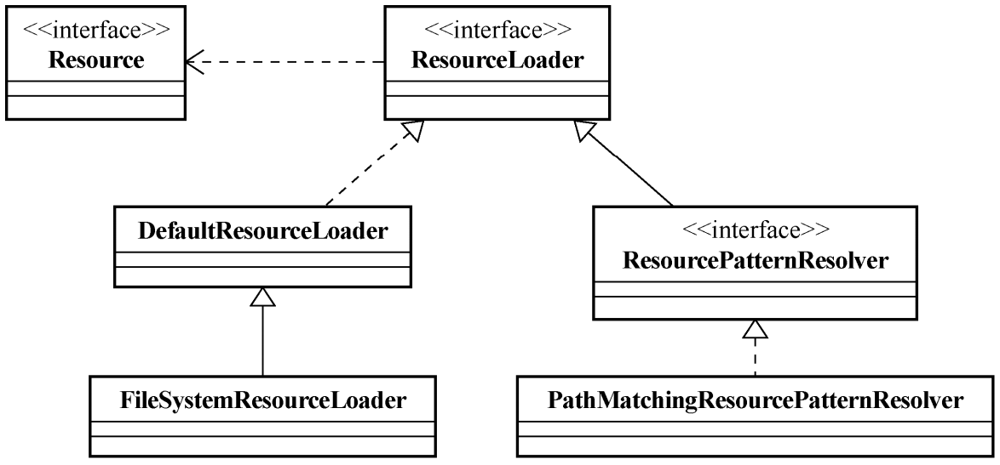

**ApplicationContext与ResourceLoader  **

ApplicationContext继承了ResourcePatternResolver

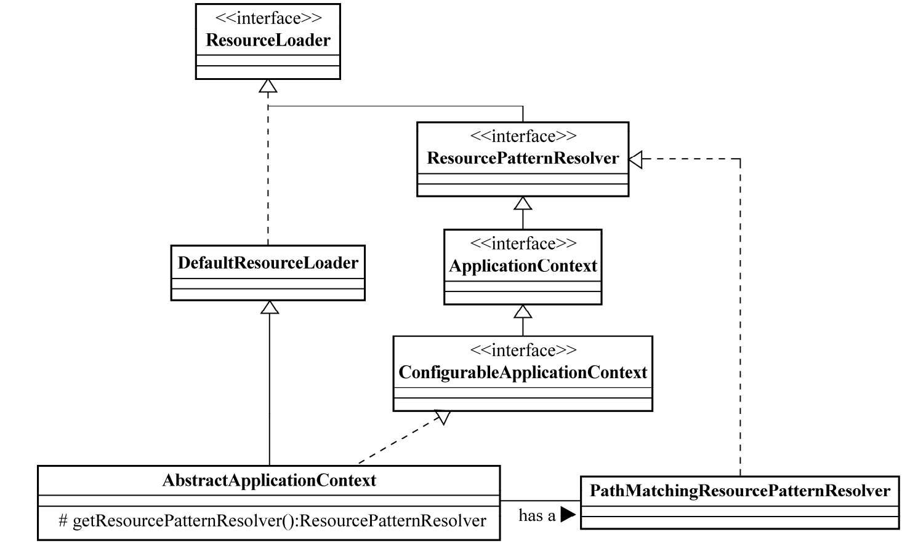

ApplicationContext扮演ResourceLoader的角色  

```java
ResourceLoader resourceLoader = new ClassPathXmlApplicationContext("配置文件路径");
// 或者
// ResourceLoader resourceLoader = new FileSystemXmlApplicationContext("配置文件路径");
```

ApplicationContext注入ResourceLoader

```
ApplicationContext实现了ResourceLoaderAware和ApplicationContextAware接口,会自动通过setter注入
```

### 国际化信息支持

### 容器内事件发布

**自定义事件发布**

Java SE提供了实现自定义事件发布功能的基础类，即java.util.EventObject类和java.util.EventListener接口.

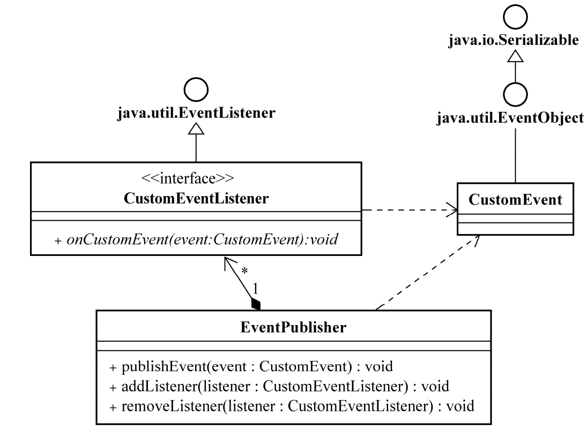  

- 1. 自定义事件类型

```java
public class MethodExecutionEvent extends EventObject {
    private static final long serialVersionUID = -71960369269303337L;
    private String methodName;
    public MethodExecutionEvent(Object source) {
    	super(source);
    }
    public MethodExecutionEvent(Object source,String methodName)
    {
        super(source);
        this.methodName = methodName;
    }
    public String getMethodName() {
    	return methodName;
    }
    public void setMethodName(String methodName) {
    	this.methodName = methodName;
    }
}
```

- 2. 实现针对自定义事件类的事件监听器接口  

```java
public interface MethodExecutionEventListener extends EventListener {
    /**
    * 处理方法开始执行的时候发布的MethodExecutionEvent事件 3
    */
    void onMethodBegin(MethodExecutionEvent evt);
    /**
    * 处理方法执行将结束时候发布的MethodExecutionEvent事件 4
    */
    void onMethodEnd(MethodExecutionEvent evt);
}
```

- 3. 组合事件类和监听器，定义事件发布者。  

```java
public class MethodExeuctionEventPublisher {
    private List<MethodExecutionEventListener> listeners = new ArrayList<MethodExecutionEventListener>();
    //事件发布
    public void methodToMonitor(){
        MethodExecutionEvent event2Publish = new MethodExecutionEvent(this,"methodToMonitor"); 
        publishEvent(MethodExecutionStatus.BEGIN,event2Publish);
        // 执行实际的方法逻辑
        // ...
        publishEvent(MethodExecutionStatus.END,event2Publish);
    }
    protected void publishEvent(MethodExecutionStatus status, MethodExecutionEvent methodExecutionEvent) {
        List<MethodExecutionEventListener> copyListeners = new ArrayList<MethodExecutionEventListener>(listeners);
        for(MethodExecutionEventListener listener:copyListeners){
        	if(MethodExecutionStatus.BEGIN.equals(status))
            	listener.onMethodBegin(methodExecutionEvent);
            else
            	listener.onMethodEnd(methodExecutionEvent);
        }
    }
    //注册管理
    public void addMethodExecutionEventListener(MethodExecutionEventListener listener){
    	this.listeners.add(listener);
    }
    public void removeListener(MethodExecutionEventListener listener){
        if(this.listeners.contains(listener))
        	this.listeners.remove(listener);
    }
}
```

**Spring 的容器内事件发布类结构  **

容器内注册的org.springframework.context.ApplicationListener类型的bean定义会被ApplicationContext容器自动识别，它们负责监听容器内发布的所有ApplicationEvent类型的事件 

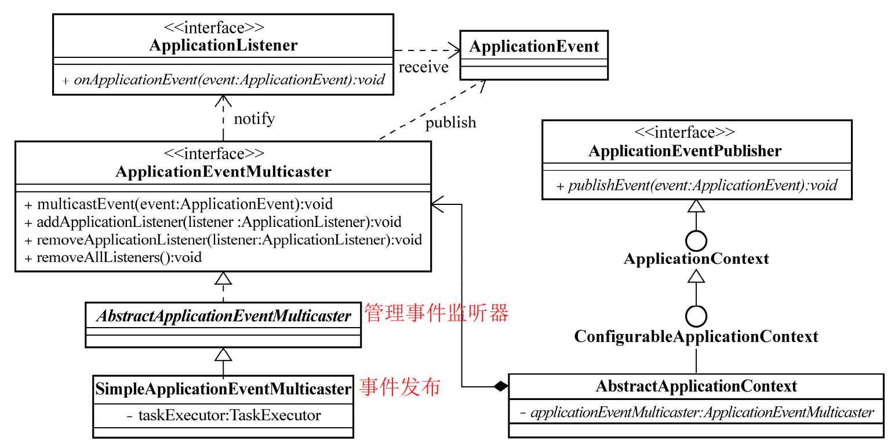

- 1. ApplicationEvent 

```
ContextClosedEvent：ApplicationContext容器在即将关闭的时候发布的事件类型。
ContextRefreshedEvent： ApplicationContext容器在初始化或者刷新的时候发布的事件类型。
RequestHandledEvent： Web请求处理后发布的事件,子类ServletRequestHandledEvent提供特定于Java EE的Servlet相关事件
```

- 2. ApplicationListener  

ApplicationContext容器在启动时，会自动识别并加载EventListener类型bean定义，一旦容器内有事件发布，将通知这些注册到容器的EventListener  

- 3. ApplicationContext  事件发布者

ApplicationContext继承了ApplicationEventPublisher接口，该接口提供了void publishEvent(ApplicationEvent event)方法定义。  

ApplicationContext持有ApplicationEventMulticaster的接口对象。该接口定义了具体事件监听器的**注册管理**以及**事件发布**的方法  

### 多配置模块加载的简化  

1. 通过ApplicationContext，以String[]形式传入多个配置文件所在的路径，即可构造并启动容器  

```java
String[] locations = new String[]{ "conf/dao-tier.springxml", "conf/view-tier.springxml", "conf/business-tier.springxml"};
ApplicationContext container = new FileSystemXmlApplicationContext(locations);
// 或者
ApplicationContext container = new ClassPathXmlApplicationContext(locations);
...
//甚至于使用通配符
ApplicationContext container = new FileSystemXmlApplicationContext("conf/**/*.springxml");
```

2. 通过多级\<import>标签引入多个配置文件

```
通过在某一个主配置文件中使用<import>分别加载其余的配置文件，然后容器就可以通过加载这个主配置文件，来加载其他的配置文件了
```

3. ClassPathXmlApplicationContext还可以通过指定Classpath中的某个类加载同文件夹下的多个配置文件  

## IoC扩展

### Spring 2.5 的基于注解的依赖注入  

#### 注解版的自动绑定（ @Autowired）  

**从自动绑定（ autowire）到@Autowired  **

@Autowired是基于注解的依赖注入的核心注解 ,相当于xml文件中autowired=**byType**

@Autowired可修饰属性,构造方法,方法定义

```java
Object[] beans = ...;
//遍历容器bean
for(Object bean:beans) {
    //属性注入
    if(autowiredExistsOnField(bean)){
        Field f = getQulifiedField(bean)); 
        setAccessiableIfNecessary(f);
        f.set(getBeanByTypeFromContainer());
    } 
    //构造注入
    if(autowiredExistsOnConstructor(bean)){
    ...
    }  
    //方法注入
    if(autowiredExistsOnMethod(bean)){
    ... 
    }
}
```

AutowiredAnnotationBeanPostProcessor是检查当前对象是否有@Autowired标注的依赖需要注入的BeanPostProcessor实现  

**@Qualifier  **

@Qualifier是基于注解的依赖注入的核心注解 ,相当于xml文件中autowired=**byName**

```
@Qualifier作为@Autowired的修饰
```

#### JSR250 标注依赖注入关系  

**@Resource**

根据beanName进行注入,功能类似@Qualifier+@Autowired的组合使用

**@PostConstruct与@PreDestroy**

修饰方法,类似于init-method和destroy-method,由CommonAnnotationBeanPostProcessor处理

**classpath-scanning**

使用相应的注解对组成应用程序的相关类进行标注之后， classpath-scanning功能可以从某一顶层包（ base package）开始扫描。当扫描到某个类标注了相应的注解之后，就会提取该类的相关信息，构建对应的BeanDefinition，然后把构建完的BeanDefinition注册到容器。  

开启注解扫描

```xml
<context:component-scan base-package="org.spring21"/>
<context:component-scan>同时将AutowiredAnnotationBeanPostProcessor和CommonAnnotationBeanPostProcessor一并注册到了容器中
```

\<context:component-scan>默认扫描的注解类型是@Component。

```
在@Component语义基础上细化后的@Repository、 @Service和@Controller  
@Component的beanName为类名首字母小写,也使用value属性指定beanName
```

