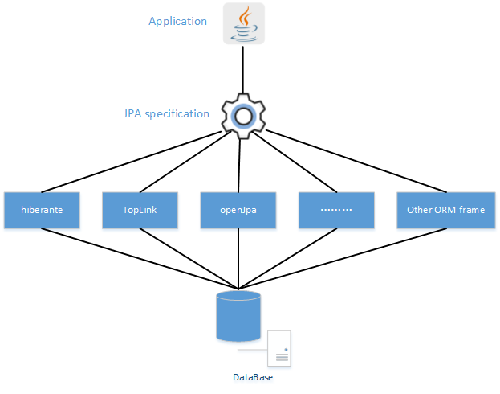

# Spring Transaction

非常推荐阅读如下文章：

- [《可能是最漂亮的 Spring 事务管理详解》](https://mp.weixin.qq.com/s?__biz=MzUzMTA2NTU2Ng==&mid=2247484702&idx=1&sn=c04261d63929db09ff6df7cadc7cca21&chksm=fa497aafcd3ef3b94082da7bca841b5b7b528eb2a52dbc4eb647b97be63a9a1cf38a9e71bf90&token=165108535&lang=zh_CN#rd)

## 什么是事务？

事务就是对一系列的数据库操作（比如插入多条数据）进行统一的提交或回滚操作，如果插入成功，那么一起成功，如果中间有一条出现异常，那么回滚之前的所有操作。

这样可以防止出现脏数据，防止数据库数据出现问题。

## 事务的特性指的是？

指的是 **ACID** ，如下图所示：

[](http://static.iocoder.cn/images/Spring/2018-12-24/06.png)事务的特性

1. **原子性** Atomicity ：一个事务（transaction）中的所有操作，或者全部完成，或者全部不完成，不会结束在中间某个环节。事务在执行过程中发生错误，会被恢复（Rollback）到事务开始前的状态，就像这个事务从来没有执行过一样。即，事务不可分割、不可约简。
2. **一致性** Consistency ：在事务开始之前和事务结束以后，数据库的完整性没有被破坏。这表示写入的资料必须完全符合所有的预设[约束](https://zh.wikipedia.org/wiki/数据完整性)、[触发器](https://zh.wikipedia.org/wiki/触发器_(数据库))、[级联回滚](https://zh.wikipedia.org/w/index.php?title=级联回滚&action=edit&redlink=1)等。
3. **隔离性** Isolation ：数据库允许多个并发事务同时对其数据进行读写和修改的能力，隔离性可以防止多个事务并发执行时由于交叉执行而导致数据的不一致。事务隔离分为不同级别，包括读未提交（Read uncommitted）、读提交（read committed）、可重复读（repeatable read）和串行化（Serializable）。
4. **持久性** Durability ：事务处理结束后，对数据的修改就是永久的，即便系统故障也不会丢失。

## 列举 Spring 支持的事务管理类型？

目前 Spring 提供两种类型的事务管理：

- **声明式**事务：
  - 建立在AOP之上的。其本质是对方法前后进行拦截，然后在目标方法开始之前创建或者加入一个事务，在执行完目标方法之后根据执行情况提交或者回滚事务。
  - 通过使用注解或基于 XML 的配置事务，从而*事务管理*与*业务代码*分离。
- **编程式**事务：
  - 通过编码的方式实现事务管理，需要在代码中显式的调用事务的获得、提交、回滚。它为您提供极大的灵活性，但维护起来非常困难。
  - 使用TransactionTemplate或者直接使用底层的PlatformTransactionManager。对于编程式事务管理，spring推荐使用TransactionTemplate。

实际场景下，我们一般使用 Spring Boot + 注解的**声明式**事务。具体的示例，胖友可以看看 [《Spring Boot 事务注解详解》](https://www.jianshu.com/p/cddeca2c9245) 。

## Spring 事务如何和不同的数据持久层框架做集成？

① 首先，我们先明确下，这里数据持久层框架，指的是 Spring JDBC、Hibernate、Spring JPA、MyBatis 等等。

② 然后，Spring 事务的管理，是通过 `org.springframework.transaction.PlatformTransactionManager` 进行管理，定义如下：

```java
// PlatformTransactionManager.java

public interface PlatformTransactionManager {

    // 根据事务定义 TransactionDefinition ，获得 TransactionStatus 。 
    TransactionStatus getTransaction(@Nullable TransactionDefinition definition) throws TransactionException;

    // 根据情况，提交事务
    void commit(TransactionStatus status) throws TransactionException;
    
    // 根据情况，回滚事务
    void rollback(TransactionStatus status) throws TransactionException;
    
}
```

PlatformTransactionManager 是负责事务管理的接口，一共有三个接口方法，分别负责事务的获得、提交、回滚。

- `getTransaction(TransactionDefinition definition)`方法，根据事务定义 TransactionDefinition ，获得 TransactionStatus 。

  - 为什么不是创建事务呢？因为如果当前如果已经有事务，则不会进行创建，一般来说会跟当前线程进行绑定。如果不存在事务，则进行创建。
  - 为什么返回的是 TransactionStatus 对象？在 TransactionStatus 中，不仅仅包含事务属性，还包含事务的其它信息，例如是否只读、是否为新创建的事务等等。😈 下面，也会详细解析 TransactionStatus 。
  - 事务 TransactionDefinition 是什么？😈 下面，也会详细解析 TransactionStatus 。

- `commit(TransactionStatus status)`方法，根据 TransactionStatus 情况，提交事务。

  为什么根据 TransactionStatus 情况，进行提交？例如说，带`@Transactional`注解的的 A 方法，会调用`@Transactional`注解的 B 方法。

  - 在 B 方法结束调用后，会执行 `PlatformTransactionManager#commit(TransactionStatus status)` 方法，此处事务**是不能**、**也不会**提交的。
  - 而是在 A 方法结束调用后，执行 `PlatformTransactionManager#commit(TransactionStatus status)` 方法，提交事务。

- `rollback(TransactionStatus status)`方法，根据 TransactionStatus 情况，回滚事务。

  - 为什么根据 TransactionStatus 情况，进行回滚？原因同 `#commit(TransactionStatus status)` 方法。

PlatformTransactionManager 有**抽象子类** `oAbstractPlatformTransactionManager` ，基于 [模板方法模式](https://blog.csdn.net/carson_ho/article/details/54910518) ，实现事务整体逻辑的骨架，而抽象 `doCommit(DefaultTransactionStatus status)`、`doRollback(DefaultTransactionStatus status)` 等等方法，交由子类来实现。

**不同的数据持久层框架，会有其对应的 PlatformTransactionManager 实现类**

所有的实现类，都基于 AbstractPlatformTransactionManager 这个骨架类。

- HibernateTransactionManager ，和 Hibernate5 的事务管理做集成。
- DataSourceTransactionManager ，和 JDBC 的事务管理做集成。所以，它也适用于 MyBatis、Spring JDBC 等等。
- JpaTransactionManager ，和 JPA 的事务管理做集成。

如下，是一个比较常见的 XML 方式来配置的事务管理器，使用的是 DataSourceTransactionManager 

```xml
<!-- 事务管理器 -->
<bean id="transactionManager"
class="org.springframework.jdbc.datasource.DataSourceTransactionManager">
    <!-- 数据源 -->
    <property name="dataSource" ref="dataSource" />
</bean>
```

## [为什么在 Spring 事务中不能切换数据源](https://blog.csdn.net/demohui/article/details/109659540)？

在 Spring 的事务管理中，数据源连接由AbstractRoutingDataSource返回的dataSource决定

```sequence
DataSourceTransactionManager->AbstractRoutingDataSource:getConnection()
AbstractRoutingDataSource->AbstractRoutingDataSource:determineTargetDataSource()获取dataSource
AbstractRoutingDataSource->AbstractRoutingDataSource:dataSource.getConnection();
AbstractRoutingDataSource->DataSourceTransactionManager:返回conn
```

`determineTargetDataSource()`返回的lookupKey和当前线程所绑定，即使我们设置了另外一个数据源，最终返回的还是源数据源。

```java
//AbstractRoutingDataSource

protected DataSource determineTargetDataSource() {
    Assert.notNull(this.resolvedDataSources, "DataSource router not initialized");
    Object lookupKey = this.determineCurrentLookupKey();
    DataSource dataSource = (DataSource)this.resolvedDataSources.get(lookupKey);
    if (dataSource == null && (this.lenientFallback || lookupKey == null)) {
        dataSource = this.resolvedDefaultDataSource;
    }

    if (dataSource == null) {
        throw new IllegalStateException("Cannot determine target DataSource for lookup key [" + lookupKey + "]");
    } else {
        return dataSource;
    }
}
```

为实现[数据源切换](https://blog.csdn.net/qq_36521507/article/details/103452961)，必须重写`determineTargetDataSource()`，让目标数据源的key与线程绑定。以上必须在事务开启前完成。

```
事务也是基于AOP实现的，可把切换数据源的操作也放在AOP中，然后设置该AOP的order高于事务即可，比如添加@Order(1)注解
```

## @Transactional 注解有哪些属性？如何使用？

`@Transactional` 注解的**属性**如下：

| 属性                   | 类型                               | 描述                                   |
| :--------------------- | :--------------------------------- | :------------------------------------- |
| value                  | String                             | 可选的限定描述符，指定使用的事务管理器 |
| propagation            | enum: Propagation                  | 可选的事务传播行为设置                 |
| isolation              | enum: Isolation                    | 可选的事务隔离级别设置                 |
| readOnly               | boolean                            | 读写或只读事务，默认读写               |
| timeout                | int (in seconds granularity)       | 事务超时时间设置                       |
| rollbackFor            | Class对象数组，必须继承自Throwable | 导致事务回滚的异常类数组               |
| rollbackForClassName   | 类名数组，必须继承自Throwable      | 导致事务回滚的异常类名字数组           |
| noRollbackFor          | Class对象数组，必须继承自Throwable | 不会导致事务回滚的异常类数组           |
| noRollbackForClassName | 类名数组，必须继承自Throwable      | 不会导致事务回滚的异常类名字数组       |

- 一般情况下，我们直接使用 `@Transactional` 的所有属性默认值即可。

具体**用法**如下：

- `@Transactional` 可以作用于接口、接口方法、类以及类方法上。当作用于类上时，该类的所有<font color='red'> `public` </font>方法将都具有该类型的事务属性，同时，我们也可以在方法级别使用该标注来覆盖类级别的定义。

**注意：**

- 虽然 `@Transactional` 注解可以作用于接口、接口方法、类以及类方法上，但是 Spring 建议不要在接口或者接口方法上使用该注解，因为这只有在使用基于接口的代理时它才会生效。
-  **`@Transactional` 注解应该只被应用到 `public` 方法上，这是由 Spring AOP 的本质决定的**。如果你在 `protected`、`private` 或者默认可见性的方法上使用 `@Transactional` 注解，这将被忽略，也不会抛出任何异常。**这一点，非常需要注意**。

------

**`@Transaction`源码**。

`@Transactional` 注解的属性，会解析成 `TransactionDefinition` 对象，即事务定义。

```java
public interface TransactionDefinition {

	int getPropagationBehavior(); // 事务的传播行为
	int getIsolationLevel(); // 事务的隔离级别
	int getTimeout(); // 事务的超时时间
	boolean isReadOnly(); // 事务是否只读
	@Nullable
	String getName(); // 事务的名字

}
```

- `@Transactional` 注解的 `rollbackFor`、`rollbackForClassName`、`noRollbackFor`、`noRollbackForClassName` 属性体现在 TransactionDefinition 的实现类 RuleBasedTransactionAttribute 中。
- `#getPropagationBehavior()` 方法，返回事务的**传播行为**
- `#getIsolationLevel()` 方法，返回事务的**隔离级别**

## 什么是事务的隔离级别？分成哪些隔离级别？

参考文章：

- [《数据库四大特性以及事务隔离级别》](https://zhuanlan.zhihu.com/p/25419593)
- [《五分钟搞清楚 MySQL 事务隔离级别》](https://www.jianshu.com/p/4e3edbedb9a8)

不同数据库对四个隔离级别的支持和实现略有不同。

```java
// TransactionDefinition.java

/**
 * 【Spring 独有】使用后端数据库默认的隔离级别
 *
 * MySQL 默认采用的 REPEATABLE_READ隔离级别
 * Oracle 默认采用的 READ_COMMITTED隔离级别
 */
int ISOLATION_DEFAULT = -1;

/**
 * 最低的隔离级别，允许读取尚未提交的数据变更，可能会导致脏读、幻读或不可重复读
 */
int ISOLATION_READ_UNCOMMITTED = Connection.TRANSACTION_READ_UNCOMMITTED;

/**
 * 允许读取并发事务已经提交的数据，可以阻止脏读，但是幻读或不可重复读仍有可能发生
 */
int ISOLATION_READ_COMMITTED = Connection.TRANSACTION_READ_COMMITTED;
/**
 * 对同一字段的多次读取结果都是一致的，除非数据是被本身事务自己所修改，可以阻止脏读和不可重复读，但幻读仍有可能发生。
 */
int ISOLATION_REPEATABLE_READ = Connection.TRANSACTION_REPEATABLE_READ;
/**
 * 最高的隔离级别，完全服从ACID的隔离级别。所有的事务依次逐个执行，这样事务之间就完全不可能产生干扰，也就是说，该级别可以防止脏读、不可重复读以及幻读。
 *
 * 但是这将严重影响程序的性能。通常情况下也不会用到该级别。
 */
int ISOLATION_SERIALIZABLE = Connection.TRANSACTION_SERIALIZABLE;
```

## 什么是事务的传播级别？分成哪些传播级别？

事务的**传播行为**，指的是当前带有事务配置的方法，需要怎么处理事务。

- 例如：方法可能继续在现有事务中运行，也可能开启一个新事务，并在自己的事务中运行。

- 事务的传播级别**是 Spring 自身所定义的**。通过事务的传播级别，Spring 才知道如何处理事务，是创建一个新事务呢，还是继续使用当前的事务。

  > 艿艿的自我吐槽：是不是有种背概念背的想哭

在 TransactionDefinition 接口中，定义了**三类七种**传播级别。

```java
// TransactionDefinition.java

// ========== 支持当前事务的情况 ========== 

/**
 * 如果当前存在事务，则使用该事务。
 * 如果当前没有事务，则创建一个新的事务。
 */
int PROPAGATION_REQUIRED = 0;
/**
 * 如果当前存在事务，则使用该事务。
 * 如果当前没有事务，则以非事务的方式继续运行。
 */
int PROPAGATION_SUPPORTS = 1;
/**
 * 如果当前存在事务，则使用该事务。
 * 如果当前没有事务，则抛出异常。
 */
int PROPAGATION_MANDATORY = 2;

// ========== 不支持当前事务的情况 ========== 

/**
 * 创建一个新的事务。
 * 如果当前存在事务，则把当前事务挂起。
 */
int PROPAGATION_REQUIRES_NEW = 3;
/**
 * 以非事务方式运行。
 * 如果当前存在事务，则把当前事务挂起。
 */
int PROPAGATION_NOT_SUPPORTED = 4;
/**
 * 以非事务方式运行。
 * 如果当前存在事务，则抛出异常。
 */
int PROPAGATION_NEVER = 5;

// ========== 其他情况 ========== 

/**
 * 如果当前存在事务，则创建一个事务作为当前事务的嵌套事务来运行。
 * 如果当前没有事务，则等价于 {@link TransactionDefinition#PROPAGATION_REQUIRED}
 */
int PROPAGATION_NESTED = 6;
```

- 分类之后，其实还是比较好记的。当然，绝大数场景，我们只用 `PROPAGATION_REQUIRED` 传播级别。
- 前六种事务传播行为是 Spring 从 EJB 中引入的，他们共享相同的概念。而`PROPAGATION_NESTED`是 Spring 所特有的。
  - 以 `PROPAGATION_NESTED` 启动的事务内嵌于外部事务中（如果存在外部事务的话），此时，内嵌事务并不是一个独立的事务，它依赖于外部事务的存在，只有通过外部的事务提交，才能引起内部事务的提交，嵌套的子事务不能单独提交。如果熟悉 JDBC 中的保存点（SavePoint）的概念，那嵌套事务就很容易理解了，其实嵌套的子事务就是保存点的一个应用，一个事务中可以包括多个保存点，每一个嵌套子事务。另外，外部事务的回滚也会导致嵌套子事务的回滚。
  - 😈 当然，虽然上面 `PROPAGATION_NESTED` 文字很长，实际我们基本没用过。或者说，去掉基本，我们根本没用过。

## 什么是事务的超时属性？

所谓事务超时，就是指一个事务所允许执行的最长时间，如果超过该时间限制但事务还没有完成，则自动回滚事务。

在 TransactionDefinition 中以 `int` 的值来表示超时时间，其单位是秒。

## 什么是事务的只读属性？

事务的只读属性是指，对事务性资源进行只读操作或者是读写操作。

- 所谓事务性资源就是指那些被事务管理的资源，比如数据源、JMS 资源，以及自定义的事务性资源等等。
- 如果确定只对事务性资源进行只读操作，那么我们可以将事务标志为只读的，以提高事务处理的性能。 [《不使用事务和使用只读事务的区别 》](https://my.oschina.net/uniquejava/blog/80954) 。

在 TransactionDefinition 中以 `boolean` 类型来表示该事务是否只读。

## 什么是事务的回滚规则？

回滚规则，定义了哪些异常会导致事务回滚而哪些不会。

- <font color='cornflowerblue'>默认情况下，事务只有遇到运行期异常时才会回滚，而在遇到检查型异常时不会回滚</font>（这一行为与EJB的回滚行为是一致的）。
- 但是你可以声明事务在遇到特定的检查型异常时像遇到运行期异常那样回滚。同样，你还可以声明事务遇到特定的异常不回滚，即使这些异常是运行期异常。

注意，事务的回滚规则，并不是数据库事务规范中的名词，**而是 Spring 自身所定义的**。

## 简单介绍 TransactionStatus ？

> 艿艿：这个可能不是一个面试题，主要满足下大家的好奇心。

TransactionStatus 接口，记录事务的状态，不仅仅包含事务本身，还包含事务的其它信息。代码如下：

```java
// TransactionStatus.java

public interface TransactionStatus extends SavepointManager, Flushable {

    /**
     * 是否是新创建的事务
     */
    boolean isNewTransaction();

    /**
     * 是否有 Savepoint
     *
     * 在 {@link TransactionDefinition#PROPAGATION_NESTED} 传播级别使用。
     */
    boolean hasSavepoint();

    /**
     * 设置为只回滚
     */
    void setRollbackOnly();
    /**
     * 是否为只回滚
     */
    boolean isRollbackOnly();

    /**
     * 执行 flush 操作
     */
    @Override
    void flush();

    /**
     * 是否事务已经完成
     */
    boolean isCompleted();

}
```

- 为什么没有事务对象呢？在 TransactionStatus 的实现类 DefaultTransactionStatus 中，有个 `Object transaction` 属性，表示事务对象。
- `#isNewTransaction()` 方法，判断当前事务是否当前方法所创建的，只有创建事务的方法，**才能且应该真正的提交事务**。

## 使用 Spring 事务有什么优点？

1. 通过 PlatformTransactionManager ，为不同的数据层持久框架提供统一的 API ，无需关心到底是原生 JDBC、Spring JDBC、JPA、Hibernate 还是 MyBatis 。
2. 通过使用声明式事务，使业务代码和事务管理的逻辑分离，更加清晰。

# Spring Data Access

## Spring 支持哪些 ORM（Object Relational Mapping） 框架？

- Hibernate
- JPA
- MyBatis
- [JDO](https://docs.spring.io/spring/docs/3.0.0.M4/reference/html/ch13s04.html)
- [OJB](https://db.apache.org/ojb/docu/howtos/howto-use-spring.html)

可能会有胖友说，不是应该还有 Spring JDBC 吗。注意，Spring JDBC 不是 ORM 框架。

## 在 Spring 框架中如何更有效地使用 JDBC ？

Spring 提供了 Spring JDBC 框架，方便我们使用 JDBC 。

对于开发者，只需要使用 JdbcTemplate 类，它提供了很多便利的方法解决诸如把**数据库数据转变成基本数据类型或对象**，执行写好的或可调用的数据库操作语句，提供自定义的数据错误处理。

没有使用过的胖友，可以看看 [《Spring JDBC 访问关系型数据库》](https://www.tianmaying.com/tutorial/spring-jdbc-data-accessing) 文章。

## Spring 数据数据访问层有哪些异常？

通过使用 Spring 数据数据访问层，它统一了各个数据持久层框架的不同异常，统一进行提供 `DataAccessException` 异常及其子类。如下图所示：

[](http://static.iocoder.cn/images/Spring/2018-12-24/09.jpg)流程图

## [JPA 规范与 ORM 框架之间的关系是怎样的呢？](https://www.cnblogs.com/xiaoheike/p/5150553.html) 

JPA规范本质上就是一种ORM规范，但不是ORM框架——因为JPA并未提供ORM实现，它只是制订了一些规范，提供了一些编程的API接口，但具体实现则由服务厂商来提供实现。

```
Sun之所以提出JPA规范，其目的是以官方的身份来统一各种ORM框架的规范
开发者面向JPA规范的接口，底层的JPA实现可以任意切换
```



Spring Data JPA 是在JPA规范的基础下提供了Repository层的实现，但是使用那一款ORM需要开发者自己去决定。