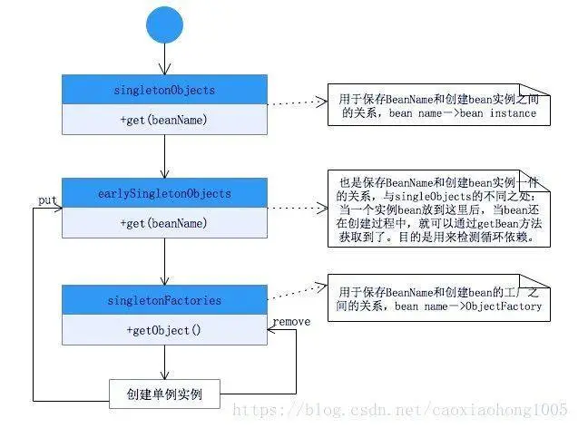
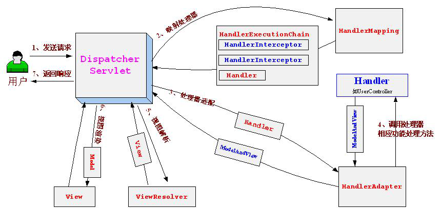

## Spring 的四大模块及典型的设计模式

Spring MVC  委派模式、适配器模式、责任链模式

Spring IOC   [简单]工厂模式、单例模式、装饰器模式

Spring AOP  代理模式、观察者模式

Spring JDBC 模板方法模式

迭代器模式在每个模块都有

### [简单工厂模式](https://www.zhihu.com/question/20367734/answer/115807228)

**实现**

Spring中的BeanFactory就是简单工厂模式的体现，根据传入一个唯一的标识来获得Bean对象，但是否是在传入参数后创建还是传入参数前创建这个要根据具体情况来定。

**设计意义**

- 松耦合

  可以将原来硬编码的依赖转变为Spring这个beanFactory这个工厂来注入依赖

- bean的额外处理。

  通过Spring接口的暴露，在实例化bean的阶段我们可以进行一些额外的处理，这些额外的处理只需要让bean实现对应的接口即可，那么spring就会在bean的生命周期调用我们实现的接口来处理该bean

### 工厂模式

**实现**

FactoryBean接口

```
实现了FactoryBean接口的bean是一类叫做factory的bean。Spring会在使用getBean()调用获得该bean时，自动调用该bean的getObject()方法，所以返回的不是factory这个bean，而是这个bean.getOjbect()方法的返回值。
```

**设计意义**

Spring生产Bean对象一般都是从配置文件中读取,过程比较固定.若要实现定制化生产Bean对象,可实现FactoryBean接口的getObject()方法.

*如今@Bean可实现定制化生产Bean对象*

### 单例模式

**实现**

Spring依赖注入Bean实例默认是单例的。

Spring的依赖注入（包括lazy-init方式）都是发生在AbstractBeanFactory的getBean(beanName)里。


- spring依赖注入时，使用了 **双重判断加锁** 的单例模式

```java
public Object getSingleton(String beanName){
    //参数true设置标识允许早期依赖
    return getSingleton(beanName,true);
}
protected Object getSingleton(String beanName, boolean allowEarlyReference) {
    //检查缓存中是否存在实例
    Object singletonObject = this.singletonObjects.get(beanName);
    if (singletonObject == null && isSingletonCurrentlyInCreation(beanName)) {
        //如果为空，则锁定全局变量并进行处理。
        synchronized (this.singletonObjects) {
            //如果此bean正在加载，则不处理
            singletonObject = this.earlySingletonObjects.get(beanName);
            if (singletonObject == null && allowEarlyReference) {
                //当某些方法需要提前初始化的时候则会调用addSingleFactory 方法将对应的ObjectFactory初始化策略存储在singletonFactories
                ObjectFactory<?> singletonFactory = this.singletonFactories.get(beanName);
                if (singletonFactory != null) {
                    //调用预先设定的getObject方法
                    singletonObject = singletonFactory.getObject();
                    //记录在缓存中，earlysingletonObjects和singletonFactories互斥
                    this.earlySingletonObjects.put(beanName, singletonObject);
                    this.singletonFactories.remove(beanName);
                }
            }
        }
    }
    return (singletonObject != NULL_OBJECT ? singletonObject : null);
}
```

- getSingleton()方法



**设计意义**

单例模式定义： 保证一个类仅有一个实例，并提供一个访问它的全局访问点

Spring中的单例模式完成了后半句话，即提供了全局的访问点BeanFactory。但没有从构造器级别去控制单例，这是因为spring管理的是任意的java对象。

### 适配器模式

SpringMVC通过HandlerMapping获取到可以处理的handler，这些handler的类型各不相同，对请求的预处理，参数获取都不相同.

针对不同的handler进行处理

- 最简单的做法是根据不同的handler类型，做一个分支处理，不同的handler编写不同的代码。

  ```
  分支判断复杂，代码庞大，不符合单一职责原则
  ```

- 不直接对handler进行处理，而是将handler交给适配器HandlerAdapter去处理，这样DispatcherServlet交互的类就只剩下一个接口HandlerAdapter

**实现**

```sequence
DispatcherServlet->HandlerAdaptor:handle(request,response,handler)
HandlerAdaptor->Handler:handle()
Note right of Handler:返回modelAndView
Handler->HandlerAdaptor:modelAndView
HandlerAdaptor->DispatcherServlet:modelAndView
```


1. DispatcherServlet根据HandlerMapping返回的handler，向HandlerAdatper发起请求，处理Handler。

2. HandlerAdapter根据规则找到对应的Handler并让其执行，执行完毕后Handler会向HandlerAdapter返回一个ModelAndView，最后由HandlerAdapter向DispatchServelet返回一个ModelAndView。

**设计意义**

HandlerAdatper使得Handler的扩展变得容易，只需要增加一个新的Handler和一个对应的HandlerAdapter即可。

### 装饰器模式

**实现**

BeanWrapper

**设计意义**

动态地给一个对象添加一些额外的职责。

### 代理模式

**实现**

AOP底层，就是动态代理模式的实现。

- JDK动态代理
- CGLIB

切面在应用运行的时刻被织入。一般情况下，在织入切面时，AOP容器会为目标对象创建动态的创建一个代理对象。SpringAOP就是以这种方式织入切面的。

### 观察者模式

**实现**

spring的事件驱动模型使用的是 观察者模式 ，Spring中Observer模式常用的地方是listener的实现。

事件机制的实现需要三个部分,事件发布者,事件,事件监听器

1. ApplicationEvent抽象类`[事件]`

   - 继承自jdk的EventObject,所有的事件都需要继承ApplicationEvent,并且通过构造器参数source得到事件源.

   - 该类的实现类ApplicationContextEvent表示ApplicaitonContext的容器事件.

2. ApplicationListener接口`[事件监听器]`

   - 继承自jdk的EventListener,所有的监听器都要实现这个接口。

   - 接口只有一个onApplicationEvent()方法,该方法接受ApplicationEvent或其子类对象作为参数,在方法体中,可通过不同对Event类的判断来进行相应的处理。

3. ApplicationContext接口`[事件发布者]`

   - ApplicationContext是spring中的全局容器，实现了ApplicationEventPublisher接口。

   - ApplicationContext负责读取bean的配置文档,管理bean的加载,维护bean之间的依赖关系,可以说是负责bean的整个生命周期

### 策略模式

**实现**

Spring框架的资源访问Resource接口。该接口提供了更强的资源访问能力，Spring 框架本身大量使用了 Resource 接口来访问底层资源。

Resource 接口主要提供了如下几个方法:

```json
getInputStream()： 定位并打开资源，返回资源对应的输入流。每次调用都返回新的输入流。调用者必须负责关闭输入流。
exists()： 返回 Resource 所指向的资源是否存在。
isOpen()： 返回资源文件是否打开，如果资源文件不能多次读取，每次读取结束应该显式关闭，以防止资源泄漏。
getDescription()： 返回资源的描述信息，通常用于资源处理出错时输出该信息，通常是全限定文件名或实际 URL。
getFile()： 返回资源对应的 File 对象。
getURL()： 返回资源对应的 URL 对象。
```

Spring 为 Resource 接口提供了如下实现类：

```
UrlResource： 访问网络资源的实现类。
ClassPathResource： 访问类加载路径里资源的实现类。
FileSystemResource： 访问文件系统里资源的实现类。
ServletContextResource： 访问相对于 ServletContext 路径里的资源的实现类.
InputStreamResource： 访问输入流资源的实现类。
ByteArrayResource： 访问字节数组资源的实现类。
```

**设计意义**

Resource 实现类，针对不同的的底层资源，提供了相应的资源访问逻辑，并提供便捷的包装，以利于客户端程序的资源访问

### 模板方法模式

模板模式与策略模式相似,都是提供不同的实现,但存在以下差别

- 策略模式是对同一方法在不同场景有不同实现
- 模板模式是规范化了一个流程模板,而其中部分流程节点可根据不同场景使用不同实现

**实现**

所以父类模板方法中有两类方法：

- 共同的方法： 所有子类都会用到的代码

- 不同的方法： 子类要覆盖的方法，分为两种：
  - 抽象方法：父类中的是抽象方法，子类必须覆盖
  - 钩子方法：父类中是一个空方法，子类继承了默认也是空的(<font color='cornflowerblue'>回调模式</font>)

注：为什么叫钩子，子类可以通过这个钩子（方法）操作父类，因为这个钩子实际是父类的方法（空方法）！

Spring模板方法模式实质：

```
模板方法模式和回调模式的结合，是Template Method不需要继承的另一种实现方式。Spring几乎所有的外接扩展都采用这种模式。
```

采用模板方法模式是为了以一种统一而集中的方式来处理资源的获取和释放，以JdbcTempalte为例:

```java
public abstract class JdbcTemplate {
     public final Object execute（String sql）{
        Connection con=null;
        Statement stmt=null;
        try{
            con=getConnection（）;
            stmt=con.createStatement（）;
            Object retValue=executeWithStatement（stmt,sql）;
            return retValue;
        }catch（SQLException e）{
             ...
        }finally{
            closeStatement（stmt）;
            releaseConnection（con）;
        }
    }
    protected abstract Object executeWithStatement（Statement   stmt, String sql）;
}
```

<font color='red'>引入回调而不是继承原因：</font>

```
JdbcTemplate已有的稳定的、公用的数据库连接等模板方法,规范了流程模板
若每次进行数据访问的时候都要给出一个相应的子类实现去执行sql语句,这很不方便，所以就引入了回调。
```

回调代码

```java
public interface StatementCallback{
    Object doWithStatement（Statement stmt）;
}
```

利用回调方法重写JdbcTemplate方法

```java
public class JdbcTemplate {
    public final Object execute（StatementCallback callback）{
        Connection con=null;
        Statement stmt=null;
        try{
            con=getConnection（）;
            stmt=con.createStatement（）;
            Object retValue=callback.doWithStatement（stmt）;
            return retValue;
        }catch（SQLException e）{
            ...
        }finally{
            closeStatement（stmt）;
            releaseConnection（con）;
        }
    }

    ...//其它方法定义
}
```

Jdbc使用方法如下：

```java
JdbcTemplate jdbcTemplate=...;
    final String sql=...;
    StatementCallback callback=new StatementCallback(){
    public Object=doWithStatement(Statement stmt){
        return ...;
    }
}
jdbcTemplate.execute(callback);
```

### [委派模式](https://blog.csdn.net/sinat_34341162/article/details/84111857)

**实现**

DispatcherServlet将请求处理的各个流程委派给HandlerMapping,Handler,ModelAndView,ViewResolver以及View



**设计意义**

符合设计原则中的**单一职责原则**

### 责任链模式

**实现**

handlerExecutionChain使用interceptors包裹handler,若某个intercetors的条件不被满足,则中断责任链.

**设计意义**

增强给对象指派职责的灵活性，允许动态地新增或者删除interceptor