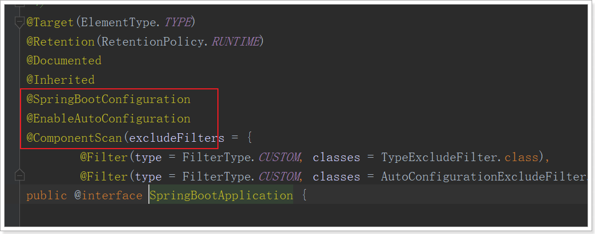
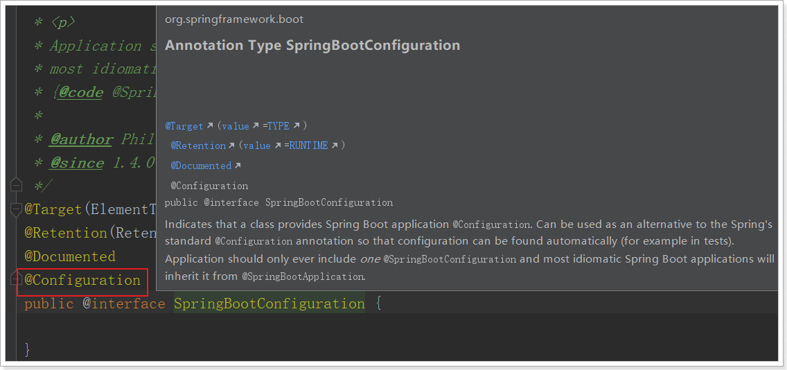
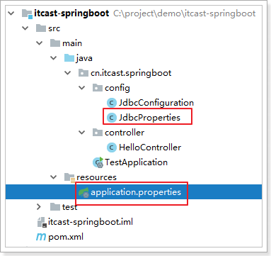

## @SpringBootApplication



### @EnableAutoConfiguration

开启spring应用程序的自动配置，SpringBoot基于你所添加的依赖和你自己定义的bean，试图去猜测并配置你想要的配置。比如我们引入了`spring-boot-starter-web`，而这个启动器中帮我们添加了`tomcat`、`SpringMVC`的依赖。此时自动配置就知道你是要开发一个web应用，所以就帮你完成了web及SpringMVC的默认配置了！

###  @ComponentScan

相当于`<context:component-scan />`

通过basePackageClasses或者basePackages属性来指定要扫描的包。如果没有指定这些属性，那么将从声明这个注解的类所在的包开始，扫描包及子包

### @SpringBootConfiguration



声明当前类是一个配置类，然后Spring会自动扫描到添加了`@Configuration`的类，并且读取其中的配置信息。

而`@SpringBootConfiguration`是来声明当前类是SpringBoot应用的配置类，项目中只能有一个。所以一般我们无需自己添加。


## java配置注解

参考链接：[@Configuration用法](https://www.cnblogs.com/duanxz/p/7493276.html)

- `@Configuration`：声明一个类作为配置类，代替xml文件，相当于\<beans>标签。被注解类对象也会注入容器。
- `@Bean`：声明在方法上，将方法的返回值加入Bean容器，代替`<bean>`标签
- @Import：引入其他配置类，相当于xml中使用 <import/> 标签

```java
@Target({ElementType.TYPE})
@Retention(RetentionPolicy.RUNTIME)
@Documented
@Component
public @interface Configuration {
    @AliasFor(
        annotation = Component.class
    )
    String value() default "";
}
```

### @Configuation加载Spring方法

1. @Configuration配置spring并启动spring容器

   @Configuration标注在类上，相当于把该类作为spring的xml配置文件中的`<beans>`，作用为：配置spring容器(应用上下文)

2. @Configuration启动容器+@Bean注册Bean

   @Bean标注在方法上(返回某个实例的方法)，等价于spring的xml配置文件中的`<bean>`，作用为：注册bean对象

3. @Configuration启动容器+@Component注册Bean

   @ComponentScan等价于<context:component-scan base-package="com.dxz.demo"/>

4. 使用 AnnotationConfigApplicationContext 注册 @Configuration配置类的两种方法

   - 配置类的注册方式是将其传递给 AnnotationConfigApplicationContext 构造函数
   - AnnotationConfigApplicationContext 的register 方法传入配置类来注册配置类

5. 配置Web应用程序(web.xml中配置AnnotationConfigApplicationContext)

   ```java
   <web-app>
       <context-param>
           <param-name>contextConfigLocation</param-name>
           <param-value>/WEB-INF/applicationContext.xml</param-value>
       </context-param>
       ...
   </web-app>
   ```

   

### @Configuation组合多个配置类

## springboot注入注解

### 属性注入

#### @Autowired注入

参考链接：[@Autowired该如何选择](https://www.cnblogs.com/Donnnnnn/p/10405863.html)

@Autowired默认根据bean类型对属性进行注入，也可配合@Qualifier根据bean名称进行属性注入

1. 注解注入

   ```java
   @Controller
   public class FooController {
     @Autowired
     private FooService fooService;
      
     //简单的使用例子，下同
     public List<Foo> listFoo() {
         return fooService.list();
     }
   }
   ```

   优点：

   - 简单明了

   缺点：

   - 循环依赖报错不精确
   - IOC容器以外的环境属性值为null，不调用则不会发现NullPointerException

2. 构造器注入

   ```java
   @Controller
   public class FooController {
      
     private final FooService fooService;
      
     @Autowired
     public FooController(FooService fooService) {
         this.fooService = fooService;
     }
      
     //使用方式上同，略
   }
   
   ```

   优点：

   - 保证注入**组件不可变**，无需setter方法便可注入属性，可不提供修改属性的方法，所以不可变
   - 保证注入**组件不为空**，Spring不会注入null
   - 保证注入的对象处于**已**初始化的状态，保证了组件间依赖关系的顺序
   - 循环依赖报错精确
   - 构造方法注入可为final属性注入值

   缺点：

   - 臃肿

3. setter注入

   ```java
   @Controller
   public class FooController {
      
     private FooService fooService;
      
     //使用方式上同，略
     @Autowired
     public void setFooService(FooService fooService) {
         this.fooService = fooService;
     }
   }
   ```

   优点：

   - 能用让类在之后重新配置或者重新注入，更加灵活

   缺点：

   - 使用了默认setter方法，无法自定义setter方法

   

   **总结：强制依赖使用构造器注入，可选依赖使用 setter 注入。**

   参考链接：[构造器注入与setter注入的区别](cnblogs.com/fanyuyi-boke/p/qiao_duo_shao_nian_dai_ma_neng_ba_shou_zhi_mo_ping24.html)

#### @Resource

默认根据bean名称对属性进行注入

#### @Bean注入

作用于方法上，将方法返回值交给Spring进行管理。

若为有参方法，则会为参数自动注入。

```java
@Configuration
public class AppConfig {
  	// 使用@Bean 注解表明myBean需要交给Spring进行管理
  	// 未指定bean 的名称，默认采用的是 "方法名首字母小写"的配置方式
    @Bean
    public MyBean myBean(anotherBean){
        return new MyBean();
    }
}
public class MyBean {
    AnotherBean ab;
    public MyBean(AnotherBean ab){
        this.ab=ab;
    }
}
```


#### @Value注入

- `@Value`：属性注入 
- `@PropertySource`：指定外部属性文件。

```java
@Configuration
@PropertySource("classpath:jdbc.properties")
public class JdbcConfiguration {

    @Value("${jdbc.url}")
    String url;
    @Value("${jdbc.driverClassName}")
    String driverClassName;
    @Value("${jdbc.username}")
    String username;
    @Value("${jdbc.password}")
    String password;
    
    @Bean
    public DataSource dataSource() {
        DruidDataSource dataSource = new DruidDataSource();
        dataSource.setUrl(url);
        dataSource.setDriverClassName(driverClassName);
        dataSource.setUsername(username);
        dataSource.setPassword(password);
        return dataSource;
    }

}
```


#### @ConfigurationProperties注入

> **@Value注解只能注入基本类型值。**
>
> **@ConfigurationProperties支持各种java基本数据类型及复杂类型的注入**

1）新建`JdbcProperties`，用来进行属性注入：



```java
@ConfigurationProperties(prefix = "jdbc")
public class JdbcProperties {
    private String url;
    private String driverClassName;
    private String username;
    private String password;
    // ... 略
    // getters 和 setters
}
```

- 在类上通过@ConfigurationProperties注解声明当前类为属性读取类

- `prefix="jdbc"`读取属性文件中，前缀为jdbc的值。

- 在类上定义各个属性，名称必须与属性文件中`jdbc.`后面部分一致，并且必须具有getter和setter方法

- 需要注意的是，这里我们并没有指定属性文件的地址，SpringBoot默认会读取文件名为application.properties的资源文件，所以我们**把jdbc.properties名称改为application.properties**

2） 在JdbcConfiguration中使用这个属性：

通过`@EnableConfigurationProperties(JdbcProperties.class)`来声明要使用`JdbcProperties`这个类的对象

可以通过多种方式在JdbcConfiguration类中注入JdbcProperties：

1. @Autowired自动注入

```java
@Configuration
@EnableConfigurationProperties(JdbcProperties.class)
public class JdbcConfiguration {

    @Autowired
    private JdbcProperties jdbcProperties;
    
    @Bean
    public DataSource dataSource() {
        DruidDataSource dataSource = new DruidDataSource();
        dataSource.setUrl(jdbcProperties.getUrl());
        dataSource.setDriverClassName(jdbcProperties.getDriverClassName());
        dataSource.setUsername(jdbcProperties.getUsername());
        dataSource.setPassword(jdbcProperties.getPassword());
        return dataSource;
    }

}
```

2. 构造函数注入

3. @Bean方法参数注入

4. 更优雅的注入

   如果一段属性只有一个Bean需要使用，我们无需将其注入到一个类（JdbcProperties）中。而是直接在需要的地方声明即可：

   ```java
   @Configuration
   public class JdbcConfiguration {
       
       @Bean
       // 声明要注入的属性前缀，SpringBoot会自动把相关属性通过set方法注入到DataSource中
       @ConfigurationProperties(prefix = "jdbc")
       public DataSource dataSource() {
           DruidDataSource dataSource = new DruidDataSource();
           return dataSource;
       }
   }
   ```

   我们直接把`@ConfigurationProperties(prefix = "jdbc")`声明在需要使用的`@Bean`的方法上，然后SpringBoot就会自动调用这个Bean（此处是DataSource）的set方法，然后完成注入。使用的前提是：**该类必须有对应属性的set方法！**

**@ConfigurationProperties相对于@Value的优势**

Relaxed binding：松散绑定

- 不严格要求属性文件中的属性名与成员变量名一致。支持驼峰，中划线，下划线等等转换，甚至支持对象引导。比如：user.friend.name：代表的是user对象中的friend属性中的name属性，显然friend也是对象。@value注解就难以完成这样的注入方式。
- meta-data support：元数据支持，帮助IDE生成属性提示（写开源框架会用到）。

### Bean注入容器


- `@ConditionalOnWebApplication(type = Type.SERVLET)`

  要求项目的类是Type.SERVLET类型，也就是一个普通web工程，被注解类才会注入容器

- `@ConditionalOnClass({ Servlet.class, DispatcherServlet.class, WebMvcConfigurer.class })`

  要求以下类存在：Servlet、DispatcherServlet、WebMvcConfigurer，其中Servlet只要引入了tomcat依赖自然会有，后两个需要引入SpringMVC才会有。这里就是判断你是否引入了相关依赖，引入依赖后该条件成立，被注解类才会注入容器

- `@ConditionalOnMissingBean(WebMvcConfigurationSupport.class)`

  这个条件与上面不同，OnMissingBean，是说环境中没有指定的Bean被注解类才会注入容器。其实这就是自定义配置的入口，也就是说，如果我们自己配置了一个WebMVCConfigurationSupport的类，那么这个默认配置就会失效！

## 与测试相关的注解

@RunWith(SpringRunner.class)
@SpringBootTest(classes = HttpDemoApplication.class)

### 条件注解

#### [@Conditional条件注入](https://blog.csdn.net/xcy1193068639/article/details/81491071)

```java
//此注解可以标注在类和方法上
@Target({ElementType.TYPE, ElementType.METHOD})
@Retention(RetentionPolicy.RUNTIME) 
@Documented
public @interface Conditional {
    Class<? extends Condition>[] value();
}
```

@Conditional可添加多个实现Condition接口的类，若matches返回true则注入对象。多个类之间是与关系。

```java
public interface Condition {
    boolean matches(ConditionContext var1, AnnotatedTypeMetadata var2);
}
```

#### [其他条件注解](https://www.cnblogs.com/qdhxhz/p/11027546.html)

**@ConditionalOnBean**         

当给定的在bean存在时,则实例化当前Bean
**@ConditionalOnMissingBean**  

当给定的在bean不存在时,则实例化当前Bean
**@ConditionalOnClass**

当给定的类名在类路径上存在，则实例化当前Bean
**@ConditionalOnMissingClass** 

当给定的类名在类路径上不存在，则实例化当前Bean

**[@ConditionOnProperty](https://blog.csdn.net/gottst0113/article/details/80978966)**

通过配置文件中的属性值来判定Configuration类是否生效

## 数据库相关注解

@Table声明此对象映射到数据库的数据表，通过它可以为实体指定表(table)

### [DataSourceAutoConfiguration自动配置类](https://blog.csdn.net/kangsa998/article/details/90231518)

**源码**

```java
@Configuration
@ConditionalOnClass({ DataSource.class, EmbeddedDatabaseType.class })
//2.1 从配置文件中映射 DataSource 的值
@EnableConfigurationProperties(DataSourceProperties.class)
//2.4/2.5
@Import({ DataSourcePoolMetadataProvidersConfiguration.class,
      DataSourceInitializationConfiguration.class })
public class DataSourceAutoConfiguration {

   //2.2 
   @Configuration
   //判断是否引入 内置数据库：H2，DERBY，HSQL
   @Conditional(EmbeddedDatabaseCondition.class)
   //如果这是没有DataSource/XADataSource 对应的 BeanDefinition，就通过导入 EmbeddedDataSourceConfiguration.class 来，配置内置数据库对应的数据源！！
   @ConditionalOnMissingBean({ DataSource.class, XADataSource.class })
   @Import(EmbeddedDataSourceConfiguration.class)
   protected static class EmbeddedDatabaseConfiguration {}

   //2.3 
   @Configuration
   //判断是否引入依赖的数据源：HikariDataSource、tomcat.jdbc.pool.DataSource、BasicDataSource
   @Conditional(PooledDataSourceCondition.class)
   //如果这是没有DataSource/XADataSource 对应的 BeanDefinition，就通过以下属性的配置文件，配置数据源！！
   //配置数据源的时候，如果没有指定一些数据库的参数，就会报错哦
   @ConditionalOnMissingBean({ DataSource.class, XADataSource.class })
   @Import({ DataSourceConfiguration.Hikari.class, DataSourceConfiguration.Tomcat.class,
         DataSourceConfiguration.Dbcp2.class, DataSourceConfiguration.Generic.class,
         DataSourceJmxConfiguration.class })
   protected static class PooledDataSourceConfiguration {}
   
   //详细说明见 2.3
   static class PooledDataSourceCondition extends AnyNestedCondition {}
   //详细说明见 2.2
   static class EmbeddedDatabaseCondition extends SpringBootCondition {}
}

```

1. 只有classpath中存在DataSource.class, EmbeddedDatabaseType.class时，DataSourceAutoConfiguration才会生效
2. 从配置文件中映射了数据源配置。
3. 只有不存在DataSource, XADataSource对象时，DataSourceAutoConfiguration才会生效
4. 默认的数据源只有H2, HSQL和Derby，其余数据源需要使用@ConfigurationProperties()自定以配置

### 

## 与请求相关的注解

### @RequestMapping路径映射 

限制映射URL，可在URL中使用占位符获取路径值

> **@GetMapping** 
>
> 等价于@RequestMapping(method = RequestMethod.Get )
>
> **@PostMapping**
>
> 等价于@RequestMapping(method = RequestMethod.Post )

#### @PathVariable 

可以将URL中占位符参数{xxx}绑定到处理器类的方法形参

```java
@RequestMapping("user/{id}")
public User queryById(@PathVariable("id") Long id) {
    return this.userService.queryById(id);
}
请求路径：user/1
方法形参：id=1
```

### Controller方法参数赋值

#### @RequestParam

作用域：Controller方法参数

作用：将**GET**请求参数绑定到你控制器的方法参数上

```java
@RequestMapping("user")
public User queryById(@RequestParam("id") Long id) {
    return this.userService.queryById(id);
}
请求路径：user?id=1
方法形参：id=1
```

#### @RequestBody

作用域：Controller方法参数

作用：将**POST**请求体参数绑定到控制器的方法参数上，要求参数格式**Content-Type：application/json**

[**结论**]: https://blog.csdn.net/justry_deng/article/details/80972817

1. **@JsonAlias**注解，实现:json转模型时，使json中的特定key能转化为特定的模型属性;但是模型转json时，
           对应的转换后的key仍然与属性名一致，见：上图示例中的name字段的请求与响应。
           以下图进一步说明：


​         此时，json字符串转换为模型时，json中key为Name或为name123或为name的都能识别。

2. **@JsonProperty**注解，实现：json转模型时，使json中的特定key能转化为指定的模型属性；同样的，模
           型转json时，对应的转换后的key为指定的key，见：示例中的motto字段的请求与响应。
           以下图进一步说明：


​        此时，json字符串转换为模型时，key为MOTTO的能识别，但key为motto的不能识别。

3. @JsonAlias注解需要依赖于setter、getter，而@JsonProperty注解不需要。

4. 在不考虑上述两个注解的一般情况下，key与属性匹配时,默认大小写敏感。

5. 有多个相同的key的json字符串中，转换为模型时，会以相同的几个key中，排在最后的那个key的值给模型属性赋值，因为setter会覆盖原来的值。

6. 后端@RequestBody注解对应的类在将HTTP的输入流(含请求体)装配到目标类(即:@RequestBody后面的类)时，会根据json字符串中的key来匹配对应实体类的属性，如果匹配一致且json中的该key对应的值符合(或可转换为)实体类的对应属性的类型要求时，会调用实体类的setter方法将值赋给该属性。

   

   **注意**：@RequestBody和@RequestParam可作用域同一个Controller方法上。

   

   

   

#### @ResponseBody

作用域：类/方法

作用：将controller的方法返回的对象通过适当的转换器转换为指定的格式之后，写入到response对象的body

**注意：**在使用此注解之后不会再走视图处理器

[参考文章]: https://blog.csdn.net/originations/article/details/89492884

## spring cloud注解

### Eureka注解

#### @EnableEurekaServer

一个开关，开启时会激活相关配置，会作为注册中心。

[具体请参考]: https://blog.csdn.net/tp89757/article/details/100877037


#### @EnableEurekaClient

注册服务到Eureka注册中心。


**@EnableDiscoveryClient**与**@EnableEurekaClient**功能相似

注册服务到注册中心。

[实现细节]: https://www.cnblogs.com/lm970585581/p/13066729.html#commentform


**@EnableEurekaClient**与**@EnableDiscoveryClient**的区别

> @EnableEurekaClient只能将服务注册到Eureka注册中心
>
> @EnableDiscoveryClient可将服务注册到包括Eureka的注册中心中，用途更广泛。
>
> [参考内容]: https://www.jianshu.com/p/f6db3117864f


### Ribbon注解

**@LoadBalanced**

此注解使RestTemplate具有了客户端负载均衡能力

```java
@LoadBalanced
@Bean
public RestTemplate restTemplate(){
    return new RestTemplate();
}
```

### Hystrix注解

**@EnableCircuitBreaker**

作用于启动类，开启断路器功能

```java
@SpringBootApplication
@EnableDiscoveryClient
@EnableCircuitBreaker
//@SpringCloudApplication可代替上述3个注解
public class ItcastServiceConsumerApplication {
	public static void main(String[] args) {
		SpringApplication.run(ItcastServiceConsumerApplication.class, args);
	}
}

```

 **@HystrixCommand(fallbackMethod = "xxx")**

作用于Controller方法上，指定降级后的方法。

```java
    @GetMapping
    @ResponseBody
    @HystrixCommand(fallbackMethod = "queryUserByIdFallBack")
    public String queryUserById(@RequestParam("id") Long id) {
        String user = this.restTemplate.getForObject("http://service-provider/user/" + id, String.class);
        return user;
    }

    public String queryUserByIdFallBack(Long id){
        return "请求繁忙，请稍后再试！";
    }

```

**@DefaultProperties(fallbackMethod = "xxx")**

作用于Controller类，为由@HystrixCommand修饰的Controller方法指定默认的降级方法。

```java
@Controller
@RequestMapping("consumer/user")
@DefaultProperties(defaultFallback = "fallBackMethod") // 指定一个类的全局熔断方法
public class UserController {

    @Autowired
    private RestTemplate restTemplate;

    @GetMapping
    @ResponseBody
    @HystrixCommand // 标记该方法需要熔断
    public String queryUserById(@RequestParam("id") Long id) {
        String user = this.restTemplate.getForObject("http://service-provider/user/" + id, String.class);
        return user;
    }

    /**
     * 熔断方法
     * 返回值要和被熔断的方法的返回值一致
     * 熔断方法不需要参数
     * @return
     */
    public String fallBackMethod(){
        return "请求繁忙，请稍后再试！";
    }
}
```

### Feign注解

**@EnableFeignClients**

作用于启动类，开启Feign客户端

**@FeignClient(value = "itcast-service-provider"，fallback = UserClientFallback.class)**

作用于接口，声明该接口为Feign客户端，Feign会代理该接口并生成实现类。

- value/name：指定FeignClient的名称，如果项目使用了Ribbon，name属性会作为微服务的名称，用于服务发现

- url: url一般用于调试，可以手动指定@FeignClient调用的地址(默认为Feign客户端的地址)
- decode404:当发生http 404错误时，如果该字段位true，会调用decoder进行解码，否则抛出FeignException
- configuration: Feign配置类，可以自定义Feign的Encoder、Decoder、LogLevel、Contract
- fallback: 定义容错的处理类，当调用远程接口失败或超时时，会调用对应接口的容错逻辑，fallback指定的类必须实现@FeignClient标记的接口，并且由@Components修饰
- fallbackFactory: 工厂类，用于生成fallback类示例，通过这个属性我们可以实现每个接口通用的容错逻辑，减少重复的代码
- path: 定义当前FeignClient的统一前缀

```java
@FeignClient(value = "service-provider", fallback = UserClientFallback.class) // 标注该类是一个feign接口
public interface UserClient {

    @GetMapping("user/{id}")
    User queryUserById(@PathVariable("id") Long id);
}
```

**@GetMapping("xxx")**

指定请求路径，与Controller方法的@GetMapping格式相同，但作用相反。

### Zuul

**@EnableZuulProxy **

开启Zuul的网关功能


## Springboot 异常处理

#### @ControllerAdvice 

[参考内容]: https://www.cnblogs.com/lenve/p/10748453.html


#### @ExceptionHandler