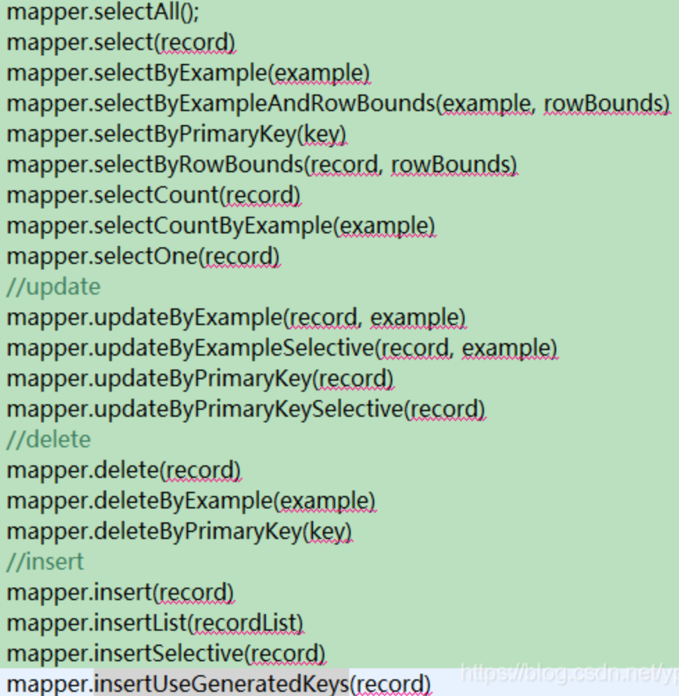

1. springboot启动时都完成了哪些事情

2. springboot中@value与@bean何时注入

3. http客户端特点
   - HttpClient
   - OkHttp
   - JDK原生的URLConnection（默认的）

4. rpc与http区别

5. devops思想

6. eureka的实现原理

7. defaultZone作用

8. rest api 无状态接口，restful编码风格

9. <dependencyManagement>作用

10. hystrix的状态转换条件

11. maven的生命周期命令

12. 代理与反向代理

13. nginx作用及原理

14. nginx必须要在无中文路径下，使用管理员启动的cmd运行，并保证配置文件不处于编辑状态

15. powershell与cmd区别

16. 跨域问题

17. ResponseEntity<List<Category>>

18. mapper<T>通用方法及特殊配置

    mapper默认的delete方法返回值意义

19. Spring Boot java.lang.NoClassDefFoundError: javax/servlet/Filter

    只要在pom文件中把provided注释掉，然后再reimport即可

        <dependency>
            <groupId>org.springframework.boot</groupId>
            <artifactId>spring-boot-starter-tomcat</artifactId>
            <!--<scope>provided</scope>-->
        </dependency>

20. 内部类

21. fastfdfs中images如何读取

22. 热部署与冷部署区别，以及常见的热部署方式live-server，webpack-dev-server

23. springboot启动能正常访问，但junit test报错不能实例化datasource

```
org.springframework.beans.factory.BeanCreationException: Error creating bean with name 'scopedTarget.dataSource' defined in class path resource [org/springframework/boot/autoconfigure/jdbc/DataSourceConfiguration$Hikari.class]: Bean instantiation via factory method failed; nested exception is org.springframework.beans.BeanInstantiationException: Failed to instantiate [com.zaxxer.hikari.HikariDataSource]: Factory method 'dataSource' threw exception; nested exception is org.springframework.boot.autoconfigure.jdbc.DataSourceProperties$DataSourceBeanCreationException: Failed to determine a suitable driver class
```

@EnableAutoConfiguration作用

```
Spring Boot会自动根据你jar包的依赖自动配置项目。当项目下面有HSQLDB的依赖时，Spring Boot会创建默认的内存数据库的数据源DataSource，如果你自己创建了DataSource，Spring Boot就不会创建默认的DataSource。
```

但为何生产环境不会报错，而单元测试不使用exclude={DataSourceAutoConfiguration.class}就会报错。

```
leyou-item中有自定义datasource的配置，而leyou-search中没有。使用leyou-search单元测试时，需要使用使用exclude={DataSourceAutoConfiguration.class}避免使用内置数据源。而leyou-item运行时，由于有自定义数据源不会使用内置数据源，所以不需要使用exclude={DataSourceAutoConfiguration.class}。
```

24. [eureka 单元测试 Error creating bean with name 'eurekaAutoServiceRegistration': Singleton bean...](https://blog.csdn.net/qq_35275233/article/details/89919384)

[根本原因](https://blog.csdn.net/yudianxiaoxiao/article/details/93674293)

> 当关闭ApplicationContext时，它会销毁所有单例bean，首先销毁eurekaAutoServiceRegistration，然后是feignContext。当破坏feignContext时，它将关闭与每个FeignClient关联的ApplicationContext。由于eurekaAutoServiceRegistration侦听ContextClosedEvent，因此这些事件将被发送到该bean。不幸的是因为它已被破坏，所以我们得到了上述异常（尝试在破坏中创建bean）。
> 

在单元测试类中加入以下代码

```java
@MockBean
private EurekaAutoServiceRegistration eurekaAutoServiceRegistration;
```

25.[feign.FeignException: status 404 reading](https://www.cnblogs.com/wqkeep/p/12579234.html)

问题原因：SpringMVC和Feign在加载RequestMapping冲突的原因

解决方法：修改SpringMVC的配置让他不映射带有@FeignClient注解的路径

> https://www.cnblogs.com/chenkeyu/p/8511293.html或https://blog.didispace.com/spring-cloud-feignclient-problem/?utm_source=tuicool&utm_medium=referral
>
> WebMvcRegistrationsAdapter已被废弃：https://www.cnblogs.com/niaomingjian/p/7753804.html

# Mybatis

### 通用[Mapper](https://blog.csdn.net/ypp91zr/article/details/89006493)

#### 环境说明

**表结构**

```sql
CREATE TABLE `tb_brand` (
  `id` bigint(20) NOT NULL AUTO_INCREMENT COMMENT '品牌id',
  `name` varchar(32) NOT NULL COMMENT '品牌名称',
  `image` varchar(128) DEFAULT '' COMMENT '品牌图片地址',
  `letter` char(1) DEFAULT '' COMMENT '品牌的首字母',
  PRIMARY KEY (`id`)
) ENGINE=InnoDB AUTO_INCREMENT=325405 DEFAULT CHARSET=utf8 COMMENT='品牌表';
```

**POJO类**

```java
@Table(name = "tb_brand")
@Data // getter、setter，需安装lombok插件
@AllArgsConstructor // 全参构造方法
@NoArgsConstructor // 无参构造方法
@Accessors(chain = true) // 链式编程写法
public class Brand {
    @Id//匹配数据库主键
    @GeneratedValue(strategy = GenerationType.IDENTITY)//让通用mapper在执行insert操作之后将自动生成的主键值回写到当前实体对象对应的属性当中
    private Long id;
    @Column("name")//若表字段与属性不相同则必须指定
    private String name;// 品牌名称
    private String image;// 品牌图片
    private Character letter;//品牌首字母
}
```

#### [Mapper源码](https://blog.nowcoder.net/n/4a1d4eeb0f73437a9255d4808a414c87)

```java
public interface BrandMapper extends Mapper<Brand> {}
```

BrandMapper接口需要继承Mapper\<Brand>,并且需要在启动类中使用**@MapperScan**指定Mapper接口所在的包路径。

[@MapperScan的实现](https://blog.csdn.net/smile_from_2015/article/details/102790033)

```java
@RegisterMapper
public interface Mapper<T> extends BaseMapper<T>, ExampleMapper<T>, RowBoundsMapper<T>, Marker {
}
```

****

**@RegisterMapper**

通用 Mapper 3.x 版本的时候是必须配置 mapper.mappers 属性的，从 4.x 开始增加了 @RegisterMapper 注解，该注解用于所有通用方法接口上，也用于所有作为基类的接口。该注解有以下主要作用。

> 1. 初始化扫描 Mapper 时，如果发现了接口的 super interface 中（递归）存在带有 @RegisterMapper 注解，就会认为当前 Mapper 继承了通用方法，就会对该 Mapper 进行特殊处理。通用 Mapper 提供的所有通用接口都带有该注解。
> 2. 如果你实现了自己的基类接口例如 MyMapper，你可以给这个接口添加 @RegisterMapper 注解，添加后所有继承 MyMapper 的接口都会被自动处理，不需要配置 mapper.mappers 属性。
> 3. <font color='red'>和 Spring（Boot）集成时，从 basePackages 扫描的时候，如果发现接口上有 @RegisterMapper 注解，就会忽略该接口？？？？？</font>

**BaseMapper\<T>实现基本的增删改查**

```java
@RegisterMapper
public interface BaseMapper<T> extends BaseSelectMapper<T>, BaseInsertMapper<T>, BaseUpdateMapper<T>, BaseDeleteMapper<T> {
}
```

**ExampleMapper\<T>实现<font color='red'>Criterial</font>的增删改查**

通过Java对象，将查询条件进行模块化封装

```java
@RegisterMapper
public interface ExampleMapper<T> extends SelectByExampleMapper<T>, SelectOneByExampleMapper<T>, SelectCountByExampleMapper<T>, DeleteByExampleMapper<T>, UpdateByExampleMapper<T>, UpdateByExampleSelectiveMapper<T> {
}
```

**RowBoundsMapper\<T>实现分页查询**

没有使用LIMIT，而是将所有数据查询出来，在内存中进行分页。
一般不使用此方法进行分页，而是使用PageHelper。

```java
@RegisterMapper
public interface RowBoundsMapper<T> extends SelectByExampleRowBoundsMapper<T>, SelectRowBoundsMapper<T> {
}
```

**Mapper\<T>接口的方法**



**Mapper\<T>接口方法总结**

> selectOne：使用非null的值生成WHERE子句，要求必须返回一个实体类结果，如果有多个，则会抛出异常
>
> xxxByPrimaryKey：需要使用@Id注解明确标记和数据库表主键字段对应的实体类属性，否则会将所有实体类属性作为联合主键
>
> xxxSelective：非主键字段如果为null，则不加入到SQL语句中，效率更高。

**[通用 Mapper 实现原理](https://blog.csdn.net/isea533/article/details/78493852)**

### 通用Mapper进阶使用

#### 自定义增删改查

**自定义sql语句，并指定ResultMap**([注解与xml](https://blog.csdn.net/magi1201/article/details/85342099))

@ResultMap必须搭配@Select/@SelectProvider

```java
	@Select("select * from users")
	@Results(id="userMap", value={
        @Result(id=true,property="userId",column="user_id",javaType=Integer.class),
        @Result(property="userName",column="user_name",javaType=String.class),
        @Result(property="userPwd",column="user_pwd",javaType=String.class),
        @Result(property="userType",column="user_type",javaType=Integer.class)
    })
    public List<User> findAllUser();

    @Select("select * from users where user_id=#{id}")
    @ResultMap("userMap")
    public User findUserById(@Param("id") int id);

    @Insert("insert into users values(null,#{user.userName},#{user.userPwd},#{user.userType})")
    @Options(keyProperty="user.userId",useGeneratedKeys=true)
    public int addUser(@Param("user")User user);
    //注解的方式修改用户资料---多参数传递第二种方式
    @Update("update users set user_name=#{name} where user_id=#{id}")
    public int updateUserNameById(@Param("name")String name,@Param("id")int id);
    //注解的方式删除用户
    @Delete("delete from users where user_id=#{id}")
    public int delById(@Param("id") int id);
```

[**@SelectProvider**](https://blog.csdn.net/qq_36872046/article/details/80291939)

@SelectProvider可生产动态的sql语句

> type指定类，method指定产生sql语句的方法。

**注意**：where 方法会自动拼接")" AND "(",并删除末尾括号。

```java
 @SelectProvider(type=BaseUserProvider.class,method="selectUserById")
 public BaseUser selectById(@Param(value="id")Integer id);
 
 class BaseUserProvider{
	 public String selectUserById(Map<String, Object> para){
        return new SQL(){{
            SELECT("*");
            FROM("base_user");
            WHERE("id="+para.get("id"));
            if(StringUtils.isNotBlank((String)para.get("username"))){
                WHERE("username="+para.get("username"));
            }
        }}.toString();
    }
}
```

#### sql语句参数传递

**el表达式与ognl表达式**

> ${param}:   直接用变量代替sql语句中参数
>
> #{param}：将变量放在sql语句中参数预编译的位置

**参数指定**

> #{变量名}
>
> #{变量索引位置}：0开始

对于模糊查询，使用CONCAT("%",#{param},"%"),而不是%#{param}%

#### [类型处理器：TypeHandler](https://blog.nowcoder.net/n/4a1d4eeb0f73437a9255d4808a414c87)

- 通用Mapper默认情况下只处理简单类型，而对复杂类型不进行映射，相当于对复杂类型添加了`@Transient`注解。
- 复杂类型↔TypeHandler↔数据库表字段。

**@One**

**@Many**

**延迟加载**