# 1.系统架构演变

随着互联网的发展，网站应用的规模不断扩大。需求的激增，带来的是技术上的压力。系统架构也因此不断的演进、升级、迭代。从单一应用，到垂直拆分，到分布式服务，到SOA，以及现在火热的微服务架构，还有在Google带领下来势汹涌的Service Mesh。

## 1.1.集中式架构

当网站流量很小时，只需一个应用，将所有功能都部署在一起，以减少部署节点和成本。此时，用于简化增删改查工作量的数据访问框架(ORM)是影响项目开发的关键。

 

存在的问题：

- 代码耦合，开发维护困难
- 无法针对不同模块进行针对性优化
- 无法水平扩展
- 单点容错率低，并发能力差

## 1.2.垂直拆分

当访问量逐渐增大，单一应用无法满足需求，此时为了应对更高的并发和业务需求，我们根据业务功能对系统进行拆分：

 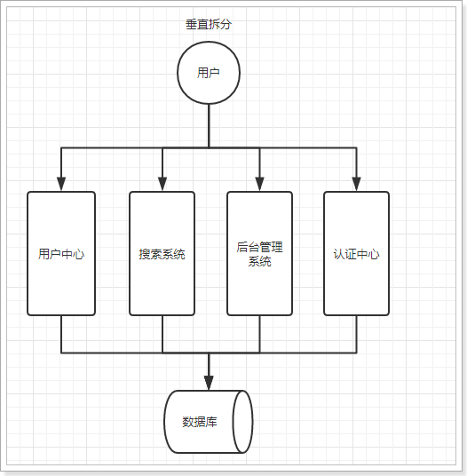

优点：

- 系统拆分实现了流量分担，解决了并发问题
- 可以针对不同模块进行优化
- 方便水平扩展，负载均衡，容错率提高

缺点：

- 系统间相互独立，会有很多重复开发工作，影响开发效率

## 1.3.分布式服务

当垂直应用越来越多，应用之间交互不可避免，将核心业务抽取出来，作为独立的服务，逐渐形成稳定的服务中心，使前端应用能更快速的响应多变的市场需求。此时，用于提高业务复用及整合的分布式调用是关键。

 

优点：

- 将基础服务进行了抽取，系统间相互调用，提高了代码复用和开发效率

缺点：

- 系统间耦合度变高，调用关系错综复杂，难以维护

## 1.4.流动计算架构（Service-Oriented Architecture，SOA）

SOA ：面向服务的架构

当服务越来越多，容量的评估，小服务资源的浪费等问题逐渐显现，此时需增加一个调度中心基于访问压力实时管理集群容量，提高集群利用率。此时，用于提高机器利用率的资源调度和治理中心(SOA)是关键


以前出现了什么问题？

- 服务越来越多，需要管理每个服务的地址
- 调用关系错综复杂，难以理清依赖关系
- 服务过多，服务状态难以管理，无法根据服务情况动态管理

服务治理要做什么？

- 服务注册中心，实现服务自动注册和发现，无需人为记录服务地址
- 服务自动订阅，服务列表自动推送，服务调用透明化，无需关心依赖关系
- 动态监控服务状态监控报告，人为控制服务状态

缺点：

- 服务间会有依赖关系，一旦某个环节出错会影响较大
- 服务关系复杂，运维、测试部署困难，不符合[DevOps思想](https://blog.csdn.net/ycl159357/article/details/108826242)

## 1.5.微服务

前面说的SOA，英文翻译过来是面向服务。微服务，似乎也是服务，都是对系统进行拆分。因此两者非常容易混淆，但其实却有一些差别：

微服务的特点：

- 单一职责：微服务中每一个服务都对应唯一的业务能力，做到单一职责
- 微：微服务的服务拆分粒度很小，例如一个用户管理就可以作为一个服务。每个服务虽小，但“五脏俱全”。
- 面向服务：面向服务是说每个服务都要对外暴露Rest风格服务接口API。并不关心服务的技术实现，做到与平台和语言无关，也不限定用什么技术实现，只要提供Rest的接口即可。
- 自治：自治是说服务间互相独立，互不干扰
  - 团队独立：每个服务都是一个独立的开发团队，人数不能过多。
  - 技术独立：因为是面向服务，提供Rest接口，使用什么技术没有别人干涉
  - 前后端分离：采用前后端分离开发，提供统一Rest接口，后端不用再为PC、移动段开发不同接口
  - 数据库分离：每个服务都使用自己的数据源
  - 部署独立，服务间虽然有调用，但要做到服务重启不影响其它服务。有利于持续集成和持续交付。每个服务都是独立的组件，可复用，可替换，降低耦合，易维护


微服务结构图：


# 2.服务调用方式

## 2.1.RPC和HTTP

无论是微服务还是SOA，都面临着服务间的远程调用。那么服务间的远程调用方式有哪些呢？

常见的远程调用方式有以下2种：

- RPC：Remote Produce Call远程过程调用，类似的还有RMI。**自定义数据格式**，基于原生TCP通信，速度快，效率高。早期的webservice，现在热门的dubbo，都是RPC的典型代表

- Http：http其实是一种网络传输协议，基于TCP，规定了数据传输的格式。现在客户端浏览器与服务端通信基本都是采用Http协议，也可以用来进行远程服务调用。缺点是**消息封装臃肿**，优势是**对服务的提供和调用方没有任何技术限定**，自由灵活，更符合微服务理念。

  现在热门的Rest风格，就可以通过http协议来实现。


如果你们公司全部采用Java技术栈，那么使用Dubbo作为微服务架构是一个不错的选择。

相反，如果公司的技术栈多样化，而且你更青睐Spring家族，那么SpringCloud搭建微服务是不二之选。在我们的项目中，我们会选择SpringCloud套件，因此我们会使用Http方式来实现服务间调用。


## 2.2.Http客户端工具

既然微服务选择了Http，那么我们就需要考虑自己来实现对请求和响应的处理。不过开源世界已经有很多的http客户端工具，能够帮助我们做这些事情，例如：

- [HttpClient](https://blog.csdn.net/justry_deng/article/details/81042379)
- OKHttp
- URLConnection

## 2.3.Spring的RestTemplate

Spring提供了一个RestTemplate模板工具类，对基于Http的客户端进行了封装，并且实现了**对象与json的序列化和反序列化**，非常方便。RestTemplate并没有限定Http的客户端类型，而是进行了抽象，目前常用的3种都有支持：

- HttpClient
- OkHttp
- JDK原生的URLConnection（默认的）

我们导入课前资料提供的demo工程：


首先在项目中注册一个`RestTemplate`对象，可以在启动类位置注册：

```java
@SpringBootApplication
public class HttpDemoApplication {

	public static void main(String[] args) {
		SpringApplication.run(HttpDemoApplication.class, args);
	}

	@Bean
	public RestTemplate restTemplate() {
		return new RestTemplate();
	}
}
```


在测试类中直接`@Autowired`注入：

```java
@RunWith(SpringRunner.class)
@SpringBootTest(classes = HttpDemoApplication.class)
public class HttpDemoApplicationTests {

	@Autowired
	private RestTemplate restTemplate;

	@Test
	public void httpGet() {
        // 调用springboot案例中的rest接口
		User user = this.restTemplate.getForObject("http://localhost/user/1", User.class);
		System.out.println(user);
	}
}
```

- 通过RestTemplate的getForObject()方法，传递url地址及实体类的字节码，RestTemplate会自动发起请求，接收响应，并且帮我们对响应结果进行反序列化。


学习完了Http客户端工具，接下来就可以正式学习微服务了。


# 3.初识SpringCloud

微服务是一种架构方式，最终肯定需要技术架构去实施。

微服务的实现方式很多，但是最火的莫过于Spring Cloud了。

- 后台硬：作为Spring家族的一员，有整个Spring全家桶靠山，背景十分强大。
- 技术强：Spring作为Java领域的前辈，可以说是功力深厚。有强力的技术团队支撑，一般人还真比不了
- 群众基础好：可以说大多数程序员的成长都伴随着Spring框架，试问：现在有几家公司开发不用Spring？SpringCloud与Spring的各个框架无缝整合，对大家来说一切都是熟悉的配方，熟悉的味道。
- 使用方便：相信大家都体会到了SpringBoot给我们开发带来的便利，而SpringCloud完全支持SpringBoot的开发，用很少的配置就能完成微服务框架的搭建


## 3.1.简介

SpringCloud是Spring旗下的项目之一，[官网地址：http://projects.spring.io/spring-cloud/](http://projects.spring.io/spring-cloud/)

<font color='red'>Spring最擅长的就是集成</font>，把世界上最好的框架拿过来，集成到自己的项目中。

SpringCloud也是一样，它将现在非常流行的一些技术整合到一起，实现了诸如：配置管理，服务发现，智能路由，负载均衡，熔断器，控制总线，集群状态等等功能。其主要涉及的组件包括：

- **Eureka**：服务治理组件，包含服务注册中心，服务注册与发现机制的实现。（服务治理，服务注册/发现） 
- **Zuul**：网关组件，提供智能路由，访问过滤功能 
- **Ribbon**：客户端负载均衡的服务调用组件（客户端负载） 
- **Feign**：服务调用，给予Ribbon和Hystrix的声明式服务调用组件 （声明式服务调用） 
- **Hystrix**：容错管理组件，实现断路器模式，帮助服务依赖中出现的延迟和为故障提供强大的容错能力。(熔断、断路器，容错) 

架构图：

 

以上只是其中一部分。


## 3.2.版本

因为Spring Cloud不同其他独立项目，它拥有很多子项目的大项目。所以它的版本是版本名+版本号 （如Angel.SR6）。  

版本名：是伦敦的地铁名  

版本号：SR（Service Releases）是固定的 ,大概意思是稳定版本。后面会有一个递增的数字。 


我们在项目中，会是以Finchley的版本。

其中包含的组件，也都有各自的版本，如下表：

| Component                 | Edgware.SR3    | Finchley.RC1     | Finchley.BUILD-SNAPSHOT |
| ------------------------- | -------------- | ---------------- | ----------------------- |
| spring-cloud-aws          | 1.2.2.RELEASE  | 2.0.0.RC1        | 2.0.0.BUILD-SNAPSHOT    |
| spring-cloud-bus          | 1.3.2.RELEASE  | 2.0.0.RC1        | 2.0.0.BUILD-SNAPSHOT    |
| spring-cloud-cli          | 1.4.1.RELEASE  | 2.0.0.RC1        | 2.0.0.BUILD-SNAPSHOT    |
| spring-cloud-commons      | 1.3.3.RELEASE  | 2.0.0.RC1        | 2.0.0.BUILD-SNAPSHOT    |
| spring-cloud-contract     | 1.2.4.RELEASE  | 2.0.0.RC1        | 2.0.0.BUILD-SNAPSHOT    |
| spring-cloud-config       | 1.4.3.RELEASE  | 2.0.0.RC1        | 2.0.0.BUILD-SNAPSHOT    |
| spring-cloud-netflix      | 1.4.4.RELEASE  | 2.0.0.RC1        | 2.0.0.BUILD-SNAPSHOT    |
| spring-cloud-security     | 1.2.2.RELEASE  | 2.0.0.RC1        | 2.0.0.BUILD-SNAPSHOT    |
| spring-cloud-cloudfoundry | 1.1.1.RELEASE  | 2.0.0.RC1        | 2.0.0.BUILD-SNAPSHOT    |
| spring-cloud-consul       | 1.3.3.RELEASE  | 2.0.0.RC1        | 2.0.0.BUILD-SNAPSHOT    |
| spring-cloud-sleuth       | 1.3.3.RELEASE  | 2.0.0.RC1        | 2.0.0.BUILD-SNAPSHOT    |
| spring-cloud-stream       | Ditmars.SR3    | Elmhurst.RELEASE | Elmhurst.BUILD-SNAPSHOT |
| spring-cloud-zookeeper    | 1.2.1.RELEASE  | 2.0.0.RC1        | 2.0.0.BUILD-SNAPSHOT    |
| spring-boot               | 1.5.10.RELEASE | 2.0.1.RELEASE    | 2.0.0.BUILD-SNAPSHOT    |
| spring-cloud-task         | 1.2.2.RELEASE  | 2.0.0.RC1        | 2.0.0.RELEASE           |
| spring-cloud-vault        | 1.1.0.RELEASE  | 2.0.0.RC1        | 2.0.0.BUILD-SNAPSHOT    |
| spring-cloud-gateway      | 1.0.1.RELEASE  | 2.0.0.RC1        | 2.0.0.BUILD-SNAPSHOT    |
| spring-cloud-openfeign    |                | 2.0.0.RC1        | 2.0.0.BUILD-SNAPSHOT    |

# 4.微服务场景模拟

首先，我们需要模拟一个服务调用的场景，搭建两个工程：itcast-service-provider（服务提供方）和itcast-service-consumer（服务调用方）。方便后面学习微服务架构

服务提供方：使用mybatis操作数据库，实现对数据的增删改查；并对外提供rest接口服务。

服务消费方：使用restTemplate远程调用服务提供方的rest接口服务，获取数据。

## 4.1.服务提供者

我们新建一个项目：itcast-service-provider，对外提供根据id查询用户的服务。

### 4.1.1.Spring脚手架创建工程

借助于Spring提供的快速搭建工具：


next-->填写项目信息：


next -->  添加web依赖：


添加mybatis依赖：


Next -->  填写项目位置：


生成的项目结构，已经包含了引导类（itcastServiceProviderApplication）：

 

依赖也已经全部自动引入：

```xml
<?xml version="1.0" encoding="UTF-8"?>
<project xmlns="http://maven.apache.org/POM/4.0.0" xmlns:xsi="http://www.w3.org/2001/XMLSchema-instance"
         xsi:schemaLocation="http://maven.apache.org/POM/4.0.0 http://maven.apache.org/xsd/maven-4.0.0.xsd">
    <modelVersion>4.0.0</modelVersion>

    <groupId>cn.itcast.service</groupId>
    <artifactId>itcast-service-provider</artifactId>
    <version>0.0.1-SNAPSHOT</version>
    <packaging>jar</packaging>

    <name>itcast-service-provider</name>
    <description>Demo project for Spring Boot</description>

    <parent>
        <groupId>org.springframework.boot</groupId>
        <artifactId>spring-boot-starter-parent</artifactId>
        <version>2.0.6.RELEASE</version>
        <relativePath/> <!-- lookup parent from repository -->
    </parent>

    <properties>
        <project.build.sourceEncoding>UTF-8</project.build.sourceEncoding>
        <project.reporting.outputEncoding>UTF-8</project.reporting.outputEncoding>
        <java.version>1.8</java.version>
    </properties>

    <dependencies>
        <dependency>
            <groupId>org.springframework.boot</groupId>
            <artifactId>spring-boot-starter-jdbc</artifactId>
        </dependency>
        <dependency>
            <groupId>org.springframework.boot</groupId>
            <artifactId>spring-boot-starter-web</artifactId>
        </dependency>
        <dependency>
            <groupId>org.mybatis.spring.boot</groupId>
            <artifactId>mybatis-spring-boot-starter</artifactId>
            <version>1.3.2</version>
        </dependency>

        <dependency>
            <groupId>mysql</groupId>
            <artifactId>mysql-connector-java</artifactId>
            <scope>runtime</scope>
        </dependency>
        <dependency>
            <groupId>org.springframework.boot</groupId>
            <artifactId>spring-boot-starter-test</artifactId>
            <scope>test</scope>
        </dependency>
        <!-- 需要手动引入通用mapper的启动器，spring没有收录该依赖 -->
        <dependency>
            <groupId>tk.mybatis</groupId>
            <artifactId>mapper-spring-boot-starter</artifactId>
            <version>2.0.4</version>
        </dependency>
    </dependencies>

    <build>
        <plugins>
            <plugin>
                <groupId>org.springframework.boot</groupId>
                <artifactId>spring-boot-maven-plugin</artifactId>
            </plugin>
        </plugins>
    </build>

</project>
```

当然，因为要使用通用mapper，所以我们**需要手动加一条依赖**：

```xml
<dependency>
    <groupId>tk.mybatis</groupId>
    <artifactId>mapper-spring-boot-starter</artifactId>
    <version>2.0.4</version>
</dependency>
```

非常快捷啊！


### 4.1.2.编写代码

 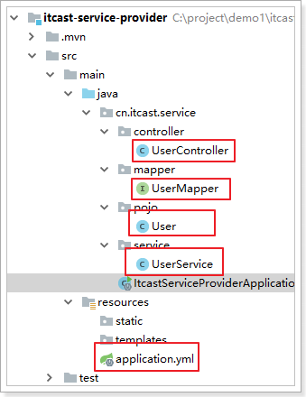

#### 4.1.2.1.配置

属性文件,这里我们采用了yaml语法，而不是properties：

```yaml
server:
  port: 8081
spring:
  datasource:
    url: jdbc:mysql://localhost:3306/mybatis #你学习mybatis时，使用的数据库地址
    username: root
    password: root
mybatis:
  type-aliases-package: cn.itcast.service.pojo
```


#### 4.1.2.2.实体类

```java
@Table(name = "tb_user")
public class User implements Serializable {

    private static final long serialVersionUID = 1L;

    @Id
    @GeneratedValue(strategy = GenerationType.IDENTITY)
    private Long id;

    // 用户名
    private String userName;

    // 密码
    private String password;

    // 姓名
    private String name;

    // 年龄
    private Integer age;

    // 性别，1男性，2女性
    private Integer sex;

    // 出生日期
    private Date birthday;

    // 创建时间
    private Date created;

    // 更新时间
    private Date updated;
	
    //省略set get
}
```


#### 4.1.2.3.UserMapper

```java
@Mapper
public interface UserMapper extends tk.mybatis.mapper.common.Mapper<User>{
}
```


#### 4.1.2.4.UserService

```java
@Service
public class UserService {

    @Autowired
    private UserMapper userMapper;

    public User queryById(Long id) {
        return this.userMapper.selectByPrimaryKey(id);
    }
}
```


#### 4.1.2.5.UserController

添加一个对外查询的接口：

```java
@RestController
@RequestMapping("user")
public class UserController {

    @Autowired
    private UserService userService;

    @GetMapping("{id}")
    public User queryById(@PathVariable("id") Long id) {
        return this.userService.queryById(id);
    }
}
```


### 4.1.3.启动并测试

启动项目，访问接口：http://localhost:8081/user/1

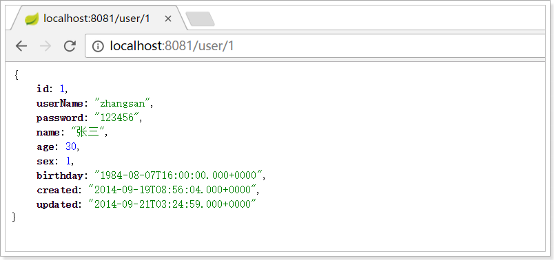


## 4.2.服务调用者

搭建itcast-service-consumer服务消费方工程。

### 4.2.1.创建工程

与上面类似，这里不再赘述，需要注意的是，我们调用itcast-service-provider的解耦获取数据，因此不需要mybatis相关依赖了。


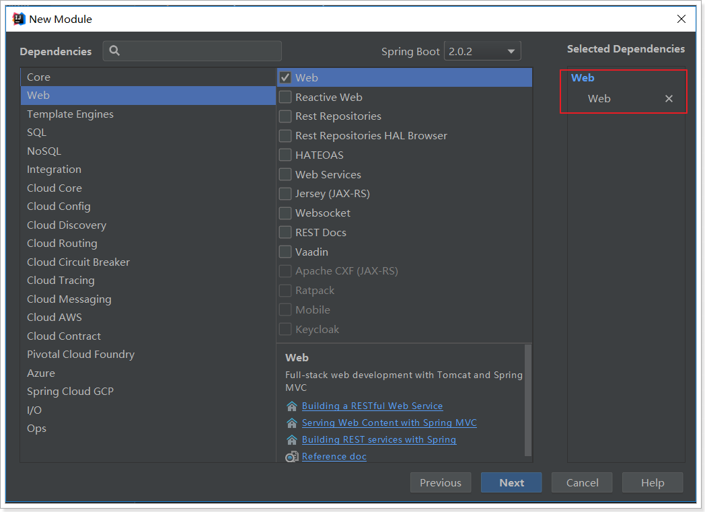


pom：

```xml
<?xml version="1.0" encoding="UTF-8"?>
<project xmlns="http://maven.apache.org/POM/4.0.0" xmlns:xsi="http://www.w3.org/2001/XMLSchema-instance"
         xsi:schemaLocation="http://maven.apache.org/POM/4.0.0 http://maven.apache.org/xsd/maven-4.0.0.xsd">
    <modelVersion>4.0.0</modelVersion>

    <groupId>cn.itcast.service</groupId>
    <artifactId>itcast-service-consumer</artifactId>
    <version>0.0.1-SNAPSHOT</version>
    <packaging>jar</packaging>

    <name>itcast-service-consumer</name>
    <description>Demo project for Spring Boot</description>

    <parent>
        <groupId>org.springframework.boot</groupId>
        <artifactId>spring-boot-starter-parent</artifactId>
        <version>2.0.4.RELEASE</version>
        <relativePath/> <!-- lookup parent from repository -->
    </parent>

    <properties>
        <project.build.sourceEncoding>UTF-8</project.build.sourceEncoding>
        <project.reporting.outputEncoding>UTF-8</project.reporting.outputEncoding>
        <java.version>1.8</java.version>
    </properties>

    <dependencies>
        <dependency>
            <groupId>org.springframework.boot</groupId>
            <artifactId>spring-boot-starter-web</artifactId>
        </dependency>

        <dependency>
            <groupId>org.springframework.boot</groupId>
            <artifactId>spring-boot-starter-test</artifactId>
            <scope>test</scope>
        </dependency>
    </dependencies>

    <build>
        <plugins>
            <plugin>
                <groupId>org.springframework.boot</groupId>
                <artifactId>spring-boot-maven-plugin</artifactId>
            </plugin>
        </plugins>
    </build>


</project>

```


### 4.2.2.编写代码

 

首先在引导类中注册`RestTemplate`：

```java
@SpringBootApplication
public class ItcastServiceConsumerApplication {

    @Bean
    public RestTemplate restTemplate() {
        return new RestTemplate();
    }

    public static void main(String[] args) {
        SpringApplication.run(ItcastServiceConsumerApplication.class, args);
    }
}
```

编写配置（application.yml）：

```
server:
  port: 80
```

编写UserController：

```java
@Controller
@RequestMapping("consumer/user")
public class UserController {

    @Autowired
    private RestTemplate restTemplate;

    @GetMapping
    @ResponseBody
    public User queryUserById(@RequestParam("id") Long id){
        User user = this.restTemplate.getForObject("http://localhost:8081/user/" + id, User.class);
        return user;
    }

}
```

pojo对象（User）：

```java
public class User implements Serializable {

    private static final long serialVersionUID = 1L;

    private Long id;

    // 用户名
    private String userName;

    // 密码
    private String password;

    // 姓名
    private String name;

    // 年龄
    private Integer age;

    // 性别，1男性，2女性
    private Integer sex;

    // 出生日期
    private Date birthday;

    // 创建时间
    private Date created;

    // 更新时间
    private Date updated;

   //省略set get
}
```


### 4.2.3.启动测试

因为我们没有配置端口，那么默认就是8080，我们访问：http://localhost/consumer/user?id=1


## 4.3.有没有问题？

简单回顾一下，刚才我们写了什么：

- itcast-service-provider：一个提供根据id查询用户的微服务。
- itcast-service-consumer：一个服务调用者，通过RestTemplate远程调用itcast-service-provider。

存在什么问题？

- 在consumer中，我们把url地址硬编码到了代码中，不方便后期维护
- consumer需要记忆provider的地址，如果出现变更，可能得不到通知，地址将失效
- consumer不清楚provider的状态，服务宕机也不知道
- provider只有1台服务，不具备高可用性
- 即便provider形成集群，consumer还需自己实现负载均衡

其实上面说的问题，概括一下就是分布式服务必然要面临的问题：

- 服务管理
  - 如何自动注册和发现
  - 如何实现状态监管
  - 如何实现动态路由
- 服务如何实现负载均衡
- 服务如何解决容灾问题
- 服务如何实现统一配置

以上的问题，我们都将在SpringCloud中得到答案。

# 5.Eureka注册中心

## 5.1.认识Eureka

Eureka负责管理、记录服务提供者的信息。服务调用者无需自己寻找服务，Eureka会根据调用者需求提供服务。

服务提供方与Eureka之间通过`“心跳”`机制进行监控，当某个服务提供方出现问题，Eureka会把它从服务列表中剔除。

这就实现了服务的**自动注册、发现、状态监控**。

## 5.2.原理图

> 基本架构：

 


- Eureka：就是服务注册中心（可以是一个集群），对外暴露自己的地址
- 提供者：启动后向Eureka注册自己信息（地址，提供什么服务）
- 消费者：向Eureka订阅服务，Eureka会将对应服务的所有提供者地址列表发送给消费者，并且定期更新
- 心跳(续约)：提供者定期通过http方式向Eureka刷新自己的状态

## 5.3.入门案例

### 5.3.1.搭建EurekaServer

接下来我们创建一个项目，启动一个EurekaServer：

依然使用spring提供的快速搭建工具：


选择依赖：EurekaServer-服务注册中心依赖，Eureka Discovery-服务提供方和服务消费方。因为，对于eureka来说：服务提供方和服务消费方都属于客户端

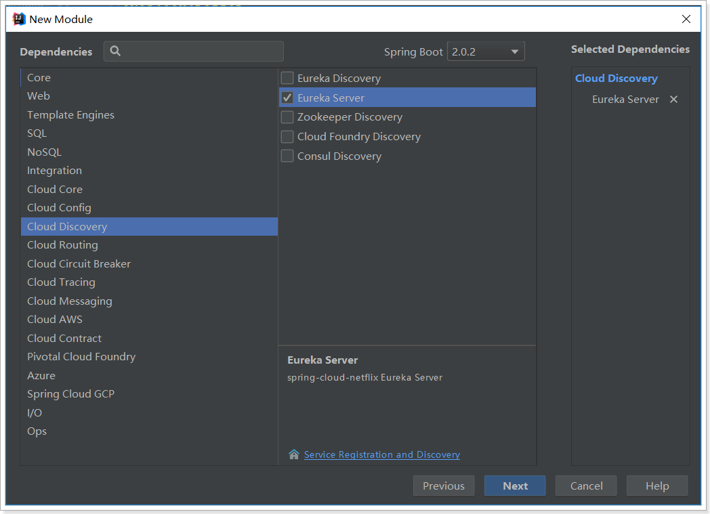


完整的Pom文件：

```xml
<?xml version="1.0" encoding="UTF-8"?>
<project xmlns="http://maven.apache.org/POM/4.0.0" xmlns:xsi="http://www.w3.org/2001/XMLSchema-instance"
         xsi:schemaLocation="http://maven.apache.org/POM/4.0.0 http://maven.apache.org/xsd/maven-4.0.0.xsd">
    <modelVersion>4.0.0</modelVersion>

    <groupId>cn.itcast.eureka</groupId>
    <artifactId>itcast-eureka</artifactId>
    <version>0.0.1-SNAPSHOT</version>
    <packaging>jar</packaging>

    <name>itcast-eureka</name>
    <description>Demo project for Spring Boot</description>

    <parent>
        <groupId>org.springframework.boot</groupId>
        <artifactId>spring-boot-starter-parent</artifactId>
        <version>2.0.6.RELEASE</version>
        <relativePath/> <!-- lookup parent from repository -->
    </parent>

    <properties>
        <project.build.sourceEncoding>UTF-8</project.build.sourceEncoding>
        <project.reporting.outputEncoding>UTF-8</project.reporting.outputEncoding>
        <java.version>1.8</java.version>
        <spring-cloud.version>Finchley.RC2</spring-cloud.version>
    </properties>

    <dependencies>
        <dependency>
            <groupId>org.springframework.cloud</groupId>
            <artifactId>spring-cloud-starter-netflix-eureka-server</artifactId>
        </dependency>

    </dependencies>

    <build>
        <plugins>
            <plugin>
                <groupId>org.springframework.boot</groupId>
                <artifactId>spring-boot-maven-plugin</artifactId>
            </plugin>
        </plugins>
    </build>

</project>
```

编写application.yml配置：

```yaml
server:
  port: 10086 # 端口
spring:
  application:
    name: eureka-server # 应用名称，会在Eureka中显示
eureka:
  client:
    service-url: # EurekaServer的地址，现在是自己的地址，如果是集群，需要加上其它Server的地址。
      defaultZone: http://127.0.0.1:${server.port}/eureka
```

修改引导类，在类上添加@EnableEurekaServer注解：

```java
@SpringBootApplication
@EnableEurekaServer // 声明当前springboot应用是一个eureka服务中心
public class ItcastEurekaApplication {

    public static void main(String[] args) {
        SpringApplication.run(ItcastEurekaApplication.class, args);
    }
}
```

启动服务，并访问：http://127.0.0.1:10086


### 5.3.2.注册到Eureka

注册服务，就是在服务上添加Eureka的客户端依赖，客户端代码会自动把服务注册到EurekaServer中。

修改itcast-service-provider工程

1. 在pom.xml中，添加springcloud的相关依赖。
2. 在application.yml中，添加springcloud的相关依赖。
3. 在引导类上添加注解，把服务注入到eureka注册中心。

具体操作

#### 5.3.2.1.pom.xml

参照itcast-eureka，先添加SpringCloud依赖：

```xml
<!-- SpringCloud的依赖 -->
<dependencyManagement>
    <dependencies>
        <dependency>
            <groupId>org.springframework.cloud</groupId>
            <artifactId>spring-cloud-dependencies</artifactId>
            <version>Finchley.SR2</version>
            <type>pom</type>
            <scope>import</scope>
        </dependency>
    </dependencies>
</dependencyManagement>
```

然后是Eureka客户端：

```xml
<!-- Eureka客户端 -->
<dependency>
    <groupId>org.springframework.cloud</groupId>
    <artifactId>spring-cloud-starter-netflix-eureka-client</artifactId>
</dependency>
```

完整pom.xml:

```xml
<?xml version="1.0" encoding="UTF-8"?>
<project xmlns="http://maven.apache.org/POM/4.0.0" xmlns:xsi="http://www.w3.org/2001/XMLSchema-instance"
         xsi:schemaLocation="http://maven.apache.org/POM/4.0.0 http://maven.apache.org/xsd/maven-4.0.0.xsd">
    <modelVersion>4.0.0</modelVersion>

    <groupId>cn.itcast.service</groupId>
    <artifactId>itcast-service-provider</artifactId>
    <version>0.0.1-SNAPSHOT</version>
    <packaging>jar</packaging>

    <name>itcast-service-provider</name>
    <description>Demo project for Spring Boot</description>

    <parent>
        <groupId>org.springframework.boot</groupId>
        <artifactId>spring-boot-starter-parent</artifactId>
        <version>2.0.6.RELEASE</version>
        <relativePath/> <!-- lookup parent from repository -->
    </parent>

    <properties>
        <project.build.sourceEncoding>UTF-8</project.build.sourceEncoding>
        <project.reporting.outputEncoding>UTF-8</project.reporting.outputEncoding>
        <java.version>1.8</java.version>
    </properties>

    <dependencies>
        <dependency>
            <groupId>org.springframework.boot</groupId>
            <artifactId>spring-boot-starter-jdbc</artifactId>
        </dependency>
        <dependency>
            <groupId>org.springframework.boot</groupId>
            <artifactId>spring-boot-starter-web</artifactId>
        </dependency>
        <dependency>
            <groupId>org.mybatis.spring.boot</groupId>
            <artifactId>mybatis-spring-boot-starter</artifactId>
            <version>1.3.2</version>
        </dependency>

        <dependency>
            <groupId>mysql</groupId>
            <artifactId>mysql-connector-java</artifactId>
            <scope>runtime</scope>
        </dependency>
        <dependency>
            <groupId>org.springframework.boot</groupId>
            <artifactId>spring-boot-starter-test</artifactId>
            <scope>test</scope>
        </dependency>
        <dependency>
            <groupId>tk.mybatis</groupId>
            <artifactId>mapper-spring-boot-starter</artifactId>
            <version>2.0.4</version>
        </dependency>
        <dependency>
            <groupId>org.springframework.cloud</groupId>
            <artifactId>spring-cloud-starter-netflix-eureka-client</artifactId>
        </dependency>
    </dependencies>

    <build>
        <plugins>
            <plugin>
                <groupId>org.springframework.boot</groupId>
                <artifactId>spring-boot-maven-plugin</artifactId>
            </plugin>
        </plugins>
    </build>

    <dependencyManagement>
        <dependencies>
            <dependency>
                <groupId>org.springframework.cloud</groupId>
                <artifactId>spring-cloud-dependencies</artifactId>
                <version>Finchley.SR1</version>
                <type>pom</type>
                <scope>import</scope>
            </dependency>
        </dependencies>
    </dependencyManagement>

</project>
```

#### 5.3.2.2.application.yml

```yaml
server:
  port: 8081
spring:
  datasource:
    url: jdbc:mysql://localhost:3306/heima
    username: root
    password: root
    driverClassName: com.mysql.jdbc.Driver
  application:
    name: service-provider # 应用名称，注册到eureka后的服务名称
mybatis:
  type-aliases-package: cn.itcast.service.pojo
eureka:
  client:
    service-url: # EurekaServer地址
      defaultZone: http://127.0.0.1:10086/eureka
```

注意：

- 这里我们添加了spring.application.name属性来指定应用名称，将来会作为应用的id使用。


#### 5.3.2.3.引导类

在引导类上开启Eureka客户端功能

通过添加`@EnableDiscoveryClient`来开启Eureka客户端功能

```java
@SpringBootApplication
@EnableDiscoveryClient
public class ItcastServiceProviderApplication {

    public static void main(String[] args) {
        SpringApplication.run(ItcastServiceApplication.class, args);
    }
}
```


> 重启项目，访问[Eureka监控页面](http://127.0.0.1:10086)查看


我们发现service-provider服务已经注册成功了


### 5.3.3.从Eureka获取服务

接下来我们修改itcast-service-consumer，尝试从EurekaServer获取服务。

方法与消费者类似，只需要在项目中添加EurekaClient依赖，就可以通过服务名称来获取信息了！

1. pom.xml

```xml
<?xml version="1.0" encoding="UTF-8"?>
<project xmlns="http://maven.apache.org/POM/4.0.0" xmlns:xsi="http://www.w3.org/2001/XMLSchema-instance"
         xsi:schemaLocation="http://maven.apache.org/POM/4.0.0 http://maven.apache.org/xsd/maven-4.0.0.xsd">
    <modelVersion>4.0.0</modelVersion>

    <groupId>cn.itcast.service</groupId>
    <artifactId>itcast-service-consumer</artifactId>
    <version>0.0.1-SNAPSHOT</version>
    <packaging>jar</packaging>

    <name>itcast-service-consumer</name>
    <description>Demo project for Spring Boot</description>

    <parent>
        <groupId>org.springframework.boot</groupId>
        <artifactId>spring-boot-starter-parent</artifactId>
        <version>2.0.6.RELEASE</version>
        <relativePath/> <!-- lookup parent from repository -->
    </parent>

    <properties>
        <project.build.sourceEncoding>UTF-8</project.build.sourceEncoding>
        <project.reporting.outputEncoding>UTF-8</project.reporting.outputEncoding>
        <java.version>1.8</java.version>
    </properties>

    <dependencies>
        <dependency>
            <groupId>org.springframework.boot</groupId>
            <artifactId>spring-boot-starter-web</artifactId>
        </dependency>

        <dependency>
            <groupId>org.springframework.boot</groupId>
            <artifactId>spring-boot-starter-test</artifactId>
            <scope>test</scope>
        </dependency>
        <!-- Eureka客户端 -->
        <dependency>
            <groupId>org.springframework.cloud</groupId>
            <artifactId>spring-cloud-starter-netflix-eureka-client</artifactId>
        </dependency>
    </dependencies>

    <build>
        <plugins>
            <plugin>
                <groupId>org.springframework.boot</groupId>
                <artifactId>spring-boot-maven-plugin</artifactId>
            </plugin>
        </plugins>
    </build>

    <!-- SpringCloud的依赖 -->
    <dependencyManagement>
        <dependencies>
            <dependency>
                <groupId>org.springframework.cloud</groupId>
                <artifactId>spring-cloud-dependencies</artifactId>
                <version>Finchley.SR2</version>
                <type>pom</type>
                <scope>import</scope>
            </dependency>
        </dependencies>
    </dependencyManagement>
</project>

```

2. 修改配置

```yaml
server:
  port: 80
spring:
  application:
    name: service-consumer
eureka:
  client:
    service-url:
      defaultZone: http://localhost:10086/eureka
```


3. 在启动类开启Eureka客户端

```java
@SpringBootApplication
@EnableDiscoveryClient // 开启Eureka客户端
public class ItcastServiceConsumerApplication {

    @Bean
    public RestTemplate restTemplate(){
        return new RestTemplate();
    }

    public static void main(String[] args) {
        SpringApplication.run(ItcastServiceConsumerApplication.class, args);
    }
}
```

4. 修改UserController代码，用DiscoveryClient类的方法，根据服务名称，获取服务实例：

```java
@Controller
@RequestMapping("consumer/user")
public class UserController {

    @Autowired
    private RestTemplate restTemplate;

    @Autowired
    private DiscoveryClient discoveryClient; // eureka客户端，可以获取到eureka中服务的信息

    @GetMapping
    @ResponseBody
    public User queryUserById(@RequestParam("id") Long id){
        // 根据服务名称，获取服务实例。有可能是集群，所以是service实例集合
        List<ServiceInstance> instances = discoveryClient.getInstances("service-provider");
        // 因为只有一个Service-provider。所以获取第一个实例
        ServiceInstance instance = instances.get(0);
        // 获取ip和端口信息，拼接成服务地址
        String baseUrl = "http://" + instance.getHost() + ":" + instance.getPort() + "/user/" + id;
        User user = this.restTemplate.getForObject(baseUrl, User.class);
        return user;
    }

}
```


5）Debug跟踪运行：


生成的URL：


访问结果：


## 5.4.Eureka详解

接下来我们详细讲解Eureka的原理及配置。

### 5.4.1.基础架构

Eureka架构中的三个核心角色：

- **服务注册中心**

  Eureka的服务端应用，提供服务注册和发现功能，就是刚刚我们建立的itcast-eureka。

- **服务提供者**

  提供服务的应用，可以是SpringBoot应用，也可以是其它任意技术实现，只要<font color='red'>对外提供的是Rest风格服务</font>即可。本例中就是我们实现的itcast-service-provider。

- 服务消费者

  消费应用从注册中心获取服务列表，从而得知每个服务方的信息，知道去哪里调用服务方。本例中就是我们实现的itcast-service-consumer。


### 5.4.2.高可用的Eureka Server

Eureka Server即服务的注册中心，在刚才的案例中，我们只有一个EurekaServer，事实上EurekaServer也可以是一个集群，形成高可用的Eureka中心。

> 服务同步

多个Eureka Server之间也会互相注册为服务，当服务提供者注册到Eureka Server集群中的某个节点时，该节点会把服务的信息同步给集群中的每个节点，从而实现**数据同步**。因此，无论客户端访问到Eureka Server集群中的任意一个节点，都可以获取到完整的服务列表信息。


> 动手搭建高可用的EurekaServer

我们假设要运行两个EurekaServer的集群，端口分别为：10086和10087。只需要把itcast-eureka启动两次即可。

1）启动第一个eurekaServer，我们修改原来的EurekaServer配置：

```yaml
server:
  port: 10086 # 端口
spring:
  application:
    name: eureka-server # 应用名称，会在Eureka中显示
eureka:
  client:
    service-url: # 配置其他Eureka服务的地址，而不是自己，比如10087
      defaultZone: http://127.0.0.1:10087/eureka
```

**所谓的高可用注册中心，其实就是把EurekaServer自己也作为一个服务进行注册**，这样多个EurekaServer之间就能互相发现对方，从而形成集群。因此我们做了以下修改：

- 把service-url的值改成了另外一台EurekaServer的地址，而不是自己

启动报错，很正常。因为10087服务没有启动：


2）启动第二个eurekaServer，再次修改itcast-eureka的配置：

```yaml
server:
  port: 10087 # 端口
spring:
  application:
    name: eureka-server # 应用名称，会在Eureka中显示
eureka:
  client:
    service-url: # 配置其他Eureka服务的地址，而不是自己，比如10086
      defaultZone: http://127.0.0.1:10086/eureka
```

注意：idea中一个应用不能启动两次，我们需要重新配置一个启动器：

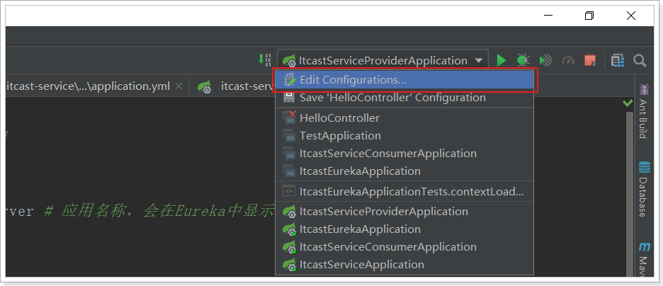


然后启动即可。

3）访问集群，测试：


4）客户端注册服务到集群

因为EurekaServer不止一个，因此注册服务的时候，service-url参数需要变化：

```yaml
eureka:
  client:
    service-url: # EurekaServer地址,多个地址以','隔开
      defaultZone: http://127.0.0.1:10086/eureka,http://127.0.0.1:10087/eureka
```


10086：


10087：


### 5.4.3.服务提供者

服务提供者要向EurekaServer注册服务，并且完成服务续约等工作。

> 服务注册

服务提供者在启动时，会检测配置属性中的：`eureka.client.register-with-eureka=true`参数是否正确，事实上默认就是true。如果值确实为true，则会向EurekaServer发起一个Rest请求，并携带自己的元数据信息，Eureka Server会把这些信息保存到一个**双层Map结构**中。

- 第一层Map的Key就是服务id，一般是配置中的`spring.application.name`属性
- 第二层Map的key是服务的实例id。一般host+ serviceId + port，例如：`locahost:service-provider:8081`
- 值则是服务的实例对象，也就是说一个服务，可以同时启动多个不同实例，形成集群。

> 服务续约

在注册服务完成以后，服务提供者会维持一个心跳（定时向EurekaServer发起Rest请求），告诉EurekaServer：“我还活着”。这个我们称为服务的续约（renew）；

有两个重要参数可以修改服务续约的行为：

```yaml
eureka:
  instance:
    lease-expiration-duration-in-seconds: 90
    lease-renewal-interval-in-seconds: 30
```

- lease-renewal-interval-in-seconds：服务续约(renew)的间隔，默认为30秒
- lease-expiration-duration-in-seconds：服务失效时间，默认值90秒

也就是说，默认情况下每个30秒服务会向注册中心发送一次心跳，证明自己还活着。如果超过90秒没有发送心跳，EurekaServer就会认为该服务宕机，会从服务列表中移除，这两个值在生产环境不要修改，默认即可。

但是在开发时，这个值有点太长了，经常我们关掉一个服务，会发现Eureka依然认为服务在活着。所以我们在开发阶段可以适当调小。

```yaml
eureka:
  instance:
    lease-expiration-duration-in-seconds: 10 # 10秒即过期
    lease-renewal-interval-in-seconds: 5 # 5秒一次心跳
```


### 5.4.4.服务消费者

> 获取服务列表

当服务消费者启动时，会检测`eureka.client.fetch-registry=true`参数的值，如果为true，则会拉取Eureka Server服务的列表只读备份，然后缓存在本地。并且`每隔30秒`会重新获取并更新数据。我们可以通过下面的参数来修改：

```yaml
eureka:
  client:
    registry-fetch-interval-seconds: 30
```

生产环境中，我们不需要修改这个值。

但是为了开发环境下，能够快速得到服务的最新状态，我们可以将其设置小一点。


### 5.4.5.失效剔除和自我保护

> 服务下线

当服务进行正常关闭操作时，它会触发一个服务下线的REST请求给Eureka Server，告诉服务注册中心：“我要下线了”。服务中心接受到请求之后，将该服务置为下线状态。

> 失效剔除

有些时候，我们的服务提供方并不一定会正常下线，可能因为内存溢出、网络故障等原因导致服务无法正常工作。Eureka Server需要将这样的服务剔除出服务列表。因此它会开启一个定时任务，每隔60秒对所有失效的服务（超过90秒未响应）进行剔除。

可以通过`eureka.server.eviction-interval-timer-in-ms`参数对其进行修改，单位是毫秒，生产环境不要修改。

这个会对我们开发带来极大的不变，你对服务重启，隔了60秒Eureka才反应过来。开发阶段可以适当调整，比如：10秒


> 自我保护

我们关停一个服务，就会在Eureka面板看到一条警告：


这是触发了Eureka的自我保护机制。当一个服务未按时进行心跳续约时，Eureka会统计最近15分钟心跳失败的服务实例的比例是否超过了85%。在生产环境下，因为网络延迟等原因，心跳失败实例的比例很有可能超标，但是此时就把服务剔除列表并不妥当，因为服务可能没有宕机。Eureka就会把当前实例的注册信息保护起来，不予剔除。生产环境下这很有效，保证了大多数服务依然可用。

但是这给我们的开发带来了麻烦， 因此开发阶段我们都会关闭自我保护模式：（itcast-eureka）

```yaml
eureka:
  server:
    enable-self-preservation: false # 关闭自我保护模式（缺省为打开）
    eviction-interval-timer-in-ms: 1000 # 扫描失效服务的间隔时间（缺省为60*1000ms）
```


# 6.负载均衡Ribbon

在刚才的案例中，我们启动了一个itcast-service-provider，然后通过DiscoveryClient来获取服务实例信息，然后获取ip和端口来访问。

但是实际环境中，我们往往会开启很多个itcast-service-provider的集群。此时我们获取的服务列表中就会有多个，到底该访问哪一个呢？

一般这种情况下我们就需要编写负载均衡算法，在多个实例列表中进行选择。

不过Eureka中已经帮我们集成了负载均衡组件：Ribbon，简单修改代码即可使用。

**Ribbon**：


## 6.1.启动两个服务实例

首先参照itcast-eureka启动两个ItcastServiceProviderApplication实例，一个8081，一个8082。

 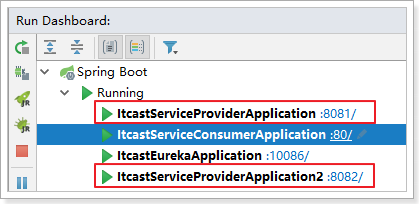

Eureka监控面板：


## 6.2.开启负载均衡

因为Eureka中已经集成了Ribbon，所以我们无需引入新的依赖，直接修改代码。

修改itcast-service-consumer的引导类，<font color='red'>在RestTemplate的配置方法上添加`@LoadBalanced`注解</font>：

```java
@Bean
@LoadBalanced
public RestTemplate restTemplate() {
    return new RestTemplate();
}
```

修改调用方式，不再手动获取ip和端口，而是直接通过服务名称调用：

```java
@Controller
@RequestMapping("consumer/user")
public class UserController {

    @Autowired
    private RestTemplate restTemplate;

    //@Autowired
    //private DiscoveryClient discoveryClient; // 注入discoveryClient，通过该客户端获取服务列表

    @GetMapping
    @ResponseBody
    public User queryUserById(@RequestParam("id") Long id){
        // 通过client获取服务提供方的服务列表，这里我们只有一个
        // ServiceInstance instance = discoveryClient.getInstances("service-provider").get(0);
        String baseUrl = "http://service-provider/user/" + id;
        User user = this.restTemplate.getForObject(baseUrl, User.class);
        return user;
    }

}
```

访问页面，查看结果：


## 6.3.源码跟踪

为什么我们只输入了service名称就可以访问了呢？之前还要获取ip和端口。

显然有人帮我们根据service名称，获取到了服务实例的ip和端口。它就是`LoadBalancerInterceptor`

在如下代码打断点：


一路源码跟踪：RestTemplate.getForObject --> RestTemplate.execute --> RestTemplate.doExecute：


点击进入AbstractClientHttpRequest.execute --> AbstractBufferingClientHttpRequest.executeInternal --> InterceptingClientHttpRequest.executeInternal --> InterceptingClientHttpRequest.execute:


继续跟入：LoadBalancerInterceptor.intercept方法


继续跟入execute方法：发现获取了8082端口的服务


再跟下一次，发现获取的是8081：


**源码流程**

```sequence
RestTemplate->InterceptingClientHttpRequest:getForObject->execute->doExecute
InterceptingClientHttpRequest->LoadBalancerInterceptor:execute->executeInternal->execute
LoadBalancerInterceptor->LoadBalancerClient:interceptor
LoadBalancerClient->LoadBalancerClient:execute
LoadBalancerClient->LoadBalancerInterceptor:clientHttpResponse
LoadBalancerInterceptor->InterceptingClientHttpRequest:response
InterceptingClientHttpRequest->RestTemplate:<T> object
```


## 6.4.负载均衡策略

Ribbon默认的负载均衡策略是简单的轮询，我们可以测试一下：

编写测试类，在刚才的源码中我们看到拦截中是使用RibbonLoadBalanceClient来进行负载均衡的，其中有一个choose方法，找到choose方法的接口方法，是这样介绍的：

 

现在这个就是负载均衡获取实例的方法。

我们注入这个类的对象，然后对其测试：

 

测试内容：

```java
@RunWith(SpringRunner.class)
@SpringBootTest(classes = ItcastServiceConsumerApplication.class)
public class LoadBalanceTest {

    @Autowired
    private RibbonLoadBalancerClient client;

    @Test
    public void testLoadBalance(){
        for (int i = 0; i < 100; i++) {
            ServiceInstance instance = this.client.choose("service-provider");
            System.out.println(instance.getHost() + ":" +instance.getPort());
        }
    }
}

```

结果：


符合了我们的预期推测，确实是轮询方式。


我们是否可以修改负载均衡的策略呢？

继续跟踪源码，发现这么一段代码：

 

我们看看这个rule是谁：

 

这里的rule默认值是一个`RoundRobinRule`，看类的介绍：

 

这不就是轮询的意思嘛。

我们注意到，这个类其实是实现了接口IRule的，查看一下：

 

定义负载均衡的规则接口。

它有以下实现：

 

SpringBoot也帮我们提供了修改负载均衡规则的配置入口，在itcast-service-consumer的application.yml中添加如下配置：

```yaml
server:
  port: 80
spring:
  application:
    name: service-consumer
eureka:
  client:
    service-url:
      defaultZone: http://127.0.0.1:10086/eureka
service-provider:
  ribbon:
    NFLoadBalancerRuleClassName: com.netflix.loadbalancer.RandomRule
```

格式是：`{服务名称}.ribbon.NFLoadBalancerRuleClassName`，值就是IRule的实现类。

再次测试，发现结果变成了随机：


## 6.5.Ribbon自带的负载均衡策略

### [7种默认的负载均衡算法](https://blog.csdn.net/whiteBearClimb/article/details/108703356?utm_medium=distribute.pc_relevant.none-task-blog-2%7Edefault%7EBlogCommendFromMachineLearnPai2%7Edefault-1.base&depth_1-utm_source=distribute.pc_relevant.none-task-blog-2%7Edefault%7EBlogCommendFromMachineLearnPai2%7Edefault-1.base)

1. RoundRobinRule()：轮询算法

2. RandomRule()：随机算法

3. WeightedResponseTimeRule()：响应权重算法

   根据平均响应的时间计算所有服务的权重，响应时间越快服务权重越大被选中的概率越高，刚启动时如果统计信息不足，则使用RoundRobinRule策略，等统计信息足够会切换到WeightedResponseTimeRule

4. RetryRule()：重试算法

   先按照RoundRobinRule的策略获取服务，如果获取失败则在制定时间内进行重试，获取可用的服务。

5. AvailabilityFilteringRule()：可用性过滤算法

   会先过滤由于多次访问故障而处于断路器跳闸状态的服务，还有并发的连接数量超过阈值的服务，然后对剩余的服务列表按照轮询策略进行访问

6. BestAviableRule()：最优可用算法

   会先过滤掉由于多次访问故障而处于断路器跳闸状态的服务，然后选择一个并发量最小的服务

7. ZoneAvoidanceRule()：默认规则，符合判断server所在区域的性能和server的可用性选择服务器

   使用ZoneAvoidancePredicate和AvailabilityPredicate来判断是否选择某个server，前一个判断判定一个zone的运行性能是否可用，剔除不可用的zone（的所有server），AvailabilityPredicate用于过滤掉连接数过多的Server。

## 6.6. 自定义负载均衡策略

参考链接：[自定义负载均衡策略](https://blog.csdn.net/www1056481167/article/details/81151064)

1. 自定义的类不能放在@ComponentScan所扫描的当前包以及子包下，否则我们自定义的这个配置类就会被所有的Ribbon客户端所共享，也就是我们达不到特殊化指定（不同的服务指定不同的负载均衡算法）的目的

2. 自定义类必须继承AbstractLoadBalanceRule类
3. 将自定义类对象注入到bean

4. 在主启动类中添加ribbon注解

# 7.Hystrix

参考链接：[Hystrix机制](https://www.cnblogs.com/lexiaofei/p/7761982.html)

## 7.1.简介

Hystrix,英文意思是豪猪，全身是刺，看起来就不好惹，是一种保护机制。

**Hystix的作用**

Hystix是Netflix开源的一个延迟和容错库，用于隔离访问远程服务、第三方库，防止出现级联失败。

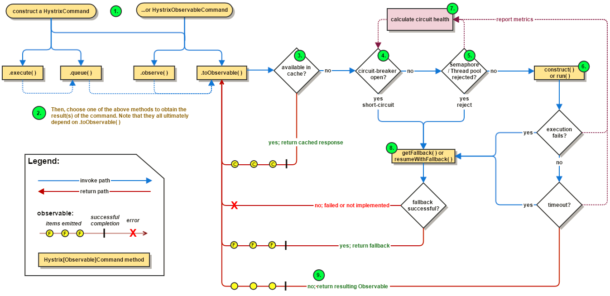

## 7.2.雪崩问题

参考链接：[SpringCloud之Hystrix容错保护原理及配置](https://www.cnblogs.com/jing99/p/11625306.html)

一次业务请求，需要调用A、P、H、I四个服务，这四个服务又可能调用其它服务。如果微服务I发生异常，请求阻塞，用户不会得到响应，则tomcat的这个线程不会释放，于是越来越多的用户请求到来，越来越多的线程会阻塞：

 

Hystix解决雪崩问题的手段有两个：

- 线程隔离
- 服务熔断

## 7.3.线程隔离，服务降级

### 7.3.1.原理

线程隔离示意图：

 

请求处理规则

- Hystrix为每个依赖服务调用分配一个小的线程池，如果线程池已满调用将被立即拒绝，**默认不采用排队.加速失败判定时间**。

- 用户的请求将不再直接访问服务，而是通过线程池中的空闲线程来访问服务，如果**线程池已满**，或者**请求超时**，则会进行降级处理

  > 服务降级：优先保证核心服务，而非核心服务不可用或弱可用。
  >
  > 服务降级虽然会导致请求失败，但是不会导致阻塞，而且仅影响这个依赖服务对应的线程池中的资源，不影响其他服务。

- 用户的请求故障时，不会被阻塞，更不会无休止的等待或者看到系统崩溃，至少可以看到一个执行结果（例如返回友好的提示） 。

触发Hystix服务降级的情况：

- 线程池已满
- 请求超时

### 7.3.2.动手实践

#### 7.3.2.1.引入依赖

首先在itcast-service-consumer的pom.xml中引入Hystrix依赖：

```xml
<dependency>
    <groupId>org.springframework.cloud</groupId>
    <artifactId>spring-cloud-starter-netflix-hystrix</artifactId>
</dependency>
```


#### 7.3.2.2.开启熔断


在微服务中，经常会引入上面的三个注解，于是Spring就提供了一个组合注解：`@SpringCloudApplication`


因此，我们可以使用这个组合注解来代替之前的3个注解。

```java
@SpringCloudApplication
public class ItcastServiceConsumerApplication {

    @Bean
    @LoadBalanced
    public RestTemplate restTemplate(){
        return new RestTemplate();
    }

    public static void main(String[] args) {
        SpringApplication.run(ItcastServiceConsumerApplication.class, args);
    }
}
```

#### 7.3.2.3.编写降级逻辑

我们改造itcast-service-consumer，当目标服务的调用出现故障，我们希望快速失败，给用户一个友好提示。因此需要提前编写好失败时的降级处理逻辑，要使用HystixCommond来完成：

```java
@Controller
@RequestMapping("consumer/user")
public class UserController {

    @Autowired
    private RestTemplate restTemplate;

    @GetMapping
    @ResponseBody
    @HystrixCommand(fallbackMethod = "queryUserByIdFallBack")
    public String queryUserById(@RequestParam("id") Long id) {
        String user = this.restTemplate.getForObject("http://service-provider/user/" + id, String.class);
        return user;
    }

    public String queryUserByIdFallBack(Long id){
        return "请求繁忙，请稍后再试！";
    }
}
```

要注意熔断的降级逻辑方法必须跟正常逻辑方法保证：**相同的参数列表和返回值声明**。

> 失败逻辑中返回User对象没有太大意义，一般会返回友好提示。所以我们把queryById的方法改造为返回String，反正也是Json数据。这样失败逻辑中返回一个错误说明，会比较方便。

说明：

- **@HystrixCommand**(fallbackMethod = "queryByIdFallBack")：用来声明一个降级逻辑的方法

测试：

当itcast-service-provder正常提供服务时，访问与以前一致。但是当我们将itcast-service-provider停机时，会发现页面返回了降级处理信息：


#### 7.3.2.4.默认FallBack

我们刚才把fallback写在了某个业务方法上，如果这样的方法很多，那岂不是要写很多。

**可以把Fallback配置加在类上，实现默认fallback：**

```java
@Controller
@RequestMapping("consumer/user")
@DefaultProperties(defaultFallback = "fallBackMethod") // 指定一个类的全局熔断方法
public class UserController {

    @Autowired
    private RestTemplate restTemplate;

    @GetMapping
    @ResponseBody
    @HystrixCommand // 标记该方法需要熔断
    public String queryUserById(@RequestParam("id") Long id) {
        String user = this.restTemplate.getForObject("http://service-provider/user/" + id, String.class);
        return user;
    }

    /**
     * 熔断方法
     * 返回值要和被熔断的方法的返回值一致
     * 熔断方法不需要参数
     * @return
     */
    public String fallBackMethod(){
        return "请求繁忙，请稍后再试！";
    }
}
```

- @DefaultProperties(defaultFallback = "defaultFallBack")：在类上指明统一的失败降级方法
- @HystrixCommand：在方法上直接使用该注解，使用默认的剪辑方法。
- defaultFallback：默认降级方法，**不用任何参数，以匹配更多方法**，但是返回值一定一致


#### 1.3.2.5.设置超时

在之前的案例中，请求在超过1秒后都会返回错误信息，因为**Hystix的默认超时时长为1**，

可通过`hystrix.command.default.execution.isolation.thread.timeoutInMilliseconds`来设置Hystrix超时时间。该配置没有提示。

```yaml
hystrix:
  command:
    default:
      execution:
        isolation:
          thread:
            timeoutInMilliseconds: 6000 # 设置hystrix的超时时间为6000ms
```

**改造服务提供者**

改造服务提供者的UserController接口，随机休眠一段时间，以触发熔断：

```java
@GetMapping("{id}")
public User queryUserById(@PathVariable("id") Long id) {
    try {
        Thread.sleep(6000);
    } catch (InterruptedException e) {
        e.printStackTrace();
    }
    return this.userService.queryUserById(id);
}
```


## 7.4.服务熔断

### 7.4.1.熔断原理

熔断器，也叫断路器，其英文单词为：Circuit Breaker 


**熔断状态机3个状态：**

- **Closed**：关闭状态，所有请求都正常访问。
- **Open**：打开状态，所有请求都会被降级。Hystix会对请求情况计数，当一定时间内失败请求百分比达到阈值，则触发熔断，断路器会完全打开。默认失败比例的阈值是50%，请求次数最少不低于20次。
- **Half Open**：半开状态，open状态不是永久的，打开后会进入休眠时间（默认是5S）。随后断路器会自动进入半开状态。此时会释放部分请求（默认是一个，开启条件是否可以配置）通过，若这些请求都是健康的，则会完全关闭断路器，否则继续保持打开，再次进行休眠计时

参考链接：[hystrix熔断状态改变](https://blog.csdn.net/boxiong86/article/details/78509107)

### 1.4.2.动手实践

为了能够精确控制请求的成功或失败，我们在consumer的调用业务中加入一段逻辑：

```java
@GetMapping("{id}")
@ResponseBody
@HystrixCommand
public String queryUserById(@PathVariable("id") Long id){
    if(id == 1){
        throw new RuntimeException("太忙了");
    }
    String user = this.restTemplate.getForObject("http://service-provider/user/" + id, String.class);
    return user;
}
```

这样如果参数是id为1，一定失败，其它情况都成功。（不要忘了清空service-provider中的休眠逻辑）

我们准备两个请求窗口：

- 一个请求：http://localhost/consumer/user/1，注定失败
- 一个请求：http://localhost/consumer/user/2，肯定成功

当我们疯狂访问id为1的请求时（超过20次），就会触发熔断。断路器会断开，一切请求都会被降级处理。

此时你访问id为2的请求，会发现返回的也是失败，而且失败时间很短，只有几毫秒左右：


不过，默认的熔断触发要求较高，休眠时间窗较短，为了测试方便，我们可以通过配置修改熔断策略：

```properties
hystrix:
  command:
    default:
      circuitBreaker:
        requestVolumeThreshold: 10
        sleepWindowInMilliseconds: 10000
        errorThresholdPercentage: 50
```

解读：

- requestVolumeThreshold：触发熔断的最小请求次数，默认20
- errorThresholdPercentage：触发熔断的失败请求最小占比，默认50%
- sleepWindowInMilliseconds：休眠时长，默认是5000毫秒


# 8.Feign

在前面的学习中，我们使用了Ribbon的负载均衡功能，大大简化了远程调用时的代码：

```java
String user = this.restTemplate.getForObject("http://service-provider/user/" + id, String.class);
```

之前的实例需要编写类似的大量重复代码，格式基本相同，无非参数不一样。

通过Feign的功能，可对代码进行优化，使代码更加优雅。

## 8.1.简介

feign翻译为伪装

> Feign可以把Rest的请求进行隐藏，伪装成类似SpringMVC的Controller一样。可实现拼接url，拼接参数等等操作
>

项目主页：https://github.com/OpenFeign/feign


## 8.2.快速入门

改造itcast-service-consumer工程

### 8.2.1.导入依赖

```xml
<dependency>
    <groupId>org.springframework.cloud</groupId>
    <artifactId>spring-cloud-starter-openfeign</artifactId>
</dependency>
```

### 8.2.2.开启Feign功能

我们在启动类上，**添加注解**，开启Feign功能

```java
@SpringCloudApplication
@EnableFeignClients // 开启feign客户端
public class ItcastServiceConsumerApplication {
    
    public static void main(String[] args) {
        SpringApplication.run(ItcastServiceConsumerApplication.class, args);
    }
}
```

**删除RestTemplate**：feign已经自动集成了Ribbon负载均衡的RestTemplate。所以，此处不需要再注册RestTemplate。

### 8.2.3.Feign的客户端

在itcast-service-consumer工程中，添加UserClient接口：

 

内容：

```java
@FeignClient(value = "itcast-service-provider") // 标注该类是一个feign接口
public interface UserClient {

    @GetMapping("user/{id}")
    User queryUserById(@PathVariable("id") Long id);
}
```

- 首先这是一个接口，Feign会通过<font color='red'>动态代理</font>，帮我们生成实现类。这点跟mybatis的mapper很像
- `@FeignClient`，声明这是一个Feign客户端，类似`@Mapper`注解。同时通过`value`属性指定**服务名称**
- 接口中的定义方法，完全采用SpringMVC的注解，Feign会根据注解帮我们生成URL，并访问获取结果

改造原来的调用逻辑，调用UserClient接口：

```java
@Controller
@RequestMapping("consumer/user")
public class UserController {

    @Autowired
    private UserClient userClient;

    @GetMapping
    @ResponseBody
    public User queryUserById(@RequestParam("id") Long id){
        User user = this.userClient.queryUserById(id);
        return user;
    }

}
```

### 8.2.4.启动测试

访问接口： 

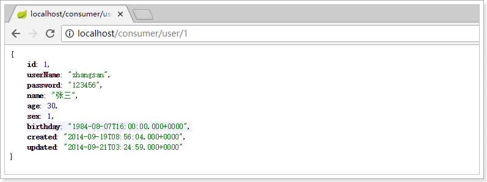

正常获取到了结果。

## 8.3.负载均衡

Feign中本身已经集成了Ribbon依赖和自动配置：


因此我们不需要额外引入依赖，也不需要再注册`RestTemplate`对象。

## 8.4.Hystrix支持


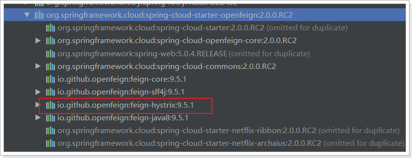

Feign默认也有对Hystrix的集成，但默认情况下是关闭的。

通过下面的参数来开启：(在itcast-service-consumer工程添加配置内容)

```yaml
feign:
  hystrix:
    enabled: true # 开启Feign的熔断功能
```

但是，Feign中的Fallback配置不像hystrix中那样简单了。

1）首先，我们要定义一个类UserClientFallback，实现刚才编写的UserClient，作为fallback的处理类

 

```java
@Component
public class UserClientFallback implements UserClient {

    @Override
    public User queryById(Long id) {
        User user = new User();
        user.setUserName("服务器繁忙，请稍后再试！");
        return user;
    }
}
```

2）然后在UserFeignClient中，指定刚才编写的实现类

```java
@FeignClient(value = "service-provider", fallback = UserClientFallback.class) // 标注该类是一个feign接口
public interface UserClient {

    @GetMapping("user/{id}")
    User queryUserById(@PathVariable("id") Long id);
}
```

3）重启测试：

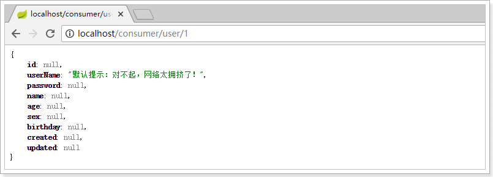

## 8.5.请求压缩(了解)

Spring Cloud Feign 支持对请求和响应进行GZIP压缩，以减少通信过程中的性能损耗。通过下面的参数即可开启请求与响应的压缩功能：

```yaml
feign:
  compression:
    request:
      enabled: true # 开启请求压缩
    response:
      enabled: true # 开启响应压缩
```

同时，我们也可以对请求的数据类型，以及触发压缩的大小下限进行设置：

```yaml
feign:
  compression:
    request:
      enabled: true # 开启请求压缩
      mime-types: text/html,application/xml,application/json # 设置压缩的数据类型
      min-request-size: 2048 # 设置触发压缩的大小下限
```

注：上面的数据类型、压缩大小下限均为默认值。

## 8.6.日志级别(了解)

前面讲过，通过`logging.level.xx=debug`来设置日志级别。然而这个对Fegin客户端而言不会产生效果。因为`@FeignClient`注解修改的客户端在被代理时，<font color='cornflowerblue'>都会创建一个新的Fegin.Logger实例</font>。我们需要额外指定这个日志的级别才可以。

1）设置com.leyou包下的日志级别都为debug

```yaml
logging:
  level:
    cn.itcast: debug
```

2）编写配置类，定义日志级别

 

内容：

```java
@Configuration
public class FeignLogConfiguration {

    @Bean
    Logger.Level feignLoggerLevel(){
        return Logger.Level.FULL;
    }
}
```

这里指定的Level级别是FULL，Feign支持4种级别：


- NONE：不记录任何日志信息，这是默认值。
- BASIC：仅记录请求的方法，URL以及响应状态码和执行时间
- HEADERS：在BASIC的基础上，额外记录了请求和响应的头信息
- FULL：记录所有请求和响应的明细，包括头信息、请求体、元数据。

3）在FeignClient中指定配置类：

```java
@FeignClient(value = "service-privider", fallback = UserFeignClientFallback.class, configuration = FeignConfig.class)
public interface UserFeignClient {
    @GetMapping("/user/{id}")
    User queryUserById(@PathVariable("id") Long id);
}
```

4）重启项目，即可看到每次访问的日志：

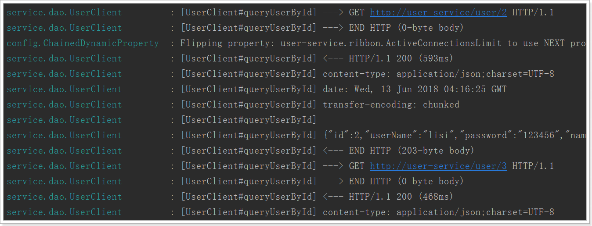


# 9.Zuul网关

通过前面的学习，使用Spring Cloud实现微服务的架构基本成型，大致是这样的：


	我们使用Spring Cloud Netflix中的Eureka实现了服务注册中心以及服务注册与发现；
	而服务间通过Ribbon或Feign实现服务的消费以及均衡负载。
	为了使得服务集群更为健壮，使用Hystrix的融断机制来避免在微服务架构中个别服务出现异常时引起的故障蔓延。
	
	在该架构中，我们的服务集群包含：内部服务Service A和Service B，他们都会注册与订阅服务至Eureka Server，而Open Service是一个对外的服务，通过均衡负载公开至服务调用方。我们把焦点聚集在对外服务这块，直接暴露我们的服务地址，这样的实现是否合理，或者是否有更好的实现方式呢？

**直接访问服务存在的不足：**

- 破坏了服务无状态特点。

  	为了保证对外服务的安全性，我们需要实现对服务访问的权限控制，而开放服务的权限控制机制将会贯穿并污染整个开放服务的业务逻辑，这会带来的最直接问题是，破坏了服务集群中REST API无状态的特点。
  	
  	从具体开发和测试的角度来说，在工作中除了要考虑实际的业务逻辑之外，还需要额外考虑对接口访问的控制处理。

- 无法直接复用既有接口。

  	当我们需要对一个既有的集群内访问接口，实现外部服务访问时，我们不得不通过在原有接口上增加校验逻辑，或增加一个代理调用来实现权限控制，无法直接复用原有的接口。

**服务网关**

为了解决上述问题，需要将<font color='cornflowerblue'>权限控制</font>从我们的服务单元中抽离出去，在对外访问最前端的地方配置一个均衡负载器的服务网关。

- 通过服务网关Zuul统一向外系统提供`REST API`，`服务路由`，`均衡负载`以及`权限控制`等功能。
- Zuul为微服务架构提供了前门保护的作用，同时将权限控制这些较重的非业务逻辑内容迁移到服务路由层面，使得服务集群主体能够具备更高的<font color='cornflowerblue'>可复用性</font>和<font color='cornflowerblue'>可测试性</font>。

## 9.1.简介

官网：https://github.com/Netflix/zuul

电影《捉鬼敢死队》中的怪兽，Zuul，在纽约引发了巨大骚乱。

事实上，在微服务架构中，Zuul就是守门的大Boss！一夫当关，万夫莫开！


## 9.2.Zuul加入后的架构

 

<font color='cornflowerblue'>不管是来自于客户端的请求，还是服务内部调用,一切对服务的请求都会经过Zuul这个网关</font>，然后再由网关来实现 鉴权、动态路由等等操作。Zuul就是我们服务的统一入口。

## 9.3.快速入门

### 9.3.1.新建工程

填写基本信息：


添加Zuul依赖：

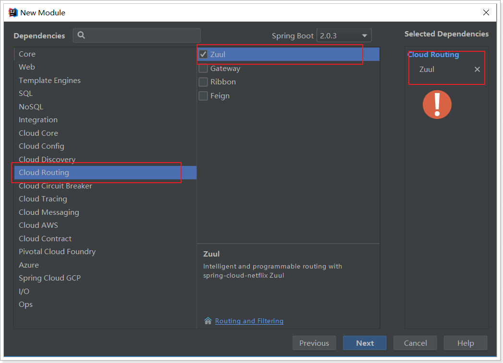

### 9.3.2.编写配置

```yaml
server:
  port: 10010 #服务端口
spring:
  application:
    name: api-gateway #指定服务名
```

### 9.3.3.编写引导类

通过`@EnableZuulProxy `注解开启Zuul的功能：

```java
@SpringBootApplication
@EnableZuulProxy // 开启网关功能
public class ItcastZuulApplication {

    public static void main(String[] args) {
        SpringApplication.run(ItcastZuulApplication.class, args);
    }
}
```

### 9.3.4.编写路由规则

我们需要用Zuul来代理service-provider服务，先看一下控制面板中的服务状态：


- ip为：127.0.0.1
- 端口为：8081

映射规则：

```yaml
server:
  port: 10010 #服务端口
spring:
  application:
    name: api-gateway #指定服务名
zuul:
  routes:
    service-provider: # 这里是路由id，随意写
      path: /service-provider/** # 这里是映射路径
      url: http://127.0.0.1:8081 # 映射路径对应的实际url地址
```

我们将符合`path` 规则的一切请求，都代理到 `url`参数指定的地址

本例中，我们将 `/service-provider/**`开头的请求，代理到http://127.0.0.1:8081

### 9.3.5.启动测试

访问的路径中需要加上配置规则的映射路径，我们访问：http://127.0.0.1:10010/service-provider/user/1


## 9.4.面向服务的路由

刚才的路由规则中把路径对应的服务地址写死了！如果同一服务有多个实例的话，这样做显然就不合理了。应该根据服务的名称，去Eureka注册中心查找 服务对应的所有实例列表，然后进行动态路由才对！

对itcast-zuul工程修改优化：

### 9.4.1.添加Eureka客户端依赖

```xml
<dependency>
    <groupId>org.springframework.cloud</groupId>
    <artifactId>spring-cloud-starter-netflix-eureka-client</artifactId>
</dependency>
```

### 9.4.2.添加Eureka配置，获取服务信息

```yaml
eureka:
  client:
    registry-fetch-interval-seconds: 5 # 获取服务列表的周期：5s
    service-url:
      defaultZone: http://127.0.0.1:10086/eureka
```

### 9.4.3.开启Eureka客户端发现功能

```java
@SpringBootApplication
@EnableZuulProxy // 开启Zuul的网关功能
@EnableDiscoveryClient
public class ZuulDemoApplication {

	public static void main(String[] args) {
		SpringApplication.run(ZuulDemoApplication.class, args);
	}
}
```

### 9.4.4.修改映射配置，通过服务名称获取

有了Eureka客户端就可以从Eureka获取服务的地址信息，因此映射时无需指定IP地址，而是通过服务名称来访问，而且Zuul已经集成了Ribbon的负载均衡功能。

```yaml
zuul:
  routes:
    service-provider: # 这里是路由id，随意写
      path: /service-provider/** # 这里是映射路径
      serviceId: service-provider # 指定服务名称
```

### 9.4.5.启动测试

再次启动，这次Zuul进行代理时，会利用Ribbon进行负载均衡访问：


## 9.5.简化的路由配置

刚才的配置规则如下：

- `zuul.routes.<route>.path=/xxx/**`： 来指定映射路径。`<route>`是自定义的路由名
- `zuul.routes.<route>.serviceId=service-provider`：来指定服务名。

而大多数情况下，我们的`<route>`路由名称往往和服务名会写成一样的。因此Zuul就提供了一种简化的配置语法：`zuul.routes.<serviceId>=<path>`

比方说上面我们关于service-provider的配置可以简化为一条：

```yaml
zuul:
  routes:
    service-provider: /service-provider/** # 这里是映射路径
```

省去了对服务名称的配置。


## 9.6.默认的路由规则

在使用Zuul的过程中，上面讲述的规则已经大大的简化了配置项。但是当服务较多时，配置也是比较繁琐的。因此Zuul就指定了默认的路由规则：

- 默认情况下，一切服务的映射路径就是服务名本身。例如服务名为：`service-provider`，则默认的映射路径就	是：`/service-provider/**`

也就是说，刚才的映射规则我们完全不配置也是OK的，不信就试试看。


## 9.7.路由前缀

配置示例：

```yaml
zuul:
  routes:
    service-provider: /service-provider/**
    service-consumer: /service-consumer/**
  prefix: /api # 添加路由前缀
```

我们通过`zuul.prefix=/api`来指定了路由的前缀，这样在发起请求时，路径就要以/api开头。

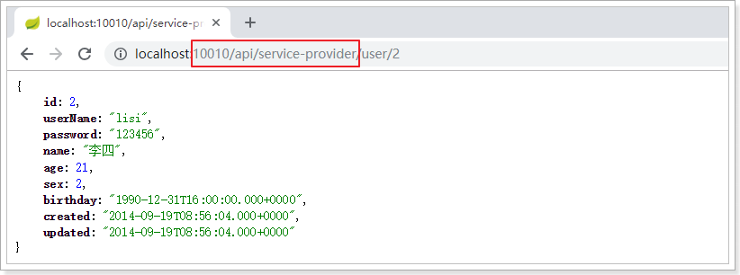


## 9.8.过滤器

Zuul作为网关的其中一个重要功能，就是实现请求的鉴权。而这个动作我们往往是通过Zuul提供的过滤器来实现的。

### 9.8.1.ZuulFilter

ZuulFilter是过滤器的顶级父类。在这里我们看一下其中定义的4个最重要的方法：

```java
public abstract ZuulFilter implements IZuulFilter{

    abstract public String filterType();

    abstract public int filterOrder();
    
    boolean shouldFilter();// 来自IZuulFilter

    Object run() throws ZuulException;// IZuulFilter
}
```

- `shouldFilter`：返回一个`Boolean`值，判断该过滤器是否需要执行。返回true执行，返回false不执行。
- `run`：过滤器的具体业务逻辑。
- `filterType`：返回字符串，代表过滤器的类型。包含以下4种：
  - `pre`：请求在被路由之前执行
  - `route`：在路由请求时调用
  - `post`：在route和errror过滤器之后调用
  - `error`：处理请求时发生错误调用
- `filterOrder`：通过返回的int值来定义过滤器的执行顺序，数字越小优先级越高。


### 9.8.2.过滤器执行生命周期

这张是Zuul官网提供的请求生命周期图，清晰的表现了一个请求在各个过滤器的执行顺序。


正常流程：

- 请求到达首先会经过pre类型过滤器，而后到达route类型，进行路由，请求就到达真正的服务提供者，执行请求，返回结果后，会到达post过滤器。而后返回响应。

异常流程：

- 整个过程中，pre或者route过滤器出现异常，都会直接进入error过滤器，在error处理完毕后，会将请求交给POST过滤器，最后返回给用户。
- 如果是error过滤器自己出现异常，最终也会进入POST过滤器，将最终结果返回给请求客户端。
- 如果是POST过滤器出现异常，会跳转到error过滤器，但是与pre和route不同的是，请求不会再到达POST过滤器了。

所有内置过滤器列表：

 


### 9.8.3.使用场景

场景非常多：

- 请求鉴权：一般放在pre类型，如果发现没有访问权限，直接就拦截了
- 异常处理：一般会在error类型和post类型过滤器中结合来处理。
- 服务调用时长统计：pre和post结合使用。


## 9.9.自定义过滤器

接下来我们来自定义一个过滤器，模拟一个登录的校验。基本逻辑：如果请求中有access-token参数，则认为请求有效，放行。

### 9.9.1.定义过滤器类

 

内容：

```java
@Component
public class LoginFilter extends ZuulFilter {
    /**
     * 过滤器类型，前置过滤器
     * @return
     */
    @Override
    public String filterType() {
        return "pre";
    }

    /**
     * 过滤器的执行顺序
     * @return
     */
    @Override
    public int filterOrder() {
        return 1;
    }

    /**
     * 该过滤器是否生效
     * @return
     */
    @Override
    public boolean shouldFilter() {
        return true;
    }

    /**
     * 登陆校验逻辑
     * @return
     * @throws ZuulException
     */
    @Override
    public Object run() throws ZuulException {
        // 获取zuul提供的上下文对象
        RequestContext context = RequestContext.getCurrentContext();
        // 从上下文对象中获取请求对象
        HttpServletRequest request = context.getRequest();
        // 获取token信息
        String token = request.getParameter("access-token");
        // 判断
        if (StringUtils.isBlank(token)) {
            // 过滤该请求，不对其进行路由
            context.setSendZuulResponse(false);
            // 设置响应状态码，401
            context.setResponseStatusCode(HttpStatus.SC_UNAUTHORIZED);
            // 设置响应信息
            context.setResponseBody("{\"status\":\"401\", \"text\":\"request error!\"}");
        }
        // 校验通过，把登陆信息放入上下文信息，继续向后执行
        context.set("token", token);
        return null;
    }
}
```


### 9.9.2.测试

没有token参数时，访问失败：


添加token参数后：


## 9.10.负载均衡和熔断

Zuul中默认就已经集成了Ribbon负载均衡和Hystix熔断机制。但是所有的超时策略都是走的默认值，比如熔断超时时间只有1S，很容易就触发了。因此建议我们手动进行配置：

```yaml
hystrix:
  command:
    default:
      execution:
        isolation:
          thread:
            timeoutInMilliseconds: 2000 # 设置hystrix的超时时间为6000ms
```

