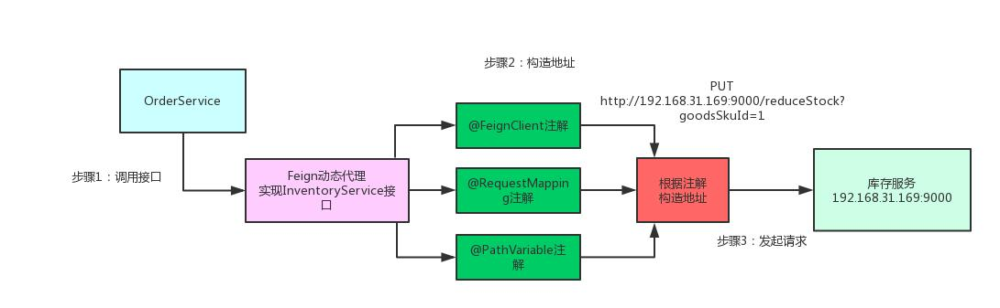

# 什么是 Spring Cloud ？

Spring Cloud 是构建在 Spring Boot 基础之上，用于<font color='cornflowerblue'>快速构建分布式系统</font>的通用模式的工具集。即用于构建微服务的技术栈。

## Spring Cloud 核心功能是什么？

Spring Cloud 可以说是目前微服务架构的最好的选择，涵盖了基本我们需要的所有组件。Spring Cloud 主要提供了如下核心的功能：

- Distributed/versioned configuration 分布式/版本化的配置管理
- Service registration and discovery 服务注册与服务发现
- Routing 路由
- Service-to-service calls 端到端的调用
- Load balancing 负载均衡
- Circuit Breakers 断路器
- Global locks 全局锁
- Leadership election and cluster state 选举与集群状态管理
- Distributed messaging 分布式消息

## Spring Cloud 有哪些组件？

Spring Cloud的 组件相当繁杂，拥有诸多子项目。如下脑图所示：

[](http://static.iocoder.cn/4935fcc0a209fd1d4b70cade94986f59)Spring Cloud的 组件

我们最为熟知的，可能就是 [Spring Cloud Netflix](https://github.com/spring-cloud/spring-cloud-netflix) ，它是 Netflix 公司基于它们自己的 Eureka、Hystrix、Zuul、Ribbon 等组件，构建的一个 Spring Cloud 实现技术栈。

 [Spring Cloud Netflix](https://github.com/spring-cloud/spring-cloud-netflix) 要进入维护模式，但目前已经开始有新的基于 Spring Cloud 实现，可以作为新的选择。如下表格：

> [《Spring Cloud Netflix 项目进入维护模式》](https://blog.csdn.net/alex_xfboy/article/details/85258425)

|          | Netflix | 阿里        | 其它                                                         |
| :------- | :------ | :---------- | :----------------------------------------------------------- |
| 注册中心 | Eureka  | Nacos       | Zookeeper、Consul、Etcd                                      |
| 熔断器   | Hystrix | Sentinel    | Resilience4j                                                 |
| 网关     | Zuul1   | 暂无        | Spring Cloud Gateway                                         |
| 负载均衡 | Ribbon  | Dubbo(未来) | [`spring-cloud-loadbalancer`](https://github.com/spring-cloud/spring-cloud-commons/tree/master/spring-cloud-loadbalancer) |

其它组件，例如配置中心、链路追踪、服务引用等等，都有相应其它的实现。

## Spring Cloud 和 Spring Boot 的区别和关系？

1. Spring Boot 专注于快速方便的开发单个个体微服务。
2. Spring Cloud 是关注全局的<font color='cornflowerblue'>微服务协调整理治理框架</font>以及一整套的落地解决方案，它将 Spring Boot 开发的一个个单体微服务整合并管理起来，为各个微服务之间提供：配置管理，服务发现，断路器，路由，微代理，事件总线等的集成服务。
3. Spring Boot 可以离开 Spring Cloud 独立使用，但是 Spring Cloud 离不开 Spring Boot ，属于依赖的关系。

## Spring Cloud 和 Dubbo 的区别？

参见 [《精尽 Dubbo 面试题》](http://svip.iocoder.cn/Dubbo/Interview) 文章的 [「Spring Cloud 与 Dubbo 怎么选择？」](http://svip.iocoder.cn/Spring-Cloud/Interview/#) 问题的解答。

# 什么是微服务？

直接看 [什么是微服务？](http://www.iocoder.cn/Geek/Learn-micro-services-from-zero/What-is-a-micro-service/) 文章。

## 微服务的优缺点分别是什么？

**1）优点**

- 每一个服务足够内聚,而微服务是松耦合的
- 开发效率提高，一个服务只做一件事
- 可以用不同的语言开发,面向REST风格接口编程，易于与第三方集成
- 微服务只是业务逻辑的代码，不会和 HTML、CSS 或者其他界面组合
  - 开发中，两种开发模式
    - 前后端分离
    - 全栈工程师
- 可以灵活搭配,连接公共库/连接独立库

**2）缺点**

- 分布式系统的复杂性高，规模庞大，运维困难
- 系统部署依赖
- 服务间通信成本
- 数据一致性
- 性能监控
- 系统集成测试

# 注册中心

在 Spring Cloud 中，能够使用的注册中心，还是比较多的，如下：

- [`spring-cloud-netflix-eureka-server`](https://github.com/spring-cloud/spring-cloud-netflix/tree/master/spring-cloud-netflix-eureka-server) 和 [`spring-cloud-netflix-eureka-client`](https://github.com/spring-cloud/spring-cloud-netflix/tree/master/spring-cloud-netflix-eureka-server) ，基于 Eureka 实现。
- [`spring-cloud-alibaba-nacos-discovery`](https://github.com/spring-cloud-incubator/spring-cloud-alibaba/tree/master/spring-cloud-alibaba-nacos-discovery) ，基于 Nacos 实现。
- [`spring-cloud-zookeeper-discovery`](https://github.com/spring-cloud/spring-cloud-zookeeper/tree/master/spring-cloud-zookeeper-discovery) ，基于 Zookeeper 实现。
- … 等等

以上的实现，都是基于 [`spring-cloud-commons`](https://github.com/spring-cloud/spring-cloud-commons) 的 [`discovery`](https://github.com/spring-cloud/spring-cloud-commons/blob/master/spring-cloud-commons/src/main/java/org/springframework/cloud/client/discovery/) 的 [DiscoveryClient](https://github.com/spring-cloud/spring-cloud-commons/blob/master/spring-cloud-commons/src/main/java/org/springframework/cloud/client/discovery/DiscoveryClient.java) 接口，实现统一的客户端的注册发现。

```java
public interface DiscoveryClient {
    String description();

    List<ServiceInstance> getInstances(String serviceId);

    List<String> getServices();
}
```

## 为什么要使用[服务发现](https://blog.csdn.net/u013035373/article/details/79414529)？

简单来说，通过注册中心，调用方(Consumer)获得服务方(Provider)的地址，从而能够调用。

实际情况下，会分成两种注册中心的发现模式：

1. 客户端发现模式（ Spring Cloud ）
2. 服务端发现模式

## Eureka

[](http://static.iocoder.cn/25e9704082444add1192bc69c87198e9)Eureka 集群

作用：实现服务治理（服务注册与发现）

由两个组件组成：Eureka 服务端和 Eureka 客户端。

- Eureka 服务端，用作服务注册中心，支持集群部署。
- Eureka 客户端，是一个 Java 客户端，用来处理服务注册与发现，包括消费者和提供者。

```
在应用启动时，Eureka 客户端向服务端注册自己的服务信息，同时将服务端的服务信息缓存到本地。
客户端会和服务端周期性的进行心跳交互，以更新服务租约和服务信息。
```

Eureka 原理，整体如下图：[](http://static.iocoder.cn/80c74f1d7cb9fc2a416e7b61a055d778)Eureka 原理

关于 Eureka 的源码解析，可以看看艿艿写的 [《Eureka 源码解析系列》](http://www.iocoder.cn/categories/Eureka/) 。

### Eureka 如何实现集群？

[《配置 Eureka Server 集群》](https://www.jianshu.com/p/5d5b2cf7d476)：

```
在 Eureka 高可用架构中，Eureka Server 也可以作为 Client 向其他 server 注册，多节点相互注册组成 Eureka 集群，集群间相互视为 peer。Eureka Client 向 Server 注册、续约、更新状态时，接受节点更新自己的服务注册信息后，逐个同步至其他 peer 节点。

如果 server-A 向 server-B 节点单向注册，则 server-A 视 server-B 为 peer 节点，server-A 接受的数据会同步给 server-B，但 server-B 接受的数据不会同步给 server-A。
```

此处，也很容易引申出一个问题，为什么 Eureka 被设计成 AP 的系统，答案可以看看 [《为什么不应该使用 ZooKeeper 做服务发现》](http://dockone.io/article/78) 。

### Eureka 缓存机制？

Eureka 的缓存机制如下图所示：


**多级缓存的意义**

Eureka Server为避免同时读取内存数据，导致并发问题，采用多级缓存机制提升响应速度。

> 避免了多个Eureka客户端对内存注册表频繁读写导致冲突问题，显著提高了性能。

**多级缓存的组成**

- 注册列表：ConcurrentHashMap<key,value> register
- 一级缓存：ConcurrentHashMap<key,value> readOnlyCacheMap,数据无过期时间
- 二级缓存：Guava readWriteCacheMap，包含失效机制


**服务注册与下线（提供者）**

写入register注册表，并立即同步至二级缓存ReadWriter中，ReadWriter定时同步至一级缓存ReadOnly。

**服务拉取（消费者）**

从一级缓存ReadOnly中查询的注册表信息，若不存在则去二级缓存ReadWrite中查询注册表信息，若仍没有则从register中获取数据，并填充各级缓存。

**额外阅读**

- [《详解 Eureka 缓存机制》](https://www.infoq.cn/article/y_1BCrbLONU61s1gbGsU)
- [《Eureka 的多级缓存机制》](https://blog.csdn.net/qq_38545713/article/details/105535950)
- [《Eureka 缓存细节以及生产环境的最佳配置》](http://bhsc881114.github.io/2018/04/01/eureka缓存细节以及生产环境的最佳配置/)

### [Eureka 自我保护机制](https://blog.csdn.net/t894690230/article/details/78207495)？

**自我保护模式**

- 自我保护模式开启后，当 Eureka Server 节点在短时间内丢失了过多实例的连接时（比如网络故障或频繁的启动关闭客户端），那么这个节点就会进入自我保护模式。

- 在自我保护模式下，Eureka server 会保护服务注册表中的信息，不再删除服务注册表中的数据（即不会注销任何微服务），当网络故障恢复后，该 Ereaka Server 节点就会自动退出自我保护模式

**避免自我保护模式**

- 等待 Eureka Server 自动恢复

  > 正常的情况下，等待网络恢复（或者没有频繁的启动与关闭实例）后，等待一段时间 Eureka Server 会自动关闭自我保护模式
  >
  > 若迟迟没有关闭该模式，那么便可以尝试手动关闭

- 重启 Eureka Server
- 关闭 Eureka 的自我保护模式

**开发环境建议关闭自我保护模式**

开发环境可能需要不断的开启与关闭实例，如果并未关闭自我保护模式，容易触发自我保护模式，此时对调试会相对比较麻烦。

关闭自我保护模式导致的新问题：

> 可能实例并未关闭却无法通过网关访问了，很可能是由于网络问题，导致实例（或网关）与 Eureka Server 断开了连接，此时Eureka Server 已经将其注销（网络恢复后，实例并不会再次注册），恢复则需要重启 Eureka Server 节点或实例。

# 负载均衡

在 Spring Cloud 中，能够使用的负载均衡，如下：

- [`spring-cloud-netflix-ribbon`](https://github.com/spring-cloud/spring-cloud-netflix/tree/master/spring-cloud-netflix-ribbon) ，基于 Ribbon 实现。
- [`spring-cloud-loadbalancer`](https://github.com/spring-cloud/spring-cloud-commons/tree/master/spring-cloud-loadbalancer) ，提供简单的负载均衡功能。

以上的实现，都是基于 [`spring-cloud-commons`](https://github.com/spring-cloud/spring-cloud-commons) 的 [`loadbalancer`](https://github.com/spring-cloud/spring-cloud-commons/tree/master/spring-cloud-commons/src/main/java/org/springframework/cloud/client/loadbalancer) 的 [ServiceInstanceChooser](https://github.com/spring-cloud/spring-cloud-commons/blob/ecabe2bb8d9cb14aa6edcff41fdb79dc304ed004/spring-cloud-commons/src/main/java/org/springframework/cloud/client/loadbalancer/ServiceInstanceChooser.java) 接口，实现统一的服务的选择。

```java
public interface ServiceInstanceChooser {
    ServiceInstance choose(String serviceId);
}
```

负载均衡组件在选择需要调用的服务之后，还提供调用该服务的功能，具体方法见 [LoadBalancerClient](https://github.com/spring-cloud/spring-cloud-commons/blob/master/spring-cloud-commons/src/main/java/org/springframework/cloud/client/loadbalancer/LoadBalancerClient.java) 接口的 `#execute(...)` 方法。

```java
public interface LoadBalancerClient extends ServiceInstanceChooser {
    <T> T execute(String serviceId, LoadBalancerRequest<T> request);

    <T> T execute(String serviceId, ServiceInstance serviceInstance, LoadBalancerRequest<T> request);

    URI reconstructURI(ServiceInstance instance, URI original);
}
```

## 为什么要负载均衡？

随着业务的发展，单台服务无法支撑访问的需要，于是搭建多个服务形成集群。每次请求调用哪个服务，需要利用负载均衡。

[负载均衡的两种模式](https://blog.csdn.net/u014401141/article/details/78676296)：根据服务清单所存储的位置区分

1. 客户端模式（Spring Cloud）
2. 服务端模式

**负载均衡的意义什么？**

负载均衡可以改善跨计算机，计算机集群，网络链接，中央处理单元或磁盘驱动器等多种计算资源的工作负载分布。

- 负载均衡旨在**优化资源使用，最大化吞吐量，最小化响应时间，避免任何单一资源的过载**。

- 使用多个组件进行负载均衡而不是单个组件可能会通过冗余来提高**可靠性**和可用性。

## Ribbon

[](http://static.iocoder.cn/950702ef9d35f23b5081c341c1de329a)

作用：主要提供客户侧的软件负载均衡算法，根据负载均衡策略将外界的 rest 调用转换为微服务调用

Ribbon 原理图：

[](http://static.iocoder.cn/36465fd7d91b3a4aeb3b28c3777649e6)[Ribbon 原理](http://www.iocoder.cn/Ribbon/good-collection/?vip)：

```sequence
RestTemplate->InterceptingClientHttpRequest:getForObject->execute->doExecute
InterceptingClientHttpRequest->LoadBalancerInterceptor:execute->executeInternal->execute
LoadBalancerInterceptor->LoadBalancerClient:interceptor
LoadBalancerClient->LoadBalancerClient:execute
LoadBalancerClient->LoadBalancerInterceptor:clientHttpResponse
LoadBalancerInterceptor->InterceptingClientHttpRequest:response
InterceptingClientHttpRequest->RestTemplate:<T> object
```

### Ribbon 有哪些负载均衡算法？

[《Ribbon 负载均衡策略配置》](https://blog.csdn.net/rickiyeat/article/details/64918756)

其中，默认的负载均衡算法是 Round Robin 算法，顺序向下轮询。

| 策略名                    | 策略描述                                                     | 实现说明                                                     |
| ------------------------- | ------------------------------------------------------------ | ------------------------------------------------------------ |
| RoundRobinRule            | roundRobin方式轮询选择server                                 | 轮询index，选择index对应位置的server                         |
| RandomRule                | 随机选择一个server                                           | 在index上随机，选择index对应位置的server                     |
| BestAvailableRule         | 选择一个最小的并发请求的server                               | 逐个考察Server，如果Server被tripped了，则忽略，在选择其中ActiveRequestsCount最小的server |
| AvailabilityFilteringRule | 过滤掉那些因为一直连接失败的被标记为circuit  tripped的后端server，并过滤掉那些高并发的的后端server（active connections 超过配置的阈值） | 使用一个AvailabilityPredicate来包含过滤server的逻辑，其实就就是检查status里记录的各个server的运行状态 |
| WeightedResponseTimeRule  | 根据响应时间分配一个weight，响应时间越长，weight越小，被选中的可能性越低。 | 一个后台线程定期的从status里面读取评价响应时间，为每个server计算一个weight。Weight的计算也比较简单responsetime  减去每个server自己平均的responsetime是server的权重。当刚开始运行，没有形成status时，使用roubine策略选择server。 |
| RetryRule                 | 对选定的负载均衡策略机上重试机制。                           | 在一个配置时间段内当选择server不成功，则一直尝试使用subRule的方式选择一个可用的server |
| ZoneAvoidanceRule         | 复合判断server所在区域的性能和server的可用性选择server       | 使用ZoneAvoidancePredicate和AvailabilityPredicate来判断是否选择某个server，前一个判断判定一个zone的运行性能是否可用，剔除不可用的zone（的所有server），AvailabilityPredicate用于过滤掉连接数过多的Server。 |

### 聊聊 Ribbon 缓存机制？

还是 [《Eureka 缓存细节以及生产环境的最佳配置》](http://bhsc881114.github.io/2018/04/01/eureka缓存细节以及生产环境的最佳配置/) 这篇文章，Ribbon 的缓存，可能也坑道蛮多人了。

### 聊聊 Ribbon 重试机制？

[《Spring Cloud Ribbon 重试机制》](https://www.jianshu.com/p/cdb6fedcab70)

除了重试次数，还有请求的超时可以配置。

### Ribbon 是怎么和 Eureka 整合的？

Ribbon 原理

- Ribbon 会从 Eureka Client 里获取到对应的服务列表。
- Ribbon 使用负载均衡算法获得使用的服务。
- Ribbon 调用对应的服务。

# 声明式调用

在 Spring Cloud 中，目前使用的声明式调用组件，只有：

- `spring-cloud-openfeign` ，基于 Feign 实现。

如果熟悉 Dubbo 胖友的会知道，Dubbo 的 Service API 接口，也是一种声明式调用的提现。

> Feign 并非 Netflix 团队开发的组件。所有基于 Netflix 组件都在 `spring-cloud-netflix` 项目下

## Feign

Feign 的主要目标是将Java Http 客户端变得简单。 [《对于 Spring Cloud Feign 入门示例的一点思考》](https://blog.csdn.net/u013815546/article/details/76637541) 

有一点要注意，Feign 并非一定要在 Spring Cloud 下使用，单独使用也是没问题的。

### Feign 实现原理？

Feign的一个关键机制就是使用了**动态代理**。

- 某个接口定义了 `@FeignClient` 注解，Feign 就会针对这个接口创建一个动态代理
- 调用接口本质就是会调用 Feign 创建的动态代理
- Feign的动态代理会根据接口上的 `@RequestMapping` 等注解，来动态构造出你要请求的服务的地址。
- 最后针对这个地址，发起请求、解析响应。

[](http://static.iocoder.cn/6650aa32de0def76db0e4c5228619aef)

### Feign 和 Ribbon 的区别？

Ribbon 和 Feign 都是使用于调用用其余服务的，不过方式不同。

- 启动类用的注解不同。
  - Ribbon 使用的是 `@RibbonClient` 。
  - Feign 使用的是 `@EnableFeignClients` 。
- 服务的指定位置不同。
  - Ribbon 是在 `@RibbonClient` 注解上设置。
  - Feign 则是在定义声明方法的接口中用 `@FeignClient` 注解上设置。
- 调使用方式不同。
  - Ribbon 需要自己构建 Http 请求，模拟 Http 请求而后用 RestTemplate 发送给其余服务，步骤相当繁琐。
  - Feign 采使用接口的方式，将需要调用的服务的方法定义成声明方法就可，不需要自己构建 Http 请求。不过要注意的是<font color='cornflowerblue'>声明方法的注解、方法签名要和提供服务的方法完全一致</font>。

### [Feign 是怎么和 Ribbon、Eureka 整合的？](https://blog.csdn.net/lgq2626/article/details/80392914)


`@EnableFeignClients`标签中的`FeignClientRegistrar`扫描`@FeignClient`注解生成`FeignClientFactoryBean`

`FeignClientFactoryBean`的`getObject()`根据配置中是否有url决定是否返回负载均衡的实例

```java
	public Object getObject() throws Exception {
        return this.getTarget();
    }

    <T> T getTarget() {
        FeignContext context = (FeignContext)this.applicationContext.getBean(FeignContext.class);
        Builder builder = this.feign(context);
        String url;
        if (!StringUtils.hasText(this.url)) {
            if (!this.name.startsWith("http")) {
                url = "http://" + this.name;
            } else {
                url = this.name;
            }
            url = url + this.cleanPath();
            return this.loadBalance(builder, context, new HardCodedTarget(this.type, this.name, url));
        } else {
            if (StringUtils.hasText(this.url) && !this.url.startsWith("http")) {
                this.url = "http://" + this.url;
            }
            url = this.url + this.cleanPath();
            Client client = (Client)this.getOptional(context, Client.class);
            if (client != null) {
                if (client instanceof LoadBalancerFeignClient) {
                    client = ((LoadBalancerFeignClient)client).getDelegate();
                }

                builder.client(client);
            }

            Targeter targeter = (Targeter)this.get(context, Targeter.class);
            return targeter.target(this, builder, context, new HardCodedTarget(this.type, this.name, url));
        }
    }
```

核心类

- [LoadBalancerFeignClient](https://github.com/spring-cloud/spring-cloud-openfeign/blob/master/spring-cloud-openfeign-core/src/main/java/org/springframework/cloud/openfeign/ribbon/LoadBalancerFeignClient.java) ，Spring Cloud 实现 Feign Client 接口的二次封装，实现对 Ribbon 的调用。
- [FeignLoadBalancer](https://github.com/spring-cloud/spring-cloud-openfeign/blob/master/spring-cloud-openfeign-core/src/main/java/org/springframework/cloud/openfeign/ribbon/FeignLoadBalancer.java) ，Ribbon 的集成。

> LoadBalancerFeignClient.execute()调用了FeignLoadBalancer 

### 聊聊 Feign 重试机制？

[《Spring Cloud 各组件重试总结》](https://www.cnblogs.com/tiancai/p/9583942.html) 

重试是什么

> 重试并不是报错以后的重试，而是负载均衡客户端发现远程请求实例不可到达后，去重试其他实例。

spring cloud多个组件都包含重试机制：ribbon，zuul，feign

- Ribbon 和 Feign 都有重试机制，在整合 Ribbon 的情况下，默认不使用 Feign 重试，而是使用 Ribbon 的重试。
- 重试时间一定小于Hystrix的超时时间，否则，一旦Hystrix超时，就没办法继续重试了。

# 服务保障

在 Spring Cloud 中，能够使用的服务保证，如下：

- [`spring-cloud-netflix-hystrix`](https://github.com/spring-cloud/spring-cloud-netflix/tree/master/spring-cloud-netflix-hystrix) ，基于 Hystrix 实现。
- Resilience4j
- [`spring-cloud-alibaba-sentinel`](https://github.com/spring-cloud-incubator/spring-cloud-alibaba/tree/master/spring-cloud-alibaba-sentinel) ，基于 Sentinel 实现。

## [为什么要使用服务保障](https://www.cnblogs.com/xyhero/p/53852cf0245c229fe3e22756a220508b.html)？

在微服务架构中，将业务拆分成一个个的服务，服务与服务之间可以相互调用（RPC）。为了保证其高可用，单个服务又必须集群部署。由于网络原因或者自身的原因，服务并不能保证服务的 100% 可用，如果单个服务出现问题，调用这个服务就会出现网络延迟，此时若有大量的网络涌入，会形成任务累积，导致服务瘫痪，甚至导致服务“雪崩”。

> 分布式系统中经常会出现某个基础服务不可用造成整个系统不可用的情况, 这种现象被称为服务雪崩效应

**服务雪崩应对策略**

针对造成服务雪崩的不同原因, 可以使用不同的应对策略:

1.流量控制

2.改进缓存模式

3.服务自动扩容

4.服务调用者降级服务

**对于服务依赖的保护模式**

（1）熔断模式：如果某个目标服务调用慢或者有大量超时，此时，熔断该服务的调用，对于后续调用请求，不再继续调用目标服务，直接返回，快速释放资源。如果目标服务情况好转则恢复调用。

（2）隔离模式：可以对不同类型的请求使用线程池来资源隔离，每种类型的请求互不影响，如果一种类型的请求线程资源耗尽，则对后续的该类型请求直接返回，不再调用后续资源。

（3）限流模式：上述的熔断模式和隔离模式都属于出错后的容错处理机制，而限流模式则可以称为预防模式。限流模式主要是提前对各个类型的请求设置最高的QPS阈值，若高于设置的阈值则对该请求直接返回，不再调用后续资源。这种模式不能解决服务依赖的问题，只能解决系统整体资源分配问题，因为没有被限流的请求依然有可能造成雪崩效应。

## Hystrix

[](http://static.iocoder.cn/7832f7526998500b2253f5bc0683e930)Hystrix

作用：断路器，保护系统，控制故障范围。

> Hystrix 是一个延迟和容错库，旨在隔离远程系统，服务和第三方库的访问点，当出现故障是不可避免的故障时，**停止级联故障**并在复杂的分布式系统中实现弹性。

Hystrix 原理，整体如下图：[](http://static.iocoder.cn/8848af2a2e093d0421d1c7113dedefc1)

关于 Hystrix 的源码解析，可以看看艿艿写的 [《Hystrix 源码解析系列》](http://www.iocoder.cn/categories/Hystrix/) 。

### [Hystrix 隔离策略](https://blog.csdn.net/liuchuanhong1/article/details/73718794)？

Hystrix 有两种隔离策略：

- 线程池隔离（服务A,I）
- 信号量隔离（服务X）

> 实际场景下，使用线程池隔离居多，因为支持超时功能。


**线程池隔离**

- 当用户请求服务A和服务I的时候，tomcat的线程(蓝色箭头标注)会将请求的任务交给服务A和服务I的内部线程池里面的线程(橘色箭头标注)来执行，tomcat的线程就可以去执行别的任务。

- 当服务A和服务I自己线程池里面的线程执行完任务之后，就会将调用的结果返回给tomcat的线程，从而实现资源的隔离。
- 当有大量并发的时候，服务内部的线程池的数量就决定了整个服务的并发度，例如服务A的线程池大小为10个，当同时有12请求时，只会允许10个任务在执行，其他的任务被放在线程池队列中，或者是直接走降级服务，此时，如果服务A挂了，就不会造成大量的tomcat线程被服务A拖死，服务I依然能够提供服务。整个系统不会受太大的影响。

**信号量**

- 信号量的资源隔离只是起到一个开关的作用，例如，服务X的信号量大小为10，那么同时只允许10个tomcat的线程(此处是tomcat的线程，而不是服务X的独立线程池里面的线程)来访问服务X，其他的请求就会被拒绝，从而达到限流保护的作用

### 聊聊 Hystrix 缓存机制？

Hystrix 提供[缓存功能](https://segmentfault.com/a/1190000011280116)，作用是：

- 减少重复的请求数。
- 在同一个用户请求的上下文中，相同依赖服务的返回数据始终保持一致。

详细的，可以看看 [《Hystrix 缓存功能的使用》](https://blog.csdn.net/zhuchuangang/article/details/74566185) 文章。

### 什么是 Hystrix 断路器？

Hystrix 断路器通过 HystrixCircuitBreaker 实现。

HystrixCircuitBreaker 有三种状态 ：

- `CLOSED` ：关闭
- `OPEN` ：打开
- `HALF_OPEN` ：半开

其中，断路器处于 `OPEN` 状态时，链路处于**非健康**状态，命令执行时，直接调用**回退**逻辑，跳过**正常**逻辑。

HystrixCircuitBreaker 状态变迁如下图 ：

[](http://static.iocoder.cn/images/Hystrix/2018_11_08/01.png)HystrixCircuitBreaker 状态

- 红线：初始时，断路器处于`CLOSED`状态，链路处于健康状态。当满足如下条件，断路器从`CLOSED`变成`OPEN` 状态：
  - **周期**( 可配，`HystrixCommandProperties.default_metricsRollingStatisticalWindow = 10000 ms` )内，总请求数超过一定**量**( 可配，`HystrixCommandProperties.circuitBreakerRequestVolumeThreshold = 20` ) 。
  - **错误**请求占总请求数超过一定**比例**( 可配，`HystrixCommandProperties.circuitBreakerErrorThresholdPercentage = 50%` ) 。
- **绿线** ：断路器处于 `OPEN` 状态，命令执行时，若当前时间超过断路器**开启**时间一定时间( `HystrixCommandProperties.circuitBreakerSleepWindowInMilliseconds = 5000 ms` )，断路器变成 `HALF_OPEN` 状态，**尝试**调用**正常**逻辑，根据执行是否成功，**打开或关闭**熔断器【**蓝线**】。

### 什么是 Hystrix 服务降级？

<font color='red'>服务熔断和降级的实现原理？</font>

在 Hystrix 断路器熔断时，可以调用一个降级方法，返回相应的结果。当然，降级方法需要配置和编码，如果胖友不需要，也可以不写，也就是不会有服务降级的功能。

具体的使用方式，可以看看 [《通过 Hystrix 理解熔断和降级》](https://blog.csdn.net/jiaobuchong/article/details/78232920) 。

服务熔断是provider实现的，服务降级是consumer实现的。

# 网关服务

在 Spring Cloud 中，能够使用的网关服务，主要是两个，如下：

- [`spring-cloud-netflix-zuul`](https://github.com/spring-cloud/spring-cloud-netflix/tree/e460b94b90ea93658a9bedb1af2509ea71cacae4/spring-cloud-netflix-zuul) ，基于 Zuul1 实现。

  > Netflix 最新开源的网关服务是 Zuul2 ，基于响应式的网关服务。

- [`spring-cloud-gateway`](https://github.com/spring-cloud/spring-cloud-gateway) ，基于 Spring Webflux 实现。

  > 艿艿：比较大的可能性，是未来 Spring Cloud 网关的主流选择。考虑到目前资料的情况，建议使用 Zuul1 可能是更稳妥的选择，因为 Zuul1 已经能满足绝大数性能要求，实在不行也可以集群。

## 为什么要网关服务？

使用网关服务，我们实现统一的功能：

- 动态路由
- [灰度发布](https://blog.csdn.net/qq_42234452/article/details/90906692)
- 健康检查
- 限流
- 熔断
- 认证: 如数支持 HMAC, JWT, Basic, OAuth 2.0 等常用协议
- 鉴权: 权限控制，IP 黑白名单，同样是 OpenResty 的特性
- 可用性
- 高性能

详细的，可以看看 [《为什么微服务需要 API 网关？》](http://dockone.io/article/2033) 。

## Zuul

[](http://static.iocoder.cn/c1a8294fcaf03a88818e4194bb348f0b)Zuul

作用：API 网关，路由，负载均衡等多种作用。

简介：类似 Nginx ，[反向代理](https://www.cnblogs.com/taostaryu/p/10547132.html)的功能，不过 Netflix 自己增加了一些配合其他组件的特性。

> 在微服务架构中，后端服务往往不直接开放给调用端，而是通过一个 API网关根据请求的 url ，路由到相应的服务。当添加API网关后，在第三方调用端和服务提供方之间就创建了一面墙，这面墙直接与调用方通信进行权限控制，后将请求均衡分发给后台服务端。

### Zuul 原理


zuul请求处理流程

```sequence
ZuulController->ZuulServlet:setServletClass(ZuulServlet.class)
ZuulServlet->ZuulRunner:xxxRoute()
ZuulRunner->FilterProcessor:xxxRoute()
FilterProcessor->ZuulFilter:runFilters("xxx")
ZuulFilter->ZuulFilter:run
ZuulFilter->ZuulServlet:response
```

**Zuul的流程控制由ZuulServlet控制**

```java
//ZuulSevlet.java

public void service(servletRequest, servletResponse) {
   // 执行 "pre" 类型 ZuulFilter
   preRoute();
   // 执行 "route" 类型 ZuulFilter
   route();
   // 执行 "post" 类型 ZuulFilter
   postRoute();
}
//若xxxRoute()抛出异常，则会执行error()
```

**zuul的核心逻辑都是由一系列filter过滤器链实现的**

1. filter的类型：filter的类型，决定了它在整个filter链中的执行顺序

   - pre：在zuul网关按照规则路由到下级服务之前执行，可对请求进行预处理，如：认证鉴权，限流等。
   - route：这种过滤器是zuul路由动作的执行者，是Apache HttpClient或Ribbon构建和发送原始HTTP请求的地方
   - post：这种过滤器是在端点请求完毕，返回结果或者发生异常后执行的filter。可对返回的结果进行再次处理
   - error： 这种过滤器是在整个生命周期内，如果发生异常，就执行该filter，可以做全局异常处理。

   

2. filter的执行顺序：同一种类型的filter，可以通过filterOrder()方法设置执行顺序，一般都是根据业务场景自定义filter执行顺序。

**ZuulFilter的核心属性**

```java
//ZuulFilter.java

//返回filter类型
public abstract String filterType();
//返回filter的order
public abstract int filterOrder();
//是否过滤
boolean shouldFilter();
//实际过滤操作
Object run() throws ZuulException;
```

**preRoute**

1. ServletDetectionFilter（-3）：

   ```
   判断该请求是被spring的DispatcherServlet处理还是被zuul的ZuulServlet处理，并且将判断结果设置到context中，后续处理中可以依照此结果进行个性化处理
   ```

2.  Servlet30WrapperFilter（-2）：

   ```
   Zuul默认仅对servlet2.5兼容，该过滤器可以将request包装成3.0兼容的形式
   ```

3. FormBodyWrapperFilter（-1）：

   ```
   将application/x-www-form-urlencoded和multipart/form-data两种请求包装成FormBodyRequestWrapper
   ```

4. TracePreZuulFilter：（0）：

   ```
   结合Sleuth实现链路追踪相关功能
   ```

5. DebugFilter（1）：

   ```
   仅在请求参数中出现debug=true（参数名称可设置）时执行
   在context中设置debugRouting=true及debugRequest=true。在后续执行中可以通过这两个值来预埋一些debug信息，用于出现问题时提供排查所需的信息
   ```

6. PreDecorationFilter（5）：

   ```
   对请求做一些预处理
   	使用前面介绍过的RouteLocator获取路由信息
   	在context中设置一些后续处理需要的信息
   	在请求头中添加一些代理信息
   ```

**route：将请求具体的服务**

1. RibbonRoutingFilter（10）：

   ```
   仅在context中存在serviceId的情况下运行。创建RibbonCommandContext，然后交由ribbon和hystrix向下游服务进行请求
   ```

2. SimpleHostRoutingFilter（100）：

   ```
   仅在context中存在routeHost的情况下运行。通过HttpClient直接向目标url发起请求
   ```

3. SendForwardFilter（500）：

   ```
   仅在context中存在forward.to的情况下运行。通过RequestDispatcher进行forward
   ```

**postRoute**

1. TracePostZuulFilter（0）：

   ```
   结合pre阶段的TracePreZuulFilter通过Sleuth实现链路追踪的功能
   ```

2. SendResponseFilter（1000）：

   ```
   仅在context中存在zuulResponseHeaders、responseDataStream、responseBody（三者是或的关系）的情况下运行，添加相关的响应头，然后将响应数据回写到response
   ```

**error：**

1. SendErrorFilter（0）：

   ```
   仅在context中存在throwable的情况下运行，将错误状态码、错误信息、异常对象设置到request中，然后forward到/error
   ```

### 动态路由如何实现？

**PreDecorationFilter**

Zuul的路由选择是在PreDecorationFilter中实现的

> **routeLocator.getMatchingRoute** 根据请求URL获取Route，再根据Route的location是否匹配 **http:、https:、forward:** 前缀来设置属性

```java
//PreDecorationFilter.java

@Override
public Object run() {
  RequestContext ctx = RequestContext.getCurrentContext();
  final String requestURI = 根据 request 提取requestURI;
    
    // 根据requestURI获取路由信息
  Route route = this.routeLocator.getMatchingRoute(requestURI);
  if (route != null) {
    String location = route.getLocation();
    if (location != null) {
            // 以https或http开头, 设置RouteHost
      if (location.startsWith("http:") || location.startsWith("https:")) {
        ctx.setRouteHost(getUrl(location));
      }
            // 以 forward: 开头
      else if (location.startsWith("forward:")) {
        ctx.setRouteHost(null);
        return null;
      }
            // 设置 serviceId, RouteHost置空
      else {
        ctx.set(SERVICE_ID_KEY, location);
        ctx.setRouteHost(null);
      }
    }
  }
}
```

**RouteLocator**


```java
public interface RouteLocator {
  Collection<String> getIgnoredPaths();
  List<Route> getRoutes();
  Route getMatchingRoute(String path);
}
```

RouteLocator 主要能力有：

- 根据path获取Route
- 获取所有Route

SimpleRouteLocator：简单路由定位器，路由信息来自ZuulProperties

```java
public class SimpleRouteLocator implements RouteLocator, Ordered{
    // routes 用于存储路由信息
    private AtomicReference<Map<String, ZuulRoute>> routes = new AtomicReference<>();

    // 查找路由信息
    protected Map<String, ZuulRoute> locateRoutes() {
        LinkedHashMap<String, ZuulRoute> routesMap = new LinkedHashMap<>();
        // 提取ZuulProperties中的ZuulRoute
        for (ZuulRoute route : this.properties.getRoutes().values()) {
            routesMap.put(route.getPath(), route);
        }
        return routesMap;
    }
}
```

DiscoveryClientRouteLocator：路由数据来自properties中的静态配置 和 DiscoveryClient从注册中心获取的数据。

- 动态添加Route
- 刷新路由
- 从DiscoveryClient获取路由信息

CompositeRouteLocator（默认）：具备组合多个RouteLocator的能力，用Collection存储多个RouteLocator

**动态路由的实现**

实现动态路由，可更新RouteLocator的Routes数据几个来源：

- 来源于ZuulProperties，它由 **@ConfigurationProperties** 标记

  ```java
  @ConfigurationProperties("zuul")
  public class ZuulProperties {}
  ```

- DiscoveryClientRouteLocator 提供了 addRoute() 支持动态添加路由，但没有删除方法
- 来源于DiscoveryClient

更新路由信息后，都需要执行 refresh() 操作才能把路由信息更新到 RouteLocator的私有属性routes，有以下2种更新方式：

- 在任意Bean中注入CompositeRouteLocator 或自定义的RouteLocator，然后调用refresh().

  ```
  @Autowired
  private CompositeRouteLocator compositeRouteLocator;
  ```

- 发布RoutesRefreshedEvent事件

  Zuul 提供了 ZuulRefreshListener，监听到 RoutesRefreshedEvent 后，会调用ZuulHandlerMapping 的reset()方法，进而调用RouteLocator的refresh()方法。

[自定义RouteLocator](https://www.iocoder.cn/Spring-Cloud-Gateway/route-locator-route-custom-java/)


关于 Zuul 的源码解析，可以看看艿艿整理的 [《Zuul 源码解析系列》](http://www.iocoder.cn/Zuul/good-collection/) 。

## Spring Cloud Gateway

关于 Spring Cloud Gateway 的源码解析，可以看看艿艿写的 [《Spring Cloud Gateway 源码解析系列》](http://www.iocoder.cn/categories/Spring-Cloud-Gateway/) 。

# 配置中心

在 Spring Cloud 中，能够使用的配置中心，如下：

- [`spring-cloud-config`](https://github.com/spring-cloud/spring-cloud-config) ，基于 Git、SVN 作为存储。

- [`spring-cloud-alibaba-nacos-config`](https://github.com/spring-cloud-incubator/spring-cloud-alibaba/tree/master/spring-cloud-alibaba-nacos-config) ，基于 Nacos 实现。

- [Apollo](https://github.com/ctripcorp/apollo) ，携程开源的配置中心。

  > 艿艿：目前 Spring Cloud 最成熟的配置中心的选择。

## Spring Cloud Config

[](http://static.iocoder.cn/d4610e439ae20ceb2d24020e9ff25c3a)Spring Cloud Config

- 作用：配置管理
- 简介：Spring Cloud Config 提供服务器端和客户端。服务器存储后端的默认实现使用 Git ，因此它轻松支持标签版本的配置环境，以及可以访问用于管理内容的各种工具。
- 这个还是静态的，得配合 Spring Cloud Bus 实现动态的配置更新。

虽然 Spring Cloud Config 官方并未推出管理平台，我们可以考虑看看 [《为 Spring Cloud Config 插上管理的翅膀》](http://www.iocoder.cn/Spring-Cloud-Config/didi/spring-cloud-config-admin-1-0-0-release/) 。

## Apollo

Apollo（阿波罗）是携程框架部门研发的分布式配置中心，能够<font color='cornflowerblue'>集中化管理应用不同环境、不同集群的配置</font>，<font color='cornflowerblue'>配置修改后能够实时推送到应用端</font>，并且具备规范的权限、流程治理等特性，适用于微服务配置管理场景。

- 服务端基于 Spring Boot 和 Spring Cloud 开发，打包后可以直接运行，不需要额外安装 Tomcat 等应用容器。

- Java 客户端不依赖任何框架，能够运行于所有 Java 运行时环境，同时对 Spring/Spring Boot 环境也有额外支持。

**核心功能**

- 统一管理不同环境、不同集群的配置
- 配置修改实时生效（热发布）
- 灰度发布
- 权限管理、发布审核、操作审计

**核心组件**


- Apollo Config Service：提供配置的读取、推送等功能，服务对象是 Apollo 客户端

- Apollo Admin Service：提供配置的修改、发布等功能，服务对象是Apollo Portal（管理界面）

  > **为什么 Config Service 和 Admin Service 分离呢？**
  >
  > Config Service 和 Admin Service 读取的是相同的 ApolloPortalDB 数据库，理论上来说可以做成一个服务。不过 Admin Service 因为需要不断开发 API 接口提供给 Apollo Portal，因此可能会不定期重启。而 Config Service 功能比较单纯，基本不会有太多更新，因此基本不太会重启。所以，将 Admin Service 和 Config Service 拆分成两个服务。

- Eureka：注册中心

  > Config Service 和 Admin Service 都是多实例、无状态部署，所以需要将自己注册到 Eureka 中并保持心跳

  

- Apollo Portal：Apollo 的管理界面，进行配置修改，服务对象是开发者和 开放平台 API

  > **为什么 Admin Service 和 Portal 分离呢？**
  >
  > 1）在 Apollo 的设计中，不同的 DEV、FAT、UAT、PROD 环境，会部署在不同的网络环境下，进行隔离。因此，每个环境会部署一套 Admin Service + Config Service。而 Portal 通过调用不同环境部署的 Admin Service 提供的 API 接口，进行不同环境的配置管理。
  > 2）另外，权限管理、开放平台 API 都是由 Portal 统一实现来提供的。

-  Client：Apollo提供的客户端程序，为应用提供配置获取、实时更新等功能

  > 通过Meta Server获取Config Service服务列表（IP+Port），通过IP+Port访问服务
  >
  > 在Client侧做load balance、错误重试

- Meta Server：在Eureka之上架了一层 Meta Server 用于封装 Eureka 的服务发现接口

  > Client 通过域名访问 Meta Server 获取 Config Service 服务列表（IP+Port），而后直接通过 IP+Port 访问服务，同时在 Client 侧会做 load balance、错误重试
  >
  > Portal 通过域名访问 Meta Server 获取 Admin Service 服务列表（IP+Port），而后直接通过 IP+Port 访问服务，同时在 Portal 侧会做 load balance、错误重试

**Apollo客户端设计**


上图简要描述了Apollo客户端的实现原理：

1. 客户端和服务端保持了一个长连接，从而能第一时间获得配置更新的推送。（通过Http Long Polling实现）

2. 客户端还会定时从Apollo配置中心服务端<font color='cornflowerblue'>拉取</font>应用的最新配置。

   > 这是一个fallback机制，为了防止推送机制失效导致配置不更新
   >
   > 客户端定时拉取会上报本地版本，所以一般情况下，对于定时拉取的操作，服务端都会返回304 - Not Modified

3. 客户端从Apollo配置中心服务端获取到应用的最新配置后，会保存在内存中，并在本地文件系统缓存一份

   > 在遇到服务不可用，或网络不通的时候，依然能从本地恢复配置

4. 应用程序从Apollo客户端获取最新的配置、订阅配置更新通知


### 配置更新推送实现

**配置发送后的实时推送设计**


上图简要描述了配置发布的大致过程：

1. 用户在Portal操作配置发布
2. Portal调用Admin Service的接口操作发布
3. Admin Service发布配置后，发送ReleaseMessage给各个Config Service
4. Config Service收到ReleaseMessage后，通知对应的客户端

Apollo客户端与服务端保持了一个长连接

1. 客户端发起一个Http请求到服务端
2. 服务端会保持住这个连接60秒
   - 如果在60秒内有客户端关心的配置变化，被保持住的客户端请求会立即返回，并告知客户端有配置变化的namespace信息，客户端会据此拉取对应namespace的最新配置
   - 如果在60秒内没有客户端关心的配置变化，那么会返回Http状态码304（not modified）给客户端
     客户端在收到服务端请求后会立即重新发起连接，回到第一步

考虑到会有数万客户端向服务端发起长连接，在服务端使用了async servlet(Spring DeferredResult)来服务Http Long Polling请求。

> DeferredResult可以允许容器线程快速释放以便接受更多的请求提升吞吐量，让真正的业务逻辑在其他的工作线程中完成。

**发送ReleaseMessage的实现方式**

Admin Service作为producer发出消息，各个Config Service作为consumer消费消息。通过一个消息组件（Message Queue）实现Admin Service和Config Service的解耦。


1. Admin Service在配置发布后会往ReleaseMessage表插入一条消息记录，消息内容就是配置发布的AppId+Cluster+Namespace*（参见DatabaseMessageSender）*

2. Config Service有一个线程会每秒扫描一次ReleaseMessage表，看看是否有新的消息记录*（参见ReleaseMessageScanner）*

3. Config Service如果发现有新的消息记录，那么就会通知到所有的消息监听器，如NotificationControllerV2*（参见ConfigServiceAutoConfiguration）*

4. NotificationControllerV2得到配置发布的AppId+Cluster+Namespace后，会通知对应的客户端

**Config Service通知客户端的实现方式**

NotificationControllerV2在得知有配置发布后是会通知到客户端

1. 客户端会发起一个Http请求到Config Service的notifications/v2接口，也就是NotificationControllerV2*（参见RemoteConfigLongPollService）*

2. NotificationControllerV2不会立即返回结果，而是通过Spring DeferredResult把请求挂起

   - 如果在60秒内没有该客户端关心的配置发布，那么会返回Http状态码304给客户端

   - 如果有该客户端关心的配置发布，NotificationControllerV2会调用DeferredResult的setResult方法，传入有配置变化的namespace信息，同时该请求会立即返回。客户端从返回的结果中获取到配置变化的namespace后，会立即请求Config Service获取该namespace的最新配置。

关于 Apollo 的源码解析，可以看看艿艿写的 [《Spring Cloud Apollo 源码解析系列》](http://www.iocoder.cn/categories/Apollo/) 。

# 链路追踪

在 Spring Cloud 中，能够使用的链路追踪，主要是两个，如下：

- [`skywalking`](https://github.com/apache/incubator-skywalking) ，已经进入 Apache ，不仅仅能够透明的监控链路，还可以监控 JVM 等等。
- [`spring-cloud-sleuth`](https://github.com/spring-cloud/spring-cloud-sleuth) ，基于 Zipkin 实现。

## SkyWalking

关于 SkyWalking 的源码解析，可以看看艿艿写的 [《SkyWalking 源码解析系列》](http://www.iocoder.cn/categories/SkyWalking/) 。

## Spring Cloud Sleuth

Spring Cloud Sleuth 原理，整体如下图：[](http://static.iocoder.cn/43f306a2aa7bc27015d3baa7832d13b6)

# TODO 消息队列

# 彩蛋

第一个版本的 Spring Cloud 面试题，主要把整个文章的大体结构定了，后续在慢慢完善补充~

如下是 Eureka + Ribbon + Feign + Hystrix + Zuul 整合后的图：[](http://static.iocoder.cn/64e9a7827c76d38f899160da6f736ea2)Eureka + Ribbon + Feign + Hystrix + Zuul