# 基础知识

## [容器的初始化](https://www.tianxiaobo.com/2018/06/30/Spring-MVC-%E5%8E%9F%E7%90%86%E6%8E%A2%E7%A7%98-%E5%AE%B9%E5%99%A8%E7%9A%84%E5%88%9B%E5%BB%BA%E8%BF%87%E7%A8%8B/)

一般情况下会在一个 Web 应用中配置两个容器

1. 业务容器

   用于加载业务逻辑相关的类，比如 service、dao 层的一些类

2.  web 容器

   用于加载 Web 层的类，比如我们的接口 Controller、HandlerMapping、ViewResolver 等

业务容器会先于 web 容器进行初始化。web 容器初始化时，会将业务容器作为父容器。

> web 容器中的一些 bean 会依赖于业务容器中的 bean。比如我们的 controller 层接口通常会依赖 service 层的业务逻辑类

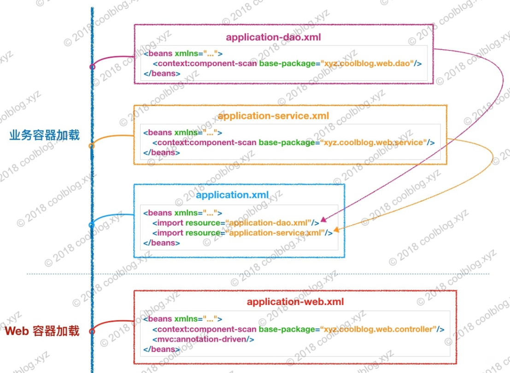

和代码分层相似

- 把配置文件进行分层，结构上看起来清晰了很多，也便于维护。
- 用业务容器和 Web 容器去加载不同的类也是一种分层的体现

### 业务容器的创建

**业务容器创建入口**

业务容器的创建入口是 ContextLoaderListener 的 contextInitialized 方法。

```
ContextLoaderListener 是用来监听 ServletContext 加载事件的。
当ServletContext被加载后，监听器的 contextInitialized 方法就会被 Servlet 容器调用。
```

ContextLoaderListener 在web.xml文件中配置,可通过 ServletContext 获取到 contextConfigLocation 配置

```xml
<web-app>
    <listener>
        <listener-class>org.springframework.web.context.ContextLoaderListener</listener-class>
    </listener>
    
    <context-param>
        <param-name>contextConfigLocation</param-name>
        <param-value>classpath:application.xml</param-value>
    </context-param>
    
    <!-- 省略其他配置 -->
</web-app>
```

**ContextLoaderListener中有2个重要属性**

- `defaultStrategies` **静态**属性，默认的配置 Properties 对象
- `context` 属性，**Root** WebApplicationContext 对象

**contextInitialized初始化代码**

```java
public class ContextLoaderListener extends ContextLoader implements ServletContextListener {

    // 省略部分代码

    @Override
    public void contextInitialized(ServletContextEvent event) {
        // 初始化 WebApplicationContext
        initWebApplicationContext(event.getServletContext());
    }
}
```


**initWebApplicationContext的3个核心步骤:**

1. 创建容器:`createWebApplicationContext(servletContext)`

   ```java
   // ContextLoader.java
   
   protected WebApplicationContext createWebApplicationContext(ServletContext sc) {
       // <1> 获得 context 的类
   	Class<?> contextClass = determineContextClass(sc);
   	// <2> 判断 context 的类，是否符合 ConfigurableWebApplicationContext 的类型
   	if (!ConfigurableWebApplicationContext.class.isAssignableFrom(contextClass)) {
   		throw new ApplicationContextException("Custom context class [" + contextClass.getName() +
   				"] is not of type [" + ConfigurableWebApplicationContext.class.getName() + "]");
   	}
   	// <3> 创建 context 的类的对象
   	return (ConfigurableWebApplicationContext) BeanUtils.instantiateClass(contextClass);
   }
   ```

   - <1>通过读取ServletContext中的配置文件,获取容器类型(默认<font color='cornflowerblue'> XmlWebApplicationContext</font> )
   - <2>判断容器类型是否符合条件
   - <3>实例化容器类

2. 配置并刷新容器 :`configureAndRefreshWebApplicationContext(cwac, servletContext)`

   ```java
   // ContextLoader.java
   
   public static final String CONTEXT_ID_PARAM = "contextId";
   
   public static final String CONFIG_LOCATION_PARAM = "contextConfigLocation";
   
   protected void configureAndRefreshWebApplicationContext(ConfigurableWebApplicationContext wac, ServletContext sc) {
       // <1> 如果 wac 使用了默认编号，则重新设置 id 属性
       if (ObjectUtils.identityToString(wac).equals(wac.getId())) {
   		// The application context id is still set to its original default value
   		// -> assign a more useful id based on available information
           // 情况一，使用 contextId 属性
           String idParam = sc.getInitParameter(CONTEXT_ID_PARAM);
   		if (idParam != null) {
   			wac.setId(idParam);
           // 情况二，自动生成
           } else {
   			// Generate default id...
   			wac.setId(ConfigurableWebApplicationContext.APPLICATION_CONTEXT_ID_PREFIX +
   					ObjectUtils.getDisplayString(sc.getContextPath()));
   		}
   	}
   	// <2>设置 context 的 ServletContext 属性
   	wac.setServletContext(sc);
       // <3> 设置 context 的配置文件地址
   	String configLocationParam = sc.getInitParameter(CONFIG_LOCATION_PARAM);
   	if (configLocationParam != null) {
   		wac.setConfigLocation(configLocationParam);
   	}
   	// <4> TODO 芋艿，暂时忽略
       ConfigurableEnvironment env = wac.getEnvironment();
   	if (env instanceof ConfigurableWebEnvironment) {
   		((ConfigurableWebEnvironment) env).initPropertySources(sc, null);
   	}
   	// <5> 执行自定义初始化 context TODO 芋艿，暂时忽略
   	customizeContext(sc, wac);
   	// 刷新 context ，执行初始化
   	wac.refresh();
   }
   ```

   - <1> 设置容器id
   - <2>设置容器的servletContext属性
   - <3>设置servletContext配置文件路径(web.xml中contextConfigLocation属性值)
   - <4>获取配置环境
   - <5>自定义初始化
   - <6>

3. 设置容器到 ServletContext 中:`servletContext.setAttribute(WebApplicationContext.ROOT_WEB_APPLICATION_CONTEXT_ATTRIBUTE, this.context)`
   - 如果 `web.xml` 如果定义了多个 ContextLoader ，就会报错

### web容器的创建

**`web.xml` 的web容器相关配置**

```xml
<servlet>
    <servlet-name>spring</servlet-name>
    <servlet-class>org.springframework.web.servlet.DispatcherServlet</servlet-class>
    <!-- 可以自定义servlet.xml配置文件的位置和名称，默认为WEB-INF目录下，名称为[<servlet-name>]-servlet.xml，如spring-servlet.xml
    <init-param>
        <param-name>contextConfigLocation</param-name>
        <param-value>/WEB-INF/spring-servlet.xml</param-value> // 默认
    </init-param>
    -->
    <load-on-startup>1</load-on-startup>
</servlet>
<servlet-mapping>
    <servlet-name>spring</servlet-name>
    <url-pattern>*.do</url-pattern>
</servlet-mapping>
```

 **Servlet** WebApplicationContext 容器的初始化，是在 DispatcherServlet 初始化的过程中执行.

**DispatcherServlet类图**


- HttpServletBean ，负责将 ServletConfig 设置到当前 Servlet 对象中
- FrameworkServlet ，负责初始化 Spring Servlet WebApplicationContext 容器。
- DispatcherServlet ，负责初始化 Spring MVC 的各个组件，以及处理客户端的请求。(后续会详细描述)

**[HttpServlet类图](http://www.tianxiaobo.com/2018/06/29/Spring-MVC-%E5%8E%9F%E7%90%86%E6%8E%A2%E7%A7%98-%E4%B8%80%E4%B8%AA%E8%AF%B7%E6%B1%82%E7%9A%84%E6%97%85%E8%A1%8C%E8%BF%87%E7%A8%8B/#313-httpservlet)**

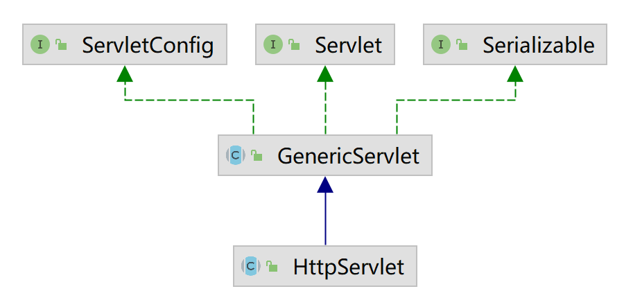

Servlet接口定义

```java
public interface Servlet {

    public void init(ServletConfig config) throws ServletException;

    public ServletConfig getServletConfig();
    
    public void service(ServletRequest req, ServletResponse res) throws ServletException, IOException;
   
    public String getServletInfo();
    
    public void destroy();
}
```

- init 方法会在容器启动时由容器调用，也可能会在 Servlet 第一次被使用时调用，调用时机取决 load-on-start 的配置

- 容器调用 init 方法时，会向其传入一个 ServletConfig 参数

  ```
  在配置 Spring MVC 的 DispatcherServlet 时，会通过 ServletConfig 将配置文件的位置告知 DispatcherServlet
  ```

ServletConfig接口定义

```java
public interface ServletConfig {
    
    public String getServletName();

    public ServletContext getServletContext();

    public String getInitParameter(String name);

    public Enumeration<String> getInitParameterNames();
}
```

- getServletName 方法，该方法用于获取 servlet 名称，即标签中配置的内容

  ```xml
  <servlet>
      <servlet-name>dispatcher</servlet-name>
      <servlet-class>org.springframework.web.servlet.DispatcherServlet</servlet-class>
      <init-param>
          <param-name>contextConfigLocation</param-name>
          <param-value>classpath:application-web.xml</param-value>
      </init-param>
  </servlet>
  ```

- getServletContext 方法用于获取 Servlet 上下文。

  > 一个 ServletConfig 对应一个 Servlet
  >
  > 一个 ServletContext 则是对应所有的 Servlet,ServletContext 代表当前的 Web 应用，可用于记录一些全局变量

  可通过标签设置ServletContext属性

  ```xml
  <context-param>
      <param-name>contextConfigLocation</param-name>
      <param-value>classpath:application.xml</param-value>
  </context-param>
  ```

GenericServlet

> GenericServlet 实现了 Servlet 和 ServletConfig 两个接口，为这两个接口中的部分方法提供了简单的实现。

HttpServlet

> HttpServlet类是和 HTTP 协议相关。
>
> 该类的关注点在于怎么处理 HTTP 请求，比如其定义了 doGet 方法处理 GET 类型的请求，定义了 doPost 方法处理 POST 类型的请求等

**HttpServletBean**

HttpServletBean的两个关键属性

- `environment` 属性:实现了 EnvironmentAware 接口,会被自动注入
- `requiredProperties` 属性，必须配置的属性的集合。可通过 `addRequiredProperty(String property)` 方法添加

`init()` 方法

```java
// HttpServletBean.java

@Override
public final void init() throws ServletException {
	// Set bean properties from init parameters.
    // <1> 解析 <init-param /> 标签，封装到 PropertyValues pvs 中
	PropertyValues pvs = new ServletConfigPropertyValues(getServletConfig(), this.requiredProperties);
	if (!pvs.isEmpty()) {
		try {
		    // <2.1> 将当前的这个 Servlet 对象，转化成一个 BeanWrapper 对象。从而能够以 Spring 的方式来将 pvs 注入到该 BeanWrapper 对象中
			BeanWrapper bw = PropertyAccessorFactory.forBeanPropertyAccess(this);
			ResourceLoader resourceLoader = new ServletContextResourceLoader(getServletContext());
			// <2.2> 注册自定义属性编辑器，一旦碰到 Resource 类型的属性，将会使用 ResourceEditor 进行解析
			bw.registerCustomEditor(Resource.class, new ResourceEditor(resourceLoader, getEnvironment()));
            // <2.3> 空实现，留给子类覆盖
			initBeanWrapper(bw);
			// <2.4> 以 Spring 的方式来将 pvs 注入到该 BeanWrapper 对象中
			bw.setPropertyValues(pvs, true);
		} catch (BeansException ex) {
			if (logger.isErrorEnabled()) {
				logger.error("Failed to set bean properties on servlet '" + getServletName() + "'", ex);
			}
			throw ex;
		}
	}

	// Let subclasses do whatever initialization they like.
    // <3> 子类来实现，实现自定义的初始化逻辑。目前，有具体的代码实现。
	initServletBean();
}
```

- <1>解析 Servlet 配置的 `<init-param />` 标签，封装到 PropertyValues `pvs` 中
- <2.1>将当前 Servlet 对象，转化成一个 BeanWrapper 对象
- <2.2> 注册自定义属性编辑器，碰到 Resource 类型的属性将会使用 ResourceEditor 进行解析
- <2.3> 初始化BeanWrapper 对象的空实现，留给子类覆盖。
- <2.4> 处以 Spring 的方式来将 pvs 注入到该 BeanWrapper 对象中
- <3> 调用 initServletBean() 方法，子类来实现，实现自定义的初始化逻辑。

**FrameworkServlet**

FrameworkServlet关键属性

- contextClass 属性，创建的 WebApplicationContext 类型
- contextConfigLocation 属性，配置文件的地址
- webApplicationContext 属性，WebApplicationContext 对象

获取webApplicationContext容器的4种方式

> 1. 构造方法
> 2. 实现 ApplicationContextAware 接口，可通过Spring属性 注入
> 3. findWebApplicationContext(sc,attrName):从sc(ServletContext)中获取attrName的web容器
> 4. createWebApplicationContext(WebApplicationContext parent)

```java
protected WebApplicationContext createWebApplicationContext(@Nullable ApplicationContext parent) {
    // <a> 获得 context 的类
	Class<?> contextClass = getContextClass();
	// 如果非 ConfigurableWebApplicationContext 类型，抛出 ApplicationContextException 异常
	if (!ConfigurableWebApplicationContext.class.isAssignableFrom(contextClass)) {
		throw new ApplicationContextException(
				"Fatal initialization error in servlet with name '" + getServletName() +
				"': custom WebApplicationContext class [" + contextClass.getName() +
				"] is not of type ConfigurableWebApplicationContext");
	}
	// <b> 创建 context 类的对象
	ConfigurableWebApplicationContext wac =
			(ConfigurableWebApplicationContext) BeanUtils.instantiateClass(contextClass);

	// <c> 设置 environment、parent、configLocation 属性
	wac.setEnvironment(getEnvironment());
	wac.setParent(parent);
	String configLocation = getContextConfigLocation();
	if (configLocation != null) {
		wac.setConfigLocation(configLocation);
	}

	// <d> 配置和初始化 wac
	configureAndRefreshWebApplicationContext(wac);

	return wac;
}
```

initServletBean进一步初始化当前Servlet对象

```java
// FrameworkServlet.java

@Override
protected final void initServletBean() throws ServletException {
	...
	// 初始化 WebApplicationContext 对象
	this.webApplicationContext = initWebApplicationContext();
	// 空实现。子类有需要，可以实现该方法，实现自定义逻辑
	initFrameworkServlet();
	...
}
```

initWebApplicationContext

```java
// FrameworkServlet.java

protected WebApplicationContext initWebApplicationContext() {
    // <1> 获得根 WebApplicationContext 对象
	WebApplicationContext rootContext = WebApplicationContextUtils.getWebApplicationContext(getServletContext());

	// <2> 获得 WebApplicationContext wac 变量
	WebApplicationContext wac = null;
	// 第一种情况，如果构造方法已经传入 webApplicationContext 属性，则直接使用
	if (this.webApplicationContext != null) {
		// A context instance was injected at construction time -> use it
        // 赋值给 wac 变量
		wac = this.webApplicationContext;
		// 如果是 ConfigurableWebApplicationContext 类型，并且未激活，则进行初始化
		if (wac instanceof ConfigurableWebApplicationContext) {
			ConfigurableWebApplicationContext cwac = (ConfigurableWebApplicationContext) wac;
			if (!cwac.isActive()) { // 未激活
				// The context has not yet been refreshed -> provide services such as
				// setting the parent context, setting the application context id, etc
                // 设置 wac 的父 context 为 rootContext 对象
				if (cwac.getParent() == null) {
					// The context instance was injected without an explicit parent -> set
					// the root application context (if any; may be null) as the parent
					cwac.setParent(rootContext);
				}
				// 配置和初始化 wac
				configureAndRefreshWebApplicationContext(cwac);
			}
		}
	}
	// 第二种情况，从 ServletContext 获取对应的 WebApplicationContext 对象
	if (wac == null) {
		// No context instance was injected at construction time -> see if one
		// has been registered in the servlet context. If one exists, it is assumed
		// that the parent context (if any) has already been set and that the
		// user has performed any initialization such as setting the context id
		wac = findWebApplicationContext();
	}
	// 第三种，创建一个 WebApplicationContext 对象
	if (wac == null) {
		// No context instance is defined for this servlet -> create a local one
		wac = createWebApplicationContext(rootContext);
	}

	// <3> 如果未触发刷新事件，则主动触发刷新事件
	if (!this.refreshEventReceived) {
		// Either the context is not a ConfigurableApplicationContext with refresh
		// support or the context injected at construction time had already been
		// refreshed -> trigger initial onRefresh manually here.
		onRefresh(wac);
	}

	// <4> 将 context 设置到 ServletContext 中
	if (this.publishContext) {
		// Publish the context as a servlet context attribute.
		String attrName = getServletContextAttributeName();
		getServletContext().setAttribute(attrName, wac);
	}

	return wac;
}
```

- <1>获取web根容器
- <2>获取web容器,并调用`configureAndRefreshWebApplicationContext`初始化配置
- <3> 主动触发刷新事件
- <4>将 context 设置到 ServletContext 中

configureAndRefreshWebApplicationContext:与业务容器创建方法相似

```java
// FrameworkServlet.java

protected void configureAndRefreshWebApplicationContext(ConfigurableWebApplicationContext wac) {
	// <1> 如果 wac 使用了默认编号，则重新设置 id 属性
    if (ObjectUtils.identityToString(wac).equals(wac.getId())) {
        // 情况一，使用 contextId 属性
		if (this.contextId != null) {
			wac.setId(this.contextId);
        // 情况二，自动生成
		} else {
			wac.setId(ConfigurableWebApplicationContext.APPLICATION_CONTEXT_ID_PREFIX +
					ObjectUtils.getDisplayString(getServletContext().getContextPath()) + '/' + getServletName());
		}
	}

	// <2> 设置 wac 的 servletContext、servletConfig、namespace 属性
	wac.setServletContext(getServletContext());
	wac.setServletConfig(getServletConfig());
	wac.setNamespace(getNamespace());

	// <3> 添加监听器 SourceFilteringListener 到 wac 中
	wac.addApplicationListener(new SourceFilteringListener(wac, new ContextRefreshListener()));

	// <4> TODO 芋艿，暂时忽略
	ConfigurableEnvironment env = wac.getEnvironment();
	if (env instanceof ConfigurableWebEnvironment) {
		((ConfigurableWebEnvironment) env).initPropertySources(getServletContext(), getServletConfig());
	}

	// <5> 执行处理完 WebApplicationContext 后的逻辑。目前是个空方法，暂无任何实现
	postProcessWebApplicationContext(wac);

	// <6> 执行自定义初始化 context TODO 芋艿，暂时忽略
	applyInitializers(wac);

	// <7> 刷新 wac ，从而初始化 wac
	wac.refresh();
}
```

- <3> 添加监听器 SourceFilteringListener 到 wac 中

`onRefresh`的实现在DispatcherServlet中,当 Servlet WebApplicationContext 刷新完成后，触发 Spring MVC 组件的初始化

```java
// DispatcherServlet.java

@Override
protected void onRefresh(ApplicationContext context) {
	initStrategies(context);
}

protected void initStrategies(ApplicationContext context) {
    // 初始化 MultipartResolver
	initMultipartResolver(context);
	// 初始化 LocaleResolver
	initLocaleResolver(context);
	// 初始化 ThemeResolver
	initThemeResolver(context);
	// 初始化 HandlerMappings
	initHandlerMappings(context);
	// 初始化 HandlerAdapters
	initHandlerAdapters(context);
	// 初始化 HandlerExceptionResolvers 
	initHandlerExceptionResolvers(context);
	// 初始化 RequestToViewNameTranslator
	initRequestToViewNameTranslator(context);
	// 初始化 ViewResolvers
	initViewResolvers(context);
	// 初始化 FlashMapManager
	initFlashMapManager(context);
}
```


## Servlet与Jsp

### Servlet 独行天下的时代  

Servlet是 Java平 台 上 第 一 个 用 于Web开 发 的 技 术, 它运行于Web容器之内， 提供了Session和对象生命周期管理等功能.

- 优:Servlet依然是Java类， 从中直接访问Java平台的各种服务,无缝地衔接业务对象与Web层对象之间的调用， 以及二进显示内容的输出等 .

- 缺:开发人员会将各种逻辑混杂于一处 ,包括流程控制,视图显示,业务逻辑以及数据访问等， 造成后期系统难以维护.  

仅靠Servlet, 我们无法解决视图逻辑与Serviel紧密耦合的问题.

### Jsp的出现

通常使用“模板化”方法将Servlet视图渲染逻辑以独立的单元抽取出来,JSP是Java平台上开发Web应用程序事实上的模板化视图标准.

JSP与其他模板技术有一个主要的区别就是它最终通编译为Servlet來运行的,拥有比其他通用模板技术更大的能量.

- 直接在JSP中编写java代码
- 使用JSP的链接代替Servlet处理Web请求

使用JSP完成视图渲染,代替Servlet处理逻辑,并引入JavaBean对相关业务逻辑进行封装,得到<font color='cornflowerblue'>JSP Model1</font>

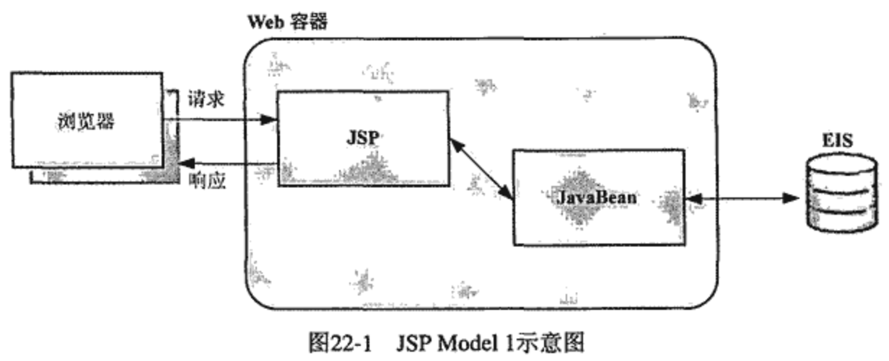

### Servlet 与 JSP 的联盟

JSP完成视图渲染,Servlet处理逻辑,JavaBean对业务逻辑进行封装,得到<font color='cornflowerblue'>JSP Model2.</font>接近Web MVC结构

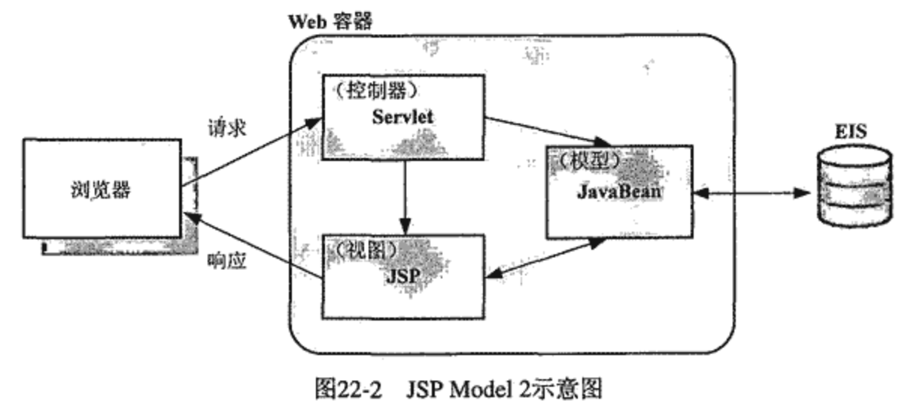

MVC(模型-视图-控制器）  

- 控制器负责接收视图发送的谐求并进行处理 
- 模型通常封装了应用的逻辑以及数据状态   
- 视图是面向用户的接口

  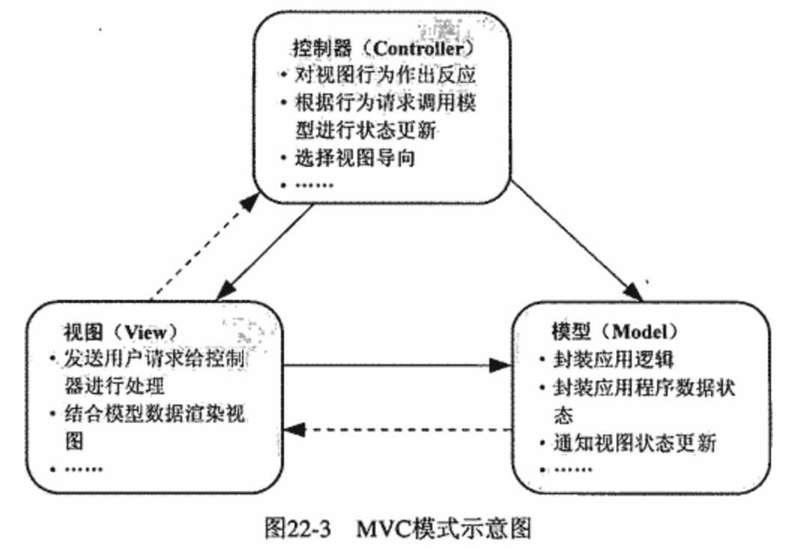

JSP Model 2已经具备了使用MVC模式实现的Web应用架构的雏形， **但并非严格意义上的MVC**  

> 最初意义上的MVC模式:在视图与模型间的数据同步工作是采用从模型Push到视图的形式完成的.
>
> 对于Web应用:限于所用的协议以及使用场景,无法从模型Push数据到视图，控制器与模型进行交互， 在原来通知模型更新应用程序状态的基础上， 还要获取模型更新的结果数据， 然后将更新的模型数据一并转发给视图。   

2中Web MVC策略

- Web应用程序中使用多个Servlet作为控制器。 

  为每个淸求处理流程都定义一个Servlel, 并借助Web容器的URL映射匹配能力来解决Web请求到具体的处理Servlet的映射.

  - 缺点:随者应用规模的增加， web.xml的体积将愈加庞大 

- Web应用程序中使用单一Servlet作为集中控制器。所有的Web处理请求全部经由Web应用程序中定义的这个单一的Servlet控制器来进行 
  - 避免web.xml文件的膨胀， 却将这种<font color='cornflowerblue'>膨胀变相地带到了Servlet控制器类</font>中  
  - <font color='cornflowerblue'>缺乏灵活性和可扩展性</font>,控制器类根据Web请求的URL信息进行分析,以判断处理流程的流向 .一旦写死,要调整URL映射的处理 就得修改Servtet控制器的代码并重新编译,   
  - <font color='cornflowerblue'>复用性差</font>,处理流程的转发逻辑以及其他通用逻辑， 是无法复用到下一个应用程序中

### 当前Web框架

Web框架存在的意义在于， 它们为Web应用程序的幵发提供了一套可复用的基础设施， 开发人员只需要关注特定于每个应用的逻辑开发工怍， 而不需要每次都重复那些可以统一处理的通用逻辑.

**Web框架分类**

- 请求驱动的Web框架:基于Servlet的请求/响应处理模型构建的,以WebMVC模式为指导，典型代表Spring MVC

- 事件驱动的Web框架:框架采用与Swing等GUI开发框架类似的思想,将视图组件化,由视图中的相应组件触发事件,进而驱动整个处理流程。

**Web开发框架对JSP Model2的改进**

由原来的单一Servlet作为整个应用程序的Front Controller。 该Servlet接收到具体的Web处理请求之后， 会参照预先可配置的映射信息， 将待处理的Web处理请求转发给次一级的控制器 (sub-controller) 来处理. 

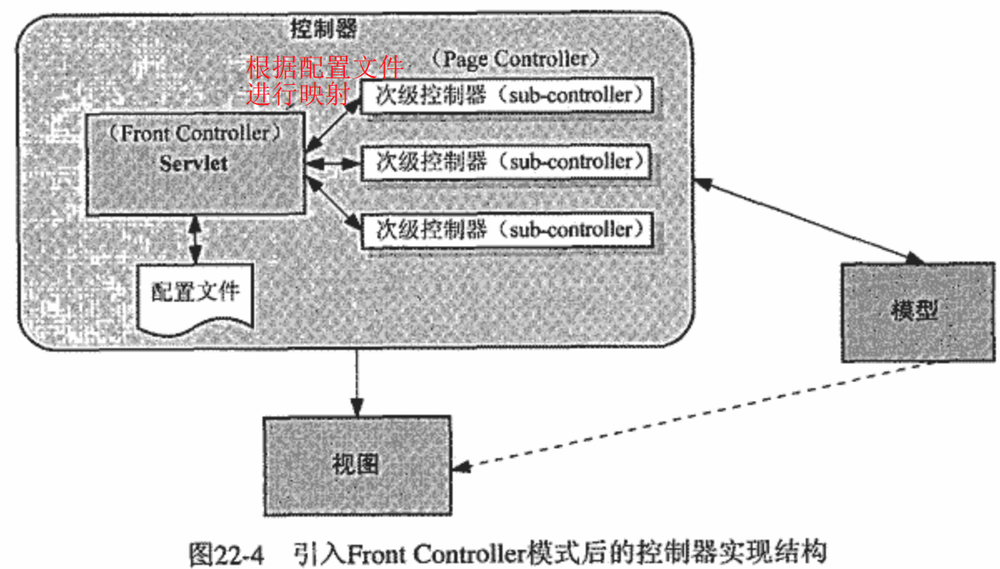

## Spring MVC五大角色

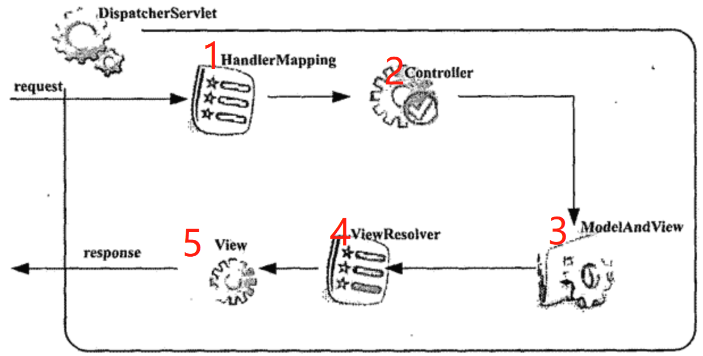

Spring MVC对请求处理期间涉及的各种关注点进行了分离， 并且设置了对应的角色用于处理整个生命周期中的各个关注点  

- HandlerMapping用于处理Web请求与具体请求处理控制器之间的映射匹配
- LocaleResolver用于国际化处理；
- View/Resolver用于灵活的视图选择等

DispatcherServlet的核心方法doDispatch()包含了对以上角色的处理

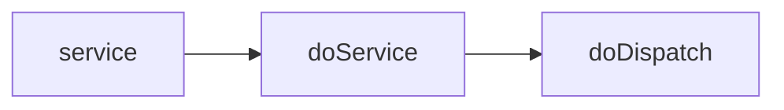
```mermaid
graph LR
A[service]-->B[doService];
B[doService]-->C[doDispatch];
```

```java
protected void doDispatch(HttpServletRequest request, HttpServletResponse response) throws Exception {
    HttpServletRequest processedRequest = request;
    HandlerExecutionChain mappedHandler = null;
    boolean multipartRequestParsed = false;
    WebAsyncManager asyncManager = WebAsyncUtils.getAsyncManager(request);
    try {
        try {
            ModelAndView mv = null;
            Object dispatchException = null;
            try {
                processedRequest = this.checkMultipart(request);
                multipartRequestParsed = processedRequest != request;
                mappedHandler = this.getHandler(processedRequest);
                if (mappedHandler == null) {
                    this.noHandlerFound(processedRequest, response);
                    return;
                }
                HandlerAdapter ha = this.getHandlerAdapter(mappedHandler.getHandler());
                String method = request.getMethod();
                boolean isGet = "GET".equals(method);
                if (isGet || "HEAD".equals(method)) {
                    long lastModified = ha.getLastModified(request, mappedHandler.getHandler());
                    if (this.logger.isDebugEnabled()) {
                       this.logger.debug("Last-Modified value for [" + getRequestUri(request) + "] is: " + lastModified);
                    }
                    if ((new ServletWebRequest(request, response)).checkNotModified(lastModified) && isGet) {
                        return;
                    }
                }
                if (!mappedHandler.applyPreHandle(processedRequest, response)) {
                    return;
                }
                mv = ha.handle(processedRequest, response, mappedHandler.getHandler());
                if (asyncManager.isConcurrentHandlingStarted()) {
                    return;
                }
                this.applyDefaultViewName(processedRequest, mv);
                mappedHandler.applyPostHandle(processedRequest, response, mv);
            } catch (Exception var20) {
                dispatchException = var20;
            } catch (Throwable var21) {
                dispatchException = new NestedServletException("Handler dispatch failed", var21);
            }
            this.processDispatchResult(processedRequest, response, mappedHandler, mv, (Exception)dispatchException);
        } catch (Exception var22) {
            this.triggerAfterCompletion(processedRequest, response, mappedHandler, var22);
        } catch (Throwable var23) {
            this.triggerAfterCompletion(processedRequest, response, mappedHandler, new NestedServletException("Handler processing failed", var23));
      	}
    } finally {
        if (asyncManager.isConcurrentHandlingStarted()) {
            if (mappedHandler != null) {
                mappedHandler.applyAfterConcurrentHandlingStarted(processedRequest, response);
            }
        } else if (multipartRequestParsed) {
            this.cleanupMultipart(processedRequest);
        }
    }
}
```


### Spring MVC 基本架构

**项目的准备**

以web.xml作为出发点， 它是整个Web应用程序_部署描述符文件.

- 加载WebApplicationContext

  在web.xml中通过<listen\>添加了ServletContextListener定义,它将为整个项目加载顶层的WebApplicationContext

  顶层WebApplicrationContext主要用于提供应用所使用的中间层服务,包括数据源 (DalaSoarce) 定义、 数据访问对象 (DAO) 定义、 服务对象 (Services) 定义等  

  WebApplicationContext默认配置文件路径为WEB/INF/applicationContext.xml

- 注册DispatcherServlet

  web.xml中注册的DispatcherServlet对应的默认的配置文件即对应/WEB/INF/<servlet-name\>-servlet.xml  

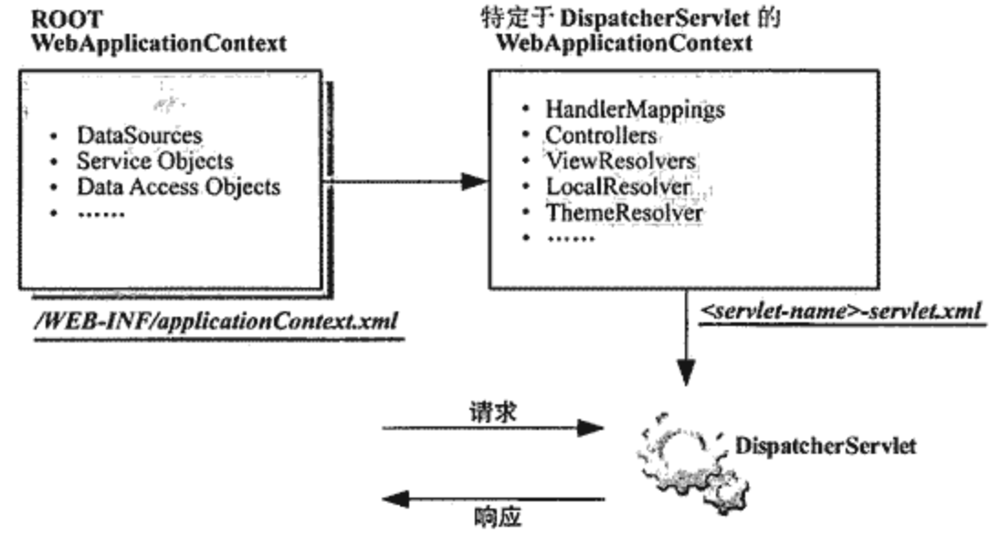

- 注册HandlerMapping,Controller,ViewResolver

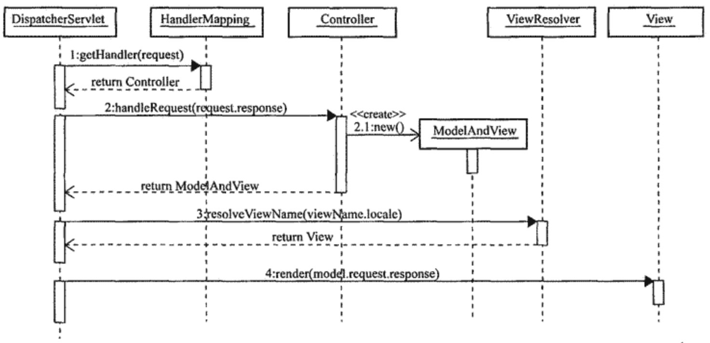

**请求分发**


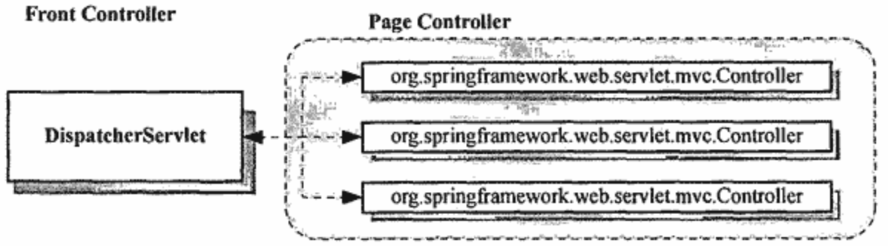


- DispatcherServlet:作为Spring MVC框架中的Front Controller，负责接收并处理所有的Web请求,并委派给它的下一级控制器去实现具体逻辑
- Controller:作为Page Controller

**DispatcherServlet  的工作**

- 获取请求信息， 比如请求的路径、 各种参数值  
- 根据请求信息， 调用具体的服务对象处理具体的Web请求
- 将要在视图中展示的模型数据通过request进行传递， 最后通过 RequestDispatcher选择具体的jsp视图并显示

**HandlerMapping（ Web请求的处理协调者)**

在Web请求到达DispateherServlet之后,Dispatcher将寻求具体的HandlerMapping实例， 以获取对应当前Web请求的具律处理类， 即
Controller

**Controller (Web请求的具体处理者）**  

Controller的处理方法执行完毕之后,将返回一个ModelAndView,其中包括以下信息:

- 视图的逻辑名称 （ 或具体的视图实例）  
- 模型数据  

**ViewResolver和View (视图独立战争的领导者）**  

Spring提出了一套基于ViewResolver和View接口Web视图处理抽象层，以屏蔽Web框架在使用不同的Web视图技术时候的差异性.   

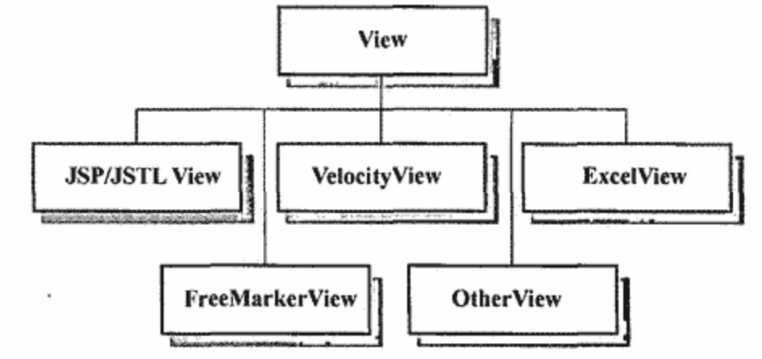

### HandlerMapping

HandlerMapping帮助DispatcherServlet 进行Web请求的URL到具体处理类的匹配

```java
public interface HandlerMapping {
    String BEST_MATCHING_HANDLER_ATTRIBUTE = HandlerMapping.class.getName() + ".bestMatchingHandler";
    String PATH_WITHIN_HANDLER_MAPPING_ATTRIBUTE = HandlerMapping.class.getName() + ".pathWithinHandlerMapping";
    String BEST_MATCHING_PATTERN_ATTRIBUTE = HandlerMapping.class.getName() + ".bestMatchingPattern";
    String INTROSPECT_TYPE_LEVEL_MAPPING = HandlerMapping.class.getName() + ".introspectTypeLevelMapping";
    String URI_TEMPLATE_VARIABLES_ATTRIBUTE = HandlerMapping.class.getName() + ".uriTemplateVariables";
    String MATRIX_VARIABLES_ATTRIBUTE = HandlerMapping.class.getName() + ".matrixVariables";
    String PRODUCIBLE_MEDIA_TYPES_ATTRIBUTE = HandlerMapping.class.getName() + ".producibleMediaTypes";

    @Nullable
    HandlerExecutionChain getHandler(HttpServletRequest var1) throws Exception;
}
```

其中HandlerExecutionChain是被众多Interceptor包裹的Handler  

**常见的HandlerMapping**

- BeanNameUrlHanidlerMapping:保征视图模板中的请求路径必须与容器对应的Handller的beanName—致   

  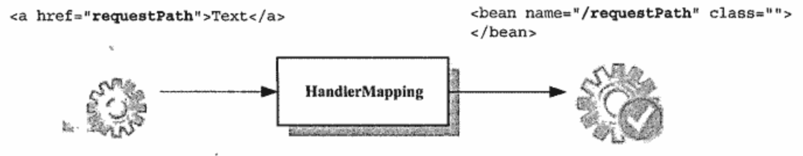

- SimpleUrlHandlerMapping:解除了Controller的BeanName和请求URL之间的耦合

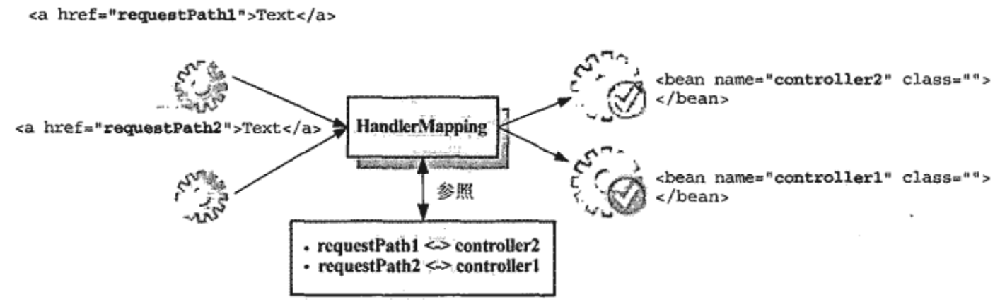

- ControllerClassNameHandlerMapping  

- DefaultAnnotationHandlerMapping:注解配置

**HandlerMapping 执行序列（ Chain Of HandlerMapping)  **

DispatcherServlet在选用HandlerMapping的过程中将根据我们所指定的一系列HandlerMapping的优先级进行排序,然后优先使用优先级在前的HandlerMapping.

```java
public abstract class AbstractHandlerMapping extends WebApplicationObjectSupport implements HandlerMapping, Ordered
```

实际使用的HandlerMapping的优先级规定遵循Spring框架内的Ordered接口所规定的语义,默认有优先级为 Integer.MAX_VALUE.

### Controller  

```java
@FunctionalInterface
public interface Controller {
    @Nullable
    ModelAndView handleRequest(HttpServletRequest var1, HttpServletResponse var2) throws Exception;
}
```

直接实现Controller接口可自定义Web处理过程中的所有关注点， 但这需要我们关注更多底层的细节， 比如请求参数的抽取、 请求编码的设定、 国际化信息的处理、 Session数据的管理等.

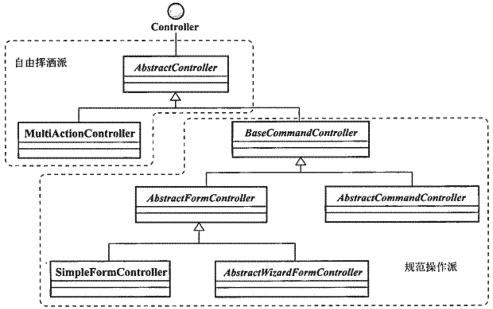

- 自由挥洒派的Controller 

  从HttpServletRequest中获取参数， 然后验证， 调用业务层逻辑， 最终返回一个ModelAndView， 甚
  至可以直接通过HttpServletResponse输出最终的视图.

- 规范操作派的Controller

  以BaseCommandController为首的规范操作派， 对Web处理过程中的某些通用逻辑做了进一步的规范化封装处理  

  - 自动抽取请求参数并绑定到指定的command对象  
  - 提供了统一的数据验证方式  
  - 提供了form表单请求的处理流程

**AbstractController  **

```java
public abstract class AbstractController extends WebContentGenerator implements Controller {
	...
    @Nullable
    public ModelAndView handleRequest(HttpServletRequest request, HttpServletResponse response) throws Exception {
        /**
        通用关注点
        */
        return this.handleRequestInternal(request, response);
    }

    @Nullable
    protected abstract ModelAndView handleRequestInternal(HttpServletRequest var1, HttpServletResponse var2) throws Exception;
}
```

AbstractController类通过<font color='cornflowerblue'>模板方法模式</font>解决了如下几个通用关注点:

- 管理当前Controller所支持的请求方法类型（GET/POST);
- 管理页面的缓存设贯， 即是否允许浏览器缓存当前页面；
- 管理执行流程在会话 (Session) 上的同步  

使用者需要在 AbstractController所 公 开 的handleRequestInternal(request ,response}模板方法中实现具体Web请求处理过程中的其他逻辑  

**MultiActionController**

相比AbstractController,MultiAetionController还提供了以下功能:

- 请求参数到Comcrtand对象的绑定
- 通过Validator的数据验证  
- 细化的异常处理方法  

为了在MultiActionCmtroller中处理多个Web请求， 需要定义多个Web淸求处理方法对应不同Web请求的处理.但Web请求处理方法的签名必须符合一定的要求  

```java
(ModelAndView | Map | void) methodName(HttpServletRequest request, HttpServletResponse
response[,(HttpSession session | Object command)])；
```

方法的返回値有三种类型:

- ModelAndView表示正常的Web处理方法
- Map表明只返回了模型数据， 而没有返回逻辑视图名。 此时将寻求默认的视图名      
- 返回void, 则表明既没有返回模型数据,也没有返回逻辑视图名.此时认为当前Web谘求处理方法自行处理掉了视圈的渲染和输出  
- 返回String, 代表逻辑视图客， 没有相关的模型数据

**MethodNameResolver**让MultiActioinController知道具体哪个Web请求将由哪个方法来处理它

```java
public interfeice MethodNameResolver {
	String getHandlerMethodName(HttpServletRequest request);
}
```

MultiActionController在处理前会获取web请求对应的处理方法

```java
protected ModelAndView handleRequestInternal(HttpServletRequest request, HttpServletResponse response){
    try{
        String methodName = this.methodNameRosolver.getHandlerMethodName(request);
        return invokeNamedMethod(methodName,request,response)；
    catch(NoSuchRequestHandlingMethodException ex){
        return handleNoSuchRequeitHandlingMethod(ex, request);
    }
}
```

**MethodNameResolver**在Spring MVC框架内默认提供了如下三种策略实现:

- InternalPathMethodNameResolver将提取URL最后一个(/) 之后的部分并去除扩展名作为要返回的方法名称  
- PropertiesMethodNameResolver可以指定完全匹配的映射关系 (url→方法)
- parameterMethodNameResolver允许我们根据请求中的某个参数的值作为映射的方法名,也允许我们使用请求中一組参数来映射处理方法名称  

**[BaseCommandController](http://www.blogjava.net/wangajing/archive/2009/11/25/303652.html)(已废弃,被注解代替)**

BaseCommandController与生俱来的两种主要功能:数据绑定,数据验证

1. 数据绑定

   Spring MVC提供的数据绑定功能提取HttpServletRequest中的相应参数， 然后转型为需要的对象类型,即Command对象,此后的Web处理逻辑直接同数据綁定完成的Command对象打交道即可.

   ```
   (1) 在Web请求到达之后,Spring MVC某个框架类将提取当前Web请求中的所有参数名称，然后遍历它， 以获取对应每个参数的值， 获取的参数名与参数值通常放入一个值对象 (PropertyValue)中。最终我们将拥有所有需要绑定的参数和参数値的一个集合（Collection)
   (2) DataBinder将值对象数据根据Command对象中各个域属性定义的类型进行数据转型，然后设置到Command对象上
   	BeanWrapper beanWrapper = new BeanWrapparImp(command);
   	比照参数名与Command对象的属性名对应关系，通过PropertyEditor进行参数值到Conmand对象属性的设置.
   ```

2. 数据验证

   **Validator**负责实现具体的验证逻辑， 而**Errors**负责承载验证过程中出现的错误信息， 二者之间的纽带则由Validator接口定义的主耍验证方法validate(target,errors)

   ```java
   public interface Validator {
       //是否支持类型校验
       boolean supports(Class<?> var1);
   
       void validate(@Nullable Object var1, Errors var2);
   }
   ```

数据绑定和校验流程

  

> 1、创建数据绑定器，在此会创建ServletRequestDataBinder类的对象，此时的command对象是反射产生的空对象；
>
> 2、第一个扩展点，初始化数据绑定器，此处可以覆盖该方法注册自定义的PropertyEditor（请求参数→命令对象属性的转换）；
>
> 3、进行数据绑定，即请求参数→command对象的绑定；
>
> 4、第二个扩展点，数据绑定完成后的扩展点，此处可以实现一些自定义的绑定动作；
>
> 5、验证器对象的验证，验证器通过validators注入，如果验证失败，需要把错误信息放入Errors（此处使用BindException实现）；
>
> 6、第三个扩展点，此处可以实现自定义的绑定/验证逻辑；
>
> 7、将errors传入功能处理方法进行处理，功能方法应该判断该错误对象是否有错误进行相应的处理。

**SimpleFormController **

3. 表单流程处理

   表单处理流程分为:显示表单阶段和处理表单提交阶段

   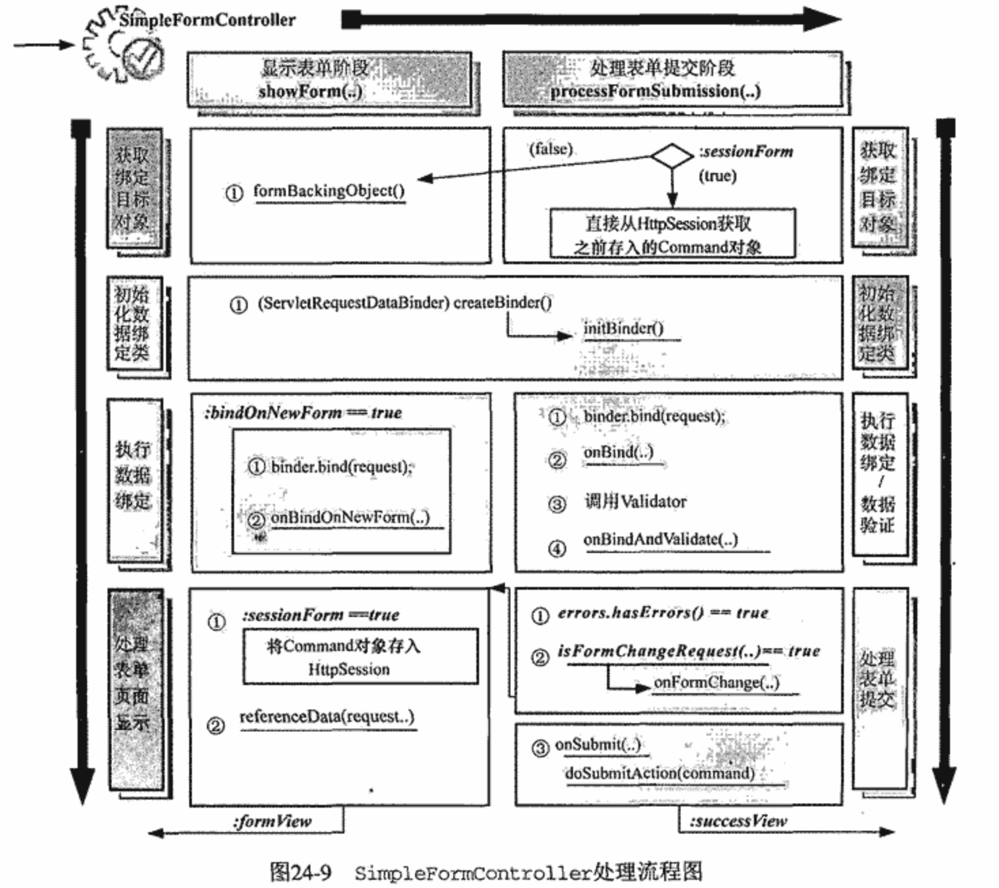


**AbstractWizardFormController  **

AbstractWizardFormController管理多个页面中的数据,每页的一部分数据绑定到一个Commands对象.

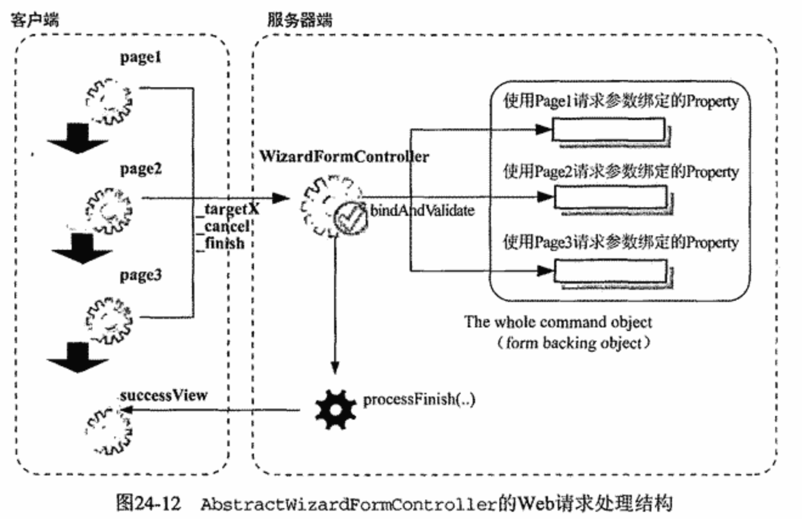

**其他可用的 Controller 实现 **

- AbstractCommandController只需要实现<font color='cornflowerblue'>handle() 模板方法</font>，父类BaseCommandController已经完成了数据绑定和验证.

- ParameterizableViewController只是返回一个只包含指定逻辑视图名的MQdelAndView实例，  
- ServletWrappingController 将Servlet包装成一个Controller
- ServletForwardingController将当前Controller请求转发到一个Servlet

### ModelAndView  

Controller在将Web请求处理完成后， 会返回一个ModelAndView实例

- 视图内容,可以是逻辑视图名称， 也可以是具体的View实例
- 模型数据,视图渲染过程中将会把这些模型数据合并入最终的视图输出  

**ModelAndView 中的视图信息**

DispatcherSerlet对不同ModelAndView返回值的处理:

- View实例: DispatcherServlet将直接从ModelAndView中获取该View实例并渣染视图.

- 逻辑视图名称: DispatcherServlet将寻求ViewResolver的帮助，根据逻辑试图名称获取一个可用的View实例,再渲染视图  
- null:DispatcherServlet认为Controller自行完成了渲染工作

**ModelAndView 中的模型数据  **

ModelAndView以ModelMap的形式来保存模型数据,模型数据将会在视图渲染阶段由具体的View实现类来获取并使用  

### 视图定位器 ViewResolver  

ViewResolver的主要职责是根据Controller所返回的ModelAndview中的逻辑视图名， 为DispatcherServlet返回一个可用的view实例.

```java
public interface ViewResolver{
	View resolveViewName(Spring viewNaame, Locale locale);
}
```

**View的缓存机制**

针对每次请求都重新实例化View将会导致Web应用程序性能上的损失,所以Spring MVC在AbstractCachingViewResolver这一继承层次加入了View实例的缓存功能.

- AbstractCachingViewResolver默认启用View的缓存功能,对于生产环境来说，这是合理的默认值。 
- 如果在测试或开发环境, 我们想即刻反映相应的修改结果， 可以通过setCache(false)暂时关闭AbstractCachingViewResorver的缓存功能 .

**可用的 ViewResolver 实现类  **

1. 面向单一视图类型的ViewResolver

   只要指定一下视图模板所在的位置,这些ViewResolver就会按照逻辑视图名， 抓取相应的模板文件、 构造对应的View实例并返回  

   - InternalResourceViewResolver
   - FreeMarkViewResolver/VelocityViewResolver    
   - JasperReportViewResolver  
   - XsltViewResolver  

2. 面向多视图类型的ViewResolver  

   使用面向多视图类型的ViewResolver， 我们需要逝过某种配置方式明确指定逻辑视图名与具体视图之间的映射关系  

   - [ResourceBundleViewResolver](https://blog.csdn.net/weixin_30251587/article/details/95192115):使用property文件映射
   - XmlviewResolver 
   - BeanNameViewResolver

**ViewResolver查找序列**

DispatcherServlet初始化时， 将根据类型扫描自己的WebApplicationContext中定义的ViewResolverView.

> 如果査找到存在多个ViewResolver的 定 义,DispatcherServlet将根据这些Resolver的优先级(实现Order接口)进行排序， 然后当需要根据逻辑视图名查找具体的View实例的时候， 将按照排序后的顺序遍历’ 这些ViewResolver只要期问任何一个ViewResolver返回非空的View实例， 当前査找即告结束。  

### View  

```java
public interface View {
    String RESPONSE_STATUS_ATTRIBUTE = View.class.getName() + ".responseStatus";
    String PATH_VARIABLES = View.class.getName() + ".pathVariables";
    String SELECTED_CONTENT_TYPE = View.class.getName() + ".selectedContentType";

    @Nullable
    default String getContentType() {
        return null;
    }

    void render(@Nullable Map<String, ?> var1, HttpServletRequest var2, HttpServletResponse var3);
}
```

各种View实现类主要的职责就是在render()方法中实现最终的视图渲染工作，但这对DispatcherServlet透明.可实现多种类型的View

**View 实现原理 **

View的模板方法render()通过模板引擎组合模板和数据合并渲染视图

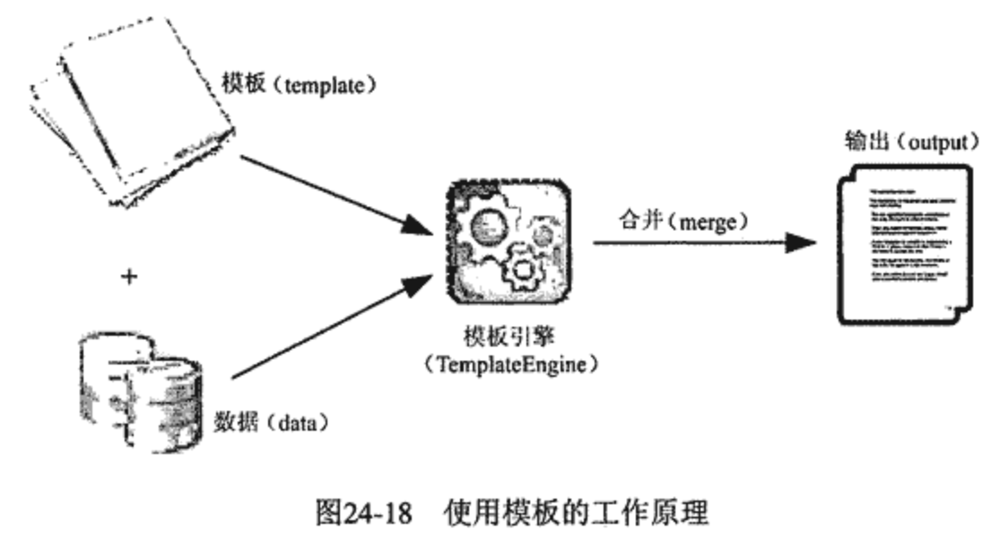

**可用的View实现类**

```java
public abstract class AbstractView extends WebApplicationObjectSupport implements View, BeanNameAware {
    private String contentType = "text/html;charset=ISO-8859-1";
    private String requestContextAttribute;
    private final Map<String, Object> staticAttributes = new LinkedHashMap();
    ...
    public void render(@Nullable Map<String, ?> model, HttpServletRequest request, HttpServletResponse response) throws Exception {
        ...
    }
```

AbstractView的模板化的render()流程:

(1)将添加的静态屈性全部导入到现有的模型数据Map中， 以便后继流程在含并视图模板的时候可以获取这些数据
(2)如果requestContextAfctribute被设置（ 默认为null) ， 则将其一并导入现有的模型数据Map中;
(3)根据是否要产生下载内容， 设置相应的HTTP Header,
(4)公开renderMergedOutpitModel ()模板方法给子类实现  

JSP技术的View实现

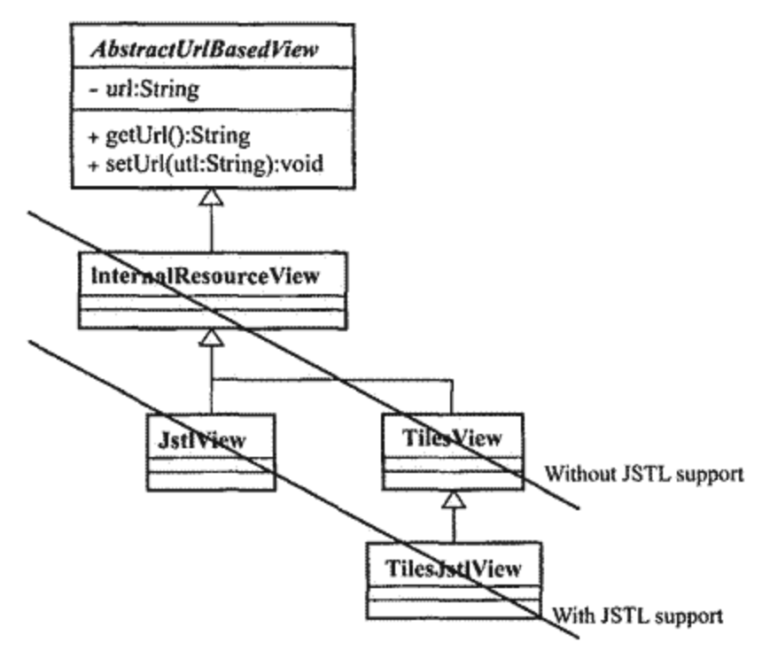

## 其他Spring MVC成员

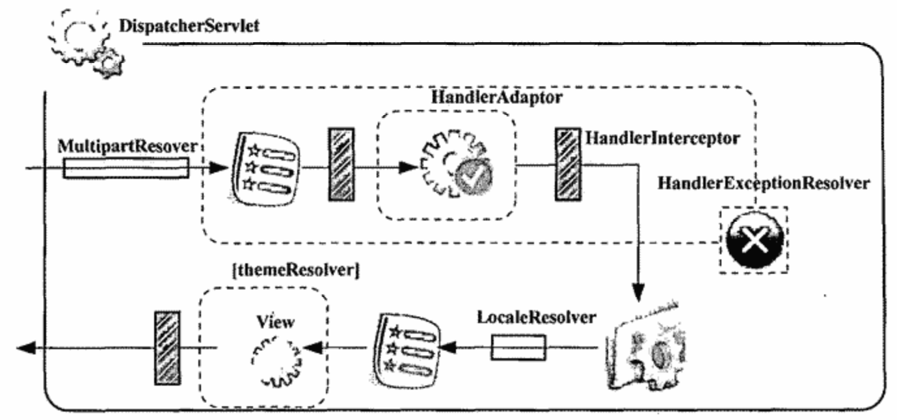

### 文件上传与 MultipartResoIver  

HTML采取的application/x-www-form-uiiencoded编码方式，不能上传文件.RFC 1867增加了multipart/form- data编码方式以支持基于表单的文件上传 .

```java
public interface MultipartResolver {
    boolean isMultipart(HttpServletRequest var1);

    MultipartHttpServletRequest resolveMultipart(HttpServletRequest var1) throws MultipartException;

    void cleanupMultipart(MultipartHttpServletRequest var1);
}
```

如果能够获得一个MultipartResolver的实例，DispatcherServlet将通过MultipartResolver的isMultipart(request)方法检测当前Web请求是否Multipart类型。 

- 是， DispatcherServlet将调用MultipartResolver的resolveMultipart(request)方法，返回—个MultipartHttpServletRequest供后继
  处理流程使用
- 否， 直接返回最初的HttpServletRequest

```java
public interface MultipartRequest {
    Iterator<String> getFileNames();

    @Nullable
    MultipartFile getFile(String var1);

    List<MultipartFile> getFiles(String var1);

    Map<String, MultipartFile> getFileMap();

    MultiValueMap<String, MultipartFile> getMultiFileMap();

    @Nullable
    String getMultipartContentType(String var1);
}
```

服务器可利用将MultipartFile中保存的上传文件存入数据库， 还是写入文件系统， 那就看个人喜好或者应用场景的需要了.

### Handler 与 HandlerAdaptor  

为了能够以统一的方式凋用各种类型的Handler，DispatcharServlet将不同Handler的调用职责转交给了一个称为HandlerAdaptor的角色。

**HandlerAdaptor基本原理**  

```java
public interface HandlerAdapter {
    boolean supports(Object var1);

    @Nullable
    ModelAndView handle(HttpServletRequest var1, HttpServletResponse var2, Object var3) throws Exception;

    long getLastModified(HttpServletRequest var1, Object var2);
}
```

DispatcherServlet从HandlerMapping获得一个Handler之后,将询问HandlerMaptori的supports()方法.如果supports () 返回true,DispateheirServlet 则调用HandlerAdaptor的handle() 方法,同时将刚才的Handier作为参数传入,方法执行后将返回ModalAndView. 

DispatchServlet伪代码

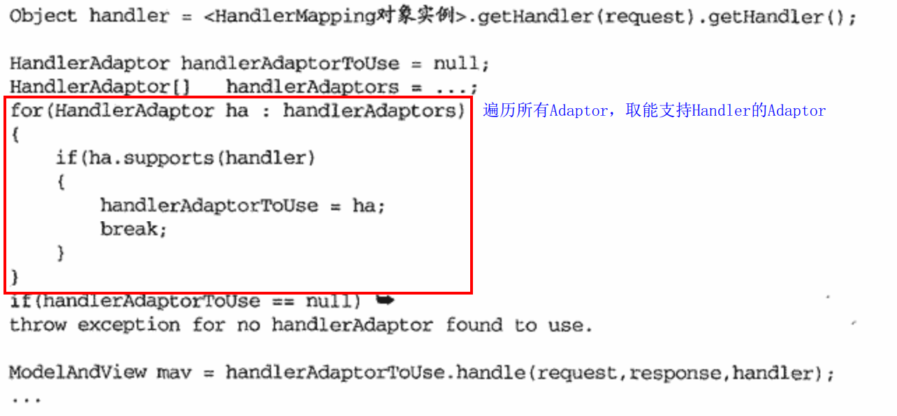

无论我们想在Spring MVC中使用什么类型的Handler, 只要同时为DispatcherServlet提供对应该Handler的HandlerAdaptor的实现,<font color='cornflowerblue'>DispateheirServlet无须任何变动</font>.

**自定义Handler**

自定义Handler不要强制Handier实现任何接口， 仅是一个简单的POJO对象， 只要能有办法知遒该类就是用于Web请求处理的Handler类就行.

> 为自定义的Handler提供必要的HandlerMapping和HandlerAdaptor  

- Controller 将 SimpleControllerHandlerAdaptor作为其HandlerAdaptor
- Spring 2.5提供了特定的DefaultAnnotationHandierMapping处理新提供的基于注解的Handler的查找 ,并添加的基于注解的AnnotationMetbodHandlerAdapter作为其HandlerAdaptor.

### 框架内处理流程拦截与 Handlerlnterceptor 

HandlerExecutionChain是一个数据载体， 包含了两方而的数据

- 用于处理 Web请求的Handler
- 一组随同Handler一起返回的Handlerlnterceptor

HandlerInterceptor定义了如下三个拦截方法:

```java
public interface HandlerInterceptor {
    //preHandle通过boolean返回值表明是否继续执行后继处理流程
    default boolean preHandle(HttpServletRequest request, HttpServletResponse response, Object handler) throws Exception {
        return true;
    }
	//该拦截方法的执行时机为HandlerAdaptor调用具体的Handler处理完Web谘求之后,并且在视图的解析和渲染之前.
    //通过该方法我扪可以获取Handler执行后的结果， 即MbdelAndView
    default void postHandle(HttpServletRequest request, HttpServletResponse response, Object handler, @Nullable ModelAndView modelAndView) throws Exception {
    }
	//在框架内整个处理流程结束之后,或者说视图都染完了之后
    //不管是否发生异常，afterCompletion 拦截方法将被执行
    default void afterCompletion(HttpServletRequest request, HttpServletResponse response, Object handler, @Nullable Exception ex) throws Exception {
    }
}
```

**可用的HandlerInterceptor实现**

UserRoleAuthorizatioDlnterceptor:用户校验

WebContentInterceptor 

- 检查请求方法类型是否在支持方法之列  
- 检查Session实例
- 检查缓存时间并通过设置相应HTTP头（Header) 的方式控制缓存行为

**HandlerInterceptor纳入应用**

HandlerMapping是HandlerInterceptor最终的发源地  (Handlerlnterceptor→HarMaierExecutionChain→HandlerMapping)

> AbstractHandlerMapping提供了setInterceptors( )方法以接受一组指定的HandlerInterceptor实例  

### Handlerlnterceptor 与Filter

Filter是Servlet标准组件,  也能够提供拦截能力.

- Filter拦截在DispatcherServlet之前,HandlerInterceptor在DispatcherServlet之后
- Filter需要在web.xml中配置,由Web容器管理其生命周期

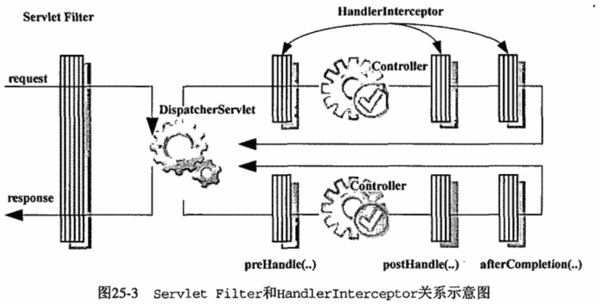

### 框架内的异常处理与 HandlerExceptionResolver  

如果Handler执行过程中没有任何异常， 将以ModelAndView的形式返回后继流程要用的视图和模型数据信息.而一旦出现异常情况, HandlerExceptionResolver将接手异常情况的处理，只不过 处理完成后, 将同样以ModelAndView的形式返回后继处理流程要使用的视图和模型数据.

```java
public interface HandlerExceptionResolver {
    @Nullable
    ModelAndView resolveException(HttpServletRequest var1, HttpServletResponse var2, @Nullable Object var3, Exception var4);
}
```

<font color='red'>HandlerExceptionResolver 对异常的处理范围仅限于Handler查找以及Handler执行期间  </font>


**SimpleMappingExceptionResolver**

SimpleMappingExceptionResolver内部将遍历<font color='cornflowerblue'>exceptionMappings</font>的所有元素， 寻找其中与当前抛出的异常类型“最接近” 的映射项， 并将其对应的值作为错误信息的逻辑视图名， 然后封装到ModelAndView中返回以供后继处理流程使用.

SimpleMappingExceptionResolver定制属性

- defaultErrorView:指定一个默认的错误信息页对应的逻辑视图名

- defaultstatuscode:可以指定异常情況下默认返回给客户端的HTTP状态码  
- mappedHandlers niappedHandlerClasse:指定负责的Handler范围

如果在DispatcherServlet的WebApplicationContext中指定多个HandlerExceptionResoIver实例的话， DispateherServkt将根据它们的优先级顺序(Ordered接口)选取合适的实例执行异常处理  

### 国际化视图与 LocalResolver  

对Locale的进行视图解析过程

- 在DispatcherServlet要处理接收到Web请求之前， 它会将其在初始化时获取的LocaleResolver实例， 以及通过该LocaleResolver解析后的Locale值， 以LocaleContext的形式绑定到当前线程  
- DispateherServlet使用初始化时获取到的LocaleResolver进行Locale的解析，之后ViewResolver就可以使用该LocaleResolver所返回的Locale进行视图查找  

Locale 的变更与 LocaleChangeHandler  

- 要让用户能够变更到芄他语言内容的信息页面,再根据用户提交的请求内容变更Locale值即可
- LocaleChangelnterceptor根据某一个请求参数获取要切换到的Locale,然后通过相应 LocaleResolver的setLocale()替换其默认返回的Locale值

### 管理主题的 ThemeResolver  

主题管理与国际化管理相似,不过处理工具为ThemeResolver和ThemeChangeInterceptor  

## 基于注解的Controller

基于注解的Controller就是一个普通的POJO, 只是使用某些注解附加了一些相关的充数据信息而已.

```xml
<context:component-scan base-package="XXX"/>  
```

### 基于注解的 Controller 原型分析  

两个核心问题

- 如何让Spring MVC框架类（ 其实就是DispatcherServlet) 知道当前Web请求应该由哪个基于注解的Controller处理？
-  如何让Spring MVC框架类知道调用基于注解的Controller的哪个方法来处理具体的Web请求？  

**基于注解的HandlerMapping**

注解信息需要通过java的反射机制来读取,以下为注解HandlerMapping的模型代码

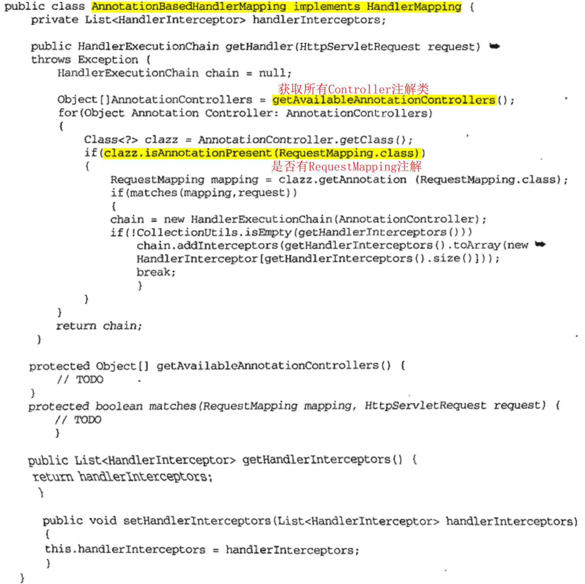

为了能够以统一的方式调用各种类型的Handler,DispatcherServlet需要一个针对基于注解的ControllerHandlerAdaptor实现.以下为SimpleControllerHandlerAdapter 的模型实现

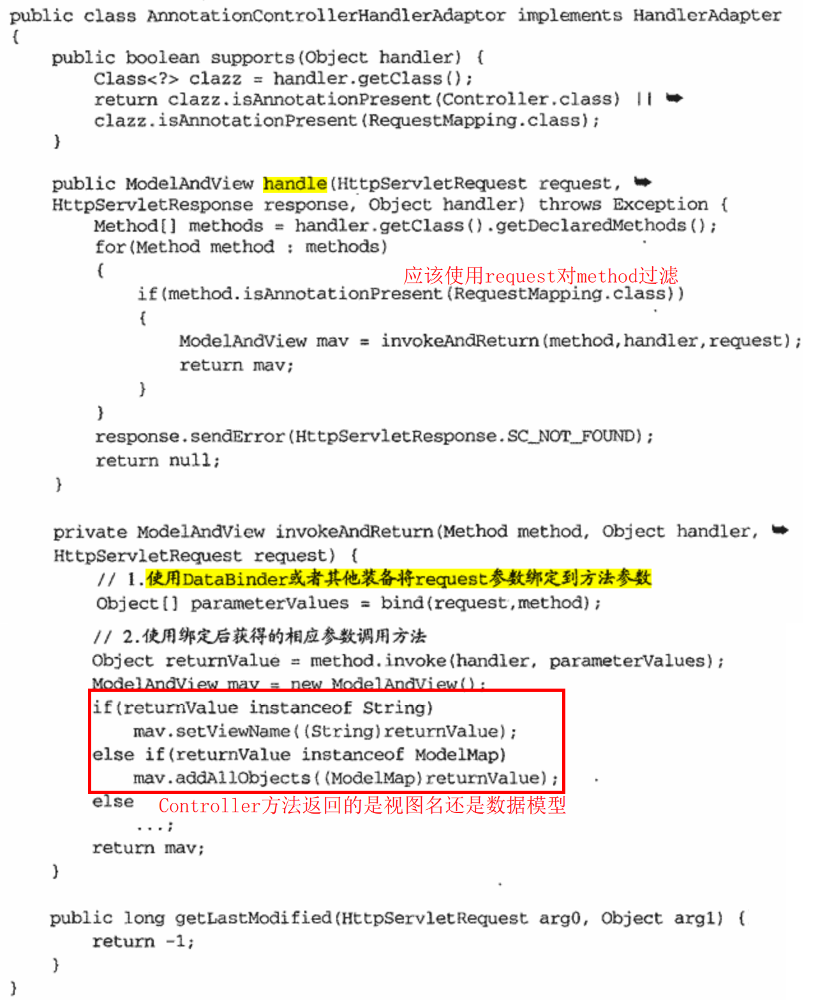 

以上原型还存在许多问题,有待完善(详见p562)

### 基于注解的 Controller 的细节

**声明基于注解的 Controller  **

- @Controller  

  使用 `<context:component-scan/>`之后， 标注了的对象可以被纳入Spring的IoC容器进行管理

  DefaultAnnotationHandlerMapping査找对应的Controller以处理当前Web请求

- @RequestMapping

  标注于类型定义的RequeatMapping提供映射信息， 标注在方法定义的@RequestMapping标志具体的谓求处理方法。   

  @RequestMapping标注的Web请求处理方法可以声明并使用某些特殊类型的方法参数  

  - request/response/session  
  - Locale
  - InputSteam/OutputStream
  - Map/ModelMap

**请求参数到方法参数绑定**

- 默认绑定行为:名称匹配原则
- @RequestParam指定绑定关系
- 添加自定义绑定规则:使用@InitBinder设置PropertyEditor

**@ModelAttribute 访问模型数据  **

- 将@ModelAttribute标注在某个方法上， 该方法所返回的数据将被添加到模型数据中。  
- 如果将@ModelAttribute标注到处理方法的方法参数上,则将从模型数据中取值

**@SessionAttribute 管理 Session 数据  **

@SessionAttribute只应用在类型声明上

-  通过model.addAttribute向session中存数据
-  结合@ModelAttribute取session中的数据到请求方法的参数中

## Convention Over Configuration (惯例大于配置)

**Web请求与Handler之间的约定**

如果没有为DispatcherServlet明确声明一个可用的HandlerMapping实例，那么DispatcherServlet将在初始化的时候默认启用一个<font color='cornflowerblue'>ControllerClassNameHandlerMapping</font>.

- 去除"Controller"后缀的类名作为映射的请求路径
- pathPrefix允许在默认约定规则的基础上， 让相应的Coniroller去处理带有指定路径前缀的请求

**ModelAndView中的约定 **

ModeltodView可以为添加的数据提供一个默认的键(类名首字母小写)来标志它     

**Web请求与视图之间的约定**

当框架内部不能从ModMAndVlew中获取可用的逻辑视图名的时候,由RecjuestToViewNameTranslator根据约定从当前请求的URL中提取。  

# 面试题

## SpringMVC整体流程

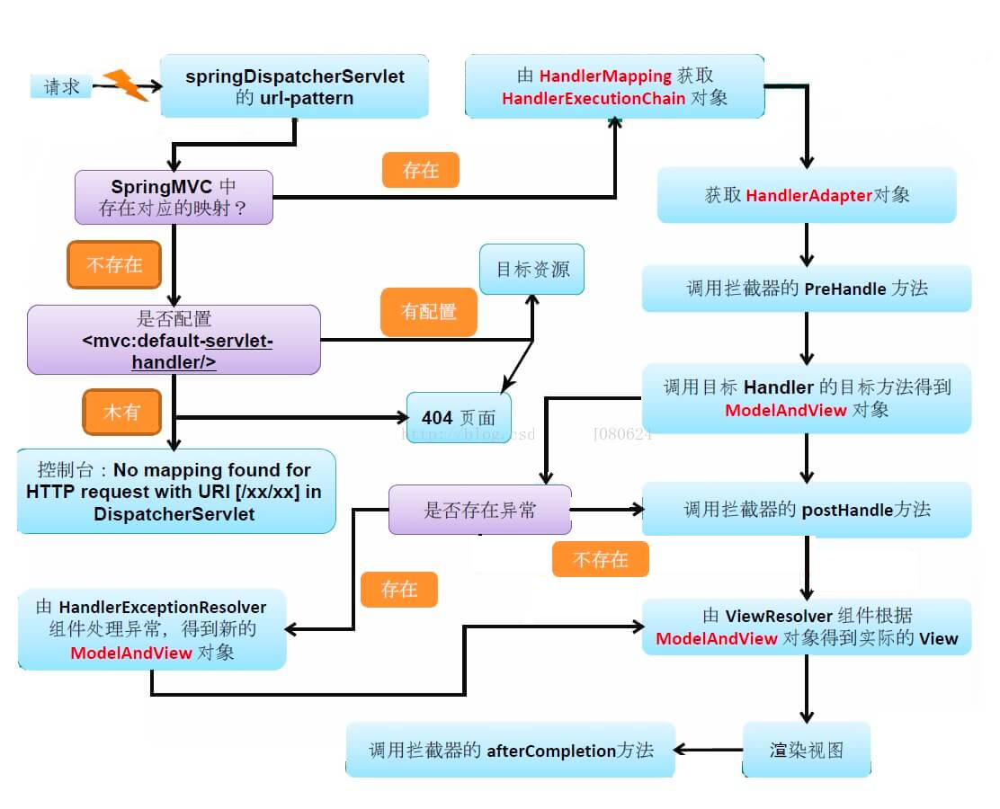

## @Controller 注解有什么用？

`@Controller` 注解，它将一个类标记为 Spring Web MVC **控制器** Controller 。

`@Controller`注解包含了`@Component`,创建bean实例并托管给容器

## @RestController 和 @Controller 有什么区别？

`@RestController` 注解，在 `@Controller` 基础上，增加了 `@ResponseBody` 注解，更加适合目前前后端分离的架构下，提供 Restful API ，返回例如 JSON 数据格式。

具体返回的数据格式，根据客户端的 `"ACCEPT"` 请求头来决定。

## @RequestMapping 注解有什么用？

`@RequestMapping` 注解，用于将特定 HTTP 请求方法映射到将处理相应请求的控制器中的特定类/方法。此注释可应用于两个级别：

- 类级别：映射请求的 URL。
- 方法级别：映射 URL 以及 HTTP 请求方法。

## @RequestMapping 和 @GetMapping 注解的不同之处在哪里？

- `@RequestMapping` 可注解在类和方法上；`@GetMapping` 仅可注册在方法上。
- `@RequestMapping` 可进行 GET、POST、PUT、DELETE 等请求方法；`@GetMapping` 是 `@RequestMapping` 的 GET 请求方法的特例，目的是为了提高清晰度。

## 返回 JSON 格式使用什么注解？

可以使用 **`@ResponseBody`** 注解，或者使用包含 `@ResponseBody` 注解的 **`@RestController`** 注解。

当然，还是需要配合相应的支持 JSON 格式化的 HttpMessageConverter 实现类。例如，Spring MVC 默认使用 MappingJackson2HttpMessageConverter 。

## 介绍一下 WebApplicationContext ？

WebApplicationContext 是实现ApplicationContext接口的子类，专门为 WEB 应用准备的。

- 它允许从相对于 Web 根目录的路径中**加载配置文件**，**完成初始化 Spring MVC 组件的工作**。
- 从 WebApplicationContext 中，可以获取 ServletContext 引用，整个 Web 应用上下文对象将作为属性放置在 ServletContext 中，以便 Web 应用环境可以访问 Spring 上下文。

关于这一块，如果想要详细了解，可以看看如下两篇文章：

- [《精尽 Spring MVC 源码分析 —— 容器的初始化（一）之 Root WebApplicationContext 容器》](http://svip.iocoder.cn/Spring-MVC/context-init-Root-WebApplicationContext/)
- [《精尽 Spring MVC 源码分析 —— 容器的初始化（二）之 Servlet WebApplicationContext 容器》](http://svip.iocoder.cn/Spring-MVC/context-init-Servlet-WebApplicationContext/)

## Spring MVC 的异常处理？

Spring MVC 提供了异常解析器 HandlerExceptionResolver 接口，将处理器( `handler` )执行时发生的异常，解析( 转换 )成对应的 ModelAndView 结果。代码如下：

```
// HandlerExceptionResolver.java
public interface HandlerExceptionResolver {

    /**
     * 解析异常，转换成对应的 ModelAndView 结果
     */
    @Nullable
    ModelAndView resolveException(
            HttpServletRequest request, HttpServletResponse response, @Nullable Object handler, Exception ex);

}
```

- 也就是说，如果异常被解析成功，则会返回 ModelAndView 对象。
- 详细的源码解析，见 [《精尽 Spring MVC 源码解析 —— HandlerExceptionResolver 组件》](http://svip.iocoder.cn/Spring-MVC/HandlerExceptionResolver/) 。

一般情况下，我们使用 `@ExceptionHandler` 注解来实现过异常的处理，可以先看看 [《Spring 异常处理 ExceptionHandler 的使用》](https://www.jianshu.com/p/12e1a752974d) 。

- 一般情况下，艿艿喜欢使用**第三种**。

## Spring MVC 有什么优点？

1. 使用非常**方便**，无论是添加 HTTP 请求方法映射的方法，还是不同数据格式的响应。
2. 提供**拦截器机制**，可以方便的对请求进行拦截处理。
3. 提供**异常机制**，可以方便的对异常做统一处理。
4. 可以任意使用各种**视图**技术，而不仅仅局限于 JSP ，例如 Freemarker、Thymeleaf 等等。
5. 不依赖于 Servlet API (目标虽是如此，但是在实现的时候确实是依赖于 Servlet 的，当然仅仅依赖 Servlet ，而不依赖 Filter、Listener )。

## Spring MVC 怎样设定重定向和转发 ？

- 结果转发：在返回值的前面加 `"forward:/"` 。
- 重定向：在返回值的前面加上 `"redirect:/"` 。

当然，目前前后端分离之后，我们作为后端开发，已经很少有机会用上这个功能了。

## Spring MVC 的 Controller 是不是单例？

绝绝绝大多数情况下，Controller 是**单例**。

那么，Controller 里一般不建议存在**共享的变量**。

## Spring MVC 和 Struts2 的异同？

1. 入口不同
   - Spring MVC 的入门是一个 Servlet **控制器**。
   - Struts2 入门是一个 Filter **过滤器**。
2. 配置映射不同，
   - Spring MVC 是基于**方法**开发，传递参数是通过**方法形参**，一般设置为**单例**。
   - Struts2 是基于**类**开发，传递参数是通过**类的属性**，只能设计为**多例**。

- 视图不同
  - Spring MVC 通过参数解析器是将 Request 对象内容进行解析成方法形参，将响应数据和页面封装成 **ModelAndView** 对象，最后又将模型数据通过 **Request** 对象传输到页面。其中，如果视图使用 JSP 时，默认使用 **JSTL** 。
  - Struts2 采用**值栈**存储请求和响应的数据，通过 **OGNL** 存取数据。

当然，更详细的也可以看看 [《面试题：Spring MVC 和 Struts2 的区别》](http://www.voidcn.com/article/p-ylualwcj-c.html) 一文。

## 详细介绍下 Spring MVC 拦截器？

`org.springframework.web.servlet.HandlerInterceptor` ，拦截器接口。代码如下：

```
// HandlerInterceptor.java

/**
 * 拦截处理器，在 {@link HandlerAdapter#handle(HttpServletRequest, HttpServletResponse, Object)} 执行之前
 */
default boolean preHandle(HttpServletRequest request, HttpServletResponse response, Object handler)
		throws Exception {
	return true;
}

/**
 * 拦截处理器，在 {@link HandlerAdapter#handle(HttpServletRequest, HttpServletResponse, Object)} 执行成功之后
 */
default void postHandle(HttpServletRequest request, HttpServletResponse response, Object handler,
		@Nullable ModelAndView modelAndView) throws Exception {
}

/**
 * 拦截处理器，在 {@link HandlerAdapter#handle(HttpServletRequest, HttpServletResponse, Object)} 执行完之后，无论成功还是失败
 *
 * 并且，只有该处理器 {@link #preHandle(HttpServletRequest, HttpServletResponse, Object)} 执行成功之后，才会被执行
 */
default void afterCompletion(HttpServletRequest request, HttpServletResponse response, Object handler,
		@Nullable Exception ex) throws Exception {
}
```

- 一共有三个方法，分别为：
  - `preHandle(...)` 方法，调用 Controller 方法之**前**执行。
  - `postHandle(...)` 方法，调用 Controller 方法之**后**执行。
  - `afterCompletion(...)`方法，处理完 Controller 方法返回结果之后执行。
    - 例如，页面渲染后。
    - **当然，要注意，无论调用 Controller 方法是否成功，都会执行**。
- 举个例子：
  - 当俩个拦截器都实现放行操作时，执行顺序为 `preHandle[1] => preHandle[2] => postHandle[2] => postHandle[1] => afterCompletion[2] => afterCompletion[1]` 。
  - 当第一个拦截器 `#preHandle(...)` 方法返回 `false` ，也就是对其进行拦截时，第二个拦截器是完全不执行的，第一个拦截器只执行 `#preHandle(...)` 部分。
  - 当第一个拦截器 `#preHandle(...)` 方法返回 `true` ，第二个拦截器 `#preHandle(...)` 返回 `false` ，执行顺序为 `preHandle[1] => preHandle[2] => afterCompletion[1]` 。
- 总结来说：
  - `preHandle(...)` 方法，按拦截器定义**顺序**调用。若任一拦截器返回 `false` ，则 Controller 方法不再调用。
  - `postHandle(...)` 和 `#afterCompletion(...)` 方法，按拦截器定义**逆序**调用。
  - `postHandle(...)` 方法，在调用 Controller 方法之**后**执行。
  - `afterCompletion(...)` 方法，只有该拦截器在 `preHandle(...)` 方法返回 `true` 时，才能够被调用，且一定会被调用。为什么“且一定会被调用”呢？即使 `afterCompletion(...)` 方法，按拦截器定义**逆序**调用时，前面的拦截器发生异常，后面的拦截器还能够调用，**即无视异常**。

------

关于这块，可以看看如下两篇文章：

- [《Spring MVC 多个拦截器执行顺序及拦截器使用方法》](https://blog.csdn.net/amaxiaochen/article/details/77210880) 文章，通过**实践**更加理解。
- [《精尽 Spring MVC 源码分析 —— HandlerMapping 组件（二）之 HandlerInterceptor》](http://svip.iocoder.cn/Spring-MVC/HandlerMapping-2-HandlerInterceptor/) 文章，通过**源码**更加理解。

## Spring MVC 的拦截器可以做哪些事情？

拦截器能做的事情非常非常非常多，例如：

- 记录访问日志。
- 记录异常日志。
- 需要登陆的请求操作，拦截未登陆的用户。
- …

## Spring MVC 的拦截器和 Filter 过滤器有什么差别？

看了文章 [《过滤器( Filter )和拦截器( Interceptor )的区别》](https://blog.csdn.net/xiaodanjava/article/details/32125687) ，感觉对比的怪怪的。艿艿觉得主要几个点吧：

- **功能相同**：拦截器和 Filter都能实现相应的功能，谁也不比谁强。
- **作用节点不同**:拦截器作用于DispatcherServlet之后,Filter作用于DispatcherServlet之前
- **容器不同**：拦截器构建在 Spring MVC 体系中；Filter 构建在 Servlet 容器之上。
- **使用便利性不同**：拦截器提供了三个方法，分别在不同的时机执行；过滤器仅提供一个方法，当然也能实现拦截器的执行时机的效果，就是麻烦一些。

另外，😈 再补充一点小知识。我们会发现，拓展性好的框架，都会提供相应的拦截器或过滤器机制，方便的我们做一些拓展。例如：

- Dubbo 的 Filter 机制。
- Spring Cloud Gateway 的 Filter 机制。
- Struts2 的拦截器机制。

## REST

本小节的内容，基本是基于 [《排名前 20 的 REST 和 Spring MVC 面试题》](http://www.spring4all.com/article/1445) 之上，做增补。

### REST 代表着什么?

REST 代表着抽象状态转移，它是根据 HTTP 协议从客户端发送数据到服务端，例如：服务端的一本书可以以 XML 或 JSON 格式传递到客户端。

然而，假如你不熟悉REST，我建议你先看看 [REST API design and development](http://bit.ly/2zIGzWK) 这篇文章来更好的了解它。不过对于大多数胖友的英语，可能不太好，所以也可以阅读知乎上的 [《怎样用通俗的语言解释 REST，以及 RESTful？》](https://www.zhihu.com/question/28557115) 讨论。

- URL中只使用名词来指定资源
- HTTP动词来实现资源的操作

### 资源是什么?

资源是指数据在 REST 架构中如何显示的。将实体作为资源公开 ，它允许客户端通过 HTTP 方法如：[GET](http://javarevisited.blogspot.sg/2012/03/get-post-method-in-http-and-https.html), [POST](http://www.java67.com/2014/08/difference-between-post-and-get-request.html),[PUT](http://www.java67.com/2016/09/when-to-use-put-or-post-in-restful-web-services.html), DELETE 等读，写，修改和创建资源。

### 什么是安全的 REST 操作?

REST 接口是通过 HTTP 方法完成操作。

- 一些HTTP操作是安全的，如 GET 和 HEAD ，它不能在服务端修改资源
- 换句话说，PUT,POST 和 DELETE 是不安全的，因为他们能修改服务端的资源。

所以，是否安全的界限，在于**是否修改**服务端的资源。

### 什么是幂等操作? 为什么幂等操作如此重要?

有一些HTTP方法，如：GET，不管你使用多少次它都能产生相同的结果，在没有任何一边影响的情况下，发送多个 GET 请求到相同的[URI](http://www.java67.com/2013/01/difference-between-url-uri-and-urn.html) 将会产生相同的响应结果。因此，这就是所谓**幂等**操作。

换句话说，[POST方法不是幂等操作](http://javarevisited.blogspot.sg/2016/05/what-are-idempotent-and-safe-methods-of-HTTP-and-REST.html) ，因为如果发送多个 POST 请求，它将在服务端创建不同的资源。但是，假如你用PUT更新资源，它将是幂等操作。

甚至多个 PUT 请求被用来更新服务端资源，将得到相同的结果。你可以通过 Pluralsight 学习 [HTTP Fundamentals](http://pluralsight.pxf.io/c/1193463/424552/7490?u=https%3A%2F%2Fwww.pluralsight.com%2Fcourses%2Fxhttp-fund) 课程来了解 HTTP 协议和一般的 HTTP 的更多幂等操作。

###  REST 是可扩展的或说是协同的吗?

是的，[REST](http://javarevisited.blogspot.sg/2015/08/difference-between-soap-and-restfull-webservice-java.html) 是可扩展的和可协作的。它既不托管一种特定的技术选择，也不定在客户端或者服务端。你可以用 [Java](http://javarevisited.blogspot.sg/2017/11/top-5-free-java-courses-for-beginners.html), [C++](http://www.java67.com/2018/02/5-free-cpp-courses-to-learn-programming.html), [Python](http://www.java67.com/2018/02/5-free-python-online-courses-for-beginners.html), 或 [JavaScript](http://www.java67.com/2018/04/top-5-free-javascript-courses-to-learn.html) 来创建 RESTful Web 服务，也可以在客户端使用它们。

我建议你读一本关于REST接口的书来了解更多，如：[RESTful Web Services](http://javarevisited.blogspot.sg/2017/02/top-5-books-to-learn-rest-and-restful-web-services-in-java.html) 。

> 艿艿：所以这里的“可拓展”、“协同”对应到我们平时常说的，“跨语言”、“语言无关”。

### REST 用哪种 HTTP 方法呢?

REST 能用任何的 HTTP 方法，但是，最受欢迎的是：

- 用 GET 来检索服务端资源
- 用 POST 来创建服务端资源
- [用 PUT 来更新服务端资源](http://javarevisited.blogspot.sg/2016/04/what-is-purpose-of-http-request-types-in-RESTful-web-service.html#axzz56WGunSwy)
- 用 DELETE 来删除服务端资源。

恰好，这四个操作，对上我们日常逻辑的 CRUD 操作。

> 艿艿：经常能听到胖友抱怨自己做的都是 CRUD 的功能。看了这个面试题，有没觉得原来 CRUD 也能玩的稍微高级一点？！

### 删除的 HTTP 状态返回码是什么 ?

在删除成功之后，您的 REST API 应该返回什么状态代码，并没有严格的规则。它可以返回 200 或 204 没有内容。

- 一般来说，如果删除操作成功，响应主体为空，返回 [204](http://www.netingcn.com/http-status-204.html) 。
- 如果删除请求成功且响应体不是空的，则返回 200 。

### REST API 是无状态的吗?

**是的**，REST API 应该是无状态的，因为它是基于 HTTP 的，它也是无状态的。

REST API 中的请求应该包含处理它所需的所有细节。它**不应该**依赖于以前或下一个请求或服务器端维护的一些数据，例如会话。

**REST 规范为使其无状态设置了一个约束，在设计 REST API 时，您应该记住这一点**。

### REST安全吗? 你能做什么来保护它?

安全是一个宽泛的术语。它可能意味着消息的安全性，这是通过认证和授权提供的加密或访问限制提供的。

REST 通常不是安全的，但是您可以通过使用 Spring Security 来保护它。

- 至少，你可以通过在 Spring Security 配置文件中使用 HTTP 来启用 HTTP Basic Auth 基本认证。
- 类似地，如果底层服务器支持 HTTPS ，你可以使用 HTTPS 公开 REST API 。

### RestTemplate 的优势是什么?

在 Spring Framework 中，RestTemplate 类是 [模板方法模式](http://www.java67.com/2012/09/top-10-java-design-pattern-interview-question-answer.html) 的实现。跟其他主流的模板类相似，如 JdbcTemplate 或 JmsTempalte ，它将在客户端简化跟 RESTful Web 服务的集成。正如在 RestTemplate 例子中显示的一样，你能非常容易地用它来调用 RESTful Web 服务。

> 艿艿：当然，实际场景我还是更喜欢使用 [OkHttp](http://square.github.io/okhttp/) 作为 HTTP 库，因为更好的性能，使用也便捷，并且无需依赖 Spring 库。

### [HttpMessageConverter](https://www.jianshu.com/p/333ed5ee958d) 在 Spring REST 中代表什么?

HttpMessageConverter 是一种[策略接口](http://www.java67.com/2014/12/strategy-pattern-in-java-with-example.html) ，它指定了一个转换器，它可以转换 HTTP 请求和响应。Spring REST 用这个接口转换 HTTP 响应到多种格式，例如：JSON 或 XML 。

每个 HttpMessageConverter 实现都有一种或几种相关联的MIME协议。Spring 使用 `"Accept"` 的标头来确定客户端所期待的内容类型。

然后，它将尝试找到一个注册的 HTTPMessageConverter ，它能够处理特定的内容类型，并使用它将响应转换成这种格式，然后再将其发送给客户端。

### 如何创建 HttpMessageConverter 的自定义实现来支持一种新的请求/响应？

我们仅需要创建自定义的 AbstractHttpMessageConverter 的实现，并使用 WebMvcConfigurerAdapter 的 `#extendMessageConverters(List<HttpMessageConverter<?>> converters)` 方法注中册它，该方法可以生成一种新的请求 / 响应类型。

具体的示例，可以学习 [《在 Spring 中集成 Fastjson》](https://github.com/alibaba/fastjson/wiki/在-Spring-中集成-Fastjson) 文章。

### @PathVariable 注解，在 Spring MVC 做了什么? 为什么 REST 在 Spring 中如此有用？

`@PathVariable` 注解，是 Spring MVC 中有用的注解之一，它允许您从 URI 读取值，比如查询参数。它在使用 Spring 创建 RESTful Web 服务时特别有用，因为在 REST 中，资源标识符是 URI 的一部分。

