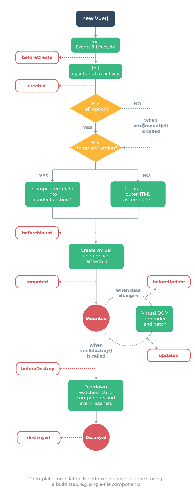
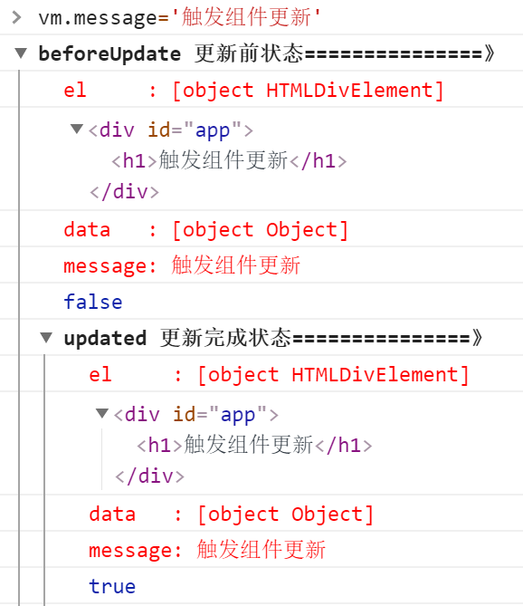
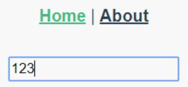

本文参考:

https://segmentfault.com/a/1190000011381906#comment-area

**生命周期图**

**生命周期测试代码**

<!DOCTYPE html>
<html lang="en">
<head>
  <meta charset="UTF-8">
  <meta name="viewport" content="width=device-width, initial-scale=1.0">
  <meta http-equiv="X-UA-Compatible" content="ie=edge">
  <title>vue生命周期学习</title>
  
</head>
<body>
  

    <h1 ref='test'>{{message}}</h1>
  

</body>

<style/>

**输出结果**

**-->beforeCreate**

完成:vue实例初始化

**beforeCreate-->created**

完成:数据观测 (data observer)，property 和方法的运算，watch/event 事件回调

**created-->beforeMount**

完成:更新了DOM的虚拟元素(**el**)

1.**判断对象是否有el选项**

有:继续向下编译

无:停止编译，生命周期停止，直到在该vue实例上被vm.$mount(el)挂载

注释以下代码后,生命周期停止于**created**

el: '#app',

重新挂载后,生命周期继续从beforeMount开始

vm.$mount(el)

**2.判断是否有template选项**

如果vue实例对象中有template参数选项，则将其作为模板编译成render函数。

如果没有template选项，则将外部HTML作为模板编译。

测试代码

<!DOCTYPE html> <html lang="en"> <head>   <meta charset="UTF-8">   <meta name="viewport" content="width=device-width, initial-scale=1.0">   <meta http-equiv="X-UA-Compatible" content="ie=edge">   <title>vue生命周期学习</title>    </head> <body>   
     <!--html中修改的-->     <h1>这是在outer HTML中的</h1>   
 </body>  </html>

**1) template会覆盖html的内容**

**2) 注释以下代码后**

template: "<h1>这是在template中的</h1>",

**3) vue对象的render函数，以createElement作为参数进行渲染操作,直接插入JSX**

render: function(createElement) {    return createElement('h1', 'this is createElement') }

**优先级**:render>template>html

**beforeMounted-->Mounted**

完成:将vue实例挂载到**el**，,并使用data中的值取代{{message}}占位符。

**beforeUpdate与updated**

在控制台输入以下命令,便会先后调用beforeUpdate和updated钩子函数

vm.message = '触发组件更新'

console结果

**mounted-->beforeUpdate**

data发生更新,但重新未渲染

**beforeUpdate-->updated**

重新渲染

**注意****:**

1. 若data中的数据未与组件绑定,则仅更新数据不会触发beforeUpdate与updated.(dom树无更新)
2. updated 不会保证所有的子组件也都一起被重绘。如果你希望等到整个视图都重绘完毕，可以在 updated 里使用 [vm.$nextTick](https://cn.vuejs.org/v2/api/#vm-nextTick)实现延时回调.
3. 如果与updated相关的变量需同步修改，通常最好使用[计算属性](https://cn.vuejs.org/v2/api/#computed)或 [watcher](https://cn.vuejs.org/v2/api/#watch) 取而代之

**beforeDestory-->Destoryed**

Vue 实例指示的对象会解绑定，事件监听器会被移除，子实例也会被销毁。

[**activated与deactivated**](https://blog.csdn.net/weixin_41819098/article/details/89379734)

keep-alive是vue内置的一个组件，用于缓存缓存不活动的组件.

**页面元素:**

<template>
  

    

      <router-link to="/">Home</router-link> |
      <router-link to="/about">About</router-link>
    

    <keep-alive>
      <router-view />
    </keep-alive>
  

</template>

**页面展示:**

Home页面

about

2个页面切换并不会清空另外一个输入框的内容,待切换回页面,原输入的内容仍存在

**keep-alive分析:**

1) 通常,2个页面切换,会发生页面A的销毁与页面B的创建.

2) keep-alive可缓存页面内容,在页面再次被激活时恢复缓存前的状态.

3) keep-alive内的组件不会被销毁和重新创建,对其生命周期操作需要使用**deactivated**与**activated**