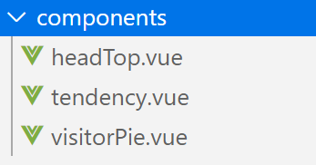
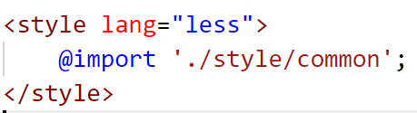

项目来源：https://github.com/bailicangdu/vue2-manage

文章参考：https://www.cnblogs.com/jonalin/p/11510399.html

项目结构梗概



重要的文件

1. build 文件夹，用来存放项目构建脚本
2. config 中存放项目的一些基本配置信息，最常用的就是端口转发
3. node_modules 这个目录存放的是项目的所有依赖，即 npm install 命令下载下来的文件
4. src 这个目录下存放项目的源码，即开发者写的代码放在这里
5. static 用来存放静态资源
6. index.html 则是项目的首页，入口页，也是整个项目唯一的HTML页面
7. package.json 中定义了项目的所有依赖，包括开发时依赖和发布时依赖

其他文件

build文件夹

项目构建(webpack)相关代码

config文件夹

配置目录，包括端口号等。

node_modules

npm 加载的项目依赖模块

src


**api**

api中是vue对后端请求。

```js
import fetch from '@/config/fetch'
/**
 * 登陆
 */
export const login = data => fetch('/admin/login', data, 'POST');
/**
 * 退出
 */
export const signout = () => fetch('/admin/signout');
```

**assets**

assets目录用来存放资产文件:主要包括”**样式**“，“**图像**”，”**js代码**“


assets与static的区别：**(**[**https://www.cnblogs.com/vickylinj/p/12063618.html**](https://www.cnblogs.com/vickylinj/p/12063618.html)**)**

​		<font color='red'>webpack待学习</font>

**components（**[**https://www.cnblogs.com/moqiutao/p/8328931.html**](https://www.cnblogs.com/moqiutao/p/8328931.html)**）**


组件声明


组件引用



组件使用


**page**

放置主要页面的组件。例如登录页、用户信息页等。通常是这里的组件本身写入一些结构，再引入通用模块组件，形成完整的页面；


**router**

router目录下路由默认文件名为 index.js

```js
import Vue from 'vue'
import Router from 'vue-router'
//全局注入插件
Vue.use(Router)
//在es6中可用import login from "@/page/login"代替
//参考资料：https://zhuanlan.zhihu.com/p/82918552
const login = r => require.ensure([], () => r(require('@/page/login')), 'login');
//创建路由对象并配置路由规则
const routes = [
    {
        path: '/',
        component: login
    }
]

export default new Router({
    routes,//引用的别名
    strict: process.env.NODE_ENV !== 'production',
})
```

router使用的3个步骤（main.js)https://www.kancloud.cn/cris/vue12/680418

```js
1.引入router
import router from './router'
2.注册插件
vue.use(router)
3.将插件注入vue实例
new Vue({
    el: '#app',
    router,//引入路由插件
    store,、、引入全局变量存储
    template: '<App/>',
    components: { App }
})
```

**store（**[**https://blog.csdn.net/qq_38658567/article/details/82847758**](https://blog.csdn.net/qq_38658567/article/details/82847758)**）**

store是状态管理目录，此目录名是固定的不可修改

**style**

放置公用的CSS样式


引用样式（可被本地的样式覆盖）


**App.vue**

App.vue 是一个vue组件，这个组件中包含三部分内容：

```js
//1.页面模板
<template>
    <div id="app" class="fillcontain">
            <router-view></router-view>
    </div>
</template>
//2.页面脚本
<script>
    export default {
    }
</script>
//页面样式
<style lang="less">
    @import './style/common';
</style>
```

1. 页面模板

作用：定义页面的 HTML 元素

**<router-view/>**[**https://www.cnblogs.com/bydzhangxiaowei/p/9055484.html#commentform**](https://www.cnblogs.com/bydzhangxiaowei/p/9055484.html#commentform)

作用：展示路由页面。具体展示的内容，要参考路由表。

```js
//1.引入依赖
import Vue from 'vue'
import Router from 'vue-router'
//2.注册组件
Vue.use(Router)
//3.引入组件
const login = r => require.ensure([], () => r(require('@/page/login')), 'login');
//4.创建路由组
const routes = [
    {
        path: '/',
        component: login
    }
]
//5.创建路由管理
export default new Router({
    routes,
    strict: process.env.NODE_ENV !== 'production',
})    
```


**main.js** (https://www.jianshu.com/p/e108ae9d1c88)

main.js是项目的入口文件，**项目中所有的页面都会加载main.js**

main.js主要有三个作用：

1.实例化Vue。 2.全局注入会用到的插件和CSS样式 例如： 网络请求插件:axios和vue-resource、图片懒加载插件：vue-lazyload 3.存储全局变量。例如（用于的基本信息）

main.js示例

```js
import Vue from 'vue'
import App from './App'
import router from './router'
import store from './store/'
import ElementUI from 'element-ui'
import 'element-ui/lib/theme-default/index.css'

Vue.config.productionTip = false;
//注入ElementUI插件
Vue.use(ElementUI);
//页面入口
new Vue({
    el: '#app',
    router,//引入路由插件
    store,、、引入全局变量存储
    template: '<App/>',
    components: { App }
})
```

**vue.use()作用：**[**https://www.jianshu.com/p/89a05706917a**](https://www.jianshu.com/p/89a05706917a)

vue.use()用于为vue.js注册组件，但仅对提供了install的组件才需要注册。

axios插件不需要注册：

Axios本身就不是Vue的组件，是通用化AJAX库，不是为了Vue而存在的，而是$.ajax的替代解决方案。

static

静态资源目录，如图片、字体等

index.html

首页入口文件

package.json

项目配置文件