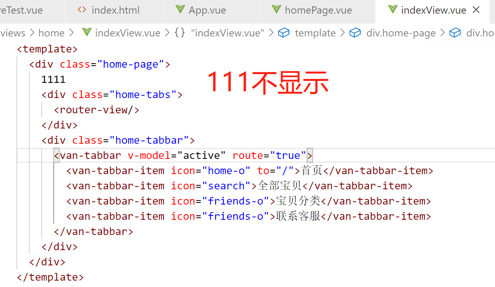

问题1：data数据

对象必须是纯粹的对象 (key/value)：浏览器 API 创建的原生对象，原型上的 property 会被忽略。大概来说，data 应该只能是数据 - 不推荐观察拥有状态行为的对象。

一旦观察过，你就无法在根数据对象上添加响应式 property。因此推荐在创建实例之前，就声明所有的根级响应式 property。

main.js是如何接管index.html的?

为何在浏览器控制台无法访问vm(not defined)

//main.js // The Vue build version to load with the `import` command // (runtime-only or standalone) has been set in webpack.base.conf with an alias. import Vue from 'vue' import App from './App' import router from './router' import customButton from './components/custom-button' import ElementUI from 'element-ui' import 'element-ui/lib/theme-chalk/index.css' Vue.use(ElementUI) Vue.component('custom-button', customButton) Vue.config.productionTip = false /* eslint-disable no-new */ var vm=new Vue({  el: '#app',  router,  components: { App },  template: '<App/>' }) //index.html <!DOCTYPE html> <html>  <head>   <meta charset="utf-8">   <meta name="viewport" content="width=device-width,initial-scale=1.0">   <title>vue-demo</title>  </head>  <body>   

   <!-- built files will be auto injected -->  </body> </html>

问题2：前端布局

divA高度可变，divB（内部为可变长度ul）如何恰好填充剩余页面，且内部ul顺畅滑动。

问题3：补充全局api.md中vue.extend的options

问题4: 深入响应式布局(https://cn.vuejs.org/v2/guide/reactivity.html)

问题5: 自定义指令https://cn.vuejs.org/v2/guide/custom-directive.html

问题6: 全局混入[https://cn.vuejs.org/v2/guide/mixins.html#%E5%85%A8%E5%B1%80%E6%B7%B7%E5%85%A5](https://cn.vuejs.org/v2/guide/mixins.html#全局混入)

问题7: 渲染函数https://cn.vuejs.org/v2/guide/render-function.html

问题8：router-view如何设置仅区域内容变化

