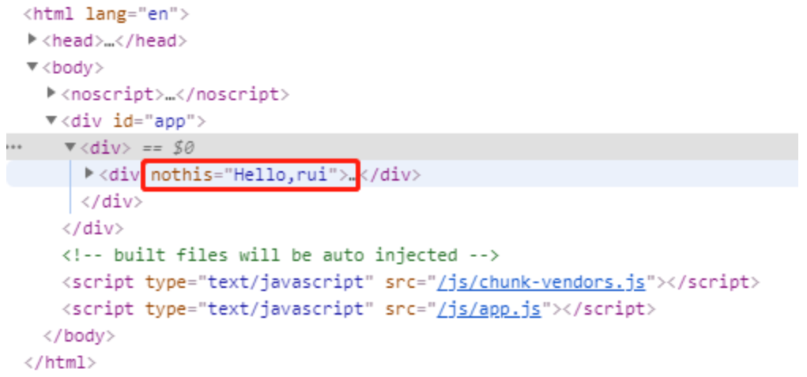

[data](https://cn.vuejs.org/v2/api/#data)

类型：Object | Function

Vue 实例的数据对象。

Vue 递归将 data 的 property 转换为 getter/setter，让 data 的 property 能够响应数据变化。

对象必须是纯粹的对象 (key/value)：浏览器 API 创建的原生对象，原型上的 property 会被忽略。大概来说，data 应该只能是数据 - 不推荐观察拥有状态行为的对象。

一旦观察过，你就无法在根数据对象上添加响应式 property。因此推荐在创建实例之前，就声明所有的根级响应式 property。

数据访问

1.实例创建之后，可以通过 vm.$data 访问原始数据对象。

2.Vue 实例代理了 data 对象上所有的 property,访问 vm.a 等价于访问 vm.$data.a。

3.Vue 实例代理不代理以 _ 或 $ 开头的 property,可能和Vue内置的property,API 方法冲突。

定义组件

1.定义组件时，data 必须声明为function，因为组件可能被用来创建多个实例。

2.若data 仍然是一个纯粹的对象，则所有的实例将共享引用同一个数据对象

3.通过将 vm.$data 传入 JSON.parse(JSON.stringify(...)) 得到深拷贝的原始数据对象。

[props](https://cn.vuejs.org/v2/api/#props)

类型：Array<string> | Object

1.props 可以是数组或对象，用于接收来自父组件的数据。

2.对象允许配置高级选项，如类型检测、自定义验证和设置默认值。

**props大小写问题**

参考内容:https://www.cnblogs.com/jianjie/p/12529424.html

HTML 中的特性名是大小写不敏感的，浏览器会把所有大写字符解释为小写字符。

当使用 DOM 中的模板时，camelCase (驼峰命名法) 的 prop 名(**大小写敏感**)不起作用.

解决方案1:全用小写，不要使用驼峰命名 (不推荐)

- 接收 ： cmsg
- props/读取 ：cmsg

解决方案2： 需要使用其等价的 kebab-case (短横线分隔命名) 命名： (推荐)

- 接收 ： ：c-msg='pmsg'
- props/读取 ： cMsg

**对象语法选项：**

> type：下列原生构造函数(String、Number、Boolean、Array、Object、Date、Function、Symbol、自定义构造函数、数组)
>
> 作用:会检查一个 prop 是否是给定的类型，否则抛出警告。
>
> default：any
>
> 作用:为该 prop 指定一个默认值。对象或数组的默认值必须从一个工厂函数返回。
>
> required：Boolean
>
> 作用:定义该 prop 是否是必填项。在非生产环境中，如果这个值为 truthy 且该 prop 没有被传入的，则一个控制台警告将会被抛出。
>
> validator：Function
>
> 自定义验证函数会将该 prop 的值作为唯一的参数代入。在非生产环境下，如果该函数返回一个 falsy 的值 (也就是验证失败)，一个控制台警告将会被抛出

语法选项示例

```vue
Vue.component('my-component', {
  props: {
    // 基础的类型检查 (`null` 和 `undefined` 会通过任何类型验证)
    propA: Number,
    // 多个可能的类型
    propB: [String, Number],
    // 必填的字符串
    propC: {
      type: String,
      required: true
    },
    // 带有默认值的数字
    propD: {
      type: Number,
      default: 100
    },
    // 带有默认值的对象
    propE: {
      type: Object,
      // 对象或数组默认值必须从一个工厂函数获取
      default: function () {
        return { message: 'hello' }
      }
    },
    // 自定义验证函数
    propF: {
      validator: function (value) {
        // 这个值必须匹配下列字符串中的一个
        return ['success', 'warning', 'danger'].indexOf(value) !== -1
      }
    },
    //自定义构造函数
    proG: Person
  }
})
//自定义构造函数
function Person (firstName, lastName) {
  this.firstName = firstName
  this.lastName = lastName
}
```

[**单向数据流**](https://cn.vuejs.org/v2/guide/components-props.html#单向数据流)

prop 都使得父子 prop 之间形成了一个单向下行绑定,防止子组件意外变更父级组件状态

1.父级组件发生变更时，子组件中所有的 prop 都将会刷新为最新的值。

2.不应该在一个子组件内部改变 prop，否则Vue 会在浏览器的控制台中发出警告。

改变prop的情形

> **1.prop 用来传递一个初始值；子组件希望将其作为一个本地的 prop 数据来使用**
>
> 解决:定义一个本地的 data property 并将这个 prop 用作其初始值
>
> **2.prop 以一种原始的值传入且需要进行转换**
>
> 解决:使用这个 prop 的值来定义一个计算属性

[**非 Prop 的 Attribute**](https://cn.vuejs.org/v2/guide/components-props.html#非-Prop-的-Attribute)

> 1.非 prop 的 attribute 是指传向一个组件，但是该组件并没有相应 prop 定义的 attribute。
>
> 2.组件可以接受任意的 attribute，而这些 attribute 会被添加到这个组件的根元素上

**Attrubute的继承**

参考内容:https://juejin.cn/post/6859256436577271816

**父组件**

```vue
<template>
<div>
  <childDom :hasThis="hasThis" :noThis="noThis"> </childDom>
</div>
</template>
<script>
import childDom from "./sonDom.vue";
export default {
    data() {
      return {
        hasThis: "Hello,world",
        noThis: "Hello,rui",
      };
    },
    components: { childDom },
};
</script>
```

**子组件**

```vue
//sonDom.vue
<template>
<div>
  <p>hasThis:{{ hasThis }}</p>
</div>
</template>
<script>
export default {
name: "son-dom",
props: ["hasThis"],
};
</script>
```

**案例分析**

子组件中没有prop为noThis这个属性，所以继承了父组件的特性,

子组件的props里接收hasThis则DOM中就不会有这个属性。



**替换/合并已有的 Attribute**

1.绝大多数 attribute 来说，从外部提供给组件的值会替换掉组件内部设置好的值

2.class 和 style attribute 会将内外两边的值会被合并起来

**替换**

父组件

```vue
<template>
    <div>
    	<my-component color='blue'></my-component>
    </div>
</template>
<script>
import childDom from "./myComponent.vue";
export default {
    components: { childDom },
};
</script>
```

子组件

```vue
//myComponent.vue
<template>
	<div color='red'>我的最终颜色是蓝色</div>
</template>
<script>
export default {
    name: "my-component"
};
</script>
```

‘父页面’传递进来的color=‘blue’,就会替换掉子组件中的color=‘red’

**合并**

若将以上父/子组件的属性由color改为style/class,属性就会合并,结果如下:

<div class='red blue'>我的最终颜色是蓝色</div>

**禁用Attrubute的继承**

不希望组件的根元素继承 attribute，你可以在组件的选项中设置 inheritAttrs: false

```js
Vue.component('my-component', {
  inheritAttrs: false,
  // ...
})
```

**propsData**

类型：{ [key: string]: any }

只用于 new 创建的实例中。

创建实例时传递 props,作用是方便测试。

代码演示

```js
var Comp = Vue.extend({
  props: ['msg'],
  template: '<div>{{ msg }}</div>'
})

var vm = new Comp({
  propsData: {
    msg: 'hello'
  }
})
```

[**computed**](https://cn.vuejs.org/v2/api/#computed)

类型：{ [key: string]: Function | { get: Function, set: Function } }

**computed的作用**

模板内的表达式非常便利，但设计初衷是用于简单运算的。

以下复杂的逻辑运算应该使用**计算属性**

```js
//模板表达式
<div id="example">
  {{ message.split('').reverse().join('') }}
</div>

//计算属性
<div id="example">
  {{reverseMessage }}
</div>

computed:{
    reverseMessage(){
        return this.message.split('').reverse().join('');
    }
}
```

**computed的特点**

1.计算属性将混入 Vue 实例中。所有 getter 和 setter 的 this 上下文自动地绑定为 Vue 实例。

2.若一个计算属性使用了箭头函数，则 this 不会指向这个组件的实例

3.计算属性的结果会被缓存，除非依赖的响应式 property 变化才会重新计算。

4.若某个依赖在该实例范畴之外 (比如非响应式 property) ，则计算属性是不会被更新的。

非响应式请参考:

[vue中响应式是什么？怎么理解响应式原理?](https://blog.csdn.net/weixin_45959504/article/details/104822982?utm_medium=distribute.pc_aggpage_search_result.none-task-blog-2~all~sobaiduend~default-1-104822982.nonecase&utm_term=vue什么是响应式&spm=1000.2123.3001.4430)

https://www.codenong.com/cs107056433/

**computed的getter与setter**

计算属性默认只有 getter，不过在需要时你也可以提供一个 setter：

```js
// ...
computed: {
  fullName: {
    // getter
    get: function () {
      return this.firstName + ' ' + this.lastName
    },
    // setter
    set: function (newValue) {
      var names = newValue.split(' ')
      this.firstName = names[0]
      this.lastName = names[names.length - 1]
    }
  }
}
// ...
```

运行 vm.fullName = 'John Doe' 时，setter 会被调用，vm.firstName 和 vm.lastName 也会更新。

**计算属性与方法**

```js
//方法实现字符串反转
<div id="example">
  {{ reverseMessage())}}
</div>

methods:{
    reverseMessage(){
        return this.message.split('').reverse().join('');
    }
}
```

计算属性与方法反转字符串的结果相同,但触发重新渲染时的实现不同

计算属性仅在message更新后才重新计算,其余会从缓存中取用

方法每次都会重新计算

### watch

类型：{ [key: string]: string | Function | Object | Array }

键是需要观察的表达式，值是对应回调函数。值也可以是方法名，或者包含选项的对象。

Vue 实例将会在实例化时调用 $watch()，遍历 watch 对象的每一个 property。

代码示例

```js
var vm = new Vue({
  data: {
    a: 1,
    b: 2,
    c: 3,
    d: 4,
    e: {
      f: {
        g: 5
      }
    }
  },
  watch: {
    a: function (val, oldVal) {
      console.log('new: %s, old: %s', val, oldVal)
    },
    // 方法名
    b: 'someMethod',
    // 该回调会在任何被侦听的对象的 property 改变时被调用，不论其被嵌套多深
    c: {
      handler: function (val, oldVal) { /* ... */ },
      deep: true
    },
    // 该回调将会在侦听开始之后被立即调用
    d: {
      handler: 'someMethod',
      immediate: true
    },
    // 你可以传入回调数组，它们会被逐一调用
    e: [
      'handle1',
      function handle2 (val, oldVal) { /* ... */ },
      {
        handler: function handle3 (val, oldVal) { /* ... */ },
        /* ... */
      }
    ],
    // watch vm.e.f's value: {g: 5}
    'e.f': function (val, oldVal) { /* ... */ }
  }
})
vm.a = 2 // => new: 2, old: 1
```


### 计算属性与侦听器

参考内容:https://www.cnblogs.com/jiajialove/p/11327945.html

**计算属性computed :** 

> 1. **支持缓存**，只有依赖数据发生改变，才会重新进行计算
>
> 2. **不支持异步**，当computed内有异步操作时无效，无法监听数据的变化

**侦听属性watch：**

> 1.**不支持缓存**，数据变，直接会触发相应的操作；
>
> 2.**watch支持异步**；
>
> 3.监听的函数接收两个参数，第一个参数是**最新的值**；第二个参数是**输入之前的值**；
>
> 4.监听数据必须是data中声明过或者父组件传递过来的props中的数据
>
> 5.当数据变化时，触发其他操作，函数有两个参数，
>
> 　　**immediate**：组件加载立即触发回调函数执行，
>
> 　　**deep**: 深度监听，为了发现**对象内部值**的变化;只有以响应式的方式触发才会被监听到。

**watch适用于数据变化时执行异步或开销较大的操作**

### methods

类型：{ [key: string]: Function }

1.methods 将被混入到 Vue 实例中。可通过 VM 实例访问这些方法，或者在指令表达式中使用。

2.方法中的 this 自动绑定为 Vue 实例。不应该使用箭头函数来定义 method 函数 (例如 plus: () => this.a++)。理由是箭头函数绑定了父级作用域的上下文，所以 this 将不会按照期望指向 Vue 实例，this.a 将是 undefined。