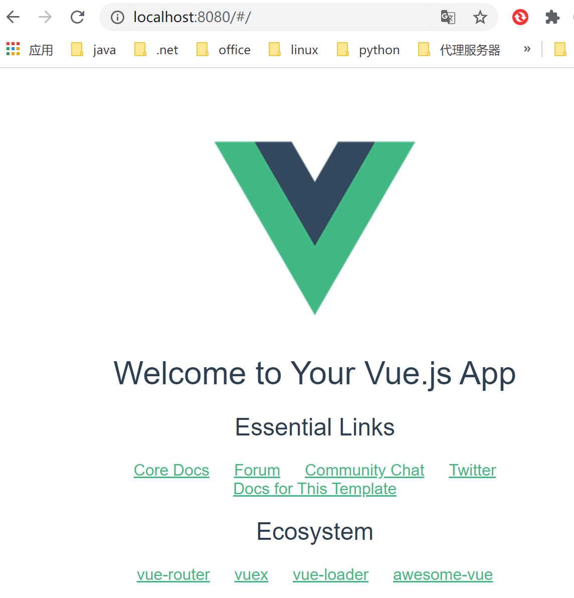

nodejs安装

\1. nodejs下载

下载地址：https://nodejs.org/zh-cn/


2.安装nodejs



3.配置环境变量


4.安装成功验证


vscode安装与配置

1.vscode安装

vscode官网：https://code.visualstudio.com/


下载成功后安装

2.插件安装


插件推荐：https://www.jianshu.com/p/3eebde5748a6

创建一个vue项目（https://www.cnblogs.com/hellman/p/10985377.html）

安装vue-cli

vue-cli是一个专门为单页面应用快速搭建繁杂的脚手架，它可以轻松的创建新的应用程序而且可用于自动生成vue和webpack的项目模板。

　　

```js
npm install --global vue-cli
```

创建 webpack 模板的新项目

```js
vue init webpack vue-demo
//设置项目名称
? Project name vue-demo
//设置项目描述
? Project description A Vue.js project
//设置项目作者
? Author mzw
//设置打包方式
? Vue build standalone
//安装vue-router
? Install vue-router? Yes
//代码检查
? Use ESLint to lint your code? Yes
? Pick an ESLint preset Standard
//单元测试
? Set up unit tests Yes
? Pick a test runner jest
//端到端测试工具
? Setup e2e tests with Nightwatch? Yes
```

项目结构


安装依赖

cnpm i

安装依赖后,项目结构中会出现node_modules文件夹


启动项目并访问

```js
npm run dev //Your application is running here: http://localhost:8080
```

