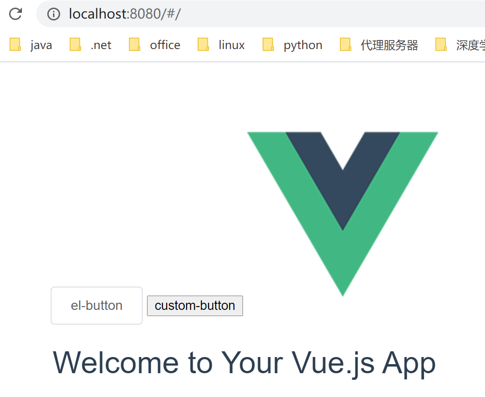
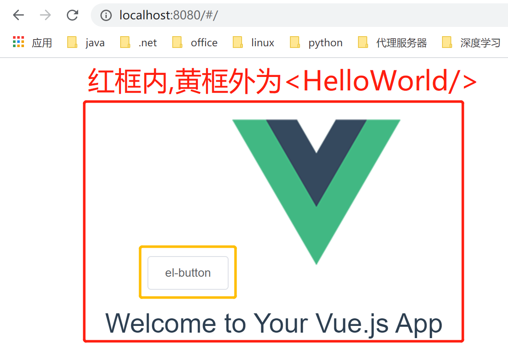

[**组件**](https://www.runoob.com/vue2/vue-component.html)

组件（Component）是 Vue.js 最强大的功能之一

组件可以扩展 HTML 元素，封装可重用的代码。

**vue引入外部组件(**[**以elementUI为例**](https://element.eleme.cn/#/zh-CN/component/quickstart)**)**

安装依赖

npm i element-ui -S

\1. 全局引入

在src/main.js中引入依赖并注册组件

//引入依赖 import ElementUI from 'element-ui' import 'element-ui/lib/theme-chalk/index.css' //注册组件 Vue.use(ElementUI)

在package.json中添加依赖

"dependencies": {  "vue": "^2.5.2",  "vue-router": "^3.0.1",  "element-ui": "^2.14.1" }

注意： 配置按需引入后，将不允许直接导入所有组件。 

\2. 自动按需引入

安装插件

npm i babel-plugin-import -D

配置插件

// 注意：webpack 1 无需设置 libraryDirectory {  "plugins": [    ["import", {        "libraryName": 'element-ui',        "styleLibraryName": "theme-chalk"    }]  ] } // 对于使用 babel7 的用户，可以在 babel.config.js 中配置 module.exports = {  plugins: [    ['import', {      "libraryName": 'element-ui',      "styleLibraryName": "theme-chalk"    }, 'element-ui']  ] };

按需引入

import { Button } from 'element-ui';

3.手动按需引入

import Button from 'element-ui/lib/button'; import 'element-ui/lib/button/style';

在App.vue中使用elementUI

<template>
    
 
        <el-button>el-button</el-button>
        
        <router-view/> 
    
 
</template>

效果展示

CDN快速使用elementUI

[CDN](http://https://zhuanlan.zhihu.com/p/39028766)是内容分发网络，作用是减少传播时延，寻找最近的节点.

**自定义组件**

组件名

 kebab-case

引用这个自定义元素时使用 kebab-case， <my-component-name>

Vue.component('my-component-name', { /* ... */ })

PascalCase

引用这个自定义元素时可使用 <my-component-name> 和 <MyComponentName>

直接在 DOM (即非字符串的模板) 中使用时只有 kebab-case 是有效的

Vue.component('MyComponentName', { /* ... */ })

全局组件

使用**Vue.component('组件名',{**[**选项**](https://cn.vuejs.org/v2/api/#选项-数据)**})**注册全局组件

\1. 在单一文件中注册组件

Vue.component('custom-button',{  data:function(){   return{    msg : "custom-button"   }  },  template:'<button>{{msg}}</button>', })

\2. 引入文件作为组件选项

在src/components中编写custom-button.vue

<template>  
    <button>{{msg}}</button>
</template> 

在src/main.js中引用并注册组件

Vue.component('custom-button',customButton)

注意:组件被定义，data 必须声明为返回一个初始数据对象的函数，因为组件可能被用来创建多个实例。如果 data 仍然是一个纯粹的对象，则所有的实例将共享引用同一个数据对象！通过提供 data 函数，每次创建一个新实例后，我们能够调用 data 函数，从而返回初始数据的一个全新副本数据对象。

使用**Vue.extend()**注册全局组件

https://blog.csdn.net/s1879046/article/details/84677223

https://segmentfault.com/a/1190000016125184

使用组件

在App.vue中使用组件

<template>  
    
   
        <el-button>el-button</el-button>  
        <custom-button/>  
           
        <router-view/> 
    
 
</template> 
 
<style/>

效果展示

**局部组件**

全局注册组件若不被使用,仍然会被包含在 webpack 最终的构建结果.

1.使用文件中定义并使用

定义组件

var ComponentA = { /* 选项 */ }

在components中定义使用的组件

new Vue({  el: '#app',  components: {    'component-a': ComponentA  } })

\2. 在其他文件定义(src/component)中,并在使用文件中引入

定义组件

引入组件并使用

import Vue from 'vue' import Router from 'vue-router' import HelloWorld from '@/components/HelloWorld' Vue.use(Router) export default new Router({  routes: [   {    path: '/',    name: 'HelloWorld',    component: HelloWorld   }  ] })

App.vue显示自定义组件

<router-view/>的位置会被路由结果代替,相当于<HelloWorld/>

<template> 
    

        <el-button>el-button</el-button>
           
        <router-view/>
    

</template>

效果展示

