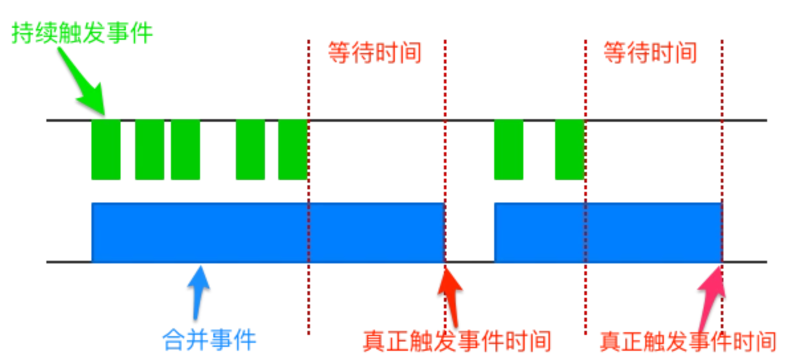
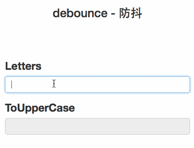
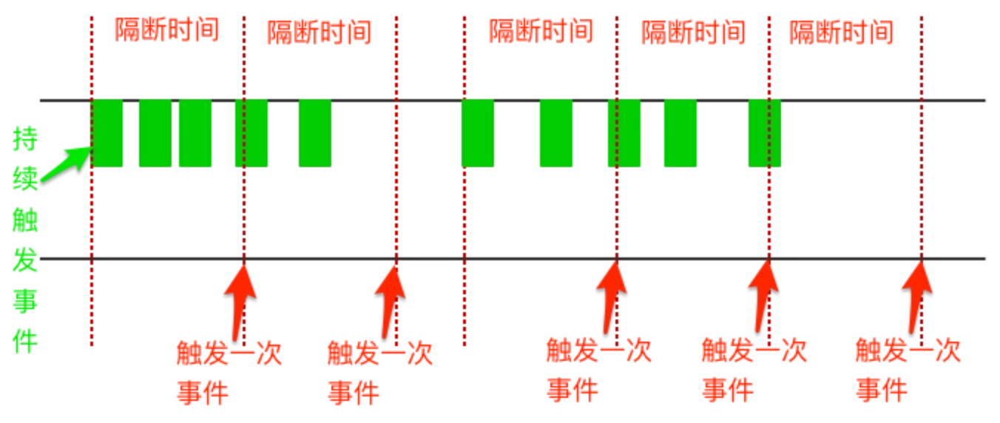
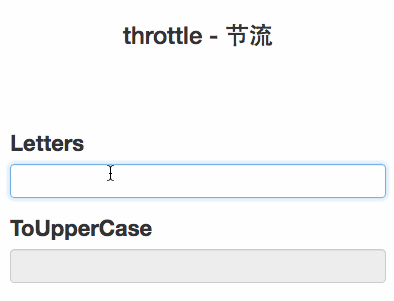

参考内容:https://segmentfault.com/a/1190000005926579

防抖与节流测试:http://ipluser.github.io/speechless/public/view/js/debounce-throttle.html

**防抖和节流的作用**

频繁请求导致的问题

1.窗口的resize、scroll，输入框内容校验等操作时，如果这些操作处理函数较为复杂或页面频繁重渲染等操作时,会加重浏览器的负担，导致用户体验非常糟糕。

2.后台请求列表信息时,若频繁请求,则可能出现重复的结果.

采用**debounce(防抖)**和**throttle(节流)**的方式来减少触发的频率，又不影响实际效果。

**防抖**

防抖的思想



当持续触发事件时，**debounce**会合并事件且不会去触发事件，当一定时间内没有触发这个事件时，才真正去触发事件

防抖的简单实现

```vue
function debounce(fn, delay) {
  var ctx;
  var args;
  var timer = null;

  var later = function () {
    fn.apply(ctx, args);
    // 当事件真正执行后，清空定时器
    timer = null;
  };

  return function () {
    ctx = this;
    args = arguments;
    // 当持续触发事件时，若发现事件触发的定时器已设置时，则清除之前的定时器
    if (timer) {
      clearTimeout(timer);
      timer = null;
    }

    // 重新设置事件触发的定时器
    timer = setTimeout(later, delay);
  };
}
```

防抖效果展示



**防抖案例**

如下代码,频繁点击button可能导致ul中出现多条重复的数据,这是因为连续的点击同时进入了代码6行,导致list中存在多条数据.

```js
<ul>
    <li v-for="item in list>item</li>
<ul>
<button @click="getList">获取信息</button>
getlist(){
    this.list=[];
    this.list.push("测试数据");
}    
```

   

若使用disabled属性阻止button连续被点击,但连续点击扔可能同时进入代码6行,若连续的点击髂后进入代码10行,仍会出现重复数据,但几率大大减小.

```js
<ul>
    <li v-for="item in list>item</li>
<ul>
<button @click="getList" :disabled="clicked">获取信息</button>
getlist(){
    if(clicked){
        return;
    }
    clicked=true;
   this.list=[];
   this.list.push("测试数据");
   clicked=false;
}    
```

  

使用防抖算法后,refreshList()原子化,在500ms内即使重复触发也仅执行最后一次,不在会出现连续点击同时进入代码13行的问题.

```
<ul>
    <li v-for="item in list>item</li>
<ul>
<button @click="getList" :disabled="clicked">获取信息</button>

created(){
    this.debouncedRefreshList=debounce(refreshList,500);
}
getlist(){
    this.debouncedRefreshList();
}    
refreshList(){
    this.list=[];
    this.list.push("测试数据");
}
```

**节流**

节流的思想



throttle（节流），当持续触发事件时，保证间隔时间触发一次事件。

节流的简单实现

```js
function throttle(fn, delay) {
  var ctx;
  var args;
  // 记录上次触发事件
  var previous = Date.now();

  var later = function () {
    fn.apply(ctx, args);
  };

  return function () {
    ctx = this;
    args = arguments;
    var now = Date.now();

    // 如果隔间时间超过设定时间，即再次设置事件触发的定时器
    if (now - previous>= delay) {
       if (timer) {
         clearTimeout(timer);
         timer = null;
       }       
       fn.apply(ctx, arg);
       previous= now;
    } else if (!timer) {
       timer = setTimeout(function(){
                fn.apply(ctx, arg);    
                timer = null;
        }, delay)
    }
  };
}
```

节流效果展示

