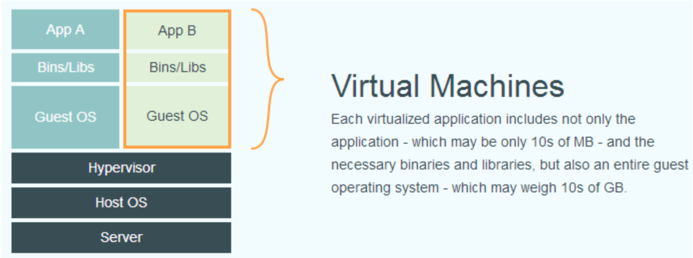
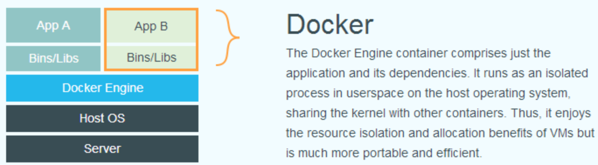
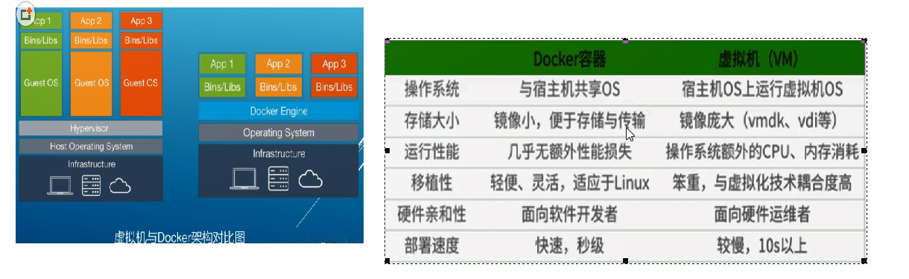
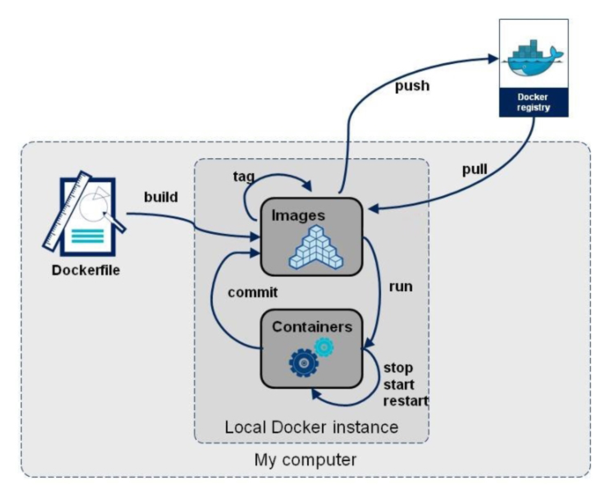

# Docker  

学习目标：

- 掌握Docker基础知识，能够理解Docker镜像与容器的概念

- 完成Docker安装与启动

- 掌握Docker镜像与容器相关命令

- 掌握Tomcat Nginx 等软件的常用应用的安装

- 掌握docker迁移与备份相关命令

- 能够运用Dockerfile编写创建容器的脚本

- 能够搭建与使用docker私有仓库

  


# 1 Docker基础

## 1.1 什么是虚拟化

​	在计算机中，虚拟化是一种资源管理技术，是将计算机的各种实体资源，如服务器、网络、内存及存储等，予以抽象、转换后呈现出来，打破实体结构间的不可切割的障碍，使用户可以比原本的组态更好的方式来应用这些资源。这些资源的新虚拟部份是不受现有资源的架设方式，地域或物理组态所限制。

​	在实际的生产环境中，虚拟化技术主要用来解决高性能的物理硬件产能过剩和老的旧的硬件产能过低的重组重用，<font color='cornflowerblue'>透明化底层物理硬件</font>，从而最大化的利用物理硬件   对资源充分利用。

​	虚拟化技术种类很多，例如：软件虚拟化、硬件虚拟化、内存虚拟化、网络虚拟化(vip)、桌面虚拟化、服务虚拟化、虚拟机等等。

## 1.2 什么是Docker

​	Docker 项目的目标是实现轻量级的操作系统虚拟化解决方案。 Docker 的基础是 Linux 容器（LXC）等技术。

​	在 LXC 的基础上 Docker 进行了进一步的封装，让用户不需要去关心容器的管理，使得操作更为简便。用户操作 Docker 的容器就像操作一个快速轻量级的虚拟机一样简单。

**Docker出现的原因**

一款产品从开发到上线，从操作系统，到运行环境，再到应用配置。作为开发+运维之间的协作我们需要关心很多东西，这也是很多互联网公司都不得不面对的问题，特别是各种版本的迭代之后，不同版本环境的兼容，对运维人员都是考验

**Docker**之所以发展如此迅速，也是因为它对此给出了一个标准化的解决方案。

> Docker透过镜像(images)将作业系统核心除外，运作应用程式所需要的系统环境，由下而上打包，达到应用程式跨平台间的无缝接轨运作

**Docker理念**

Docker通过对应用组件的封装、分发、部署、运行等生命期的管理，使用户的APP (或WEB应用或数据库应用等等)及其运行环境能够做到“**一次封装，到处运行**”。

> 将应用运行在Docker容器上面，而Docker容器在任何操作系统上都是一致的，这就实现了跨平台、跨服务器。**只需要一次配置好环境，换到别的机器上就可以一键部署好，大大简化了操作**

**Docker的优点**

（1）上手快。

​	用户只需要几分钟，就可以把自己的程序“Docker化”。Docker依赖于“[<font color='cornflowerblue'>写时复制</font>](https://www.cnblogs.com/woshimrf/p/docker-container-lawyer.html)”（copy-on-write）模型，修改应用程序也非常迅速，随后就可以创建容器来运行应用程序了。由于去除了管理程序的开销，Docker容器拥有很高的性能，同时同一台宿主机中也可以运行更多的容器，使用户尽可能的充分利用系统资源。

（2）屏蔽环境差异

​	使用Docker，开发人员只需要关心容器中运行的应用程序，而运维人员只需要关心如何管理容器。Docker设计的目的就是要加强开发人员写代码的开发环境与应用程序要部署的生产环境一致性。从而降低开发，测试，运维的环境差异。

（3）快速高效的开发生命周期

​	Docker的目标之一就是缩短代码从开发、测试到部署、上线运行的周期，让你的应用程序具备可移植性，易于构建，并易于协作。

（4）使用面向服务的架构

​	Docker还鼓励面向服务的体系结构和微服务架构。Docker推荐单个容器只运行一个应用程序或进程，这样就形成了一个分布式的应用程序模型，在这种模型下，应用程序或者服务都可以表示为一系列内部互联的容器，从而使分布式部署应用程序，扩展或调试应用程序都变得非常简单，同时也提高了程序的内聚性。

## 1.3 容器与虚拟机比较

​	下面的图片比较了 Docker 和传统虚拟化方式的不同之处，可见容器是在操作系统层面上实现虚拟化，直接复用本地主机的操作系统，而传统方式则是在硬件层面实现。

#### 传统的虚拟机技术



虚拟机**(virtual machine)**就是带环境安装的一种解决方案。

- 它可以在一种操作系统里面运行另一种作系统。应用程序对此毫无感知，因为虚拟机看上去跟真实系统一模一样，而对于底层系统来说，虚拟机就是一个普通文件，不需要了就删掉，对其他部分毫无影响。

- 这类虚拟机完美的运行了另一套系统，能够使应用程序，操作系统和硬件三者之间的逻辑不变。

虚拟机的缺点:

- 资源占用多

- 冗余步骤多

- 启动慢

#### 容器虚拟化技术



由于前面虛拟机存在这些缺点，**Linux** 发展出了另一种虚拟化技术: **Linux 容器**(Linux Containers,缩为LXC)。

**Linux容器不是模拟一个完整的操作系统**，而是对进程进行隔离。有了容器，就可以将软件运行所的所有资源打包到一个隔离的容器中。容器与虚拟机不同，不需要捆绑一整套操作系统，只需要软件工作所需的库资源和设置。系统因此而变得高效轻量并保证部署在任何环境中的软件都能始终如一地运行。

**Docker**和传统虚拟化方式的不同之处:

- 传统虚拟机技术是虚拟出一套硬件后，在其上运行一个完整操作系统，在该系统上再运行所需应用进程；而容器内的应用进程直接运行于宿主的内核，容器内没有自己的内核，**而且也没有进行硬件虚拟**。因此容器要比传统虚拟机为轻便。

- 每个容器之间互相隔离，每个容器有自己的文件系统，容器之间进程不会相互影响，能区分计算资源。

#### 为什么Docker比较比vm快

1、**docker**有着比虚拟机更少的抽象层。由于docker不需要**Hypervisor**实现硬件资源虚拟化,运行在docker容器上的程序直接使用的都是实际物理机的硬件资源。因此在CPU、内存利用率上docker将会在效率上有明显优势。
2、**docker**利用的是宿主机的内核,而不需要**Guest OS**。因此,当新建一个 容器时,docker不需要和虚拟机一样重新加载一个操作系统内核仍而避免引寻、加载操作系统内核等比较费时费资源的过程,当新建一个虚拟机时,虚拟机软件需要加载GuestOS,新建过程是分钟级别的。而docker由于直接利用宿主机的操作系统,则省略了新建过程,因此新建一个docker容器只需要几秒钟。



## 1.4 Docker 组件

### 1.4.1 Docker服务器与客户端

​	Docker是一个客户端-服务器（C/S）架构程序。Docker客户端只需要向Docker守护进程发出请求，守护进程从客户端接受命令并管理运行在主机上的容器。Docker提供了一个命令行工具Docker以及一整套RESTful API。


### 1.4.2 Docker镜像与容器

**镜像**

镜像是一种轻量级、可执行的独立软件包，用来打包软件运行环境和基于运行环境开发的软件，它包含运行某个软件所需的有内容，包括代码、运行时、库、环境变量和配置文件。

镜像是构建Docker的基石。用户基于镜像来运行自己的容器。镜像也是Docker生命周期中的“构建”部分。镜像是基于联合文件系统的一种层式结构，由一系列指令一步一步构建出来。例如：

添加一个文件；

执行一个命令；

打开一个窗口。

也可以将镜像当作容器的“源代码”。镜像体积很小，非常“便携”，易于分享、存储和更新。

​	Docker可以帮助你构建和部署容器，你只需要把自己的应用程序或者服务打包放进容器即可。容器是基于镜像启动起来的，容器中可以运行一个或多个进程。我们可以认为，镜像是Docker生命周期中的构建或者打包阶段，而容器则是启动或者执行阶段。  容器基于镜像启动，一旦容器启动完成后，我们就可以登录到容器中安装自己需要的软件或者服务。

所以Docker容器就是：

​	一个镜像格式；

​	一些列标准操作；

​	一个执行环境。

​	Docker借鉴了标准集装箱的概念。标准集装箱将货物运往世界各地，Docker将这个模型运用到自己的设计中，唯一不同的是：集装箱运输货物，而Docker运输软件。

         和集装箱一样，Docker在执行上述操作时，并不关心容器中到底装了什么，它不管是web服务器，还是数据库，或者是应用程序服务器什么的。所有的容器都按照相同的方式将内容“装载”进去。

         Docker也不关心你要把容器运到何方：我们可以在自己的笔记本中构建容器，上传到Registry，然后下载到一个物理的或者虚拟的服务器来测试，在把容器部署到具体的主机中。像标准集装箱一样，Docker容器方便替换，可以叠加，易于分发，并且尽量通用。

### 1.4.3 Registry（注册中心）

​	Docker用Registry来保存用户构建的镜像。Registry分为公共和私有两种。Docker公司运营公共的Registry叫做Docker Hub。用户可以在Docker Hub注册账号，分享并保存自己的镜像（说明：在Docker Hub下载镜像巨慢，可以自己构建私有的Registry）。

​	https://hub.docker.com/

## 1.5 Docker镜像加载原理

### 1.5.1 分层镜像

**docker**的镜像实际上由一层一层的文件系统组成，这种层级的文件系统**UnionFS。**

**UnionFS(联合文件系统)**
UnionFS (联合文件系统) : UnionFS是一种分层、轻量级并且高性能的文件系统，它支持对文件系统的修改作为一次提交来一层层的叠加，同时可以将不同目录挂载到同一个虚拟文件系统下。Union文件系统是Docker镜像的基础。镜像可以通过分层来进行继承，基于基础镜像(没有父镜像)可以制作各种具体的应用镜像。

特性:一次同时加载多个文件系统，但从外面看起来，只能看到一个文件系统，联合加载会把各层文件系统叠加起来，这样最终的文
件系统会包含所有底层的文件和目录

**文件系统分层**


**bootfs(boot file system)**主要包含**bootloader**和**kernel**, **Linux**刚启动时会加载bootfs文件系统，在**Docker**镜像的最底层是**bootfs**。这一层与典型的**Linux/Unix**系统是一样的，包含boot加载器和内核。当boot加载完成之后整个内核就都在内存中了，此时内存的使用权己由bootfs转交给内核，此时系统也会卸载bootfs。

**rootfs (root file system)，**位于bootfs之上，rootfs是Docker容器在启动时内部进程可见的文件系统，即Docker容器的根目录。 包含的就是典型Linux系统中的**/dev, /proc, /bin, /etc**等标准目录和文件。**rootfs**就 是各种不同的操作系统发行版，比如**Ubuntu**，**Centos**等等。

**为什么安装的虚拟机的Centos都是好几个G ，为什么docker这里才要200m？**

Docker相当于一个精简的**OS, rootfs**可以很小，只需要包括最基本的命令、工具和程序库就可以了，因为底层直接用**Host**的**kernel**,自只需要提供rootfs就行了。

**分层镜像**


在Docker架构中，当Docker daemon为Docker容器挂载rootfs时，沿用了Linux内核启动时的方法，即将rootfs设为只读模式。在挂载完毕之后，利用联合挂载（union mount）技术在已有的只读rootfs上再挂载一个读写层。这样，可读写层处于Docker容器文件系统的最顶层，其下可能联合挂载多个只读层(<font color='cornflowerblue'>容器层</font>)，只有在Docker容器运行过程中文件系统发生变化时，才会把变化的文件内容写到可读写层(<font color='cornflowerblue'>镜像层</font>)，并隐藏只读层中的老版本文件.

- 容器层可以读写，容器所有发生文件变更写都发生在这一层。
- 镜像层read-only,只允许读取。

### 1.5.2 写时复制策略

docker通过一个叫做**copy-on-write** 的策略来保证base镜像的安全性，以及更高的性能和空间利用率。

- 当容器需要**读取**文件的时候

  从最上层镜像开始查找，往下找，找到文件后读取并放入内存，若已经在内存中了，直接使用。(同一台机器上运行的docker容器共享运行时相同的文件)。

- 当容器需要**添加**文件的时候

  直接在最上面的容器层可写层添加文件，不会影响镜像层。

- 当容器需要**修改**文件的时候

  从上往下层寻找文件，找到后，复制到容器可写层，然后，对容器来说，可以看到的是容器层的这个文件，看不到镜像层里的文件。容器在容器层修改这个文件。

- 当容器需要**删除**文件的时候

  从上往下层寻找文件，找到后在容器中记录删除。即，并不会真正的删除文件，而是软删除。这将导致镜像体积只会增加，不会减少。


注意：**<font color='red'>Docker镜像通过分层实现了资源共享，通过copy-on-write实现了文件隔离</font>**

## 1.6 容器的数据卷

### 1.6.1 数据卷（volume）机制的引入

**参考链接**

https://www.cnblogs.com/sucretan2010/p/11014957.html

https://blog.csdn.net/qq_22193519/article/details/90142060

**UnionFS(联合文件系统)的不足**

1. 在容器运行过程中，若产生了一些重要的数据或是更改了一些文件，这些更改需要提交容器来保存，但在删除Docker容器会全部丢失

2. 存储于联合文件系统中，不易于宿主机访问

3. 容器间数据共享不便

**数据卷（volume）机制**

为了解决这些问题，Docker引入了数据卷（volume）机制。volume是存在于一个或多个容器中的特定文件或文件夹，这个目录以独立于联合文件系统的形式在宿主机中存在，并为数据的<font color='cornflowerblue'>共享</font>与<font color='cornflowerblue'>持久化</font>提供以下便利。

volume在容器创建时就会初始化，在容器运行时就可以使用其中的文件。

1. volume能在不同的容器之间共享和重用
2. 数据卷可以在宿主和容器间共享数据
3. 对volume中数据的操作不会影响到镜像本身
4. 数据卷是持续性的，即便是初始的数据卷容器或中间层的数据卷容器删除了，直到没有容器使用它们才会删除。

### 1.6.2 数据卷命令

**挂载数据卷**

```bash
docker run --name $CONTAINER_NAME -it --mount source=${CONTAINER_NAME}-data,destination=/data,readonly hello-world /bin/bash
```

- source:容器地址
- target:宿主机地址

**共享数据卷**

多个容器的卷使用同一个主机目录

```bash
docker run –it --name c1 -v /docker/volumes/v1:/data hello-world
docker run –it --name c2 -v /docker/volumes/v1:/data hello-world
```

**引用数据卷**

继承使用其它容器的卷，为docker run命令使用–volumes-from选项

```bash
docker run -it --name bbox1 -v /docker/volumes/v1:/data hello-world
docker run -it --name bbox2 --volumes-from bbox1 hello-world
```

**删除数据卷**

删除容器之时删除相关的卷

```
$ docker rm -v ...
```

删除指定的卷

```
$ docker volume rm ...
```

# 2 Docker安装与启动

## 2.1 安装Docker 

​	Docker官方建议在Ubuntu中安装，因为Docker是基于Ubuntu发布的，而且一般Docker出现的问题Ubuntu是最先更新或者打补丁的。在很多版本的CentOS中是不支持更新最新的一些补丁包的。

​	由于我们学习的环境都使用的是CentOS，因此这里我们将Docker安装到CentOS上。注意：这里建议安装在CentOS7.x以上的版本，在CentOS6.x的版本中，安装前需要安装其他很多的环境而且Docker很多补丁不支持更新。

​	请直接挂载课程配套的Centos7.x镜像	

（1）yum 包更新到最新

```
sudo yum update
```

（2）安装需要的软件包， yum-util 提供yum-config-manager功能，另外两个是devicemapper驱动依赖的

```
sudo yum install -y yum-utils device-mapper-persistent-data lvm2
```

（3）设置yum源为阿里云

```
sudo yum-config-manager --add-repo http://mirrors.aliyun.com/docker-ce/linux/centos/docker-ce.repo
```

（4）安装docker

```
sudo yum install docker-ce
```

（5）安装后查看docker版本

```
docker -v
```

## 2.2 设置ustc的镜像 

ustc是老牌的linux镜像服务提供者了，还在遥远的ubuntu 5.04版本的时候就在用。ustc的docker镜像加速器速度很快。ustc docker mirror的优势之一就是不需要注册，是真正的公共服务。

[https://lug.ustc.edu.cn/wiki/mirrors/help/docker](https://lug.ustc.edu.cn/wiki/mirrors/help/docker)

编辑该文件：

```
vi /etc/docker/daemon.json  
```

在该文件中输入如下内容：

```
{
"registry-mirrors": ["https://docker.mirrors.ustc.edu.cn"]
}
```

## 2.3 Docker的启动与停止

**systemctl**命令是系统服务管理器指令

启动docker：

```
systemctl start docker
```

停止docker：

```
systemctl stop docker
```

重启docker：

```
systemctl restart docker
```

查看docker状态：

```
systemctl status docker
```

开机启动：

```
systemctl enable docker
```

查看docker概要信息

```
docker info
```

查看docker帮助文档

```
docker --help
```

# 3 常用命令

## 3.1 镜像相关命令

### 3.1.1 查看镜像

```
docker images
```

REPOSITORY：镜像名称

TAG：镜像标签

IMAGE ID：镜像ID

CREATED：镜像的创建日期（不是获取该镜像的日期）

SIZE：镜像大小

这些镜像都是存储在Docker宿主机的/var/lib/docker目录下

### 3.1.2 搜索镜像

如果你需要从网络中查找需要的镜像，可以通过以下命令搜索

```
docker search 镜像名称
```

NAME：仓库名称

DESCRIPTION：镜像描述

STARS：用户评价，反应一个镜像的受欢迎程度

OFFICIAL：是否官方

AUTOMATED：自动构建，表示该镜像由Docker Hub自动构建流程创建的

### 3.1.3 拉取镜像

拉取镜像就是从中央仓库中下载镜像到本地

```
docker pull 镜像名称
```

例如，我要下载centos7镜像

```
docker pull centos:7
```

### 3.1.4 删除镜像

按镜像ID删除镜像

```
docker rmi 镜像ID
```

删除所有镜像

```
docker rmi `docker images -q`
```

## 3.2 容器相关命令

### 3.2.1 查看容器

查看正在运行的容器

```
docker ps
```

查看所有容器

```
docker ps –a
```

查看最后一次运行的容器

```
docker ps –l
```

查看停止的容器

```
docker ps -f status=exited
```

### 3.2.2 创建与启动容器

创建容器常用的参数说明：

创建容器命令：docker run

>  -i：表示运行容器
>
>  -t：表示容器启动后会进入其命令行。加入这两个参数后，容器创建就能登录进去。即分配一个伪终端。
>
>  --name :为创建的容器命名。
>
>  -v：表示<font color='cornflowerblue'>目录映射关系</font>（前者是宿主机目录，后者是映射到宿主机上的目录），可以使用多个－v做多个目录或文件映射。注意：最好做目录映射，在宿主机上做修改，然后共享到容器上。
>
>  -d：在run后面加上-d参数,则会创建一个守护式容器在后台运行（这样创建容器后不会自动登录容器，如果只加-i -t两个参数，创建后就会自动进去容器）。
>
>  -p：表示<font color='cornflowerblue'>端口映射</font>，前者是宿主机端口，后者是容器内的映射端口。可以使用多个-p做多个端口映射
>

（1）交互式方式创建容器

```
docker run -it --name=容器名称 镜像名称:标签 /bin/bash
```

这时我们通过ps命令查看，发现可以看到启动的容器，状态为启动状态  

退出当前容器

```
exit
```

（2）守护式方式创建容器：

```
docker run -di --name=容器名称 镜像名称:标签
```

登录守护式容器方式：

```
docker exec -it 容器名称 (或者容器ID)  /bin/bash
```

### 3.2.3 停止与启动容器

停止容器：

```
docker stop 容器名称（或者容器ID）
```

启动容器：

```
docker start 容器名称（或者容器ID）
```

### 3.2.4 提交容器副本

docker commit 提交容器副本使之称为一个新的镜像

`docker commit -m="提交的描述信息" -a="作者" 容器ID 要创建的目标镜像名:[标签名]`

### 3.2.5 文件拷贝

如果我们需要将文件拷贝到容器内可以使用cp命令

```
docker cp 需要拷贝的文件或目录 容器名称:容器目录
```

也可以将文件从容器内拷贝出来

```
docker cp 容器名称:容器目录 需要拷贝的文件或目录
```

### 3.2.6 目录挂载

我们可以在创建容器的时候，将宿主机的目录与容器内的目录进行映射，这样我们就可以通过修改宿主机某个目录的文件从而去影响容器。
创建容器 添加-v参数 后边为   宿主机目录:容器目录，例如：

```
docker run -di -v /usr/local/myhtml:/usr/local/myhtml --name=mycentos3 centos:7
```

如果你共享的是多级的目录，可能会出现权限不足的提示。

这是因为CentOS7中的安全模块selinux把权限禁掉了，我们需要添加参数  --privileged=true  来解决挂载的目录没有权限的问题

### 3.2.7 查看容器IP地址

我们可以通过以下命令查看容器运行的各种数据

```
docker inspect 容器名称（容器ID） 
```

也可以直接执行下面的命令直接输出IP地址

```
docker inspect --format='{{.NetworkSettings.IPAddress}}' 容器名称（容器ID）
```

### 3.2.8 删除容器 

删除指定的容器：

```
docker rm 容器名称（容器ID）
```

# 4 应用部署

## 4.1 MySQL部署

（1）拉取mysql镜像

```
docker pull centos/mysql-57-centos7
```

（2）创建容器

```
docker run -di --name=tensquare_mysql -p 33306:3306 -e MYSQL_ROOT_PASSWORD=123456 mysql
```

-p 代表端口映射，格式为  宿主机映射端口:容器运行端口

-e 代表添加环境变量  MYSQL_ROOT_PASSWORD  是root用户的登陆密码

（3）远程登录mysql

连接宿主机的IP  ,指定端口为33306 

 ## 4.2 tomcat部署

（1）拉取镜像

```
docker pull tomcat:7-jre7
```

（2）创建容器

创建容器  -p表示地址映射

```
docker run -di --name=mytomcat -p 9000:8080 
-v /usr/local/webapps:/usr/local/tomcat/webapps tomcat:7-jre7
```

## 4.3 Nginx部署 

（1）拉取镜像	

```
docker pull nginx
```

（2）创建Nginx容器

```
docker run -di --name=mynginx -p 80:80 nginx
```

## 4.4 Redis部署

（1）拉取镜像

```
docker pull redis
```

（2）创建容器

```
docker run -di --name=myredis -p 6379:6379 redis
```

# 5 迁移与备份

## 5.1 容器保存为镜像

我们可以通过以下命令将容器保存为镜像

```
docker commit mynginx mynginx_i
```

## 5.2 镜像备份

我们可以通过以下命令将镜像保存为tar 文件

```
docker  save -o mynginx.tar mynginx_i
```

## 5.3 镜像恢复与迁移

首先我们先删除掉mynginx_img镜像  然后执行此命令进行恢复

```
docker load -i mynginx.tar
```

-i 输入的文件

执行后再次查看镜像，可以看到镜像已经恢复

# 6 Dockerfile

## 6.1 Dockerfile基础

**什么是Dockerfile**

Dockerfile是由一系列命令和参数构成的脚本，这些命令应用于基础镜像并最终构建一个新的镜像。

1. 对于开发人员：可以为开发团队提供一个完全一致的开发环境； 
2. 对于测试人员：可以直接拿开发时所构建的镜像或者通过Dockerfile文件构建一个新的镜像开始工作了； 
3. 对于运维人员：在部署时，可以实现应用的无缝移植。

Docker镜像构建三步骤：

1. 编写Dockerfile文件
2. docker build
3. docker run

**Dockerfile内容基础知识**

1. 每条保留字指令都必须为大写字母且后面要跟随至少一个参数
2. 指令按照从上到下，顺序执行;每条指令都会创建一个新的镜像层，并对镜像进行提交
3. #表示注释

**Docker执行Dockerfile的大致流程**

1. docker 从基础镜像运行一个容器
2. 执行一条指令并对容器作出修改
3. 执行类似docker commit的操作提交一个新的镜像层
4. docker再基于刚提交的镜像运行一个新容器
5. 执行dockerfile中的下一条指令直到所有指令都执行完成

## 6.2 [常用命令](https://www.cnblogs.com/yanh0606/p/11360936.html)

**Dockerfile常用命令**

| 命令                               | 作用                                                         |
| ---------------------------------- | ------------------------------------------------------------ |
| FROM image_name:tag                | 定义了使用哪个基础镜像启动构建流程                           |
| MAINTAINER user_name               | 声明镜像的创建者                                             |
| LABEL \<key>=\<value> ...          | 用于为镜像添加元数据                                         |
| ENV \<key>=\<value> ...            | 设置环境变量 (可以写多条)                                    |
| EXPOSE \<port>...                  | 指定暴露镜像的端口供主机做映射                               |
| VOLUME ["/path/to/dir"]            | 添加卷，用于指定持久化目录                                   |
| RUN command                        | 是Dockerfile的核心部分(可以写多条)                           |
| ONBUILD [INSTRUCTION]              | 当所构建的镜像被用做其它镜像的基础镜像构建时，该镜像中的触发器将会被触发 |
| ADD source_dir/file dest_dir/file  | 将宿主机的文件复制到容器内，如果是一个压缩文件，将会在复制后自动解压 |
| COPY source_dir/file dest_dir/file | 和ADD相似，但是如果有压缩文件并不能解压                      |
| USER                               | 指定运行容器时的用户名或 UID，后续的操作都会使用指定用户     |
| WORKDIR path_dir                   | 设置工作目录                                                 |
| CMD command param...               | 构建容器后调用，也就是在容器启动时才进行调用，存在多个CMD时只有最后一个生效，并且<font color='cornflowerblue'>docker run执行的命令会覆盖CMD</font> |
| ENTRYPOINT command param...        | docker run执行的命令不会覆盖ENTRYPOINT;Dockerfile中只允许有一个ENTRYPOINT命令，多指定时会覆盖前面的设置 |

注意：CMD和ENTRYPOINT都存在时，CMD的指令就变成了ENTRYPOINT的参数，但CMD提供的参数也会被 docker run 后面的命令覆盖

**Docker build命令**

Dockerfile写完后要生产镜像，就需要docker build 命令使用 Dockerfile 创建镜像

Docker build语法

```bash
docker build [OPTIONS] PATH | URL |-
--build-arg=[] :设置镜像创建时的变量；
--cpu-shares :设置 cpu 使用权重；
--cpu-period :限制 CPU CFS周期；
--cpu-quota :限制 CPU CFS配额；
--cpuset-cpus :指定使用的CPU id；
--cpuset-mems :指定使用的内存 id；
--disable-content-trust :忽略校验，默认开启；
-f :指定要使用的Dockerfile路径；
--force-rm :设置镜像过程中删除中间容器；
--isolation :使用容器隔离技术；
--label=[] :设置镜像使用的元数据；
-m :设置内存最大值；
--memory-swap :设置Swap的最大值为内存+swap，"-1"表示不限swap；
--no-cache :创建镜像的过程不使用缓存；
--pull :尝试去更新镜像的新版本；
--quiet, -q :安静模式，成功后只输出镜像 ID；
--rm :设置镜像成功后删除中间容器；
--shm-size :设置/dev/shm的大小，默认值是64M；
--ulimit :Ulimit配置。
--tag, -t: 镜像的名字及标签，通常 name:tag 或者 name 格式；可以在一次构建中为一个镜像设置多个标签。
--network: 默认 default。在构建期间设置RUN指令的网络模式
```

典型用法

```bash
# 构建dir目录下名为ImageName的dockerfile为镜像ImageName:TagName
docker build  -t ImageName:TagName dir
```

## 6.3 使用脚本创建镜像

使用docker构建tomcat和java运行容器见[Docker基础篇之快速上手.md](./Docker基础篇之快速上手.md)

（1）创建目录

```bash
mkdir –p /usr/local/dockerjdk8
```

（2）下载jdk-8u171-linux-x64.tar.gz并上传到服务器（虚拟机）中的/usr/local/dockerjdk8目录

（3）创建文件Dockerfile  `vi Dockerfile`

```
#依赖镜像名称和ID
FROM centos:7
#指定镜像创建者信息
MAINTAINER ITCAST
#切换工作目录
WORKDIR /usr
RUN mkdir  /usr/local/java
#ADD 是相对路径jar,把java添加到容器中
ADD jdk-8u171-linux-x64.tar.gz /usr/local/java/

#配置java环境变量
ENV JAVA_HOME /usr/local/java/jdk1.8.0_171
ENV JRE_HOME $JAVA_HOME/jre
ENV CLASSPATH $JAVA_HOME/lib/dt.jar:$JAVA_HOME/lib/tools.jar:$JRE_HOME/lib:$CLASSPATH
ENV PATH $JAVA_HOME/bin:$PATH
```

（4）执行命令构建镜像

```
docker build -t='jdk1.8' .
```

注意后边的空格和点，不要省略

（5）查看镜像是否建立完成

```
docker images
```

## 6.4 总结

**Dockerfile，镜像以及容器的关系**

从应用软件的角度来看，Dockerfile、 Docker镜像与Docker容器分别代表软件的三个不同阶段，

1. Dockerfile是软件的原材料

   > Dockerfile定义了进程需要的一切东西，包括执行代码或者是文件、环境变量、依赖包、运行时环境、动态链接库、操作系统的发行版、服务进程和内核进程(当应用进程需要和系统服务和内核进程打交道，这时需要考虑如何设计namespace的权限控制)等等;

2. Docker镜像是软件的交付品

   > 在用Dockerfile定义一文件之后，docker build时会产生一个Docker镜像，当运行Docker镜像时，会真正开始提供服务;

3. Docker容器则可以认为是软件的运行态。

   > 容器是直接提供服务的

Dockerfile面向开发，Docker镜像成为交付标准，Docker容器则涉及部署与运维，三者缺一不可，合力充当Docker体系的基石。


**指令流程**



# 7 Docker私有仓库

## 7.1 私有仓库搭建与配置

（1）拉取私有仓库镜像（此步省略）

```
docker pull registry
```

（2）启动私有仓库容器

```
docker run -di --name=registry -p 5000:5000 registry
```

（3）打开浏览器 输入地址http://192.168.184.141:5000/v2/_catalog看到`{"repositories":[]}` 表示私有仓库搭建成功并且内容为空

（4）修改daemon.json

```
vi /etc/docker/daemon.json
```

添加以下内容，保存退出。

```json
{"insecure-registries":["192.168.184.141:5000"]} 
```

此步用于让 docker信任私有仓库地址

（5）重启docker 服务

```
systemctl restart docker
```

## 7.2 镜像上传至私有仓库

（1）标记此镜像为私有仓库的镜像

```
docker tag jdk1.8 192.168.184.141:5000/jdk1.8
```

（2）再次启动私服容器

```
docker start registry
```

（3）上传标记的镜像

```
docker push 192.168.184.141:5000/jdk1.8
```

# 8 数据卷容器

容器挂载数据卷，其它容器通过挂载这个(父容器)实现数据共享，挂载数据卷的容器，称之为数据卷容器.