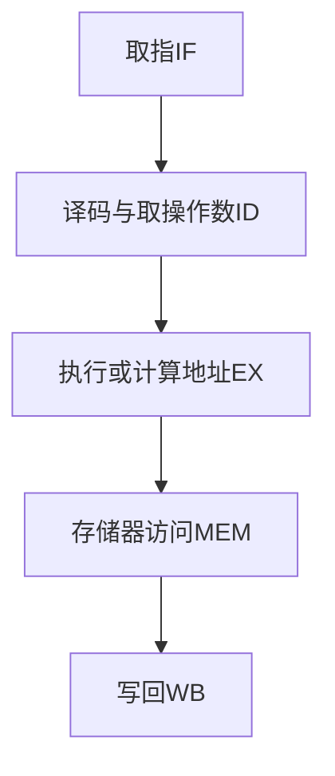

# 何去何从的并行计算
**并行计算遇到的问题**

 1. Linus Torvalds认为并行计算只能用于图像处理和服务端编程
	
2. 摩尔定律失效:CPU 主频的提升遇到了一些暂时不可逾越的瓶颈

**并行计算的进步**

- 新摩尔定律:每24/18月,cpu核心数翻一番

# 并行的基本概念
**同步**:同步方法一经调用,调用者必须要等到方法结束后才能进行后续操作
**异步**:类似消息传递,异步方法一旦开始,调用就会返回,调用者可进行后续操作

**并发**:多任务交替执行
**并行**:多任务同时执行(只能出现多cpu系统中)

**临界区**:一种公共资源,可以被多个线程使用.

1. 一次只能被一个线程使用,其他线程只能等待
2. 在并行程序中,临界区是被保护的对象

**阻塞**:一个线程占用了临界区资源,其他需要该资源的线程将会在临界区等待.等待导致线程挂起.
**非阻塞**: 没有一个线程可以妨碍其他线程执行,所有线程都会前向执行.

**死锁**:多个线程占用其他线程的资源,又等待其他线程已占用的资源,导致所有线程都不能前向执行.
**饥饿**:线程由于某种原因无法获取需要的资源,导致一直无法执行

> 	 	 1. 线程的优先级太低,资源一直被优先级高的线程抢占 
> 	 	 2. 死锁也会导致饥饿线程(*饥饿有可能在未来一段时间解决*)

**活锁**:多个线程都将资源谦让给其他线程,导致没有一个线程获得所有资源而向前执行

# 并发级别
**并发的级别**:阻塞,无饥饿,无障碍,无锁,无等待（→并发度提高）

## 阻塞
一个线程是阻塞的,那么其他线程释放资源前,该线程无法前向执行.

> 阻塞的**实现方式**:
>  1. synchronized
>  2. 重入锁

## 无饥饿
 - 对于**非公平锁**,高优先级的线程优先获取资源,导致低优先级的线程无法获取资源产生饥饿.
 -  可通过**公平锁**消除饥饿.
 ## 无障碍
**无障碍的特点**

- 最弱的非阻塞调度
- 两个线程若都无障碍运行,则不会因为临界区导致阻塞
- 一旦将数据写坏,则进行回滚

**无障碍调度**

阻塞的控制方式是**悲观**的,非阻塞调度是**乐观**策略

一种可行的非阻塞调度策略，依赖"一致性标记"

1. 线程操作前读取并保存该标记
2. 操作完成后,再次读取该标记,判断是否与保存的标记一致.
	若一致,则资源访问没有冲突,并更新标记
	若不一致,则说明资源访问发生冲突,需要重新操作

## 无锁
**无锁的特点**

- 无锁的并行都是无障碍的
- 无锁的并发保证必然有**一个线程在有限步**内完成操作,离开临界区

**无锁的实现**

- 	无锁调用中一般会包含一个无穷循环
- 无锁并行保证有一个线程在竞争中胜出,离开临界区
	```
	while (!atomicVar .compareAndSet(localVar, localVar+1)) {
		localVar = atomicVar.get();
	}
	```
- 如果某一线程一直竞争不到资源,也会发生饥饿现象
## 无等待
**无等待特点**

- 要求**所有线程**都在**有限步**完成,不存在饥饿现象

**无等待实现**

- [RCU(read copy update)](https://blog.csdn.net/linux_bug/article/details/48685403)
	1. 数据读是无等待的
	2. 写数据时修改的是数据的副本,在合适时机写回数据
# 并行的两个定律
并行程序的目的

1. 获取更好的性能
2. 业务要求多个执行的实体

**加速比**定义
$$加速比=\frac{优化前系统耗时}{优化后系统耗时}$$
## Amdahl 安达尔定律


 - 如果 CPU 处理器数量趋于无穷， 那么**加速比与系统的串行化比例成反比**
## Gustafson 古斯塔夫森定律

 - 串行化比例很小，并行化比例很大,**加速比就是处理器的个数**
## 两个定律是否矛盾
 - 为了提高系统的性能,有两种方法
	 1. 增加 CPU 处理器的数量
	 2. 提高系统内可并行化的模块比重
 - Amdahl定律认为增加cpu能够**减少并行任务时间**
 - Gustafson定律认为增加cpu能够**增加并行时间的任务量**(与之对应单cpu的并行时间增长)
# JMM(Java内存模型)
## 原子性
原子性是指一个操作不能中断,一旦开始就不会被其他线程干扰.
*对于32位系统,**long**和**double**的读写不是原子性的*

## 可见性
可见性是指一个线程修改一个共享变量时,其他线程也能看到这个修改.
### 不可见性产生的原因
1. cpu对变量的优化,将变量存入cache或寄存器
2. 指令重排


## [有序性](https://www.cnblogs.com/54chensongxia/p/12120117.html)

有序性是指程序执行的顺序按照代码的先后顺序执行.

### 指令重排

**指令重排会打乱程序的有序性**

 - 指令重排保证串行语义一致,但不保证多线程间语义一致
 - 指令重排是否发生,发生的时机都无法预测

**指令执行的步骤**


**指令流水线**

指令可以分割成多个在不同硬件中完成的步骤,可采用**流水线**执行可以提高效率
<center>图5-指令流水线可以减少指令等待的时间</center>
<font color=red size=4>指令流水线一旦断流,所有硬件进入停顿期.再次载满流水线需耗费几个指令周期,造成巨大性能损失.</font>

__防止指令断流__
 1. 汇编指令等待(图5中的X)
  2. 指令重排

**对以下指令优化**

```
a=b+c
d=e-f
```

- 指令重排前，指令流水线效率低


- 加载指令不依赖其他指令，可重排使其提前


- 指令重拍后，指令流水线效率更高


>重排前,SUB和ADD需要等待操作数
>重排后,将加载变量提前到SUB和ADD前,充分利用等待的指令周期

### 有序性的保证

[**Happen-Before规则**](https://www.jianshu.com/p/1508eedba54d)

happens-before原则是Java内存模型中定义的两项操作之间的偏序关系，如果说操作A先行发生于操作B，其实就是说在发生操作B之前，<font color='cornflowerblue'>操作A产生的影响能被操作B观察到</font>。“影响”包括修改了内存中共享变量的值、 发送了消息、 调用了方法。

>  1. **单线程原则**：同一个线程中，书写在前面的操作happen-before后面的操作。
>  2. **锁的原则**：同一个锁的unlock操作happen-before此锁的lock操作。
>  3. **volatile的原则**：对一个volatile变量的写操作happen-before对此变量的任意操作。 
>  4. **传递性原则**：如果A操作 happen-before B操作，B操作happen-before C操作，那么A操作happen-before C操作。
> 5. **线程启动的原则**：同一个线程的start方法happen-before此线程的其它方法。
> 6. **线程中断的原则**：对线程interrupt方法的调用happen-before被中断线程的检测到中断发送的代码。
> 7. **线程终结的原则**：线程中的所有操作都happen-before线程的终止检测。
> 8. **对象创建的原则**：一个对象的初始化完成先于他的finalize方法调用。

**synchronized机制**

因为synchronized可以保证同一时间只有线程能访问代码块，而在单线程环境下，JMM能天然保证代码的串行语义。

**[volatile机制](https://www.cnblogs.com/dolphin0520/p/3920373.html)**

volatile的底层是使用[内存屏障](https://www.jianshu.com/p/08a0a8c984ab)来保证可见性

- volatile**读前插**读屏障
- volatile**写后加**写屏障

内存屏障**避免CPU重排**导致的问题，实现多线程之间数据的**可见性**。即一个线程修改了变量的值，该新值对其他线程来说是立即可见的。

> 可见性保障了一定程度上的有序性
>
> - 写volatile变量时，可以确保volatile写之前的操作不会被编译器重排序到volatile写之后。
> - 读volatile变量时，可以确保volatile读之后的操作不会被编译器重排序到volatile读之前。

<font color='red'>内存屏障</font>有两个能力：

- 就像一套栅栏分割前后的代码，阻止栅栏前后的没有数据依赖性的代码进行指令重排序，保证程序在一定程度上的**有序性**。
- 强制把写缓冲区/高速缓存中的脏数据等写回主内存，让缓存中相应的数据失效，保证数据的**可见性**。

## 总结

java多线程的所有问题都植根于“操作原子性”、“操作有序性”、“操作可见性”

| 特性   | volatile关键字 | synchronized关键字 | Lock接口 | Atomic变量 |
| ------ | -------------- | ------------------ | -------- | ---------- |
| 原子性 | 无法保障       | 可以保障           | 可以保障 | 可以保障   |
| 可见性 | 可以保障       | 可以保障           | 可以保障 | 可以保障   |
| 有序性 | 一定程度保障   | 可以保障           | 可以保障 | 无法保障   |

