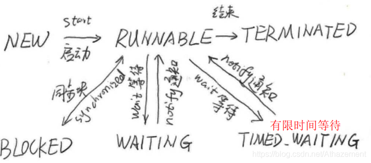
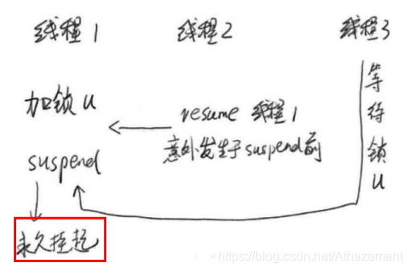
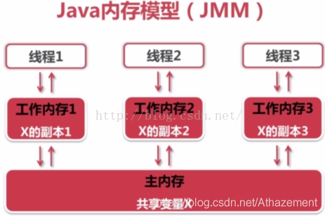

# 有关线程必须知道的事
**进程**:程序运行的实体,是系统**资源分配和调度**的基本单位.
**线程**:进程是线程的容器,而线程是轻量级进程;是**cpu调度**的基本单位.因此线程切换的成本远小于进程.

__线程的生命周期__

**线程的状态**保存在Thread中的State枚举中

```java
public enum State {
    NEW,
    RUNNABLE,
    BLOCKED,
    WAITING,
    TIMED_WAITING,
    WAITING,
    TERMINATED
}
```
# 初始化线程:线程的基本操作
## 新建线程
__继承Thread抽象类__

```java
public class CreateThread1 extend Thread {
	@Override//重写线程方法
	public void run(){
		System.out.println("Hello, I extends Thread");
	}
	public static void main(String[] args) {
		CreateThread t1=new CreateThread1();
		t1.start();//开启线程
	}
}
```
__继承Runnable__

```java
public class CreateThread2 implements Runnable {
	@Override//重写线程方法
	public void run(){
		System.out.println("Hello, I  implements Runnable");
	}
	public static void main(String[] args) {
		CreateThread2 t2=new CreateThread2();
		t2.start();//开启线程
	}
}
```
__继承Thread与实现Runnable的区别__
>1. 继承Thread消耗了唯一的父类,使得该类不能再继承其他类
>2. Thread类实现了Runnable接口
## 终止线程
一般线程执行完就会结束,无需手动关闭.但某些服务后台线程可能会常驻系统,不会正常终结.
__public final void stop()__--已弃用
>stop()结束线程时,会直接终止线程,并释放持有的锁.这些锁是用来维持对象一致性的.从而可能导致**<font color=red>对象一致性</font>**被破坏.
>
>上图中对象包含ID和NAME两个属性,对象一致性要求
>
><center>ID(0)<==>NAME(0)<p>
>ID(1)<==>NAME(1)  </center>
>stop强制终止线程,导致出现ID(1)<==>NAME(0)这种不一致情况.
><font color=red>stop导致的不一致性问题很难排查,尽量避免使用stop终止线程</font>
**正确停止线程的方法**

设置一个标志位**stopme**,用于在线程方法中判断是否终止线程.若要终止,则在保证对象一致性的前提下退出线程.

```java
public static class ChangeObjectThread extends Thread {
    volatile boolean stopme = false;
    public void stopMe(){
        stopme = true;
    }
    @Override
    public void run() {
        while (true) {
            if (stopme){//若要退出线程,则不修改对象,保证对象一致性
                System.out.println("exit by stop me");
                break;
            }
            synchronized (u) {
                int v = (int) (System.currentTimeMillis() / 1000);
                u.setId(v);
                //Oh, do sth. else
                try {
                    Thread.sleep(100);
                } catch (InterruptedException e) {
                    e.printStackTrace();
                }
                u.setName(String.valueOf(v));
            }
            Thread.yield();
        }
    }
}
```
## 线程中断
线程中断不是让线程立即结束,而是给线程发出**中断信号**,之后线程对中断信号进行处理.

**线程的中断方法**

```java
1. public void interrupt() 发出中断信号
2. public boolean isInterrupted() 判断线程的中断状态
3. public boolean interrupted() 返回中断状态,并清除中断状态
```

**InterruptedException**

可能抛出中断异常的方法

```java
Thread public static native void sleep(long millis)
Object public void wait()  
```
若线程**同时处于**[*sleep或wait*]和Interrupted状态,线程就会抛出InterrputException异常，<font color='red'>通过捕获异常就可进行下一步操作</font>。
## 等待(wait)和通知(notify)
__obj.wait()__
>   1.wait()必须置于synchronized(obj)中 
>2. 调用该wait()的线程会释放obj锁,进入阻塞状态,加入obj的**等待队列**
>3. 等待队列中的线程会在timeout或notify被唤醒后,继续执行

__<font color=red>wait()与sleep()</font>__

 1. wait()是Object方法,sleep()是Thread方法
 2. 线程使用wait()后释放持有的锁资源,sleep()不会释放资源
 3. 线程使用wait()可以被唤醒,sleep()不能


__obj.notify()__
>1. notify()必须置于synchonized(obj)中
>2. 随机唤醒**一个**obj等待队列中的blocked线程
>3. 调用notify()并不立即释放锁资源,需要整个代码块执行结束后释放锁资源

__obj.notifyAll()__
>1. 功能类似notify(),但会唤醒obj等待队列的所有线程
>2. 优先级高的线程优先获取obj锁
## 挂起(suspend)和继续执行(resume)
suspend挂起的线程,必须要被resume才能继续执行
__supend与resume优点__

 1. suspend时效性强,一旦调用,线程立即挂起(*不需要wait()+interrupt*)
 2. suspend与resume不要求在synchronized中,更加灵活


__suspend与resume的缺陷__

 1. 若suspend挂起的线程仍处于Runnable状态,不释放锁资源,资源浪费
 2. resume若在suspend之前发生,那么挂起的线程无法再继续执行,锁资源也被长期占用,一起死锁.
 

__suspend与resume死锁解决__
 1.使用**[sleep|wait]**和**interrupt**代替
 2.设置标志位

```java
public class GoodSuspend {
    public static Object u = new Object();
    public static class ChangeObjectThread extends Thread {
        volatile boolean suspendme = false;//保证可见性
        public void suspendMe() {
            suspendme = true;//设置挂起标记
        }
        public void resumeMe(){
            suspendme=false;//清除挂起标记
            synchronized (this){
                notify();//唤醒线程
            }
        }
        @Override
        public void run() {
            while (true) {
                synchronized (this) {
                    while (suspendme)//检查挂起标志位
                        try {
                            wait();//挂起线程,并释放锁,不引起死锁
                        } catch (InterruptedException e) {
                            e.printStackTrace();
                        }
                }
                synchronized (u) {
                    System.out.println("in ChangeObjectThread");
                }
                Thread.yield();
            }
        }
    }
    public static class ReadObjectThread extends Thread {
        @Override
        public void run() {
            while (true) {
                synchronized (u) {
                    System.out.println("in ReadObjectThread");
                }
                Thread.yield();
            }
        }
    }
    public static void main(String[] args) throws InterruptedException {
        ChangeObjectThread t1 = new ChangeObjectThread();
        ReadObjectThread t2 = new ReadObjectThread();
        t1.start();
        t2.start();
        Thread.sleep(1000);
        t1.suspendMe();//设置挂起标记
        System.out.println("suspend t1 2 sec");
        Thread.sleep(2000);
        System.out.println("resume t1");
        t1.resumeMe();//清除挂起标记,并唤醒线程
    }
}
```
## 等待线程结束(join)与谦让(yield)
```java
public final void join() throws InterruptedException
```


thread.join()挂起当前线程,等待thread执行.

 - join():等待thread结束 
 - join(long millis):等待一定时间或thread结束

<font color='red'> __join实现原理__???</font>

```java
public static native void yield()
```

当前线程让出CPU,并与其他线程共同竞争CPU.

# volatile与JMM 
## Java内存模型
[以下内容来自](https://www.cnblogs.com/lycroseup/p/6826997.html)


 - Java所有变量都存储在主内存中
 - 每个线程都有自己独立的工作内存，里面保存该线程的使用到的变量副本(对其他线程不可见)
 - 每个线程操作的都是线程内的变量副本,之后再刷新回主存
## 可见性
long不是原子类,对long数据的写操作可能会把数据写坏,可通过volatile使变量具有可见性

Volatile实现内存可见性是通过store和load指令完成的；
**写操作时**，会在写操作后加入一条store指令，强迫线程将最新的值刷新到主内存中；
**读操作时**，会加入一条load指令，即强迫从主内存中读入变量的值。但volatile不保证volatile变量的原子性

```java
public class MultiThreadLong (
	public volatile static long t=0;//保证t的可见性
	public static class ChangeT implements Runnable{
		private long to;
		...
```


## 原子性
volatile不能保证变量**复合操作**的原子性

```java
static volatile int i=0;
	public static class PlusTask implements Runnable{
		@Override
		public void run() {
			for(int k=0;k<10000;k++)
				i++;
		}
	}
	public static void main(String[] args) throws InterruptedException {
		Thread[] threads=new Thread[10];
		for(int i=0;i<10;i++){
			threads[i]=new Thread(new PlusTask());
			threads[i].start();
		}
		for(int i=0;i<10;i++){
			threads[i].join();
		}
		System.out.println(i);
	}
```
最终输出的结果小于100000,原因是i++是复合操作
 - 取出i
 - 计算i+1
 - 将结果写回内存

多个线程使用i++,可能导致**写丢失**


 ## 有序性
[激进优化导致的不可见问题](%5Bhttps://msd.misuland.com/pd/3223833238703181594%5D)

```java
    private static boolean ready;  
    private static int number;  
  
    private static class ReaderThread extends Thread {  
        public void run() {  
            while (!ready);
            System.out.println(number);  
        }  
    } 
    public static void main(String[] args) throws InterruptedException {  
        new ReaderThread().start();  
        Thread.sleep(1000);
        number = 42;  
        ready = true;  
        Thread.sleep(10000);
    } 
```
由于JIT的激进优化,导致while(!ready)只判断一次,相当于

```java
if(!ready){
	while(true)
		System.out.println(number);  
}
```
导致之后ready的修改对线程不可见,引起死循环.
**解决方法**
通过使用volatile修饰ready,告知编译器ready变量可能被其他线程修改,避免JIT激进编译.

# 分门别类的管理： 线程组
**线程组使用场景**
- 线程数量多
- 线程功能相同

**线程组是树状结构**

```java
//构造函数
1. ThreadGroup(String name) //构造一个新的线程组。  
2. ThreadGroup(ThreadGroup parent, String name) //指定父线程组。  
```
**线程组常用方法**

```java
1. int activeCount() //返回此线程组及其子组中活动线程数的估计
2. int enumerate(Thread[] list, boolean recurse)//将此线程组中的每个活动线程复制到指定的数组中。   
3. ThreadGroup getParent() //返回此线程组的父级
4. void list() //将有关此线程组的信息打印到标准输出  
5. void setDaemon(boolean daemon) //更改此线程组的守护程序状态 
6.suspend,stop方法可以对整个组中线程操作,但已被废弃  
```
**线程组使用案例**

```java
public class ThreadGroupName implements Runnable {
	public static void main(String[] args) {
		ThreadGroup tg = new ThreadGroup("PrintGroup");
		Thread t1 = new Thread(tg, new ThreadGroupName(), "T1");
		Thread t2 = new Thread(tg, new ThreadGroupName(), "T2");
		t1.start();
		t2.start();
		System.out.println(tg.activeCount());
		tg.list();
	}
	@Override
	public void run() {
		String groupAndName = Thread.currentThread().getThreadGroup().getName()
				+ "-" + Thread.currentThread().getName();
		while (true) {
			System.out.println("I am " + groupAndName);
			try {
				Thread.sleep(3000);
			} catch (InterruptedException e) {
				e.printStackTrace();
			}
		}
	}
}
```

```java
Thread(ThreadGroup group, Runnable target, String name) 
分配一个新的 Thread对象，使其具有 target作为其运行对象，具有指定的 name作为其名称，属于 group引用的线程组。
```
## 驻守后台： 守护线程 (Daemon)
**线程类型**:用户线程和守护线程

> 守护线程:当Java程序中只有守护线程时,JVM自然退出

**守护线程设置**

```java
Thread t=new Thread(runnable);
t.setDeamon(true)//设置为守护线程
t.start()
守护线程的设置必须在线程启动前,否则线程仍以用户线程启动,并会报错
```

 # 先做重要的事： 线程优先级
 **Thread内置的线程优先级标量**

```java
public final static int MIN_PRIORITY = 1;
public final static int NORM_PRIORITY = 5;//线程默认优先级
public final static int MAX PRIORITY = 10;
```

```java
public class PriorityDemo {
    public static class HightPriority extends Thread{
        static int count=0;
        public void run(){
            while(true){
                synchronized(PriorityDemo.class){
                    count++;
                    if(count>10000000){
                        System.out.println("HightPriority is complete");
                        break;
                    }
                }
            }
        }
    }
    public static class LowPriority extends Thread{
        static int count=0;
        public void run(){
            while(true){
                synchronized(PriorityDemo.class){
                    count++;
                    if(count>10000000){
                        System.out.println("LowPriority is complete");
                        break;
                    }
                }
            }
        }
    }
    /**
     * HightPriority先完成的次数多，但是不保证
     * @param args
     * @throws InterruptedException
     */
    public static void main(String[] args) throws InterruptedException {
        Thread high=new HightPriority();
        LowPriority low=new LowPriority();
        high.setPriority(Thread.MAX_PRIORITY);
        low.setPriority(Thread.MIN_PRIORITY);
        low.start();
        high.start();
    }
}
```
**代码解析**

 1. 线程优先级的设定需要在线程启动前

 2. 线程的优先级是在获取锁资源时才能体现;

    ```
    notifyAll唤醒全部等待的线程获取锁资源时有效
    notify随机唤醒线程是无效的;
    ```

# 线程安全与关键字 synchronized
synchronized 是对同步的代码加锁， 使得每一次， 只能有一个线程进入同步块， 从而保证线程间的安全性.

synchronized可同时保证**可见性,原子性,有序性**
**synchronized用法**
 1. *指定加锁对象*： 为对象加锁， 进入同步代码前要获得给定对象的锁。
2. *直接作用于实例方法*： 相当于对当**this**加锁
3.  *直接作用于静态方法*： 相当于对**xxx.class**加锁
# 并发引起的错误
## 并发下的ArrayList

```java
public class ArrayListMultiThread {
    static ArrayList<Integer> al = new ArrayList<Integer>(10);
    public static class AddThread implements Runnable {
        @Override
        public void run() {
            for (int i = 0; i < 1000000; i++) {
                al.add(i);
            }
        }
    }
    public static void main(String[] args) throws InterruptedException {
        Thread t1=new Thread(new AddThread());
        Thread t2=new Thread(new AddThread());
        t1.start();
        t2.start();
        t1.join();t2.join();
        System.out.println(al.size());
    }
}
```
以上程序可能出现三种结果

> 1. 程序正常运行,输出2000000(<font color=red>并发错误不是每次都出现</font>)
> 2. 抛出<font color=red>java.lang.ArrayIndexOutOfBoundsException</font>,当两个线程在size++前都执行到 ensureCapacityInternal(size + 1)时,    恰好不需需要扩容,但两个线程**依次size++**,会导致越界
```java
    public boolean add(E e) {
        ensureCapacityInternal(size + 1);  // Increments modCount!!
        elementData[size++] = e;
        return true;
    }
    
```
>3. 最终al.size()<2000000,这是因为两个线程**同时进入size++**,导致写丢失引起的

**问题解决**
- 使用Collections.synchronizedList
- 使用**Vector**
## 并发下HashMap

```java
public class HashMapMultiThread {
    static Map<String,String> map = new HashMap<String,String>();
    public static class AddThread implements Runnable {
        int start=0;
        public AddThread(int start){
            this.start=start;
        }
        @Override
        public void run() {
            for (int i = start; i < 100000; i+=2) {
                map.put(Integer.toString(i), Integer.toBinaryString(i));
            }
        }
    }
    public static void main(String[] args) throws InterruptedException {
        Thread t1=new Thread(new HashMapMultiThread.AddThread(0));
        Thread t2=new Thread(new HashMapMultiThread.AddThread(1));
        t1.start();
        t2.start();
        t1.join();t2.join();
        System.out.println(map.size());
    }
}
```
以上程序可能出现三种结果
>1. 程序正常结束， HashMap 的大小为 100 000
>2. 程序正常结束， 但结果不符合预期，HashMap大小<100 000
>3. [程序无法结束](https://mp.csdn.net/mdeditor/102497506)(<font color=red>扩容引起链表循环</font>,jdk1.8不会)

死循环分析:

```bash
C:\Users\geym >jps
14240 HashMapMultiThread
1192 Jps
C:\Users\geym >jstack 14240
#可以看到main处于等待状态,t1和t2处于Runnable状态
```
# 问题记录
1. interrupt机制的底层实现
2. wait(timeout)底层实现
3. join实现原理
4. yield与锁机制区别