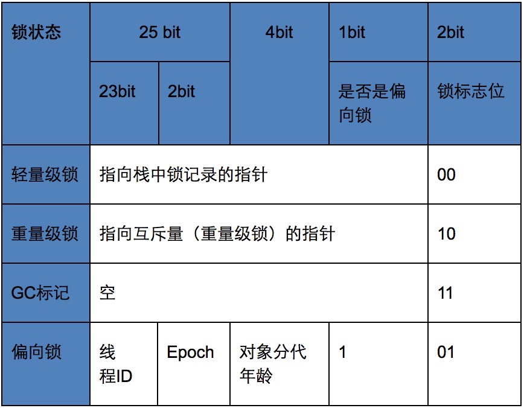
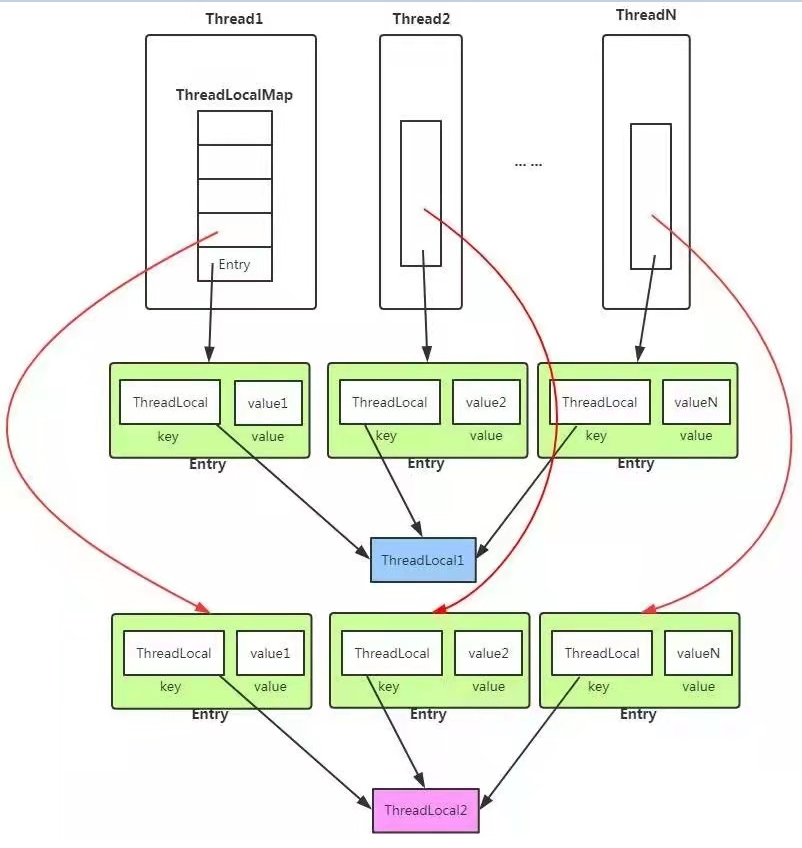
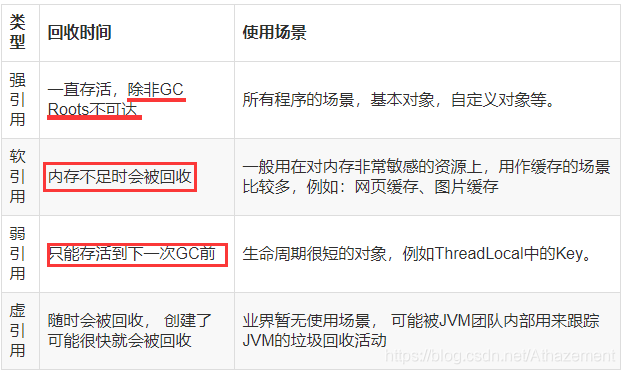

**高并发性能问题**
- 锁是最常用的同步方法,高并发环境下,激烈的锁竞争会导致程序性能下降
- 多线程的切换和调度需要额外维护**多线程特有的环境信息**(线程上下文)
# 1 提高锁性能建议
## 1.1 减少锁持有时间
线程持有锁的时间越长,锁的竞争越激烈

**解决方式**

当一个方法需要同步时,仅对方法中需要同步的操作加锁,操作之后便释放锁.

## 1.2 减小锁粒度
减小锁粒度， 就是指缩小锁定对象的范围， 从而**降低锁冲突的可能性**，进而提高系统的并发能力
- Collections.synchronizedMap(new HashMap()):**全局锁**<font color=red>所有方法都加锁</font>
- ConcurrentHashMap:**局部锁**

**ConCurrentHashMap实现**
- JDK1.7中ConCurrentHashMap利用段(segment)提高并发(默认**16**个段).
- 当对**单个数据**操作时,只对数据所在的段加锁,对其他段的操作可并发执行

	```java
	public V put(K key, V value) {
		Segraent<K,V> s;
		if (value == null)
			throw new NullPointerException{);
		int hash = hash(key);
		int j = (hash >>> segmentShift) & segmentMask;
		if ((s = (Segment<KrV>)UNSAFE.getObject	// nonvolatile; recheck
			(segments, (j « SSHIFT) + SBASE))	// in ensureSegment
			s = ensureSegment(j);
		return s.put(key, hash, value, false);	//对部分段加锁
	}
	```
- 当对**全局数据**操作,如size(),会对所有段加锁,导致效率低下
	```java
	//size()部分代码
	sum=0;
	for(int i = 0; i < segments.length; ++i)
		segments[i].lock()//全段加锁
	for (int i - 0; i < segments.length; ++i)
		sum += segments[i].count;
	for (int i = 0; i < segments.length; ++i)
		segments[i].unlock(); 
	```
**ConcurrentHashMap在JDK1.7与1.8**
转载至[https://blog.csdn.net/Bill_Xiang_/article/details/81122044](https://blog.csdn.net/Bill_Xiang_/article/details/81122044)
## 1.3 锁分离
- 减小粒度:基于**数据结构**分割
- 锁分离:基于**功能**分割

### 读写分离锁的实现:ReadWriteLock
```java
ReentrantReadWriteLock readWriteLock = new ReentrantReadWriteLock();
Lock readLock = readWriteLock.readLock();
Lock writeLock = readWriteLock.writeLock()
```
*代码分析*
1. ReentrantReadWriteLock是ReadWriteLock的实现类
2. ReadLock和WriteLock是 ReentrantReadWriteLock的静态内部类
3. ReadLock之间不会阻塞,而WriteLock会阻塞
### 入队与出队分离:LinkedBlockingQueue 
```java
private final ReentrantLock takeLock = new ReentrantLock{);
private final Condition notEmpty = takeLock.newCondition{);
private final ReentrantLock putLock = new ReentrantLock();
private final Condition notFull = putLock.newCondition{);
```
*代码分析*
1. <font color='cornflowerblue'>take()之间</font>和<font color='cornflowerblue'>put()之间</font>会竞争锁,但take()和put()不会竞争锁
2. 控制条件**notEmpty**和**notFull**用于处理队列为空/满两种边界情况

## 1.4 锁粗化
锁粗化与减少锁的持有时间似乎冲突,但若反复对同一个锁获取和释放,反而会消耗大量系统资源.
**锁粗化**
&emsp;<font color=red>虛拟机</font>在遇到<font color=red>频繁</font>对同一个锁进行请求和释放的操作时， 会把所有的锁操作整合成对锁的一次请求， 从而减少对锁的请求同步的次数
**锁粗化实例**
```java
锁粗化前
public void demoMethod(){
	synchronized(lock){同步操作1}
	...//很快能执行完的操作
	synchronized(lock){同步操作2}
}	
锁粗化后
public void demoMethod(){
	synchronized(lock){
		同步操作1
		...//很快能执行完的操作
		同步操作2
	}
}	
```
# 2 JVM对锁优化所做的努力
参考文章
[https://www.cnblogs.com/wade-luffy/p/5969418.html](https://www.cnblogs.com/wade-luffy/p/5969418.html)
[https://www.cnblogs.com/sunweiye/p/11169048.html](https://www.cnblogs.com/sunweiye/p/11169048.html)


## 2.1 [偏向锁、轻量级锁和重量级锁](https://www.cnblogs.com/wade-luffy/p/5969418.html)
<font color='cornflowerblue'>对象头</font>=对象运行时数据(Mark Word)+方法区对象类型指针
**mark work组成**
32bit:对象hash(25bit)+对象分代年龄(4bit)+是否为(1bit)+锁标志位(2bit)



<center>锁标志位</center>

### 偏向锁(01)
**核心思想**
如果线程获得了锁，那么锁就进入偏向模式。 当这个线程再次请求锁时， 无须再做任何同步操作
**实现原理**
偏向锁：无实际竞争，且将来只有第一个申请锁的线程会使用锁,初始化使用一次cas
- 使用CAS操作将线程ID记录在Mark Word中
- 使用-XX:+UseNiasedLocking开启偏向锁

**场景分析**
- **适用于**同一个线程多次获取相同锁,以检查锁代替获取锁,效率更高
- **不适用**多个线程竞争同一个锁,此时偏向模式转换为轻量级锁
### 轻量级锁(00)
**核心思想**
将对象头作为指针指向持有锁的线程堆栈的内部， 来判断一个线程是否持有对象锁。
**实现原理**
轻量级锁(00)：无实际竞争，多个线程交替使用锁；允许短时间的锁竞争,锁获取和释放都cas
- 获取对象的线程拷贝对象的Mark Word到Lock Record
- JVM使用CAS操作修改对象Mark Word为Lock Record指针
&emsp;失败:自旋获取锁是否成功
	&emsp;&emsp;是,成功获取锁
	&emsp;&emsp;否,膨胀为重量级锁（在该线程获取锁之前有其他的线程获取锁，说明竞争激烈）
&emsp;成功,成功获取锁
- 使用CAS释放锁,判断Mark Word是否指向Lock Record
&emsp;是,将Mark Word替换成Lock Record
	&emsp;&emsp;成功,成功释放锁
	&emsp;&emsp;失败,释放锁,并唤醒其他想获取锁的线程
&emsp;否,膨胀成重量级锁


<center>线程获取锁前</center>


<center>线程获取锁后</center>
**场景分析**

- 使用与不同线程在**不同时刻**获取同一个锁,并没有实际竞争
### 重量级锁(10)
**核心思想**
有实际竞争，且锁竞争时间长,使用互斥量,内核态到用户态转换

### [锁的转换](https://www.cnblogs.com/sunweiye/p/11169048.html)


<center>锁的状态转换图</center>

**线程的阻塞和唤醒需要CPU从用户态转为核心态，频繁的阻塞和唤醒对CPU来说是一件负担很重的工作。**

**锁的四种状态**：无锁状态，偏向锁状态，轻量级锁状态和重量级锁状态，它会随着竞争情况逐渐升级。

> 锁可以升级但不能降级，意味着偏向锁升级成轻量级锁后不能降级成偏向锁。这种锁升级却不能降级的策略，避免降级后又升级，目的是为了提高获得锁和释放锁的效率。

**偏向所锁，轻量级锁都是乐观锁，重量级锁是悲观锁。**

​    一个对象刚开始实例化的时候，没有任何线程来访问它的时候。它是可偏向的，意味着，它现在认为只可能有一个线程来访问它，所以当第一个　　线程来访问它的时候，它会偏向这个线程，此时，对象持有偏向锁。偏向第一个线程，这个线程在修改对象头成为偏向锁的时候使用CAS操作，并将对象头中的ThreadID改成自己的ID，之后再次访问这个对象时，只需要对比ID，不需要再使用CAS在进行操作。

　　一旦有第二个线程访问这个对象，因为偏向锁不会主动释放，所以第二个线程可以看到对象时偏向状态，这时表明在这个对象上已经存在竞争了，检查原来持有该对象锁的线程是否依然存活，如果挂了，则可以将对象变为无锁状态，然后重新偏向新的线程，如果原来的线程依然存活，则马上执行那个线程的操作栈，检查该对象的使用情况，如果仍然需要持有偏向锁，则偏向锁升级为轻量级锁，（偏向锁就是这个时候升级为轻量级锁的）。如果不存在使用了，则可以将对象回复成无锁状态，然后重新偏向。

　　轻量级锁认为竞争存在，但是竞争的程度很轻，一般两个线程对于同一个锁的操作都会错开，或者说稍微等待一下（自旋），另一个线程就会释放锁。 但是当自旋超过一定的次数，或者一个线程在持有锁，一个在自旋，又有第三个来访时，轻量级锁膨胀为重量级锁，重量级锁使除了拥有锁的线程以外的线程都阻塞，防止CPU空转。

### 2.2 自旋锁
**核心思想**
为避免轻量级锁膨胀为重量级锁后线程在操作系统层面挂起,虚拟机会自旋等待锁<font color=red>(假设很快会获得锁)</font>，超过阈值后才升级为重量级锁.
**实现原理**

- 通过-XX:PreBlockSpin设置自旋次数(默认10次)
- 自适应的自旋锁
&emsp;若某个锁之前通过自旋被获取,会增大自旋次数
&emsp;若某个锁之前通过自旋没有获取锁,则会跳过自旋步骤,直接阻塞等待

**场景分析**
- JVM估计线程很快就能获得锁,自旋等待比阻塞调度性能更好
### 2.3 锁消除
**核心思想**
虚拟机在 JIT 编译时， 通过对运行上下文的扫描,去除不可能存在共享资源竞争的锁
**实现原理**
- 某些Java内置的API会自动加锁,如Vector,StringBuffer
	```java
	public String[] createStrings(){
		Vector<String> v=new Vector<String>( )；
		for(int i=0;i<100;i++){
			v.add(Integer,toString(i))；
		}
		return v.toArray(new String[]{});
	}
	v只在createStrings()中使用,是分配在线程栈上的私有变量,不会被其他线程访问,不需要加锁
	```
- **逃逸分析**:观察一个变量是否逃出作用域的技术(若代码直接返回v,则逃逸出createString())

- -XX:+EliminateLocks打开锁消除; XX:+DoEscapeAnalysis打开逃逸分析
# 3 ThreadLocal
ThreadLocal是一个本地线程副本变量工具类。主要用于将私有线程和该线程存放的副本对象做一个映射，各个线程之间的变量互不干扰
## 3.1 ThreadLocal数据结构
**Thread与ThreadLocal**



- 每个Thread线程对象内部都<font color='red'>仅有一个</font>ThreadLocal.ThreadLocalMap对象（threadLocals），但可以有多个ThreadLocal对象
- threadLocals使用Entry[]存储线程本地对象（threadLocal）和线程的变量副本（value）
- threadLocals存在于Thread对象中;但由ThreadLocal维护的，由ThreadLocal负责向map获取和设置线程的变量值。

**Thread的结构**

```java
public class Thread implements Runnable {
    /* ThreadLocal values pertaining to this thread. This map is maintained
     * by the ThreadLocal class. */
    ThreadLocal.ThreadLocalMap threadLocals = null;
}
```
**ThreadLocal结构**
```java
class ThreadLocal<T>{
	public T get() {...}
	public void set(T value) {...}
	public void remove() {...}
	static class ThreadLocalMap {
		static class Entry extends WeakReference<ThreadLocal<?>> {
            /** The value associated with this ThreadLocal. */
            Object value;
            Entry(ThreadLocal<?> k, Object v) {
                super(k);
                value = v;
            }
        }
    }
} 
```
- 每个ThreadLocal对象threadLocal以对象自身为键,与value一并保存在ThreadLocalMap中的Entry中

**ThreadLocal方法**

- get()
	```java
	public T get() {
	    Thread t = Thread.currentThread();
	    ThreadLocalMap map = getMap(t);
	    if (map != null) {
	        ThreadLocalMap.Entry e = map.getEntry(this);
	        if (e != null)
	            return (T)e.value;//返回存储的值
	    }
	    return setInitialValue();//返回初始值
	}
	ThreadLocalMap getMap(Thread t) {
	    return t.threadLocals;//返回线程的ThreadLocalMap成员
	}
	private T setInitialValue() {
	    T value = initialValue();
	    Thread t = Thread.currentThread();
	    ThreadLocalMap map = getMap(t);
	    if (map != null)
	        map.set(this, value);
	    else
	        createMap(t, value);
	    return value;
	}
	protected T initialValue() {
	    return null;
	}
	```
- set()
	```java
	public void set(T value) {
	    Thread t = Thread.currentThread();
	    ThreadLocalMap map = getMap(t);
	    if (map != null)
	        map.set(this, value);//设置键值
	    else
	        createMap(t, value);//首次则创建键值
	}
	ThreadLocalMap getMap(Thread t) {
	    return t.threadLocals;
	}
	void createMap(Thread t, T firstValue) {
	    t.threadLocals = new ThreadLocalMap(this, firstValue);
	}
	```
- remove()
	```java
	public void remove() {
	 ThreadLocalMap m = getMap(Thread.currentThread());
	 if (m != null)
	     m.remove(this);//移除键值对
	}
	ThreadLocalMap getMap(Thread t) {
	    return t.threadLocals;
	}
	```

**ThreadLocalMap解析**


**[内存溢出问题](https://www.cnblogs.com/aspirant/p/8991010.html)**

ThreadLocalMap中的**key是弱引用,value是强引用**.

> 若将key设置为null，则key不再持有强引用，在下次GC调用会被回收。而value在线程销毁后才会被回收。
>
> 如果创建该键值对的线程一直运行,则value不会被回收,发生内存泄露.



<font color='red'>注意：</font>线程池中的线程在任务完成后并不会销毁线程，value会发生内存泄漏

解决方案：

> ThreadLocal的set，get，remove方法都会清空key==null的entry，在ThreadLocal使用完毕后使用remove清空避免内存泄漏。

[**ThreadLocalMap为什么使用弱引用**](https://zhuanlan.zhihu.com/p/304240519)

ThreadLocalMap的key若使用强引用，则仅在线程销毁后才会回收key

> Thread -> ThreadLocal.ThreadLocalMap -> Entry[] -> Enrty -> key（threadLocal对象）和value

```java
public class ThreadLocalDemo {
    public static void main(String[] args) throws InterruptedException {
        firstStack();
        System.gc();
        TimeUnit.SECONDS.sleep(1);
        Thread thread = Thread.currentThread();
        System.out.println(thread); // 在这里打断点，观察thread对象里的ThreadLocalMap数据

    }
    // 通过是否获取返回值观察A对象里的local对象是否被回收
    private static void firstStack(){
        A a = new A();
        System.out.println("value: "+ a.get());
    }
    private static class A{
        private ThreadLocal<String> local = ThreadLocal.withInitial(() -> "in class A");

        public String get(){
            return local.get();
        }
        public void set(String str){
            local.set(str);
        }

    }
}
```

ThreadLocalMap本身并没有为外界提供取出和存放数据的API，我们所能获得数据的方式只有通过ThreadLocal类提供的API来间接的从ThreadLocalMap取出数据，当用不了key（ThreadLocal对象）的API也就无法从ThreadLocalMap里取出指定的数据。

> 示例代码中A对象被回收了，这些get和set方法也访问不到了，也就没法从ThreadLocalMap里取出数据了。没法利用API取出数据，Entry对象已经没有用了。所以让key（threadLocal对象）为弱引用，自动被垃圾回收，key就变为null了，下次，我们就可以通过Entry不为null，而key为null来判断该Entry对象该被清理掉了。

至于ThreadLocalMap为什么不给外界提供API来操作数据，我认为是保证线程的隔离性，数据的安全性。

## 3.2 ThreadLocal使用
**ThreadLocal使用步骤**
1. 创建一个 ThreadLocal 对象 threadXxx，用来保存线程间需要隔离处理的对象 xxx；
2. 提供一个获取要隔离访问的数据的方法 getXxx()；
3. 线程开启时,对threadXxx设置值，之后便可通过getXxx()方法获取要操作的数据，这样可以保证每个线程对应一个数据对象，在任何时刻都操作的是这个对象，不会交叉。

**ThreadLocal使用场景**
1. 数据库连接问题
2. Session管理
   3. Thread-per-Request (一个请求对应一个服务器线程)
   在经典Web交互模型中，请求的处理基本上采用的都是“一个请求对应一个服务器线程”的处理方式，因此就可以将请求设置成类似ThreadLocal<Request>的形式，这样，当某个服务器线程来处理请求时，就可以独享该请求的处理了。
4. 随机数生成
## 3.3 总结
- 每个Thread中的threadlocals由对应的ThreadLocal<T>对象维护,其实是其中内部类中的map实现
- Thread中的threadlocals每种类型只能保存一个变量,多种相同类型可自行封装成新类型(包含多个类型)

# 4 无锁
- 加锁:悲观策略
假设每次临界区操作都会冲突
- 无锁:乐观策略
假设对资源的冲突没有冲突,若产生冲突,重试当前操作直至没有冲突
## 4.1 比较交换
**比较交换相对于锁的优点**
1. 非阻塞性,不存在死锁问题
2. 没有锁竞争带来的系统开销,没有线程平凡调度造成的开销

**CAS核心思想**
 $$CAS(V,E,N)$$
 $$V-变量,E-预期值,N-新值$$
- 当多个线程同时使用 CAS 操作一个变量时， 只有一个会胜出， 并成功更新， 其余均会失败。
- 失败的线程不会被挂起， 仅是被告知失败， 并且允许再次尝试， 也允许失败的线程放弃操作
- 在<font color='red'>硬件层面</font>， 大部分的现代处理器都已经支持**原子化的 CAS 指令**
## 4.2 AtomicInteger:无锁的线程安全整数
**AtomicInteger与Integer**
1. AtomicInteger是线程安全的(**修改时CAS操作**),Integer不是
2. AtomicInteger对象是可变的,而Integer对象不是

**AtomicInteger实现**

```java
class AtomicInteger{
	private volatile int value;
	private static final long valueOffset;//值在对象中偏移量
	public final int get()//取得当前值
	public final void set(int newValue)//设置当前值
	public final int getAndSet(int newValue)//设置新值， 并返回旧值
	public final boolean compareAndSet(int expect, int u)//如果当前值为 expect,则设置为u
	public final int getAndIncrement()//当前值加1， 返回旧值
	public final int getAndDecrement()//当前值减1， 返回旧值
	public final int getAndAdd(int delta)//当前值增加 delta 返回旧值
	public final int incrementAndGet(){//当前值加1,返回新值
		for (;;) {//CAS操作不一定成功,需要不断尝试
			int current = get();
			int next = current + 1;
			if (compareAndSet(current, next))//CAS操作
				return next;
		}
	}
}
```
**其他的Atomic类**
long-->AtomicLong
boolean-->AtomicBoolean
对象引用-->AtomicReference
## 4.3 Unsafe类:Java中指针
sun.misc.Unsafe封装了一些不安全操作,类似C++中指针,其操作是**原子性**的.
**Unsafe类的方法**
```java
public static Unsafe getUnsafe()//获取Unsafe实例
public final boolean compareAndSet(int expect, int update) {
	return unsafe.compareAndSwapInt(this, valueOffset, expect, update);
}
//获得给定对象偏移量上的int值
public native int getlnt (Object of long offset);
//设置给定对象偏移量上的 int 值
public native void putInt(Object o, long offset, int x);
//获得字段在对象中的偏移量 
public native long objectFieldOffset(Field f);
```
**Unsafe类的保护措施**
```java
@CallerSensitive
public static Unsafe getUnsafe() {
	Class cc = Reflection.getCallerClass();
	if (cc - getClassLoader() != null)
		throw new SecurityException("Unsafe");
	return theUnsafe;
}
```
[CallerSensitive作用](https://www.jianshu.com/p/437e3c88229e)

> 要求该注解下的方法调用者由bootstrap class loader或extension class loader加载
>
> 用户路径的类加载都是由 application class loader进行加载的，也就是用户自定义的类基本上是无法调用此方法的

## 4.4 AtomicStampedReference:带时间戳的对象引用
**CAS的ABA问题**
获得对象当前数据后, 在准备修改为新值前,对象的值被其他线程连续修改了两次,且 对象的值又恢复为旧值
- 若操作只在意**对象的信息**,则ABA问题不会影响操作
- 若操作还在意**对象的过程**,则ABA问题会影响操作
例如:外卖的首单立减[^具体见书籍P188和P191]

**AtomicStampedReference核心思想**
 - AtomicStampedReference 内部不仅维护了对象值， 还维护了一个时间戳(状态信息) 。 
 -  当AtomicStampedReference 对应的数值被修改时,<font color='red'>对象值及时间戳都必须满足期望值， 写入才会成功</font>.

 **AtomicStampedReference实现**
```java
public class AtomicStampedReference<V> {
	private volatile Pair<V> pair;//值与时间戳(只能为int类型)结构
	//比较设置， 参数依次为： 期望值、 写入新值、 期望时间戳、 新时间戳
	public boolean compareAndSet (V expectedReference,V newReference,int expectedStamprint newStamp)
	//获得当前对象引用
	public V getReference()
	//获得当前时间戳
	public int getStamp()
	//设置当前对象引用和时间戳
	public void set(V newReference, int newStamp)
}
```
## 4.5 AtomicXXXArray:无锁数组
**常用无锁数组**
 - AtomicIntegerArray
 - AtomicLongArray
 - AtomicReferenceArray 
 - 没有带时间戳的数组实现

## 4.6 AtomicXXXFieldUpdater:普通变量享受原子操作
Updater类在不改动（ 或者极少改动） 原有代码的基础上,让<font color='red'>普通的变量也享受 CAS 操作带来的线程安全性</font>font>, 这样你可以通过修改极少的代码来获得线程安全的保证
**Updater类**

- AtomicIntegerFieldUpdater
- AtomicLongFieldUpdater
- AtomicReferenceFieldUpdater

**AtomicIntegerFieldUpdater实现**
```java
public abstract class AtomicIntegerFieldUpdater<T> {
    @CallerSensitive
    public static <U> AtomicIntegerFieldUpdater<U> newUpdater(Class<U> tclass,String fieldName) {
        return new AtomicIntegerFieldUpdaterImpl<U>
            (tclass, fieldName, Reflection.getCallerClass());
    }
}
```
**AtomicIntegerFieldUpdater示例**
假设某地要进行一次选举。 现在模拟这个投票场景， 如果选民投了候选人一票， 就记为 1 ， 否则记为 0。 最终的选票显然就是所有数据的简单求和

```java
public class AtomicIntegerFieldUpdaterDemo {
    public static class Candidate{
        int id;
        volatile int score;
    }
    //为对象升级CAS操作
    public final static AtomicIntegerFieldUpdater<Candidate> scoreUpdater 
        = AtomicIntegerFieldUpdater.newUpdater(Candidate.class, "score");
    //检查Updater是否工作正确
    public static AtomicInteger allScore=new AtomicInteger(0);
    public static void main(String[] args) throws InterruptedException {
        final Candidate stu=new Candidate();
        Thread[] t=new Thread[10000];
        for(int i = 0 ; i < 10000 ; i++) {  
            t[i]=new Thread() {  
                public void run() {  
                    if(Math.random()>0.4){
                        scoreUpdater.incrementAndGet(stu);//升级后自增
                        allScore.incrementAndGet();//CAS检验自增
                    }
                }  
            };
            t[i].start();
        }  
        for(int i = 0 ; i < 10000 ; i++) {  t[i].join();}
        System.out.println("score="+stu.score);
        System.out.println("allScore="+allScore);
    }
}
```
*代码分析*
1. 使用AtomicIntegerFieldUpdater.newUpdater为对象升级了CAS操作
2. 使用AtomicInteger实例检验升级是否生效
3. 最终两个实例输出结果相同,说明升级成功

**Updater类注意事项**
1. **只能修改它可见范围内的变量**， 因为 Updater 使用反射得到送个变量。
2. **变量必须是 volatile 类型的**,以保证被正确的读取,.若原代码中未声明， 简单地声明一下就行
3. **不支持 static字段** ,因为CAS 操作会通过对象实例中的偏移量直接进行赋值(Unsafe.objectFieldOffset()方法不支持静态变量） .
## 4.7 SynchronousQueue:线程互助
**核心知识**
SynchronousQueue 将 put()和 take()两种功能不同的方法抽象为一个共同方法Transfer.transfer()
```java
E transfer(E e, boolean timed, long nanos);
```
- 当e非空时,作为生产者产生一个数据
- 当e为空时,作为消费者请求一个数据
- timed决定是否存在timeout时间,nanos决定timeout时长
- 返回值非空表示操作成功;返回值为空表示失败(超时或中断)

**Transfer的具体实现**
- TransferStack:非公平策略
- TransferQueue:公平策略

**非公平策略的实现**
1. 节点类型

	```java
	正在请求数据
	static final int REQUEST    = 0;
	正在提供数据
	static final int DATA       = 1;
	正在完成匹配节点的后续操作
	static final int FULFILLING = 2;
	```

2. transfer()实现
1)如果等待队列为空或队列中节点与本次操作相同,当前操作压入队列等待.
2)如果等待队列中操作与当前操作互补,则插入一个"完成节点",之后弹出两个节点,对应的两个操作继续执行
3)若队头为"完成节点",则帮助这个节点完成任务5 死锁

**参考文章**
- [https://blog.csdn.net/wljliujuan/article/details/79614019](https://blog.csdn.net/wljliujuan/article/details/79614019)
## 5.1 死锁概述
**死锁定义**
死锁就是两个或者多个线程相互占用对方需要的资源， 而都不进行释放， 导致彼此之间**相互等待**对方释放资源， 产生了无限制等待的现象。
**死锁产生的<font color=red>必要条件</font>**
*以下条件中线程换为进程也成立*
1. 互斥条件
线程请求的资源为临界区
2. 不可剥夺条件
线程获取的资源不能被其他线程/进程强行夺走
3. 请求与保持条件
线程至少持有一个资源,且又对新资源请求,但新资源被其他线程占有,此时请求阻塞,但不会放弃所持有资源
4. 循环等待条件
存在一种线程资源的循环等待链，链中每一个线程已获得的资源同时被 链中下一个进程所请求
## 5.2 死锁的处理
1. **预防死锁**：通过设置某些限制条件，去破坏产生死锁的四个必要条件中的一个或几个条件，来防止死锁的发生。
2. **避免死锁**：在资源的动态分配过程中，用某种方法去防止系统进入不安全状态，从而避免死锁的发生。
3. **检测死锁**：允许系统在运行过程中发生死锁，但可设置检测机构及时检测死锁的发生，并采取适当措施加以清除。
4. **解除死锁**：当检测出死锁后，便采取适当措施将进程从死锁状态中解脱出来。
# 问题记录
1. transfer()源码中第二步中,为什么匹配失败则删除节点