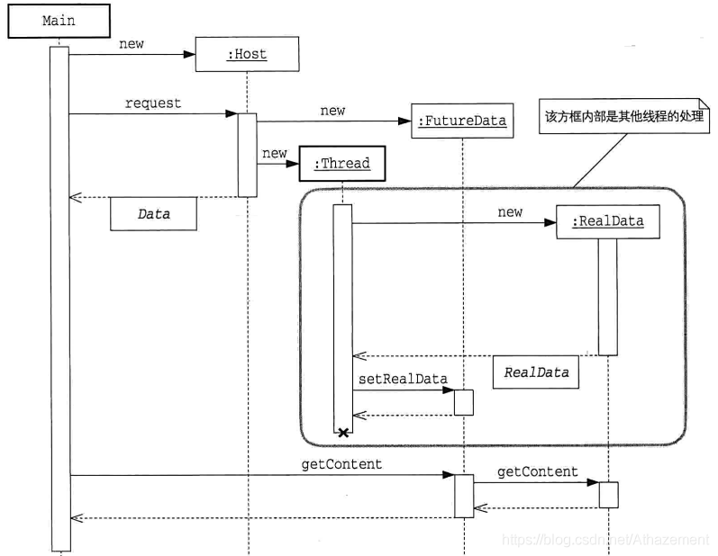

# 1 单例模式
**单例模式的优点**
1. 对于频繁使用的对象,可以省略new操作花费的时间
2. 减少了对象的数据,减低了内存占用,也减轻了GC压力

**单例模式的特点**
1. 类构造器私有
2. 持有自己类型的属性
3. 对外提供获取实例的静态方法

**单例模式的实现**

- 饿汉式:线程安全，但容易产生垃圾
	```java
	public class Singleton {  
	    private static Singleton instance = new Singleton();  
	    private Singleton (){}  
	    public static Singleton getInstance() {  
	    	return instance;  
	    }  
	}
	```

- 懒汉式:线程不安全，延迟初始化
	```java
	public class Singleton {  
	    private static Singleton instance;  
	    private Singleton (){}  
	  
	    public static Singleton getInstance() {  
	    if (instance == null) {  
	        instance = new Singleton();  
	    }  
	    return instance;  
	    }  
	}
	```
	
	参考文章:
	安全懒汉式:[https://www.jianshu.com/p/3bfd916f2bb2](https://www.jianshu.com/p/3bfd916f2bb2)
	枚举懒汉式:[https://www.cnblogs.com/chiclee/p/9097772.html](https://www.cnblogs.com/chiclee/p/9097772.html)

# 2 不变模式

- 依靠<font color=red>对象的不变性</font>,可以确保其在没有同步操作的多线程环境中依然保持内部状态的一致性和正确性。 
- <font color='cornflowerblue'>不变模式并没有解决多线程并发问题,而是规避了这个问题</font>

**不变模式使用场景需要满足的条件**
 - 当对象创建后， 其内部状态和数据不再发生任何变化。
- 对象需要被共享， 被多线程频繁访问。

**不变模式的实现**
1. 类添加final修饰符，保证类不被继承。

2. 保证所有成员变量必须私有，并且加上final修饰 通过这种方式保证成员变量不可改变(第5点弥补)

3. 不提供改变成员变量的方法，包括setter 避免通过其他接口改变成员变量的值，破坏不可变特性。

4.  在getter方法中，不要直接返回对象本身，而是克隆对象，并返回对象的拷贝 这种做法也是防止对象外泄，防止通过getter获得内部可变成员对象后对成员变量直接操作，导致成员变量发生改变。

5. 通过构造器初始化所有成员，进行深拷贝(deep copy) 如果构造器传入的对象直接赋值给成员变量，还是可以通过对传入对象的修改进而导致改变内部变量的值

# 3 生产者与消费者模式


**主要角色**

|    角色    |                   作用                    |
| :--------: | :---------------------------------------: |
|   生产者   |      提交用户任务， 并装入内存缓冲区      |
|   消费者   |       在内存缓冲区中提取并处理任务        |
| 内存缓冲区 | 缓存生产者提交的任务或数据， 供消费者使用 |
|    任务    |     生产者向内存缓冲区提交的数据结构      |
|    Main    |        使用生产者和消费者的客户端         |

# 4 无锁的生产者-消费者模式 
**生产者-消费者模式的实现**
- BlockingQueue使用锁和阻塞实现线程同步,高并发时效率低
- ConcurrentLinkedQueue用CAS保证高并发时的正确性,效率高

## 4.1 无锁的缓存框架:Disruptor
**参考文章**
Disruptor产生:[https://zhuanlan.zhihu.com/p/21355046](https://zhuanlan.zhihu.com/p/21355046)
Disruptor原理:[https://www.jianshu.com/p/78160f213862](https://www.jianshu.com/p/78160f213862)
&emsp;&emsp;&emsp;&emsp;&emsp;&emsp;&nbsp;[https://www.jianshu.com/p/252ec53e1702](https://www.jianshu.com/p/252ec53e1702)
**核心思想**
- Disruptor使用无锁的方式实现一个环形队列 ( RingBuffer) , 非常适合实现生产者-消费者模式
- 生产者写环形队列,消费者读环形队列,通过RingBuffer中的**Sequence**进行同步

**主要特点**
- 读写时使用无锁CAS:效率高
- [避免伪共享](https://www.jianshu.com/p/7758bb277985)
- 环形队列:一个cursor便可实现入队和出队
- 环形队列容量固定(2的n次方):内存复用,避免垃圾回收引起性能消耗

## 4.2 Disruptor示例
通过生产者消费者实现**平方计算**
**示例流程**

**PCData**
```java
public class PCData
{
    private long value;
    public void set(long value)
    {
        this.value = value;
    }
    public long get(){
    	return value;
    }
}
```
**PCData 对象的工厂类**
- 在Disruptor框架初始化时,构造缓冲区中的对象(预分配空间)
```java
public class PCDataFactory implements EventFactory<PCData>
{
    public PCData newInstance(){
        return new PCData();
    }
}
```

**Customer**
- 消费者实现了 WorkHandler 接口， 它来自 Disruptor 框架
- onEvent()为数据处理函数
```java
public class Consumer implements WorkHandler<PCData> {
	@Override
	public void onEvent(PCData event) throws Exception {
		System.out.println(Thread.currentThread().getId() + ":Event: --"+ event.get() * event.get() + "--");
	}
}
```
**Producer**
- 包含了缓冲区对象ringBuffer
- pushData()从ByteBuffer中提取数据,并装载到ringBuffer中
```java
public class Producer
{
    private final RingBuffer<PCData> ringBuffer;//回环队列
    public Producer(RingBuffer<PCData> ringBuffer)
    {
        this.ringBuffer = ringBuffer;
    }
    public void pushData(ByteBuffer bb)
    {
        long sequence = ringBuffer.next();  // Grab the next sequence
        try
        {
            PCData event = ringBuffer.get(sequence); // Get the entry in the Disruptor for the sequence
            event.set(bb.getLong(0));  // Fill with data
        }
        finally
        {
            ringBuffer.publish(sequence);//发布序列号,使序列号对消费者可见
        }
    }
}
```
**主函数**
```java
public class PCMain
{
    public static void main(String[] args) throws Exception
    {
        Executor executor = Executors.newCachedThreadPool();
        PCDataFactory factory = new PCDataFactory();//创建PCData工厂
        // Specify the size of the ring buffer, must be power of 2.
        int bufferSize = 1024;
        Disruptor<PCData> disruptor = new Disruptor<PCData>(factory,// 数据工厂
                bufferSize,//回环队列容量
                executor,//消费者处理事件的线程池
                ProducerType.MULTI,//生产者类型
                new BlockingWaitStrategy()//等待策略
                );
        // Connect the handler
		// disruptor.handleEventsWith(new LongEventHandler());
        disruptor.handleEventsWithWorkerPool(//连接消费者
        		new Consumer(),
        		new Consumer(),
        		new Consumer(),
        		new Consumer());
        disruptor.start();//启动
        RingBuffer<PCData> ringBuffer = disruptor.getRingBuffer();
        Producer producer = new Producer(ringBuffer);//连接生产者
        ByteBuffer bb = ByteBuffer.allocate(8);
        for (long l = 0; true; l++)
        {
            bb.putLong(0, l);
            System.out.println("add data "+l);
            producer.pushData(bb);
            Thread.sleep(100);
        }
    }
}
add data 0
12:Event: --0--
add data 1
14:Event: --1--
add data 2
13:Event: --4--
```
## 4.3 等待策略的选择:提高消费者响应时间
消费者通过**等待策略**监控缓冲区信息,等待策略都需要实现**WaitStrategy接口**

|等待策略|功能|
|:--:|:---:|
|BlockingWaitStrategy(默认)|使用锁和条件 Condition 进行数据的监控和线程的唤醒。 由于线程的切换,最节省 CPU 但是在高并发下性能表现最糟糕|
|SleepingWaitStrategy| 先进行自旋等待， 如果不成功， 则使用 Thread.yield()方法方法让出 CPU|
|YieldingWaitStrategy|  消费者线程会不断循环监控缓冲区的变化，在循环内部， 会使用 Thread.yield()方法让出 CPU 给别的线程执行时间,要求**逻辑CPU**数量大于线程数|
|BusySpinWaitStrategy| 消费者线程在死循环中疯狂监控缓冲区的变化 ,会吃掉所有的 CPU 资源。要求 **物理 CPU** 数量必须要大于消费者的线程数。|

# 5 Future模式

**参考文章**
[https://blog.csdn.net/wei_lei/article/details/74262818](https://blog.csdn.net/wei_lei/article/details/74262818)
[https://blog.csdn.net/u014209205/article/details/80598209](https://blog.csdn.net/wei_lei/article/details/74262818)
## 5.1 Future的主要角色
|参与者 |作用|
|:--:|:--:|
|Client/Main |系统启动， 调用Host发出请求|
|Host| 返回Data对象， 立即返回FutureData， 并开启ClientThread线程装配RealData |
|Data |返回数据的接口|
|FutureData| Future数据构造很快， 但是是一个虚拟的数据， 需要装配RealData|
|RealData |真实数据， 其构造是比较慢的|


<center>Futrure类图</center>



<center>Futrure时序图</center>

## 5.2 Future实例
见<<图解java多线程>>第九章
## 5.3 Future分析
**吞吐量是否提高**
- 对于整个系统,吞吐量并没有提高,使用单线程和多线程获取RealData的时间相同
- 但对于Client吞吐量提高了,获取RealData类似费时的IO操作,可以放权给Host,自己去忙其他的任务

**Future核心思想**
*准备返回值*与*使用返回值*分离,实现异步调用"返回值"
- Main在向Host请求数据时,Host直接返回Main一个虚拟数据FutureData
- Host被Main请求后,开启一个新线程,用于产生RealData,并装载至FutureData中
- Main可调用FutureData.getData()获取数据,若RealData未装载,则等待装载后返回RealData中的数据
# 6 并行流水线
并发算法能够充分发挥多核CPU的性能,但**数据相关**的计算无法完美并发

虽然计算单个式子无法并发,但是计算多个相同的式子就可以考虑**并发流水线**

# 7 并行搜索
- 有序数组:二分查找
- 无序数组:遍历查找

**无序数组的并行查找**
查找策略:将原始数据按期望线程数划分
1. 类的变量
	```java
	static int[] arr = { 5, 52, 6, 3, 4, 10, 8, 100, 35, 78, 64, 31, 77, 90, 45, 53, 89, 78, 1,2 };//被查找的数组
	static ExecutorService pool = Executors.newCachedThreadPool();//线程池
	static final int Thread_Num=2;//线程池中线程数
	static AtomicInteger result=new AtomicInteger(-1);//结果变量
	```
	result为AtomicInteger类对象,可通过CAS保证安全性
2. 搜索算法
	```java
	public static int search(int searchValue,int beginPos,int endPos){
		int i=0;
		for(i=beginPos;i<endPos;i++){
			//若result.get()>=0,说明其他线程已经找到
		    if(result.get()>=0){
		        return result.get();
		    }
			if(arr[i] == searchValue){
			    //如果设置失败，表示其它线程已经先找到了
			    if(!result.compareAndSet(-1, i)){
			        return result.get();
			    }
				return i;
			}
		}
		return -1; 
	}
	```
3. Futrue类
	```java
	public static class SearchTask implements Callable<Integer>{
		int begin,end,searchValue;
		//初始化任务
		public SearchTask(int searchValue,int begin,int end){
			this.begin=begin;
			this.end=end;
			this.searchValue=searchValue;
		}
		public Integer call(){
			int re= search(searchValue,begin,end);
			return re;
		}
	}
	```
4. 并行查找函数
	```java
	public static int pSearch(int searchValue) throws InterruptedException, ExecutionException{
		int subArrSize=arr.length/Thread_Num+1;
		List<Future<Integer>> re=new ArrayList<Future<Integer>>();
		for(int i=0;i<arr.length;i+=subArrSize){
			int end = i+subArrSize;
			if(end>=arr.length)end=arr.length;
			//任务划分
			re.add(pool.submit(new SearchTask(searchValue,i,end)));
		}
		for(Future<Integer> fu:re){
			if(fu.get()>=0)return fu.get();
		}
		return -1;
	}
	```
# 8 并行排序
## 8.1 分离数据相关性:奇偶交换排序

奇偶交换中任意一个阶段中,每组交换的两个数不存在相关性,可并行计算（需要开启n/2个线程）

1. 将每次交换作为一个任务
	```java
	public static class OddEvenSortTask implements Runnable{
	    int i;
	    CountDownLatch latch;
	    public OddEvenSortTask(int i,CountDownLatch latch){
	        this.i=i;
	        this.latch=latch;
	    }
	    @Override
	    public void run() {
	        if (arr[i] > arr[i + 1]) {
	            int temp = arr[i];
	            arr[i] = arr[i + 1];
	            arr[i + 1] = temp;
	            setExchFlag(1);
	        }
	        latch.countDown();//计次
	    }
	}
	```
2. 奇偶排序任务
	```java
	public static void pOddEvenSort(int[] arr) throws InterruptedException {
	    int start = 0;
	    while (getExchFlag() == 1 || start == 1) {
	        setExchFlag(0);
	        //偶数的数组长度，当start为1时，只有len/2-1个线程
	        CountDownLatch latch = new CountDownLatch(arr.length/2-(arr.length%2==0?start:0));
	        for (int i = start; i < arr.length - 1; i += 2) {
	            pool.submit(new OddEvenSortTask(i,latch));
	        }
	        //等待所有线程结束
	        latch.await();
	        if (start == 0)
	            start = 1;//奇阶段
	        else
	            start = 0;//偶阶段
	    }
	}
	```
# 8.2 改进的插入排序:希尔排序
- 普通的插入排序,每趟插入依赖于上趟结果,难以并行化
- 希尔排序将数组分为k段插入排序,每一段不相关,可并行化处理每一段排序
希尔排序中元素的移动是以**n/k**为单位,排序效率高

# 9 矩阵乘法

- 将A行分解,将B列分解,并行计算后再整合结果
- 使用Fork/Join框架实现

# 10 网络NIO（non-blocking IO）:准备好再通知
网络服务器支持多用户连接,为每一个客户端开启一个线程
## 10.1 基于socket服务端多线程模式
**核心思想**

- 服务器会为每个客户开启一个专用线程
- 服务器为了管理客户请求,还会开启一个<font color='cornflowerblue'>派发线程</font>

**服务器端实现**

```java
public class MultiThreadEchoServer {
    private static ExecutorService  tp=Executors.newCachedThreadPool();//客户请求处理线程池
    static class HandleMsg implements Runnable{//客户请求处理任务
        Socket clientSocket;
        public HandleMsg(Socket clientSocket){
            this.clientSocket=clientSocket;
        }
 		public void run(){
            BufferedReader is =null;
            PrintWriter os = null;
            try {
                is = new BufferedReader(new InputStreamReader(clientSocket.getInputStream()));
                os = new PrintWriter(clientSocket.getOutputStream(), true);
                // 从InputStream当中读取客户端所发送的数据  
                String inputLine = null;
                long b=System.currentTimeMillis();
                while ((inputLine = is.readLine()) != null) {
                    os.println(inputLine);
                }
                long e=System.currentTimeMillis();
                System.out.println("spend:"+(e-b)+"ms");
            } catch (IOException e) {
                e.printStackTrace();
            }finally{
                try {
                    if(is!=null)is.close();
                    if(os!=null)os.close();
                    clientSocket.close();
                } catch (IOException e) {
                    e.printStackTrace();
                }
            }
        }
    }
    public static void main(String args[]) {//主线程为派发线程
        ServerSocket echoServer = null;
        Socket clientSocket = null;
        try {
            echoServer = new ServerSocket(8000);
        } catch (IOException e) {
            System.out.println(e);
        }
        while (true) {//服务器持续等待请求
            try {
                clientSocket = echoServer.accept();//接受请求,并返回客户端套接字
            	System.out.println(clientSocket.getRemoteSocketAddress() + " connect!");
                tp.execute(new HandleMsg(clientSocket));
            } catch (IOException e) {
                System.out.println(e);
            }
        }
    }
}
```
- 派发线程为主线程,等待客户端请求.
- 派发线程从客户端请求中获取客户端套接字,并创建任务,并提交到线程池
- 任务将打印客户发送的数据,并计算处理时间

**客户端实现**
```java
public class SocketClient {
    public static void main(String[] args) throws IOException {
        Socket client = null;
        PrintWriter writer = null;
        BufferedReader reader = null;
        try {
            client = new Socket();
            client.connect(new InetSocketAddress("localhost", 8000));//连接服务器
            writer = new PrintWriter(client.getOutputStream(), true);
            writer.println("Hello!");
            writer.flush();
            reader = new BufferedReader(new InputStreamReader(client.getInputStream()));
            System.out.println("from server: " + reader.readLine());
        } catch (UnknownHostException e) {
            e.printStackTrace();
        } catch (IOException e) {
            e.printStackTrace();
        } finally {
            if (writer != null) writer.close();
            if (reader != null) reader.close();
            if (client != null) client.close();
        }
    }
}
```
若客户端的处理非常耗时,会导致服务器端长时间等待IO,降低服务器CPU利用率
## 10.2 使用NIO进行网络编程
**NIO关键组件**
1. **Channel**:类似流,对应文件或Socket.
向Channel中写数据,相当于向文件或Socket中写数据
2. **Buffer**:数据需要封装成Buffer才能与Channel交互
3. **Selector**: 管理Channel

**服务器核心代码**

```java
public class MultiThreadNIOEchoServer {
	private Selector selector;
    private ExecutorService  tp=Executors.newCachedThreadPool();
    private void startServer() throws Exception {
        selector = SelectorProvider.provider().openSelector();//获取selector
        ServerSocketChannel ssc = ServerSocketChannel.open();//获取服务器Channel
        ssc.configureBlocking(false);
        InetSocketAddress isa = new InetSocketAddress(8000);
        ssc.socket().bind(isa);//绑定端口
        SelectionKey acceptKey = ssc.register(selector, SelectionKey.OP_ACCEPT);//key对应一组selector-channel关系
        for (;;) {//等待请求
            selector.select();
            Set readyKeys = selector.selectedKeys();//获取selector管理的key
            Iterator i = readyKeys.iterator();
            long e=0;
            while (i.hasNext()) {
                SelectionKey sk = (SelectionKey) i.next();
                i.remove();//每次操作完key,然后移除
                if (sk.isAcceptable()) {
                    doAccept(sk);
                }
                else if (sk.isValid() && sk.isReadable()) {
                	if(!time_stat.containsKey(((SocketChannel)sk.channel()).socket()))
                		time_stat.put(((SocketChannel)sk.channel()).socket(), 
                			System.currentTimeMillis());
                    doRead(sk);//从channel中读数据
                }
                else if (sk.isValid() && sk.isWritable()) {
                    doWrite(sk);//从channel中写数据
                    e=System.currentTimeMillis();
                    long b=time_stat.remove(((SocketChannel)sk.channel()).socket());
                    System.out.println("spend:"+(e-b)+"ms");
                }
            }
        }
    }
```
- Channel分为两种
&emsp;ServeSocketChannel:类似派发线程,管理请求连接
&emsp;SocketChannel:数据读写
- key对应一组Selector-SocketChannel
&emsp;通过操作key来对channel读写
- 每次操作完key,key都会从selectedKeys中移除

对一次请求任务划分为*接受请求*,*读数据*,*回写数据*3个子任务,并托管channel缓冲数据,是服务器免于长时间等待请求数据.
## 10.3 NIO实现客户端
**核心代码**

```java
public class NIOClient {
    private Selector selector;
    public void init(String ip, int port) throws IOException {
        SocketChannel channel = SocketChannel.open();//获取通道
        channel.configureBlocking(false);
        this.selector = SelectorProvider.provider().openSelector();//获取selector
        channel.connect(new InetSocketAddress(ip, port));//绑定套接字
        channel.register(selector, SelectionKey.OP_CONNECT);//向selecotr注册通道
    }
    public void working() throws IOException {
        while (true) {
            if (!selector.isOpen())
                break;
            selector.select();
            Iterator<SelectionKey> ite = this.selector.selectedKeys().iterator();//获取selectionKeys
            while (ite.hasNext()) {
                SelectionKey key = ite.next();
                ite.remove();
                if (key.isConnectable()) {
                    connect(key);//连接并向channel中写数据
                } else if (key.isReadable()) {
                    read(key);//读取数据
                }
            }
        }
    }
}
```
- 创建channel并与本地套接字绑定
- 向selector注册channel
- channel连接serverChannel,然后写数据,最后读取数据
# 11 AIO:异步IO
**NIO**
> NIO 的业务线程是在 IO 操作准备好时， 得到通知， 再自行进行IO操作，但IO 操作本身还是同步的

**AIO**
> AIO在 IO 操作己经完成后， 再给线程发出通知。AIO 是完全不会阻塞的。 
 ## 11.1 AIO EchoServer 的实现
 **异步通道AsynchronousServerSocketChannel**
```java
public class AIOEchoServer {
    public final static int PORT = 8000;
    private AsynchronousServerSocketChannel server;
    public AIOEchoServer() throws IOException {
        server = AsynchronousServerSocketChannel.open().bind(new InetSocketAddress(PORT));
    }

    public void start() throws InterruptedException, ExecutionException, TimeoutException {
        System.out.println("Server listen on " + PORT);
        //注册事件和事件完成后的处理器
        server.accept(null, new CompletionHandler<AsynchronousSocketChannel, Object>() {
            final ByteBuffer buffer = ByteBuffer.allocate(1024);
            public void completed(AsynchronousSocketChannel result, Object attachment) {
                System.out.println(Thread.currentThread().getName());
                Future<Integer> writeResult=null;
                try {
                    buffer.clear();
                    result.read(buffer).get(100, TimeUnit.SECONDS);
                    buffer.flip();
                    writeResult=result.write(buffer);
                } catch (InterruptedException | ExecutionException e) {
                    e.printStackTrace();
                } catch (TimeoutException e) {
                    e.printStackTrace();
                } finally {
                    try {
                        server.accept(null, this);
                        writeResult.get();
                        result.close();
                    } catch (Exception e) {
                        System.out.println(e.toString());
                    }
                }
            }

            @Override
            public void failed(Throwable exc, Object attachment) {
                System.out.println("failed: " + exc);
            }
        });
    }

    public static void main(String args[]) throws Exception {
        new AIOEchoServer().start();
        // 主线程可以继续自己的行为
        while (true) {
            Thread.sleep(1000);
        }
    }
}
```
- server.accept接受一个CompletionHandler对象,并且立即返回不会阻塞
- CompletionHandler中定义了completed和failed方法
&emsp;**completed**:连接成功后执行
&emsp;&emsp;channel的read和write方法都是**Future模式**,不会阻塞,可通过get()判断是否完成
&emsp;**failed**:连接失败后执行
## 11.2 AIO客户端实现
```java
public class AIOClient {
    public static void main(String[] args) throws Exception {
        final AsynchronousSocketChannel client = AsynchronousSocketChannel.open();//获取channel
        client.connect(new InetSocketAddress("localhost", 8000), null, new CompletionHandler<Void, Object>() {//回调函数注册
            @Override
            public void completed(Void result, Object attachment) {
                client.write(ByteBuffer.wrap("Hello!".getBytes()), null, new CompletionHandler<Integer, Object>() {
                    @Override
                    public void completed(Integer result, Object attachment) {
                        try {
                            ByteBuffer buffer = ByteBuffer.allocate(1024);
                            client.read(buffer,buffer,new CompletionHandler<Integer, ByteBuffer>(){
                                @Override
                                public void completed(Integer result, ByteBuffer buffer) {
                                    buffer.flip();
                                    System.out.println(new String(buffer.array()));
                                    try {
                                        client.close();
                                    } catch (IOException e) {
                                        e.printStackTrace();
                                    }
                                }
                                @Override
                                public void failed(Throwable exc, ByteBuffer attachment) {
                                }
                            });
                        } catch (Exception e) {
                            e.printStackTrace();
                        }
                    }
                    @Override
                    public void failed(Throwable exc, Object attachment) {
                    }
                });
            }
            @Override
            public void failed(Throwable exc, Object attachment) {
            }
        });
        //由于主线程马上结束，这里等待上述处理全部完成
//        Thread.sleep(1000);
    }
}
```