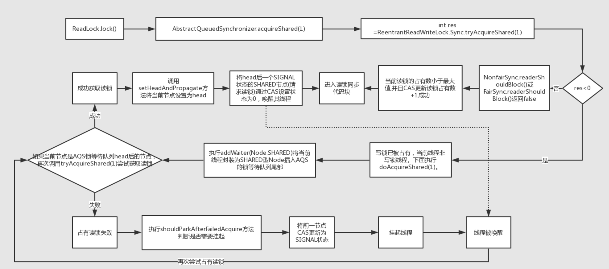

原文地址：https://www.jianshu.com/p/9f98299a17a5

# 前言

ReentrantReadWriteLock出现的目的就是针对ReentrantLock独占带来的性能问题，使用ReentrantLock无论是“写/写”线程、“读/读”线程、“读/写”线程之间的工作都是互斥，同时只有一个线程能进入同步区域。然而大多实际场景是<font color='cornflowerblue'>“读/读”线程间并不存在互斥关系</font>，只有"读/写"线程或"写/写"线程间的操作需要互斥的。

因此引入ReentrantReadWriteLock，它的特性是： **一个资源可以被多个读操作访问，或者一个写操作访问，但两者不能同时进行**。从而提高读操作的吞吐量。

# 初识ReentrantReadWriteLock

ReentrantReadWriteLock并没有继承ReentrantLock，也并没有实现Lock接口，而是实现了ReadWriteLock接口，该接口提供readLock()方法获取读锁，writeLock()获取写锁。

```java
public class ReentrantReadWriteLock implements ReadWriteLock, java.io.Serializable {
    private final ReentrantReadWriteLock.ReadLock readerLock;
    private final ReentrantReadWriteLock.WriteLock writerLock;

    public ReentrantReadWriteLock.WriteLock writeLock() { return writerLock; }
    public ReentrantReadWriteLock.ReadLock  readLock()  { return readerLock; }
}

public interface ReadWriteLock {
    Lock readLock();

    Lock writeLock();
}
```

默认构造方法为**非公平模式 **，开发者也可以通过指定fair为true设置为**公平模式** 。

```java
public ReentrantReadWriteLock() {
    this(false);
}
public ReentrantReadWriteLock(boolean fair) {
    sync = fair ? new FairSync() : new NonfairSync();
    readerLock = new ReadLock(this);
    writerLock = new WriteLock(this);
}

public static class ReadLock implements Lock, java.io.Serializable {}
public static class WriteLock implements Lock, java.io.Serializable {}
```

而公平模式和非公平模式分别由内部类FairSync和NonfairSync实现，这两个类继承自另一个内部类Sync，该Sync继承自AbstractQueuedSynchronizer(以后简称**AQS**)，这里基本同ReentrantLock的内部实现一致。

```dart
abstract static class Sync extends AbstractQueuedSynchronizer {
}

static final class FairSync extends Sync {
}

static final class NonfairSync extends Sync {
}
```

在ReentrantLock的分析中得知，其独占性和重入性都是通过CAS操作维护AQS内部的state变量实现的。ReentrantReadWriteLock将这个int型state变量分为高16位和低16位，**高16位表示当前读锁的占有量**，**低16位表示写锁的占有量**，详见ReentrantReadWriteLock的内部类Sync :

```java
abstract static class Sync extends AbstractQueuedSynchronizer {
    static final int SHARED_SHIFT   = 16;
    static final int SHARED_UNIT    = (1 << SHARED_SHIFT);
    static final int MAX_COUNT      = (1 << SHARED_SHIFT) - 1;
    static final int EXCLUSIVE_MASK = (1 << SHARED_SHIFT) - 1;

    /** 读锁数量  */
    static int sharedCount(int c)    { return c >>> SHARED_SHIFT; }
    /** 写锁数量  */
    static int exclusiveCount(int c) { return c & EXCLUSIVE_MASK; }
    ...
}
```

# 读锁分析

读锁，锁定的是AQS的state变量的高16位

- 当state的高16位等于0，表示当前读锁未被占有；
- 当state的高16位大于0，表示当前读锁可能被一个或多个线程占有，多于一个占有读锁的线程，允许重入。

## 读锁竞争

**readLock.lock()**

```java
public void lock() {
    sync.acquireShared(1);
}
```

**sync.acquireShared(arg)**

```java
public final void acquireShared(int arg) {
    if (tryAcquireShared(arg) < 0)
        doAcquireShared(arg);
}
```

**tryAcquireShared(arg)**

```java
protected final int tryAcquireShared(int unused) {
    Thread current = Thread.currentThread();
    int c = getState();
    //如果写锁被其他线程持有，竞争失败
    if (exclusiveCount(c) != 0 && getExclusiveOwnerThread() != current)
        return -1;
    int r = sharedCount(c);
    //如果写无需阻塞(在sync队列前无其他节点),写锁未超出上限,并且更新状态成功,说明获取写锁成功
    if (!readerShouldBlock() && r < MAX_COUNT && compareAndSetState(c, c + SHARED_UNIT)) {
        if (r == 0) {//第一个获取读锁
            firstReader = current;
            firstReaderHoldCount = 1;
        } else if (firstReader == current) {
            firstReaderHoldCount++;
        } else {
            HoldCounter rh = cachedHoldCounter;
            if (rh == null || rh.tid != getThreadId(current))
                cachedHoldCounter = rh = readHolds.get();
            else if (rh.count == 0)
                readHolds.set(rh);
            rh.count++;
        }
        return 1;
    }
    /** 
     *完整版尝试获取读锁(自旋获取),功能类似!readerShouldBlock() && r < MAX_COUNT && compareAndSetState(c, c + 		 *SHARED_UNIT)
    */
    return fullTryAcquireShared(current);
}
```

tryAcquireShared(arg)竞争成功返回1,失败返回-1

readerShouldBlock()根据公平/非公平模式执行不同的策略

- 公平模式:如果在sync队列中,当前节点无前序节点,则无需阻塞
- 非公平模式:如果sync队列头节点不是Exclusive节点,则无需阻塞

**doAcquireShared(arg)**

```java
private void doAcquireShared(int arg) {
    final Node node = addWaiter(Node.SHARED);
    boolean failed = true;
    try {
        boolean interrupted = false;
        for (;;) {
            final Node p = node.predecessor();
            if (p == head) {
                int r = tryAcquireShared(arg);
                if (r >= 0) {//获取资源成功
                    setHeadAndPropagate(node, r);
                    p.next = null; // help GC
                    if (interrupted)
                        selfInterrupt();
                    failed = false;
                    return;
                }
            }
            if (shouldParkAfterFailedAcquire(p, node) && parkAndCheckInterrupt())
                interrupted = true;
        }
    } finally {
        if (failed)
            cancelAcquire(node);
    }
}
```

**setHeadAndPropagate(node, r)**

```java
private void setHeadAndPropagate(Node node, int propagate) {
    Node h = head; // Record old head for check below
    setHead(node);
    if (propagate > 0 || h == null || h.waitStatus < 0 ||
        (h = head) == null || h.waitStatus < 0) {
        Node s = node.next;
        if (s == null || s.isShared())
            doReleaseShared();
    }
}
```

设置头节点,如果下一个节点是shared节点,则提前释放共享锁.

**读锁竞争总结**



<center>读锁竞争过程.png</center>

读锁的获取条件要满足:

1. 当前的写锁未被占有(AQS state变量低16位为0) 或者当前线程是写锁占有的线程
2. readerShouldBlock()方法返回false
3. 当前读锁占有量小于最大值(2^16 -1) 
4. 成功通过CAS操作将读锁占有量+1(AQS的state高16位同步加1) 

## 读锁释放

**unlock()**

```java
public void unlock() {
    sync.releaseShared(1);
}
```

**release(arg)**

```java
public final boolean releaseShared(int arg) {
    if (tryReleaseShared(arg)) {
        doReleaseShared();
        return true;
    }
    return false;
}
```

**tryReleaseShared(arg)**

```java

protected final boolean tryReleaseShared(int unused) {
    Thread current = Thread.currentThread();
    // 如果是第一个线程
    if (firstReader == current) {
        // 如果是 1，将第一个线程设置成 null。结束。
        if (firstReaderHoldCount == 1)
            firstReader = null;
        // 如果不是 1，减一操作
        else
            firstReaderHoldCount--;
    } else {//如果不是当前线程
        HoldCounter rh = cachedHoldCounter;//最后一个读锁线程用于校验读锁数量是否能正常归零
        // 如果缓存是 null 或者缓存所属线程不是当前线程，则当前线程不是最后一个读锁。
        if (rh == null || rh.tid != getThreadId(current))
            // 获取当前线程的计数器
            rh = readHolds.get();
        int count = rh.count;
        // 如果计数器小于等于一，就直接删除计数器
        if (count <= 1) {
            readHolds.remove();
            // 如果计数器的值小于等于0，说明有问题了，抛出异常
            if (count <= 0)
                throw unmatchedUnlockException();
        }
        // 对计数器减一
        --rh.count;
    }
    for (;;) {// 死循环使用 CAS 修改状态
        int c = getState();
        // c - 65536, 其实就是减去一个读锁。对高16位减一。
        int nextc = c - SHARED_UNIT;
        // 修改 state 状态。
        if (compareAndSetState(c, nextc))
            // 修改成功后，如果是 0，表示读锁和写锁都空闲，则可以唤醒后面的等待线程
            return nextc == 0;
    }
}
```

tryReleaseShared(arg)若资源资源已经全部被释放,返回true,否则返回false

**doReleaseShared()**

```java
private void doReleaseShared() {
    for (;;) {
        Node h = head;
        if (h != null && h != tail) {
            int ws = h.waitStatus;
            if (ws == Node.SIGNAL) {
                if (!compareAndSetWaitStatus(h, Node.SIGNAL, 0))
                    continue;            // loop to recheck cases
                //唤醒节点
                unparkSuccessor(h);
            }
            else if (ws == 0 &&
                     !compareAndSetWaitStatus(h, 0, Node.PROPAGATE))
                continue;                // loop on failed CAS
        }
        if (h == head)                   // loop if head changed
            break;
    }
}
```

唤醒下一个节点,无论是shared/exclusive节点

**总结**


<center>读锁的释放.png</center>

读锁的释放过程即AQS的state高16位同步递减为0的过程，当state的高16位都为0表示读锁释放完毕，如果此时写锁状态为0（即该读锁不是写锁降级来的），唤醒head节点后下一个SIGNAL状态的节点的线程，一般为等待写锁的节点。如果读锁的占有数不为0，表示读锁未完全释放。或者写锁的占有数不为0，表示释放的读锁是写锁降级来的。

# 写锁分析

写锁的状态表示为AQS的state变量的低16位，当state低16位为0，表示当前写锁没有被占有，反之表示写锁被某个写线程占有(state = 1)或重入(state > 1)。

## 写锁竞争

**lock()**

```java
public void lock() {
    sync.acquire(1);
}
```

**acquire(arg)**

```java
public final void acquire(int arg) {
    if (!tryAcquire(arg) && acquireQueued(addWaiter(Node.EXCLUSIVE), arg))
        selfInterrupt();
}
```

**tryAcquire(arg)**

```java
protected final boolean tryAcquire(int acquires) {
    /*
     * Walkthrough:
     * 1. If read count nonzero or write count nonzero
     *    and owner is a different thread, fail.
     * 2. If count would saturate, fail. (This can only
     *    happen if count is already nonzero.)
     * 3. Otherwise, this thread is eligible for lock if
     *    it is either a reentrant acquire or
     *    queue policy allows it. If so, update state
     *    and set owner.
     */
    Thread current = Thread.currentThread();
    int c = getState();
    // 写锁数量
    int w = exclusiveCount(c);
    if (c != 0) {
        // 若写锁或读锁(w==0,说明读锁被占用)已经被占用,申请失败
        if (w == 0 || current != getExclusiveOwnerThread())
            return false;
        // 申请的资源超出限制,申请失败
        if (w + exclusiveCount(acquires) > MAX_COUNT)
            throw new Error("Maximum lock count exceeded");
        // Reentrant acquire
        setState(c + acquires);
        return true;
    }
    if (writerShouldBlock() || !compareAndSetState(c, c + acquires))
        return false;
    setExclusiveOwnerThread(current);
    return true;
}
```

tryAcquire(arg)获取成功返回true,否则返回false

**writerShouldBlock()**

- 在非公平模式下实现为:

```java
final boolean writerShouldBlock() {
    return false; // writers can always barge
}
```

非公平模式下允许满足条件的写操作直接插队。

- 在公平模式下实现为:

```java
final boolean writerShouldBlock() {
    return hasQueuedPredecessors();
}
```

公平模式下同读锁一样，如果AQS的锁等待队列不为空，写操作无法插队。

**尝试获取失败后会将exclusive节点加入sync队列之后**

不满足获取写锁条件的线程会封装为EXECLUSIVE型的NODE插入到AQS的锁等待队列尾部，通过acquireQueued方法进入循环，该循环内再次尝试获取写锁(因为经过上述操作，另一个锁占有线程可能释放了锁)，否则通过shouldParkAfterFailedAcquire方法将前一节点设置为SIGNAL状态后将自身线程挂起。当线程被唤醒后会再次尝试获取写锁，失败则继续挂起，以此循环。或成功占有写锁则将当前Node设置为head节点，返回中断标记并进入同步代码区。**与读操作不同的是写操作之间是互斥的，所以获取写锁后不会将下一个申请写操作的节点唤醒**

**总结**


<center>写锁竞争过程.png</center>

写锁获取的条件需要满足:

1. ** 读锁未被占用(AQS state高16位为0) ，写锁未被占用（state低16位为0）或者占用写锁的线程是当前线程**
2. ** writerShouldBlock()方法返回false,即不阻塞写线程 **
3. ** 当前写锁占有量小于最大值(2^16 -1)，否则抛出Error("Maximum lock count exceeded") **
4. ** 通过CAS竞争将写锁状态+1(将state低16位同步+1) **

## 写锁释放


<center>写锁的释放.png</center>

写锁的释放过程即AQS的state低16位同步递减为0的过程，当state的高16位都为0表示写锁释放完毕，唤醒head节点后下一个SIGNAL状态的节点的线程。如果该写锁占有线程未释放写锁前还占用了读锁，那么写锁释放后该线程就完全转换成了读锁的持有线程。

# 小结

- 读锁的重入是允许多个申请读操作的线程的，而写锁同时只允许单个线程占有，该线程的写操作可以重入。
- 如果一个线程占有了写锁，在不释放写锁的情况下，它还能占有读锁，即写锁降级为读锁。
- 对于同时占有读锁和写锁的线程，如果完全释放了写锁，那么它就完全转换成了读锁，以后的写操作无法重入，在写锁未完全释放时写操作是可以重入的。
- 公平模式下无论读锁还是写锁的申请都必须按照AQS锁等待队列先进先出的顺序。非公平模式下读操作插队的条件是锁等待队列head节点后的下一个节点是SHARED型节点，写锁则无条件插队。
- 读锁不允许newConditon获取Condition接口，而写锁的newCondition接口实现方法同ReentrantLock。