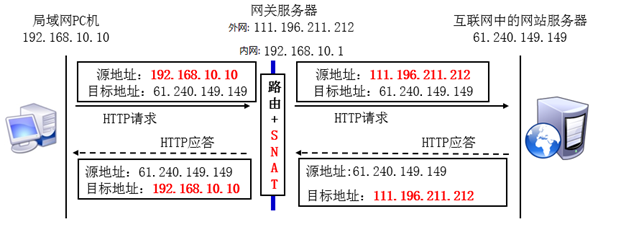

**1. git clone报错fatal authentication**

1. 在控制面板中删除凭证信息，因为git可能使用之前的凭证信息验证

2. 控制面板中凭证信息为空

   使用git bash命令清空保存的凭证

   `git config --system --unset credential.helper`

**2. YumRepo Error:All mirror URLs are not using http or file**

2020年12月2日，centos官方停止了对centos6的所有更新，并且下架了包括官方所有的centos6源，目前阿里、163、清华等centos6源已无法使用。

如果需要使用centos6 源，可以使用vault.centos.org作为centos的更新源。

修改文件/etc/yum.repos.d/CentOS-Base.repo为以下内容

```properties
 [centos-office]
 name=centos-office
 failovermethod=priority
 baseurl=https://vault.centos.org/6.10/os/x86_64/gpg
 check=1
 gpgkey=https://vault.centos.org/6.10/os/x86_64/RPM-GPG-KEY-CentOS-6  
```

****

**3. FastDFS：com.github.tobato.fastdfs.exception.FdfsIOException **

1) 无法获取服务端连接资源：can't create connection

无法服务器的原因是服务器端口未对外开放，可通过以下命令实现22122端口开放

```bash
# 查看打开的端口
/etc/init.d/iptables status
# 手动打开指定的端口(以23000为例)
/sbin/iptables -I INPUT -p tcp --dport 22122 -j ACCEPT
# 保存
/etc/rc.d/init.d/iptables save
```

2) 错误码：2，错误信息：找不到节点或文件

/etc/fdfs/storage.conf的配置文件错误

**4. 理解fasterdfs中各个配置文件作用**

**5.docker与VMware不能同时使用**

docker依赖于hyper-v，而[VMware运行时需要关闭hyper-v](https://www.zhihu.com/question/21260608)

# centos使用

## 环境搭建

### 特权运行centos

docker中centos7使用systemctl命令时提示*Failed to get D-Bus connection: Operation not permitted*

**错误原因：**

> Docker的设计理念是在容器里面不运行后台服务，容器本身就是宿主机上的一个独立的主进程，。一个容器的生命周期是围绕这个主进程存在的，所以正确的使用容器方法是将里面的服务运行在前台。
>
> systemd套件已经成为主流Linux发行版（比如CentOS7、Ubuntu14+）默认的服务管理，取代了传统的SystemV风格服务管理。systemd维护系统服务程序，它需要特权去会访问Linux内核。而容器并不是一个完整的操作系统，只有一个文件系统，而且默认启动只是普通用户这样的权限访问Linux内核，也就是没有特权，所以自然就用不了

**解决方案：以特权方式运行centos**

```
创建容器：
# docker run -d --name centos7 --privileged=true centos:7 /usr/sbin/init

进入容器：
# docker exec -it centos7 /bin/bash
```

### 常用软件/命令安装

 **[centos ifconfig命令找不到](https://jingyan.baidu.com/article/e8cdb32b92165777052bad9a.html)**

```bash
yum install -y net-tools.x86_64
```

**rz文件功能**

```bash
yum install lrzsz
```

**./make.sh: line 153: make: command not found**

```bash
yum -y install zlib zlib-devel pcre pcre-devel gcc gcc-c++ openssl openssl-devel libevent libevent-devel perl unzip net-tools wget 
```

**vim安装**

```bash
yum install vim
```

**firewall-cmd安装**

```bash
yum install firewalld systemd -y
```

### [ssh连接centos](https://blog.csdn.net/mimosa2008/article/details/102834423)

**在docker启动容器时指定端口映射**

```bash
docker run -d -p 50001:22 --privileged centos:centos7 /usr/sbin/init
```

**在xshell连接时使用宿主IP：宿主端口(50001)**

## fastFDFS

### 宿主机器与docker机器信息

```
宿主机器IP：192.168.56.1
docker的IP：172.17.0.2
```

**启动容器并指定端口映射**

```
docker run -d -p 50001:22 -p 22122:22122 -p 23000:23000 --privileged=true --name centos-fastfdfs centos:centos7 /usr/sbin/init
```

### 安装fastFDFS

详见**fastFDFS安装**

### 修改leyou-upload配置

```properties
fdfs:
  so-timeout: 1501 # 超时时间
  connect-timeout: 601 # 连接超时时间
  thumb-image: # 缩略图
    width: 60
    height: 60
  tracker-list: # tracker地址：你的虚拟机服务器地址+端口（默认是22122）
    - 192.168.56.1:22122
```

### 无法获取服务端连接资源：can not create connection to /172.17.0.2:23000

启动leyou-upload服务后，使用postman上传图片提示*can not create connection to /172.17.0.2:23000*


**问题原因**

172.17.0.2作为storage的绑定ip被注册到跟踪器tracker上（23000作为storage的通讯地址在storage.conf内指定），本地环境中通过连接宿主机的22122端口能够访问docker内部的22122端口，并拿到可用来存储的storage地址172.17.0.2，问题是，当我们的请求是从外部到达宿主机再到docker内部的时候，172.17.0.2地址对于docker和宿主机是可见的，但172.17.0.2这个存储地址返回到外部调用点时，外部调用点（也就是我的postMan）是不能识别172.17.0.2的，因此外部调用接口得到地址“172.17.0.2:23000”后想要上传图片，会提示无法进行连接的错误。

**解决办法**

修改iptables的NAT表规则能够有效的解决这类问题，将请求tracker:22122的数据源地址修改为宿主机地址，这样一来，我们storage的注册请求发送到tracker上时，注册ip就变成宿主机ip，这样我们拿到的返回地址就是宿主机的地址，这就能保证服务在本地及外部都具有可见性：

```bash
# 安装iptables 
yum install iptables -y;
# 添加iptables NAT表规则
iptables -t nat -A POSTROUTING -p tcp -m tcp --dport 22122 -d 172.17.0.2 -j SNAT --to 192.168.56.1;
# 查看NAT表规则
iptables -L -t nat;
# 重启storage使配置生效
# 重启本地项目？？？为何
```

再次使用postman上传图片，返回<font color='red'>图片位置（如何设定）</font>


### [iptables nat命令](https://www.cnblogs.com/whych/p/9147900.html)

**iptables命令中设置数据过滤或处理数据包的策略叫做规则，将多个规则合成一个链，叫规则链。**

规则链则依据处理数据包的位置不同分类：

> **PREROUTING:** 在进行路由判断之前所要进行的规则(DNAT/REDIRECT)
> **INPUT:**处理入站的数据包
> **OUTPUT:**处理出站的数据包
> **FORWARD:**处理转发的数据包
> **POSTROUTING:** 在进行路由判断之后所要进行的规则(SNAT/MASQUERADE)

**规则链的先后顺序:**

> **入站顺序:**PREROUTING→INPUT
>
> **出站顺序:**OUTPUT→POSTROUTING
>
> **转发顺序:**PREROUTING→FORWARD→POSTROUTING

iptables中的**规则表**是用于容纳**规则链**，规则表默认是允许状态的，那么规则链就是设置被禁止的规则，而反之如果规则表是禁止状态的，那么规则链就是设置被允许的规则。

> **raw表:**确定是否对该数据包进行状态跟踪
>
> **mangle表:**为数据包设置标记（较少使用）
>
> **nat表:**修改数据包中的源、目标IP地址或端口
>
> **filter表:**确定是否放行该数据包（过滤）


**规则表的先后顺序:raw→mangle→nat→filter**


**内建表与链的关系流程图（去掉了mangle表）：**


**注意：**

> 1.没有指定规则表则默认指filter表。
>
> 2.不指定规则链则指表内所有的规则链。
>
> 3.在规则链中匹配规则时会依次检查，匹配即停止（**LOG规则例外**），若没匹配项则按链的默认状态处理。


**iptables命令中则常见的控制类型有：**

> **ACCEPT:**允许通过.
> **LOG:**记录日志信息,然后传给下一条规则继续匹配.
> **REJECT:**拒绝通过,必要时会给出提示.
> **DROP:**直接丢弃,不给出任何回应.

**iptables命令基本参数**

```
iptables [-t 表名] 选项 [链名] [条件] [-j 控制类型]
iptables –[A|I 链] [-i|o 网络接口] [-p 协议] [-s 来源ip/网域] [-d 目标ip/网域] –j[ACCEPT|DROP]

-d：匹配目标地址
--dport：匹配目标端口号
-s：匹配来源地址IP/MASK，加叹号"!"表示除这个IP外。
--sport：匹配来源端口号
```

**NAT（Network AddressTranslation网络地址转换）**

**SNAT**即源地址转换，能够让多个内网用户通过一个外网地址上网，解决了IP资源匮乏的问题。一个无线路由器也就使用此技术。

```
iptables –t nat –A POSTROUTING –s 192.168.10.10 –o eth1 –j SNAT --to-source 111.196.221.212
```



**DNAT**即目地地址转换，则能够让外网用户访问局域网内不同的服务器。（相当于SNAT的反向代理）

```
iptables –t nat –A PREROUTING –i eth1 –d 61.240.149.149 –p tcp –dport 80 –j DNAT --to-destination 192.168.10.6:80
```


**REDIRECT**单独进行端口转换

```
iptables -t nat -A PREROUTING -p tcp --dport 80 -j REDIRECT --to-ports 8080
```


### 配置nginx

根据fastFDFS返回的路径请求图片，提示*image.leyou.com响应时间过长*

**问题原因**

image.leyou.com默认端口80，但该端口没有请求路径对应的服务，而真正提供服务的是centos容器的80端口。

**解决方法**

为centos容器建立新的端口映射（50002:80）

宿主机器使用nginx将image.leyou.com:80的请求转发到192.168.56.1:50002

centos容器使用nginx将80端口的请求交给FastDFS处理


```
# 宿主机器nginx配置
server {
    listen       80;
    server_name  image.leyou.com;

    proxy_set_header X-Forwarded-Host $host;
	proxy_set_header X-Forwarded-Server $host;
	proxy_set_header X-Forwarded-For $proxy_add_x_forwarded_for;
	
	location / {
		proxy_pass http://127.0.0.1:50002;
		proxy_connect_timeout 600;
		proxy_read_timeout 600;
	}
}

# centos容器nginx配置
# 取消了server_name的限制，仅对**80端口（由容器端口映射决定）**进行监听
server {
    listen       80;
    #server_name  image.leyou.com;

    # 监听域名中带有group的，交给FastDFS模块处理
    location ~/group([0-9])/M00 {
    ngx_fastdfs_module;
    }

    location / {
    root   html;
    index  index.html index.htm;
    }

    error_page   500 502 503 504  /50x.html;
    location = /50x.html {
    root   html;
    }
}
```

nginx常用命令：

```bash
nginx	# 启动nginx
nginx -s stop	# 停止nginx
nginx -s reload	# 重新载入配置文件
```

**注意：nginx -s reload可能不生效，需要手动关闭进程在启动**

### [修改容器端口映射](https://huanghailiang.github.io/2019/08/22/docker-p/)

1. **修改容器配置文件，然后重启docker服务；**

> 修改配置文件 /var/lib/docker/containers/[hash_of_the_container_ID]/hostconfig.json
>
> 重启docker服务操作 `systemctl restart docker`

但windows系统的配置文件找不到


2. **利用docker commit新构镜像【建议使用的方法】**

- 停止docker容器

  ```
  docker stop container_name
  ```

- commit新构docker image

  ```
  docker commit container_name new_image:tag
  ```

- 使用上一步生成的image重新生成一个新的镜像（此时记得加上端口映射）

  ```
  docker run --name new_container_name -p 80:80 new_image:tag
  ```

**使用方法2进行容器端口修改，并重新启用容器**

```bash
# 创建容器，指定端口映射，执行命令
docker run -itd -p 50001:22 -p 22122:22122 -p 23000:23000 -p 50002:80 --privileged=true --name centos-reflect centos:7-reflect /usr/sbin/init
# 进入容器bash命令
docker exec -d centos-reflect /bin/bash
```

## centos进程控制

**启动进程或程序**

​	./elasticsearch &后台运行程序

​    jobs -l查看后台程序

**[静态查看进程命令](https://www.cnblogs.com/xiangtingshen/p/10920236.html)**

1. pstree以树结构显示进程
   **$ pstree -p work | grep ad**

   ```
   sshd(22669)---bash(22670)---ad_preprocess(4551)-+-{ad_preprocess}(4552)
                                                   |-{ad_preprocess}(4553)
                                                   |-{ad_preprocess}(4554)
                                                   |-{ad_preprocess}(4555)
                                                   |-{ad_preprocess}(4556)
                                                   `-{ad_preprocess}(4557)
   ```

2. ps（Process Status)查看进程

   ps -ef 显示所有进程信息，连同命令行

   ps -u root 显示指定用户信息

3. pstack
   pstack显示每个进程的栈跟踪

**动态查看进程命令top**

**关闭程序kill**

kill -9 PID强制关闭

## nginx配置

## elasticsearch

具体配置过程见leyou-day11中资料。

**问题：**

docker端口映射配置

```bash
docker run -itd -p 50001:22 -p 22122:22122 -p 23000:23000 -p 50002:80 -p 9200:9200 -p 9300:9300 --privileged=true --name centos-search1 centos:search1 /usr/sbin/init
```

springboot配置：

```properties
spring:
  data:
    elasticsearch:
      cluster-name: elasticsearch
      cluster-nodes: 192.168.56.1:9300
```

使用以上配置报错*None of the configured nodes are available*


改用以下springboot配置后，正常运行

```properties
spring:
  data:
    elasticsearch:
      cluster-name: elasticsearch
      cluster-nodes: localhost:9300
```

但fastfdfs使用192.168.56.1可正常使用，为何elasticsearch不行？（但elasticsearch可使用192.168.56.1:9200访问到elasticsearch节点信息）

# windows使用

### 控制台命令

**获取端口**

**筛选端口**

**关闭进程**

# 开发错误

## ibs

**字符串正则匹配错误**

应用场景

```
解析"4月18日","12月8日"等字符串,使用了正则表达式(\\d+)(.*)(\\d+)(.*)
在解析"12月8日"时,group(2)="月",group(3)="8",但解析"12月18日"时,group(2)="月1",group(3)="8",与预期不符
```

错误原因及解决

```
java字符串正则匹配分为3个模式(以字符串"xfooxxxxxxfoo"为例):
1.贪婪模式(.*foo):尽可能匹配多的字符串,并保证之后的字符能匹配.".*"匹配结果"xfooxxxxxx"
2.勉强模式(.*?foo):尽可能匹配少的字符串,并保证之后的字符能匹配.".*?"匹配结果"x"
3.侵占模式(.*+foo):匹配最多的字符串.".*+"匹配结果"xfooxxxxxxfoo"

所以group(2)会匹配"月1",应将字符串改成(\\d+)月(\\d+)日
```

**数据库操作失败**

出错场景

```
前台提交一笔数据更新交易,后端的update语句一直不执行.
```

错误原因及解决

```
可能是其他人员也在操作同一个表,导致表被锁.
```

**mybatis更新失效**

出错场景

```
更新客户服务记录时,服务月份cntServMth=0时更新失效.
```

错误原因

```
Mybatis是弱类型,cntServMth的java类型为BigDecimal,当cntServMth=0时,会与cntServMth==''匹配,导致不更新.
```

**客户端与sql软件查询结果不一致**

出错场景

```
在sql软件中对"人员特定授权表"删除了部分记录,在sql软件上显示已删除成功,但在客户端查询的结果中已删除的记录仍可见.
```

出错原因

```
sql软件删除记录后并未提交,客户端通过非一致性读取的结果是记录的undo log中未删除的记录.
```

**人员特定授权项查询结果错误**

错误场景/原因

```
人员特定授权项的查询需要输入机构号,但该任务中有2个机构号,一个是操作人机构号,另一个是被操作人机构号,查询结果时应该输入被操作人机构号,但实际输入的是操作人机构号,导致查询结果错误.
```

解决方案(<font color='red'>对刷题和写功能都需要遵守</font>)

```
对于第一次出现的变量,尽量加注释写明变量的意义,避免变量实际意义与预期意义不符.
```


# mysql

## 环境配置

**[MySQL 1130错误，无法远程连接](https://www.cnblogs.com/devan/p/7055339.html)**

出错场景

```
centos虚拟机中运行了mysql服务,本机通过sqlyog连接提示"错误号码1130,无法远程连接"
```

错误原因

```
被连接的数据不允许使用其他主机访问，只允许是用 localhost;
```

解决方案

```
登入mysql后，更改"mysql" 数据库里的 "user" 表里的 "host"项，从"localhost"改称"%"
```

# spring

### @HttpApiRequestBody在单元测试时不能解析参数

出错场景

```
sison系统中使用太行的@HttpApiRequestBody解析参数，但在@SpringTest中不能将参数解析为对象
```

错误原因

```
太行对@HttpApiRequestBody做了解析处理，但是@HttpApiRequestBody并为继承@HttpRequestBody，所以单元测试时并不会解析@HttpApiRequestBody
```

### Mock不能再Controller层注入Dao对象，但可注入Service对象

出错场景

```java
@RunWith(SpringRunner.class)
@SpringBootTest
public class MyControllerTest{
	@Autowired
	MyController controller;
    @MockBean
    MyDao dao;
}
使用controller时，并未调用Mock产生的Dao对象，而是Spring容器中的Dao对象。
如果使用@MockBean MyService，使用controller使用则是Mock生产的Service对象。
```

错误原因

```
Mock的原理也是动态代理，而Controller对象中没有直接依赖Dao对象，所以不能注入。
可以声明@Autowired MyService，这样@MockBean dao就能注入myService，而myService会注入myController
```

### java.lang.NoClassDefFoundError: org/mockito/MockitoAnnotations$Mock

出错场景

```
由于Mockito不能对final/static等方法进行模拟，所以引入了PowerMockito，运行出现上述错误
```

错误原因

```
Mockito和PowerMockito的版本需对应，具体参考
```

# 网络安全

### default-src‘self'

出错原因

```
在使用OWASP ZAP做安全漏洞扫描时，出现了CSP SCANNER:Wildcart directive,Evidence:default-src'self'
```

原因分析

```
安全策略配置格式default-src 'self',原配置少了空格。
为什么自己却认为是正常的呢？？？之后需要对此类错误更加敏感。
```

# 常见错误

### 添加的例外需要记录，并在改回后删除记录

问题描述

```
在配合测试时，写死了图形验证码和短信验证码，投产时差点忘记改过来。
```

问题解决

```
编写开发记录文档，简要记录开发内容，尤其是例外代码需要做例外记录，在例外代码改回后做例外排除记录。
```

### 编码错误

问题描述

```
在tomcat开发时,中文编码正常;在was部署时,中文编码异常.
```

问题分析

```
tomcat默认处理编码为utf-8
websphere默认处理编码为iso-8859-1
```

问题解决

```
在测试时,不仅要输入数字以及字母参数,还要输入文字,保证全面测试.
```

### 代码提交

问题描述

```
使用tortoiseGit进行代码提交时,可能会忘记添加部分文件,虽然在本地运行没问题,但在测试和生产会出现问题.
```

问题解决

```
发测试包进行测试
若自行测试则需要在本地单独重新拉取一个分支在本地运行,这样没添加并且未提交的问题就不会在本地有,运行则会暴露问题.
```

