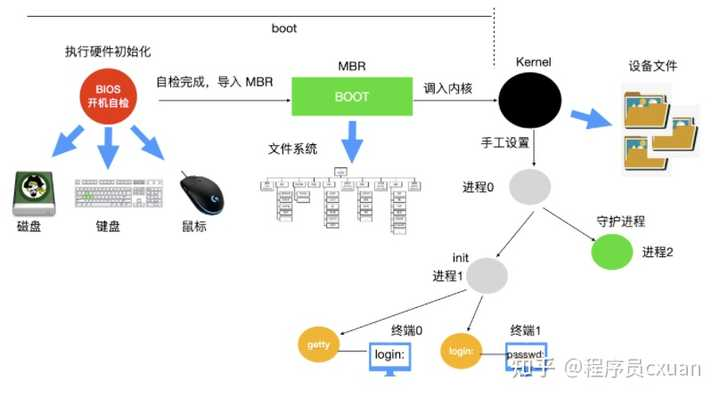

[参考链接](https://www.zhihu.com/question/446980297/answer/1755892330)

## 操作系统简介

### 什么是操作系统?

**操作系统是管理硬件和软件的一种应用程序**。操作系统是运行在计算机上最重要的一种<font color='red'>软件</font>，它管理计算机的资源和进程以及所有的硬件和软件。<font color='cornflowerblue'>它为计算机硬件和软件提供了一种中间层，使应用软件和硬件进行分离，让我们无需关注硬件的实现，把关注点更多放在软件应用上</font>。


### 操作系统的主要功能是什么?

1. `进程管理`: 进程管理的主要作用就是任务调度，在单核处理器下，操作系统会为每个进程分配一个任务，进程管理的工作十分简单；而在多核处理器下，操作系统除了要为进程分配任务外，还要解决处理器的调度、分配和回收等问题

2. `内存管理`：内存管理主要是操作系统负责管理内存的分配、回收，在进程需要时分配内存以及在进程完成时回收内存，协调内存资源，通过合理的页面置换算法进行页面的换入换出

3. `设备管理`：根据确定的设备分配原则对设备进行分配，使设备与主机能够并行工作，为用户提供良好的设备使用界面。

4. `文件管理`：有效地管理文件的存储空间，合理地组织和管理文件系统，为文件访问和文件保护提供更有效的方法及手段。

5. `提供用户接口`：操作系统提供了访问应用程序和硬件的接口，使用户能够通过应用程序发起系统调用从而操纵硬件，实现想要的功能。

### 软件访问硬件有几种方式?

软件访问硬件其实就是一种 IO 操作，软件访问硬件的方式也就是 I/O 操作的方式。

硬件在 I/O 上大致分为**并行和串行**，同时也对应串行接口和并行接口。

选择和衡量 I/O 控制方式有如下三条原则

> （1） 数据传送速度足够快，能满足用户的需求但又不丢失数据；
> （2） 系统开销小，所需的处理控制程序少；
> （3） 能充分发挥硬件资源的能力，使 I/O 设备尽可能忙，而 CPU 等待时间尽可能少。

**根据以上控制原则，[I/O 操作可以分为四类](https://www.cnblogs.com/cpsmile/p/8466558.html)**

- `直接访问`：由用户进程直接控制主存或 CPU 和外围设备之间的信息传送。直接程序控制方式又称为忙/等待方式。
- `中断驱动`：为了减少程序直接控制方式下 CPU 的等待时间以及提高系统的并行程度，系统引入了中断机制。中断机制引入后，外围设备仅当操作正常结束或异常结束时才向 CPU 发出中断请求。在 I/O 设备输入每个数据的过程中，由于无需 CPU 的干预，一定程度上实现了 CPU 与 I/O 设备的并行工作。

上述两种方法的特点都是以 `CPU` 为中心，数据传送通过一段程序来实现，软件的传送手段限制了数据传送的速度。接下来介绍的这两种 I/O 控制方式采用硬件的方法来进行 I/O 的控制

- `DMA 直接内存访问`：为了进一步减少 CPU 对 I/O 操作的干预，防止因并行操作设备过多使 CPU 来不及处理或因速度不匹配而造成的数据丢失现象，引入了 DMA 控制方式。
- `通道控制方式`：通道，独立于 CPU 的专门负责输入输出控制的处理机，它控制设备与内存直接进行数据交换。有自己的通道指令，这些指令由 CPU 启动，并在操作结束时向 CPU 发出中断信号。

**DMA与中断的区别**

- 中断方式是在数据缓冲寄存器满之后发出中断，要求CPU进行中断处理，而DMA方式则是在所要求传送的数据块全部传送结束时要求CPU 进行中断处理。这就大大减少了CPU进行中断处理的次数。
- 中断方式的数据传送是在中断处理时由CPU控制完成的，而DMA方式则是在DMA控制器的控制下，不经过CPU控制完成的。这就排除了CPU因并行设备过多而来不及处理以及因速度不匹配而造成数据丢失等现象。

### 为什么 Linux 系统下的应用程序不能直接在 Windows 下运行?

其中一点是因为 Linux 系统和 Windows 系统的格式不同，格式就是协议，就是在固定位置有意义的数据。Linux 下的可执行程序文件格式是<font color='cornflowerblue'> elf</font>，可以使用 readelf 命令查看 elf 文件头。而 Windows 下的可执行程序是 <font color='cornflowerblue'>PE</font> 格式，它是一种可移植的可执行文件。


还有一点是因为 Linux 系统和 Windows 系统的 API 不同.Linux 中的 API 被称为系统调用，是通过 int 0x80 这个<font color='cornflowerblue'>软中断</font>实现的。而 Windows 中的 API 是放在<font color='cornflowerblue'>动态链接库</font>文件中的，也就是 Windows 开发人员所说的 DLL ，这是一个库，里面包含代码和数据。Linux 中的可执行程序获得系统资源的方法和 Windows 不一样，所以显然是不能在 Windows 中运行的。

### [操作系统有几种结构?](https://blog.csdn.net/qq_43606914/article/details/105857519)

1. **单体系统**

   在大多数常见的组织中，<font color='cornflowerblue'>整个操作系统在内核态以单一程序的方式运行</font>。整个操作系统以过程集合的方式编写，链接成一个大型可执行二进制程序。

   使用这种技术，系统中每个过程可以自由调用其他过程，只要后者提供了前者所需要的一些有用的计算工作。调用任何一个所需要的过程，或许会非常高效，但上千个可以不受限制地彼此调用的过程常常会导致系统笨拙且难于理解。并且任何一个系统的崩溃都会连累整个系统。
   
2. **分层系统**

   分层系统使用层来分隔不同的功能单元。每一层只与该层的上层和下层通信。每一层都使用下面的层来执行其功能。层之间的通信通过预定义的固定接口通信。

   分层系统的优点

   - 结构清晰，有利于操作系统的维护，扩充，移植;
   - 整体问题局部化，系统正确性得到保证；

3. **微内核**

   只有其中一个模块(微内核)运行在内核态，其余的模块由于功能相对弱些，作为普通用户进程运行。由于把每个设备驱动和文件系统分别作为普通用户进程，这些模块中的错误虽然会使这些模块崩溃，但是不会使得整个操作系统死机。

   `MINIX 3` 是微内核的代表作，它的具体结构如下:

   

4. **客户-服务器模式**
   微内核思想的略微变体是将进程划分为两类：服务器（提供某种服务），客户端（使用服务）。这种模式就是客户端——服务器模式。这个模式的本质是存在客户端进程和服务器进程。

   一般服务器客户端之间的通信是“消息传递”。为了获得一个服务，客户端进程构造一段消息，说明所需要的服务，并将其发给合适的服务器。该服务器完成工作，发送回应。

   普遍情况下是客户端和服务器在不同的机器上，它们通过局域网或广域网连接。

   

5. **虚拟机**

   系统的核心称为“虚拟机监控程序”，它在逻辑上运行并具备了多道程序功能。该系统向上层提供了若干台虚拟机。他们仅仅是**裸机硬件的精确复制品**。虚拟机运行在用户态,但可利用虚拟化的CPU执行内核态的系统指令.

6. **外核**

   与虚拟机克隆真实机器不同，另一种策略是对机器进行分区。在底层中，一种称为“外核”的程序在内核态中运行。它的任务是为虚拟机分配资源，并检查用这些资源的企图，以确保没有机器会使用他人的资源。每个用户层的虚拟机都可以运行自己的操作系统，但限制只能使用已经申请并获得分配的那部分资源。


### **为什么称为陷入内核**

如果把软件结构进行分层(，最外层是应用程序，里面是操作系统内核。


应用程序处于特权级 3，操作系统内核处于特权级 0 。如果用户程序想要访问操作系统资源时，会发起系统调用，陷入内核，这样 CPU 就进入了内核态，执行内核代码。至于为什么是陷入，图中内核是一个凹陷的构造，有陷下去的感觉，所以称为陷入。

### 什么是用户态和内核态

用户态和内核态是操作系统的两种运行状态。

- `内核态`：处于内核态的 CPU <font color='cornflowerblue'>可以访问任意的数据</font>，包括外围设备，比如网卡、硬盘等，处于内核态的 CPU 可以从一个程序切换到另外一个程序，并且占用 <font color='cornflowerblue'>CPU 不会发生抢占</font>情况，一般处于特权级 0 的状态我们称之为内核态。
- `用户态`：处于用户态的 CPU 只能受限的访问内存，并且不允许访问外围设备，用户态下的 CPU 不允许独占，也就是说 CPU 能够被其他程序获取。

> 那么为什么要有用户态和内核态呢？

主要是对访问能力的限制的考量，计算机中有一些比较危险的操作，比如设置时钟、内存清理，这些都需要在内核态下完成，如果随意进行这些操作，系统容易崩溃。

### **用户态和内核态是如何切换的？**

所有的用户进程都是运行在用户态的，但是我们上面也说了，用户程序的访问能力有限，一些比较重要的比如从硬盘读取数据，从键盘获取数据的操作则是内核态才能做的事情，而这些数据却又对用户程序来说非常重要。所以就涉及到两种模式下的转换，即**用户态 -> 内核态 -> 用户态**，而唯一能够做这些操作的只有 `系统调用`，而能够执行系统调用的就只有 `操作系统`。

一般用户态 -> 内核态的转换我们都称之为 trap 进内核，也被称之为 `陷阱指令(trap instruction)`。

他们的工作流程如下：


首先用户程序会调用 `glibc` 库，通过glibc 库准备系统调用。

glibc 库调用`软件中断指令(SWI)` ，这个指令通过更新 `CPSR` 寄存器将模式改为<font color='cornflowerblue'>超级用户模式</font>，然后跳转到地址 `0x08` 处。从地址 0x08 开始，进程执行加载并跳转到中断处理程序，这个程序就是 ARM 中的 `vector_swi()`。在 vector_swi() 处，从 SWI 指令中提取系统调用号 SCNO，然后使用 SCNO 作为系统调用表 `sys_call_table` 的索引，调转到系统调用函数。

执行系统调用完成后，将还原用户模式寄存器，然后再以用户模式执行。

### **什么是内核**

**在计算机中，内核是一个计算机程序，它是操作系统的核心，可以控制操作系统中所有的内容**。内核通常是在 boot loader 装载程序之前加载的第一个程序。

`boot loader`。

> boot loader 又被称为引导加载程序，能够将计算机的操作系统放入内存中。在电源通电或者计算机重启时，BIOS 会执行一些初始测试，然后将控制权转移到引导加载程序所在的`主引导记录(MBR)` 。

开机流程

> BIOS：开机主动执行的韧体，根据设置识别第一个可开机的装置；
>
> MBR：可开机装置的第一个扇区内的主要启动记录区块，内含开机管理程序；
>
> 开机管理程序(boot loader)：可读取核心文件来执行的软件；
>
> 核心文件：开始操作系统的功能... 

boot loader的任务

> 提供选单：用户可以选择不同的开机项目，这也是多重引导的重要功能！
>
> 载入核心文件：直接指向可开机的程序区段来开始操作系统；
>
> 转交其他 loader：将开机管理功能转交给其他 loader 负责。

### **什么是实时系统**

实时操作系统对时间做出了严格的要求，实时操作系统分为两种：**硬实时和软实时**

`硬实时操作系统`规定某个动作必须在规定的时刻内完成或发生，比如汽车生产车间，焊接机器必须在某一时刻内完成焊接，焊接的太早或者太晚都会对汽车造成永久性伤害。

`软实时操作系统`虽然不希望偶尔违反最终的时限要求，但是仍然可以接受。并且不会引起任何永久性伤害。比如数字音频、多媒体、手机都是属于软实时操作系统。

硬实时和软实时的两个指标：**是否在时刻内必须完成以及是否造成严重损害**。


### Linux 操作系统的启动过程

当计算机电源通电后，`BIOS`会进行`开机自检(Power-On-Self-Test, POST)`，对硬件进行检测和初始化。因为操作系统的启动会使用到磁盘、屏幕、键盘、鼠标等设备。

磁盘中的第一个分区，也被称为 `MBR(Master Boot Record)` 主引导记录，被读入到内存区域并执行。这个分区中有一个只有 512 字节的程序(boot程序)。

复制完成后，boot 程序读取启动设备的根目录。boot 程序要解析文件系统和目录格式。然后 boot 程序调用内核，把控制权移交给内核。系统内核开始运行。

内核启动代码是使用`汇编语言`完成的，主要包括创建内核堆栈、识别 CPU 类型、计算内存、禁用中断、启动内存管理单元等，然后调用 C 语言的 main 函数执行操作系统部分。

> 操作系统会进行自动配置，检测设备，加载配置文件，被检测设备如果做出响应，就会被添加到已链接的设备表中，如果没有相应，就归为未连接直接忽略。
>
> 配置完所有硬件后，开始处理[进程0](https://blog.csdn.net/gongxifacai_believe/article/details/53771464)，设置其堆栈，然后运行它，执行初始化、配置时钟、挂载文件系统。创建 `init 进程(进程 1 )` 和 `守护进程(进程 2)`。

init 进程会检测它的标志以确定它是否为单用户还是多用户服务。在前一种情况中，它会调用 fork 函数创建一个 shell 进程，并且等待这个进程结束。后一种情况调用 fork 函数创建一个运行系统初始化的 shell 脚本（即 /etc/rc）的进程，这个进程可以进行文件系统一致性检测、挂载文件系统、开启守护进程等。

 /etc/rc 进程会从 /etc/ttys 中读取数据，/etc/ttys 列出了所有的终端和属性。对于每一个启用的终端，这个进程调用 fork 函数创建一个自身的副本，进行内部处理并运行一个名为 `getty` 的程序。

getty 程序会在终端上输入`login:`等待用户输入用户名，在输入用户名后，getty 程序结束，登陆程序 `/bin/login` 开始运行。`/bin/login` 程序需要输入密码，并与保存在 `/etc/passwd` 中的密码进行对比，如果输入正确，login 程序以用户 shell 程序替换自身，等待第一个命令。如果不正确，login 程序要求输入另一个用户名。

整个系统启动过程如下



## 进程和线程

### 多处理系统有什么优势?

多处理系统的吞吐量比较高

多处理系统拥有多个并行的处理器，这些处理器共享时钟、内存、总线、外围设备等。

多处理系统拥有多个并行的处理器，整个系统的可靠性也随之提高


### 什么是进程和进程表

`进程`就是正在执行程序的实例，比如说 Web 程序就是一个进程，shell 也是一个进程，文章编辑器 typora 也是一个进程。

操作系统负责管理所有正在运行的进程，操作系统会为每个进程分配特定的时间来占用 CPU，操作系统还会为每个进程分配特定的资源。

操作系统为了跟踪每个进程的活动状态，维护了一个`进程表`。在进程表记录了每个进程的状态以及每个进程使用的资源等。


### 线程和进程的区别

1. 定义

   进程是程序执行时的一个实例，目的是担当分配<font color='cornflowerblue'>系统资源</font>的基本单位。

   线程是进程的一个执行流，是<font color='cornflowerblue'>cpu</font>调度和分配的基本单位

2. 资源拥有

   <font color='cornflowerblue'>进程间不共享内存</font>,只共享磁盘空间,创建进程需要操作系统分配新的地址空间，数据资源等，开销大

   同属一个进程的线程共享进程的地址空间,创建线程仅仅需要`堆栈指针`和`程序计数器`,开销小


### 什么是上下文切换?

对于单核单线程 CPU 而言，在某一时刻只能执行一条 CPU 指令。上下文切换 (Context Switch) 是一种 **将 CPU 资源从一个进程分配给另一个进程的机制**。计算机能够并行运行多个进程，这恰恰是操作系统通过快速上下文切换造成的结果。在上下文切换的过程中，操作系统需要先存储当前进程的状态 (包括内存空间的指针，当前执行完的指令等等)，再读入下一个进程的状态，然后执行此进程。


作者：程序员cxuan
链接：https://www.zhihu.com/question/446980297/answer/1755892330
来源：知乎
著作权归作者所有。商业转载请联系作者获得授权，非商业转载请注明出处。


### 进程终止的方式有哪些?

**进程的终止**

- `正常退出(自愿的)`
- `错误退出(自愿的)`
- `严重错误(非自愿的)`
- `被其他进程杀死(非自愿的)`

**正常退出**

多数进程是由于完成了工作而终止。进程完成工作后，会执行一个<font color='cornflowerblue'>系统调用</font>告诉操作系统它完成了工作。这个调用在 UNIX 中是 `exit` ，在 Windows 中是 `ExitProcess`。面向屏幕中的软件也支持自愿终止操作。字处理软件、Internet 浏览器和类似的程序中总有一个供用户点击的图标或菜单项，用来通知进程删除它锁打开的任何临时文件，然后终止。

**错误退出(编译错误)**

进程发生终止的第二个原因是发现严重错误，例如，如果用户执行如下命令

```text
cc foo.c
```

为了能够编译 foo.c 但是该文件不存在，于是编译器就会发出声明并退出。在给出了错误参数时，面向屏幕的交互式进程会询问用户是需要重试还是退出。

**严重错误(运行时错误**

严重错误通常是由于程序运行时的错误所导致的。例如，执行了一条非法指令，引用不存在的内存，或者除数是 0 等。在有些系统比如 UNIX 中，进程可以通知操作系统，它希望自行处理某种类型的错误，在这类错误中，进程会收到信号（中断），而不是在这类错误出现时直接终止进程。

**被其他进程杀死**

第四个终止进程的原因是，某个进程执行系统调用告诉操作系统杀死某个进程。在 UNIX 中，这个系统调用是 kill。在 Win32 中对应的函数是 `TerminateProcess`（注意不是系统调用）。

### 进程间的通信方式

进程间的通信方式比较多，首先你需要理解下面这几个概念

- 竞态条件：即两个或多个线程同时对一共享数据进行修改，从而影响程序运行的正确性时，这种就被称为`竞态条件(race condition)`。
- 临界区：不仅`共享资源`会造成竞态条件，事实上共享文件、共享内存也会造成竞态条件、那么该如何避免呢？或许一句话可以概括说明：**禁止一个或多个进程在同一时刻对共享资源（包括共享内存、共享文件等）进行读写**。换句话说，我们需要一种 `互斥(mutual exclusion)` 条件，这也就是说，如果一个进程在某种方式下使用共享变量和文件的话，除该进程之外的其他进程就禁止做这种事（访问统一资源）。
  一个好的解决方案，应该包含下面四种条件

1. 任何时候两个进程不能同时处于临界区
2. 不应对 CPU 的速度和数量做任何假设
3. 位于临界区外的进程不得阻塞其他进程
4. 不能使任何进程无限等待进入临界区

- 忙等互斥：当一个进程在对资源进行修改时，其他进程必须进行等待，进程之间要具有互斥性，我们讨论的解决方案其实都是基于忙等互斥提出的。

进程间的通信主要有下面 [7种通信方式](https://blog.csdn.net/zhaohong_bo/article/details/89552188)


- `消息传递(信号)`：消息传递是进程间实现通信和同步等待的机制，使用消息传递，进程间的交流不需要共享变量，直接就可以进行通信；
- `管道`：管道用于两个相关进程(父子关系)之间的通信，这是一种半双工的通信方式，如果需要全双工，需要另外一个管道。
- `先进先出队列`：先进先出队列指的是两个不相关联进程间的通信，两个进程之间可以彼此相互进程通信，这是一种全双工通信方式
- `消息队列`：消息队列是<font color='cornflowerblue'>内核中存储消息的链表</font>，它由消息队列标识符进行标识，这种方式能够在不同的进程之间提供全双工的通信连接。
- `共享内存`：共享内存是使用所有进程之间的内存来建立连接，这种类型需要同步进程访问来相互保护。

- `信号量Semaphore`：信号量是一个计数器，可以用来控制多个进程对共享资源的访问。它常作为一种锁机制，防止某进程访问共享资源时其他进程也访问该资源。因此，主要作为进程间以及同一进程内不同线程之间的同步手段。

- `套接字Socket`：套解口也是一种进程间通信机制，与其他通信机制不同的是，它可用于不同机器间的进程通信。


### 进程间状态模型

**进程的三态模型**

当一个进程开始运行时，它可能会经历下面这几种状态


图中涉及三种状态

1. `运行态`：运行态指的就是进程实际占用 CPU 时间片运行时
2. `就绪态`：就绪态指的是可运行，但因为其他进程正在运行而处于就绪状态
3. `阻塞态`：阻塞态又被称为睡眠态，它指的是进程不具备运行条件，正在等待被 CPU 调度。

逻辑上来说，运行态和就绪态是很相似的。这两种情况下都表示进程`可运行`，但是第二种情况没有获得 CPU 时间分片。

阻塞态与前两种状态不同的原因是这个进程不能运行，CPU 空闲时也不能运行。

**进程的五态模型**

在三态模型的基础上，增加了两个状态，即 `新建` 和 `终止` 状态。


- 新建态：进程的新建态就是进程刚创建出来的时候

> 创建进程需要两个步骤：即为新进程分配所需要的资源和空间，设置进程为就绪态，并等待调度执行。

- 终止态：进程的终止态就是指进程执行完毕，到达结束点，或者因为错误而不得不中止进程。

> 终止一个进程需要两个步骤：先等待操作系统或相关的进程进行善后处理,然后回收占用的资源并被系统删除。

### **调度算法都有哪些**

调度算法分为三大类：批处理中的调度、交互系统中的调度、实时系统中的调度

#### 批处理中的调度

**先来先服务**

最简单的非抢占式调度算法的设计就是 `先来先服务(first-come,first-serverd)`:此算法按照请求顺序为进程分配 CPU。最基本的，会有一个就绪进程的等待队列。当第一个任务从外部进入系统时，将会立即启动并允许运行任意长的时间。它不会因为运行时间太长而中断。当其他作业进入时，它们排到就绪队列尾部。当正在运行的进程阻塞，处于等待队列的第一个进程就开始运行。当一个阻塞的进程重新处于就绪态时，它会像一个新到达的任务，会排在队列的末尾，即排在所有进程最后。

先来先服务的强大之处在于易于理解和编程，在这个算法中，一个单链表记录了所有就绪进程。要选取一个进程运行，只要从该队列的头部移走一个进程即可；要添加一个新的作业或者阻塞一个进程，只要把这个作业或进程附加在队列的末尾即可。

先来先服务也是有缺点的，那就是没有优先级的关系.后来的CPU密集型任务需要等待I/O密集型任务完成后才能执行.

**[最短进程优先](http://c.biancheng.net/view/1244.html)**

 `最短作业优先(Shortest Job First)`是非抢占式调度算法.在所有的进程都可以运行的情况下，最短作业优先的算法才是最优的.

> 最优是指各个进程的平均等待时长最短,即具有最短响应时间.

如何推断进程的时间?

一种方式是根据进程过去的行为进行推测。τ<sub>n+1</sub>= ατ<sub> n</sub> + (1-α)τ<sub> n</sub>

**最短剩余时间优先**

最短作业优先的抢占式版本被称作为 `最短剩余时间优先(Shortest Remaining Time Next)` 算法。使用这个算法，调度程序总是选择剩余运行时间最短的那个进程运行。当一个新作业到达时，其整个时间同当前进程的剩余时间做比较。如果新的进程比当前运行进程需要更少的时间，当前进程就被挂起，而运行新的进程。这种方式能够使短期作业获得良好的服务。

```
1.非抢占式优先权算法：系统一旦把处理机分配给就绪队列中优先权最高的进程后,该进程便一直执行下去,直至完成。
2.抢占式优先权调度算法：系统同样把处理机分配给优先权最高的进程,使之执行.但在其执行期间,只要又出现了另一个其优先权更高的进程,进程调度程序就立即停止当前进程(原优先权最高的进程)的执行,重新将处理机分配给新到的优先权最高的进程。
```

#### **交互式系统中的调度**

交互式系统中在个人计算机、服务器和其他系统中都是很常用的

**轮询调度**

一种最古老、最简单、最公平并且最广泛使用的算法就是 `轮询算法(round-robin)`。每个进程都会被分配一个时间段，称为`时间片(quantum)`，在这个时间片内允许进程运行。

> 如果时间片结束时进程还在运行的话，则抢占一个 CPU 并将其分配给另一个进程。
> 如果进程在时间片结束前阻塞或结束，则 CPU 立即进行切换。

轮询算法比较容易实现。调度程序所做的就是维护一个可运行进程的链表,时间片内结束的进程直接从链表头移除;时间片内未结束的进程移动到链表尾部.

**优先级调度**

`优先级调度(priority scheduling)`的基本思想很明确，每个进程都被赋予一个优先级，优先级高的进程优先运行。

高优先级的进程不会一直运行下去，可通过以下2中策略限制高优先级的进程:

> 1. 调度程序会在每个时钟中断期间降低当前运行进程的优先级。如果此操作导致其他进程的优先级更高，则会发生进程切换
>
> 2. 为每个进程分配允许运行的最大时间间隔。当时间间隔用完后，下一个高优先级的进程会得到运行的机会。

**[彩票调度](https://www.cnblogs.com/tobe98/p/11792610.html)**

有一种既可以给出预测结果而又有一种比较简单的实现方式的算法，就是 `彩票调度(lottery scheduling)`算法。他的基本思想为进程提供各种系统资源的`彩票`,进程时间长的任务被分配的彩票数量也更多。当做出一个调度决策的时候，就随机抽出一张彩票，拥有彩票的进程将获得资源。

**公平分享调度**

如果用户 1 启动了 9 个进程，而用户 2 启动了一个进程，使用轮转或相同优先级调度算法，那么用户 1 将得到 90 % 的 CPU 时间，而用户 2 将之得到 10 % 的 CPU 时间。

为了阻止这种情况的出现，一些系统在调度前会把进程的拥有者考虑在内。在这种模型下，每个用户都会分配一些CPU 时间，在A用户CPU时间时,调度程序会选择A用户的进程并强制执行。

### [影响调度程序的指标是什么](https://blog.csdn.net/yrx420909/article/details/104261086/)?

1. CPU 使用率：

> CPU 正在执行任务（即不处于空闲状态）的时间百分比。

2. 等待时间

> 等待时间，指进程/作业处于等待处理机状态时间之和

3. 吞吐量

> 单位时间内完成进程的数量

4. 响应时间

> 从提交流程到获得第一个有用输出所经过的时间。

5. 周转时间

> 从提交流程到完成流程所经过的时间。

## 内存管理

### **什么是按需分页**

在操作系统中，进程是以页为单位加载到内存中的，按需分页是一种`虚拟内存`的管理方式。在使用请求分页的系统中，只有在尝试访问页面所在的磁盘并且该页面尚未在内存中时，也就发生了`缺页异常`，操作系统才会将磁盘页面复制到内存中。

### 什么是虚拟内存

**虚拟内存定义**

虚拟内存是计算机系统内存管理的一种技术。它使得应用程序认为它拥有连续的可用的内存（一个连续完整的地址空间），而实际上，它通常是被分隔成多个物理内存碎片，还有部分暂时存储在外部磁盘存储器上，在需要时进行数据交换。

**虚拟内存的实现方式**

虚拟内存中，允许将一个作业分多次调入内存。若釆用连续分配方式时，会使相当一部分内存空间都处于暂时或`永久`的空闲状态，造成内存资源的严重浪费，而且也无法从逻辑上扩大内存容量。因此，虚拟内存的实需要建立在离散分配的内存管理方式的基础上。虚拟内存的实现有以下三种方式：

- 请求分页存储管理。
- 请求分段存储管理。
- 请求段页式存储管理。


**内存为何要分段**

8086CPU(x86前身) 没有 `虚拟地址`，只有物理地址，如果2个相同的程序编译出来的地址相同，那么2个程序的内存地址也相同,这两个程序是无法同时运行的。为了解决这个问题，操作系统设计人员提出了让 CPU 使用 `段基址 + 段内偏移` 的方式来访问任意内存。这样的好处是让程序可以 `重定位`，**这也是内存为什么要分段的第一个原因**.程序中需要用到哪块内存，就需要先加载合适的段到段基址寄存器中，再给出相对于该段基址的段偏移地址即可。CPU 中的地址加法器会将这两个地址进行合并，从地址总线送入内存。

8086CPU 有 20 根地址总线，最大的寻址能力是 1MB，而段基址所在的寄存器宽度只有 16 位，最大为你 64 KB 的寻址能力，64 KB 显然不能满足 1MB 的最大寻址范围，所以就要把内存分段，每个段的最大寻址能力是 64KB，但是仍旧不能达到最大 1 MB 的寻址能力，所以这时候就需要 `偏移地址`的辅助，偏移地址也存入寄存器，同样为 64 KB 的寻址能力，这么一看还是不能满足 1MB 的寻址，所以 CPU 的设计者对地址单元动了手脚，将段基址左移 4 位，然后再和 16 位的段内偏移地址相加，就达到了 1MB 的寻址能力。**所以内存分段的第二个目的就是能够访问到所有内存**。

### [物理地址、逻辑地址、有效地址、线性地址、虚拟地址的区别](https://blog.csdn.net/mzjmzjmzjmzj/article/details/84713351)

**物理地址**：物理地址就是内存单元的绝对地址,不管CPU内部怎么处理地址，最终访问的都是物理地址。在CPU实模式下“段基址+段内偏移地址”就是物理地址，CPU可以使用此地址直接访问内存。

**线性地址、虚拟地址**：CPU在保护模式下，“段基址+段内偏移地址”叫做线性地址，注意，保护模式下段基址寄存器中存储的不是真正的段基值（和实模式的含义不一样），而是被称为“段选择子”的东西，通过段选择子在GDT（全局描述表）中找到真正的段基值。另外，如果CPU在保护模式下没有开启分页功能，则线性地址就被当做最终的物理地址来用，若开启了分页功能，则线性地址就叫虚拟地址（在没开启分页功能的情况下线性地址和虚拟地址就是一回事）。但是，如果开启分页功能，虚拟地址（或线性地址）还要通过页部件电路转换成最终的物理地址。


**逻辑地址、有效地址**：无论CPU在什么模式下，段内偏移地址又称为有效地址或者逻辑地址.

### 空闲内存管理的方式

操作系统在动态分配内存时（malloc，new），需要对空间内存进行管理。一般采用了两种方式：位图和空闲链表。

**使用位图进行管理**

使用位图方法时，内存可能被划分为小到几个字或大到几千字节的分配单元。每个分配单元对应于位图中的一位，0 表示空闲， 1 表示占用（或者相反）。一块内存区域和其对应的位图如下


> 图 a 表示一段有 5 个进程和 3 个空闲区的内存，刻度为内存分配单元，阴影区表示空闲（在位图中用 0 表示）；图 b 表示对应的位图；图 c 表示用链表表示同样的信息

`位图`提供了一种简单的方法在固定大小的内存中跟踪内存的使用情况，因为**位图的大小取决于内存和分配单元的大小**。

分配单元的大小是一个重要的设计因素，分配单位越小，位图越大。如果选择更大的内存单元，位图应该要更小。如果进程的大小不是分配单元的整数倍，那么在最后一个分配单元中会有大量的内存被浪费。

当决定为把具有 k 个分配单元的进程放入内存时，`内容管理器(memory manager)` 必须搜索位图，在位图中找出能够运行 k 个连续 0 位的串。在位图中找出制定长度的连续 0 串是一个很耗时的操作，这是位图的缺点。

**使用空闲链表**

另一种记录内存使用情况的方法是维护一个记录已分配内存段和空闲内存段的链表，段会包含进程或者是两个进程的空闲区域。可用上面的图 c **来表示内存的使用情况**。链表中的每一项都可以代表一个 `空闲区(H)` 或者是`进程(P)`的起始标志，长度和下一个链表项的位置。

`段链表(segment list)`是按照地址排序的。这种方式的优点是，当进程终止或被交换时，更新列表很简单。

当按照地址顺序在链表中存放进程和空闲区时，有几种算法可以为创建的进程（或者从磁盘中换入的进程）分配内存。

- `首次适配算法`：在链表中进行搜索，直到找到最初的一个足够大的空闲区，将其分配。除非进程大小和空间区大小恰好相同，否则会将空闲区分为两部分，一部分为进程使用，一部分成为新的空闲区。该方法是速度很快的算法，因为索引链表结点的个数较少。
- `下次适配算法`：工作方式与首次适配算法相同，但每次找到新的空闲区位置后都记录当前位置，下次寻找空闲区从上次结束的地方开始搜索，而不是与首次适配放一样从头开始；
- `最佳适配算法`：搜索整个链表，找出能够容纳进程分配的最小的空闲区。这样存在的问题是，尽管可以保证为进程找到一个最为合适的空闲区进行分配，但大多数情况下，这样的空闲区被分为两部分，一部分用于进程分配，一部分会生成很小的空闲区，而这样的空闲区很难再被进行利用。
- `最差适配算法`：与最佳适配算法相反，每次分配搜索最大的空闲区进行分配，从而可以使得空闲区拆分得到的新的空闲区可以更好的被进行利用。

### [页面置换算法都有哪些?](https://blog.csdn.net/qq_41209741/article/details/99586257)

在地址映射过程中，如果在页面中发现所要访问的页面不在内存中，那么就会产生一条缺页中断。当发生缺页中断时，如果操作系统内存中没有空闲页面，那么操作系统必须在内存选择一个页面将其移出内存，以便为即将调入的页面让出空间。而用来选择淘汰哪一页的规则叫做页面置换算法。

下面我汇总的这些页面置换算法比较齐全，只给出简单介绍，算法具体的实现和原理读者可以自行了解。

- `最优算法`在当前页面中置换最后要访问的页面。不幸的是，没有办法来判定哪个页面是最后一个要访问的，`因此实际上该算法不能使用`。然而，它可以作为衡量其他算法的标准。

- `NRU(Not Recently Used)` 算法根据 R 位和 M 位的状态将页面分为四类。从编号最小的类别中随机选择一个页面。NRU 算法易于实现，但是性能不是很好。存在更好的算法。

  ```
   第0类：没有被访问，没有被修改。
   第1类：没有被访问，已被修改（M）。
   第2类：已被访问，没有被修改（R）。
   第3类：已被访问，已被修改（RM）。
  ```

- `FIFO` 会跟踪页面加载进入内存中的顺序，并把页面放入一个链表中。有可能删除存在时间最长但是还在使用的页面，因此这个算法也不是一个很好的选择。

- `第二次机会`算法对FIFO算法做了一个简单的修改：检查最老页面的R位。如果R位是0，那么这个页面既老又没有被使用，可以立刻置换掉；如果是1，就将R位置0，并把该页面放到链表的尾端，修改它的装入时间使它就像刚装入时间使它就像刚装入的一样，然后继续搜索。

- `时钟` 算法把所有的页面都保存在一个类似钟面的环形链表中，一个表指针指向最老的页面。当发生缺页中断时，首先检查表指针指向的页面，如果它的R位是0就淘汰该页面，并把新的页面插入这个位置，然后把表指针前移一个位置。如果R位是1就清除R位并把表指针前移一个位置；重复这个过程一直到找到一个R位为0的页面为止。

- `LRU` 理论上是可以实现的，但是代价很高。维护一个所有页面的链表，最近最多使用的页面在表头，最近最少使用的页面在表尾。困难的是在每次访问内存时都必须要更新整个链表.

- `NFU(Not Frequently Used)`  用一个软件模拟LRU，该算法将每个页面与一个软件计数器相关联。计数器的初值为0。每次时钟中断时，由操作系统扫描内存中所有的页面，将每个页面的R位（它是0或1）加到它的计数器上。这个计数器大体上跟踪了各个页面被访问的频繁程度。发生缺页中断时，则置换计数器值最小的页面。

- `老化` 算法是对NFU算法的修改，其修改包括两个部分，首先，在R位被加进之前将计数器右移一位，其次，将R位加到计数器最左端的位而不是最右端的位。    老化算法中的计数器只有有限位数，如果时钟滴答是20ms，8位一般是够用的。

- `WSClock`是基于工作集的页面置换算法,找出一个不在工作集中的页面并淘汰它。每个表项至少包含两条信息：上次使用该页面的近似时间和R（访问位）。

         过程：扫描所有的页面检查R位：
                若（R == 1）
                       设置上次使用时间为当前实际时间，以表示缺页中断时该页面正在被使用
                若（R == 0 且生存时间>τ）
                       移出这个页面，该页面在当前时钟滴答中未被访问，不在工作集中，用新的页面置换它。扫描会继续进行以更新剩余的表项。
                若（R == 0 且生存时间≤τ）
                       记住最小时间。如果该页面R==0且生存时间小于或等于τ，则页面仍在工作集中。把页面临时保存下来，但是要记住生存时间最长（“上次使用时间”的最小值）。如果扫描完整个页表却没有找到合适的淘汰的页面，如果找到了一个或多个R == 0的页面，就淘汰生存时间最长的页面。
      

**最好的算法是老化算法和WSClock算法**。

## 文件系统

## IO 篇

作者：程序员cxuan
链接：https://www.zhihu.com/question/446980297/answer/1755892330
来源：知乎
著作权归作者所有。商业转载请联系作者获得授权，非商业转载请注明出处。


## **死锁篇**

### **什么是僵尸进程**

僵尸进程是已完成且处于终止状态，但在进程表中却仍然存在的进程。僵尸进程通常发生在父子关系的进程中，子进程先于父进程结束,但父进程没有回收子进程的资源.

### **死锁产生的原因是什么**

死锁产生的原因大致有两个：资源竞争和程序执行顺序不当

**资源死锁产生的必要条件**

- 互斥条件：每个资源都被分配给了一个进程或者资源是可用的
- 请求和保持条件：请求新资源时继续占用已分配的资源
- 不可抢占条件：分配给一个进程的资源不能强制的从其他进程抢占资源，它只能由占有它的进程显示释放
- 循环等待：死锁发生时，系统中一定有两个或者两个以上的进程组成一个循环，循环中的每个进程都在等待下一个进程释放的资源。

### **如何破坏死锁?**

和死锁产生的必要条件一样，如果要破坏死锁，也是从下面四种方式进行破坏。

**破坏互斥条件**

互斥条件是非共享资源所必须的，不能改变.尽量做到尽可能少的进程可以请求资源。

**破坏保持和等待的条件**

如果我们能阻止持有资源的进程请求其他资源，我们就能够消除死锁。有以下2种实现方法:

```
1. 让所有的进程开始执行前请求全部的资源。如果所需的资源可用，进程会完成资源的分配并运行到结束。
2. 允许进程只获得运行初期需要的资源，便开始运行，在运行过程中逐步释放掉分配到的已经使用完毕的资源，然后再去请求新的资源。
```

**破坏不可抢占条件**

 当已经持有了一些资源的进程在提出新的资源请求没有得到满足时，它必须释放已经保持的所有资源，待以后需要使用的时候再重新申请。

**破坏循环等待条件**

现在就剩最后一个条件了，循环等待条件可以通过多种方法来破坏。

```
1. 制定一个标准，一个进程在任何时候只能使用一种资源。如果需要另外一种资源，必须释放当前资源。
2. 要求竞争的进程按顺序使用资源.
```

### [如何避免死锁](https://blog.csdn.net/guaiguaihenguai/article/details/80303835)

在分配资源时判断是否会出现死锁，只在不会出现死锁的情况下才分配资源。两种避免方法：

```
1、如果一个进程的请求会导致死锁，则不启动该进程
2、如果一个进程的增加资源请求会导致死锁 ，则拒绝该申请。
```

**[银行家算法](https://blog.csdn.net/weixin_52395937/article/details/111773754)**

获取一个分配资源的安全序列(不引起死锁)

### 如何检测死锁

使用银行家算法,如果得不到一个安全序列,说明已经产生死锁.

### **死锁的恢复方式有哪些?**

所以针对检测出来的死锁，我们要对其进行恢复，下面我们会探讨几种死锁的恢复方式

**抢占**

在某些情况下，可能会临时将某个资源从它的持有者转移到另一个进程。比如在不通知原进程的情况下，将某个资源从进程中强制取走给其他进程使用，使用完后又送回。这种恢复方式一般比较困难而且有些简单粗暴，并不可取。

**回滚**

如果系统设计者和机器操作员知道有可能发生死锁，那么就可以定期检查流程。进程的检测点意味着进程的状态可以被写入到文件以便后面进行恢复。检测点不仅包含`存储映像(memory image)`，还包含`资源状态(resource state)`。为了进行恢复，要从上一个的检查点上开始，这样所需要资源的进程会回滚到上一个时间点，在这个时间点上，死锁进程还没有获取所需要的资源，可以在此时对其进行资源分配。

**杀死进程**

最简单有效的解决方案是直接杀死一个死锁进程。但是杀死一个进程可能照样行不通，这时候就需要杀死别的资源进行恢复。

另外一种方式是选择一个环外的进程作为牺牲品来释放进程资源。

### 死锁的类型有哪些?

**资源死锁**

以上提到的都是资源死锁

**通信死锁**

通信死锁是两个或多个进程在发送消息时出现的死锁。进程 A 给进程 B 发了一条消息，然后进程 A 阻塞直到进程 B 返回响应。假设请求消息丢失了，那么进程 A 在一直等着回复，进程 B 也会阻塞等待请求消息到来，这时候就产生`死锁`。

### 死锁,活锁与饥饿

**死锁**

如果一个进程集合中，每个进程都在等待只能由该集合中其他进程才能引发的事件，那么该进程集合就是死锁的

**活锁**

某些情况下，当进程意识到它不能获取所需要的下一个锁时，就会尝试礼貌的释放已经获得的锁，然后等待非常短的时间再次尝试获取。

现在假想有一对并行的进程用到了两个资源。它们分别尝试获取另一个锁失败后，两个进程都会释放自己持有的锁，再次进行尝试，这个过程会一直进行重复。很明显，这个过程中没有进程阻塞，但是进程仍然不会向下执行，这种状况我们称之为 `活锁(livelock)`。

**饥饿**

如果进程长时间没有获得资源，那么进程会产生饥饿。

> 我们假设打印机的分配方案是每次都会分配给最小文件的进程，那么要打印大文件的进程会永远得不到服务，导致进程饥饿，进程会无限制的推后，虽然它没有阻塞。