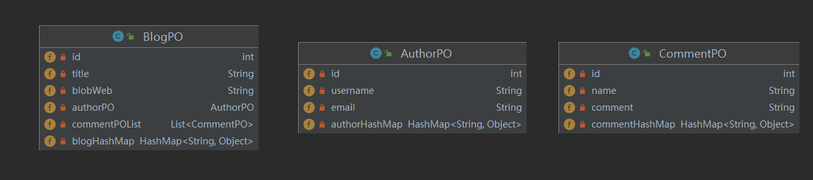
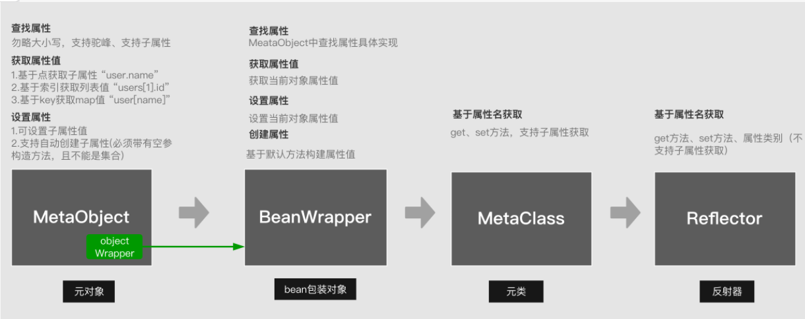
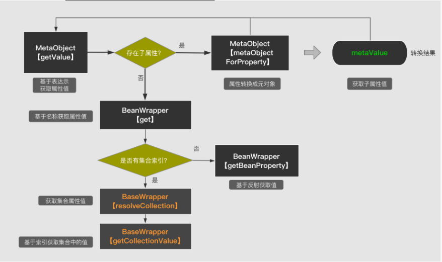
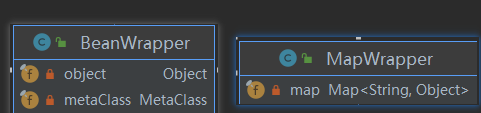

原文链接：https://blog.csdn.net/wangbo199308/article/details/120407062

## MetaObject功能

MetaObject类相当于一个工具类，Mybatis在sql参数设置和结果集映射里经常使用到这个对象。

映射是指结果集中的列填充至JAVA Bean属性。这就必须用到反射，而Bean的属性 多种多样的有普通属性、对象、集合、Map都有可能。为了更加方便的操作Bean的属性，MyBatis提供了MeataObject 工具类，其简化了对象属性的操作。其具体功能如下：

- 查找属性：勿略大小写，支持驼峰、支持子属性 如：blog.comment.user_name（需要开启useCamelCaseMapping）

- 获取属性

  ```
  基于点获取子属性 user.name
  基于索引获取列表值 users[1].id
  基于key获取map值 user[name]
  ```

- 设置属性

  ```
  可设置子属性值 authorPO.username
  支持自动创建子属性(必须带有空参构造方法，且不能是集合)
  	如Blog类有AuthorPO类型的字段时。
  	metaObject.setValue(“authorPO.username”, “张三”);
  	会自动创建AuthorPO对象，并设置username属性值为"张三"
  ```

## 基本使用方法

以一篇博客为例，简单介绍MetaObject的使用方法



```java
MetaObject metaObject = new Configuration().newMetaObject(new BlogPO());
// 直接操作对象属性
metaObject.setValue("title", "南京新闻");
BlogPO blogPO = (BlogPO) metaObject.getOriginalObject();
System.out.println(metaObject.getValue("title"));//输出:南京新闻
System.out.println("--------------------------------");
// 基于点获取子属性authorPO.username
// 自动创建对象AuthorPO
metaObject.setValue("authorPO.username", "张三");
System.out.println(metaObject.getValue("authorPO.username"));//输出:张三
System.out.println("--------------------------------");
// 基于索引获取列表值
// metaObject.setValue("commentPOList[0].comment", "写的不错，点赞"); List与array不会自动创建
ArrayList<Object> commentPOList = new ArrayList<>();
commentPOList.add(new CommentPO());
commentPOList.add(new CommentPO());
metaObject.setValue("commentPOList", commentPOList);
metaObject.setValue("commentPOList[0].comment", "写的不错，点赞");
System.out.println(metaObject.getValue("commentPOList[0].comment"));//输出:写的不错，点赞
System.out.println("--------------------------------");
// 基于key获取map值
// blogHashMap[blog]与blogHashMap.blog一样
metaObject.setValue("blogHashMap", new HashMap<>());
metaObject.setValue("blogHashMap[blog]", "一篇博客");
System.out.println(metaObject.getValue("blogHashMap.blog"));//输出:一篇博客
System.out.println("--------------------------------");
metaObject.setValue("authorPO.authorHashMap", new HashMap<>());
metaObject.setValue("authorPO.authorHashMap[author]", "作者");
System.out.println(metaObject.getValue("authorPO.authorHashMap[author]"));//输出:作者
System.out.println("--------------------------------");
// 忽略大小写，支持驼峰
String blob_web = metaObject.findProperty("blob_web", true);
System.out.println(blob_web);
metaObject.setValue(blob_web, "blob_web");
System.out.println(metaObject.getValue(blob_web));//输出:true
```

 ## MetaObject内部结构

```java
public class MetaObject {
  // 原始对象
  private final Object originalObject;
  // 对原始对象的一个包装  
  private final ObjectWrapper objectWrapper;
  private final ObjectFactory objectFactory;
  private final ObjectWrapperFactory objectWrapperFactory;
  private final ReflectorFactory reflectorFactory; 

  // 新建MetaObject
  private MetaObject(Object object, ObjectFactory objectFactory, ObjectWrapperFactory objectWrapperFactory, ReflectorFactory reflectorFactory) {
    this.originalObject = object;
    this.objectFactory = objectFactory;
    this.objectWrapperFactory = objectWrapperFactory;
    this.reflectorFactory = reflectorFactory;
    if (object instanceof ObjectWrapper) {
      this.objectWrapper = (ObjectWrapper) object;
    } else if (objectWrapperFactory.hasWrapperFor(object)) {
      this.objectWrapper = objectWrapperFactory.getWrapperFor(this, object);
    } else if (object instanceof Map) {
      // 原始对象为Map，使用MapWrapper进行包装
      this.objectWrapper = new MapWrapper(this, (Map) object);
    } else if (object instanceof Collection) {
      // 原始对象为Collection，使用CollectionWrapper包装
      this.objectWrapper = new CollectionWrapper(this, (Collection) object);
    } else {
      // 原始对象为JAVABean,使用BeanWrapper包装
      this.objectWrapper = new BeanWrapper(this, object);
    }
  }
  
  // 创建MetaObject  
  public static MetaObject forObject(Object object, ObjectFactory objectFactory, ObjectWrapperFactory objectWrapperFactory, ReflectorFactory reflectorFactory) {
    // 被包装的原始对象为NULL时，新建一个NULL_META_OBJECT（其originalObject 为NullObject，mybatis自己定义的）  
    if (object == null) {
      return SystemMetaObject.NULL_META_OBJECT;
    } else {
      return new MetaObject(object, objectFactory, objectWrapperFactory, reflectorFactory);
    }
  }
  // ...  
}
```

为了实现上述功能，MetaObject 相继依赖了ObjectWrapper、MetaClass、Reflector。这四个对象关系如下：



- BeanWrapper: 功能与MeataObject类似，不同点是BeanWrapper只针对单个当前对象属性进行操作，不能操作子属性。
- MetaClass ：类的反射功能支持，获能获取整完整类的属性，包括属性的属性。
- Reflector ：类的反射功能支持，仅支持当前类的属性。

## PropertyTokenizer

PropertyTokenizer 是mybatis的属性分词器，提供了对象和集合的一种概念形式, 记录了属性有没有子属性

```java
// commentPOList[0].comment为例
public class PropertyTokenizer implements Iterator<PropertyTokenizer> {
  // commentPOList
  private String name;
  // commentPOList[0]
  private final String indexedName;
  // 0
  private String index;
  // comment
  private final String children;

  public PropertyTokenizer(String fullname) {
    int delim = fullname.indexOf('.');
    if (delim > -1) {
      name = fullname.substring(0, delim);
      children = fullname.substring(delim + 1);
    } else {
      name = fullname;
      children = null;
    }
    indexedName = name;
    delim = name.indexOf('[');
    if (delim > -1) {
      index = name.substring(delim + 1, name.length() - 1);
      name = name.substring(0, delim);
    }
  }

  // 有子属性  
  public boolean hasNext() {
    return children != null;
  }
  // 继续切分子属性
  public PropertyTokenizer next() {
    return new PropertyTokenizer(children);
  }
  
  //getter,setter...
}
```


index为list所在的索引，也可以为Map的key

## MetaObject#getValue流程及源码解析

### 流程



**MeataObject.getValue()**

获取值的入口，首先根据属性名"comments[0].user.name" 解析成PropertyTokenizer，并基于属性中的“.” 来判断是否有子属性值，如果有就先调用getValue()获取当前属性对象。并把当前属性对象转换为元对象，然后在递归调用getValue()获取子属性下的属性。直到最后的name属性获得。

**MeataObject.setValue()**

流程与getValue()类似，不同在于如果子属性不存在，则会尝试创建子属性。

### 源码解析

**MetaObject#getValue**

```java
public Object getValue(String name) {
  // 属性分词器  
  PropertyTokenizer prop = new PropertyTokenizer(name);
  // 含有子属性，递归  
  if (prop.hasNext()) {
    // 获取当前属性的值  
    MetaObject metaValue = metaObjectForProperty(prop.getIndexedName());
    if (metaValue == SystemMetaObject.NULL_META_OBJECT) {
      return null;
    } else {
      // 这里递归调用，直到最后一层的子属性
      return metaValue.getValue(prop.getChildren());
    }
  } else {
    // 无子属性，直接获取属性值 
    return objectWrapper.get(prop);
  }
}
```

**MetaObject#metaObjectForProperty**

```java
public MetaObject metaObjectForProperty(String name) {
  // 获取当前属性的值，这个值没有子属性 
  Object value = getValue(name);
  // 把当前属性值，封装为元对象
  return MetaObject.forObject(value, objectFactory, objectWrapperFactory, reflectorFactory);
}
```

**ObjectWrapper#get**
ObjectWrapper为原始对象的包装对象，有可能为MapWrapper和BeanWrapper



- BeanWrapper

```java
public BeanWrapper(MetaObject metaObject, Object object) {
    super(metaObject);
    this.object = object;
    //初始化metaClass
    this.metaClass = MetaClass.forClass(object.getClass(), metaObject.getReflectorFactory());
}

public Object get(PropertyTokenizer prop) {
  // 当前属性是集合List,Map,Array[]
  if (prop.getIndex() != null) {
    Object collection = resolveCollection(prop, object);
    return getCollectionValue(prop, collection);
  } else {
    return getBeanProperty(prop, object);
  }
}
```

- MapWrapper

```java
// 适用于blogHashMap.blog的解析
// blogHashMap为Map，blog为Key
public Object get(PropertyTokenizer prop) {
  if (prop.getIndex() != null) {
    Object collection = resolveCollection(prop, map);
    return getCollectionValue(prop, collection);
  } else {
    return map.get(prop.getName());
  }
}
```

**BaseWrapper#resolveCollection**

```java
protected Object resolveCollection(PropertyTokenizer prop, Object object) {
  if ("".equals(prop.getName())) {
    return object;
  } else {
    // 解析出集合的值，可以是List,Map,Array[]  
    return metaObject.getValue(prop.getName());
  }
}
```

**BaseWrapper#getCollectionValue**

```java
protected Object getCollectionValue(PropertyTokenizer prop, Object collection) {
  // Map  
  if (collection instanceof Map) {
    return ((Map) collection).get(prop.getIndex());
  } else {
    int i = Integer.parseInt(prop.getIndex());
    // List  
    if (collection instanceof List) {
      return ((List) collection).get(i);
    }
    // 各种数组  
    else if (collection instanceof Object[]) {
      return ((Object[]) collection)[i];
    } else if (collection instanceof 各种数组) {
      ...
    } else {
      throw new ReflectionException("The '" + prop.getName() + "' property of " + collection + " is not a List or Array.");
    }
  }
}
```

**BeanWrapper#getBeanProperty**

```java
private Object getBeanProperty(PropertyTokenizer prop, Object object) {
  try {
    // 获取属性的Getter方法  
    Invoker method = metaClass.getGetInvoker(prop.getName());
    try {
      // 反射调用，获取值  
      return method.invoke(object, NO_ARGUMENTS);
    } catch (Throwable t) {
      throw ExceptionUtil.unwrapThrowable(t);
    }
  } catch (RuntimeException e) {
    throw e;
  } catch (Throwable t) {
    throw new ReflectionException("Could not get property '" + prop.getName() + "' from " + object.getClass() + ".  Cause: " + t.toString(), t);
  }
}
```

## Reflector

最主要的反射模块，MetaClass的操作就是依赖Reflector完成的。

JavaBean 具有如下特征：

- 所有的属性都是私有的（通过 getter和setter 访问）
- 拥有公有的无参数构造函数
- 提供 setter/getter
- 实现 Serializable 接口

MetaClass的操作都是对Reflector的成员变量进行操作的。

- 字段的getter,setter方法，反射调用
- 字段是否有getter,setter方法
- 字段的类型等等

```java
public class Reflector {

    /**
     * 对应的Class 类型，当前类
     */
    private final Class<?> type;
    /**
     * 可读属性的名称集合，可读属性就是存在相应getter 方法的属性，初始值为空数纽
     */
    private final String[] readablePropertyNames;
    /**
     * 可写属性的名称集合，可写属性就是存在相应setter 方法的属性，初始值为空数纽
     */
    private final String[] writablePropertyNames;
    /**
     * 属性相应的setter 方法， key 是属性名称， value 是Invoker 对象，它是对setter 方法对应
     */
    private final Map<String, Invoker> setMethods = new HashMap<>();
    /**
     * 属性相应的getter 方法， key 是属性名称， value 是Invoker 对象，它是对setter 方法对应
     */
    private final Map<String, Invoker> getMethods = new HashMap<>();
    /**
     * 属性相应的setter 方法的参数值类型， ke y 是属性名称， value 是setter 方法的参数类型
     */
    private final Map<String, Class<?>> setTypes = new HashMap<>();
    /**
     * 属性相应的getter 方法的返回位类型， key 是属性名称， value 是getter 方法的返回位类型
     */
    private final Map<String, Class<?>> getTypes = new HashMap<>();
    /**
     * 默认构造方法,无参构造方法
     */
    private Constructor<?> defaultConstructor;
    /**
     * 所有属性名称的集合(不分大小写)，key=属性名去大写，value=类中真正的属性名,
     * 这里通过设置key全部大小，能够保证就算写得再烂的驼峰命名，可以拿到正确的属性。
     */
    private Map<String, String> caseInsensitivePropertyMap = new HashMap<>();

    public Reflector(Class<?> clazz) {
        type = clazz;
        addDefaultConstructor(clazz);
        addGetMethods(clazz);
        addSetMethods(clazz);
        addFields(clazz);
        readablePropertyNames = getMethods.keySet().toArray(new String[0]);
        writablePropertyNames = setMethods.keySet().toArray(new String[0]);
        for (String propName : readablePropertyNames) {
            caseInsensitivePropertyMap.put(propName.toUpperCase(Locale.ENGLISH), propName);
        }
        for (String propName : writablePropertyNames) {
            caseInsensitivePropertyMap.put(propName.toUpperCase(Locale.ENGLISH), propName);
        }
    }
    // ...  
} 
```

### defaultConstructor

```java
// 查找clazz的无参构造方法，通过反射遍历所有构造方法，找到构造参数集合长度为0的。
private void addDefaultConstructor(Class<?> clazz) {
  Constructor<?>[] constructors = clazz.getDeclaredConstructors();
  Arrays.stream(constructors).filter(constructor -> constructor.getParameterTypes().length == 0)
    .findAny().ifPresent(constructor -> this.defaultConstructor = constructor);
}
```

### addGetMethods

```java
private void addGetMethods(Class<?> clazz) {
  // 方法名称去除set,get,is后的属性
  Map<String, List<Method>> conflictingGetters = new HashMap<>();
  // 所有的方法  
  Method[] methods = getClassMethods(clazz);
  // GET方法的参数个数为0，并且以get或者is开头（排除此两个单词）
  Arrays.stream(methods).filter(m -> m.getParameterTypes().length == 0 && PropertyNamer.isGetter(m.getName()))
    .forEach(m -> addMethodConflict(conflictingGetters, PropertyNamer.methodToProperty(m.getName()), m));
  resolveGetterConflicts(conflictingGetters);
}

// 获取当前类以及父类中定义的所有方法的唯一签名以及相应的Method对象
private Method[] getClassMethods(Class<?> clazz) {
    Map<String, Method> uniqueMethods = new HashMap<>();
    Class<?> currentClass = clazz;
    while (currentClass != null && currentClass != Object.class) {
        // 为每个方法生成唯一签名，并记录到uniqueMethods集合中
        // 签名为：返回值类型#方法名:参数类型,参数类型(多个参数用,拼接)
        addUniqueMethods(uniqueMethods, currentClass.getDeclaredMethods());
        Class<?>[] interfaces = currentClass.getInterfaces();
        for (Class<?> anInterface : interfaces) {
            addUniqueMethods(uniqueMethods, anInterface.getMethods());
        }
        currentClass = currentClass.getSuperclass();
    }

    Collection<Method> methods = uniqueMethods.values();
    
    return methods.toArray(new Method[0]);

}

// 方法转属性字段名
public static String methodToProperty(String name) {
    if (name.startsWith("is")) {
        name = name.substring(2);
    } else if (name.startsWith("get") || name.startsWith("set")) {
        name = name.substring(3);
    } else {
        throw new ReflectionException("Error parsing property name '" + name + "'.  Didn't start with 'is', 'get' or 'set'.");
    }

    if (name.length() == 1 || (name.length() > 1 && !Character.isUpperCase(name.charAt(1)))) {
        name = name.substring(0, 1).toLowerCase(Locale.ENGLISH) + name.substring(1);
    }
    
    return name;

}
```

## MetaClass
MetaClass 通过与属性工具类的结合， 实现了对复杂表达式的解析，实现了获取指定描述信息的功能。

### 成员变量


MetaClass 有两个成员变量， 分别是 ReflectorFactory 和 Reflector。

### 创建
MetaClass 的构造函数是私有的。

```java
/**
 * MetaClass 构造函数
 */
private MetaClass(Class<?> type, ReflectorFactory reflectorFactory) {
  this.reflectorFactory = reflectorFactory;
  this.reflector = reflectorFactory.findForClass(type);

}
```


但是， 其提供了两个创建的方法。 这两个方法也是通过该方法进行创建对象的。 该方法通过 Class 对象进行了 Reflector 对象的创建， 并赋值给成员变量。

```java
/**
 * 跟上面的是一样的
 */
public static MetaClass forClass(Class<?> type, ReflectorFactory reflectorFactory) {
  return new MetaClass(type, reflectorFactory);
}
```

 通过属性进行创建

```java
/**
 * 通过属性名称， 获取属性的 MetaClass
 */
public MetaClass metaClassForProperty(String name) {
   Class<?> propType = reflector.getGetterType(name);
   return MetaClass.forClass(propType, reflectorFactory);
}
```

### 方法

该类中， 最重要的方法是：

```java
/**
 * 解析属性表达式
 * 会去寻找reflector中是否有对应的的属性
 * @param name
 * @param builder
 * @return
 */
private StringBuilder buildProperty(String name, StringBuilder builder) {
  // 解析属性表达式
  PropertyTokenizer prop = new PropertyTokenizer(name);
  // 是否有子表达式
  if (prop.hasNext()) {
    // 查找对应的属性
    String propertyName = reflector.findPropertyName(prop.getName());
    if (propertyName != null) {
      // 追加属性名
      builder.append(propertyName);
      builder.append(".");
      // 创建对应的 MetaClass 对象
      MetaClass metaProp = metaClassForProperty(propertyName);
      // 解析子表达式, 递归
      metaProp.buildProperty(prop.getChildren(), builder);
    }
  } else {
    // 根据名称查找属性
    String propertyName = reflector.findPropertyName(name);
    if (propertyName != null) {
      builder.append(propertyName);
    }
  }
  return builder;
}
```

理解了这个方法（递归， 该类中有很多类似的）， 就可以很好的对这个类进行理解， 以查找(richType.richProperty)为例：

1. 通过 PropertyTokenizer 对表达式进行解析， 得到当前的 name=richType, children=richProperty
2. 从 reflector 中查找该 richType 属性
3. 将 richType 添加到 builder 中
4. 使用 metaClassForProperty 创建 richType 的 MetaClass。
5. 递归调用自身来处理子表达式
6. 退出的条件就是没有子表达式。

注意， 在此过程中， `ReflectorFactory` 一直是同一个， 而其内部缓存了多个 `Reflector` 对象。

## MetaObject使用场景

mybatis的statementHandler被多层interceptor包裹,若需要获取最内层的statementHandler的信息,可通过MetaObject利用反射原理高效获取(循环获取代理对象invokerHandler)