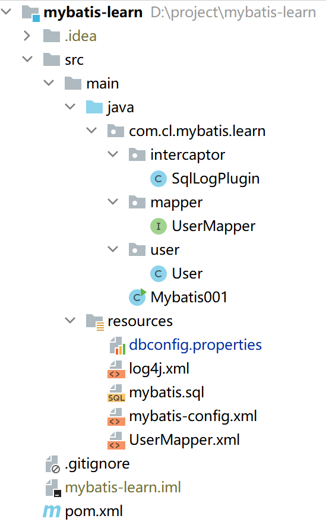
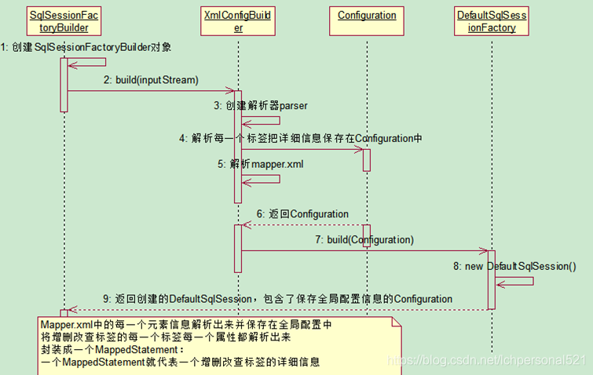
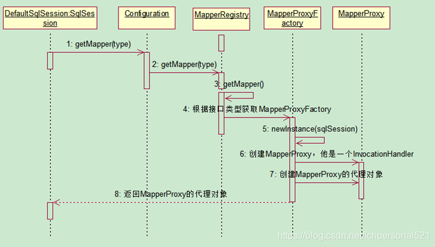
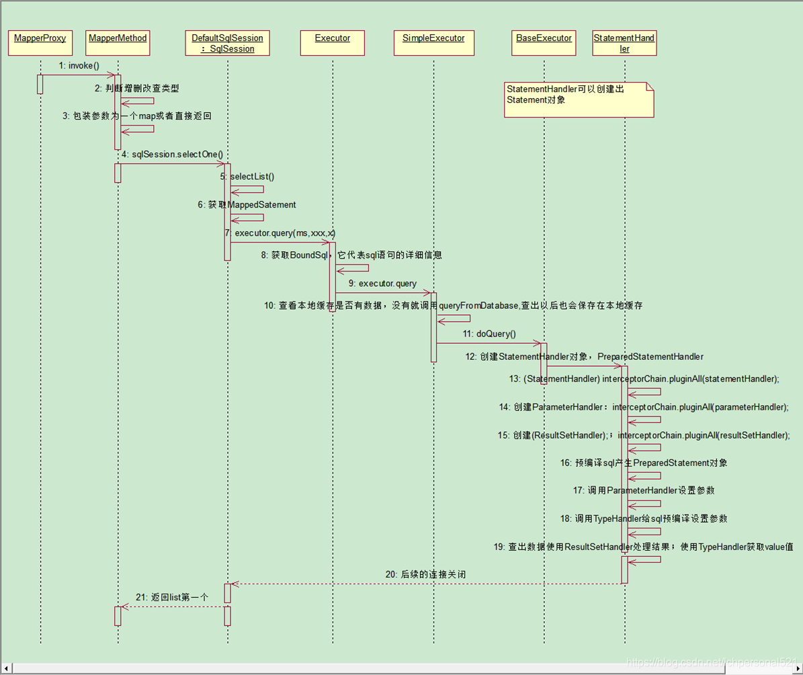
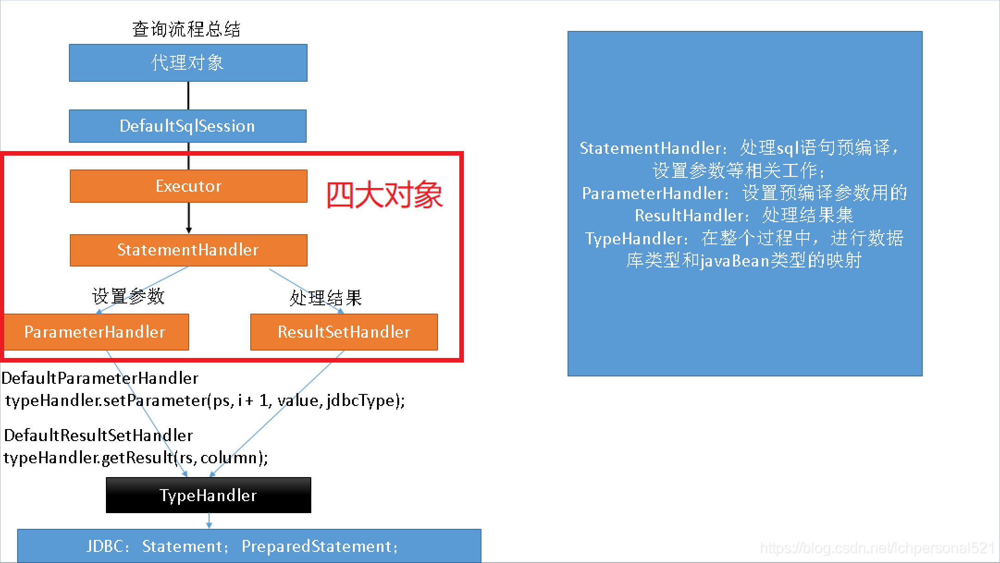

## 1 什么是 Mybatis？

1. Mybatis 是一个半 ORM（对象关系映射）框架，它内部封装了 JDBC，开发时只需要关注 SQL 语句本身，不需要花费精力去处理加载驱动、创建连接、创建 statement 等繁杂的过程。程序员直接编写原生态 sql，可以严格控制 sql 执行性能，灵活度高
2. MyBatis 可以使用 XML 或注解来配置和映射原生信息，将 POJO 映射成数据库中的记录，避免了几乎所有的 JDBC 代码和手动设置参数以及获取结果集
3. 通过 xml 文件或注解的方式将要执行的各种 statement 配置起来，并通过 java 对象和 statement 中 sql 的动态参数进行映射生成最终执行的 sql 语句，最后由 mybatis 框架执行 sql 并将结果映射为 java 对象并返回（从执行 sql 到返回 result 的过程）

## 2 Mybaits 的优点?

1. 基于 SQL 语句编程，相当灵活，不会对应用程序或者数据库的现有设计造成任何影响，SQL 写在 XML 里，解除 sql 与程序代码的耦合，便于统一管理；提供 XML 标签，支持编写动态 SQL 语句，并可重用
2. 与 JDBC 相比，消除了 JDBC 大量冗余的代码，不需要手动开关连接
3. 很好的与各种数据库兼容（因为 MyBatis 使用 JDBC 来连接数据库，所以只要 JDBC 支持的数据库 MyBatis 都支持）
4. 能够与 Spring 很好的集成
5. 提供映射标签，支持对象与数据库的 ORM 字段关系映射；提供对象关系映射标签，支持对象关系组件维护

## 3 MyBatis 框架的缺点?

1. SQL 语句的编写工作量较大，尤其当字段多、关联表多时，对开发人员编写 SQL 语句的功底有一定要求
2. SQL 语句依赖于数据库，导致数据库移植性差，不能随意更换数据库

## 4 MyBatis 框架适用场合?

1. MyBatis 专注于 SQL 本身，是一个足够灵活的 DAO 层解决方案
2. 对性能的要求很高，或者需求变化较多的项目，如互联网项目，MyBatis 将是不错的选择

## 5 MyBatis 与 Hibernate 有哪些不同？

1. Mybatis 和 hibernate 不同，它不完全是一个 ORM 框架，因为 MyBatis 需要程序员自己编写 Sql 语句
2. Mybatis 直接编写原生态 sql，可以严格控制 sql 执行性能，灵活度高，非常适合对关系数据模型要求不高的软件开发，因为这类软件需求变化频繁，一但需求变化要求迅速输出成果。但是灵活的前提是 mybatis 无法做到数据库无关性，如果需要实现支持多种数据库的软件，则需要自定义多套 sql 映射文件，工作量大
3. Hibernate 对象/关系映射能力强，数据库无关性好，对于关系模型要求高的软件，如果用 hibernate 开发可以节省很多代码，提高效率

## 6 #{} 和 ${} 的区别是什么？

\#{} 是预编译处理，${} 是字符串替换。

Mybatis 在处理 #{} 时，会将 sql 中的 #{} 替换为 ? 号，调用 PreparedStatement 的 set 方法来赋值；Mybatis 在处理\${} 时，就是把 ${} 替换成变量的值。

使用 #{} 可以有效的防止 SQL 注入，提高系统安全性。

## 7 当实体类中的属性名和表中的字段名不一样 ，怎么办 ？

第1种： 通过在查询的 sql 语句中定义字段名的别名，让字段名的别名和实体类的属性名一致。

```xml
<select id=”selectorder” parametertype=”int” resultetype=”me.gacl.domain.order”>
       select order_id id, order_no orderno ,order_price price form orders where order_id=#{id};
</select>
123
```

第2种： 通过 \<resultMap> 来映射字段名和实体类属性名的一一对应的关系。

```xml
 	<select id="getOrder" parameterType="int" resultMap="orderresultmap">
        select * from orders where order_id=#{id}
    </select>
 
   <resultMap type=”me.gacl.domain.order” id=”orderresultmap”>
        <!–-用id属性来映射主键字段-–>
        <id property=”id” column=”order_id”>
 
        <!–-用result属性来映射非主键字段，property为实体类属性名，column为数据表中的属性-–>
        <result property=”orderno” column=”order_no”/>
        <result property=”price” column=”order_price” />
    </reslutMap>
123456789101112
```

## 8 模糊查询 like 语句该怎么写?

第1种：在 Java 代码中添加 sql 通配符

```sql
    string wildcardname = “%smi%”;
    list<name> names = mapper.selectlike(wildcardname);
 
    <select id=”selectlike”>
     select * from foo where bar like #{value}
    </select>
123456
```

第2种：在 sql 语句中拼接通配符，会引起 sql 注入

```sql
    string wildcardname = “smi”;
    list<name> names = mapper.selectlike(wildcardname);
 
    <select id=”selectlike”>
         select * from foo where bar like "%"${value}"%"
    </select>
123456
```

## 9 通常一个 Xml 映射文件，都会写一个 Dao 接口与之对应，请问，这个 Dao 接口的工作原理是什么？Dao 接口里的方法，参数不同时，方法能重载吗？

Dao 接口即 Mapper 接口。接口的全限名，就是映射文件中的 namespace 的值；接口的方法名，就是映射文件中 Mapper 的 Statement 的 id 值；接口方法内的参数，就是传递给 sql 的参数。

Mapper 接口是没有实现类的，当调用接口方法时，接口全限名+方法名拼接字符串作为 key 值，可唯一定位一个 **MapperStatement**。在 Mybatis 中，每一个 \<select>、\<insert>、\<update>、\<delete> 标签，都会被解析为一个 MapperStatement 对象。

举例：com.mybatis3.mappers.StudentDao.findStudentById，可以唯一找到 namespace 为 com.mybatis3.mappers.StudentDao下面 id 为 findStudentById 的 MapperStatement。

Mapper 接口里的方法，是不能重载的，因为是使用 全限名+方法名 的保存和寻找策略。Mapper 接口的工作原理是 **JDK 动态代理**，Mybatis 运行时会使用 JDK 动态代理为 Mapper 接口生成代理对象 proxy，代理对象会拦截接口方法，转而执行 MapperStatement 所代表的 sql，然后将 sql 执行结果返回。

## 10 Mybatis 是如何进行分页的？分页插件的原理是什么？

Mybatis 使用 RowBounds 对象进行分页，它是针对 ResultSet 结果集执行的<font color='cornflowerblue'>内存分页</font>，而非物理分页。可以在 sql 内直接书写带有物理分页的参数来完成物理分页功能，也可以使用分页插件来完成物理分页。

分页插件的基本原理是使用 Mybatis 提供的插件接口，实现自定义插件，在插件的拦截方法内拦截待执行的 sql，然后重写 sql，根据 dialect 方言，添加对应的<font color='cornflowerblue'>物理分页</font>语句和物理分页参数。

## 11 Mybatis 是如何将 sql 执行结果封装为目标对象并返回的？都有哪些映射形式？

第一种是使用 \<resultMap> 标签，逐一定义数据库列名和对象属性名之间的映射关系。

第二种是使用 sql 列的别名功能，将列的别名书写为对象属性名。

有了列名与属性名的映射关系后，Mybatis 通过反射创建对象，同时使用<font color='cornflowerblue'>反射</font>给对象的属性逐一赋值并返回，那些找不到映射关系的属性，是无法完成赋值的。

## 12 如何执行批量插入?

首先,创建一个简单的 insert 语句:

```xml
    <insert id=”insertname”>
         insert into names (name) values (#{value})
    </insert>
123
```

然后在 java 代码中像下面这样执行批处理插入:

```java
  list<string> names = new arraylist();
    names.add(“fred”);
    names.add(“barney”);
    names.add(“betty”);
    names.add(“wilma”);
 
    // 注意这里 executortype.batch
    sqlsession sqlsession = sqlsessionfactory.opensession(executortype.batch);
    try {
     namemapper mapper = sqlsession.getmapper(namemapper.class);
     for (string name : names) {
         mapper.insertname(name);
     }
     sqlsession.commit();
    }catch(Exception e){
     e.printStackTrace();
     sqlSession.rollback(); 
     throw e; 
    }
     finally {
         sqlsession.close();
    }
```

## 13 如何获取自动生成的(主)键值?

insert 方法总是返回一个 int 值 ，这个值代表的是插入的行数。

如果采用自增长策略，自动生成的键值在 insert 方法执行完后可以被设置到传入的参数对象中。

示例：

```xml
<insert id=”insertname” usegeneratedkeys=”true” keyproperty=”id”>
     insert into names (name) values (#{name})
</insert>
123
    name name = new name();
    name.setname(“fred”);
 
    int rows = mapper.insertname(name);
    // 完成后,id已经被设置到对象中
    system.out.println(“rows inserted = ” + rows);
    system.out.println(“generated key value = ” + name.getid());
1234567
```

## 14 在 mapper 中如何传递多个参数?

```java
（1）第一种：
//DAO层的函数
Public User selectUser(String name,String area);  
//对应的xml,#{0}代表接收的是dao层中的第一个参数，#{1}代表dao层中第二参数，更多参数一致往后加即可。
<select id="selectUser"resultMap="BaseResultMap">  
    select *  fromuser_user_t   where user_name = #{0} and user_area=#{1}  
</select>  
 
（2）第二种： 使用 @param 注解:
public interface usermapper {
   user selectuser(@param(“username”) string username,@param(“user_area”) string user_area);
}
然后,就可以在xml像下面这样使用(推荐封装为一个map,作为单个参数传递给mapper):
<select id=”selectuser” resulttype=”user”>
         select id, username, user_area
         from some_table
         where username = #{username}
         and user_area = #{user_area}
</select>
 
（3）第三种：多个参数封装成map
try{
//映射文件的命名空间.SQL片段的ID，就可以调用对应的映射文件中的SQL
//由于我们的参数超过了两个，而方法中只有一个Object参数收集，因此我们使用Map集合来装载我们的参数
Map<String, Object> map = new HashMap();
     map.put("user_area", user_area);
     map.put("user_area", user_area);
     return sqlSession.selectList("selectuser", map);
 }catch(Exception e){
     e.printStackTrace();
     sqlSession.rollback();
    throw e; }
finally{
 MybatisUtil.closeSqlSession();
 }
```

## 15 Mybatis 动态 sql 有什么用？执行原理？有哪些动态 sql？

Mybatis 动态 sql 可以在 Xml 映射文件内，以标签的形式编写动态 sql，执行原理是根据表达式的值 完成逻辑判断并动态拼接 sql 的功能。

Mybatis 提供了9种[动态sql标签](https://blog.csdn.net/u014297148/article/details/79678563)：trim | where | set | foreach | if | choose | when | otherwise | bind。

## 16 Xml 映射文件中，除了常见的 select|insert|updae|delete 标签之外，还有哪些标签？

\<resultMap>、\<parameterMap>、\<sql>、\<include>、\<selectKey>以及动态 sql 的9个标签，

```
<resultMap>用于结果集的封装
<parameterMap>用于sql参数的解析
<sql> 为 sql 片段标签，通过 <include> 标签引入 sql 片段
<selectKey> 为不支持自增的主键生成策略标签。
```


## 17 Mybatis 的 Xml 映射文件中，不同的 Xml 映射文件，id 是否可以重复？

不同的 Xml 映射文件，如果配置了 namespace，那么 id 可以重复；如果没有配置 namespace，那么 id 不能重复；

原因就是 namespace+id 是作为 Map<String, MapperStatement> 的 key 使用的，如果没有 namespace，就剩下 id，那么，id 重复会导致数据互相覆盖。有了 namespace，自然 id 就可以重复，namespace 不同，namespace+id 自然也就不同。

但是，在以前的 Mybatis 版本的 namespace 是可选的，不过新版本的 namespace 已经是必须的了。

## 18 为什么说 Mybatis 是半自动 ORM 映射工具？它与全自动的区别在哪里？

Hibernate 属于全自动 ORM 映射工具，使用 Hibernate 查询关联对象或者关联集合对象时，可以根据对象关系模型直接获取，所以它是全自动的。而 Mybatis 在查询关联对象或关联集合对象时，需要<font color='cornflowerblue'>手动编写 sql </font>来完成，所以，称之为半自动 ORM 映射工具。

## 19 一对一、一对多的关联查询 ？

```xml
	<mapper namespace="com.lcb.mapping.userMapper">  
    <!--association  一对一关联查询 -->  
    <select id="getClass" parameterType="int" resultMap="ClassesResultMap">  
        select * from class c,teacher t where c.teacher_id=t.t_id and c.c_id=#{id}  
    </select>  
 
    <resultMap type="com.lcb.user.Classes" id="ClassesResultMap">  
        <!-- 实体类的字段名和数据表的字段名映射 -->  
        <id property="id" column="c_id"/>  
        <result property="name" column="c_name"/>  
        <association property="teacher" javaType="com.lcb.user.Teacher">  
            <id property="id" column="t_id"/>  
            <result property="name" column="t_name"/>  
        </association>  
    </resultMap>  
 
 
    <!--collection  一对多关联查询 -->  
    <select id="getClass2" parameterType="int" resultMap="ClassesResultMap2">  
        select * from class c,teacher t,student s where c.teacher_id=t.t_id and c.c_id=s.class_id and c.c_id=#{id}  
    </select>  
 
    <resultMap type="com.lcb.user.Classes" id="ClassesResultMap2">  
        <id property="id" column="c_id"/>  
        <result property="name" column="c_name"/>  
        <association property="teacher" javaType="com.lcb.user.Teacher">  
            <id property="id" column="t_id"/>  
            <result property="name" column="t_name"/>  
        </association>  
 
        <collection property="student" ofType="com.lcb.user.Student">  
            <id property="id" column="s_id"/>  
            <result property="name" column="s_name"/>  
        </collection>  
    </resultMap>  
</mapper> 
```

## 20 MyBatis 实现一对一有几种方式?具体怎么操作的？

[联合查询和嵌套查询](https://www.cnblogs.com/luxiaoxun/p/4035276.html)

- 联合查询是几个表联合查询，只查询一次，通过在 resultMap 里面配置 association 节点配置一对一的类就可以完成；

- 嵌套查询是先查一个表，根据这个表里面的结果的外键 id，去再另外一个表里面查询数据，也是通过 association 配置，但另外一个表的查询通过 select 属性配置。

## 21 MyBatis 实现一对多有几种方式,怎么操作的？

有联合查询和嵌套查询。

- 联合查询是几个表联合查询，只查询一次，通过在 resultMap 里面的 collection 节点配置一对多的类就可以完成；
- 嵌套查询是先查一个表，根据这个表里面的结果的外键 id，去再另外一个表里面查询数据，也是通过配置 collection，但另外一个表的查询通过 select 节点配置。

## 22 Mybatis 是否支持延迟加载？如果支持，它的实现原理是什么？

Mybatis 仅支持 association 关联对象和 collection 关联集合对象的[延迟加载](https://zhuanlan.zhihu.com/p/84942970)，association 指的就是一对一，collection 指的就是一对多查询。

在 Mybatis 配置文件中，可通过以下配置开启延迟加载

```xml
<settings>
    <setting name="lazyLoadingEnabled" value="true"/>
    <!--
		true:开启全局延迟加载
		false：关闭全局延迟加载
	-->
    <setting name="aggressiveLazyLoading" value="false"></setting>
    <!--
		true:开启激进加载
		false：关闭激进加载，即按需加载
	-->
</settings>
```

[延迟加载原理](https://blog.csdn.net/u013522165/article/details/108293100)

> 使用 CGLIB 创建目标对象的代理对象，当调用目标方法时，进入拦截器方法，比如调用 a.getB().getName()，拦截器 invoke() 方法发现 a.getB() 是 null 值，那么就会单独发送事先保存好的查询关联B对象的 sql，把B查询上来，然后调用 a.setB(b)，于是a的对象b属性就有值了，接着完成 a.getB().getName() 方法的调用。这就是延迟加载的基本原理。

延迟加载总结

- 延迟加载就是按需加载，在需要查询的时候再去查询（响应速度快），使用延迟加载可以避免表连接查询，表连接查询比单表查询的效率低。但延迟加载需要多次与数据库进行交互，总体耗时更长。

- lazyLoadingEnabled表示延迟加载是否开启，true表示开启，此时还需要设置aggressiveLazyLoading为false,才能做到按需加载，如果aggressiveLazyLoading设置为true则按需加载关闭，此时**只要加载了对象某个属性就会将对象所有属性都加载**。

## 23 [Mybatis 的一级、二级缓存？](https://tech.meituan.com/2018/01/19/mybatis-cache.html)

**一级缓存**


一级缓存有**session**和**statement**两种类型,statement类型(<font color='cornflowerblue'>分布式</font>)会在sql执行后清空缓存,以下内容是针对session类型的缓存

- 在同一个 SqlSession 中, Mybatis 会使用HashMap缓存*cacheKey:查询结果*， 如果后续的键值一样， 则直接从 Map 中获取数据；

  ```java
  //cacheKey内容
  cacheKey.update(ms.getId());//mapper方法id,namespace+方法名
  cacheKey.update(rowBounds.getOffset());//offset
  cacheKey.update(rowBounds.getLimit());//limit
  cacheKey.update(boundSql.getSql());//sql语句
  cacheKey.update(value);//sql参数
  ```

- 不同的 SqlSession 之间的缓存是相互隔离的；

- SqlSession可以通过配置`flushCache=“true”`使得在查询前清空缓存；

- 任何的 UPDATE, INSERT, DELETE 语句都会清空缓存。

**二级缓存**


开启二级缓存后，数据的查询执行的流程就是 二级缓存 -> 一级缓存 -> 数据库。

1. 二级缓存与一级缓存其机制相同，默认也是采用 PerpetualCache，HashMap 存储，不同在于其存储作用域为 Mapper(Namespace)，在多表查询可能导致读取脏数据

2. 二级缓存并且可自定义存储源，如 Ehcache。

3. 默认开启<font color='cornflowerblue'>全局二级缓存</font>,但默认不打开<font color='cornflowerblue'>局部二级缓存</font>，要开启二级缓存，二级缓存属性类的映射局部文件中配置 <cache/\>或<cache-ref/\>

   ```properties
   #cache的属性值
   type:cache使用的类型，默认是PerpetualCache，这在一级缓存中提到过。
   eviction: 定义回收的策略，常见的有FIFO，LRU。
   flushInterval: 配置一定时间自动刷新缓存，单位是毫秒。
   size: 最多缓存对象的个数。
   readOnly: 是否只读，若配置可读写，则需要对应的实体类能够序列化。
   blocking: 若缓存中找不到对应的key，是否会一直blocking，直到有对应的数据进入缓存。
   #cache-ref的属性值
   namespace:代表引用别的命名空间的Cache配置，两个命名空间的操作使用的是同一个Cache
   ```

4. MyBatis二级缓存的工作流程和一级缓存类似，只是在一级缓存处理前，用`CachingExecutor`装饰了`BaseExecutor`的子类，在委托具体职责给`delegate`之前，实现了二级缓存的查询和写入功能.

5. 若sql语句未提交,则不会写入二级缓存.

**一级缓存与二级缓存区别**

|              | 一级缓存                                                     | 二级缓存                |
| ------------ | ------------------------------------------------------------ | ----------------------- |
| 生命周期     | 与SqlSession一致                                             | 与SQLSessionFactory一致 |
| 作用域       | 全局                                                         | namespace               |
| 存储源       | PerpetualCache                                               | 可自定义                |
| 缓存刷新     | 不支持                                                       | 可设置刷新频率          |
| 缓存写入时机 | sql语句执行之后                                              | sql语句提交之后         |
| 缓存清空时机 | statement类型<br/>更新语句后/sqlSession关闭后/配置了flushCache | 更新语句后              |

## 24 什么是 MyBatis 的接口绑定？有哪些实现方式？

接口绑定，就是在 MyBatis 中任意定义接口，然后把接口里面的方法和 SQL 语句绑定，我们直接调用接口方法就可以，这样比起原来了 SqlSession 提供的方法我们可以有更加灵活的选择和设置。

接口绑定有两种实现方式

- 注解绑定，就是在接口的方法上面加上 @Select、@Update 等注解，里面包含 Sql 语句来绑定；
- xml绑定，是通过 xml 里面写 SQL 来绑定，要指定 xml 映射文件里面的 namespace 必须为接口的全路径名。

当 Sql 语句比较简单时候，用注解绑定，当 SQL 语句比较复杂时候，用 xml 绑定，一般用 xml 绑定的比较多。

## 25 使用 MyBatis 的 mapper 接口调用时有哪些要求？

1. Mapper 接口方法名和 mapper.xml 中定义的每个 sql 的 id 相同
2. Mapper 接口方法的输入参数类型和 mapper.xml 中定义的每个 sql 的 parameterType 的类型相同
3. Mapper 接口方法的输出参数类型和 mapper.xml 中定义的每个 sql 的 resultType 的类型相同
4. Mapper.xml 文件中的 namespace 即是 mapper 接口的类路径

## 26 Mapper 编写有哪几种方式？

第一种：接口实现类继承 SqlSessionDaoSupport：使用此种方法需要编写 mapper 接口，mapper 接口实现类、mapper.xml 文件。

```xml
（1）在sqlMapConfig.xml中配置mapper.xml的位置
<mappers>
    <mapper resource="mapper.xml文件的地址" />
    <mapper resource="mapper.xml文件的地址" />
</mappers>
（2）定义mapper接口
（3）实现类集成SqlSessionDaoSupport
mapper方法中可以this.getSqlSession()进行数据增删改查。
（4）spring 配置
<bean id=" " class="mapper接口的实现">
    <property name="sqlSessionFactory" ref="sqlSessionFactory"></property>
</bean>
```

第二种：使用 org.mybatis.spring.mapper.MapperFactoryBean：

```xml
（1）在sqlMapConfig.xml中配置mapper.xml的位置，如果mapper.xml和mapper接口的名称相同且在同一个目录，这里可以不用配置
<mappers>
    <mapper resource="mapper.xml文件的地址" />
    <mapper resource="mapper.xml文件的地址" />
</mappers>
（2）定义mapper接口：
①mapper.xml中的namespace为mapper接口的地址
②mapper接口中的方法名和mapper.xml中的定义的statement的id保持一致
③Spring中定义
<bean id="" class="org.mybatis.spring.mapper.MapperFactoryBean">
    <property name="mapperInterface"   value="mapper接口地址" /> 
    <property name="sqlSessionFactory" ref="sqlSessionFactory" /> 
</bean>
```

第三种：使用 mapper 扫描器：

```xml
（1）mapper.xml文件编写：
mapper.xml中的namespace为mapper接口的地址；
mapper接口中的方法名和mapper.xml中的定义的statement的id保持一致；
如果将mapper.xml和mapper接口的名称保持一致则不用在sqlMapConfig.xml中进行配置。 
（2）定义mapper接口：
注意mapper.xml的文件名和mapper的接口名称保持一致，且放在同一个目录
（3）配置mapper扫描器：
<bean class="org.mybatis.spring.mapper.MapperScannerConfigurer">
    <property name="basePackage" value="mapper接口包地址"></property>
    <property name="sqlSessionFactoryBeanName" value="sqlSessionFactory"/> 
</bean>
（4）使用扫描器后从spring容器中获取mapper的实现对象。
```

## 28 ORM

> [MyBatis学习总结（一）——ORM概要与MyBatis快速起步](https://www.cnblogs.com/best/p/9711215.html#_lab2_0_0)

> 参考：[Mybatis常见面试题总结](https://blog.csdn.net/a745233700/article/details/80977133)

## [Mybatis实现原理](https://blog.csdn.net/lchpersonal521/article/details/84451357)

### 示例项目简介

**表结构**

```sql
-- 导出 mybatis 的数据库结构
CREATE DATABASE IF NOT EXISTS `mybatis` /*!40100 DEFAULT CHARACTER SET utf8 */;
USE `mybatis`;

-- 导出  表 mybatis.user 结构
CREATE TABLE IF NOT EXISTS `user` (
  `id` int(11) NOT NULL AUTO_INCREMENT,
  `name` varchar(50) NOT NULL,
  `age` int(11) NOT NULL,
  `sex` int(11) NOT NULL,
  PRIMARY KEY (`id`)
) ENGINE=MyISAM AUTO_INCREMENT=6 DEFAULT CHARSET=utf8;

-- 正在导出表  mybatis.user 的数据：3 rows
DELETE FROM `user`;

INSERT INTO `user` (`id`, `name`, `age`, `sex`) VALUES
 (1, '张三', 42, 0),
 (2, '李四', 15, 0),
 (3, '王五', 45, 0),
 (4, '赵六', 47, 0),
 (5, '孙艳', 26, 1);

```

**项目结构**




**配置文件**

dbconfig.properties

```properties
jdbc.driver=com.mysql.jdbc.Driver
jdbc.url=jdbc:mysql://192.168.226.200:3306/mybatis
jdbc.username=root
jdbc.password=123456
```

mybatis主配置文件mybatis-config.xml

```xml
<?xml version="1.0" encoding="UTF-8" ?>
<!DOCTYPE configuration
        PUBLIC "-//mybatis.org//DTD Config 3.0//EN"
        "http://mybatis.org/dtd/mybatis-3-config.dtd">
<configuration>
    <properties resource="dbconfig.properties"></properties>

    <environments default="development">
        <environment id="development">
            <transactionManager type="JDBC"/>
            <dataSource type="POOLED">
                <property name="driver" value="${jdbc.driver}"/>
                <property name="url" value="${jdbc.url}"/>
                <property name="username" value="${jdbc.username}"/>
                <property name="password" value="${jdbc.password}"/>
            </dataSource>
        </environment>
    </environments>
    <mappers>
        <mapper resource="UserMapper.xml"/>
    </mappers>
</configuration>

```

UserMapper.xml

```xml
<?xml version="1.0" encoding="UTF-8" ?>
<!DOCTYPE mapper
        PUBLIC "-//mybatis.org//DTD Mapper 3.0//EN"
        "http://mybatis.org/dtd/mybatis-3-mapper.dtd">
<mapper namespace="com.cl.mybatis.learn.mapper.UserMapper">
    <select id="selectById" resultType="com.cl.mybatis.learn.user.User">
    select * from user where id = #{id}
  </select>
</mapper>
```

**java类**

User.java

```java
package com.cl.mybatis.learn.user;

public class User {
    private int id;
    private String name;
    private int age;
    private int sex;
    ...
}
```

UserMapper.java

```java
package com.cl.mybatis.learn.mapper;
import com.cl.mybatis.learn.user.User;

public interface UserMapper {
    User selectById(int id);
}
```

Mybatis001.java 

```java
package com.cl.mybatis.learn;

import com.cl.mybatis.learn.mapper.UserMapper;
import org.apache.ibatis.io.Resources;
import org.apache.ibatis.session.SqlSession;
import org.apache.ibatis.session.SqlSessionFactory;
import org.apache.ibatis.session.SqlSessionFactoryBuilder;
import java.io.IOException;
import java.io.InputStream;

public class Mybatis001 {
    public static void main(String[] args) throws IOException {
        String resource = "mybatis-config.xml";
        InputStream inputStream = Resources.getResourceAsStream(resource);
        //1.SqlSessionFactory的创建
        SqlSessionFactory sqlSessionFactory = new SqlSessionFactoryBuilder().build(inputStream);
		//2.SqlSession的创建
        SqlSession session = sqlSessionFactory.openSession();
        try {
            //3.UserMapper代理的生成
            UserMapper mapper = session.getMapper(UserMapper.class);
            //4.数据库查询操作执行流程
            System.out.println(mapper.selectById(1));
        } finally {
            session.close();
        }
    }
}
```

### SqlSessionFactory的创建

SqlSessionFactory的创建是SqlSessionFactoryBuilder通过mybatis主配置文件构建出



**XMLConfigBuilder的parse()解析过程**

```java
public Configuration parse() {
    if (this.parsed) {
        throw new BuilderException("Each XMLConfigBuilder can only be used once.");
    } else {
        this.parsed = true;
        this.parseConfiguration(this.parser.evalNode("/configuration"));
        return this.configuration;
    }
}
```


```sequence
parse()->parseConfiguration(): 设置Configuration
parseConfiguration()->pluginElement():注册插件
parseConfiguration()->mapperElement():解析Mapper类
parseConfiguration()->mapperBuilder.parse():解析Mapper类配置
```

```java
private void parseConfiguration(XNode root) {
    try {
        /**解析配置文件中的各种属性*/
        this.propertiesElement(root.evalNode("properties"));
        /**解析别名配置*/
        this.typeAliasesElement(root.evalNode("typeAliases"));
        /**解析插件配置*/
        this.pluginElement(root.evalNode("plugins"));
        /**解析对象工厂元素*/
        this.objectFactoryElement(root.evalNode("objectFactory"));
        this.objectWrapperFactoryElement(root.evalNode("objectWrapperFactory"));
        /**解析mybatis的全局设置信息*/
        this.settingsElement(root.evalNode("settings"));
        /**解析mybatis的环境配置*/
        this.environmentsElement(root.evalNode("environments"));
        this.databaseIdProviderElement(root.evalNode("databaseIdProvider"));
        /**解析类型处理器配置信息*/
        this.typeHandlerElement(root.evalNode("typeHandlers"));
        /**解析mapper配置信息*/
        this.mapperElement(root.evalNode("mappers"));
    } catch (Exception var3) {
        throw new BuilderException("Error parsing SQL Mapper Configuration. Cause: " + var3, var3);
    }
}
```

**解析插件**

```java
private void pluginElement(XNode parent) throws Exception {
    if (parent != null) {
        Iterator i$ = parent.getChildren().iterator();
        while(i$.hasNext()) {
            XNode child = (XNode)i$.next();
            String interceptor = child.getStringAttribute("interceptor");
            Properties properties = child.getChildrenAsProperties();
            /**实例化拦截器类*/
            Interceptor interceptorInstance = (Interceptor)this.resolveClass(interceptor).newInstance();
            interceptorInstance.setProperties(properties);
            /**将实例化的拦截器类放到configuration中的interceptorChain中*/
            this.configuration.addInterceptor(interceptorInstance);
        }
    }
}
```

通过interceptor标签，解析出拦截器类，然后将其实例化并保存到Configuration类中的InterceptorChain中，以备后用。

```java
public void addInterceptor(Interceptor interceptor) {
    this.interceptorChain.addInterceptor(interceptor);
}
```

**mappers的扫描与注解**

```java
private void mapperElement(XNode parent) throws Exception {
  if (parent != null) {
    for (XNode child : parent.getChildren()) {
      /**如果子节点是配置的package，那么进行包自动扫描处理*/  
      if ("package".equals(child.getName())) {
        String mapperPackage = child.getStringAttribute("name");
        configuration.addMappers(mapperPackage);
      } else {
        String resource = child.getStringAttribute("resource");
        String url = child.getStringAttribute("url");
        String mapperClass = child.getStringAttribute("class");
        /**如果子节点配置的是resource、url、mapperClass，本文我们使用的是resource*/
        if (resource != null && url == null && mapperClass == null) {
          ErrorContext.instance().resource(resource);
          InputStream inputStream = Resources.getResourceAsStream(resource);
          XMLMapperBuilder mapperParser = new XMLMapperBuilder(inputStream, configuration, resource, configuration.getSqlFragments());
          mapperParser.parse();
        } else if (resource == null && url != null && mapperClass == null) {
          ErrorContext.instance().resource(url);
          InputStream inputStream = Resources.getUrlAsStream(url);
          /**解析resource引入的另外一个xml文件*/
          XMLMapperBuilder mapperParser = new XMLMapperBuilder(inputStream, configuration, url, configuration.getSqlFragments());
          mapperParser.parse();
        } else if (resource == null && url == null && mapperClass != null) {
          Class<?> mapperInterface = Resources.classForName(mapperClass);
          configuration.addMapper(mapperInterface);
        } else {
          throw new BuilderException("A mapper element may only specify a url, resource or class, but not more than one.");
        }
      }
    }
  }
}
```

XMLMapperBuilder的parse()

```java
public void parse() {
  if (!configuration.isResourceLoaded(resource)) {
    /**解析sql语句*/
    configurationElement(parser.evalNode("/mapper"));
    configuration.addLoadedResource(resource);
    /**解析名称空间，实际上就是对应绑定的接口类*/
    bindMapperForNamespace();
  }
  parsePendingResultMaps();
  parsePendingChacheRefs();
  parsePendingStatements();
}
```

```sequence
parse()->configurationElement(): 解析mapper.xml文档
parse()->bindMapperForNamespace(): 解析对应的Mapper类
parse()->parsePendingResultMaps():解析返回结果类
parse()->parsePendingStatements():解析返回MappedStatement(sql语句)
Note left of parse():将解析结果注册到configuration
```

### SqlSession的创建

SqlSessionFactory创建的时候实际上返回的是一个DefaultSqlSessionFactory对象,其openSession()操作如下:

```java
private SqlSession openSessionFromDataSource(ExecutorType execType, TransactionIsolationLevel level, boolean autoCommit) {
  Transaction tx = null;
  try {
    /**获取事务配置*/
    final Environment environment = configuration.getEnvironment();
    final TransactionFactory transactionFactory = getTransactionFactoryFromEnvironment(environment);
    tx = transactionFactory.newTransaction(environment.getDataSource(), level, autoCommit);
    /**根据execType创建Executor对象*/
    final Executor executor = configuration.newExecutor(tx, execType);
    return new DefaultSqlSession(configuration, executor, autoCommit);
  } catch (Exception e) {
    closeTransaction(tx); // may have fetched a connection so lets call close()
    throw ExceptionFactory.wrapException("Error opening session.  Cause: " + e, e);
  } finally {
    ErrorContext.instance().reset();
  }
}
```

Executor创建过程

```java
public Executor newExecutor(Transaction transaction, ExecutorType executorType) {
  executorType = executorType == null ? defaultExecutorType : executorType;
  executorType = executorType == null ? ExecutorType.SIMPLE : executorType;
  Executor executor;
  if (ExecutorType.BATCH == executorType) {
    executor = new BatchExecutor(this, transaction);
  } else if (ExecutorType.REUSE == executorType) {
    executor = new ReuseExecutor(this, transaction);
  } else {
    executor = new SimpleExecutor(this, transaction);
  }
  /**如果开启了二级缓存，executor会被CachingExecutor包装一次*/
  if (cacheEnabled) {
    executor = new CachingExecutor(executor);
  }
  /**尝试将executor使用interceptorChain中的每个interceptor包装一次(根据配置)，这里是对Mybatis强大的插件开发功能做支持*/
  executor = (Executor) interceptorChain.pluginAll(executor);
  return executor;
}
```

newExecutor()默认情况下会返回一个SimpleExecutor对象。然后SimpleExecutor被封装到DefaultSqlSession。

- 在Executor创建完毕之后，会根据配置是否开启了二级缓存，来决定是否使用CachingExecutor包装一次Executor
- 将executor使用interceptorChain中的每个interceptor包装一次(根据配置)，实现插件开发

### Mapper代理的生成



`UserMapper mapper = session.getMapper(UserMapper.class);`实际上是从configuration当中的MapperRegistry当中获取UserMapper的代理对象

```java
public <T> T getMapper(Class<T> type, SqlSession sqlSession) {
  final MapperProxyFactory<T> mapperProxyFactory = (MapperProxyFactory<T>) knownMappers.get(type);
  if (mapperProxyFactory == null)
    throw new BindingException("Type " + type + " is not known to the MapperRegistry.");
  try {
    return mapperProxyFactory.newInstance(sqlSession);
  } catch (Exception e) {
    throw new BindingException("Error getting mapper instance. Cause: " + e, e);
  }
}
```

Configuration的getMapper()

```java
public <T> T getMapper(Class<T> type, SqlSession sqlSession) {
  final MapperProxyFactory<T> mapperProxyFactory = (MapperProxyFactory<T>) knownMappers.get(type);
  if (mapperProxyFactory == null)
    throw new BindingException("Type " + type + " is not known to the MapperRegistry.");
  try {
    return mapperProxyFactory.newInstance(sqlSession);
  } catch (Exception e) {
    throw new BindingException("Error getting mapper instance. Cause: " + e, e);
  }
}
```

mapperProxyFactory使用动态代理获取Mapper代理

- knownMappers中的信息就是扫描mapper.xml得到的

```java
protected T newInstance(MapperProxy<T> mapperProxy) {
  return (T) Proxy.newProxyInstance(mapperInterface.getClassLoader(), new Class[] { mapperInterface }, mapperProxy);
}

public T newInstance(SqlSession sqlSession) {
  final MapperProxy<T> mapperProxy = new MapperProxy<T>(sqlSession, mapperInterface, methodCache);
  return newInstance(mapperProxy);
}
```

### 执行查询语句



`mapper.selectById()`实际的操作

```java
public Object invoke(Object proxy, Method method, Object[] args) throws Throwable {
  /**如果调用的是Object原生的方法，则直接放行*/
  if (Object.class.equals(method.getDeclaringClass())) {
    try {
      return method.invoke(this, args);
    } catch (Throwable t) {
      throw ExceptionUtil.unwrapThrowable(t);
    }
  }
  final MapperMethod mapperMethod = cachedMapperMethod(method);
  return mapperMethod.execute(sqlSession, args);
}
```

cacheMapperMethod()优先从methodCache中获取方法,否则创建方法并存入缓存

```java
private MapperMethod cachedMapperMethod(Method method) {
  MapperMethod mapperMethod = methodCache.get(method);
  if (mapperMethod == null) {
    mapperMethod = new MapperMethod(mapperInterface, method, sqlSession.getConfiguration());
    methodCache.put(method, mapperMethod);
  }
  return mapperMethod;
}
```

execute()方法主要包含2个操作

- 解析参数:Object param = method.convertArgsToSqlCommandParam(args); 
- 查询结果:result = sqlSession.selectOne(command.getName(), param);<font color='cornflowerblue'>其中command包含了mapperMethod信息</font>

```java
public Object execute(SqlSession sqlSession, Object[] args) {
  Object result;
  if (SqlCommandType.INSERT == command.getType()) {
    Object param = method.convertArgsToSqlCommandParam(args);
    result = rowCountResult(sqlSession.insert(command.getName(), param));
  } else if (SqlCommandType.UPDATE == command.getType()) {
    Object param = method.convertArgsToSqlCommandParam(args);
    result = rowCountResult(sqlSession.update(command.getName(), param));
  } else if (SqlCommandType.DELETE == command.getType()) {
    Object param = method.convertArgsToSqlCommandParam(args);
    result = rowCountResult(sqlSession.delete(command.getName(), param));
      /**select查询语句*/
  } else if (SqlCommandType.SELECT == command.getType()) {
      /**当返回类型为空*/
    if (method.returnsVoid() && method.hasResultHandler()) {
      executeWithResultHandler(sqlSession, args);
      result = null;
      /**当返回many的时候*/
    } else if (method.returnsMany()) {
      result = executeForMany(sqlSession, args);
      /**当返回值类型为Map时*/
    } else if (method.returnsMap()) {
      result = executeForMap(sqlSession, args);
    } else {
      /**除去以上情况，执行这里的步骤*/
      Object param = method.convertArgsToSqlCommandParam(args);
      result = sqlSession.selectOne(command.getName(), param);
    }
  } else {
    throw new BindingException("Unknown execution method for: " + command.getName());
  }
  if (result == null && method.getReturnType().isPrimitive() && !method.returnsVoid()) {
    throw new BindingException("Mapper method '" + command.getName() 
        + " attempted to return null from a method with a primitive return type (" + method.getReturnType() + ").");
  }
  return result;
}
```

convertArgsToSqlCommandParam(args)

> 如果判断参数一个只有一个（一个单一参数或者是一个集合参数），并且没有标注@Param注解，那么直接返回这个参数的值，否则会被封装为一个Map，然后再返回

selectOne最终调用执行的是DefaultSqlSession中的selectList方法

```java
public <E> List<E> selectList(String statement, Object parameter, RowBounds rowBounds) {
  try {
    MappedStatement ms = configuration.getMappedStatement(statement);
    List<E> result = executor.query(ms, wrapCollection(parameter), rowBounds, Executor.NO_RESULT_HANDLER);
    return result;
  } catch (Exception e) {
    throw ExceptionFactory.wrapException("Error querying database.  Cause: " + e, e);
  } finally {
    ErrorContext.instance().reset();
  }
}
```

query最终会调用doQuery方法

```java
public <E> List<E> doQuery(MappedStatement ms, Object parameter, RowBounds rowBounds, ResultHandler resultHandler, BoundSql boundSql) throws SQLException {
  Statement stmt = null;
  try {
    Configuration configuration = ms.getConfiguration();
      /**这里出现了Mybatis四大对象中的StatementHandler*/
    StatementHandler handler = configuration.newStatementHandler(wrapper, ms, parameter, rowBounds, resultHandler, boundSql);
    stmt = prepareStatement(handler, ms.getStatementLog());
    return handler.<E>query(stmt, resultHandler);
  } finally {
    closeStatement(stmt);
  }
}
```

```java
public StatementHandler newStatementHandler(Executor executor, MappedStatement mappedStatement, Object parameterObject, RowBounds rowBounds, ResultHandler resultHandler, BoundSql boundSql) {
  StatementHandler statementHandler = new RoutingStatementHandler(executor, mappedStatement, parameterObject, rowBounds, resultHandler, boundSql);
  statementHandler = (StatementHandler) 
   /**创建StatementHandler并应用到插件支持*/   
      interceptorChain.pluginAll(statementHandler);
  return statementHandler;
}
```

在创建StatementHandler(<font color='cornflowerblue'>实际使用BaseStatementHandler)</font>的同时，应用插件功能，同时创建了Mybatis四大对象中的另外两个对象

```java
protected BaseStatementHandler(Executor executor, MappedStatement mappedStatement, Object parameterObject, RowBounds rowBounds, ResultHandler resultHandler, BoundSql boundSql) {
   ……
   ……
   ……
 /**Mybatis四大对象中的ParameterHandler*/     
  this.parameterHandler = configuration.newParameterHandler(mappedStatement, parameterObject, boundSql);
  /**Mybatis四大对象中的ResultSetHandler*/ 
  this.resultSetHandler = configuration.newResultSetHandler(executor, mappedStatement, rowBounds, parameterHandler, resultHandler, boundSql);
}
```

### 总结



## [简述 Mybatis 的插件运行原理，以及如何编写一个插件](https://blog.csdn.net/top_code/article/details/55657776)

Mybatis 仅可以编写针对 ParameterHandler、ResultSetHandler、StatementHandler、Executor 这4种接口的插件，Mybatis 使用 JDK 的动态代理，为需要拦截的接口生成代理对象以实现接口方法拦截功能，每当执行这4种接口对象的方法时，就会进入拦截方法，具体就是Plugin(InvocationHandler) 的 invoke() 方法，当然，只会拦截那些你指定需要拦截的方法。

Configuration类中包含了InterceptorChain对象以及创建四大对象的方法:

```java
public class Configuration {
  protected final InterceptorChain interceptorChain = new InterceptorChain();

  /**对ParameterHandler 进行拦截**/
  public ParameterHandler newParameterHandler(MappedStatement mappedStatement, Object parameterObject, BoundSql boundSql) {
    ParameterHandler parameterHandler = mappedStatement.getLang().createParameterHandler(mappedStatement, parameterObject, boundSql);
    parameterHandler = (ParameterHandler) interceptorChain.pluginAll(parameterHandler);
    return parameterHandler;
  }

  /**对ResultSetHandler 进行拦截**/
  public ResultSetHandler newResultSetHandler(Executor executor, MappedStatement mappedStatement, RowBounds rowBounds, ParameterHandler parameterHandler,
      ResultHandler resultHandler, BoundSql boundSql) {
    ResultSetHandler resultSetHandler = new DefaultResultSetHandler(executor, mappedStatement, parameterHandler, resultHandler, boundSql, rowBounds);
    resultSetHandler = (ResultSetHandler) interceptorChain.pluginAll(resultSetHandler);
    return resultSetHandler;
  }

  /**对StatementHandler 进行拦截**/
  public StatementHandler newStatementHandler(Executor executor, MappedStatement mappedStatement, Object parameterObject, RowBounds rowBounds, ResultHandler resultHandler, BoundSql boundSql) {
    StatementHandler statementHandler = new RoutingStatementHandler(executor, mappedStatement, parameterObject, rowBounds, resultHandler, boundSql);
    statementHandler = (StatementHandler) interceptorChain.pluginAll(statementHandler);
    return statementHandler;
  }

  /**对Executor 进行拦截**/
  public Executor newExecutor(Transaction transaction) {
    return newExecutor(transaction, defaultExecutorType);
  }

  /**对Executor 进行拦截**/
  public Executor newExecutor(Transaction transaction, ExecutorType executorType) {
    executorType = executorType == null ? defaultExecutorType : executorType;
    executorType = executorType == null ? ExecutorType.SIMPLE : executorType;
    Executor executor;
    if (ExecutorType.BATCH == executorType) {
      executor = new BatchExecutor(this, transaction);
    } else if (ExecutorType.REUSE == executorType) {
      executor = new ReuseExecutor(this, transaction);
    } else {
      executor = new SimpleExecutor(this, transaction);
    }
    if (cacheEnabled) {
      executor = new CachingExecutor(executor);
    }
    executor = (Executor) interceptorChain.pluginAll(executor);
    return executor;
  }

  public void addInterceptor(Interceptor interceptor) {
    interceptorChain.addInterceptor(interceptor);
  }
}
```

InterceptorChain包含了Interceptor列表,并提供了管理方法

```java
public class InterceptorChain {
    private final List<Interceptor> interceptors = new ArrayList();

    public InterceptorChain() {
    }

    public Object pluginAll(Object target) {
        Interceptor interceptor;
        for(Iterator i$ = this.interceptors.iterator(); i$.hasNext(); target = interceptor.plugin(target)) {
            interceptor = (Interceptor)i$.next();
        }

        return target;
    }

    public void addInterceptor(Interceptor interceptor) {
        this.interceptors.add(interceptor);
    }

    public List<Interceptor> getInterceptors() {
        return Collections.unmodifiableList(this.interceptors);
    }
}
```


```sequence
InterceptorChain->Interceptor: pluginAll(target)
Interceptor->Plugin:plugin(target)
Note right of Plugin:wrap(target,interceptor):动态代理
Plugin->InterceptorChain:return wrappedTarget
```

编写插件：实现 Mybatis 的 Interceptor 接口并复写 intercept() 方法，然后在给插件编写注解，指定要拦截哪一个接口的哪些方法即可，记住，别忘了在配置文件中配置你编写的插件。

```java
@Intercepts({ @Signature(type = StatementHandler.class, method = "prepare", args = { Connection.class, Integer.class}) })
public class SQLStatsInterceptor implements Interceptor {
	...
}
```

MyBatis 允许你在已映射语句执行过程中的某一点进行拦截调用。默认情况下，MyBatis 允许使用插件来拦截的方法调用包括：

- Executor (update, query, flushStatements, commit, rollback, getTransaction, close, isClosed)
- ParameterHandler (getParameterObject, setParameters)
- ResultSetHandler (handleResultSets, handleOutputParameters)
- StatementHandler (prepare, parameterize, batch, update, query)

## 动态代理实现

```java
public interface Flyable {
    void fly();
}
 
public class Bird implements Flyable {
    @Override
    public void fly() {
        System.out.println("Bird is flying...");
        try {
            Thread.sleep(new Random().nextInt(1000));
        } catch (InterruptedException e) {
            e.printStackTrace();
        }
    }
}
```

开发之后希望能够统计bird共飞行了多久时间,需要对方法进行加强.

**实现方法加强的两种手段**

- 继承

  ```java
  public class Bird2 extends Bird {
      @Override
      public void fly() {
          long start = System.currentTimeMillis();
          
          super.fly();
          
          long end = System.currentTimeMillis();
          System.out.println("Fly time = " + (end - start));
      }
  }
  ```

- 聚合

```java
public class BirdLogProxy implements Flyable {
    private Flyable flyable;
 
    public BirdLogProxy(Flyable flyable) {
        this.flyable = flyable;
    }
 
    @Override
    public void fly() {
        System.out.println("Bird fly start...");
 
        flyable.fly();
 
        System.out.println("Bird fly end...");
    }
}
```


**静态代理**

> 类BirdTimeProxy在fly方法中直接调用了flyable->fly()方法. BirdTimeProxy其实代理了传入的Flyable对象，是典型的静态代理实现.

静态代理局限性问题:

- 如果同时代理多个类，依然会导致类无限制扩展

- 如果类中有多个方法，同样的逻辑需要反复实现

解决方案

> 使用一个代理类代理任意对象,如用TimeProxy计算任意一个对象的执行时间

**动态代理**

动态生成Java源文件可使用 [JavaPoet](https://link.jianshu.com/?t=https%3A%2F%2Fgithub.com%2Fsquare%2Fjavapoet) 第三方库,以此模拟jdk动态代理

1. 生成TimeProxy源码

```java
public class Proxy {
 
    public static Object newProxyInstance() throws IOException {
        //1.生成类
        TypeSpec.Builder typeSpecBuilder = TypeSpec.classBuilder("TimeProxy")
                .addSuperinterface(Flyable.class);
 		//2.生成属性
        FieldSpec fieldSpec = FieldSpec.builder(Flyable.class, "flyable", Modifier.PRIVATE).build();
        typeSpecBuilder.addField(fieldSpec);
 		//3.生成构造方法
        MethodSpec constructorMethodSpec = MethodSpec.constructorBuilder()
                .addModifiers(Modifier.PUBLIC)
                .addParameter(Flyable.class, "flyable")
                .addStatement("this.flyable = flyable")
                .build();
        typeSpecBuilder.addMethod(constructorMethodSpec);
 		//4.生成方法
        Method[] methods = Flyable.class.getDeclaredMethods();
        for (Method method : methods) {
            MethodSpec methodSpec = MethodSpec.methodBuilder(method.getName())
                    .addModifiers(Modifier.PUBLIC)
                    .addAnnotation(Override.class)
                    .returns(method.getReturnType())
                    .addStatement("long start = $T.currentTimeMillis()", System.class)
                    .addCode("\n")
                    .addStatement("this.flyable." + method.getName() + "()")
                    .addCode("\n")
                    .addStatement("long end = $T.currentTimeMillis()", System.class)
                    .addStatement("$T.out.println(\"Fly Time =\" + (end - start))", System.class)
                    .build();
            typeSpecBuilder.addMethod(methodSpec);
        }
 		//5.生成file文件
        JavaFile javaFile = JavaFile.builder("com.youngfeng.proxy", typeSpecBuilder.build()).build();
        // 为了看的更清楚，我将源码文件生成到桌面
        javaFile.writeTo(new File("/Users/ouyangfeng/Desktop/"));
 
        return null;
    }
 
}
```

在main方法中调用Proxy.newProxyInstance()，将看到桌面已经生成了TimeProxy.java文件

2. 编译TimeProxy源码

编译TimeProxy源码我们直接使用JDK提供的编译工具即可，为了使你看起来更清晰，我使用一个新的辅助类来完成编译操作：

```java
public class JavaCompiler {
 
    public static void compile(File javaFile) throws IOException {
        javax.tools.JavaCompiler javaCompiler = ToolProvider.getSystemJavaCompiler();
        StandardJavaFileManager fileManager = javaCompiler.getStandardFileManager(null, null, null);
        Iterable iterable = fileManager.getJavaFileObjects(javaFile);
        javax.tools.JavaCompiler.CompilationTask task = javaCompiler.getTask(null, fileManager, null, null, null, iterable);
        task.call();
        fileManager.close();
    }
}
```

3. 加载到内存中并创建对象

```java
  URL[] urls = new URL[] {new URL("file:/" + sourcePath)};
  URLClassLoader classLoader = new URLClassLoader(urls);
  Class clazz = classLoader.loadClass("com.youngfeng.proxy.TimeProxy");
  Constructor constructor = clazz.getConstructor(Flyable.class);
  Flyable flyable = (Flyable) constructor.newInstance(new Bird());
  flyable.fly();
```

4. 增加InvocationHandler接口

查看Proxy->newProxyInstance()的源码，代理类继承的接口(Flyable)是写死的，为了增加灵活性，我们将接口类型作为参数传入

```java
public class Proxy {
    public static Object newProxyInstance(Class inf) throws IOException {
    	...
    }
}
```

为了增加控制的灵活性，将代理的处理逻辑也抽离出来（这里的处理就是打印方法的执行时间）。新增`InvocationHandler`接口，用于处理自定义逻辑

```java
public interface InvocationHandler {
    void invoke(Object proxy, Method method, Object[] args);
}
proxy => 这个参数指定动态生成的代理类，这里是TimeProxy
method => 这个参数表示传入接口中的所有Method对象
args => 这个参数对应当前method方法中的参数
```

newProxyInstance方法修改为

```java
  public static Object newProxyInstance(Class inf, InvocationHandler handler) throws Exception {
        TypeSpec.Builder typeSpecBuilder = TypeSpec.classBuilder("TimeProxy")
                .addModifiers(Modifier.PUBLIC)
                .addSuperinterface(inf);
 
        FieldSpec fieldSpec = FieldSpec.builder(InvocationHandler.class, "handler", Modifier.PRIVATE).build();
        typeSpecBuilder.addField(fieldSpec);
 
        MethodSpec constructorMethodSpec = MethodSpec.constructorBuilder()
                .addModifiers(Modifier.PUBLIC)
                .addParameter(InvocationHandler.class, "handler")
                .addStatement("this.handler = handler")
                .build();
 
        typeSpecBuilder.addMethod(constructorMethodSpec);
 
        Method[] methods = inf.getDeclaredMethods();
        for (Method method : methods) {
            MethodSpec methodSpec = MethodSpec.methodBuilder(method.getName())
                    .addModifiers(Modifier.PUBLIC)
                    .addAnnotation(Override.class)
                    .returns(method.getReturnType())
                    .addCode("try {\n")
                    .addStatement("\t$T method = " + inf.getName() + ".class.getMethod(\"" + method.getName() + "\")", Method.class)
                    // 为了简单起见，这里参数直接写死为空
                    .addStatement("\tthis.handler.invoke(this, method, null)")
                    .addCode("} catch(Exception e) {\n")
                    .addCode("\te.printStackTrace();\n")
                    .addCode("}\n")
                    .build();
            typeSpecBuilder.addMethod(methodSpec);
        }
 
        JavaFile javaFile = JavaFile.builder("com.youngfeng.proxy", typeSpecBuilder.build()).build();
        // 为了看的更清楚，我将源码文件生成到桌面
        String sourcePath = "/Users/ouyangfeng/Desktop/";
        javaFile.writeTo(new File(sourcePath));
 
        // 编译
        JavaCompiler.compile(new File(sourcePath + "/com/youngfeng/proxy/TimeProxy.java"));
 
        // 使用反射load到内存
        URL[] urls = new URL[] {new URL("file:" + sourcePath)};
        URLClassLoader classLoader = new URLClassLoader(urls);
        Class clazz = classLoader.loadClass("com.youngfeng.proxy.TimeProxy");
        Constructor constructor = clazz.getConstructor(InvocationHandler.class);
        Object obj = constructor.newInstance(handler);
 
        return obj;
 }
```

**改进后的方法使用示例**

1. MyInvocationHandler.java增强方法

```java
public class MyInvocationHandler implements InvocationHandler {
    private Bird bird;
 
    public MyInvocationHandler(Bird bird) {
        this.bird = bird;
    }
 
    @Override
    public void invoke(Object proxy, Method method, Object[] args) {
        long start = System.currentTimeMillis();
 
        try {
            method.invoke(bird, new Object[] {});
        } catch (IllegalAccessException e) {
            e.printStackTrace();
        } catch (InvocationTargetException e) {
            e.printStackTrace();
        }
 
        long end = System.currentTimeMillis();
        System.out.println("Fly time = " + (end - start));
    }
}
```

2. 生成代理对象

```java
Proxy.newProxyInstance(Flyable.class, new MyInvocationHandler(new Bird()));
```

生成的代理类代码

```java
package com.youngfeng.proxy;
 
import java.lang.Override;
import java.lang.reflect.Method;
 
public class TimeProxy implements Flyable {
  private InvocationHandler handler;
 
  public TimeProxy(InvocationHandler handler) {
    this.handler = handler;
  }
 
  @Override
  public void fly() {
    try {
        Method method = com.youngfeng.proxy.Flyable.class.getMethod("fly");
        this.handler.invoke(this, method, null);
    } catch(Exception e) {
        e.printStackTrace();
    }
  }
}
```

**JDK源码**

1. Proxy.newProxyInstance()

```java
public static Object newProxyInstance(ClassLoader loader,	#类加载器,保持类的唯一性
                                      Class<?>[] interfaces,#接口数组,可同时代理多个方法
                                      InvocationHandler h)	#增强方法
```

2. InvocationHandler

```java
public interface InvocationHandler {
    public Object invoke(Object proxy, Method method, Object[] args)
        throws Throwable;
}
```

