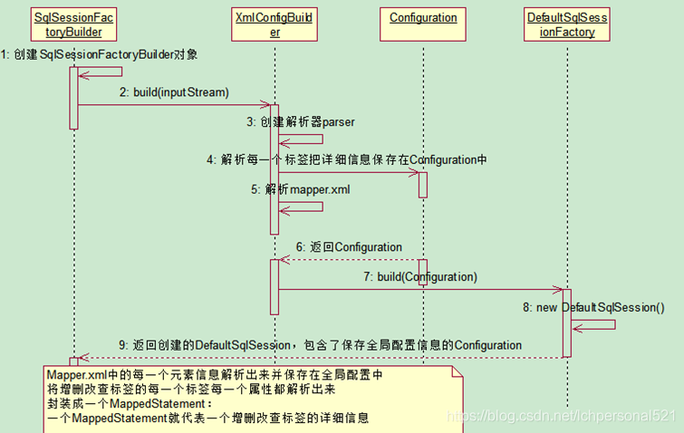

## [Mybatis实现原理](https://blog.csdn.net/lchpersonal521/article/details/84451357)

### 示例项目简介

**表结构**

```sql
-- 导出 mybatis 的数据库结构
CREATE DATABASE IF NOT EXISTS `mybatis` /*!40100 DEFAULT CHARACTER SET utf8 */;
USE `mybatis`;

-- 导出  表 mybatis.user 结构
CREATE TABLE IF NOT EXISTS `user` (
  `id` int(11) NOT NULL AUTO_INCREMENT,
  `name` varchar(50) NOT NULL,
  `age` int(11) NOT NULL,
  `sex` int(11) NOT NULL,
  PRIMARY KEY (`id`)
) ENGINE=MyISAM AUTO_INCREMENT=6 DEFAULT CHARSET=utf8;

-- 正在导出表  mybatis.user 的数据：3 rows
DELETE FROM `user`;

INSERT INTO `user` (`id`, `name`, `age`, `sex`) VALUES
 (1, '张三', 42, 0),
 (2, '李四', 15, 0),
 (3, '王五', 45, 0),
 (4, '赵六', 47, 0),
 (5, '孙艳', 26, 1);

```

**项目结构**


**配置文件**

dbconfig.properties

```properties
jdbc.driver=com.mysql.jdbc.Driver
jdbc.url=jdbc:mysql://192.168.226.200:3306/mybatis
jdbc.username=root
jdbc.password=123456
```

mybatis主配置文件mybatis-config.xml

```xml
<?xml version="1.0" encoding="UTF-8" ?>
<!DOCTYPE configuration
        PUBLIC "-//mybatis.org//DTD Config 3.0//EN"
        "http://mybatis.org/dtd/mybatis-3-config.dtd">
<configuration>
    <properties resource="dbconfig.properties"></properties>

    <environments default="development">
        <environment id="development">
            <transactionManager type="JDBC"/>
            <dataSource type="POOLED">
                <property name="driver" value="${jdbc.driver}"/>
                <property name="url" value="${jdbc.url}"/>
                <property name="username" value="${jdbc.username}"/>
                <property name="password" value="${jdbc.password}"/>
            </dataSource>
        </environment>
    </environments>
    <mappers>
        <mapper resource="UserMapper.xml"/>
    </mappers>
</configuration>

```

UserMapper.xml

```xml
<?xml version="1.0" encoding="UTF-8" ?>
<!DOCTYPE mapper
        PUBLIC "-//mybatis.org//DTD Mapper 3.0//EN"
        "http://mybatis.org/dtd/mybatis-3-mapper.dtd">
<mapper namespace="com.cl.mybatis.learn.mapper.UserMapper">
    <select id="selectById" resultType="com.cl.mybatis.learn.user.User">
    select * from user where id = #{id}
  </select>
</mapper>
```

**java类**

User.java

```java
package com.cl.mybatis.learn.user;

public class User {
    private int id;
    private String name;
    private int age;
    private int sex;
    ...
}
```

UserMapper.java

```java
package com.cl.mybatis.learn.mapper;
import com.cl.mybatis.learn.user.User;

public interface UserMapper {
    User selectById(int id);
}
```

Mybatis001.java 

```java
package com.cl.mybatis.learn;

import com.cl.mybatis.learn.mapper.UserMapper;
import org.apache.ibatis.io.Resources;
import org.apache.ibatis.session.SqlSession;
import org.apache.ibatis.session.SqlSessionFactory;
import org.apache.ibatis.session.SqlSessionFactoryBuilder;
import java.io.IOException;
import java.io.InputStream;

public class Mybatis001 {
    public static void main(String[] args) throws IOException {
        String resource = "mybatis-config.xml";
        InputStream inputStream = Resources.getResourceAsStream(resource);
        //1.SqlSessionFactory的创建
        SqlSessionFactory sqlSessionFactory = new SqlSessionFactoryBuilder().build(inputStream);
		//2.SqlSession的创建
        SqlSession session = sqlSessionFactory.openSession();
        try {
            //3.UserMapper代理的生成
            UserMapper mapper = session.getMapper(UserMapper.class);
            //4.数据库查询操作执行流程
            System.out.println(mapper.selectById(1));
        } finally {
            session.close();
        }
    }
}
```

### SqlSessionFactory的创建

SqlSessionFactory的创建是SqlSessionFactoryBuilder通过mybatis主配置文件构建出



主配置文件mybatis-config.xml

```xml
<?xml version="1.0" encoding="UTF-8" ?>
<!DOCTYPE configuration
        PUBLIC "-//mybatis.org//DTD Config 3.0//EN"
        "http://mybatis.org/dtd/mybatis-3-config.dtd">
<configuration>
    <properties resource="dbconfig.properties"></properties>

    <environments default="development">
        <environment id="development">
            <transactionManager type="JDBC"/>
            <dataSource type="POOLED">
                <property name="driver" value="${jdbc.driver}"/>
                <property name="url" value="${jdbc.url}"/>
                <property name="username" value="${jdbc.username}"/>
                <property name="password" value="${jdbc.password}"/>
            </dataSource>
        </environment>
    </environments>
    <mappers>
        <mapper resource="UserMapper.xml"/>
    </mappers>
</configuration>
```

**XMLConfigBuilder的parse()解析过程**

```java
public Configuration parse() {
    if (this.parsed) {
        throw new BuilderException("Each XMLConfigBuilder can only be used once.");
    } else {
        this.parsed = true;
        this.parseConfiguration(this.parser.evalNode("/configuration"));
        return this.configuration;
    }
}
```

```sequence
parse()->parseConfiguration(): 设置Configuration
parseConfiguration()->pluginElement():注册插件
parseConfiguration()->mapperElement():解析Mapper类
```

**设置Configuration**

```java
private void parseConfiguration(XNode root) {
    try {
        /**解析配置文件中的各种属性*/
        this.propertiesElement(root.evalNode("properties"));
        /**解析别名配置*/
        this.typeAliasesElement(root.evalNode("typeAliases"));
        /**解析插件配置*/
        this.pluginElement(root.evalNode("plugins"));
        /**解析对象工厂元素*/
        this.objectFactoryElement(root.evalNode("objectFactory"));
        this.objectWrapperFactoryElement(root.evalNode("objectWrapperFactory"));
        /**解析mybatis的全局设置信息*/
        this.settingsElement(root.evalNode("settings"));
        /**解析mybatis的环境配置*/
        this.environmentsElement(root.evalNode("environments"));
        this.databaseIdProviderElement(root.evalNode("databaseIdProvider"));
        /**解析类型处理器配置信息*/
        this.typeHandlerElement(root.evalNode("typeHandlers"));
        /**解析mapper配置信息*/
        this.mapperElement(root.evalNode("mappers"));
    } catch (Exception var3) {
        throw new BuilderException("Error parsing SQL Mapper Configuration. Cause: " + var3, var3);
    }
}
```

**解析插件**

```java
private void pluginElement(XNode parent) throws Exception {
    if (parent != null) {
        Iterator i$ = parent.getChildren().iterator();
        while(i$.hasNext()) {
            XNode child = (XNode)i$.next();
            String interceptor = child.getStringAttribute("interceptor");
            Properties properties = child.getChildrenAsProperties();
            /**实例化拦截器类*/
            Interceptor interceptorInstance = (Interceptor)this.resolveClass(interceptor).newInstance();
            interceptorInstance.setProperties(properties);
            /**将实例化的拦截器类放到configuration中的interceptorChain中*/
            this.configuration.addInterceptor(interceptorInstance);
        }
    }
}
```

通过interceptor标签，解析出拦截器类，然后将其实例化并保存到Configuration类中的InterceptorChain中，以备后用。

```java
public void addInterceptor(Interceptor interceptor) {
    this.interceptorChain.addInterceptor(interceptor);
}
```

**mappers的扫描与注解**

```java
private void mapperElement(XNode parent) throws Exception {
  if (parent != null) {
    for (XNode child : parent.getChildren()) {
      /**如果子节点是配置的package，那么进行包自动扫描处理*/  
      if ("package".equals(child.getName())) {
        String mapperPackage = child.getStringAttribute("name");
        configuration.addMappers(mapperPackage);
      } else {
        String resource = child.getStringAttribute("resource");
        String url = child.getStringAttribute("url");
        String mapperClass = child.getStringAttribute("class");
        /**如果子节点配置的是resource、url、mapperClass，本文我们使用的是resource*/
        if (resource != null && url == null && mapperClass == null) {
          ErrorContext.instance().resource(resource);
          InputStream inputStream = Resources.getResourceAsStream(resource);
          XMLMapperBuilder mapperParser = new XMLMapperBuilder(inputStream, configuration, resource, configuration.getSqlFragments());
          mapperParser.parse();
        } else if (resource == null && url != null && mapperClass == null) {
          ErrorContext.instance().resource(url);
          InputStream inputStream = Resources.getUrlAsStream(url);
          /**解析resource引入的另外一个xml文件*/
          XMLMapperBuilder mapperParser = new XMLMapperBuilder(inputStream, configuration, url, configuration.getSqlFragments());
          mapperParser.parse();
        } else if (resource == null && url == null && mapperClass != null) {
          Class<?> mapperInterface = Resources.classForName(mapperClass);
          configuration.addMapper(mapperInterface);
        } else {
          throw new BuilderException("A mapper element may only specify a url, resource or class, but not more than one.");
        }
      }
    }
  }
}
```

XMLMapperBuilder的parse()

```java
public void parse() {
  if (!configuration.isResourceLoaded(resource)) {
    /**解析sql语句，创建MappedStatement*/
    configurationElement(parser.evalNode("/mapper"));
    configuration.addLoadedResource(resource);
    /**解析名称空间，实际上就是对应绑定的接口类*/
    bindMapperForNamespace();
  }
  parsePendingResultMaps();
  parsePendingChacheRefs();
  parsePendingStatements();
}
```

```sequence
parse()->configurationElement(): 解析mapper.xml文档
parse()->bindMapperForNamespace(): 解析对应的Mapper类
parse()->parsePendingResultMaps():解析返回结果类
parse()->parsePendingStatements():解析返回MappedStatement(sql语句)
Note left of parse():将解析结果注册到configuration
```

### SqlSession的创建

SqlSessionFactory创建的时候实际上返回的是一个DefaultSqlSessionFactory对象,其openSession()操作如下:

```java
private SqlSession openSessionFromDataSource(ExecutorType execType, TransactionIsolationLevel level, boolean autoCommit) {
  Transaction tx = null;
  try {
    /**获取事务配置*/
    final Environment environment = configuration.getEnvironment();
    final TransactionFactory transactionFactory = getTransactionFactoryFromEnvironment(environment);
    tx = transactionFactory.newTransaction(environment.getDataSource(), level, autoCommit);
    /**根据execType创建Executor对象*/
    final Executor executor = configuration.newExecutor(tx, execType);
    return new DefaultSqlSession(configuration, executor, autoCommit);
  } catch (Exception e) {
    closeTransaction(tx); // may have fetched a connection so lets call close()
    throw ExceptionFactory.wrapException("Error opening session.  Cause: " + e, e);
  } finally {
    ErrorContext.instance().reset();
  }
}
```

Executor创建过程

```java
public Executor newExecutor(Transaction transaction, ExecutorType executorType) {
  executorType = executorType == null ? defaultExecutorType : executorType;
  executorType = executorType == null ? ExecutorType.SIMPLE : executorType;
  Executor executor;
  if (ExecutorType.BATCH == executorType) {
    executor = new BatchExecutor(this, transaction);
  } else if (ExecutorType.REUSE == executorType) {
    executor = new ReuseExecutor(this, transaction);
  } else {
    executor = new SimpleExecutor(this, transaction);
  }
  /**如果开启了二级缓存，executor会被CachingExecutor包装一次*/
  if (cacheEnabled) {
    executor = new CachingExecutor(executor);
  }
  /**尝试将executor使用interceptorChain中的每个interceptor包装一次(根据配置)，这里是对Mybatis强大的插件开发功能做支持*/
  executor = (Executor) interceptorChain.pluginAll(executor);
  return executor;
}
```

newExecutor()默认情况下会返回一个SimpleExecutor对象。然后SimpleExecutor被封装到DefaultSqlSession。

- 在Executor创建完毕之后，会根据配置是否开启了二级缓存，来决定是否使用CachingExecutor包装一次Executor
- 将executor使用interceptorChain中的每个interceptor包装一次(根据配置)，实现插件开发

### Mapper代理的生成


`UserMapper mapper = session.getMapper(UserMapper.class);`实际上是从configuration当中的MapperRegistry当中获取UserMapper的代理对象

```java
public <T> T getMapper(Class<T> type, SqlSession sqlSession) {
  final MapperProxyFactory<T> mapperProxyFactory = (MapperProxyFactory<T>) knownMappers.get(type);
  if (mapperProxyFactory == null)
    throw new BindingException("Type " + type + " is not known to the MapperRegistry.");
  try {
    return mapperProxyFactory.newInstance(sqlSession);
  } catch (Exception e) {
    throw new BindingException("Error getting mapper instance. Cause: " + e, e);
  }
}
```

Configuration的getMapper()

```java
public <T> T getMapper(Class<T> type, SqlSession sqlSession) {
  final MapperProxyFactory<T> mapperProxyFactory = (MapperProxyFactory<T>) knownMappers.get(type);
  if (mapperProxyFactory == null)
    throw new BindingException("Type " + type + " is not known to the MapperRegistry.");
  try {
    return mapperProxyFactory.newInstance(sqlSession);
  } catch (Exception e) {
    throw new BindingException("Error getting mapper instance. Cause: " + e, e);
  }
}
```

mapperProxyFactory使用动态代理获取Mapper代理

- knownMappers中的信息就是扫描mapper.xml得到的

```java
protected T newInstance(MapperProxy<T> mapperProxy) {
  return (T) Proxy.newProxyInstance(mapperInterface.getClassLoader(), new Class[] { mapperInterface }, mapperProxy);
}

public T newInstance(SqlSession sqlSession) {
  final MapperProxy<T> mapperProxy = new MapperProxy<T>(sqlSession, mapperInterface, methodCache);
  return newInstance(mapperProxy);
}
```

### 执行查询语句


`mapper.selectById()`实际的操作

```java
public Object invoke(Object proxy, Method method, Object[] args) throws Throwable {
  /**如果调用的是Object原生的方法，则直接放行*/
  if (Object.class.equals(method.getDeclaringClass())) {
    try {
      return method.invoke(this, args);
    } catch (Throwable t) {
      throw ExceptionUtil.unwrapThrowable(t);
    }
  }
  final MapperMethod mapperMethod = cachedMapperMethod(method);
  return mapperMethod.execute(sqlSession, args);
}
```

cacheMapperMethod()优先从methodCache中获取方法,否则创建方法并存入缓存

```java
private MapperMethod cachedMapperMethod(Method method) {
  MapperMethod mapperMethod = methodCache.get(method);
  if (mapperMethod == null) {
    mapperMethod = new MapperMethod(mapperInterface, method, sqlSession.getConfiguration());
    methodCache.put(method, mapperMethod);
  }
  return mapperMethod;
}
```

execute()方法主要包含2个操作

- 解析参数:Object param = method.convertArgsToSqlCommandParam(args); 
- 查询结果:result = sqlSession.selectOne(command.getName(), param);<font color='cornflowerblue'>其中command包含了mapperMethod信息</font>

```java
public Object execute(SqlSession sqlSession, Object[] args) {
  Object result;
  if (SqlCommandType.INSERT == command.getType()) {
    Object param = method.convertArgsToSqlCommandParam(args);
    result = rowCountResult(sqlSession.insert(command.getName(), param));
  } else if (SqlCommandType.UPDATE == command.getType()) {
    Object param = method.convertArgsToSqlCommandParam(args);
    result = rowCountResult(sqlSession.update(command.getName(), param));
  } else if (SqlCommandType.DELETE == command.getType()) {
    Object param = method.convertArgsToSqlCommandParam(args);
    result = rowCountResult(sqlSession.delete(command.getName(), param));
      /**select查询语句*/
  } else if (SqlCommandType.SELECT == command.getType()) {
      /**当返回类型为空*/
    if (method.returnsVoid() && method.hasResultHandler()) {
      executeWithResultHandler(sqlSession, args);
      result = null;
      /**当返回many的时候*/
    } else if (method.returnsMany()) {
      result = executeForMany(sqlSession, args);
      /**当返回值类型为Map时*/
    } else if (method.returnsMap()) {
      result = executeForMap(sqlSession, args);
    } else {
      /**除去以上情况，执行这里的步骤*/
      Object param = method.convertArgsToSqlCommandParam(args);
      result = sqlSession.selectOne(command.getName(), param);
    }
  } else {
    throw new BindingException("Unknown execution method for: " + command.getName());
  }
  if (result == null && method.getReturnType().isPrimitive() && !method.returnsVoid()) {
    throw new BindingException("Mapper method '" + command.getName() 
        + " attempted to return null from a method with a primitive return type (" + method.getReturnType() + ").");
  }
  return result;
}
```

convertArgsToSqlCommandParam(args)

> 如果判断参数一个只有一个（一个单一参数或者是一个集合参数），并且没有标注@Param注解，那么直接返回这个参数的值，否则会被封装为一个Map，然后再返回（在ParameterHandler拦截时使用）

selectOne最终调用执行的是DefaultSqlSession中的selectList方法

```java
public <E> List<E> selectList(String statement, Object parameter, RowBounds rowBounds) {
  try {
    MappedStatement ms = configuration.getMappedStatement(statement);
    List<E> result = executor.query(ms, wrapCollection(parameter), rowBounds, Executor.NO_RESULT_HANDLER);
    return result;
  } catch (Exception e) {
    throw ExceptionFactory.wrapException("Error querying database.  Cause: " + e, e);
  } finally {
    ErrorContext.instance().reset();
  }
}
```

query最终会调用doQuery方法

```java
public <E> List<E> doQuery(MappedStatement ms, Object parameter, RowBounds rowBounds, ResultHandler resultHandler, BoundSql boundSql) throws SQLException {
  Statement stmt = null;
  try {
    Configuration configuration = ms.getConfiguration();
      /**这里出现了Mybatis四大对象中的StatementHandler*/
    StatementHandler handler = configuration.newStatementHandler(wrapper, ms, parameter, rowBounds, resultHandler, boundSql);
    stmt = prepareStatement(handler, ms.getStatementLog());
    return handler.<E>query(stmt, resultHandler);
  } finally {
    closeStatement(stmt);
  }
}
```

```java
public StatementHandler newStatementHandler(Executor executor, MappedStatement mappedStatement, Object parameterObject, RowBounds rowBounds, ResultHandler resultHandler, BoundSql boundSql) {
  StatementHandler statementHandler = new RoutingStatementHandler(executor, mappedStatement, parameterObject, rowBounds, resultHandler, boundSql);
  statementHandler = (StatementHandler) 
   /**创建StatementHandler并应用到插件支持*/   
      interceptorChain.pluginAll(statementHandler);
  return statementHandler;
}
```

在创建StatementHandler(<font color='cornflowerblue'>实际使用BaseStatementHandler)</font>的同时，应用插件功能，同时创建了Mybatis四大对象中的另外两个对象

```java
protected BaseStatementHandler(Executor executor, MappedStatement mappedStatement, Object parameterObject, RowBounds rowBounds, ResultHandler resultHandler, BoundSql boundSql) {
   ……
   ……
   ……
 /**Mybatis四大对象中的ParameterHandler*/     
  this.parameterHandler = configuration.newParameterHandler(mappedStatement, parameterObject, boundSql);
  /**Mybatis四大对象中的ResultSetHandler*/ 
  this.resultSetHandler = configuration.newResultSetHandler(executor, mappedStatement, rowBounds, parameterHandler, resultHandler, boundSql);
}
```

### 总结


## [简述 Mybatis 的插件运行原理，以及如何编写一个插件](https://blog.csdn.net/top_code/article/details/55657776)

```mermaid
sequenceDiagram
		title:标题：复杂使用
		对象A->>对象A:对象B你好吗（请求）
		Note right of 对象B:对象B的描述（提示）
		Note left of 对象A:提示
		对象B-->>对象A:我很好（响应）
		对象B->>对象C:你好吗？
		对象C-->>对象A: B找我了
		对象A->>对象B:你确定？
		note over 对象C,对象B:朋友
		participant D
		note right of D:没人陪我
```


Mybatis 仅可以编写针对 ParameterHandler、ResultSetHandler、StatementHandler、Executor 这4种接口的插件，Mybatis 使用 JDK 的动态代理，为需要拦截的接口生成代理对象以实现接口方法拦截功能，每当执行这4种接口对象的方法时，就会进入拦截方法，具体就是Plugin(InvocationHandler) 的 invoke() 方法，当然，只会拦截那些你指定需要拦截的方法。

Configuration类中包含了InterceptorChain对象以及创建四大对象的方法:

```java
// org.apache.ibatis.session.Configuration
public class Configuration {
  protected final InterceptorChain interceptorChain = new InterceptorChain();

  /**对ParameterHandler 进行拦截**/
  public ParameterHandler newParameterHandler(MappedStatement mappedStatement, Object parameterObject, BoundSql boundSql) {
    ParameterHandler parameterHandler = mappedStatement.getLang().createParameterHandler(mappedStatement, parameterObject, boundSql);
    parameterHandler = (ParameterHandler) interceptorChain.pluginAll(parameterHandler);
    return parameterHandler;
  }

  /**对ResultSetHandler 进行拦截**/
  public ResultSetHandler newResultSetHandler(Executor executor, MappedStatement mappedStatement, RowBounds rowBounds, ParameterHandler parameterHandler,
      ResultHandler resultHandler, BoundSql boundSql) {
    ResultSetHandler resultSetHandler = new DefaultResultSetHandler(executor, mappedStatement, parameterHandler, resultHandler, boundSql, rowBounds);
    resultSetHandler = (ResultSetHandler) interceptorChain.pluginAll(resultSetHandler);
    return resultSetHandler;
  }

  /**对StatementHandler 进行拦截**/
  public StatementHandler newStatementHandler(Executor executor, MappedStatement mappedStatement, Object parameterObject, RowBounds rowBounds, ResultHandler resultHandler, BoundSql boundSql) {
    StatementHandler statementHandler = new RoutingStatementHandler(executor, mappedStatement, parameterObject, rowBounds, resultHandler, boundSql);
    statementHandler = (StatementHandler) interceptorChain.pluginAll(statementHandler);
    return statementHandler;
  }

  /**对Executor 进行拦截**/
  public Executor newExecutor(Transaction transaction) {
    return newExecutor(transaction, defaultExecutorType);
  }

  /**对Executor 进行拦截**/
  public Executor newExecutor(Transaction transaction, ExecutorType executorType) {
    executorType = executorType == null ? defaultExecutorType : executorType;
    executorType = executorType == null ? ExecutorType.SIMPLE : executorType;
    Executor executor;
    if (ExecutorType.BATCH == executorType) {
      executor = new BatchExecutor(this, transaction);
    } else if (ExecutorType.REUSE == executorType) {
      executor = new ReuseExecutor(this, transaction);
    } else {
      executor = new SimpleExecutor(this, transaction);
    }
    if (cacheEnabled) {
      executor = new CachingExecutor(executor);
    }
    executor = (Executor) interceptorChain.pluginAll(executor);
    return executor;
  }

  public void addInterceptor(Interceptor interceptor) {
    interceptorChain.addInterceptor(interceptor);
  }
}
```

InterceptorChain包含了Interceptor列表,并提供了管理方法

```java
public class InterceptorChain {
    private final List<Interceptor> interceptors = new ArrayList();

    public InterceptorChain() {
    }

    public Object pluginAll(Object target) {
        Interceptor interceptor;
        for(Iterator i$ = this.interceptors.iterator(); i$.hasNext(); target = interceptor.plugin(target)) {
            interceptor = (Interceptor)i$.next();
        }

        return target;
    }

    public void addInterceptor(Interceptor interceptor) {
        this.interceptors.add(interceptor);
    }

    public List<Interceptor> getInterceptors() {
        return Collections.unmodifiableList(this.interceptors);
    }
}
```


```sequence
InterceptorChain->Interceptor: pluginAll(target)
Interceptor->Plugin:plugin(target)
Note right of Plugin:wrap(target,interceptor):动态代理
Plugin->InterceptorChain:return wrappedTarget
```

编写插件：实现 Mybatis 的 Interceptor 接口并复写 intercept() 方法，然后在给插件编写注解，指定要拦截哪一个接口的哪些方法即可，记住，别忘了在配置文件中配置你编写的插件。

```java
@Intercepts({ @Signature(type = StatementHandler.class, method = "prepare", args = { Connection.class, Integer.class}) })
public class SQLStatsInterceptor implements Interceptor {
	...
}
```

MyBatis 允许你在已映射语句执行过程中的某一点进行拦截调用。默认情况下，MyBatis 允许使用插件来拦截的方法调用包括：

- Executor (update, query, flushStatements, commit, rollback, getTransaction, close, isClosed)
- ParameterHandler (getParameterObject, setParameters)
- ResultSetHandler (handleResultSets, handleOutputParameters)
- StatementHandler (prepare, parameterize, batch, update, query)

## 动态代理实现

```java
public interface Flyable {
    void fly();
}
 
public class Bird implements Flyable {
    @Override
    public void fly() {
        System.out.println("Bird is flying...");
        try {
            Thread.sleep(new Random().nextInt(1000));
        } catch (InterruptedException e) {
            e.printStackTrace();
        }
    }
}
```

开发之后希望能够统计bird共飞行了多久时间,需要对方法进行加强.

**实现方法加强的两种手段**

- 继承

  ```java
  public class Bird2 extends Bird {
      @Override
      public void fly() {
          long start = System.currentTimeMillis();
          
          super.fly();
          
          long end = System.currentTimeMillis();
          System.out.println("Fly time = " + (end - start));
      }
  }
  ```

- 聚合

```java
public class BirdLogProxy implements Flyable {
    private Flyable flyable;
 
    public BirdLogProxy(Flyable flyable) {
        this.flyable = flyable;
    }
 
    @Override
    public void fly() {
        System.out.println("Bird fly start...");
 
        flyable.fly();
 
        System.out.println("Bird fly end...");
    }
}
```


**静态代理**

> 类BirdTimeProxy在fly方法中直接调用了flyable->fly()方法. BirdTimeProxy其实代理了传入的Flyable对象，是典型的静态代理实现.

静态代理局限性问题:

- 如果同时代理多个类，依然会导致类无限制扩展

- 如果类中有多个方法，同样的逻辑需要反复实现

解决方案

> 使用一个代理类代理任意对象,如用TimeProxy计算任意一个对象的执行时间

**动态代理**

动态生成Java源文件可使用 [JavaPoet](https://link.jianshu.com/?t=https%3A%2F%2Fgithub.com%2Fsquare%2Fjavapoet) 第三方库,以此模拟jdk动态代理

1. 生成TimeProxy源码

```java
public class Proxy {
 
    public static Object newProxyInstance() throws IOException {
        //1.生成类
        TypeSpec.Builder typeSpecBuilder = TypeSpec.classBuilder("TimeProxy")
                .addSuperinterface(Flyable.class);
 		//2.生成属性
        FieldSpec fieldSpec = FieldSpec.builder(Flyable.class, "flyable", Modifier.PRIVATE).build();
        typeSpecBuilder.addField(fieldSpec);
 		//3.生成构造方法
        MethodSpec constructorMethodSpec = MethodSpec.constructorBuilder()
                .addModifiers(Modifier.PUBLIC)
                .addParameter(Flyable.class, "flyable")
                .addStatement("this.flyable = flyable")
                .build();
        typeSpecBuilder.addMethod(constructorMethodSpec);
 		//4.生成方法
        Method[] methods = Flyable.class.getDeclaredMethods();
        for (Method method : methods) {
            MethodSpec methodSpec = MethodSpec.methodBuilder(method.getName())
                    .addModifiers(Modifier.PUBLIC)
                    .addAnnotation(Override.class)
                    .returns(method.getReturnType())
                    .addStatement("long start = $T.currentTimeMillis()", System.class)
                    .addCode("\n")
                    .addStatement("this.flyable." + method.getName() + "()")
                    .addCode("\n")
                    .addStatement("long end = $T.currentTimeMillis()", System.class)
                    .addStatement("$T.out.println(\"Fly Time =\" + (end - start))", System.class)
                    .build();
            typeSpecBuilder.addMethod(methodSpec);
        }
 		//5.生成file文件
        JavaFile javaFile = JavaFile.builder("com.youngfeng.proxy", typeSpecBuilder.build()).build();
        // 为了看的更清楚，我将源码文件生成到桌面
        javaFile.writeTo(new File("/Users/ouyangfeng/Desktop/"));
 
        return null;
    }
 
}
```

在main方法中调用Proxy.newProxyInstance()，将看到桌面已经生成了TimeProxy.java文件

2. 编译TimeProxy源码

编译TimeProxy源码我们直接使用JDK提供的编译工具即可，为了使你看起来更清晰，我使用一个新的辅助类来完成编译操作：

```java
public class JavaCompiler {
 
    public static void compile(File javaFile) throws IOException {
        javax.tools.JavaCompiler javaCompiler = ToolProvider.getSystemJavaCompiler();
        StandardJavaFileManager fileManager = javaCompiler.getStandardFileManager(null, null, null);
        Iterable iterable = fileManager.getJavaFileObjects(javaFile);
        javax.tools.JavaCompiler.CompilationTask task = javaCompiler.getTask(null, fileManager, null, null, null, iterable);
        task.call();
        fileManager.close();
    }
}
```

3. 加载到内存中并创建对象

```java
  URL[] urls = new URL[] {new URL("file:/" + sourcePath)};
  URLClassLoader classLoader = new URLClassLoader(urls);
  Class clazz = classLoader.loadClass("com.youngfeng.proxy.TimeProxy");
  Constructor constructor = clazz.getConstructor(Flyable.class);
  Flyable flyable = (Flyable) constructor.newInstance(new Bird());
  flyable.fly();
```

4. 增加InvocationHandler接口

查看Proxy->newProxyInstance()的源码，代理类继承的接口(Flyable)是写死的，为了增加灵活性，我们将接口类型作为参数传入

```java
public class Proxy {
    public static Object newProxyInstance(Class inf) throws IOException {
    	...
    }
}
```

为了增加控制的灵活性，将代理的处理逻辑也抽离出来（这里的处理就是打印方法的执行时间）。新增`InvocationHandler`接口，用于处理自定义逻辑

```java
public interface InvocationHandler {
    void invoke(Object proxy, Method method, Object[] args);
}
proxy => 这个参数指定动态生成的代理类，这里是TimeProxy
method => 这个参数表示传入接口中的所有Method对象
args => 这个参数对应当前method方法中的参数
```

newProxyInstance方法修改为

```java
  public static Object newProxyInstance(Class inf, InvocationHandler handler) throws Exception {
        TypeSpec.Builder typeSpecBuilder = TypeSpec.classBuilder("TimeProxy")
                .addModifiers(Modifier.PUBLIC)
                .addSuperinterface(inf);
 
        FieldSpec fieldSpec = FieldSpec.builder(InvocationHandler.class, "handler", Modifier.PRIVATE).build();
        typeSpecBuilder.addField(fieldSpec);
 
        MethodSpec constructorMethodSpec = MethodSpec.constructorBuilder()
                .addModifiers(Modifier.PUBLIC)
                .addParameter(InvocationHandler.class, "handler")
                .addStatement("this.handler = handler")
                .build();
 
        typeSpecBuilder.addMethod(constructorMethodSpec);
 
        Method[] methods = inf.getDeclaredMethods();
        for (Method method : methods) {
            MethodSpec methodSpec = MethodSpec.methodBuilder(method.getName())
                    .addModifiers(Modifier.PUBLIC)
                    .addAnnotation(Override.class)
                    .returns(method.getReturnType())
                    .addCode("try {\n")
                    .addStatement("\t$T method = " + inf.getName() + ".class.getMethod(\"" + method.getName() + "\")", Method.class)
                    // 为了简单起见，这里参数直接写死为空
                    .addStatement("\tthis.handler.invoke(this, method, null)")
                    .addCode("} catch(Exception e) {\n")
                    .addCode("\te.printStackTrace();\n")
                    .addCode("}\n")
                    .build();
            typeSpecBuilder.addMethod(methodSpec);
        }
 
        JavaFile javaFile = JavaFile.builder("com.youngfeng.proxy", typeSpecBuilder.build()).build();
        // 为了看的更清楚，我将源码文件生成到桌面
        String sourcePath = "/Users/ouyangfeng/Desktop/";
        javaFile.writeTo(new File(sourcePath));
 
        // 编译
        JavaCompiler.compile(new File(sourcePath + "/com/youngfeng/proxy/TimeProxy.java"));
 
        // 使用反射load到内存
        URL[] urls = new URL[] {new URL("file:" + sourcePath)};
        URLClassLoader classLoader = new URLClassLoader(urls);
        Class clazz = classLoader.loadClass("com.youngfeng.proxy.TimeProxy");
        Constructor constructor = clazz.getConstructor(InvocationHandler.class);
        Object obj = constructor.newInstance(handler);
 
        return obj;
 }
```

**改进后的方法使用示例**

1. MyInvocationHandler.java增强方法

```java
public class MyInvocationHandler implements InvocationHandler {
    private Bird bird;
 
    public MyInvocationHandler(Bird bird) {
        this.bird = bird;
    }
 
    @Override
    public void invoke(Object proxy, Method method, Object[] args) {
        long start = System.currentTimeMillis();
 
        try {
            method.invoke(bird, new Object[] {});
        } catch (IllegalAccessException e) {
            e.printStackTrace();
        } catch (InvocationTargetException e) {
            e.printStackTrace();
        }
 
        long end = System.currentTimeMillis();
        System.out.println("Fly time = " + (end - start));
    }
}
```

2. 生成代理对象

```java
Proxy.newProxyInstance(Flyable.class, new MyInvocationHandler(new Bird()));
```

生成的代理类代码

```java
package com.youngfeng.proxy;
 
import java.lang.Override;
import java.lang.reflect.Method;
 
public class TimeProxy implements Flyable {
  private InvocationHandler handler;
 
  public TimeProxy(InvocationHandler handler) {
    this.handler = handler;
  }
 
  @Override
  public void fly() {
    try {
        Method method = com.youngfeng.proxy.Flyable.class.getMethod("fly");
        this.handler.invoke(this, method, null);
    } catch(Exception e) {
        e.printStackTrace();
    }
  }
}
```

**JDK源码**

1. Proxy.newProxyInstance()

```java
public static Object newProxyInstance(ClassLoader loader,	#类加载器,保持类的唯一性
                                      Class<?>[] interfaces,#接口数组,可同时代理多个方法
                                      InvocationHandler h)	#增强方法
```

2. InvocationHandler

```java
public interface InvocationHandler {
    public Object invoke(Object proxy, Method method, Object[] args)
        throws Throwable;
}
```

