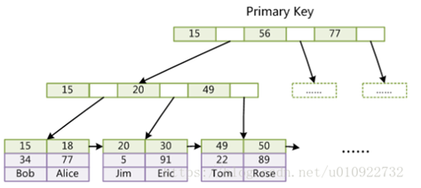
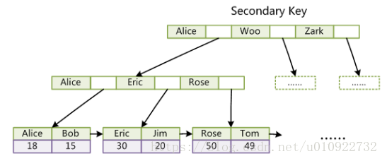
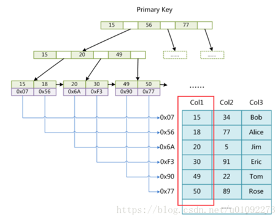
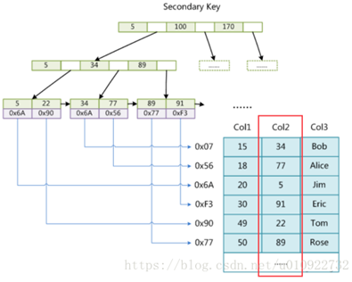
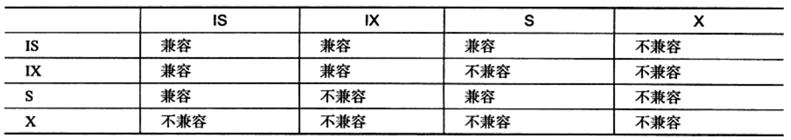
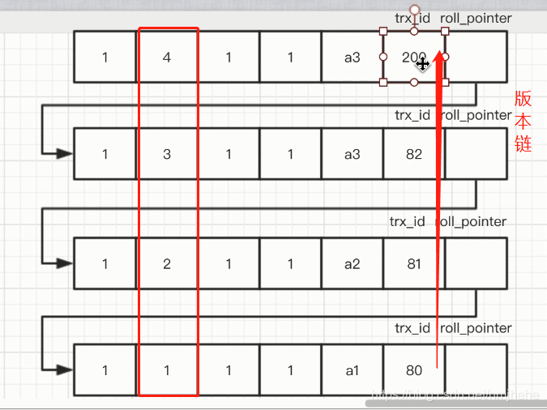
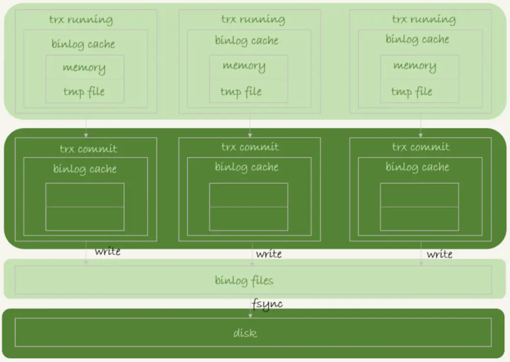
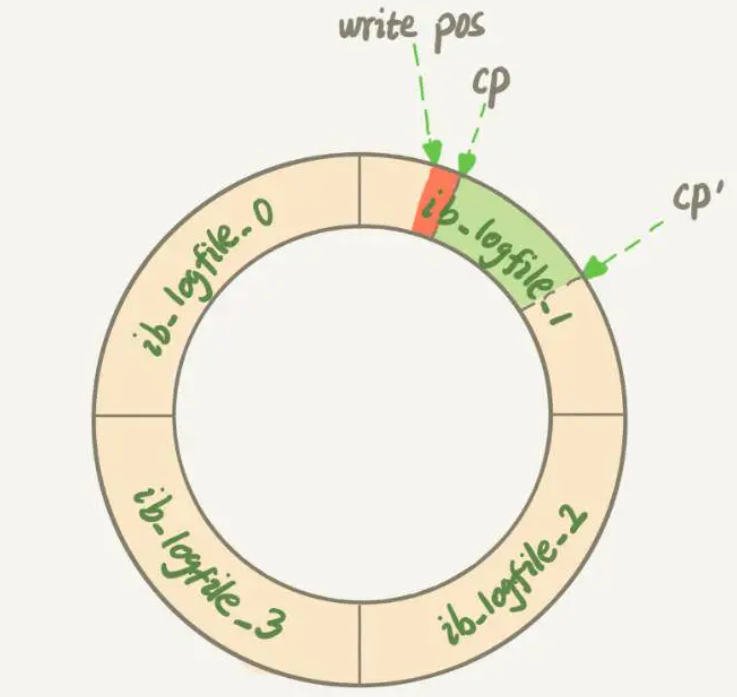
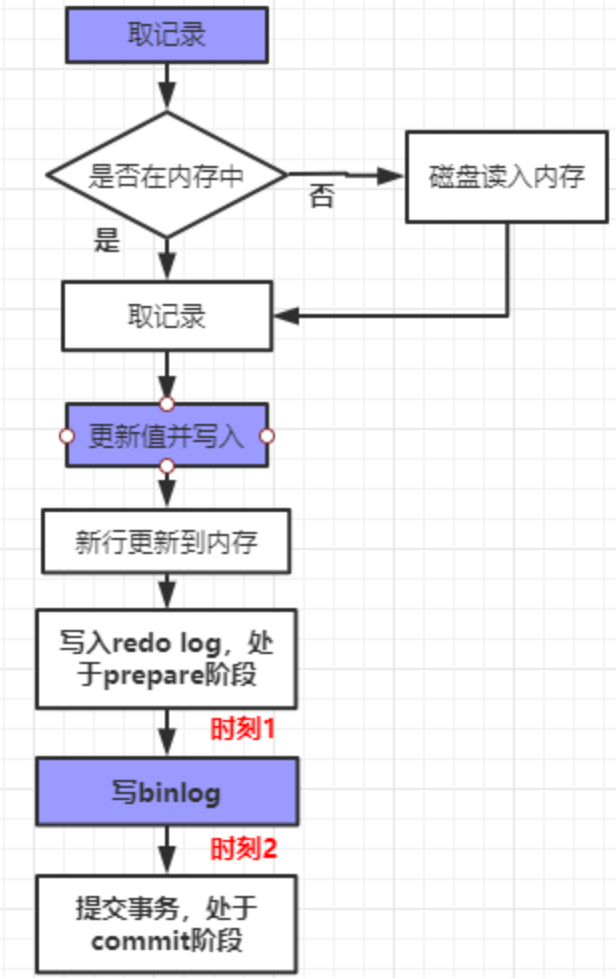
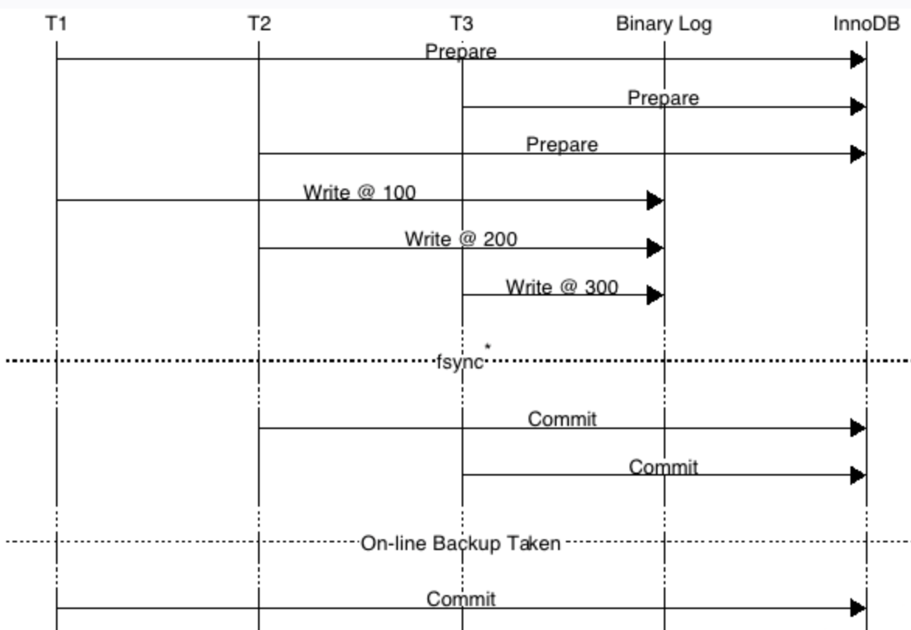

## 索引

### 什么是索引?
索引是一种数据结构,可以帮助我们快速的进行数据的查找.

### 索引是个什么样的数据结构呢?
索引的数据结构和具体存储引擎的实现有关, 在MySQL中使用较多的索引有Hash索引,B+树索引等,而我们经常使用的InnoDB存储引擎的默认索引实现为:B+树索引.

### Hash索引和B+树所有有什么区别或者说优劣呢?

**底层实现原理**

hash索引底层就是hash表,进行查找时,调用一次hash函数就可以获取到相应的键值,之后进行回表查询获得实际数据.

B+树底层实现是多路平衡查找树.对于每一次的查询都是从根节点出发,查找到叶子节点方可以获得所查键值,然后根据查询判断是否需要回表查询数据.

**hash索引与B+树索引区别**

1. hash索引进行等值查询更快(一般情况下),但是却无法进行**范围查询**.

```
因为在hash索引中经过hash函数建立索引之后,索引的顺序与原顺序无法保持一致,不能支持范围查询.而B+树的的所有节点皆遵循(左节点小于父节点,右节点大于父节点,多叉树也类似),支持范围查询.
```

2. hash索引不支持使用索引进行**排序**,原理同上.
3.  hash索引不支持**模糊查询**以及多列索引的最左前缀匹配.原理也是因为hash函数的不可预测.
4. hash索引任何时候都避免不了**回表查询**数据,而B+树在符合某些条件(聚簇索引,覆盖索引等)的时候可以只通过索引完成查询.
5. hash索引虽然在等值查询上较快,但是不稳定.**性能不可预测**,当某个键值存在大量重复的时候,发生hash碰撞,此时效率可能极差.而B+树的查询效率比较稳定,对于所有的查询都是从根节点到叶子节点,且树的高度较低.

在大多数情况下,直接选择B+树索引可以获得稳定且较好的查询速度.而不需要使用hash索引.

### 什么是聚簇索引?

**B+树索引**

```
聚簇索引:叶子节点存储了当前的聚簇索引值以及整行的数据
非聚簇索引:叶子节点存储了当前的索引值和数据指针 
辅助索引:依赖于聚集索引/非聚集索引
```

**Innodb的聚簇索引**

Innodb存在2种索引,聚簇索引和辅助索引

- 聚簇索引索引(索引和数据存在同一个文件中(聚簇),树节点同时存放索引和数据.)

​                               

- 辅助索引(树节点第一行为辅助索引,第二行为主键值)

 

在InnoDB中,只有主键索引是聚簇索引,如果没有主键,则挑选一个唯一键建立聚簇索引.如果没有唯一键,则隐式的生成一个键来建立聚簇索引.

**MyISAM的非聚簇索引**

索引文件与数据文件分离, MyISAM引擎中叶子结点存储的数据其实是索引和数据的文件指针两类.

- 主键索引:

​                               

 

查找数据的流程：先从索引文件中查找到索引节点，从中拿到数据的文件指针，再到数据文件中通过文件指针定位了具体的数据。

- 辅助索引(辅助索引结构与主键索引结构相同)



### [什么是回表查询?](https://blog.csdn.net/qq_42000661/article/details/108536954)

**回表查询**


索引结构

```
聚集索引:id为PK，叶子节点存储行记录；
辅助索引:name为KEY，叶子节点存储PK值，即id；
```

通过辅助索引查询(`select * from t where name='ls'`);如**粉红色**路径，需要扫码两遍索引树：

```
（1）先通过辅助索引定位到主键值id=5；
（2）在通过聚集索引定位到行记录；
```

**回表查询**:先定位主键值，再定位行记录，它的性能较扫一遍索引树更低

**触发回表查询的条件**

```
(1) Innodb存储引擎
(2) 使用辅助索引查询数据,并且辅助索引并没有覆盖数据列
```

### 在建立索引的时候,都有哪些需要考虑的因素呢?

建立索引的时候一般要考虑到字段的使用频率,经常作为条件进行查询的字段比较适合.

如果需要建立联合索引的话,还需要考虑联合索引中的顺序.

索引需要维护,避免索引列频繁更新

此外还要防止过多索引的所有对表造成太大的压力.

### 联合索引是什么?为什么需要注意联合索引中的顺序?

MySQL可以使用多个字段同时建立一个索引,叫做联合索引.在联合索引中,如果想要命中索引,需要按照建立索引时的字段顺依次使用,否则无法命中索引.

具体原因为:

```
MySQL使用索引时需要索引有序,假设现在建立了"ABC"的联合索引,那么索引的排序为: 先按照A排序,如果A相同,则按照B排序,如果B的值也相等,则按照C进行排序.
当进行查询时,一次使用ABC作为查询条件,联合索引能够正常工作.若使用BA,CAB等非指定顺序的查询条件,联合索引就不能生效.
```

### 创建的索引有没有被使用到?或者说怎么才可以知道这条语句运行很慢的原因?

MySQL提供了explain命令来查看语句的执行计划,MySQL在执行某个语句之前,会将该语句过一遍查询优化器,之后会拿到对语句的分析(**执行计划**),可以通过其中和索引有关的信息来分析是否命中了索引,

```
possilbe_key:可能会使用的索引
key:实际使用的索引
key_len:使用的索引长度
```

### [使用索引的注意事项有哪些?](https://www.cnblogs.com/liehen2046/p/11052666.html)

**索引失效的情况**

使用左模糊查询
使用不等于查询
使用非最左前缀的联合索引
使用了or连接无索引的列
where条件列参与了数学运算,函数或类型自动转换
使用了非覆盖索引的辅助索引的!=查询条件

```
覆盖索引的!=查询条件,仅遍历一次辅助索引B+树,可走索引
聚簇索引的!=查询条件,仅遍历一次聚簇索引B+树,可走索引
非覆盖索引的辅助索引的!=查询条件,遍历一次辅助索引B+并需要访问聚簇索引B+树,不走索引
```

当mysql分析全表扫描比使用索引快的时候不使用索引.

**如何正确使用索引**

1. 避免查询出现索引失效的情况

2. 尽可能使用`between and`代替`in(...)`,可触发范围查询

3. 尽量减少查询列中存在null,使用默认值代替,否则可能不会使用索引

   ```
   查询条件中IS NULL，当命中结果数量小于40%的时候，才会走索引。
   查询条件中的IS NOT NULL,命中结果数小于30%的时候，才会走索引。
   ```

## 事务

### ACID是什么?

- 原子性(Atomicity)：整个事务中的所有操作，要么全部完成，要么全部不完成，

- 一致性(Consistency)：在事务开始之前和事务结束以后，数据库的完整性约束没有被破坏。 

-  隔离性(Isolation)：隔离状态执行事务，使它们好像是系统在给定时间内执行的唯一操作。事务并发响.

- 持久性(Durability)：在事务完成以后，该事务所对数据库所作的更改便持久的保存在数据库之中，并不会被回滚。

### 同时有多个事务在进行会怎么样呢?（ 不考虑隔离性造成的读问题）

- 脏读:  在一个事务中读取到另一个事务没有提交的数据(数据可能被修改或rollback)

- 不可重复读:  在一个事务中,两次查询的结果不一致(针对的update和delete操作)

- 虚读(幻读):   在一个事务中,两次查询的结果数量不一致(针对的insert操作,insert操作之后查询结果增多)

### 怎么解决这些问题呢?MySQL的事务隔离级别了解吗?

| 隔离级别                            |                                                              |
| ----------------------------------- | ------------------------------------------------------------ |
| read uncommitted     读未提交       | 上面的三个问题都会出现                                       |
| read committed         读已提交     | 可以避免脏读的发生                                           |
| repeatable read         可重复读    | 可以避免脏读和不可重复读的发生(Innodb默认),加上临键锁可以避免幻读. |
| serializable                 串行化 | 可以避免所有的问题                                           |

### mysql的锁有哪些,分别解决了什么问题?

**粒度锁**

数据库引擎具有多粒度锁定，允许一个事务锁定不同类型的资源。,提高了并发性.

```
锁定在较小的粒度（例如行）可以提高并发度，但开销较高，因为如果锁定了许多行，则需要持有更多的锁。
锁定在较大的粒度（例如表）会降低了并发度，因为锁定整个表限制了其他事务对表中任意部分的访问.但其开销较低，因为需要维护的锁较少。
```

粒度锁类型

```
表级锁：锁住整个表,不会出现死锁；锁定粒度大，发生锁冲突的概率最高,并发度最低。
行级锁：锁住的是表的某一行或者多行记录；会出现死锁；锁定粒度最小，发生锁冲突的概率最低,并发度也最高。
页面锁：开销和加锁时间界于表锁和行锁之间；会出现死锁；锁定粒度界于表锁和行锁之间，并发度一般。
Innodb通过位图来记录页面锁,所以锁升级并不会减少开销.
```

不同存储引擎支持不同的粒度锁

```
MyISAM和MEMORY存储引擎采用的是表级锁(table-level locking)；
BDB存储引擎采用的是页面锁(page-level locking)，但也支持表级锁；
InnoDB存储引擎既支持行级锁(row-level locking)，也支持表级锁，但默认情况下是采用行级锁。
```

InnoDB行锁是通过给索引上的`索引项加锁`来实现的。只有通过索引条件检索数据，InnoDB才使用行级锁，否则，InnoDB将使用表锁

**属性锁**

通过属性锁可实现<font color='red'>一致性锁定读</font>.

- 排它锁X(**行级锁**):事务T对数据上X锁,只允许T读取和修改数据

```
update,insert,delete语句会对数据施加X锁
select ... for update语句会对数据施加X锁
```

- 共享锁S(**行级锁**):事务T对数据上S锁,T能读取但不能修改数据,其他事务只能对数据上S锁

```
select ... lock in share mode语句会对数据施加S锁
```

共享锁与排他锁的兼容性


为避免加锁前的判断需要遍历整个索引,对数据进行更细粒度控制,引入**意向锁**.

```
mysql中的数据具有树结构,数据库->表->页->行
对节点施加S/X锁需要对祖先节点施加对应的意向锁
```

- 意向共享锁IS: 表示其子节点将加S锁

- 意向排它锁IX: 表示其子节点将加X锁

- SIX锁: 表示对象先加S锁,再加IX锁 

属性锁的兼容性



**算法锁**

算法锁解决了不可重复读和幻读的问题.

1. 记录锁:锁住一条行记录

   使用条件:

   ```
   唯一索引的等值查询
   ```

   作用:

   ```
   避免了在修改的事务未提交前被其他事务读取的脏读问题
   避免数据在查询的时候被修改的重复读问题
   ```

2. [间隙锁](https://www.jianshu.com/p/bf862c37c4c9):锁住的是表记录的某一个区间，当表的相邻ID之间出现空隙则会形成一个开区间

   使用条件:

   ```
   范围查询记录(唯一索引/普通索引)
   等值查询记录(普通索引)
   间隙锁只会出现在RR（重复读)的事务级别中
   ```

   <font color='cornflowerblue'>加锁范围:</font>

   ```
   根据检索条件向左寻找最靠近检索条件的记录值A，作为左区间，向右寻找最靠近检索条件的记录值B作为右区间，即锁定的间隙为（A，B）
   唯一索引只对唯一索引区间进行锁定.而普通索引会对普通索引施加间隙锁,对唯一索引施加记录锁.
   ```

   作用:避免了幻读

   ```
   防止间隙内有新数据被插入
   防止已存在的数据，更新成间隙内的数据
   ```

   间隙锁的关闭

   ```
   1.将事务级别设置为READ COMMITTED
   2.将innodb_locks_unsafe_for_binlog设置为1
   但外键约束和唯一性检查仍会使用间隙锁.
   ```

3. 临键锁:锁住表记录的一个区间(左开右闭),记录锁+间隙锁

   临键锁是RR事务级别的默认锁.

   以下情况临键锁会降级成记录锁

   ```
   唯一索引等值查询
   事务级别为READ COMMITED
   ```

**乐观锁与悲观锁**

悲观锁:安全性高,并发度低.

```
认为多线程使用同一个资源就会冲突
当A事务在操作该条记录时，会把该条记录锁起来，其他事务是不能操作这条记录的(串行化)。
```

乐观锁:安全性较高,并发度较高.

```
采用版本号的机制来解决的。会给表结构添加一个字段version=0，默认值是0
当事务在操作完该条记录，提交事务时，会先检查版本号.
如果发生版本号的值相同时，才可以提交事务。同时会更新版本号version.
若版本号不同,则会抛出异常
```

**其他锁**

1. 自增长与锁

   含有自增长列的表有一个<font color='cornflowerblue'>自增长计数器</font>,插入操作会根据计数器的值+1赋予自增长列.

   自增长是通过AUTO-INC Locking实现的,行为由innodb_auto_inc_mode决定

   ```
   0:锁在自增长值插入的sql执行后就释放,不需要等待事务结束
   1:simple-insert采用互斥量管理计数器,bulk-insert仍采用0策略
   2:所有insert-like都采用互斥量管理计数器(会出现什么问题????)
   ```

2. 外键与锁

   外键列若未显式设置索引,innodb会自动添加索引,避免表锁.

   ```
   对外键值的更新/插入会使用一致性锁定读查询父表,避免父表在此期间出现更新.
   ```

### 一致性非锁定读是什么,是怎么实现的?([MVCC](https://zhuanlan.zhihu.com/p/52977862))

在并发访问数据库时，通过对数据做多版本管理，避免因为写锁的阻塞而造成读数据的并发阻塞问题。


对于InnoDB存储引擎的表，聚簇索引记录中都包含两个必要的隐藏列（ row_id并不是必要的，我们创建的表中有主键或者非NULL唯一键时都不会包含row_id列）：

trx_id：每次对某条记录进行改动时，都会把对应的事务id赋值给trx_id隐藏列。
roll_pointer：每次对某条记录进行改动时，这个隐藏列会存一个指针，可以通过这个指针找到该记录修改前的信息 

**版本链**

- 事务版本号:事务开启前获得一个自增长的事务ID,可从事务ID判断事务执行顺序.



- 表格隐藏列(对于InnoDB存储引擎的表，聚簇索引都包含必要的隐藏列)

```
DB_TRX_ID:       记录操作该数据事务的事务ID；
DB_ROLL_PTR：    指向上一个版本数据在undo log 里的位置指针；
DB_ROW_ID:       隐藏ID ，当创建表没有合适的索引作为聚集索引时，会用该隐藏ID创建聚集索引;
```

- Undo log:记录数据被修改之前的日志，在表信息修改之前先会把数据拷贝到undo log 

```
1. 保证事务进行rollback时的原子性和一致性，当事务进行回滚的时候可以用undo log的数据进行恢复。
2. 用于MVCC快照读的数据，在MVCC多版本控制中，通过读取undo log的历史版本数据实现不同事务版本号都拥有自己独立的快照数据版本。
```

[**Read View**](https://blog.csdn.net/nmjhehe/article/details/98470570)

mysql如何数据

```
READ UNCOMMITTED：直接读取记录的最新版本
READ COMMITTED：每次读取数据前都生成一个ReadView,即读取当前版本链最新版本中数据的对应值
REPEATABLE READ：第一次读取数据时生成一个ReadView，即读取事务开始时版本链最新版本中数据的对应值
SERIALIZABLE：使用加锁的方式来访问记录
```

Read View属性

```
trx_ids:         当前系统活跃(未提交)事务版本号集合。
max_limit_id:    创建当前read view 时当前系统活跃的事务最大版本号。
min_limit_id:     创建当前read view 时系统活跃的事务最小版本号
creator_trx_id:  创建当前read view的事务版本号
```

根据Read view 读取数据

```
1）如果被访问版本的trx_id属性值与ReadView中的creator_trx_id值相同，意味着当前事务在访问它自己修改过的记录，所以该版本可以被当前事务访问。
2）如果被访问版本的trx_id属性值小于ReadView中的min_trx_id值，表明生成该版本的事务在当前事务生成ReadView前已经提交，所以该版本可以被当前事务访问。
3）如果被访问版本的trx_id属性值大于ReadView中的max_trx_id值，表明生成该版本的事务在当前事务生成ReadView后才开启，所以该版本不可以被当前事务访问。
4）如果被访问版本的trx_id属性值在ReadView的min_trx_id和max_trx_id之间，那就需要判断一下trx_id属性值是不是在trx_ids列表中，如果在，说明创建ReadView时生成该版本的事务还是活跃的，该版本不可以被访问；如果不在，说明创建ReadView时生成该版本的事务已经被提交，该版本可以被访问
5）对于不能访问的版本,会访问对应undo log中的数据.
```

undo log的删除时机:不存在比undo log更早的read view时.

**MVCC原理**
MVCC（ Multi-Version Concurrency Control ，多版本并发控制）

```
在使用READ COMMITTD、REPEATABLE READ这两种隔离级别的事务在执行普通的SEELCT操作时访问记录的版本链的过程。
MVCC使不同事务的读-写、写-读操作并发执行，从而提升系统性能。
```

READ COMMITTD、 REPEATABLE READ这两个隔离级别的一个很大不同就是：生成ReadView的时机不同

```
READ COMMITTD在每一次进行普通SELECT操作前都会生成一个ReadView，
REPEATABLE READ只在第一次进行普通SELECT操作前生成一个ReadView，之后的查询操作都重复使用这个ReadView
```

 **快照读和当前读**

- 快照读:读取数据的历史版本,而不是最新版本,select时不需要加锁
- 当前读:读取最新数据,需要保证事务隔离性

### 死锁是怎么造成的?如何避免?

死锁

```
死锁是指两个或两个以上的进程在执行过程中，因争夺资源而造成的一种互相等待的现象,若无外力作用,它们都将永远在互相等待的过程称为死锁。
```

mysql死锁的原因

```
A事务锁住了B事务需要的数据,而B事务又锁住了A事务需要的数据.(详情请查看属性锁兼容表中不兼容的情况)
```

检测死锁

```
我们可以通过show full processlist 命令查看当前所有数据库连接状态，如果连接在等待锁资源，在State状态会显示waiting for table metadata lock信息，同时可以通过info信息查看数据库连接执行了哪一条sql语句，如果所有的等待锁的连接执行的sql语句都涉及到了同一张表，那么就能断定哪站表发生了死锁.
```

Innodb对死锁的处理

```
1.通过 innodb_lock_wait_timeout(50s)来设置超时时间，超时的事务回滚并释放资源；
2.发起死锁检测(wait-for graph)，发现死锁之后，主动回滚死锁中的某一个事务，让其它事务继续执行。
```

如何避免死锁

```
1.执行多个并发写入操作时，在事务开始时通过为预期要修改的所有行使用 SELECT ... FOR UPDATE 语句来获取必要的锁.
2.在事务中，如果要更新记录，应该直接申请足够级别的锁，即排他锁，而不应先申请共享锁、更新时再申请排他锁，因为这时候当用户再申请排他锁时，其他事务可能又已经获得了相同记录的共享锁，从而造成锁冲突，甚至死锁.
3.如果事务需要修改或锁定多个表，则应在每个事务中以相同的顺序使用加锁语句,避免循环等待.
4.改变事务隔离级别,改为serializable
```

如何优化锁

```
从事务考虑:
1.尽量使用较低的隔离级别。
2.选择合理的事务大小，小事务发生锁冲突的几率也更小。
3.除非必须，查询时不要显示加锁。MVCC 可以实现事务中的查询不用加锁，优化事务性能；MVCC 只在 COMMITTED READ（读提交）和 REPEATABLE READ（可重复读）两种隔离级别下工作。
从打破死锁考虑:
1.给记录集显式加锁时，最好一次性请求足够级别的锁。比如要修改数据的话，最好直接申请排他锁，而不是先申请共享锁，修改时再请求排他锁，这样容易产生死锁。
2.不同的程序访问一组表时，应尽量约定以相同的顺序访问各表，对一个表而言，尽可能以固定的顺序存取表中的行。这样可以大大减少死锁的机会。
3.不要申请超过实际需要的锁级别
从锁的特点考虑
1.尽量用相等条件访问数据，这样可以避免间隙锁对并发插入的影响。
2.精心设计索引,并尽量使用索引访问数据，使加锁更精确,从而减少锁冲突的机会
3.不要申请超过实际需要的锁级别
```

## 日志

原文链接：https://blog.csdn.net/qq_39088066/article/details/102651838

### MySQL 有哪些重要的日志文件？
**错误日志**

使用`show variables like 'log_err'`可查看日志位置和日志名.

日志内容

> 记录 MySQL 服务器运行过程中的错误信息,默认开启无法关闭.
> 复制环境下，从服务器进程的信息也会被记录进错误日志

删除过期日志

> 默认情况下，错误日志是存储在数据库的数据文件目录中，名称为 <font color='cornflowerblue'>hostname.err</font>
>
> 删除过期日志需重命名原来的错误日志文件，手动冲洗日志创建一个新的，命令`mv hostname.err hostname.err.old mysqladmin flush-logs`

**查询日志**

使用`show variables like 'general_log_file''`可查看日志位置和日志名.;

日志内容

> 记录了数据库执行的所有命令，不管语句是否正确，都会被记录.
>
> **insert** 查询为了避免数据冲突，如果此前插入过数据，当前插入的数据如果跟主键或唯一键的数据重复那肯定会报错；
> **update** 时也会查询因为更新的时候很可能会更新某一块数据；
> **delete** 查询，只删除符合条件的数据；

如果不是在调试环境下，不建议开启查询日志功能的

> 在并发操作非常多的场景下，查询信息会非常多，那么如果都记录下来会导致 IO 非常大，影响 MySQL 性能。

查询日志的参数设置

> 设置开启查询日志(0:关闭,1:开启)：`set global generallog=1;`
>
> 设置日志存储形式(file:文件,table:表):`set global log_output=‘table’;	`若是table存储形式,日志信息存储<font color='cornflowerblue'>mysql.general_log</font>表中

**慢查询日志**

使用`show variables like 'slow_query%';`可查看日志位置和日志名.;

慢查询日志可帮助DBA定位可能存在问题的sql语句,从而进行sql语句层面的优化.

日志内容

> 记录sql执行时间超过long_query_time的语句
>
> 记录未使用索引的sql语句

慢查询日志的参数设置(*设置全局变量仅对新会话起作用,对当前会话不起作用*)

> `set global slow_query_log='ON'; `开启慢查询日志,OFF为关闭
>
> `set global long_query_time=2;`超过2s的sql语句会被记录到慢查询日志
>
> `set global long_queries_not_using_indexes='ON';`开启未使用索引日志记录功能,OFF为关闭

若log_output=‘table’,慢查询日志信息存储在mysql.slow_log表中

**bin log（二进制日志）**

bin log的存储位置在/etc/my.cnf中配置

日志内容

> bin log 中记录了对 MySQL 数据库执行更改的所有操作，并且记录了语句发生时间、执行时长、操作数据等其它额外信息，但是它不记录 SELECT、SHOW 等那些不修改数据的 SQL 语句。

binlog 的作用

```
1. 恢复（recovery）：某些数据的恢复需要二进制日志。比如，在一个数据库全备文件恢复后，用户可以通过二进制日志进行 point-in-time 的恢复；
2. 复制（replication）：其原理与恢复类似，通过复制和执行二进制日志使一台远程的MySQL数据库（一般称为 slave 或者 standby）与一台 MySQL 数据库（一般称为 master 或者 primary）进行实时同步；
3. 审计（audit）：用户可以通过二进制日志中的信息来进行审计，判断是否有对数据库进行注入攻击。
```


binlog 开启方法:

> binlog 默认是关闭状态，可以在 MySQL 配置文件（my.cnf）中通过配置参数 log-bin = [base-name] 开启记录 binlog 日志
>
> 如果不指定 base-name，则默认二进制日志文件名为主机名，并以自增的数字作为后缀，比如：mysql-bin.000001，所在目录为数据库所在目录（datadir）。

通过命令`show variables like ‘log_bin’;`查询 binlog 是否开启：

binlog 日志格式：

- STATEMENT 格式的 binlog 记录的是数据库上执行的原生 SQL 语句。简单,日志紧凑。

- ROW 格式是基于行的更改进行记录。
- MIXED默认采用基于语句的复制，一旦发现基于语句的无法精确的复制时，就会采用基于行的复制。比如用到 UUID()、USER()、CURRENTUSER()、ROWCOUNT() 等无法确定的函数。

binlog的写出过程:



> 事务执行过程中,将数据写入binlog cache中,物理上是在 MySQL 进程内存中
>
> write:事务提交的时候，执行器把 binlog cache 里完整事务写入到 binlog 中(文件系统缓存中)，并清空 binlog cache
>
> fsync:将binlog持久化到磁盘

**redo log（重做日志）**

缓存机制

> 为了避免数据写入时,IO 瓶颈造成的性能问题,先将数据写入内存中，再批量把内存中的数据统一刷回磁盘。为了避免将数据刷回磁盘过程中，因为掉电或系统故障带来的数据丢失问题，InnoDB 采用 redo log 来解决此问题。
>
> innodb采用的是[先写日志后写磁盘](https://blog.csdn.net/weixin_42514433/article/details/113303956)的方式,所以可通过日志进行恢复.



每个Innodb存储引擎都有一个重做日志组(在磁盘上),并将重做日志<font color='cornflowerblue'>循环写入</font>.

redo log的写入过程:

> 写入 redo log buffer 中，物理上是在 MySQL 进程内存中
>
> 写到磁盘（write），但是没有持久化（fsync），物理上是在文件系统的 page cache 里
>
> 持久化磁盘，对应的是 hard disk

触发持久化磁盘的事件

> 事务提交时
> redo log buffer有一半的空间被使用
> log checkpoint时

<font color='red'>事务提交时持久化磁盘策略</font>由innodb_flush_log_at_trx_commit控制(包括redo log和undo log两种事务日志)

```
0:等待master主线程将redo log缓冲刷回磁盘(1s一次)
1:每次提交都将redo log缓冲刷回磁盘(保证持久性)
2:将redo log缓冲写到文件系统缓存,等待文件系统刷回磁盘
```

**undo log（回滚日志）**

undo log 的存放位置还可以通过变量 innodb_undo_directory 来自定义存放目录

日志内容

> 用于存储日志被修改前的值，从而保证如果修改出现异常，可以使用 undo log 日志来实现回滚操作。

undo log作用

> - 实现回滚操作（**保证事务的原子性**）；出现异常或者执行rollback操作，利用备份恢复数据来实现回滚
> - 实现多个行版本控制mvcc

undo log分类

> insert undo log:insert操作对其他事务不可见,事务提交后,undo log可直接删除.
>
> update undo log:update/insert操作对其他事务可见,事务提交后,undo log需要保存至undo log链表以备MVCC使用

undo log相关的信息 

> INNODB_TRX_ROLLBACK_SEGMENT表:查看rollback segment
>
> INNODB_TRX_UNDO表:查看事务对应的undo log

undo log与redo log组成了事务日志,用于保证mysql事务的特性.

> undo log用于回滚,保证一致性
>
> redo log用于重做,保证原子性和持久性

undo log 和 redo log 记录物理日志不一样，它是逻辑日志

> 可以认为当 delete 一条记录时，undo log 中会记录一条对应的 insert 记录，反之亦然，当 update 一条记录时，它记录一条对应相反的 update 记录，当执行 rollback 时，就可以从 undo log 中的逻辑记录读取到相应的内容并进行回滚。

### [redo log 和 binlog 有什么区别？](https://blog.csdn.net/wanbin6470398/article/details/81941586)
redo log是为了写未提交的数据,binlog是写已提交的数据，它们的区别如下：

1. 内容形式:redo log 是物理日志(<font color='red'>恢复快</font>font>)，记录的是“在某个数据页上做了什么修改”。binlog 是逻辑日志，记录的是语句的原始逻辑
2. 日志层级:redo log 是 InnoDB 引擎特有的；binlog 是 MySQL 的 Server 层实现的，所有引擎都可以使用。
3. 写入时机:redo log在事务提交前多次写入磁盘,binlog只在事务提交时写入磁盘一次.
4. 存储形式:redo log 是循环写的，空间固定会用完；binlog 是追加写入,写到一定大小后会切换到下一个，并不会覆盖以前的日志。
5. 日志功能:redo log作为异常宕机或者介质故障后的数据恢复使用,binlog可以作为恢复数据使用，主从复制搭建。
6. 日志范围:redo log是全局日志,binlog是会话级日志

### 什么是脏页和干净页？
MySQL 为了操作的性能优化，会把数据更新先放入内存中，之后再统一更新到磁盘。当内存数据和磁盘数据内容不一致的时候，我们称这个内存页为<font color='cornflowerblue'>脏页</font>；内存数据写到磁盘后，内存的数据和磁盘上的内容就一致了，我们称为“<font color='cornflowerblue'>干净页</font>”。

### 脏页刷回的时机,速度慢的原因是什么?

**什么情况下会引发 MySQL 刷脏页（flush）的操作？**

脏数据刷盘的规则为<font color='red'>checkpoint</font>,触发checkpoint有以下几种情况:

> 1. master thread checkpoint：由master线程控制，**每秒或每10秒**刷入一定比例的脏页到磁盘。
>
> 2. flush_lru_list checkpoint：通过 innodb_page_cleaners 变量指定专门负责脏页刷盘的page cleaner线程的个数，该线程的目的是为了保证lru列表有可用的空闲页。
>
> 3. async/sync flush checkpoint：同步刷盘还是异步刷盘。例如还有非常多的脏页没刷到磁盘(非常多是多少，有比例控制)，这时候会选择同步刷到磁盘，但这很少出现；如果脏页不是很多，可以选择异步刷到磁盘，如果脏页很少，可以暂时不刷脏页到磁盘
>
> 4. dirty page too much checkpoint：脏页太多时强制触发检查点，目的是为了保证缓存有足够的空闲空间。too much的比例由变量 innodb_max_dirty_pages_pct 控制，MySQL 5.6默认的值为75，即当脏页占缓冲池的百分之75后，就强制刷一部分脏页到磁盘。

其他触发脏数据刷盘的情况

> 5. 系统的内存不足时会淘汰一些内存页，如果淘汰的是脏页就会触发 flush 操作；
> 6. MySQL 服务关闭的时候也会刷脏页，触发 flush 操作。

**MySQL 刷脏页的速度很慢可能是什么原因？**

在 MySQL 中单独刷一个脏页的速度是很快的，如果发现刷脏页的速度很慢，说明触发了 MySQL 刷脏页的“连坐”机制，MySQL 的“连坐”机制是指当 MySQL 刷脏页的时候如果发现相邻的数据页也是脏页也会一起刷掉，而这个动作可以一直蔓延下去，这就是导致 MySQL 刷脏页慢的原因了。

**如何控制 MySQL 只刷新当前脏页？**
在 InnoDB 中设置` innodb_flush_neighbors` 这个参数的值为 0，来规定 MySQL 只刷当前脏页，MySQL 8 这个值默认是 0。

### MySQL 的 WAL 技术是解决什么问题的？

WAL (Write-Ahead Loggin)是预写式日志, 关键点在于先写日志再写磁盘.

> 在对数据页进行修改时, 通过修改操作记录在日志中, 而不必马上将更改内容刷新到磁盘上, 从而**将随机写转换为顺序写**, 提高了性能.
>
> 但带来的问题是, 内存中的数据页会和磁盘上的数据页内容不一致, 此时将内存中的这种数据页称为 **脏页**.

WAL的作用

> 容灾恢复，为了数据库的稳定性 
> 为了降低 IO 成本

### [日志的逻辑序列号(LSN)有什么用?](https://www.cnblogs.com/f-ck-need-u/archive/2018/05/08/9010872.html#auto_id_8)

在innodb存储引擎中，LSN的值会随着日志的写入而逐渐增大.

根据LSN，可以获取到几个有用的信息：

> 1.数据页的版本信息。
>
> 2.写入的日志总量，通过LSN开始号码和结束号码可以计算出写入的日志量。
>
> 3.可知道检查点的位置。

`show engine innodb status`命令可查看LSN信息

```bash
mysql> show engine innodb stauts
---
LOG
---
Log sequence number 2225502463 #当前的redo log(in buffer)中的lsn
Log flushed up to   2225502463 #刷到redo log file on disk中的lsn
Pages flushed up to 2225502463 #已经刷到磁盘数据页上的LSN
Last checkpoint at  2225502463 #上一次检查点所在位置的LSN
```

宕机后,根据LSN恢复数据

> LSN不仅存在于redo log中，还存在于数据页中，在每个数据页的头部，有一个*fil_page_lsn*记录了当前页最终的LSN值是多少。
>
> 通过数据页中的LSN值和redo log中的LSN值比较，如果页中的LSN值小于redo log中LSN值，则表示数据丢失了一部分，这时候可以通过redo log的记录来恢复到redo log中记录的LSN值时的状态

### 什么是innodb的两阶段提交?

**两阶段提交**

两阶段提交是指prepare阶段和commit阶段.

两阶段提交能够保证binlog和redo log的<font color='cornflowerblue'>一致性</font>

**未开启binlog的两阶段提交**

> 1.修改内存中的信息,并写入重做日志缓冲
>
> 2.将重做日志缓冲写入磁盘

**开启binlog后的两阶段提交**



如果在两阶段提交的过程中，发生了数据库的崩溃,MySQL如何保证数据的一致性(以update为例)

```
1. 在新行记录写入redo log之前崩溃:redo log还没有写入，内存中的更新会丢失，此时事务没有提交，所以MySQL重启后会将事务进行回滚。
2. 在新行记录写入了redo log之后(时刻1)崩溃:那么redo log目前是prepare阶段，而binlog没有写入，此时MySQL同样会进行回滚。
3.当MySQL在新行记录写入binlog之后(时刻2)崩溃:MySQL重启后，会做如下两个判断动作：
	3.1如果redo log里面的事务是完整的，也就是已经有了commit标识，则直接提交；
	3.2如果redo log里面的事务只有完整的prepare，则判断对应的事务binlog是否存在并完整：
	  	如果是，则提交事务；
	  	否则，回滚事务。
```

**为什么prepare、binlog写入之后事务需要提交？不能同时抛弃么？**

 对于主库来讲，redo log和binlog要么同时存在，要么同时回滚，都不影响redo log和binlog的一致性。

之所以在redo log prepare阶段完成、binlog写入后让事务提交，本质上还是为了保证主库和从库的一致性。

> 因为binlog一旦写入，会通过dump thread同步给从库，从库会应用这个binlog，那么如果主库上crash之后，将写入的binlog回滚了，就有可能造成主库和从库的数据不一致现象。

### [什么是组提交,组提交有什么问题,该如何解决?](https://www.linuxidc.com/linux/2018-01/150187.htm)

**group commit**

若事务为非只读事务,则每次事务提交时需要进行一次fsync操作,保证redo log写入磁盘.

group commit可提高磁盘fsync效率,一次fsync向磁盘写入多个事务的日志.

**group commit可能导致主备不一致问题**

若mysql数据库上层写入binlog的顺序与innodb引擎提交事务的顺序不一致,则可能导致主备不一致问题.



事务按照 T1、T2、T3 顺序开始执行，并依相同次序按照写入 binlog 日志文件系统缓存，调用 fsync() 进行一次组提交，将日志文件永久写入磁盘。

存储引擎提交的顺序为 T2、T3、T1，当 T2、T3 提交事务之后做了一个 On-line 的备份程序新建一个 slave 来做复制；而搭建备库时，`CHANGE MASTER TO` 的日志偏移量在 T3 事务之后。

那么事务 T1 在备机恢复 MySQL 数据库时，发现 T1 未在存储引擎内提交，那么在恢复时，T1 事务就会被回滚，此时就会导致主备数据不一致。

**prepare_commit_mutex 保证顺序**

 prepare_commit_mutex 要求上一个事务 commit 后释放锁，下个事务才可以进行 prepara 操作，并且在每个事务过程中 binlog 没有 fsync() 的调用.

prepare_commit_mutex 的锁机制会严重影响高并发时的性能，而且 binlog 也无法执行组提交。

**Binary Log Group Commit**

事务提交时分为了如下的阶段：

```text
InnoDB, Prepare
    SQL已经成功执行并生成了相应的redo和undo内存日志；
Binlog, Flush Stage
    所有已经注册线程都将写入binlog缓存；
Binlog, Sync Stage
    binlog缓存将sync到磁盘，sync_binlog=1时该队列中所有事务的binlog将永久写入磁盘；
InnoDB, Commit stage
    leader根据顺序调用存储引擎提交事务；
```

每个 Stage 阶段都有各自的队列，从而使每个会话的事务顺序执行，提高并发性能。

### MySQL如何判断binlog完整性？

如果binlog是statement模式的，最后面会出现一个commit的标识

如果binlog是row模式的，最后面会出现一个xid的event事件

### redo log 和 binlog 是怎么关联的?

它们有一个共同的数据字段，叫 XID。崩溃恢复的时候，会按顺序扫描 redo log：

> 如果碰到既有 prepare、又有 commit 的 redo log，就直接提交；
> 如果碰到只有 parepare、而没有 commit 的 redo log，就拿着 XID 去 binlog 找对应的事务。
> MySQL 中可不可以只要 binlog，不要 redo log？
> 不可以，binlog 没有崩溃恢复的能力。

### MySQL中为何同时设置了binlog和redo log?

binlog作用

> redo log 是循环写不能保证所有的历史数据，这些历史数据只能在 binlog 中找到；
> binlog 是高可用的基础，高可用的实现原理就是 binlog 复制。

redo log作用

> binlog不能用于宕机后恢复,但redo log可以.

### 为什么 binlog cache 是每个会话自己维护的，而 redo log buffer 是全局共用的？
因为 binlog 是不能“被打断的”，一个事务的 binlog 必须连续写，因此要整个事务完成后，再一起写到文件里。

而 redo log 并没有这个要求，中间有生成的日志可以写到 redo log buffer 中，redo log buffer 中的内容还能“搭便车”，其他事务提交的时候可以被一起写到磁盘中。(<font color='red'>多个会话不会引起混乱吗??</font>)


