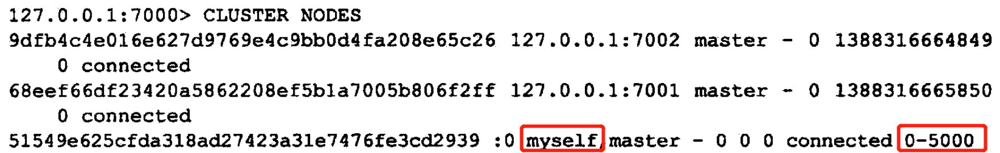
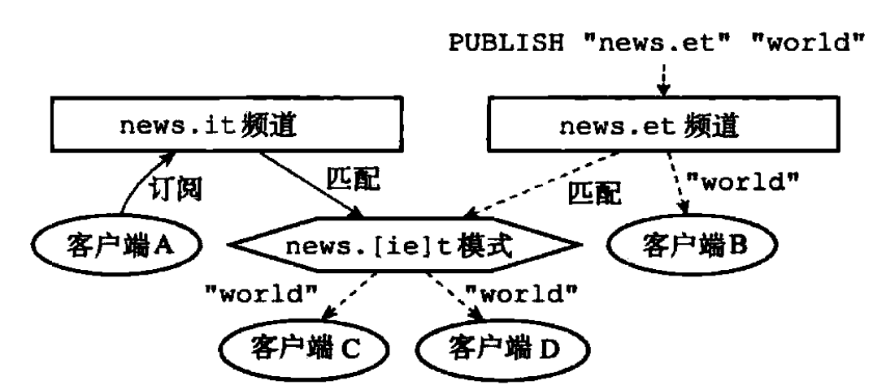

# 何为缓存

## 简介

在互联网的世界，缓存是一个绕不过的话题。 

对后端开发的同事来说，通过利用有效的多级缓存策略，就能够不用花费太多的精力，显著的提升服务的高并发性能，轻松支持上万甚至上十万的QPS访问量。

随着互联网的快速发展，需要缓存的数据指数级的提升，使用的缓存的容量越来越大。然而缓存的容量不可能无限的提升，并且大容量的缓存同时也带来了一些其他方面的问题，例如缓存的一致性同步和灾备恢复等。那么在有限容量的缓存条件下，如何尽可能的提高缓存的利用率，这就涉及到了缓存算法。

## 缓存

凡是位于速度相差较大的两种硬件之间，用于<font color='red'>协调两者数据传输速度差异的结构</font>，均可称之为缓存。

例如cpu中的寄存器，以及L1，L2，L3级缓存，以及我们非常熟悉的内存ram。这些不同缓存的存在，都是出于性能和成本的平衡妥协。

Intel Core i7 5500系列各部件的访问速度（主频2.4Ghz，一个cpu周期cycle大约0.4ns）

| 缓存                                      | 访问速度              |
| ----------------------------------------- | --------------------- |
| Register Hit                              | <= 1 cycles           |
| L1 Cache Hit                              | 4 cycles              |
| L2 Cache hit                              | 10 cycles             |
| L3 Cache hit，line unshared               | 40 cycles             |
| L3 Cache hit，shared line in another core | 65 cycles             |
| L3 Cache hit，modified in another core    | 75 cycles             |
| Local RAM                                 | 60 ns（～140cycles）  |
| Remote RAM                                | 100 ns（～240cycles） |

对于后端应用开发的同事来说，我们更熟悉的是软件意义上的缓存，例如**cdn**，nginx缓存，redis，memcache。

### 缓存命中

当用户发起一个请求，服务端应用接受这个请求。

如果在缓存中数据对象被查询到，那么就缓存命中。

如果没有命中缓存，就需要从后端获取原始数据，这个步骤叫做“<font color='red'>回源</font>”。
缓存的命中率是非常重要的指标，因为回源的代价是高昂的，所以需要尽可能命中缓存，减少回源，充分的发挥缓存的作用。


### 缓存淘汰

当缓存的空间仍然有空闲，没有命中的对象会被存储到缓存中来。

但是如果缓存满了，而又没有命中缓存，那么就会按照某一种策略，把缓存中的旧对象踢出，而把新的对象加入缓存。
这些策略统称为淘汰策略（缓存算法），会决定应该从缓存中踢出哪些数据对象。

### 2.3 缓存刷新

当存在缓存中的数据过期或者失效时，需要更新数据对象，这个操作过程称之为缓存刷新。

在分布式系统中，还需要保证缓存数据的一致性。

### 2.4 缓存雪崩

缓存雪崩，是指在某一个时间段，缓存大量未命中，类似于缓存被击穿，大量的数据需要从后端读取，对后端服务产生瞬间的压力负载，严重时直接压垮。

可能是大量恶意攻击，<font color='red'>查询不存在的数据</font>。

也可能是在某一时刻，<font color='red'>缓存大量同时过期</font>。

### 缓存污染

缓存污染是指将不常用的数据加载到缓存中，降低了缓存的命中率。

例如突然大量偶发性的数据访问，会让缓存中存放大量冷数据，导致热点数据被踢出缓存，无法被命中。

## 缓存算法

类似于操作系统中的页面置换算法，常用的缓存算法有以下几种。

### FIFO算法 (First In First out)

先进先出算法，总是选择淘汰最先写入缓存的数据。

算法简单，正好符合队列的特性，数据结构上可以使用队列Queue来实现。

```
1：新数据进入队列，加入到队列尾部
2：队列满时淘汰队列头部的数据
```

### 3.2 LFU算法 (Least Frequently Used)

最不经常使用算法，首先被淘汰最低访问频数的数据。

LFU算法并不经常使用，因为需要使用一个计数器来记录和更新缓存中每个数据被访问的频率的引用计数，然后重新排序，内存消耗很高。

```
1：新数据进入队列（新数据块的引用计数为1），每次加入新数据时，整个队列就会重新排序
2：队列满时淘汰排序在后面的数据
3：引用计数如果相同时，根据时间先后顺序进行排列
```

[算法实现](https://zhuanlan.zhihu.com/p/311942904)

### LRU算法 (Least Recently Used)

最近最少使用算法，首先被淘最近最少访问的数据。

LRU缓存算法以及它的一系列优化算法是常用的缓存算法，也可以用队列来实现。

最基础的是LRU-1算法，即最近使用过1次

```
1：新数据进入队列，插入到队列的头部
2：队列空间满了的时候，尾部的数据会被淘汰掉
3：如果要访问的数据已经在缓存中，该数据会被重新移动到队列的头部
```

#### LRU-K算法

LRU-K中的K代表最近使用的次数。

主要目的是为了解决LRU算法“缓存污染”的问题，其核心思想是将“最近使用过1次”的判断标准扩展为“最近使用过K次”。

LRU-K需要同时维护<font color='red'>缓存队列</font>和<font color='red'>历史队列</font>，其中历史队列用于记录所有缓存数据被访问的历史频率。只有当历史队列中数据的访问次数达到K次的时候，才将数据放入缓存队列中。当需要淘汰数据时，LRU-K会淘汰第K次访问时间距当前时间最大的数据。

```
1：新数据加入到访问历史队列
2：如果数据在访问历史列表里后没有达到K次访问，则按照一定规则（FIFO，LRU，LFU）淘汰；
3：当访问历史队列中的数据访问次数达到K次后，将数据索引从历史队列删除，将数据移到缓存队列中，并缓存此数据，缓存队列重新按照时间排序
4：缓存数据队列中被再次访问后，重新排序
5：需要淘汰数据时，淘汰缓存队列中排在末尾的数据，即淘汰“倒数第K次访问离现在最久”的数据
```

LRU-K具有LRU的优点，主要目的：解决LRU算法“缓存污染”的问题，实际应用中LRU-2是综合各种因素后最优的选择，LRU-3或者更大的K值命中率会高，但适应性差，需要大量的数据访问才能将历史访问记录清除掉

#### Two Queues (2Q)

2Q算法类似于LRU-2。

2Q算法有两个缓存队列，一个是FIFO队列，一个是LRU队列，将LRU-2算法中的访问历史队列改为了一个FIFO缓存队列。

```
1. 新数据加入到FIFO队列
2. 数据第二次被访问时，则将数据从FIFO队列移到LRU队列里面
3. 两个队列各自按照自己的方法淘汰数据
```

#### Multi Queue (MQ)

MQ算法根据访问频率将数据划分为多个队列，不同的队列具有不同的访问优先级，其核心思想是：优先缓存访问次数多的数据。

详细的算法结构图如下，Q0，Q1...Qk代表不同的优先级队列，Q-history代表从缓存中淘汰数据，但记录了数据的索引和引用次数的队列

```
1. 新数据放入Q0队列
2. 每个队列按照LRU进行管理
3. 当数据的访问次数达到一定次数，需要提升优先级时，将数据从当前队列中删除，加入到高一级队列的头部
4. 为了防止高优先级数据永远不会被淘汰，当数据在指定的时间里没有被访问时，需要降低优先级，将数据从当前队列删除，加入到低一级队列头部
5. 需要淘汰数据时，从最低一级队列开始按照LRU淘汰，每个队列淘汰数据时，将数据从缓存中删除，将数据索引加入低一级队列头部
```

#### LRU算法对比

| 对比点 | 对比                      |
| ------ | ------------------------- |
| 命中率 | LRU-2 > MQ(2) > 2Q > LRU  |
| 复杂度 | LRU-2 > MQ(2) > 2Q > LRU  |
| 代价   | LRU-2  > MQ(2) > 2Q > LRU |

### Adjustable Replacement Cache (ARC)

标准的LRU淘汰算法无法适应<font color='red'>扫描式的数据访问</font>，容易产生缓存污染。

当顺序读取大量数据时，缓存空间会很快被写满，即使它们可能只会被访问一次。

当缓存空间满了之后，再向缓存写入新的数据，将会淘汰最近最少被使用的数据。从而发生不断的写入新的数据，淘汰老的数据，缓存不断的被刷新，只缓存最近被访问的数据，而不会缓存经常被访问的热点数据，缓存被污染了，命中率严重下降。

因此IBM和Sun公司的ZFS中扩展实现实现了一种ARC算法用以解决LRU算法的缺点。

####  ARC的内部工作原理

ARC算法的通过4个队列实现：

```
1. 最近最少使用的数据队列（LRU list）
2. 最不经常使用的数据队列（LFU list）
3. 从最近最少使用的数据队列中淘汰的数据（Ghost list for LRU）
4. 从最不经常使用的数据队列中淘汰的数据（Ghost list for LFU）
```

工作流程

```
1. 新数据插入到LRU队列首部
2. 数据再次被访问，将会被插入到LFU队列首部
3. LFU队列中的数据再次被访问，会重新插入到LFU队列首部
4. 缓存容量达到上限时，会选择从LRU队列或者LFU队列中淘汰数据
5. 假设LRU队列已满，队列尾部数据将被淘汰，数据会被放进LRU ghost队列中
6. 如果LRU ghost队列也满了，也会淘汰队列尾部数据
7. 假设数据在被从LRU ghost队列中淘汰之前，被再一次访问了，说明LRU缓存太小，需要增大LRU队列，减少LFU队列
8. 同样的机制5-7适用于LFU队列和LFU ghost队列
```

ARC算法将最近被访问的数据被存储在LRU队列中，经常被访问的热点数据被存储在LFU队列中，通过LRU ghost和LFU ghost的协助来动态调整LRU队列和LFU队列大小，用以适应不同环境下的workload，<font color='red'>尽可能在有限的缓存容量下提高缓存命中率和避免缓存污染</font>。


### 总结

1. LRU缓存对热点数据比较敏感，缓存容量较小时，随机访问命中率很低，各种优化算法影响不大

2. 缓存大小相同的情况下，热点数据访问的命中率和性能比较如下

| 对比点    | 对比             |
| --------- | ---------------- |
| hit%      | ARC > 2Q > LRU   |
| ns/op     | ARC > 2Q > LRU   |
| allocs/op | ARC >= 2Q >= LRU |

 3.缓存大小不同下的命中率和性能比较如下

| 对比点    | 对比                                      |
| --------- | ----------------------------------------- |
| hit%      | 100%cache > 50%cache > 25%cache           |
| ns/op     | 100%cache < 50%cache < 25%cache           |
| allocs/op | 100%cache < 50%cache < 25%cache（看不懂） |

4. 在实际的生产环境中，可以根据实际情况，选择合适的缓存大小和算法


# 使用缓存的场景

对于缓存来说，数据不常变更且查询比较频繁是最好的场景，如果查询量不够大或者数据变动太频繁，缓存也就是失去了意义。

**内部缓存与外部缓存**

日常工作使用的缓存可以分为**内部缓存**和**外部缓存**。

- 内部缓存一般是指存放在运行实例内部并使用实例内存的缓存，这种缓存可以使用代码直接访问。 

- 外部缓存一般是指存放在运行实例外部的缓存，通常是通过网络获取，反序列化后进行访问。 

一般来说对于不需要实例间同步的，都更加推荐内部缓存，因为内部缓存有访问方便，性能好的特点；需要实例间同步的数据可以使用外部缓存。

下面对这两种类型的缓存分别的进行介绍。

## 内部缓存

#### 为什么要是用内部缓存

在系统中，有些数据量不大、不常变化，但是访问十分频繁，例如省、市、区数据。针对这种场景，可以将数据加载到应用的内存中，以提升系统的访问效率，减少无谓的数据库和网路的访问。

内部缓存的限制就是存放的数据总量不能超出内存容量，毕竟还是在 JVM 里的。

#### 最简单的内部缓存 - Map

如果只是需要将一些数据缓存起来，避免不必要的数据库查询，那么 Map 就可以满足。

对于字典型的数据，在项目启动的时候加载到 Map 中，程序就可以使用了，也很容易更新。

```java
// 配置存放的Map
Map<String, String> configs = new HashMap<String, String>();
// 初始化或者刷新配置的Map
public void reloadConfigs() {
    Map<String, String> m = loadConfigFromDB();
    configs = m;
}
// 使用configs.getOrDefault("auth.id", "1");
```

#### 功能强大的内部缓存 - Guava Cache / Caffeine

如果你需要缓存有强大的性能，或者对缓存有更多的控制，可以使用 Guava 里的 Cache 组件。

它是 Guava 中的缓存工具包，是非常简单易用且功能强大的 JVM 内缓存，支持多种缓存过期策略。。

```java
LoadingCache<String, String> configs = CacheBuilder.newBuilder().maximumSize(1000) // 设置最大大小
        .expireAfterWrite(10, TimeUnit.MINUTES) // 设置过期时间， 10分钟
        .build(
            new CacheLoader<String, String>() {
            // 加载缓存内容
                public String load(String key) throws Exception {
                    return getConfigFromDB(key);
                }
                public Map<String, String> loadAll() throws Exception {
                	return loadConfigFromDB();
            	}
       	 	}
    	});
        //CacheLoader.loadAll// 获取某个key的值
        try {
        	return configs.get(key);
        } catch (ExecutionException e) {
       		 throw new OtherException(e.getCause());    
       	}   
        // 显式的放入缓存    configs.put(key, value)   
        // 个别清除缓存      configs.invalidate(key)   
        // 批量清除缓存      configs.invalidateAll(keys)   
        // 清除所有缓存项    configs.invalidateAll()
```

本地缓存的<font color='red'>优点</font>：

- 直接使用内存，速度快，通常存取的性能可以达到每秒千万级
- 可以直接使用 Java 对象存取

本地缓存的<font color='red'>缺点</font>：

- 数据保存在当前实例中，无法共享
- 重启应用会丢失

##### Guava Cache 的替代者 Caffeine

Spring 5 使用 Caffeine 来代替 Guava Cache，应该是从性能的角度考虑的。从很多性能测试来看 Caffeine 各方面的性能都要比 Guava 要好。

Caffeine 的 API 的操作功能和 Guava 是基本保持一致的，并且 Caffeine 为了兼容之前 Guava 的用户，做了一个 Guava 的 Adapter， 也是十分的贴心

## 外部缓存

#### 最著名的外部缓存 - Redis / Memcached

也许是 Redis 太有名，只要一提到缓存，基本上都会说起 Redis。但其实这类缓存的鼻祖应该是 LiveJournal 开发的 Memcached。

Redis / Memcached 都是使用内存作为存储，所以性能上要比数据库要好很多，再加上Redis 还支持很多种数据结构，使用起来也挺方便，所以作为很多人的首选。

<font color='blue'>Redis 确实不错，不过即便是使用内存，也还是需要通过网络来访问，所以网络的性能决定了 Reids 的性能；</font>

我曾经做过一些性能测试，在万兆网卡的情况下，对于 Key 和 Value 都是长度为 20 Byte 的字符串的 get 和 set 是每秒10w左右的，如果 Key 或者 Value 的长度更大或者使用数据结构，这个会更慢一些；

作为一般的系统来使用已经绰绰有余了，从目前来看，Redis 确实很适合来做系统中的缓存。

# Redis 可以用来做什么？

Redis 是互联网技术领域使用最为广泛的存储中间件，它是「**Re**mote **Di**ctionary **S**ervice」的首字母缩写，也就是「远程字典服务」。Redis 以其超高的性能、完美的文档、简洁易懂的源码和丰富的客户端库支持在开源中间件领域广受好评。国内外很多大型互联网公司都在使用 Redis，比如 Twitter、暴雪娱乐、Github、StackOverflow、腾讯、阿里、京东、华为、新浪微博等等，很多中小型公司也都有应用。也可以说，对 Redis 的了解和应用实践已成为当下中高级后端开发者绕不开的必备技能。

# Redis 基础数据结构

Redis 有 5 种基础数据结构，分别为：**string (字符串)、list (列表)、set (集合)、hash (哈希) 和 zset (有序集合)**。熟练掌握这 5 种基本数据结构的使用是 Redis 知识最基础也最重要的部分。

redis在线练习：https://try.redis.io/

redis命令参考：http://doc.redisfans.com/

## string (字符串)

字符串 string 是 Redis 最简单的数据结构。Redis 所有的数据结构都是以<font color='red'>唯一的 key 字符串</font>作为名称，然后通过这个唯一 key 值来获取相应的 value 数据。不同类型的数据结构的差异就在于 value 的结构不一样。

字符串结构使用非常广泛，一个常见的用途就是缓存用户信息。我们将用户信息结构体使用 JSON **序列化**成字符串，然后将序列化后的字符串塞进 Redis 来缓存。同样，取用户信息会经过一次**反序列化**的过程。

### string底层实现

Redis 的字符串是<font color='red'>动态字符串</font>(SDS,simple dynamic string)，是可以修改的字符串;

SDS采用预分配冗余空间的方式来减少内存的频繁分配，内部为当前字符串实际分配的空间 一般要高于实际字符串长度 len。

> 当字符串长度小于 1M 时，扩容都是加倍现有的空间，
>
> 如果超过 1M，扩容时一次只会多扩 1M 的空间。需要注意的是字符串最大长度为 512M

**SDS与C字符串区别**

1. 常数复杂度获取字符串长度

2. 杜绝缓冲区溢出

   > 当SDS的API对SDS进行修改时,API会先检查SDS的空间是否满足修改,不满足则扩展SDS空间.

3. 减少字符串修改带来的内存重分配次数.

   > SDS通过**未使用空间**解除了字符串长度和底层数组长度的关联
   >
   > 增加:空间预分配策略
   > 缩短:惰性空间释放

4. 二进制安全

   > C字符串不能包括空字符,而SDS使用len判断字符串结束,可保存空字符.

### redis中string操作

**键值对**

```bash
> set name codehole
OK
> get name
"codehole"
> exists name
(integer) 1
> del name
(integer) 1
> get name
(nil)
```

**批量键值对**

可以批量对多个字符串进行读写，节省网络耗时开销。

```bash
> set name1 codehole
OK
> set name2 holycoder
OK
> mget name1 name2 name3 # 返回一个列表
1) "codehole"
2) "holycoder"
3) (nil)
> mset name1 boy name2 girl name3 unknown
> mget name1 name2 name3
1) "boy"
2) "girl"
3) "unknown"
```

**过期和 set 命令扩展**

可以对 key 设置过期时间，到点自动删除，这个功能常用来控制缓存的失效时间。

```bash
> set name codehole
> get name
"codehole"
> expire name 5  # 5s 后过期
...  # wait for 5s
> get name
(nil)

> setex name 5 codehole  # 5s 后过期，等价于 set+expire
> get name
"codehole"
... # wait for 5s
> get name
(nil)

> setnx name codehole  # 如果 name 不存在就执行 set 创建
(integer) 1
> get name
"codehole"
> setnx name holycoder
(integer) 0  # 因为 name 已经存在，所以 set 创建不成功
> get name
"codehole"  # 没有改变
```

**计数**

如果 value 值是一个整数，还可以对它进行自增操作。自增是有范围的，它的范围是 signed long 的最大最小值，超过了这个值，Redis 会报错。

```bash
> set age 30
OK
> incr age
(integer) 31
> incrby age 5
(integer) 36
> incrby age -5
(integer) 31
> set codehole 9223372036854775807  # Long.Max
OK
> incr codehole
(error) ERR increment or decrement would overflow
```

### bitmap

字符串是由多个字节组成，每个字节又是由 8 个 bit 组成，如此便可以将一个字符串看成很多 bit 的组合，这便是 bitmap「位图」数据结构

在我们平时开发过程中，会有一些 bool 型数据需要存取，比如用户一年的签到记录，签了是 1，没签是 0，要记录 365 天。如果使用普通的 key/value，每个用户要记录 365 个，当用户上亿的时候，需要的存储空间是惊人的。

为了解决这个问题，Redis 提供了位图数据结构，这样每天的签到记录只占据一个位，365 天就是 365 个位，46 个字节 (一个稍长一点的字符串) 就可以完全容纳下，这就**大大节约了存储空间**。

位图不是特殊的数据结构，它的内容其实就是普通的字符串，也就是 **byte 数组**。我们可以使用普通的 get/set 直接获取和设置整个位图的内容，也可以使用位图操作 getbit/setbit 等将 byte 数组看成「位数组」来处理。

```bash
GETBIT key offset #获取第offset位的bit，不存的的比特位返回0。
SETBIT key offset value #给第offset位设置成value。
BITCOUNT key [start] [end] #计算key中1的个数。
BITOP operation destkey key [key] #执行位操作，位操作包含与(AND)、或(OR)、异或(XOR)以及 非(NOT)。
BITPOS key value [start] [end] #查询key中第一次出现value的位置，start和end表示字符的开始和结束位置。
```

## list (列表)

Redis 的列表相当于 Java 语言里面的 LinkedList，注意它**是链表而不是数组**。这意味着 list 的插入和删除操作非常快，时间复杂度为 O(1)，但是索引定位很慢，时间复杂度为 O(n)。

当列表**弹出了最后一个元素之后**，该数据结构自动被删除，内存被回收。

Redis 的列表结构常用来做异步队列使用。将需要延后处理的任务结构体序列化成字符串塞进 Redis 的列表，另一个线程从这个列表中轮询数据进行处理。

**右边进左边出：队列**

```bash
> rpush books python java golang
(integer) 3
> llen books
(integer) 3
> lpop books
"python"
> lpop books
"java"
> lpop books
"golang"
> lpop books
(nil)
```

**右边进右边出：栈**

```bash
> rpush books python java golang
(integer) 3
> rpop books
"golang"
> rpop books
"java"
> rpop books
"python"
> rpop books
(nil)
```

**慢操作**

lindex 相当于 Java 链表的`get(int index)`方法，它需要对链表进行遍历，性能随着参数`index`增大而变差。

ltrim 和字面上的含义不太一样，个人觉得它叫 lretain(保留) 更合适一些，因为 ltrim 跟的两个参数`start_index`和`end_index`定义了一个区间，在这个区间内的值，ltrim 要保留，区间之外统统砍掉。我们可以通过ltrim来实现一个定长的链表，这一点非常有用。

index 可以为负数，`index=-1`表示倒数第一个元素，同样`index=-2`表示倒数第二个元素。

```bash
> rpush books python java golang
(integer) 3
> lindex books 1  # O(n) 慎用
"java"
> lrange books 0 -1  # 获取所有元素，O(n) 慎用
1) "python"
2) "java"
3) "golang"
> ltrim books 1 -1 # O(n) 慎用
OK
> lrange books 0 -1
1) "java"
2) "golang"
> ltrim books 1 0 # 这其实是清空了整个列表，因为区间范围长度为负
OK
> llen books
(integer) 0
```

### 早期列表

Redis 早期版本存储 list 列表数据结构使用的是压缩列表 ziplist 和普通的双向链表 linkedlist

> 也就是元素少时用 ziplist，元素多时用 linkedlist。

#### ziplist

在列表元素较少的情况下会使用一块连续的内存存储，这个结构是 `ziplist`(压缩列表)。它将所有的元素紧挨着一起存储，分配的是一块连续的内存。

**ziplist结构**


**entry结构**


entry节点没有保存前后节点指针

> previous_entry_length记录了上一entry的长度,用于获取上一entry的数据
>
> - 如果前一节点的长度小于254字节，那么previous_entry__length属性的长度为1字节：前一节点的长度就保存在这一字节里面
> - 如果前一节点的长度大于等于254字节，那么previous_entry__length属性的长度为5字节：其属性的第一字节会被设置为0xFE（十进制254），而之后的四个字节长度则用于保存前一节点的长度。
>
> encoding记录了content所保存数据的类型(<font color='red'>字节数组和整数</font>)与长度,用于获取下一entry的数据

**[连锁更新](https://blog.csdn.net/weixin_45729809/article/details/123789656)**

新增引起的连锁更新.

> ziplist使用头插法插入新数据
> 如果每个entry的previous_entry_length属性仅1个字节,且每个entry的长度为[250,253]
> 如果新增的数据长度>=254,entry1的previous_entry_length属性需要扩大到5个字节,这会导致每个entry都需要更新其previous_entry_length值

删除也可能引发连锁更新.

连锁更新性能分析

> 连锁更新<font color='red'>最坏的时间复杂度O(N<sup>2</sup>)</font>,最多N次空间重分配,每次空间重分配时间复杂度O(N)
> 连锁更新触发条件苛刻,删除和更新的<font color='red'>平均时间复杂度为O(N)</font>

#### list

当数据量比较多的时使用普通的链表，但链表的附加指针空间太大，会比较浪费空间。

```c
// 链表的节点
struct listNode<T> {
    listNode* prev;
    listNode* next;
    T value;
}
// 链表
struct list {
    listNode *head;
    listNode *tail;
    long length;
}
```

### ziplist对比linkedlist

**ziplist的优点**

> 普通的双向链表，会有两个指针，在存储数据很小的情况下，存储的实际数据的大小可能还没有指针占用的内存大.而且Redis常驻内存的，内存是弥足珍贵的,数据量较小时采用ziplist.
>
> 链表在内存中，一般是不连续的，遍历相对比较慢，而ziplist连续内存可提高遍历效率.

**ziplist的缺点**

> ziplist是紧凑存储，没有冗余空间，插入元素就需要扩展内存，这就分为两种情况：
>
> ​	1) 分配新的内存，将原数据拷贝到新内存；
>
> ​	2) 扩展原有内存。
>
> 所以ziplist 不适合存储大型字符串，存储的元素也不宜过多

**[ziplist转为linkedlist的条件](https://zhuanlan.zhihu.com/p/102422311)**

创建新列表时 redis 默认使用 redis_encoding_ziplist 编码， 当以下任意一个条件被满足时， 列表会被转换成 redis_encoding_linkedlist 编码：

> 试图往列表新添加一个字符串值，且这个字符串的长度超过 server.list_max_ziplist_value （默认值为 64 ）。
> ziplist 包含的节点超过 server.list_max_ziplist_entries （默认值为 512 ）。

这两个条件是可以修改的，在 redis.conf 中：

> list-max-ziplist-value 64 
> list-max-ziplist-entries 512 

### 快速列表

考虑到链表的附加空间相对太高，prev 和 next 指针就要占去 16 个字节 (64bit 系统的指针是 8 个字节)，另外每个节点的内存都是单独分配，会加剧内存的碎片化，影响内存管理效率。后续版本对列表数据结构进行了改造，使用 quicklist 代替了 ziplist 和 linkedlist。

quicklist 是 ziplist 和 linkedlist 的混合体，它将 linkedlist 按段切分，每一段使用 ziplist 来紧凑存储，多个 ziplist 之间使用双向指针串接起来。

```c
struct quicklistNode {
    quicklistNode* prev;
    quicklistNode* next;
    ziplist* zl; // 指向压缩列表
    int32 size; // ziplist 的字节总数
    int16 count; // ziplist 中的元素数量
    int2 encoding; // 存储形式 2bit，原生字节数组还是 LZF 压缩存储
    ...
}
struct quicklist {
    quicklistNode* head;
    quicklistNode* tail;
    long count; // 元素总数
    int nodes; // ziplist 节点的个数
    int compressDepth; // LZF 算法压缩深度
    ...
}
```

上述代码简单地表示了 quicklist 的大致结构。为了进一步节约空间，Redis 还会对 ziplist 进行压缩存储，使用 **LZF 算法**压缩，可以选择压缩深度。quicklist 内部默认单个 ziplist 长度为 8k 字节，超出了这个字节数，就会新起一个 ziplist。ziplist 的长度由配置参数`list-max-ziplist-size`决定。

### list运用--延时队列

我们平时习惯于使用 Rabbit-MQ 和 Kafka 作为消息队列中间件，来给应用程序之间增加异步消息传递功能。这两个中间件都是专业的消息队列中间件，特性之多超出了大多数人的理解能力。

使用过 Rabbit-MQ  的同事知道它使用起来有多复杂，发消息之前要创建 Exchange，再创建 Queue，还要将 Queue 和 Exchange 通过某种规则绑定起来，发消息的时候要指定 routing-key，还要控制头部信息。消费者在消费消息之前也要进行上面一系列的繁琐过程。但是绝大多数情况下，虽然我们的消息队列只有一组消费者，但还是需要经历上面这些繁琐的过程。

有了 Redis，它就可以让我们解脱出来，对于那些只有一组消费者的消息队列，使用 Redis 就可以非常轻松的搞定。Redis 的消息队列不是专业的消息队列，它没有非常多的高级特性，<font color='red'>没有 ack 保证</font>，如果对消息的可靠性有着极致的追求，那么它就不适合使用。

#### 异步消息队列

Redis 的 list(列表) 数据结构常用来作为异步消息队列使用，使用`rpush/lpush`操作入队列，使用`lpop 和 rpop`来出队列。

#### 队列空了怎么办？

客户端是通过队列的 pop 操作来获取消息，然后进行处理。处理完了再接着获取消息，再进行处理。如此循环往复，这便是作为队列消费者的客户端的生命周期。

可是如果队列空了，客户端就会陷入 pop 的死循环，不停地 pop，没有数据，接着再 pop，又没有数据。这就是浪费生命的空轮询。空轮询不但拉高了客户端的 CPU，redis 的 QPS 也会被拉高，如果这样空轮询的客户端有几十来个，Redis 的慢查询可能会显著增多。

通常我们使用 sleep 来解决这个问题，让线程睡一会，睡个 1s 钟就可以了。不但客户端的 CPU 能降下来，Redis 的 QPS 也降下来了。

```
time.sleep(1)  # python 睡 1s
Thread.sleep(1000)  # java 睡 1s
```

#### 队列延迟

用上面睡眠的办法可以解决问题。但是有个小问题，那就是睡眠会导致消息的延迟增大。如果只有 1 个消费者，那么这个延迟就是 1s。如果有多个消费者，这个延迟会有所下降，因为每个消费者的睡觉时间是岔开来的。

有没有什么办法能显著降低延迟呢？那就把睡觉的时间缩短点。这种方式当然可以，有更好的解决方案，那就是 **blpop/brpop**。

这两个指令的前缀字符`b`代表的是`blocking`，也就是**阻塞读**。

阻塞读在队列没有数据的时候，会立即进入休眠状态，一旦数据到来，则立刻醒过来。消息的延迟几乎为零。用`blpop/brpop`替代前面的`lpop/rpop`，就完美解决了上面的问题。

#### 空闲连接自动断开

如果线程一直阻塞在哪里，Redis 的客户端连接就成了闲置连接，闲置过久，服务器一般会主动断开连接，减少闲置资源占用。这个时候`blpop/brpop`会抛出异常来。

所以编写客户端消费者的时候要小心，注意捕获异常，还要重试。

## hash (字典)

Redis 的字典相当于 Java 语言里面的 HashMap，它是无序字典。内部实现结构上同 Java 的 HashMap 也是一致的，同样的**数组 + 链表二维结构**。第一维 hash 的数组位置碰撞时，就会将碰撞的元素使用链表串接起来。

### hash的底层实现

**hash表**


**hash表节点**


**hash表结构图**


**redis字典**


ht[0]用于存储数据,ht[1]用于rehash时临时存储数据.

### rehash操作

随着操作不断执行,hash表保存的键值对会增加或减少.为保证<font color='red'>负载因子</font>在一个合理范围,需要对hash表进行扩展或收缩.

**hash表的扩展和收缩的触发**

扩展

> 未在BGSAVE或BGREWRITEAOF时:负载因子≥1
>
> BGSAVE或BGREWRITEAOF时:负载因子≥5

收缩

> 负载因子＜0.1

**rehash**

1. 为ht[1]分配空间,具体计算如下:

   > 扩张:≥ht[0].used\*2的最小二次幂
   > 收缩:≥ht[0].used的最小二次幂

2. 将ht[0]所有值rehash到ht[1]
3. 释放ht[0],将ht[1]设置为ht[0],新建空白ht[1]

**渐进式rehash**

Redis 为了高性能，不能堵塞服务，所以采用了<font color='red'>渐进式 rehash</font> 策略。

渐进式 rehash 会在 rehash 的同时，保留新旧两个 hash 结构，查询时会<font color='red'>同时查询两个 hash 结构</font>，然后在后续的定时任务中以及 hash 操作指令中，循序渐进地将旧 hash 的内容一点点迁移到新的 hash 结构中。当搬迁完成了，就会使用新的hash结构取而代之。

以下是哈希表渐进式 rehash 的详细步骤：

> （1）为 ht[1] 分配空间， 让字典同时持有 ht[0] 和 ht[1] 两个哈希表。
>
> （2）在字典中维持一个索引计数器变量 <font color='red'>rehashidx</font> ， 并将它的值设置为 0 ， 表示 rehash 工作正式开始。
>
> （3）在 rehash 进行期间， 每次对字典执行添加、删除、查找或者更新操作时， 程序除了执行指定的操作以外， 还会顺带将 ht[0] 哈希表在 rehashidx 索引上的所有键值对 rehash 到 ht[1] ， 当 rehash 工作完成之后， 程序将 rehashidx 属性的值增1。
>
> （4）随着字典操作的不断执行， 最终在某个时间点上， ht[0] 的所有键值对都会被 rehash 至 ht[1] ， 这时程序将 rehashidx 属性的值设为 -1 ， 表示 rehash 操作已完成。
>

渐进式 rehash 的好处在于它采取分而治之的方式， 将 rehash 键值对所需的计算工作<font color='red'>均摊</font>到对字典的每个添加、删除、查找和更新操作上， 从而避免了集中式 rehash 而带来的庞大计算量

当 hash 移除了最后一个元素之后，该数据结构自动被删除，内存被回收。

<font color='red'>注意:</font>

> 渐进式rehash时,删除/查找/更新都会在ht[0]和ht[1]进行.
>
> 查找优先在ht[0]上进行,若找不到,则到ht[1]继续查找
>
> 新增操作只在ht[1]上进行

### redis的hash操作

hash 结构也可以用来存储用户信息，不同于字符串一次性需要全部序列化整个对象，hash 可以对用户结构中的每个字段单独存储。这样当我们需要获取用户信息时可以进行部分获取。而以整个字符串的形式去保存用户信息的话就只能一次性全部读取，这样就会比较浪费网络流量。

hash 也有缺点，hash 结构的存储消耗要高于单个字符串，到底该使用 hash 还是字符串，需要根据实际情况再三权衡。

```bash
> hset books java "think in java"  # 命令行的字符串如果包含空格，要用引号括起来
(integer) 1
> hset books golang "concurrency in go"
(integer) 1
> hset books python "python cookbook"
(integer) 1
> hgetall books  # entries()，key 和 value 间隔出现
1) "java"
2) "think in java"
3) "golang"
4) "concurrency in go"
5) "python"
6) "python cookbook"
> hlen books
(integer) 3
> hget books java
"think in java"
> hset books golang "learning go programming"  # 因为是更新操作，所以返回 0
(integer) 0
> hget books golang
"learning go programming"
> hmset books java "effective java" python "learning python" golang "modern golang programming"  # 批量 set
OK
```

同字符串对象一样，hash 结构中的单个子 key 也可以进行计数，它对应的指令是 `hincrby`，和 `incr` 使用基本一样。

```bash
> hincrby user-laowang age 1
(integer) 30
```

## set (集合)

Redis 的集合相当于 Java 语言里面的 HashSet，它内部的键值对是无序的唯一的。它的内部实现相当于一个特殊的字典，字典中所有的 value 都是一个值`NULL`。

<font color='red'>当集合中最后一个元素移除之后，数据结构自动删除，内存被回收</font>。

### set底层实现(以整数集合为例)

**整数集合**


**encoding**

在整数集合中,encoding为`{INTSET_ENC_INT8,INTSET_ENC_INT16,INTSET_ENC_INT32,INTSET_ENC_INT64}`之一
对应的contents数组保存的是相同数据类型的整数.

### 升级

当将一个新元素加入整数集合,并且新元素类型比原整数集合类型都要长,那么整数集合需要先升级.

**升级步骤**

1. 根据新元素类型,扩展底层数组空间大小
2. 将底层数组原有数据的类型转换为新元素类型
3. 将新元素加入底层数组
4. 更新整数数组encoding类型

**升级的好处**

1. 提升灵活性

   > 可将不同类型的整数加入整数集合,并不会出现类型错误

2. 节约内存

   > 若整数数组前期存储都为短整数类型,没必要初始就分配长数据类型

**整数数组不支持降级**

> 升级说明整数数组对长数据类型有需求.
>
> 升级过程消耗时间和空间,不能频繁进行升级.

### redis的set操作

set 结构可以用来存储活动中奖的用户 ID，因为有<font color='cornflowerblue'>去重功能</font>，可以保证同一个用户不会中奖两次。

```bash
> sadd books python
(integer) 1
> sadd books python  #  重复
(integer) 0
> sadd books java golang
(integer) 2
> smembers books  # 注意顺序，和插入的并不一致，因为 set 是无序的
1) "java"
2) "python"
3) "golang"
> sismember books java  # 查询某个 value 是否存在，相当于 contains(o)
(integer) 1
> sismember books rust
(integer) 0
> scard books  # 获取长度相当于 count()
(integer) 3
> spop books  # 弹出一个
"java"
```

## zset (有序集合)

zset 可能是 Redis 提供的最为特色的数据结构。它类似于 Java 的 SortedSet 和 HashMap 的结合体，一方面它是一个 set，保证了内部 value 的唯一性，另一方面它可以给每个 value 赋予一个 score，代表这个 value 的排序权重。它的内部实现用的是一种叫做「跳跃列表」的数据结构。

<font color='red'>zset 中最后一个 value 被移除后，数据结构自动删除，内存被回收。</font>

应用举例：

zset 可以用来存粉丝列表，value 值是粉丝的用户 ID，score 是关注时间。我们可以对粉丝列表按关注时间进行排序。

zset 还可以用来存储学生的成绩，value 值是学生的 ID，score 是他的考试成绩。我们可以对成绩按分数进行排序就可以得到他的名次。

```
> zadd books 9.0 "think in java"
(integer) 1
> zadd books 8.9 "java concurrency"
(integer) 1
> zadd books 8.6 "java cookbook"
(integer) 1
> zrange books 0 -1  # 按 score 排序列出，参数区间为排名范围
1) "java cookbook"
2) "java concurrency"
3) "think in java"
> zrevrange books 0 -1  # 按 score 逆序列出，参数区间为排名范围
1) "think in java"
2) "java concurrency"
3) "java cookbook"
> zcard books  # 相当于 count()
(integer) 3
> zscore books "java concurrency"  # 获取指定 value 的 score
"8.9000000000000004"  # 内部 score 使用 double 类型进行存储，所以存在小数点精度问题
> zrank books "java concurrency"  # 排名
(integer) 1
> zrangebyscore books 0 8.91  # 根据分值区间遍历 zset
1) "java cookbook"
2) "java concurrency"
> zrangebyscore books -inf 8.91 withscores # 根据分值区间 (-∞, 8.91] 遍历 zset，同时返回分值。inf 代表 infinite，无穷大的意思。
1) "java cookbook"
2) "8.5999999999999996"
3) "java concurrency"
4) "8.9000000000000004"
> zrem books "java concurrency"  # 删除 value
(integer) 1
> zrange books 0 -1
1) "java cookbook"
2) "think in java"
```

**跳跃列表**

zset 内部的排序功能是通过「<font color='red'>跳跃列表</font>」数据结构来实现的，它的结构非常特殊，也比较复杂。

因为 zset 要支持随机的插入和删除，所以它不适合使用数组来表示。我们先看一个普通的链表结构。	


我们需要这个链表按照 score 值进行排序。这意味着当有新元素需要插入时，要定位到特定位置的插入点，这样才可以继续保证链表是有序的。通常我们会通过二分查找来找到插入点，但是二分查找的对象必须是数组，只有数组才可以支持快速位置定位，链表做不到，那该怎么办？

### 基本结构

跳跃列表使用**层级制**，最下面一层所有的元素都会串起来。然后每隔几个元素挑选出一个代表来，再将这几个代表使用另外一级指针串起来。然后在这些代表里再挑出二级代表，再串起来。最终就形成了金字塔结构。

zset由跳跃表和字典表组成,两者通过指针共享元素的成员和分值.

> 跳跃表支持范围性操作,ZRANK,ZRANGE
> 字典表支持通过key快速获取到score

```c
typeof struct zset{
    zsl *zsl;
    dijct *dict;
} zset;
```


上图就是跳跃列表的示意图，图中只画了四层，Redis 的跳跃表共有 64 层，容纳 2^64 个元素应该不成问题。每一个 kv 块对应的结构如下面的代码中的`zslnode`结构，kv header 也是这个结构，只不过 value 字段是 null 值--无效的，score 是 Double.MIN_VALUE，用来垫底的。kv 之间使用指针串起来形成了双向链表结构，它们是 **有序** 排列的，从小到大。不同的 kv 层高可能不一样，层数越高的 kv 越少。同一层的 kv 会使用指针串起来。每一个层元素的遍历都是从 kv header 出发。

```c
struct zslnode {
  string value;
  double score;
  zslnode*[] forwards;  // 多层连接指针
  zslnode* backward;  // 回溯指针
}

struct zsl {
  zslnode* header; // 跳跃列表头指针
  int maxLevel; // 跳跃列表当前的最高层
  map<string, zslnode*> ht; // hash 结构的所有键值对
}
```

### [查找过程](https://www.cnblogs.com/yougewe/p/12253982.html)

设想如果跳跃列表只有一层会怎样？插入删除操作需要定位到相应的位置节点 (定位到最后一个比「我」小的元素，也就是第一个比「我」大的元素的前一个)，定位的效率肯定比较差，复杂度将会是 O(n)，因为需要挨个遍历。也许你会想到二分查找，但是二分查找的结构只能是有序数组。跳跃列表有了多层结构之后，这个定位的算法复杂度将会降到 O(lg(n))。


如图所示，我们要定位到那个红色圆锥的 kv，需要从 header 的最高层开始遍历找到**第一个节点 (最后一个比「我」小的元素)**，然后从这个节点开始降一层再遍历找到第二个节点 (最后一个比「我」小的元素)，然后一直降到最底层进行遍历就找到了期望的节点 (最底层的最后一个比我「小」的元素)。

我们将中间经过的一系列节点称之为**「搜索路径」**，它是从最高层一直到最底层的每一层最后一个比「我」小的元素节点列表。

有了这个搜索路径，我们就可以插入这个新节点了。不过这个插入过程也不是特别简单。因为新插入的节点到底有多少层，得有个算法来分配一下，跳跃列表使用的是随机算法。

### 随机层数

对于每一个新插入的节点，都需要调用一个随机算法给它分配一个合理的层数。直观上期望的目标是 50% 的 Level1，25% 的 Level2，12.5% 的 Level3，一直到最顶层2<sup>-63</sup>，因为这里每一层的晋升概率是 50%。

```c
/* Returns a random level for the new skiplist node we are going to create.
 * The return value of this function is between 1 and ZSKIPLIST_MAXLEVEL
 * (both inclusive), with a powerlaw-alike distribution where higher
 * levels are less likely to be returned. */
int zslRandomLevel(void) {
    int level = 1;
    while ((random()&0xFFFF) < (ZSKIPLIST_P * 0xFFFF))
        level += 1;
    return (level<ZSKIPLIST_MAXLEVEL) ? level : ZSKIPLIST_MAXLEVEL;
}
```

不过 Redis 标准源码中的晋升概率只有 <font color='red'>25%</font>，也就是代码中的 <font color='red'>ZSKIPLIST_P</font> 的值。所以官方的跳跃列表更加的扁平化，层高相对较低，在单个层上需要遍历的节点数量会稍多一点。

遍历时跳跃列表会记录一下**当前的最高层数`maxLevel`**，遍历时从这个 maxLevel 开始遍历性能就会提高很多。

### 插入过程

下面是插入过程的源码，它稍微有点长，不过整体的过程还是比较清晰的。

```c
/* Insert a new node in the skiplist. Assumes the element does not already
 * exist (up to the caller to enforce that). The skiplist takes ownership
 * of the passed SDS string 'ele'. */
zskiplistNode *zslInsert(zskiplist *zsl, double score, sds ele) {
    // 存储搜索路径
    zskiplistNode *update[ZSKIPLIST_MAXLEVEL], *x;
    // 存储经过的节点跨度
    unsigned int rank[ZSKIPLIST_MAXLEVEL];
    int i, level;

    serverAssert(!isnan(score));
    x = zsl->header;
    // 逐步降级寻找目标节点，得到「搜索路径」
    for (i = zsl->level-1; i >= 0; i--) {
        /* store rank that is crossed to reach the insert position */
        rank[i] = i == (zsl->level-1) ? 0 : rank[i+1];
        // 如果score相等，还需要比较value
        while (x->level[i].forward &&
                (x->level[i].forward->score < score ||
                    (x->level[i].forward->score == score &&
                    sdscmp(x->level[i].forward->ele,ele) < 0))){
            rank[i] += x->level[i].span;
            x = x->level[i].forward;
        }
        update[i] = x;
    }
    // 正式进入插入过程
    /* we assume the element is not already inside, since we allow duplicated
     * scores, reinserting the same element should never happen since the
     * caller of zslInsert() should test in the hash table if the element is
     * already inside or not. */
    // 随机一个层数
    level = zslRandomLevel();
    // 填充跨度
    if (level > zsl->level) {
        for (i = zsl->level; i < level; i++) {
            rank[i] = 0;
            update[i] = zsl->header;
            update[i]->level[i].span = zsl->length;
        }
        // 更新跳跃列表的层高
        zsl->level = level;
    }
    // 创建新节点
    x = zslCreateNode(level,score,ele);
    // 重排一下前向指针
    for (i = 0; i < level; i++) {
        x->level[i].forward = update[i]->level[i].forward;
        update[i]->level[i].forward = x;

        /* update span covered by update[i] as x is inserted here */
        x->level[i].span = update[i]->level[i].span - (rank[0] - rank[i]);
        update[i]->level[i].span = (rank[0] - rank[i]) + 1;
    }

    /* increment span for untouched levels */
    for (i = level; i < zsl->level; i++) {
        update[i]->level[i].span++;
    }
    // 重排一下后向指针
    x->backward = (update[0] == zsl->header) ? NULL : update[0];
    if (x->level[0].forward)
        x->level[0].forward->backward = x;
    else
        zsl->tail = x;
    zsl->length++;
    return x;
}
```

首先我们在搜索合适插入点的过程中将「搜索路径」摸出来了，然后就可以开始创建新节点了，创建的时候需要给这个节点随机分配一个层数，再将搜索路径上的节点和这个新节点通过前向后向指针串起来。如果分配的新节点的高度高于当前跳跃列表的最大高度，就需要更新一下跳跃列表的最大高度。

### 删除过程

删除过程和插入过程类似，都需先把这个「搜索路径」找出来。

对于每个层的前后节点都重排一下前向后向指针,并更新前向节点span和对应level的forward更新。

同时注意更新一下最高层数`maxLevel`。

### 更新过程

当我们调用 zadd 方法时，如果对应的 value 不存在，那就是插入过程。如果这个 value 已经存在了，只是调整一下 score 的值，那就需要走一个更新的流程。假设这个新的 score 值不会带来排序位置上的改变，那么就不需要调整位置，直接修改元素的 score 值就可以了。但是如果排序位置改变了，那就要调整位置。那该如何调整位置呢？

```java
/* Remove and re-insert when score changes. */
    if (score != curscore) {
        zskiplistNode *node;
        serverAssert(zslDelete(zs->zsl,curscore,ele,&node));
        znode = zslInsert(zs->zsl,score,node->ele);
        /* We reused the node->ele SDS string, free the node now
        * since zslInsert created a new one. */
        node->ele = NULL;
        zslFreeNode(node);
        /* Note that we did not removed the original element from
        * the hash table representing the sorted set, so we just
        * update the score. */
        dictGetVal(de) = &znode->score; /* Update score ptr. */
        *flags |= ZADD_UPDATED;
        }
    return 1;
```

**一个简单的策略就是先删除这个元素，再插入这个元素，需要经过两次路径搜索。Redis 就是这么干的**。 不过 Redis 遇到 score 值改变了就直接删除再插入，不会去判断位置是否需要调整，从这点看，Redis 的 zadd 的代码似乎还有优化空间。关于这一点，读者们可以继续讨论。

### 增删改查的操作异同

增加与删除需要获取到增删节点所有层级的前序节点,并保存到update[]中,需要逐个更新对应的span和.

查询与修改只需要获取到操作节点即可.

### 如果 score 值都一样呢？

在一个极端的情况下，zset 中所有的 score 值都是一样的，zset 的查找性能会退化为 O(n) 么？Redis 作者自然考虑到了这一点，所以 zset 的排序元素不只看 score 值，<font color='red'>如果 score 值相同还需要再比较 value 值</font> (字符串比较)。

### 元素排名是怎么算出来的？

有一个重要的属性没有提到，那就是 zset 可以获取元素的排名 rank。那这个 rank 是如何算出来的？如果仅仅使用上面的结构，rank 是不能算出来的。Redis 在 skiplist 的 forward 指针上进行了优化，给每一个 forward 指针都增加了 **span 属性**，span 是「跨度」的意思，表示从当前层的当前节点沿着 forward 指针跳到下一个节点中间跳过多少个节点。Redis 在插入删除操作时会小心翼翼地更新 span 值的大小。

```c
struct zslforward {
  zslnode* item;
  long span;  // 跨度
}

struct zslnode {
  String value;
  double score;
  zslforward*[] forwards;  // 多层连接指针
  zslnode* backward;  // 回溯指针
}
```

这样当我们要计算一个元素的排名时，只需要将「搜索路径」上的经过的所有节点的跨度 span 值进行叠加就可以算出元素的最终 rank 值。

延时队列可以通过 Redis 的 zset(有序列表) 来实现。我们将消息序列化成一个字符串作为 zset 的`value`，这个消息的到期处理时间作为`score`。

## 容器型数据结构的通用规则

list/set/hash/zset 这四种数据结构是容器型数据结构，它们共享下面两条通用规则：

1. create if not exists

   如果容器不存在，那就创建一个，再进行操作。比如 rpush 操作刚开始是没有列表的，Redis 就会自动创建一个，然后再 rpush 进去新元素。

2. drop if no elements

   如果容器里元素没有了，那么立即删除元素，释放内存。这意味着 lpop 操作到最后一个元素，列表就消失了。

## 过期时间

Redis 所有的数据结构都可以设置过期时间，时间到了，Redis 会自动删除相应的对象。需要注意的是过期是以对象为单位，比如一个 hash 结构的过期是整个 hash 对象的过期，而不是其中的某个子 key。

还有一个需要特别注意的地方是如果一个字符串已经设置了过期时间，然后你<font color='red'>调用了 set 方法修改了它，它的过期时间会消失</font>。

```
127.0.0.1:6379> set codehole yoyo
OK
127.0.0.1:6379> expire codehole 600
(integer) 1
127.0.0.1:6379> ttl codehole
(integer) 597
127.0.0.1:6379> set codehole yoyo
OK
127.0.0.1:6379> ttl codehole
(integer) -1
```

## Redis对象

### 对象的通用属性(5个)

type(类型),encoding(编码),ptr(指针),refcount(引用计数),lru(空转时长)

### 对象的类型与编码

使用`TYPE`命令查询键对应值的对象类型


使用`OBJECT ENCODING`命令查询键对应值的对象编码(下图包含了转换条件)


### 类型检查与命令多态

**类型检查**

某些命令可以对任意类型执行,如`DEL`,`RENAME`,`OBJECT ENCODING`,`EXPIRE`等

某些命令只能对特定的对象类型,特定的编码类型执行:

> 执行特定命令时,会首先检查数据库的值对象是否符合命令要求

**多态**

命令会根据值对象的类型和编码方式,选择正确的命令来执行.

类型多态:

> DEL,RENAME等能对多种类型对象执行的命令

编码多态:

> LLen仅能对列表进行操作,但能同时对ziplist和linkedlist操作.

**内存回收**

redis采用引用计数的方式实现内存回收.

使用`OBJECT REFCOUNT`命令查看键对应的值对象的引用计数(<font color='red'>引用计数器需要占用一个引用计数</font>)

**对象共享**

共享对象不仅只有字符串对象可使用,嵌套了字符串对象的数据结构也可以使用.

redis默认共享0-9999的字符串(redis.h/REDIS_SHARED_INTEGERS)

**对象空转时长**

使用`OBJECT IDLETIME`命令可查询对象的空转时长lru,并不改变对象的lru.

> ttl,get都会设置对象的lru为0

# Redis——数据库

## 服务器中的数据库

**数据库个数**

初始化服务器时,程序会根据配置的dnum值创建数据库(默认16个),数据库保留在服务器状态redisServer中.

```c
struct redisServer{
	//...
	redisDb *db;
	//...
};
```

**切换数据库**

使用`SELECT`命令切换数据库,默认在0号数据库.

客户端状态redisClient保留了正在操作的数据库,但redis无返回客户端目标数据库的命令(虽然在<font color='cornflowerblue'>输入符旁提示</font>).

```c
typeof struct redisClient{
	//...
	redisDb *db;
	//...
}redisClient;
```

## 数据库对键的操作

**数据库键空间**

redisDb结构中的dict字典保存了所有的键值对,即键空间.

```c
typeof struct redisDb{
	//...
	dict *dict;
	//...
}redisDb;
```

**数据库对键的操作**

```
增删改查
FLUSHDB:清空数据库键空间
RANDOMKEY:随机返回一个键
DBSIZE:返回数据库键值对数量
EXISTS:判断键是否存在
RENAME:修改键名
KEYS:返回符合模式的键名
```

**读写键空间时的维护操作**

1. 更新服务器键空间的hit/miss次数

   通过`INFO stats`命令的keyspace_hits和keyspace_misses查看

2. 更新键的lru
3. 若键已过期,删除键
4. 若键被watch,将键标记为dirty
5. 每修改一个键,脏键计数器+1
6. 数据库通知功能

# Redis—— 过期策略

Redis 所有的数据结构都可以设置过期时间，时间一到，就会自动删除。因为同一时间太多的 key 过期，以至于忙不过来。同时因为 Redis 是单线程的，收割的时间也会占用线程的处理时间，如果收割的太过于繁忙，会不会导致线上读写指令出现卡顿。

## 设置过期

设置过期的命令实际都是有PEXPIREAT实现:

```c
EXPlRE <key> <ttl> 命令用于将键key 的生存时间设置为ttl 秒。
PEXPIRE <key> <ttl> 命令用于将键key 的生存时间设置为ttl 毫秒。
EXPIREAT <key> < timestamp> 命令用于将键key 的过期时间设置为timestamp所指定的秒数时间戳。
PEXPIREAT <key> < timestamp > 命令用于将键key 的过期时间设置为timestamp所指定的毫秒数时间戳。
```

使用`PERSIST`命令可移除键的过期时间.

## 过期的 key 集合

redis将每个设置了过期时间的 key 放入到数据库中一个独立的expires字典

```c
typeof struct redisDb{
	//...
	dict *expires;
	//...
}redisDb;
```

通过`TTL`和`PTTL`指令获取key的过期状态

>  XX ：具有时效性的数据
>  -1 ：永久有效的数据
>  -2 ：已经过期/被删除/未定义的数据

## 过期策略

redis 会将每个设置了过期时间的 key 放入到一个独立的字典中，之后通过过期策略来删除到期的 key。

**过期策略的目标:**

> 在内存占用与CPU占用之间寻找一种平衡，顾此失彼都会造成整体redis性能的下降，甚至引发服务器宕机或内存泄露.

**过期策略分类:**

|          | 内存占用         | cpu占用                       | 特点               |
| -------- | ---------------- | ----------------------------- | ------------------ |
| 定时删除 | 节约内存，无占用 | 不分时段占用CPU资源，频度高   | 时间换空间         |
| 惰性删除 | 内存占用严重     | 延时执行，CPU利用率高         | 空间换时间         |
| 定期删除 | 内存定期随机处理 | 每秒花费固定的CPU资源维护内存 | 随机抽查，重点抽查 |

### 定时删除策略

创建一个定时器(无序链表实现)，当key设置有过期时间，且过期时间到达时，由定时器任务立即执行对键的删除操作.

> 优点：节约内存，到时就删除，快速释放掉不必要的内存占用
> 缺点：CPU压力很大，无论CPU此时负载量多高，均占用CPU，会影响redis服务器响应时间和指令吞吐量
> 总结：用处理器性能换取存储空间（拿时间换空间）

### 惰性删除策略

数据到达过期时间，不做处理。

等下次访问该数据时,使用<font color='red'>expireIfNeeded()</font>对键进行检查
	如果未过期，返回数据;
	发现已过期，删除，返回不存在.

> 优点：节约CPU性能，发现必须删除的时候才删除
> 缺点：内存压力很大，出现长期占用内存的数据
> 总结：用存储空间换取处理器性能（拿时间换空间）

### 定期删除策略


Redis启动服务器初始化时，会读取配置server.hz的值，默认为10.
Redis每秒钟执行server.hz次serverCron()->databasesCron()->activeExpireCycle()

<font color='red'>activeExpireCycle()</font>对每个expires[\*]逐一进行检测，每次执行250ms/server.hz

>  对某个expires[\*]检测时，随机挑选W个key检测
>  如果key超时，删除key
>  如果一轮中删除的key的数量>W\*25%，循环检测-删除过程
>  如果一轮中删除的key的数量≤W\*25%，检查下一个expires[\*]，expires[0-15]循环

W=ACTIVE_EXPIRE_CYCLE_LOOKUPS_PER_LOOP属性值
current_db用于记录activeExpireCycle() 进入哪个expires[*] 执行,若activeExpireCycle()执行时间到期，下次从current_db继续向下执行.

**设想一个大型的 Redis 实例中所有的 key 在同一时间过期了，会出现怎样的结果？**

毫无疑问，Redis 会持续扫描过期字典 (循环多次)，直到过期字典中过期的 key 变得稀疏，才会停止 (循环次数明显下降)。这就会导致线上读写请求出现明显的卡顿现象。导致这种卡顿的另外一种原因是内存管理器需要频繁回收内存页，这也会产生一定的 CPU 消耗。

**客户请求超时**

当客户端请求到来时，服务器如果正好进入过期扫描状态，客户端的请求将会等待至少 25ms 后才会进行处理，如果客户端将超时时间设置的比较短，比如 10ms，那么就会出现大量的链接因为超时而关闭，业务端就会出现很多异常。而且这时你还**无法从 Redis 的 slowlog 中看到慢查询记录，因为慢查询指的是逻辑处理过程慢，不包含等待时间**。

所以业务开发人员一定要注意过期时间，如果有大批量的 key 过期，要给过期时间设置一个随机范围，而不宜全部在同一时间过期，分散过期处理的压力。


## 逐出算法

当 Redis 内存超出物理内存限制时，内存的数据会开始和磁盘产生频繁的交换 (swap)。交换会让 Redis 的性能急剧下降，对于访问量比较频繁的 Redis 来说，这样龟速的存取效率基本上等于不可用。

在生产环境中不允许 Redis 出现交换行为的，为了限制最大使用内存，Redis 提供了配置参数 `maxmemory` 来限制内存超出期望大小。

当实际内存超出 `maxmemory` 时，Redis 提供了几种可选策略 (maxmemory-policy) 来让用户自己决定该如何腾出新的空间以继续提供读写服务。

**逐出算法的参数**

1. `maxmemory`最大可使用内存
   占用物理内存的比例，默认值为0，表示不限制。生产环境中根据需求设定，通常设置在50%以上。
2. `maxmemory-samples` 每次选取待删除数据的个数
   选取数据时并不会全库扫描，导致严重的性能消耗，降低读写性能。因此采用随机获取数据的方式作为待检测删除数据
3. `maxmemory-policy`删除策略
   达到最大内存后的，对被挑选出来的数据进行删除的策略

**删除策略**

放弃数据驱逐

> **no-eviction** 不会继续服务写请求 (DEL 请求可以继续服务)，读请求可以继续进行。这样可以保证不会丢失数据，但是会让线上的业务不能持续进行。这是**<font color='red'>默认</font>**的淘汰策略。

检测易失数据（可能会过期的数据集server.db[i].expires ） 

> ① volatile-lru：挑选上次使用距离当前时间最长的数据淘汰
> ② volatile-lfu：挑选最近使用次数最少的数据淘汰
> ③ volatile-ttl：挑选将要过期的数据淘汰
> ④ volatile-random：任意选择数据淘汰

检测全库数据（所有数据集server.db[i].dict ） 

> ⑤ allkeys-lru：挑选上次使用距离当前时间最长的数据淘汰
> ⑥ allkeys-lfu：挑选最近使用次数最少的数据淘汰
> ⑦ allkeys-random：任意选择数据淘汰

volatile-xxx 策略只会针对带过期时间的 key 进行淘汰，allkeys-xxx 策略会对所有的 key 进行淘汰。如果你只是拿 Redis 做缓存，那应该使用 allkeys-xxx，客户端写缓存时不必携带过期时间。如果你还想同时使用 Redis 的持久化功能，那就使用 volatile-xxx 策略，这样可以保留没有设置过期时间的 key，它们是永久的 key 不会被 LRU 算法淘汰。

## AOF、RDB与复制功能对过期键的处理

**生成RDB文件**
过期键不会保存在RDB文件中.

**载入RDB文件**
主服务器只会加载未过期的键
从服务器会加载所有键,主从同步时过期键会被清除.

**AOF文件写入**
查询已过期的键会追加一条`DEL`命令

**AOF重写**
已过期的键不会被保存到重写后的AOF文件中

**复制**
**从**服务器读取过期键时,按未过期处理
**主**服务器读取过期键时,会DEL过期键,并发送DEL命令到从服务器,从服务器删除过期键.

# Redis—— 线程 IO 模型

## 线程IO模型简介

参考链接：https://blog.csdn.net/qq_34125999/article/details/121365659

**Redis 是个单线程程序**！

主要是指Redis的**网络IO**和**键值对读写**是由一个线程来完成的，Redis在处理客户端的请求时包括获取 (socket 读)、解析、执行、内容返回 (socket 写) 等都由一个顺序串行的主线程处理，这就是所谓的“单线程”。这也是Redis对外提供键值存储服务的主要流程。


Redis的其他功能，比如**持久化、异步删除、集群数据同步**等等，其实是由额外的线程执行的。Redis工作线程是单线程的，但是，整个Redis来说，是多线程的。

除了 Redis 之外，Node.js 也是单线程，Nginx 也是单线程，但是它们都是服务器高性能的典范。

**Redis 单线程为什么还能这么快？**

1. 基于内存操作：Redis 的所有数据都存在内存中，因此所有的运算都是内存级别的，所以他的性能比较高；
2. 数据结构简单：Redis 的数据结构是专门设计的，而这些简单的数据结构的查找和操作的时间大部分复杂度都是 O(1)，因此性能比较高；
3. 多路复用和非阻塞 I/O：Redis使用 I/O多路复用功能来监听多个 socket连接客户端，这样就可以使用一个线程连接来处理多个请求，减少线程切换带来的开销，同时也避免了 I/O 阻塞操作;
4. 避免上下文切换：因为是单线程模型，因此就避免了不必要的上下文切换和多线程竞争

**Redis 单线程如何处理那么多的并发客户端连接？**

因为运用**多路复用**，巧用 select 系列的事件轮询 API和非阻塞 IO。

## 非阻塞 IO

当我们调用套接字的读写方法，默认它们是阻塞的，比如`read`方法要传递进去一个参数`n`，表示最多读取这么多字节后再返回，如果一个字节都没有，那么线程就会卡在那里，直到新的数据到来或者连接关闭了，`read`方法才可以返回，线程才能继续处理。而`write`方法一般来说不会阻塞，除非内核为套接字分配的写缓冲区已经满了，`write`方法就会阻塞，直到缓存区中有空闲空间挪出来了。

非阻塞 IO 在套接字对象上提供了一个选项`Non_Blocking`，当这个选项打开时，读写方法不会阻塞，而是能读多少读多少，能写多少写多少。能读多少取决于内核为套接字分配的读缓冲区内部的数据字节数，能写多少取决于内核为套接字分配的写缓冲区的空闲空间字节数。<font color='cornflowerblue'>读方法和写方法都会通过返回值来告知程序实际读写了多少字节</font>。

有了非阻塞 IO 意味着线程在读写 IO 时可以不必再阻塞了，读写可以瞬间完成然后线程可以继续干别的事了。

## 事件轮询 (多路复用)

非阻塞 IO 有个问题，那就是线程要读数据，结果读了一部分就返回了，线程如何知道何时才应该继续读。也就是当数据到来时，线程如何得到通知。写也是一样，如果缓冲区满了，写不完，剩下的数据何时才应该继续写，线程也应该得到通知。

事件轮询 API 就是用来解决这个问题的，最简单的事件轮询 API 是`select`函数，它是操作系统提供给用户程序的 API。输入是读写描述符列表`read_fds & write_fds`，输出是与之对应的可读可写事件。同时还提供了一个`timeout`参数，如果没有任何事件到来，那么就最多等待`timeout`时间，线程处于阻塞状态。一旦期间有任何事件到来，就可以立即返回。时间过了之后还是没有任何事件到来，也会立即返回。拿到事件后，线程就可以继续挨个处理相应的事件。处理完了继续过来轮询。于是线程就进入了一个死循环，我们把这个死循环称为事件循环，一个循环为一个周期。

每个客户端套接字`socket`都有对应的读写文件描述符。

```java
read_events, write_events = select(read_fds, write_fds, timeout)
for event in read_events:
    handle_read(event.fd)
for event in write_events:
    handle_write(event.fd)
handle_others()  # 处理其它事情，如定时任务等
```

因为我们通过`select`系统调用同时处理多个通道描述符的读写事件，因此我们将这类系统调用称为多路复用 API。现代操作系统的多路复用 API 已经不再使用`select`系统调用，而改用`epoll(linux)`和`kqueue(freebsd & macosx)`，因为 select 系统调用的性能在描述符特别多时性能会非常差。它们使用起来可能在形式上略有差异，但是本质上都是差不多的，都可以使用上面的伪代码逻辑进行理解。

服务器套接字`serversocket`对象的读操作是指调用`accept`接受客户端新连接。何时有新连接到来，也是通过`select`系统调用的读事件来得到通知的

**事件轮询 API 就是 Java 语言里面的 NIO 技术**，Java 的 NIO 并不是 Java 特有的技术，其它计算机语言都有这个技术，只不过换了一个词汇，不叫 NIO 而已。（提一句，JDK NIO的BUG，例如臭名昭著的epoll bug，它会导致Selector空轮询，最终导致CPU 100%。产生原因若Selector的轮询结果为空，也没有wakeup或新消息处理，则发生空轮询，CPU使用率100%。Netty解决办法，对Selector()方法中的阻塞定时 select（timeMIllinois）操作的 次数进行统计，每完成一次select操作进行一次计数，若在循环周期内 发生N次空轮询，如果N值大于BUG阈值（默认为512），就进行空轮询BUG处理。）

 **Redis 6**
在 Redis 6.0 中新增了多线程的功能来提高 I/O 的读写性能，他的主要实现思路是将主线程的 IO 读写任务拆分给一组独立的线程去执行，这样就可以使多个 socket 的读写可以并行化了，采用多路 I/O 复用技术可以让单个线程高效的处理多个连接请求（尽量减少网络IO的时间消耗），将最耗时的Socket的读取、请求解析、写入单独外包出去，剩下的命令执行仍然由主线程串行执行并和内存的数据交互。


结合上图可知，网络IO操作就变成多线程化了，其他核心部分仍然是线程安全的，是个不错的折中办法


# 服务器

## 命令请求执行过程

一个命令从客户端发出请求到回复的过程中,客户端与服务器要完成一系列操作.

本节以下命令为例

```bash
redis> SET KEY VALUE
OK
```

### 命令请求的简单过程

**发送命令请求**

客户端将命令转换为<font color='cornflowerblue'>协议格式</font>,并通过套接字将协议格式的命令请求发送给服务器.


**读取命令请求**

当套接字变得可读,服务器调用<font color='cornflowerblue'>命令请求处理器</font>

> 将命令请求保存在客户端状态的输入缓存区中
> 解析输入缓存区中的命令请求
> <font color='red'>命令实行器</font>执行命令请求

**将命令回复发送给客户端**

服务器执行命令回复处理器,将客户端输出缓冲区的命令回复发送给客户端,并清空缓冲区为下次做准备.

**客户端接收并打印命令回复**

客户端收到命令回复后,需转换为可读格式,并打印.


### 命令执行器

**查找命令实现**

命令执行器根据输入缓存区参数argv[0]在命令表中查找对应的命令.

命令表


**执行预备操作**

预备操作对命令进行检查:

1. cmd指针是否为空,为空表示命令找不到
2. 检查参数个数
3. 检查客户端是否完成身份验证,若未验证则只能执行AUTH命令
4. 若服务器打开了maxmemory功能,先检查内存占用
5. 若服务器打开了stop-writes-on-bgsave-error,且上次bgsave失败,这次的写命令被拒绝
6. 若服务器打开了监视器,则需要将命令发给监视器
7. 若服务器处于事务中,则只能处理与事务相关的命令.
8. 订阅功能(待完善)

**调用命令实现函数**

根据输入缓存区中的cmd属性,命令参数执行命令

将回复保存在客户端输出缓存区 

将客户端套接字关联命令回复处理器

**执行后续工作**

1. 若开启慢查询日志,判断命令请求是否需要写慢查询日志
2. 更新redisCommand的milliseconds属性,calls属性+1
3. 若开启AOF,将命令请求写入AOF缓存区
4. 若其他服务器在复制该服务器,将命令传播下去

## serverCron函数

默认每秒执行hz次.

**更新服务器时间缓存**

每次获取系统时间都需要执行一次系统调用,为减少系统调用,服务器状态缓存了unixtime属性和mstime属性.

serverCron函数每次更新unixtime和mstime

```
struct redisServer{
	//...
	//保存秒级unix时间戳
	time_t unixtime;
	//保存毫秒级unix时间戳
	//long long mstime;
	//...
}
```

时间精度要求不高的功能可使用unixtime和mstime,如打印日志,更新服务器lru时钟,是否进行持久化任务等

<font color='cornflowerblue'>时间进度要求高</font>的功能仍需执行系统调用获取时间,如设置过期时间,添加慢查询日志等.

**更新LRU时钟**

serverCron函数会更新服务器状态的lruclock属性

每个redis对象的空转时间就是lruclock-lru.

**更新服务器每秒执行命令次数**

trackOperationsPerSecond()抽样估算近一秒处理命令数,并存入环形数组(16)

INFO stats 中instantaneous_ops_per_sec为环形数组的平均值.

**更新内存峰值**

更新服务器状态的stat_peak_memory属性

**处理SINTERM信号**

**管理客户端资源**

调用clientCron函数检查客户端状态

> 释放超时连接
> 若上一次输入缓冲区过大(超过设置值),下次分配一个默认大小的输入缓冲区

**管理数据库资源**

调用databasesCron函数,删除过期键,收缩字典

**执行被bgsave延迟的bgrewriteaof**

服务器状态的aof_rewrite_scheduled记录了bgrewriteaof是否被延迟

**检查持久化状态**

检查服务器状态rdb_child_pid(bgsave子进程id)和aof_child_pid(bgrewriteaof子进程id)

> 若存在不为-1
> 	若检查到完成信号到达,则说明对应文件已写完,需要使用新文件替换旧文件
>
> 若2者都为-1
> 	查看是否有延迟的bgrewriteaof
>     查看自动保存条件是否被触发
>     查看aof重写是否被触发

2者都为-1的流程图


**将AOF缓存区内容写入AOF文件**

**关闭输出缓冲区超出限制的客户端**

**增加服务器状态的cronloops计数器**

## 初始化服务器

**initServerConfig初始化服务器状态结构**

设置服务器ID,运行频率,配置文件路径,端口号,RDB和AOF持久化条件,lru时钟,创建命令表.

服务器可通过<font color='cornflowerblue'>指定配置文件</font>和<font color='cornflowerblue'>命令</font>修改配置.

**initServer初始化服务器数据结构**

设置数据结构

> server.clients,server.db,server.slowlog.

其他设置:

> 创建共享对象,打开监听端口,创建时间事件,初始化I/O,准备AOF写入

<font color='red'>注意:initServerConfig只有先确定服务器状态,initServer才能初始化数据结构.</font>

**还原数据库状态**

若未开启AOF,采用RDB还原;否则采用AOF还原.

**执行事件循环**

# Redis—— 主从同步

## Redis一致性

很多企业都没有使用到 Redis 的集群，但是至少都做了主从。有了主从，当 master 挂掉的时候，运维让从库过来接管，服务就可以继续，否则 master 需要经过数据恢复和重启的过程，这就可能会拖很长的时间，影响线上业务的持续服务。

在了解 Redis 的主从复制之前，让我们先来理解一下现代分布式系统的理论基石——CAP 原理。

### CAP 原理

CAP 原理就好比分布式领域的牛顿定律，它是分布式存储的理论基石。自打 CAP 的论文发表之后，分布式存储中间件犹如雨后春笋般一个一个涌现出来。理解这个原理其实很简单，本节我们首先对这个原理进行一些简单的讲解。

- **C** - Consistency ，一致性
- **A** - Availability ，可用性
- **P** - Partition tolerance ，分区容忍性

分布式系统的节点往往都是分布在不同的机器上进行网络隔离开的，这意味着必然会有网络断开的风险，这个网络断开的场景的专业词汇叫着「**网络分区**」。

在网络分区发生时，两个分布式节点之间无法进行通信，我们对一个节点进行的修改操作将无法同步到另外一个节点，所以数据的「**一致性**」将无法满足，因为两个分布式节点的数据不再保持一致。除非我们牺牲「**可用性**」，也就是暂停分布式节点服务，在网络分区发生时，不再提供修改数据的功能，直到网络状况完全恢复正常再继续对外提供服务。


一句话概括 CAP 原理就是——**网络分区发生时，一致性和可用性难两全**。

### 最终一致性

Redis 的主从数据是异步同步的，所以分布式的 Redis 系统并不满足「**一致性**」要求。当客户端在 Redis 的主节点修改了数据后，立即返回，即使在主从网络断开的情况下，主节点依旧可以正常对外提供修改服务，所以 Redis 满足「**可用性**」。

Redis 保证「**最终一致性**」，从节点会努力追赶主节点，最终从节点的状态会和主节点的状态将保持一致。如果网络断开了，主从节点的数据将会出现大量不一致，一旦网络恢复，从节点会采用多种策略努力追赶上落后的数据，继续尽力保持和主节点一致。

## 复制的分类

### 主从同步与从从同步

Redis 同步支持主从同步和从从同步，从从同步功能是 Redis 后续版本增加的功能，为了减轻主库的同步负担。统一理解为主从同步。


### 全量同步与增量同步

#### 全量同步(2.8以前)

Redis复制分为**同步**和**命令传播**

**同步**

1. 从服务器向主服务器发送SYNC命令
2. 主服务器收到SYNC后,执行bgsave生产RDB,并用缓冲区保存bgsave过程的写命令
3. 主服务器将RDB文件发送给从服务器,从服务器加载RDB
4. 主服务器将缓冲区写命令发送给从服务器执行.


**命令传播**

主服务器将写命令发送给从服务器执行,实现主从一致性

**全量同步缺陷**

初次复制全量复制没问题,若断线重连仍要进行全量同步则非常耗时

1. SYNC命令耗时

> 主服务器bgsave耗时
>
> RDB传输耗时
>
> 从服务器载入RDB文件

2. 断线重连,从服务器中仅缺失部分数据,没必要全量同步.

#### 部分重同步(2.8以后)

部分重同步使用PSYNC,仅向从服务器发送断线阶段丢失的命令.

**复制偏移量**

执行复制的双方都维护一个复制偏移量.若两者相同则主从一致.

> 主服务器向从服务器发送N字节数据时,复制偏移量+N.从服务器收到数据后,复制偏移量+N.
>
> 从服务器重连主服务器时,使用PSYNC命令报告当前偏移量,让主服务器判断是否主从同步.


**复制积压缓冲区**

主服务器将发送给从服务器的写命令保存在<font color='red'>固定长度的环形队列</font>(1M)中


主服务器根据PSYNC命令中的复制偏移量soffset决定同步操作:

```
soffset+1仍在缓冲区中:部分重同步
soffset+1不在缓冲区中:完整重同步
```

复制积压缓冲区尺寸(repl-backlog-size设置):

```
最小尺寸:second*write_size_per_second  平均断线时长*平均每秒写命令
最佳尺寸:2*最小尺寸
```

**服务器运行id**

每个Redis服务器的id有40位16进制字符组成.

```
从服务器初次复制主服务器时,主服务器会保存从服务器id.
当从服务器重连主服务器时,主服务器会根据id判断从服务器是否为重连服务器:
	是:尝试部分重同步
	否:完整重同步
```

**完整重同步死循环**

完整重同步是一个非常耗费资源的操作.

在整个完整重同步进行的过程中，主服务器的复制 moffset 还在不停的往前移动.如果完整重同步的时间过长或者复制积压缓冲区 太小，都会导致同步期间的增量指令在复制moffset中被覆盖，这样就会导致快照同步完成后无法进行部分重同步，然后会再次发起完整重同步，如此<font color='red'>极有可能会陷入快照同步的死循环</font>。


所以务必配置一个合适的复制 积压缓冲区大小参数，避免快照复制的死循环。

#### PSYNC命令实现

PSYNC命令的调用有两种:

```
PSYNC ? -1	向主服务器请求完整重同步
PSYNC <runid> <offset> 向主服务器发起部分重同步
```

主服务器会根据PSYNC 的runid和offset选择重同步策略

```
+FULLRESYNC <runid> <offset>	完整重同步
+CONTINUE	部分重同步
-ERR		主服务器不支持PSYNC
```

#### 复制的实现

从服务器通过`SLAVEOF <master_ip> <master_port>`

1. **设置主服务器地址和端口**

`SLAVEOF <master_ip> <master_port>`会设置从服务器的masterhost和masterport属性,之后返回OK给客户端.再执行实际的复制工作.

2. **建立套接字连接**

从服务器根据命令中的IP和HOST创建与主服务器的套接字连接.

从连接主成功:

> 从服务器为套接字关联一个文件事件处理器,用于接收主服务器的写命令(<font color='cornflowerblue'>从作为服务器</font>),完成复制工作.

主接收从连接:

> 为套接字创建客户端状态(<font color='cornflowerblue'>从作为客户端</font>),接收客户端的命令请求并返回命令回复.

3. **从发送PING命令**

PING命令的作用

```
1.检验套接字读写状态是否正常
2.检验主服务器是否正常处理请求
```

主服务器的响应

```
1.响应超时,说明网络不佳,从应该断开并重新建立连接
2.返回错误信息,表示主服务器目前不接受服务,从应该断开并重新建立连接
3.返回PONG,表示主从连接正常.
```

4. **[身份验证](https://blog.csdn.net/damanchen/article/details/100584275)**

从服务器根据是否设置了masterauth选择身份验证:


若需要验证,从服务器向主服务器发送`AUTH <masterauth>`

```
masterauth作用：主要是针对master对应的slave节点设置的，在slave节点数据同步的时候用到。
requirepass作用：对登录权限做限制，redis每个节点的requirepass可以是独立、不同的。
```

5. **发送端口信息**

从服务器使用`REPLCONF listening-port <port-number>`通知主服务器该从服务器的监听端口

主服务器将该端口记录在客户端状态的slave_listenning_port中

6. **同步**

从服务器向主服务器发送PSYNC命令,主服务器成为从服务器的客户端

```
完全重同步:主将缓冲区的写命令发送给从
部分重同步:主将复制积压缓冲区的写命令发送给从.
```

7. **命令传播**

主将执行的写命令发送给从

#### 心跳机制

命令传播阶段,从服务器默认每秒一次向主服务器发送`RELPCONF ACK <replication_offset>`

**检测主从网络连接状态**

`INFO replication`信息中lag表示从服务器的最后一次ACK命令距今时间,若lag>1则说明网络连接故障

**辅助实现min-slave**

min-slave防止主服务器在<font color='cornflowerblue'>不安全情况</font>执行写命令

```
min-slaves-to-write:3	从服务器数若小于3
min-slave-max-lag:10	lag>10的从服务器大于3
```

**检测命令丢失**

从服务器发送ACK中包含了soffset,若主服务器检测到soffset<moffset,将会把丢失的数据重新发送给从服务器.

### 无盘复制

主节点在进行快照同步时，会进行很重的文件 IO 操作，特别是对于非 SSD 磁盘存储时，快照会对系统的负载产生较大影响。特别是当系统正在进行 AOF 的 fsync 操作时如果发生快照，fsync 将会被推迟执行，这就会严重影响主节点的服务效率。

所以从 Redis 2.8.18 版开始支持无盘复制。所谓无盘复制是指主服务器直接通过<font color='red'>套接字</font>将快照内容发送到从节点，生成快照是一个遍历的过程，主节点会一边遍历内存，一边将序列化的内容发送到从节点，从节点还是跟之前一样，先将接收到的内容存储到磁盘文件中，再进行一次性加载。

# Sentinel

Sentinel是Redis的高可用性解决方案

```
由一个或多个Sentinel实例组成的Sentinel系统可监视多个主从服务器.
Sentinel系统自动将下线主服务器下属的从服务器升级为主服务器.
```


当server1的下线时长超过了用户设定的下线时长上限时,Sentinel系统会对server1执行故障转移:

```
1.将server1下的一个从服务器升级为新的主服务器
2.Sentinel系统向server1属下的所有从服务器发送新的复制指令,复制新的主服务器
3.Sentinel系统监视已下线的server1,若重新上线,将server1设置为新主服务器的从服务器
```

## 启动并初始化Sentinel

启动命令:

```
redis-sentinel <sentinel.conf>
redis-server <sentinel.conf>
```

Sentinel启动的步骤:

```
1.初始化服务器
2.将普通服务器的代码替换为Sentinel专用代码
3.初始化Sentinel状态
4.初始化Sentinel的监视主服务器列表
5.创建于主服务器的连接
```

**初始化服务器**

Sentinel本质是运行在特殊模式下的Redis服务器.

```
1.Sentinel不使用数据库,初始化时不加载RDB和AOF,不使用键值对,事务等命令
2.serverCron会调用sentinelTimer函数
```

**使用Sentinel专用代码**

服务器端口号:redis.h/REDIS_SERVERPOT(6973)→sentinel.h/REDIS_SENTINEL_PORT(26973)

服务器命令表:redis.c/redisCommandTable→sentinel.c/sentinelcmds

> Sentinel支持的客户端命令(7):PING,INFO+5个订阅命令

**初始化Sentinel状态**

Sentinel功能相关的状态保留在redis.h/SentinelState中

```c
struct sentinelState {
	uint64_t current_epoch;    //当前纪元
	dict *masters;			   //一个字典，保存了当前Sentinel所监视的服务器
	int tilt;				   //是否进入了TILT模式
	int running_scripts;	   //目前正在执行的脚本数量
	mstime_t tilt_start_time;  //进入TITL模式的时间
	mstime_t previous_time;	   //最后一次执行时间处理器的时间
	list *scripts_queue;	   //队列，包含所有需要执行的用户脚本
} sentinel;
```

**初始化masters属性**

masters字典的初始化是根据Sentinel配置文件进行的.

字典的键是服务器的名称，值是一个指向sentinelRedisInstance结构的指针.

每个`sentinelRedisInstance`结构代表了一个Redis服务器节点，这个节点可以为主服务器、从服务器，也可以是`Sentinel`

```c
typedef struct sentinelRedisInstance {
	int flags;	  //记录节点类型及节点状态
	char *name;	  //节点的名称
	char *runid;  //节点的运行ID
	uint64_t config_epoch; //配置纪元，以实现故障转移
	sentinelAddr *addr; //节点的地址，持有节点的主机名和端口
	mstime_t down_after_period; //节点没有响应后多少毫秒才会被判定为主观下线
	int quorum; //判断这个节点客观下线所需投票数量
	//...
} sentinelRedisInstance;
```

主服务器flags=SRI_MASTER,从服务器flags=SRI_SLAVE

**创建主服务器的网络连接**

Sentinel服务器成为主服务器的客户端.

创建2个连接主服务器的异步网络连接:

```
命令连接，Sentinel通过该连接向主服务器发送命令，并接收命令回复。
订阅连接，用来订阅监视服务器的__sentinel__:hello频道。
```

## 获取主服务器信息

通过`INFO`命令,获取主服务器的信息(10秒1次):

```
主服务器本身信息:主服务器run_id以及role域记录的服务器角色
主服务器属下从服务器信息:ip:port
```

对于重启的主服务器,需要更新run_id

对于从slave中扫描到的从服务器,先查询从服务器是否在slaves字典中:

```
在:更新从服务器结构
不在:在slaves字典中新建一个实例结构
```

主服务器name有Sentinel配置文件设置,从服务器由ip和port自动设置

## 获取从服务器信息

通过INFO命令,获取从服务器信息(10秒1次):

```
run_id:
role:
master_ip,master_host
master_link_status:主从网络连接状态
slave_priority:
slave_repl_offset:复制偏移量
```

Sentinel还会创建到从服务器的命令连接和订阅连接.

## 向服务器发送信息

2秒一次,向所有被监视的服务器的\__sentine__l:hello频道发送

```
s_***:Sentinel相关信息:ip,port,id,epoch
m_***:主服务器相关信息:ip,port,id,epoch
```

## 接收服务器的频道信息


Sentinel通过**命令连接**向服务器的\__sentine__l:hello发送命令请求

Sentinel通过**订阅连接**从服务器的\__sentine__l:hello频道接收信息


监视同一服务器的多个Sentinel发送的消息会被彼此接收到.

```
Sentinel从__sentine__l:hello频道接收到信息,从s_***中提取ip,port,id
	若是Sentinel本身发送的信息,则忽略;
	若是其他Sentinel发送的信号,则用m_***更新主服务器实例结构
```

**更新sentinels字典**

键:ip:port	值:sentinel实例

当sentinel接收到其他sentinel的信息时:

```
s_***信息:在sentinels字典更新或新增sentinel实例
m_***信息:更新主服务器实例
```

**创建连接其他sentinel的命令连接**

命令连接用于实现主观下线和客观下线检测.

sentinel之间不创建订阅连接?

```
sentinel之间的信息通过服务器的订阅连接获取.
```

## 下线状态检测

### 检测主观下线状态

Sentinel向所有命令连接的实例发送PING命令(1秒1次)

**实例对PING命令的回复:**

```
有效回复:+PONG,-LOADING,-MASTERDOWN
无效回复:其他回复
```

**down-after-milliseconds**

设置Sentinel判断实例主观下线的时长(作用于主从服务器,其他Sentinel实例)

```
若down-after-milliseconds毫秒没收到有效回复,认为实例主观下线,将实例结构的flags设置为SRI_S_DOWN
#sentinel down-after-milliseconds master 10000 
```

多个Sentinel实例的down-after-milliseconds可能不同

### 检测客观下线状态

当判断主服务器主观下线后,向监视同一主服务器的其他Sentinel实例进行询问.

**发送SENTINEL is-master-down-by-addr命令**

SENTINEL is-master-down-by-addr <ip> <port> <current_epoch> <runid>询问其他Sentinel实例

```bash
ip #主观下线的主服务器ip
port #主观下线的主服务器port
current_epoch #当前Sentinel纪元
runid #Sentinel运行id(选举)或*(客户下线判断)
```

**回复SENTINEL is-master-down-by-addr**

接收命令的目标Sentinel会向源Sentinel发送包含3个参数的Multi Bulk

```
down_state #1主服务器已下线,0主服务器未下线
leader_runid #局部领头Sentinel运行id(选举)或*(客观下线判断)
leader_epoch #局部领头Sentinel纪元或0(客观下线判断)
```

**接收命令回复**

客观下线判断:

```
认为主服务器下线的Sentinel数>该Sentinel配置的quorum
#sentinel monitor master 127.0.0.1 6379 2	quorum=2
若该Sentinel实例判断主服务器已客观下线,将主服务器实例flags设置为SRI_O_DOWN
```

不同Sentinel实例的quorum配置可能不同

## 故障转移

### 选举领头Sentinel

监视下线主服务器的各个Sentinel会选举一个领头Sentinel,用于执行下线主服务器的<font color='cornflowerblue'>故障转移</font>

```
1.Sentinel在发送 is-master-down-by-addr命令时,要求目标Sentinel将源Sentinel设置为局部领头
2.Sentinel设置局部领头Sentinel规则是**先到先得**,目标Sentinel对is-master-down-by-addr命令回复时设置局部领头.
3.源Sentinel收到命令回复Multi Bulk后,
		将自身纪元与leader_epoch对比,
				若相等则取出leader_runid
						若leader_runid与源Sentinel的runid一致,说明目标Sentinel将源Sentinel设置为局部领头
4.若某个Sentinel被半数以上的Sentinel设置为局部领头,则成为领头Sentinel.
5.若在给定时限内,没有Sentinel被选举为领头Sentinel,过段时间后再次选举.没选举一次,所有Sentinel的纪元+1.
```

注意:每次选举最多获得一个领头Sentinel

### 故障转移

故障转移分为3个步骤:

```
1.在已下线的主服务器下属从服务器中选择一个转换为主服务器
2.让所有的下属从服务器复制新的主服务器
3.将已下线的主服务器作为新主服务器的从服务器
```

**选出新的主服务器**


挑选规则:

> 1.删除所有<font color='cornflowerblue'>下线</font>或<font color='cornflowerblue'>断线</font>状态的从服务器
> 2.删除最近<font color='cornflowerblue'>5s</font>内未回复领头Sentinel的INFO命令的从服务器(为什么不是10s,INFO频率)
> 3.删除与已下线服务器断线超过down-after-milliseconds*10的从服务器
> 4.根据<font color='red'>高优先级->大偏移量->小runid</font>的顺序选择从服务器

领头Sentinel向选中的从服务器发送`SLAVEOF no one`,命令从服务器停止复制,并为主服务器.

```
之后领头Sentinel 1s一次发送INFO命令到选中的服务器,若命令回复的role信息由slave变为master,说明升级完成.
```

**修改从服务器的复制目标**

使用`SLAVEOF <主服务器ip> <主服务器port>`让从服务器复制新的主服务器


**将旧的主服务器变为从服务器**

被设置为从服务器的旧主服务器一旦上线,Sentinel就会发送`SLAVEOF <主服务器ip> <主服务器port>`令其复制新主服务器.


<font color='red'>主服务器是否有从服务器信息?</font>

# 集群

## 节点

一个Redis集群由多个节点(node)组成

刚开始各个节点独自为一个集群,通过`CLUSTER MEET`可将独立地节点连接成更大的集群.

使用命令`CLUSTER NODES`可显示当前节点所在集群的信息.

**启动节点**

Redis服务器在启动时,会根据<font color='cornflowerblue'>cluster-enabled</font>配置决定是否开启集群模式.

节点(集群模式下的Redis服务器)会继续使用单机模式下的服务器组件

```
时间事件处理器质性的serverCron会调用clusterCron,处理集群模式的常规操作
服务器和客户端状态仍分别保存在redisServer和redisClient中
	与集群相关的数据保存到cluster.h下的clusterNode,clusterLink和clusterState中.
```

**集群数据结构**

clusterNode保存节点自身状态,并为集群中其他节点创建响应的clusterNode结构

```c
typedef struct clusterNode {
    // 节点创建时间
    mstime_t ctime;   
    // 节点ID，长度为40，每一个字符都是一个16进制字符，通过随机数生成
    char name[REDIS_CLUSTER_NAMELEN]; 
    // 节点标识，标识节点是 Master 或 Slave 
    int flags;                          
    // 节点当前的配置纪元
    uint64_t configEpoch;
    // 当前节点的 IP
    char ip[REDIS_IP_STR_LEN];
    // 当前节点的 Port
    int port;  
    // 保存连接相关的信息  
    clusterLink *link;
    
    //目前不重要
    // REDIS_CLUSTER_SLOTS：整个集群分块的总数目，即16384
    // Slots是一个二进制位数组(bitarray)，数组长度为REDIS_CLUSTER_SLOTS/8=2048个字节
    // 位值1表示对应slot的数据存储在当前节点，是0表示不在这个节点。  
    unsigned char slots[REDIS_CLUSTER_SLOTS/8]; 
    // 当前节点所分配的 slot 总数
    int numslots; 
    // 若当前节点为 Master，则表示相应 Slave 的数据
    int numslaves; 
    // 指针数组，指向 Slave 节点
    struct clusterNode **slaves;
    // 指正数组，指向 Master 节点
    struct clusterNode *slaveof;
    // 最近一次发送 ping包的时间
    mstime_t ping_sent; 
    // 最近一次接受 pong包的时间
    mstime_t pong_received;
    // 最近一次被设置成 fail状态的时间
    mstime_t fail_time; 
    // 最近一次为某个 Salve 投票的时间
    mstime_t voted_time;   
    // 最近一次从这个节点接收到复制偏移量的时间 
    mstime_t repl_offset_time;
    // 当前节点的复制偏移量 
    PORT_LONGLONG repl_offset;
    // 一个链表，记录了所有其他节点对该节点的下线报告 
    list *fail_reports;
} clusterNode;
```

clusterLink保存了节点连接的信息

```c
typedef struct clusterLink {
    // 链接创建时间
    mstime_t ctime; 
    // TCP套接字描述符
    int fd;   
    // 发送缓冲区，保存等待发送给其他节点的数据
    sds sndbuf;  
    // 接受缓冲区，保存从其他节点收到的数据
    sds rcvbuf; 
    // 与当前节点相连接的节点
    struct clusterNode *node; 
} clusterLink;
```

clusterState保存了当前节点视角下的集群状态

```c
typedef struct clusterState {
    // 当前节点
    clusterNode *myself;
    // 集群当前的配置纪元
    uint64_t currentEpoch;
    // 状态标识：OK？FAIL？
    int state;     
    // 集群中至少拥有一个 slot 的 Master 的数目
    int size; 
    // 整个集群所有节点，键：节点ID，值：clusterNode结构体
    dict *nodes; 
    
    //目前不重要
    // 节点黑名单
    dict *nodes_black_list;
    // 记录从当前节点迁移至目标节点的 slot，以及迁移的目标节点  
    // migrating_slots_to[i] = NULL 表示slot i未被迁移  
    // migrating_slots_to[i] = clusterNode_A 表示slot i要从本节点迁移至节点 A
    // REDIS_CLUSTER_SLOTS：16384
    clusterNode *migrating_slots_to[REDIS_CLUSTER_SLOTS];
    // 记录要从源节点迁移到本节点的 slot，以及进行迁移的源节点  
    // importing_slots_from[i] = NULL 表示slot i未进行导入  
    // importing_slots_from[i] = clusterNode_A 表示正从节点 A中导入slot i  
    clusterNode *importing_slots_from[REDIS_CLUSTER_SLOTS];
    // 记录各节点所分配的 slot
    // 例如 slots[i] = clusterNode_A表示slot i 由节点 A处理  
    clusterNode *slots[REDIS_CLUSTER_SLOTS];
    // 跳跃表
    zskiplist *slots_to_keys;
    // -------------------以下这些域被用于进行故障转移选举
    // 上次执行选举或者下次执行选举的时间  
    mstime_t failover_auth_time;
    // 节点收到的投票数目
    int failover_auth_count;
    // True：当前节点已经向其他节点发送投票请求
    int failover_auth_sent;
    // Slave 在当前故障转移选举中的排名
    int failover_auth_rank;     
    // 当前选举的纪元
    uint64_t failover_auth_epoch;     
    // Slave 不能执行故障转移选举的原因
    int cant_failover_reason;  
    // -------------------共用的手动故障转移状态
    // 手动故障转移时限
    mstime_t mf_end;       
    // -------------------Mater 节点的手动故障转移状态
    // Slave 节点
    clusterNode *mf_slave;          
    // -------------------Slave 节点的手动故障转移状态
    // 指示手动故障转移是否可以开始的标志值  
    PORT_LONGLONG mf_master_offset;                                    
    // 非0表示开始为选举 Master 投票                                 
    int mf_can_start;          
    // -------------------以下字段由 Master使用，用于记录选举状态
    // 最近一次投票的纪元
    uint64_t lastVoteEpoch;       
    // clusterBeforeSleep() 需要做的事情
    int todo_before_sleep;
    // 通过 cluster bus 发送消息的数目 
    PORT_LONGLONG stats_bus_messages_sent;    
    // 通过 cluster bus 接收消息的数目 
    PORT_LONGLONG stats_bus_messages_received;    
} clusterState;
```

**CLUSTER MEET实现**

客户端向节点A发送CLUSTER MEET命令,让节点A将节点B加入到A当前集群.

握手过程:


之后节点A会通过Gossip协议将B的信息传播给集群中其他节点,让其他节点与B握手.最终B被集群中所有节点认识.

## **槽指派**

Redis集群通过<font color='cornflowerblue'>分片</font>的方式保存数据库中的键值对.

> 集群的整个数据库被分为16384(2<sup>12</sup>)个slot,键值对都存储在slot中.
> 每个节点的slot个数为[0,2<sup>12</sup>]

通过`CLUSTER INFO`命令可查询集群的slot分配情况.



集群的状态:

```
上线状态(ok):16384个槽都被处理
下线状态(fail):存在一个或多个槽未被处理
```

**记录节点的槽指派情况**

clusterNode的slots和numslot记录槽的指派情况.

```c
struct clusterNode{
	//...
	unsigned char slots[16384/8];//负责的槽索引
	int numslots;//负责的槽个数
	//..
}
```

slots数组使用每个bit记录节点负责槽的情况.slots数组的索引i上的二进制为1,表示该节点负责槽i.

节点<font color='cornflowerblue'>查询</font>是否负责槽i和<font color='cornflowerblue'>设置</font>负责槽i的操作为O(1)

**传播节点的槽指派信息**

源节点会将自己的slots数组通过消息发送给其他节点,其他节点接收到消息后,会将clusterState.nodes字典中查询源节点的clusterNode,并更新其slots数组.

集群中每个节点都知道16384个槽分配的节点情况.

**记录集群所有槽的指派情况**

clusterState结构中的slots数组记录了集群中16384个槽的指派信息

```c
typedef struct clusterState{
	//...
	clusterNode *slots[16384];
	//..
}
```

slots[i]为负责槽的clusterNode指针,若slots[i]=null则说明槽未匹配.

clusterState.slots数组记录了集群中所有槽的指派信息.

> 找到slots[i]所负责的clusterNode的操作为O(1)

clusterNode.slots数组记录了节点的槽指派信息.

> 查询或设置节点的负责槽的信息操作为O(1)

**CLUSTER ADDSLOTS 命令的实现**

`CLUSTER ADDSLOTS`将输入的槽指派给接收该命令的节点负责

```
CLUSTER ADDSLOTS <slot> [slot...]
```

伪代码:


## 在集群中执行命令

当数据库中16384个slot都被指派后,集群会进入上线状态,客户端就可以向集群节点发送数据命令了.


**计算键所属的槽**

定位键所属的槽

```python
def slot_number(key):
	return CRC16(key)&16383
```

使用`CLUSTER KEYSLOT <key>` 查看键属于的槽.


**判断槽是否为当前节点处理**

计算得到槽i后,判断clusterState.slots[i]==clusterState.myself?

```
true,本节点可直接执行客户端的命令
false,本节点向客户端返回MOVED错误,并指引客户端找到clusterState.slots[i]对应的节点(ip:port)
```

**MOVED错误**

MOVED错误格式:`MOVED <slot> <ip>:<port>`


接收到MOVED错误的客户端会转向新节点(换一个套接字发送命令),并重新发送SET命令.


被隐藏的MOVED错误:

```bash
集群模式下,客户端接收到MOVED错误并不会显示
$ redis-cli -c -p 7000 # 集群模式
127.0.0.1:7000> SET msg "happy new year!"
-> Redirected to slot [6257] located at 127.0.0.1:7001
OK
单机模式下,客户端不能处理MOVED错误,会直接将错误信息打印
$ redis-cli -p 7000 # 单机模式
127.0.0.1:7000> SET msg "happy new year!"
(error) MOVED 6257 127.0.0.1:7001
```

**节点数据库的实现**

集群节点保存键值对及其过期方式与单机Redis服务器完全相同,但集群节点智能使用0号数据库.

节点会使用clusterState结构中的slots_to_keys跳跃表保存槽和键之间的关系.


```
跳跃表的节点分值为slot编号,节点值为数据库键.
CLUSTER GETKEYSINSLOT <slot> <count>返回slot中最多count键值.
```

## 重新分片

### 重新分片过程

Redis重新分片可重新指派槽,并迁移槽中的键值对(<font color='cornflowerblue'>在线执行</font>).

Redis重新分片由软件redis-trib负责,将Redis的重新分片命令发送给源节点和目标节点.


键的迁移过程


### ASK错误

槽在重新指派过程中,若客户端访问的键值对属于正在迁移的槽,根据指定的键是否在源节点数据库中

```
若存在,则直接操作键值对.
不存在,键可能被迁移到目标节点,源节点向客户端返回ASK错误,指引客户端转向目标节点,并再次发送命令.
```

被隐藏的ASK错误(与MOVED错误相似)

**CLUSTER SETSLOT IMPORTING实现**

目标节点的clusterState.<font color='red'>importing_slots_from</font>数组记录了当前节点在槽迁移过程中的源节点.

```
importing_slots_from[i]!=null,importing_slots_from[i]指向迁移槽的源节点
```

CLUSTER SETSLOT <i> IMPORTING  <source_id>将更新目标节点的importing_slots_from[i]为source_id指向节点的clusterNode

**CLUSTER SETSLOT MIGRATING实现**

源节点的clusterState.<font color='red'>migrating_slots_to</font>数组记录了当前节点在槽迁移过程中的的目标节点

```
migrating_slots_to[i]!=null,migrating_slots_to[i]指向迁移槽的目标节点
```

CLUSTER SETSLOT  <i> MIGRATING  <target_id>将更新目标节点的migrating_slots_to[i]为target_id指向节点的clusterNode

**ASK错误**

若客户端命令操作的key所属的槽正处于迁移过程,节点会在数据库中查找key

```
若找到,节点直接执行客户端发送的命令
找不到,检查migrating_slots_to[i],若不为null则说明槽i正在进行迁移,节点返回ASK错误,指引客户端转向目标节点.
```

**ASKING命令**

ASKING命令的作用是打开客户端状态的REDIS_ASKING标识.

当客户端由于ASK错误转向目标节点时,若目标节点正在进行槽迁移(由importing_slots_from[i]判断)并且REDIS_ASKING标识打开,则会在该节点破例执行一次操作(各节点clusterState.slots数组仍认为槽i属于源节点).否则目标节点应该返回MOVED错误.


REDIS_ASKING标识是<font color='cornflowerblue'>一次性的</font>,经过一次操作后就会被移除.

**MOVED与ASK错误**

MOVED错误用于槽的负责权迁移到了另一个节点.

ASK错误是解决迁移槽过程中的临时措施.

## 复制与故障转移

主节点用于处理槽

从节点用于复制主节点,并代替下线的主节点

**设置从节点**

`CLUSTER REPLICATE <node_id>`命令让接受命令节点成为node_id的从节点,并开始复制.

```
将clusterState.myself.slaveof指向cluster.nodes中node_id指向的clusterNode结构.
关闭myself.flags的REDIS_NODE_MASTER标识,打开REDIS_NODE_SLAVE.
调用SLAVEOF <master_ip> <master_port>进行赋值
通过消息发送通知集群其他节点"该节点正在复制某个主节点"
```

主节点的clusterNode结构的slave属性和numslaves属性记录了属下的从节点信息.

```
struct clusterNode{
	//...
	int numslaves;//复制该主节点的从节点数
	struct clusterNode **slaves;//复制该主节点的从节点
	//...
}
```

**故障检测**

节点会定期向其他节点发送`PING`消息,若某节点未在规定时间内返回`PONG`消息,则将该节点标记为疑似下线(PFAIL)

```
将clusterState.nodes中疑似下线的clusterNode.flags中的REDIS_NODE_PFAIL标识打开.
```

集群中各节点会通过互发消息交换信息,包括某节点的状态信息(在线,疑似下线,已下线)

```
当主节点A通过消息得知主节点B认为主节点C疑似下线,A会在clusterState.nodes中找到C的clusterNode,并向clusterNode.fail-reports链表中添加B的下线报告.
```

下线报告由clusterNOdeFailReport结构表示

```c
struct clusterNodeFailReport{
	struct clusterNode *node;//报告目标节点已下线的节点
	mstime_t time;//最后一次从node节点收到下线报告的时间
}
```

当有半数以上的节点认为目标节点疑似下线,那么该节点会将目标节点标记为已下线,并在集群中广播目标节点FAIL的消息.

**故障转移步骤**

1. 从复制主节点的从节点中选中一个从节点,并使其执行SLAVEOF no one,成为主节点.

2. 新主节点撤销所有对已下线节点的槽指派,并将这些槽指派给自己.

3. 新主节点向集群广播PONG消息,通知其他节点"该节点已从从节点变为主节点,并接管了原先的槽"

4. 新主节点接收槽有关的命令请求,故障转移完成.

**选举新的主节点**

与Sentinel选举类似,以Raft算法为基础进行选举

```
1.当从节点发现复制的主节点已下线,会广播CLUSTERMSG_TYPE_FAILOVER_AUTH_REQUEST,要求收到的主节点向该从节点投票.
2.每个负责槽的主节点都有投票权(仅一次).主节点会返回CLUSTERMSG_TYPE_AUTH_ACK为最早到达的消息的从节点投票.
3.每个参与选举的从节点会统计自己获得票数,若超过半数,则该从节点成为新主节点.
4.若一个配置纪元没有选举出主节点,会继续选举直到选出主节点.
```

## 消息

集群中各个节点通过发送和接收消息进行通信.消息有<font color='cornflowerblue'>消息头</font>和<font color='cornflowerblue'>消息正文</font>构成.

节点发送的消息主要有5种:

1. MEET消息

   ```
   当发送者收到客户端的CLUSTER MEET命令后,就会向接收者发送MEET消息,请求接受者加入发送者所在集群.
   ```

2. PING消息

   ```
   每个节点默认每秒向节点列表中随机选出5个节点,对5个节点中最长时间未发送过PING消息的节点发送PING消息,以检测节点是否在线.
   若节点收到其他节点PONG的时间距今超过cluster-node-time*0.5,则立即向该节点发送PING消息.
   ```

3. PONG消息

   ```
   当接受者收到MEET或PING消息后,会发送PONG消息作为回应.
   节点通过发送PONG消息广播自身信息,让其他节点刷新对该节点的认识.
   ```

4. FAIL消息

   ```
   当A节点发现B节点进入FAIL状态,会广播关于B节点的FAIL消息.
   ```

5. PUBLISH消息

   ```
   当节点收到PUBLISH命令时,会广播PUBLISH消息,接收者会执行相同的PUBLISH命令
   ```

   

**消息头**

消息头包含消息正文和节点自身信息.

消息头由cluster.h/clusterMsg结构表示:

> clusterMsg结构中包含了发送者自身的节点信息,接收者可以根据这些信息更新clusterState.nodes中发送者的状态.

```c
typedef struct{
	//消息的长度（包括这个消息头的长度和消息正文的长度）
    uint32_t totlen;
    //消息的类型
    uint16_t type;
    //消息正文包含的节点信息数量
    //只在发送MEET 、PING 、PONG 这三种Gossip 协议消息时使用
    uint16_t count;
    //发送者所处的配置纪元
    uint64_t currentEpoch;
    //如果发送者是一个主节点，那么这里记录的是发送者的配置纪元
    //如果发送者是一个从节点，那么这里记录的是发送者正在复制的主节点的配置纪元
    uint64_t configEpoch;
    //发送者的名字（ID ）
    char sender[REDIS_CLUSTER_NAMELEN];
    //发送者目前的槽指派信息
    unsigned char myslots[REDIS_CLUSTER_SLOTS/8];
    //如果发送者是一个从节点，那么这里记录的是发送者正在复制的主节点的名字
    //如果发送者是一个主节点，那么这里记录的是REDIS_NODE_NULL_NAME
    //（一个40 字节长，值全为0 的字节数组）
    char slaveof[REDIS_CLUSTER_NAMELEN];
    //发送者的端口号
    uint16_t port;
    //发送者的标识值
    uint16_t flags;
    //发送者所处集群的状态
    unsigned char state;
    //消息的正文（或者说，内容）
    union clusterMsgData data;
} clusterMsg; 
```

消息正文由cluster.h/clusterMsgData结构(<font color='cornflowerblue'>union</font>)表示,

> MEET,PING,PONG使用相同的消息正文,通过type属性区分.

```c
union clusterMsgData
    // MEET 、PING 、PONG 消息的正文
    struct {
        //每条MEET 、PING 、PONG 消息都包含两个
        // clusterMsgDataGossip 结构
        clusterMsgDataGossip gossip[1];
    } ping;
    // FAIL 消息的正文
    struct {
        clusterMsgDataFail about;
    } fail;
    // PUBLISH 消息的正文
    struct {
        clusterMsgDataPublish msg;
    } publish;
    //其他消息的正文... 
}; ```
```

**MEET,PING,PONG的实现**

集群中各个节点通过<font color='cornflowerblue'>Gossip协议</font>(由MEET,PING,PONG命令实现)交换节点状态信息.

发送MEET,PING,PONG消息时,随机从节点列表中选中2个节点,将其信息保存在2个clusterMsgDataGossip中

```c
typedef struct{
    //节点的名字
    char nodename[REDIS_CLUSTER_NAMELEN];
    //最后一次向该节点发送PING 消息的时间戳
    uint32_t ping_sent;
    //最后一次从该节点接收到PONG 消息的时间戳
    uint32_t pong_received;
    //节点的IP 地址
    char ip[16];
    //节点的端口号
    uint16_t port;
    //节点的标识值
    uint16_t flags; 
} clusterMsgDataGossip;
```

当接收者受到消息后,会根据clusterMsgDataGossip中信息新增/更新节点列表信息(<font color='red'>新的认识</font>).

**FAIL的实现**

Gossip协议内容繁多,需要一段时间才能实现广播,不适合用于发送FAIL消息.

FAIL消息正文由cluster.h/clusterMsgDataFail结构表示:

```c
typedef struct {
    char nodename[REDIS_CLUSTER_NAMELEN];//集群中节点名字独一无二
} clusterMsgDataFail;
```

**PUBLISH的实现**

当客户端向节点发送`PUBLISH <channel> <message>`

```
1.节点向channel发送消息message
2.广播PUBLISH消息,让接收者向channel发送消息message
```

PUBLISH消息的正文由cluster.h/clusterMsgDataPublish结构表示:

```c
typedef struct {
    uint32_t channel_len;
    uint32_t message_len;
    //定义为8 字节只是为了对齐其他消息结构
    //实际的长度由保存的内容决定:channel_len+message_len
    unsigned char bulk_data[8];
} clusterMsgDataPublish;
```

客户端为何不直接广播PUBLISH命令:

```
不符合Redis集群的"各个节点通过发送和接收消息来进行通信"的规则
```

# 发布与订阅

## 频道的订阅与退订

客户端执行`SUBSCRIBE`订阅某个频道后,会在客户端与被订阅频道建立一种订阅关系

Redis将订阅关系保存在服务器状态的pubsub_channels字典中

```
键:频道
值:订阅频道的客户端链表
```


**订阅频道**

执行命令`SUBSCRIBE <channel> [channel1...]`订阅1个或多个频道.

```
若频道被首次订阅:在pubsub_channels为频道创建键和客户端链表,并将客户端加入链表.
若频道已被订阅:在pubsub_channels中对应频道的链表尾部加上客户端.
```

**退订频道**

执行命令`UNSUBSCRIBE <channel> [channel1...]`退订1个或多个频道

```
从pubsub_channels字典中对应频道的链表中移除客户端.若链表为空,删除频道对应的键.
```

## 模式的订阅与退订

服务器将所有模式的订阅关系保存在服务器状态的pubsub_patterns链表中,链表中存储着pubsubPattern结构.

```c
typedef struct pubsubPattern{
	redisClient *client;//订阅模式的客户端
	robj *pattern;//被订阅模式
}
```


**订阅模式**

执行命令`PSUBSCRIBE <pattern>`实现模式订阅

```
1.新建pubsubPattern结构,并设置client和pattern属性
2.将pubsubPattern结构追加到pubsub_patterns链表尾部
```

**退订模式**

执行命令`PUNSUBSCRIBE <pattern> [pattern1...]`退订模式(<font color='red'>不会退订符合模式的channel</font>)

```
删除pubsub_patterns链表中pattern为命令参数pattern,client为发送命令客户端的pubsubPattern结构.
```

## 发送消息

Redis客户端执行`PUBLISH <channel> <message>`将消息发送到频道



```
1.将message发送到所有订阅channel的客户端
2.将message发送到订阅模式匹配channel的客户端
```


**将消息发送给频道订阅者**


**将消息发送给模式订阅者**


## 查看订阅消息

**PUBSUB CHANNELS**

执行命令`PUBSUB CHANNELS [pattern]`返回服务器当前被订阅的频道

```
若不输入pattern,返回服务器当前被订阅的所有频道
若输入pattern,返回服务器当前被订阅且与pattern匹配的所有频道
```

伪代码


**PUBSUB NUMSUB**

执行命令`PUBSUB NUMSUB [channel1 channel2 ...]`返回频道订阅数量


**PUBSUM NUMPAT**

执行命令`PUBSUM NUMPAT`返回服务器当前被订阅模式的数量.


# Redis—— 事务

为了确保连续多个操作的原子性，一个成熟的数据库通常都会有事务支持，Redis 也不例外。Redis 的事务使用非常简单，不同于关系数据库，我们无须理解那么多复杂的事务模型，就可以直接使用。不过也正是因为这种简单性，它的事务模型很不严格，这要求我们不能像使用关系数据库的事务一样来使用 Redis。


## Redis 事务的基本使用

每个事务的操作都有 **begin**、**commit** 和 **rollback**，begin 指示事务的开始，commit 指示事务的提交，rollback 指示事务的回滚。它大致的形式如下。

```
begin();
try {
    command1();
    command2();
    ....
    commit();
} catch(Exception e) {
    rollback();
}
```

Redis 在形式上看起来也差不多，分别是 **multi**/**exec**/**discard**。multi 指示事务的开始，exec 指示事务的执行，discard 指示事务的丢弃。

Redis的事务是<font color='cornflowerblue'>以客户端为单位</font>.

```
> multi
OK
> incr books
QUEUED
> incr books
QUEUED
> exec
(integer) 1
(integer) 2
```

**事务开始**

`MULTI`命令将客户端从非事务状态切换至事务状态(<font color='cornflowerblue'>修改客户端状态的REDIS_MULTI标识</font>).

**命令入队**

在非事务状态,客户端发送的命令会被立即执行.

在事务状态下

```
若客户端发送的是EXEC,DISCARD,WATCH,MULTI四个命令,服务器会立即执行.
其他命令会进入事务队列中,并向客户端返回QUEUE回复.
```

客户端事务的状态保存在mstate属性中,它是一个multiState状态

```c
typedef struct multiState{
	multiCmd *commands;//事务队列,FIFO
	int count;//已入队命令计数
}multiState;
```

multiCmd结构中保存着命令相关详细信息

```c
typedef struct multiCmd{
	robj **argv;//参数
	int argc;//参数数量
	struct redisCommand *cmd;//命令指针
}multiCmd;
```

**执行事务**

当处于事务状态的客户端向服务器发送EXEC命令后

```
1.服务器会立即执行EXEC命令
2.并开始执行整个事务队列中的命令，并保存命令回复
3.清除REDIS_MULTI状态
4.一次性返回所有指令的回复。
```

因为 Redis 的单线程特性，它不用担心自己在执行队列的时候被其它指令打搅，可以保证他们能得到的「**隔离性**」执行。

## watch

考虑到一个业务场景，Redis 存储了我们的账户余额数据，它是一个整数。现在有两个并发的客户端要对账户余额进行修改操作，这个修改不是一个简单的 incrby 指令，而是要对余额乘以一个倍数。Redis 可没有提供 multiplyby 这样的指令。我们需要先取出余额然后在内存里乘以倍数，再将结果写回 Redis。

这就会出现并发问题，因为有多个客户端会并发进行操作。我们可以通过 Redis 的分布式锁来避免冲突，这是一个很好的解决方案。**分布式锁是一种悲观锁，那是不是可以使用乐观锁的方式来解决冲突呢？**

### watch命令的使用

Redis 提供了这种 watch 的机制，它就是一种<font color='cornflowerblue'>乐观锁</font>。有了 watch 我们又多了一种可以用来解决并发修改的方法。 

`watch` 会在事务开始之前盯住 1 个或多个关键变量，当事务执行时，也就是服务器收到了 exec 指令要顺序执行缓存的事务队列时，Redis 会检查关键变量自 watch 之后，是否被修改了 (包括当前事务所在的客户端)。如果关键变量被人动过了，exec 指令就会返回 nil 回复告知客户端事务执行失败，这个时候客户端一般会选择重试。

```c
> watch books
OK
> incr books  # 被修改了
(integer) 1
> multi
OK
> incr books
QUEUED
> exec  # 事务执行失败
(nil)
```

`unwatch`取消对所有key的监视.

**注意事项**

<font color='red'>Redis 禁止在 multi 和 exec 之间执行 watch 指令</font>，而必须在 multi 之前做好盯住关键变量，否则会出错。

```java
import java.util.List;
import redis.clients.jedis.Jedis;
import redis.clients.jedis.Transaction;

public class TransactionDemo {

  public static void main(String[] args) {
    Jedis jedis = new Jedis();
    String userId = "abc";
    String key = keyFor(userId);
    jedis.setnx(key, String.valueOf(5));  # setnx 做初始化
    System.out.println(doubleAccount(jedis, userId));
    jedis.close();
  }

  public static int doubleAccount(Jedis jedis, String userId) {
    String key = keyFor(userId);
    while (true) {
      jedis.watch(key);
      int value = Integer.parseInt(jedis.get(key));
      value *= 2; // 加倍
      Transaction tx = jedis.multi();
      tx.set(key, String.valueOf(value));
      List<Object> res = tx.exec();
      if (res != null) {
        break; // 成功了
      }
    }
    return Integer.parseInt(jedis.get(key)); // 重新获取余额
  }

  public static String keyFor(String userId) {
    return String.format("account_%s", userId);
  }
}
```

### watch命令的实现

**watched_keys字典**

每个Redis服务器中都保存着一个watched_keys字典{数据库键:被监视的客户端链表}


```c
typedef struct redisDb{
	//...
	dict *watched_keys;
	//...
}redisDb;
```

**监视机制的触发**

所有对数据库进行修改的命令(SET,LPUSH,ZREM等),在执行之后会调用multi.c/touchWatchKey.

```
touchWatchKey()函数会对watched_keys字典进行检查,查看是否有客户端正在监视命令修改的数据库键.
	若有,则打开监视键的客户端的REDIS_DIRTY_CAS标识,表示事务安全性被破坏.
```


**判断事务是否安全**

当服务器接收到客户端发来的`EXEC`命令,服务器会检查客户端状态的REDIS_DIRTY_CAS标识

```
若REDIS_DIRTY_CAS标识打开,说明客户端监视的键至少有一个被修改,事务不再安全,服务器拒绝执行事务.
若REDIS_DIRTY_CAS标识未打开,说明事务安全,服务器将执行客户端提交的事务.
```

## Redis的ACID特性

在Redis中,事务总支持原子性(atomicity),一致性(consistency)和隔离性(isolation).

在特殊的持久化模式下,事务也具有持久性(Durability)

### 原子性

事务的原子性是指要么事务全部成功，要么全部失败，那么 Redis 事务执行是原子性的么？

**<font color='red'>命令格式输入错误</font>**(<font color='cornflowerblue'>入队错误</font>)例子

```c
> set books math
> OK
> multi
OK
> set books iamastring
QUEUED
> set books
ERROR wrong number of argument for 'set' command
> set books iamdesperate
QUEUED
> exec
```

出现了语法错误后，直接就返回错误了，所有的命令都不会被执行，所以books的value值还是math

**<font color='red'>命令执行出现错误</font>**(<font color='cornflowerblue'>执行错误</font>)例子。

```c
> multi
OK
> set books iamastring
QUEUED
> incr books
QUEUED
> set poorman iamdesperate
QUEUED
> exec
1) OK
2) (error) ERR value is not an integer or out of range
3) OK
> get books
"iamastring"
>  get poorman
"iamdesperate
```

上面的例子是事务执行到中间遇到失败了，因为我们不能对一个字符串进行数学运算，事务在遇到指令执行失败后，后面的指令还继续执行，所以 poorman 的值能继续得到设置。

根据以上案例可以发现,Redis的事务具有原子性

```
要么全部执行(命令正确/执行错误)
要么全不执行(入队错误)
```

**redis不支持事务回滚,需要手动进行事务回滚**

Redis作者认为事务回滚这种复杂的功能与Redis追求高效的设计主旨不符合.并且Redis事务的执行错误是编程错误导致的,这种错误通常会出现在开发环境中,而很少会出现在生产环境中.

```
记录操作过程中被影响的数据之前的状态
 单数据：string
 多数据：hash、list、set、zset
设置指令恢复所有的被修改的项
 单数据：直接set（注意周边属性，例如时效）
 多数据：修改对应值或整体克隆复制
```

**discard(丢弃)**

Redis 为事务提供了一个 discard 指令，用于丢弃事务缓存队列中的所有指令，在 exec 执行之前。

```
> get books
(nil)
> multi
OK
> incr books
QUEUED
> incr books
QUEUED
> discard
OK
> get books
(nil)
```

`discard`命令会对客户端状态<font color='cornflowerblue'>清空REDIS_MULTI标识</font>和<font color='cornflowerblue'>重置multiState状态</font>

### 一致性

一致性:数据符合数据库的要求和定义,没有非法和无效的错误数据.

事务的一致性:要求在事务执行前后,数据库都符合一致性.

**入队错误与执行错误**

事务要么全部执行,要么全不执行,事务前后数据库都具一致性.

**服务器停机**

RDB模式:RDB持久化时数据库具备一致性,恢复后也能回到一致性状态.(若找不到RDB文件恢复,那么空白数据库也是一致性状态)

AOF模式:若在事务中间停机,服务器仍能根据AOF文件恢复到一致性状态.

### 隔离性

隔离性:即使数据库中有多个事务并发执行,各个事务也不互相影响.并发状态下执行的事务与串行执行事务的结果相同.

Redis以单线程方式执行事务,并且服务器保证不会中断事务,所以Redis的事务总是串行执行的,具备隔离性.

**持久性**

持久性:事务执行完毕,结果会被持久化到永久性存储介质中,即使服务器在事务完成之后,结果也不会丢失.

Redis仅在AOF模式并且appendfsync选项为always才具备持久性.

## 优化

上面的 Redis 事务在发送每个指令到事务缓存队列时都要经过一次网络读写，当一个事务内部的指令较多时，需要的网络 IO 时间也会线性增长。所以通常 Redis 的客户端在执行事务时都会结合 pipeline 一起使用，这样可以将多次 IO 操作压缩为单次 IO 操作。比如我们在使用 Python 的 Redis 客户端时执行事务时是要强制使用 pipeline 的。

```
pipe = redis.pipeline(transaction=true)
pipe.multi()
pipe.incr("books")
pipe.incr("books")
values = pipe.execute()
```


## [redis分布式锁](https://www.jianshu.com/p/47fd7f86c848)

通过单节点Redis实现一个简单的分布式锁。

1. **加锁**

加锁实际上就是在redis中，给Key键设置一个值.为避免死锁，并给定一个过期时间。

```
SET lock_key value NX PX 5000
```

值得注意的是：
 `value` 是客户端设置的值。
 `NX` 代表只在键不存在时，才对键进行设置操作。
 `PX 5000` 设置键的过期时间为5000毫秒。

如果上面的命令执行成功，则证明客户端获取到了锁。

2. **解锁**

解锁的过程就是将Key键删除。

为避免客户端1的请求将客户端2的锁给删除掉。需要通过`value`来判断。

为了保证解锁操作的原子性，采用LUA脚本完成这一操作。先判断当前锁的字符串是否与传入的值相等，是的话就删除Key，解锁成功。

```lua
if redis.call('get',KEYS[1]) == ARGV[1] then 
   return redis.call('del',KEYS[1]) 
else
   return 0 
end
```

**加锁时间的设置**
操作通常都是微秒或毫秒级，因此该锁定时间不宜设置过大。具体时间需要业务测试后确认。

> 例如：持有锁的操作最长执行时间127ms，最短执行时间7ms。  测试百万次最长执行时间对应命令的最大耗时，测试百万次网络延迟平均耗时

锁时间设定推荐：最大耗时\*120%+平均网络延迟\*110%

## redisson

> [Redisson](https://redisson.org/)是架设在[Redis](http://redis.cn/)基础上的一个Java驻内存数据网格（In-Memory Data Grid）。充分的利用了Redis键值数据库提供的一系列优势，基于Java实用工具包中常用接口，为使用者提供了一系列具有分布式特性的常用工具类。

Redisson很强大,但也很复杂。里面也实现了分布式锁，而且包含多种类型的锁，更多请参阅[分布式锁和同步器](https://github.com/redisson/redisson/wiki/8.-分布式锁和同步器)

### redisson可重入锁分析

**获取锁tryAcquire**


尝试获取锁tryLockInnerAsync


**解锁unlock**


# Lua脚本

Redis从2.6开始支持Lua脚本,在服务器中嵌入Lua环境,允许客户端使用Lua脚本,在服务器<font color='red'>原子地</font>执行多个Redis命令.

使用`EVAL`命令可直接对输入的脚本进行求值.

```bash
127.0.0.1:6379> EVAL "return 'hello world'" 0
"hello world"
```

使用`EVALSHA`命令可通过脚本的<font color='cornflowerblue'>SHA1校验和</font>运行脚本,但要求脚本至少满足一下一个条件.

```
1.脚本被EVAL执行过
2.脚本被SCRIPT LOAD命令载入过
```

Redis中与Lua环境协作的2个组件:

```
1.负责执行Lua脚本中Redis命令的伪客户端
2.负责保存传入服务器Lua脚本的脚本字典
```

## 创建并修改Lua脚本

为在Redis服务器中执行Lua脚本,Redis在服务器中内嵌了一个Lua环境,并作了修改,确保Lua环境可以满足Redis服务器需要.

**创建Lua环境**

Redis调用CAPI函数<font color='cornflowerblue'>lua_open</font>创建一个基本的Lua环境,之后的修改时针对该Lua环境进行的.

**载入函数库**

载入多个函数库到Lua环境中,让Lua脚本可以使用这些函数库来进行数据操作.

**创建redis全局表格**

服务器在Lua环境中创建一个redis表格,并将其设置为全局变量.

| 命令                                 | 作用                                        |
| ------------------------------------ | ------------------------------------------- |
| redis.call,redis.pcall               | 执行redis命令                               |
| redis.log                            | 记录Redis日志(debug,verbose,notice,warning) |
| redis.sha1hex                        | 计算SHA1校验和                              |
| redis.error_reply,redis.status_reply | 返回错误信息                                |

**使用Redis自制的随机函数**

Lua环境的math函数库中的随机函数具有副作用(使用时间作为seed),在不同情况下的随机序列不同.

为保证相同脚本在不同机器上产生相同结果,要求Lua环境中的所有函数都是无副作用的纯函数.

Redis自制了math.random和math.randomseed函数:

```
1.对于相同的seed,math.random产生相同的随机序列.
2.随机种子设置函数math.randomseed默认设置0作为随机种子,除非显式修改.
```

**创建排序辅助函数**


带有不确定性的命令:在相同数据集可能产生不同输出的命令.

```
SMEMGER,SINTER,SUION,SDIFF,HKEYS,HVALS,KEYS
```

服务器为Lua环境创建一个排序辅助函数\__redis__compare_helper

```
当Lua脚本执行一个带有不确定性的命令后,程序会将__redis__compare_helper作为对比函数,自动调用table.sort函数对返回值排序,保证相同的数据集总产生相同的输出
```

**创建redis.pcall函数的错误报告辅助函数**

服务器为Lua环境创建名为\__redis__err_handler的错误处理函数

```
当Lua脚本调用redis.pcall执行redis命令时,若命令出现错误,__redis__err_handler会打印错误提示信息(错误位置+错误原因).
```

**保护Lua全局环境**

服务器对Lua环境的全局变量进行保护,确保服务器不会因忘记使用local将额外的全局变量添加到Lua环境中.

```bash
1.当脚本要创建新的全局变量,报告错误
2.当脚本要获取不存在的全局变量,报告错误
#脚本可获取/修改已存在的全局变量
```

**将Lua环境保存到服务器状态的Lua属性中**

Redis服务器使用串行化执行redis命令,最多只有一个脚本在Lua环境中运行,所以整个Redis只需要一个Lua环境即可.

## Lua环境协作组件

**伪客户端**

执行命令必须有相应的客户端状态,所以执行Lua脚本中的Redis命令需要在服务器上创建一个伪客户端.


**lua_scripts字典**

lua_scripts字典键为Lua脚本的SHA1校验和,值为Lua脚本.

```c
struct redisServer{
	//...
	dict *lua_scripts;
	//...
};
```

服务器会将`EVAL`命令和`SCRIPT LOAD`命令执行过的脚本保存在lua_scripts字典中.

lua_scripts字典作用:

```
1.实现SCRIPT EXISTS命令
2.实现脚本复制命令
```

## EVAL命令的实现

服务器接收到客户端的EVAL命令后,会执行以下3个步骤.

**定义脚本函数**

Redis需要为脚本定义一个对应的Lua函数,函数名为<font color='cornflowerblue'>f_SHA1校验和</font>,函数体为脚本本身.

使用函数保存脚本命令的好处

```
1.执行脚本步骤简单,调用脚本对应的函数即可
2.函数的局部性保证Lua环境清洁,减少了垃圾回收工作量
3.记住脚本的SHA1校验和,便可不知道脚本本身的情况下调用Lua函数.
```

**将脚本保存到lua_scripts字典中**

**执行脚本函数**

脚本的准备与执行过程:

```
1.将EVAL命令中的键名和脚本参数分别保存在KEYS数组和ARGV数组中,之后将2个数组作为全局变量传入Lua环境
2.为Lua环境装载超时处理钩子
3.执行脚本函数
4.移除超时钩子
5.将脚本函数结果保存到客户端状态的输出缓冲区.
6.对Lua环境进行垃圾回收操作(回收全局变量??)
```

## 脚本管理命令

**SCRIPT FLUSH**

`SCRIPT FLUSH`命令用于检查给定的校验和是否存在与lua_scripts字典(返回0/1)

**SCRIPR LOAD**

`SCRIPR LOAD`只执行`EVAL`的前两步,并不执行脚本函数.

**SCRIPT KILL**


若脚本命令已经超时(lua-time-limit)

```
若脚本命令没有执行过写入操作,客户端可通过SCRIPT KILL停止脚本的执行.
若脚本命令执行过写入操作,客户端可通过SHUTDOWN nosave停止服务器,避免不合法数据写入数据库.
```

## 脚本复制

当服务器运行在<font color='cornflowerblue'>复制模式</font>下时,具有写性质的脚本命令也会复制到从服务器,包括`EVAL`,`EVALSHA`,`SCRIPT FLUSH`,`SCRIPT LOAD`

**复制`EVAL`,`SCRIPT FLUSH`,`SCRIPT LOAD`**

主服务器执行完这3个命令后,会直接将命令传播给从服务器.

### 复制EVALSHA命令

由于主服务器和从服务器(<font color='cornflowerblue'>最近新增</font>)载入的Lua脚本情况可能不同,主从的lua_scripts可能不一致,所以主服务器不能直接传播`EVALSHA`命令

为防止在执行`EVALSHA <sha>`命令时,从服务器并未载入相应的脚本

```
Redis要求主服务器在传播EVALSHA命令时,保证所有从服务器都加载过响应的脚本.
```

**判断传播`EVALSHA`是否安全**

服务器状态中的repl_scriptcache_dict字典(键:lua脚本校验和,值:null)记录了哪些脚本传播给了所有从服务器.

```
当校验和存在于repl_scriptcache_dict字典中,说明所有从服务器都接收到过对应的lua脚本.
当校验和存在于lua_scripts中,但不存在repl_scriptcache_dict字典中,说明某从服务器未接收到过对应的lua脚本.
```

**清空repl_scriptcache_dict字典**

每当主服务器添加一个从服务器,就会清空repl_scriptcache_dict字典

**EVALSHA转换为EVAL**

根据SHA1校验和sha1从lua_scripts字典中找到对应的脚本script.

将EVALSHA sha1改为EVAL script,其余参数不变.

**传播EVALSHA命令**

若校验和sha1同时存在于lua_scripts和repl_scriptcache_dict中,直接传播EVALSHA命令

若校验和sha1仅存在于lua_scripts中,将EVALSHA命令转换为EVAL命令传播.

# 排序

## SORT <key>命令的实现

`SORT`命令为每个被排序的键都创建一个与键长度相同的数组,数组元素为_redisSortObject,根据`SORT`命令使用的选项不同,程序使用redisSortObject的方式也不同.

```c
typedef struct _redisSortObject {
    //被排序键的值
    robj *obj;
    //权重
    union {
        //排序数字值时使用
        double score;
        //排序带有BY 选项的字符串值时使用
        robj *cmpobj;
    } u;
} redisSortObject;

```

**SORT <key>**

对一个包含数字值的键key进行排序.

```bash
127.0.0.1:6379> RPUSH numbers 3 1 2
(integer) 3
127.0.0.1:6379> SORT numbers
1) "1"
2) "2"
3) "3"
```

排序过程:

```
1.创建和numbers列表长度相同的_redisSortObject数组
2.遍历数组,将数组元素的obj指针指向numbers列表的各项,u.score保存列表各项的浮点值
3.根据u.score属性对_redisSortObject数组进行快速排序
4.遍历数组,将数组元素的obj指向的值返回给客户端.
```


## 与SORT搭配的选项

**ALPHA选项的实现**

命令格式：

```c
SORT <key> ALPHA
```

功能： 默认的SORT只可以对包含数字的键进行排序，使用ALPHA选项可以对包含字符串值的键进行排序

排序时,使用obj指针指向字符串,直接根据obj指向的字符串进行排序.

**ASC选项和DESC选项的实现**

ASC选项是<font color='cornflowerblue'>默认选项</font>,结果升序排列.DESC选项的结果降序排列.

升序排列和降序排列都由相同的快速排序算法实现,不过2者排序的比较函数不同.

**BY选项的实现**

通过使用BY选项,SORT命令客户可以指定某些字符串键,或者哈希键所包含的域作为元素的权重,对一个键进行排序.

```bash
redis> SADD fruits "apple" "banana" "cherry"
(integer) 3

redis> SORT fruits ALPHA
1)"apple"
2)"banana"
3)"cherry"

redis> MSET apple-price 8 banana-price 5.5 cherry-price 7
OK

redis> SORT fruits BY *-price
1)"banana"
2)"cherry"
3)"apple"
```

在排序时,使用BY选项指定的*-price模式,查找相应元素的权重.

```
若BY选项指定的权重为字符串值,还需要在命令后追加ALPHA(SORT fruits BY *-id ALPHA)
```

**LIMIT选项的实现**

命令格式:

```
SORT numbers LIMIT <offset> <count>
```

功能:返回排序结果中从offset起的count个元素.

实现:对于排序好的结果,使用将指针移动到结果数组的offset位置,并将之后的count个数组元素的obj指向的元素返回给客户端

**GET命令的实现**

```bash
redis> SORT fruits ALPHA GET *-price
1)8
2)5.5
3)7
```

功能:SORT>GET类似一个管道命令,使用SORT的每个结果填入*-price,再执行GET *-price.

实现:对于排序后的数组,取出obj指向的元素,填入*-price,并依次执行GET *-price,并将结果返回给客户端.

**STORE选项的实现**

通过STORE选项,可将排序结果保存到指定的键中(类似重定向).

```bash
redis> SORT fruits ALPHA STORE sorted_fruits
(integer) 3

redis> LRANGE sorted_fruits 0 -1
1)"apple"
2)"banana"
3)"cherry"
```

**多个选项的执行顺序**

选项的执行顺序

```
1.排序:ALPHA,ASC,DESC
2.限制长度:LIMIT
3.获取外部键:GET获取外部键的值作为新的结果集
4.保存排序结果集:STORE
5.向客户端返回结果集
```

选项摆放顺序:除GET选项外,其余选项的摆放不影响排序结果.

```
SORT <key> STORE <store_key> GET <pattern-a> GET <pattern-b> 保存pattern-b
SORT <key> GET <pattern-b> STORE <store_key> GET <pattern-a> 保存pattern-a
```

# 二进制数组

Redis提供了`SETBIT`,`GETBIT`,`BITCOUNT`,`BITOP`用于处理二进制数组.

## 位数组的表示

Redis直接使用SDS结构保存位数组,并使用SDS结构的操作函数处理位数组.

使用SDS保存1111 0000 1100 0011 1010 0101

```
数组buf[]高位在后
数组buf[i]高位在后
```

<font color='red'>位数组特别的存储结构便于定位和扩展.</font>


## GETBIT的实现

**命令格式**

```
GETBIT <bitarray> <offset>
```

**功能**

```
获取字节位置:len=offset/8
获取二进制位置:byte=offset%8

获取buf[len][byte]的二进制位
```

## SETBIT的实现

**命令格式**

```
SETBIT <bitarray> <offset> <value>
```

**功能**

```
若len<=buf.len,设置buf[len][byte]=value
若len>buf.len,将bitarray长度扩展至len+3,设置buf[len][byte]=value
```

## BITCOUNT命令的实现

**遍历算法**

遍历数组中的每个二进制位,,遇到1,计数器自增.

```
时间复杂度O(N),对单个二进制位检查耗时短,但重复上亿次效率太低.
```

**查表法**

创建数位表(键:数值,值:数值1个数)


8位数位表相比于遍历算法,效率提高了8倍

查表法面临<font color='cornflowerblue'>内存</font>和<font color='cornflowerblue'>缓存</font>2方面的制约:

```
1.查表法为空间换时间算法,保存数位表需要耗费内存(8位表,16位表,32位表效率越高,内存占用越多).
2.对于固定大小CPU缓存,表格越大,能缓存的比例就越小,命中率就越低,缓存的换入和换出就越频繁.
```

[**variable-pricision SWAR算法**](https://blog.csdn.net/jasonbaoly/article/details/47336899)

BITCOUNT在数学上被称为<font color='cornflowerblue'>计算汉明重量</font>

```c
uint32_t swar(uint32_t x)
{
    x = (x & 0x55555555) + ((x >> 1) & 0x55555555);
    x = (x & 0x33333333) + ((x >> 2) & 0x33333333);
    x = (x & 0x0f0f0f0f) + ((x >> 4) & 0x0f0f0f0f);
    x = (x*(0x01010101) >> 24)
    return x;
}
```

**BITCOUNT的Redis实现**

二进制位>=128,采用variable-pricision SWAR算法(剩余未处理的二进制位<128时,转为查表法)

二进制位<128  ,采用8位数位表查表法.

## BITOPS命令的实现

BITOPS支持AND,OR,XOR和NOT,其中AND,OR,XOR支持2个以上的键.

`BITOPS AND result x y`实现步骤

```
1.创建空白数组value保存AND结果
2.对每个x_buf[i]和y_buf[i]执行AND操作,并将结果保存到value_buf[i]中
```

# 慢查询

Redis慢查询日志用于记录执行时间超过给定时间的命令请求,便于监视和优化查询速度.

**慢查询日志的保存**

服务器状态中包含的慢查询相关属性

```c
struct redisServer {
    // ...
    // 下一条慢查询日志的 ID
    long long slowlog_entry_id;
    // 保存了所有慢查询日志的链表
    list *slowlog;
    // 服务器配置 slowlog-log-slower-than 选项的值
    long long slowlog_log_slower_than;
    // 服务器配置 slowlog-max-len 选项的值
    unsigned long slowlog_max_len;
    // ...
};
```

slowlog_entry_id初始为0,每创建一条慢查询日志,增加1;

slowlog保存了slowlogEntry结构(代表一条慢查询日志)

```c
typedef struct slowlogEntry {
    // 唯一标识符
    long long id;
    // 命令执行时的时间，格式为 UNIX 时间戳
    time_t time;
    // 执行命令消耗的时间，以微秒为单位
    long long duration;
    // 命令与命令参数
    robj **argv;
    // 命令与命令参数的数量
    int argc;
} slowlogEntry;
```

slowlog_log_slower_than指定了慢查询的超时时间(单位微秒)

```
redis> CONFIG SET slowlog-log-slower-than 0
OK
```

slowlog-max-len指定了慢查询日志的记录条数(先进先出)

```
redis> CONFIG SET slowlog-max-len 5
OK
```

**慢查询日志的查阅与删除**

`SLOWLOG GET` <num>:查阅所有(指定条数)的慢查询日志

`SLOWLOG LEN`:查看慢查询日志数量

`SLOWLOG RESET`:清空所有慢查询日志.

**添加新日志**

每次执行命令的前后,程序会记录当前UNIX时间戳,并在命令结束后,将时间差传给slowlogPushEntryIfNeeded函数.

```
若时间差超过slowlog_log_slower_than,则将创建新日志并添加到slowlog表头,将slowlog_entry_id++.
若slowlog长度超过slowlog-max-len,则将slowlog最后一条记录删除.
```

slowlogPushEntryIfNeeded代码

```c
void slowlogPushEntryIfNeeded(robj **argv, int argc, long long duration) {
    // 慢查询功能未开启，直接返回
    if (server.slowlog_log_slower_than < 0) return;
    // 如果执行时间超过服务器设置的上限，那么将命令添加到慢查询日志
    if (duration >= server.slowlog_log_slower_than)
        // 新日志添加到链表表头
        listAddNodeHead(server.slowlog,slowlogCreateEntry(argv,argc,duration));
    // 如果日志数量过多，那么进行删除
    while (listLength(server.slowlog) > server.slowlog_max_len)
        listDelNode(server.slowlog,listLast(server.slowlog));
}
```

# 监视器

通过执行`MONITOR`指令,客户端可将自己作为一个监视器,实时地接收并打印服务器当前处理的命令请求和相关的信息.

服务器收到客户端的命令请求后,在处理命令请求之前,会将命令请求的信息发送给所有监视器.


**成为监视器**

`MONITOR`命令可将普通客户端变为监视器

> 客户端状态的REDIS_MONITOR标识被打开
>
> 客户端本身被添加到服务器状态的monitors链表表尾

**向监视器发送命令**

服务器每次处理命令前,会调用replicationFeedMonitors函数,将命令请求相关信息发送给监视器.

```python
def replicationFeedMonitors(client, monitors, dbid, argv, argc):
    # 根据执行命令的客户端、当前数据库的号码、命令参数、命令参数个数等参数
    # 创建要发送给各个监视器的信息
    msg = create_message(client, dbid, argv, argc)
    # 遍历所有监视器
    for monitor in monitors:
        # 将信息发送给监视器
        send_message(monitor, msg)
```

