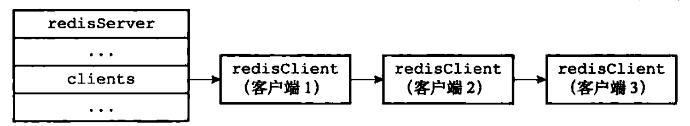
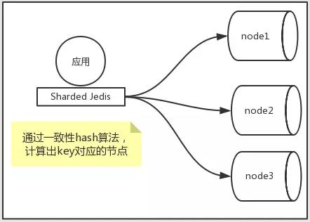
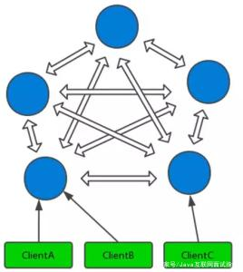
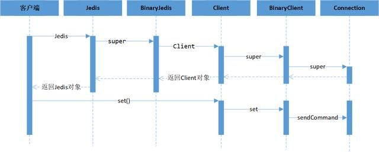
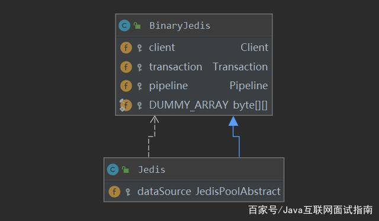
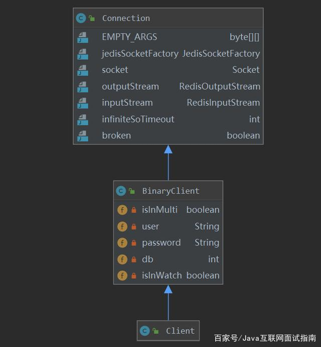
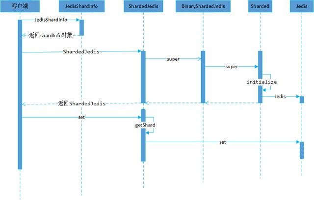
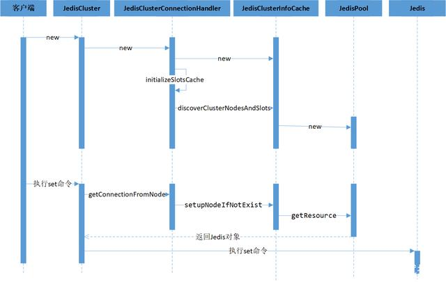
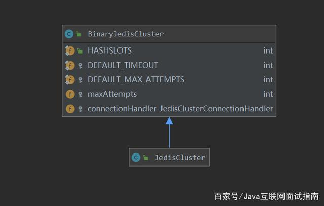
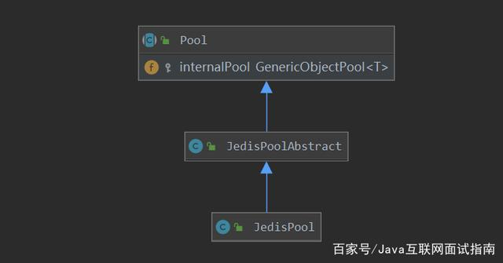

# 客户端

redisServer.clients保存了所有与服务器连接的客户端状态，并对客户端进行操作




## 客户端属性

结构体redisClient保存了客户端属性，分为<font color='cornflowerblue'>通用属性</font>和<font color='cornflowerblue'>特定功能属性</font>.

**套接字描述符fd**

fd=-1：伪客户端,命令请求来源于AOF文件和Lua脚本

fd>=0：与服务器通信的套接字描述符.

使用`CLIENT list`命令可查看服务器连接的客户端套接字描述符.

**名字**name

使用`CLIENT setname`设置客户端名字,否则为null

**标志flags**

客户端角色

> REDIS_MASTER,REDIS_SLAVE标志客户端是主/从服务器
>
> REDIS_LUA_CLIENT标志客户端是Lua脚本伪客户端

客户端状态

> REDIS_MULTI标志客户端在执行事务
>
> REDIS_DIRTY_CAS标志事务watch的值发生了改变
>
> REDIS_BLOCKED标志客户端被BRPOP,BLPOP阻塞
>
> ....

所有标志信息都定义在redis.h中.

**输入缓冲区querybuf**

保存客户端发送的命令请求

**命令参数\*\*argv与命令个数argc**

保存服务器解析命令请求得到的**命令参数**和**命令个数**

argv[0]为命令.

**命令的实现函数cmd**

保存服务器根据argv[0]在命令表中查找到的实现函数

命令表的查找不区分大小写.

**输出缓冲区**

**buf**是固定大小的缓冲区,用于保存短回复

**reply**是可变大小的缓冲区,用于保存长回复

**身份验证authenticated**

若服务器开启了<font color='cornflowerblue'>身份验证功能</font>,则需要对客户端进行身份校验

> authenticated=0,表示未验证,服务器只执行客户端发送的AUTH命令,其余拒绝
>
> authenticated=1,表示验证通过

**时间**

```bash
ctime #连接时间
lastinteraction #最后互动时间
obuf_soft_limit_reached_time # 输出区第一次达到软性限制时间
```

## 客户端的创建与关闭

**创建普通客户端**

客户端使用**connect函数**连接服务器时,服务器就会调用事件处理器创建客户端状态,并追加到clients链表末尾

**关闭普通客户端**

1. 客户端进程被退出或杀死

2. 客户端发送了不符合协议格式的命令

3. 客户端为`CLIENT KILL`命令对象

4. 客户端空转时长>服务器的timeout,会关闭客户端.但在以下情况不会关闭

   > 客户端打开了REDIS_MASTER标志
   >
   > 客户端被阻塞,REDIS_BLOCKED
   >
   > 客户端正在执行订阅命令

5. 客户端命令超出输入缓冲区大小(1GB)

6. 对客户端的回复大于输出缓冲区大小

   > 硬性限制:超出关闭客户端
   >
   > 软性限制:超出记录obuf_soft_limit_reached_time,若超出软性限制超过一定时长才关闭.

**Lua脚本伪客户端**

服务器初始化时创建lua_client伪客户端状态

**AOF文件的伪客户端**

用于执行AOF文件中的redis命令的伪客户端,载入完毕后关闭.

## jedis

Jedis客户端同时支持单机模式、分片模式、集群模式的访问模式

- 通过构建**Jedis类**对象实现单机模式下的数据访问
- 通过构建**ShardedJedis类**对象实现分片模式的数据访问
- 通过构建**JedisCluster类**对象实现集群模式下的数据访问。

Jedis客户端支持单命令和Pipeline方式访问Redis集群，通过Pipeline的方式能够提高集群访问的效率。

本文的整体分析基于Jedis的3.5.0版本进行分析，相关源码均参考此版本。

### Jedis访问模式对比

Jedis客户端操作Redis主要分为三种模式，分表是单机模式、分片模式、集群模式。

- 单机模式主要是创建Jedis对象来操作单节点的Redis，只适用于访问单个Redis节点。
- 分片模式（ShardedJedis）主要是通过创建**ShardedJedisPool**对象来访问分片模式的多个Redis节点，是Redis没有集群功能之前客户端实现的一个数据分布式方案，本质上是客户端通过一致性哈希来实现数据分布式存储。
- 集群模式（JedisCluster）主要是通过创建JedisCluster对象来访问集群模式下的多个Redis节点，是Redis3.0引入集群模式后客户端实现的集群访问访问，本质上是通过引入槽（slot）概念以及通过CRC16哈希槽算法来实现数据分布式存储。

单机模式不涉及任何分片的思想，所以我们着重分析分片模式和集群模式的理念。

### 分片模式

- 分片模式本质属于基于客户端的分片，在客户端实现如何根据一个key找到Redis集群中对应的节点的方案。
- Jedis的客户端分片模式采用**一致性Hash**来实现，一致性Hash算法的好处是当Redis节点进行增减时只会影响新增或删除节点前后的小部分数据，相对于取模等算法来说对数据的影响范围较小。
- Redis在大部分场景下作为缓存进行使用，所以不用考虑数据丢失致使缓存穿透造成的影响，在Redis节点增减时可以不用考虑部分数据无法命中的问题。

分片模式的整体应用如下图所示，核心在于客户端的一致性Hash策略。





（引用自：www.cnblogs.com）

### 2.2 集群模式


集群模式本质属于服务器分片技术，由Redis集群本身提供分片功能，从Redis 3.0版本开始正式提供。


集群的原理是：一个 Redis 集群包含16384 个哈希槽（Hash slot）， Redis保存的每个键都属于这16384个哈希槽的其中一个， 集群使用公式CRC16(key)%16384 来计算键 key 属于哪个槽， 其中 CRC16(key) 语句用于计算键key的CRC16校验和 。


集群中的每个节点负责处理一部分哈希槽。举个例子， 一个集群可以有三个哈希槽， 其中：


- 节点 A 负责处理 0 号至 5500 号哈希槽。
- 节点 B 负责处理 5501 号至 11000 号哈希槽。
- 节点 C 负责处理 11001 号至 16383 号哈希槽。


Redis在集群模式下对于key的读写过程首先将对应的key值进行CRC16计算得到对应的哈希值，将哈希值对槽位总数取模映射到对应的槽位，最终映射到对应的节点进行读写。以命令set("key", "value")为例子，它会使用CRC16算法对key进行计算得到哈希值28989，然后对16384进行取模得到12605，最后找到12605对应的Redis节点，最终跳转到该节点执行set命令。


集群模式的整体应用如下图所示，核心在于集群哈希槽的设计以及重定向命令。





（引用自：www.jianshu.com）


### 三、Jedis的基础用法


```
// Jedis单机模式的访问public void main(String[] args) {    // 创建Jedis对象    jedis = new Jedis("localhost", 6379);    // 执行hmget操作    jedis.hmget("foobar", "foo");    // 关闭Jedis对象    jedis.close();} // Jedis分片模式的访问public void main(String[] args) {    HostAndPort redis1 = HostAndPortUtil.getRedisServers().get(0);    HostAndPort redis2 = HostAndPortUtil.getRedisServers().get(1);    List<JedisShardInfo> shards = new ArrayList<JedisShardInfo>(2);    JedisShardInfo shard1 = new JedisShardInfo(redis1);    JedisShardInfo shard2 = new JedisShardInfo(redis2);    // 创建ShardedJedis对象    ShardedJedis shardedJedis = new ShardedJedis(shards);    // 通过ShardedJedis对象执行set操作    shardedJedis.set("a", "bar");} // Jedis集群模式的访问public void main(String[] args) {    // 构建redis的集群池    Set<HostAndPort> nodes = new HashSet<>();    nodes.add(new HostAndPort("127.0.0.1", 7001));    nodes.add(new HostAndPort("127.0.0.1", 7002));    nodes.add(new HostAndPort("127.0.0.1", 7003));     // 创建JedisCluster    JedisCluster cluster = new JedisCluster(nodes);     // 执行JedisCluster对象中的方法    cluster.set("cluster-test", "my jedis cluster test");    String result = cluster.get("cluster-test");}
```


Jedis通过创建Jedis的类对象来实现单机模式下的数据访问，通过构建JedisCluster类对象来实现集群模式下的数据访问。


要理解Jedis的访问Redis的整个过程，可以通过先理解单机模式下的访问流程，在这个基础上再分析集群模式的访问流程会比较合适。


### 四、Jedis单机模式的访问


Jedis访问单机模式Redis的整体流程图如下所示，从图中可以看出核心的流程包含Jedis对象的创建以及通过Jedis对象实现Redis的访问。


熟悉Jedis访问单机Redis的过程，本身就是需要了解Jedis的创建过程以及执行Redis命令的过程。


- Jedis的创建过程核心在于创建Jedis对象以及Jedis内部变量Client对象。
- Jedis访问Redis的过程在于通过Jedis内部的Client对象访问Redis。





### 4.1 创建过程


Jedis本身的类关系图如下图所示，从图中我们能够看到Jedis继承自BinaryJedis类。


在BinaryJedis类中存在和Redis对接的Client类对象，Jedis通过父类的BinaryJedis的Client对象实现Redis的读写。





Jedis类在创建过程中通过父类BinaryJedis创建了Client对象，而了解Client对象是进一步理解访问过程的关键。


```
public class Jedis extends BinaryJedis implements JedisCommands, MultiKeyCommands,    AdvancedJedisCommands, ScriptingCommands, BasicCommands, ClusterCommands, SentinelCommands, ModuleCommands {   protected JedisPoolAbstract dataSource = null;   public Jedis(final String host, final int port) {    // 创建父类BinaryJedis对象    super(host, port);  }} public class BinaryJedis implements BasicCommands, BinaryJedisCommands, MultiKeyBinaryCommands,    AdvancedBinaryJedisCommands, BinaryScriptingCommands, Closeable {   // 访问redis的Client对象  protected Client client = null;   public BinaryJedis(final String host, final int port) {    // 创建Client对象访问redis    client = new Client(host, port);  }}
```


Client类的类关系图如下图所示，Client对象继承自BinaryClient和Connection类。在BinaryClient类中存在Redis访问密码等相关参数，在Connection类在存在访问Redis的socket对象以及对应的输入输出流。本质上Connection是和Redis进行通信的核心类。





Client类在创建过程中初始化核心父类Connection对象，而Connection是负责和Redis直接进行通信。


```
public class Client extends BinaryClient implements Commands {  public Client(final String host, final int port) {    super(host, port);  }} public class BinaryClient extends Connection {  // 存储和Redis连接的相关信息  private boolean isInMulti;  private String user;  private String password;  private int db;  private boolean isInWatch;   public BinaryClient(final String host, final int port) {    super(host, port);  }} public class Connection implements Closeable {  // 管理和Redis连接的socket信息及对应的输入输出流  private JedisSocketFactory jedisSocketFactory;  private Socket socket;  private RedisOutputStream outputStream;  private RedisInputStream inputStream;  private int infiniteSoTimeout = 0;  private boolean broken = false;   public Connection(final String host, final int port, final boolean ssl,      SSLSocketFactory sslSocketFactory, SSLParameters sslParameters,      HostnameVerifier hostnameVerifier) {    // 构建DefaultJedisSocketFactory来创建和Redis连接的Socket对象    this(new DefaultJedisSocketFactory(host, port, Protocol.DEFAULT_TIMEOUT,        Protocol.DEFAULT_TIMEOUT, ssl, sslSocketFactory, sslParameters, hostnameVerifier));  }}
```


### 4.2 访问过程


以Jedis执行set命令为例，整个过程如下：


- Jedis的set操作是通过Client的set操作来实现的。
- Client的set操作是通过父类Connection的sendCommand来实现。


```
public class Jedis extends BinaryJedis implements JedisCommands, MultiKeyCommands,    AdvancedJedisCommands, ScriptingCommands, BasicCommands, ClusterCommands, SentinelCommands, ModuleCommands {  @Override  public String set(final String key, final String value) {    checkIsInMultiOrPipeline();    // client执行set操作    client.set(key, value);    return client.getStatusCodeReply();  }} public class Client extends BinaryClient implements Commands {  @Override  public void set(final String key, final String value) {    // 执行set命令    set(SafeEncoder.encode(key), SafeEncoder.encode(value));  }} public class BinaryClient extends Connection {  public void set(final byte[] key, final byte[] value) {    // 发送set指令    sendCommand(SET, key, value);  }} public class Connection implements Closeable {  public void sendCommand(final ProtocolCommand cmd, final byte[]... args) {    try {      // socket连接redis      connect();      // 按照redis的协议发送命令      Protocol.sendCommand(outputStream, cmd, args);    } catch (JedisConnectionException ex) {    }  }}
```


### 五、Jedis分片模式的访问


基于前面已经介绍的Redis分片模式的一致性Hash的原理来理解Jedis的分片模式的访问。


关于Redis分片模式的概念：Redis在3.0版本之前没有集群模式的概念，这导致单节点能够存储的数据有限，通过Redis的客户端如Jedis在客户端通过一致性Hash算法来实现数据的分片存储。


本质上Redis的分片模式跟Redis本身没有任何关系，只是通过客户端来解决单节点数据有限存储的问题。


ShardedJedis访问Redis的核心在于构建对象的时候初始化一致性Hash对象，构建一致性Hash经典的Hash值和node的映射关系。构建完映射关系后执行set等操作就是Hash值到node的寻址过程，寻址完成后直接进行单节点的操作。





### 5.1 创建过程


ShardedJedis的创建过程在于父类的Sharded中关于一致性Hash相关的初始化过程，核心在于构建一致性的虚拟节点以及虚拟节点和Redis节点的映射关系。


源码中最核心的部分代码在于根据根据权重映射成未160个虚拟节点，通过虚拟节点来定位到具体的Redis节点。


```
public class Sharded<R, S extends ShardInfo<R>> {   public static final int DEFAULT_WEIGHT = 1;  // 保存虚拟节点和redis的node节点的映射关系  private TreeMap<Long, S> nodes;  // hash算法  private final Hashing algo;  // 保存redis节点和访问该节点的Jedis的连接信息  private final Map<ShardInfo<R>, R> resources = new LinkedHashMap<>();   public Sharded(List<S> shards, Hashing algo) {    this.algo = algo;    initialize(shards);  }   private void initialize(List<S> shards) {    nodes = new TreeMap<>();    // 遍历每个redis的节点并设置hash值到节点的映射关系    for (int i = 0; i != shards.size(); ++i) {      final S shardInfo = shards.get(i);      // 根据权重映射成未160个虚拟节点      int N =  160 * shardInfo.getWeight();      if (shardInfo.getName() == null) for (int n = 0; n < N; n++) {        // 构建hash值和节点映射关系        nodes.put(this.algo.hash("SHARD-" + i + "-NODE-" + n), shardInfo);      }      else for (int n = 0; n < N; n++) {        nodes.put(this.algo.hash(shardInfo.getName() + "*" + n), shardInfo);      }      // 保存每个节点的访问对象      resources.put(shardInfo, shardInfo.createResource());    }  }}
```


### 5.2 访问过程


ShardedJedis的访问过程就是一致性Hash的计算过程，核心的逻辑就是：通过Hash算法对访问的key进行Hash计算生成Hash值，根据Hash值获取对应Redis节点，根据对应的Redis节点获取对应的访问对象Jedis。


获取访问对象Jedis之后就可以直接进行命令操作。


```
public class Sharded<R, S extends ShardInfo<R>> {   public static final int DEFAULT_WEIGHT = 1;  private TreeMap<Long, S> nodes;  private final Hashing algo;  // 保存redis节点和访问该节点的Jedis的连接信息  private final Map<ShardInfo<R>, R> resources = new LinkedHashMap<>();   public R getShard(String key) {    // 根据redis节点找到对应的访问对象Jedis    return resources.get(getShardInfo(key));  }   public S getShardInfo(String key) {    return getShardInfo(SafeEncoder.encode(getKeyTag(key)));  }   public S getShardInfo(byte[] key) {    // 针对访问的key生成对应的hash值    // 根据hash值找到对应的redis节点    SortedMap<Long, S> tail = nodes.tailMap(algo.hash(key));    if (tail.isEmpty()) {      return nodes.get(nodes.firstKey());    }    return tail.get(tail.firstKey());  }}
```


### 六、Jedis集群模式的访问


基于前面介绍的Redis的集群原理来理解Jedis的集群模式的访问。


Jedis能够实现key和哈希槽的定位的核心机制在于哈希槽和Redis节点的映射，而这个发现过程基于Redis的cluster slot命令。


关于Redis集群操作的命令：Redis通过cluster slots会返回Redis集群的整体状况。返回每一个Redis节点的信息包含：


- 哈希槽起始编号
- 哈希槽结束编号
- 哈希槽对应master节点，节点使用IP/Port表示
- master节点的第一个副本
- master节点的第二个副本


```
127.0.0.1:30001> cluster slots1) 1) (integer) 0 // 开始槽位   2) (integer) 5460 // 结束槽位   3) 1) "127.0.0.1" // master节点的host      2) (integer) 30001 // master节点的port      3) "09dbe9720cda62f7865eabc5fd8857c5d2678366" // 节点的编码   4) 1) "127.0.0.1" // slave节点的host      2) (integer) 30004 // slave节点的port      3) "821d8ca00d7ccf931ed3ffc7e3db0599d2271abf" // 节点的编码2) 1) (integer) 5461   2) (integer) 10922   3) 1) "127.0.0.1"      2) (integer) 30002      3) "c9d93d9f2c0c524ff34cc11838c2003d8c29e013"   4) 1) "127.0.0.1"      2) (integer) 30005      3) "faadb3eb99009de4ab72ad6b6ed87634c7ee410f"3) 1) (integer) 10923   2) (integer) 16383   3) 1) "127.0.0.1"      2) (integer) 30003      3) "044ec91f325b7595e76dbcb18cc688b6a5b434a1"   4) 1) "127.0.0.1"      2) (integer) 30006      3) "58e6e48d41228013e5d9c1c37c5060693925e97e"
```


Jedis访问集群模式Redis的整体流程图如下所示，从图中可以看出核心的流程包含JedisCluster对象的创建以及通过JedisCluster对象实现Redis的访问。


JedisCluster对象的创建核心在于创建JedisClusterInfoCache对象并通过集群发现来建立slot和集群节点的映射关系。


JedisCluster对Redis集群的访问在于获取key所在的Redis节点并通过Jedis对象进行访问。





### 6.1 创建过程


JedisCluster的类关系如下图所示，在图中可以看到核心变量JedisSlotBasedConnectionHandler对象。





JedisCluster的父类BinaryJedisCluster创建了JedisSlotBasedConnectionHandler对象，该对象负责和Redis的集群进行通信。


```
public class JedisCluster extends BinaryJedisCluster implements JedisClusterCommands,    MultiKeyJedisClusterCommands, JedisClusterScriptingCommands {  public JedisCluster(Set<HostAndPort> jedisClusterNode, int connectionTimeout, int soTimeout,      int maxAttempts, String password, String clientName, final GenericObjectPoolConfig poolConfig,      boolean ssl, SSLSocketFactory sslSocketFactory, SSLParameters sslParameters,      HostnameVerifier hostnameVerifier, JedisClusterHostAndPortMap hostAndPortMap) {     // 访问父类BinaryJedisCluster    super(jedisClusterNode, connectionTimeout, soTimeout, maxAttempts, password, clientName, poolConfig,        ssl, sslSocketFactory, sslParameters, hostnameVerifier, hostAndPortMap);  }} public class BinaryJedisCluster implements BinaryJedisClusterCommands,    MultiKeyBinaryJedisClusterCommands, JedisClusterBinaryScriptingCommands, Closeable {  public BinaryJedisCluster(Set<HostAndPort> jedisClusterNode, int connectionTimeout, int soTimeout,      int maxAttempts, String user, String password, String clientName, GenericObjectPoolConfig poolConfig,      boolean ssl, SSLSocketFactory sslSocketFactory, SSLParameters sslParameters,      HostnameVerifier hostnameVerifier, JedisClusterHostAndPortMap hostAndPortMap) {     // 创建JedisSlotBasedConnectionHandler对象    this.connectionHandler = new JedisSlotBasedConnectionHandler(jedisClusterNode, poolConfig,        connectionTimeout, soTimeout, user, password, clientName, ssl, sslSocketFactory, sslParameters, hostnameVerifier, hostAndPortMap);     this.maxAttempts = maxAttempts;  }}
```


JedisSlotBasedConnectionHandler的核心在于创建并初始化JedisClusterInfoCache对象，该对象缓存了Redis集群的信息。


JedisClusterInfoCache对象的初始化过程通过initializeSlotsCache来完成，主要目的用于实现集群节点和槽位发现。


```
public class JedisSlotBasedConnectionHandler extends JedisClusterConnectionHandler {  public JedisSlotBasedConnectionHandler(Set<HostAndPort> nodes, GenericObjectPoolConfig poolConfig,      int connectionTimeout, int soTimeout, String user, String password, String clientName,      boolean ssl, SSLSocketFactory sslSocketFactory, SSLParameters sslParameters,      HostnameVerifier hostnameVerifier, JedisClusterHostAndPortMap portMap) {     super(nodes, poolConfig, connectionTimeout, soTimeout, user, password, clientName,        ssl, sslSocketFactory, sslParameters, hostnameVerifier, portMap);  }} public abstract class JedisClusterConnectionHandler implements Closeable {  public JedisClusterConnectionHandler(Set<HostAndPort> nodes, final GenericObjectPoolConfig poolConfig,      int connectionTimeout, int soTimeout, int infiniteSoTimeout, String user, String password, String clientName,      boolean ssl, SSLSocketFactory sslSocketFactory, SSLParameters sslParameters,      HostnameVerifier hostnameVerifier, JedisClusterHostAndPortMap portMap) {     // 创建JedisClusterInfoCache对象    this.cache = new JedisClusterInfoCache(poolConfig, connectionTimeout, soTimeout, infiniteSoTimeout,        user, password, clientName, ssl, sslSocketFactory, sslParameters, hostnameVerifier, portMap);     // 初始化jedis的Slot信息    initializeSlotsCache(nodes, connectionTimeout, soTimeout, infiniteSoTimeout,        user, password, clientName, ssl, sslSocketFactory, sslParameters, hostnameVerifier);  }    private void initializeSlotsCache(Set<HostAndPort> startNodes,      int connectionTimeout, int soTimeout, int infiniteSoTimeout, String user, String password, String clientName,      boolean ssl, SSLSocketFactory sslSocketFactory, SSLParameters sslParameters, HostnameVerifier hostnameVerifier) {    for (HostAndPort hostAndPort : startNodes) {       try (Jedis jedis = new Jedis(hostAndPort.getHost(), hostAndPort.getPort(), connectionTimeout,          soTimeout, infiniteSoTimeout, ssl, sslSocketFactory, sslParameters, hostnameVerifier)) {         // 通过discoverClusterNodesAndSlots进行集群发现        cache.discoverClusterNodesAndSlots(jedis);        return;      } catch (JedisConnectionException e) {      }    }  }}
```


JedisClusterInfoCache的nodes用来保存Redis集群的节点信息，slots用来保存槽位和集群节点的信息。


nodes和slots维持的对象都是JedisPool对象，该对象维持了和Redis的连接信息。集群的发现过程由discoverClusterNodesAndSlots来实现，本质是执行Redis的集群发现命令cluster slots实现的。


```
public class JedisClusterInfoCache {  // 负责保存redis集群的节点信息  private final Map<String, JedisPool> nodes = new HashMap<>();  // 负责保存redis的槽位和redis节点的映射关系  private final Map<Integer, JedisPool> slots = new HashMap<>();   // 负责集群的发现逻辑  public void discoverClusterNodesAndSlots(Jedis jedis) {    w.lock();     try {      reset();      List<Object> slots = jedis.clusterSlots();       for (Object slotInfoObj : slots) {        List<Object> slotInfo = (List<Object>) slotInfoObj;         if (slotInfo.size() <= MASTER_NODE_INDEX) {          continue;        }        // 获取redis节点对应的槽位信息        List<Integer> slotNums = getAssignedSlotArray(slotInfo);         // hostInfos        int size = slotInfo.size();        for (int i = MASTER_NODE_INDEX; i < size; i++) {          List<Object> hostInfos = (List<Object>) slotInfo.get(i);          if (hostInfos.isEmpty()) {            continue;          }           HostAndPort targetNode = generateHostAndPort(hostInfos);          // 负责保存redis节点信息          setupNodeIfNotExist(targetNode);          if (i == MASTER_NODE_INDEX) {            // 负责保存槽位和redis节点的映射关系            assignSlotsToNode(slotNums, targetNode);          }        }      }    } finally {      w.unlock();    }  }   public void assignSlotsToNode(List<Integer> targetSlots, HostAndPort targetNode) {    w.lock();    try {      JedisPool targetPool = setupNodeIfNotExist(targetNode);      // 保存槽位和对应的JedisPool对象      for (Integer slot : targetSlots) {        slots.put(slot, targetPool);      }    } finally {      w.unlock();    }  }   public JedisPool setupNodeIfNotExist(HostAndPort node) {    w.lock();    try {      // 生产redis节点对应的nodeKey      String nodeKey = getNodeKey(node);      JedisPool existingPool = nodes.get(nodeKey);      if (existingPool != null) return existingPool;      // 生产redis节点对应的JedisPool      JedisPool nodePool = new JedisPool(poolConfig, node.getHost(), node.getPort(),          connectionTimeout, soTimeout, infiniteSoTimeout, user, password, 0, clientName,          ssl, sslSocketFactory, sslParameters, hostnameVerifier);      // 保存redis节点的key和对应的JedisPool对象      nodes.put(nodeKey, nodePool);      return nodePool;    } finally {      w.unlock();    }  }}
```


JedisPool的类关系如下图所示，其中内部internalPool是通过apache common pool来实现的池化。





JedisPool内部的internalPool通过JedisFactory的makeObject来创建Jedis对象。


每个Redis节点都会对应一个JedisPool对象，通过JedisPool来管理Jedis的申请释放复用等。


```
public class JedisPool extends JedisPoolAbstract {   public JedisPool() {    this(Protocol.DEFAULT_HOST, Protocol.DEFAULT_PORT);  }} public class JedisPoolAbstract extends Pool<Jedis> {   public JedisPoolAbstract() {    super();  }} public abstract class Pool<T> implements Closeable {  protected GenericObjectPool<T> internalPool;   public void initPool(final GenericObjectPoolConfig poolConfig, PooledObjectFactory<T> factory) {    if (this.internalPool != null) {      try {        closeInternalPool();      } catch (Exception e) {      }    }    this.internalPool = new GenericObjectPool<>(factory, poolConfig);  }} class JedisFactory implements PooledObjectFactory<Jedis> {     @Override  public PooledObject<Jedis> makeObject() throws Exception {    // 创建Jedis对象    final HostAndPort hp = this.hostAndPort.get();    final Jedis jedis = new Jedis(hp.getHost(), hp.getPort(), connectionTimeout, soTimeout,        infiniteSoTimeout, ssl, sslSocketFactory, sslParameters, hostnameVerifier);     try {      // Jedis对象连接      jedis.connect();      if (user != null) {        jedis.auth(user, password);      } else if (password != null) {        jedis.auth(password);      }      if (database != 0) {        jedis.select(database);      }      if (clientName != null) {        jedis.clientSetname(clientName);      }    } catch (JedisException je) {      jedis.close();      throw je;    }    // 将Jedis对象包装成DefaultPooledObject进行返回    return new DefaultPooledObject<>(jedis);  }}
```


### 6.2 访问过程


JedisCluster访问Redis的过程通过JedisClusterCommand来实现重试机制，最终通过Jedis对象来实现访问。从实现的角度来说JedisCluster是在Jedis之上封装了一层，进行集群节点定位以及重试机制等。


以set命令为例，整个访问通过JedisClusterCommand实现如下：


- 计算key所在的Redis节点。
- 获取Redis节点对应的Jedis对象。
- 通过Jedis对象进行set操作。


```
public class JedisCluster extends BinaryJedisCluster implements JedisClusterCommands,    MultiKeyJedisClusterCommands, JedisClusterScriptingCommands {   @Override  public String set(final String key, final String value, final SetParams params) {    return new JedisClusterCommand<String>(connectionHandler, maxAttempts) {      @Override      public String execute(Jedis connection) {        return connection.set(key, value, params);      }    }.run(key);  }}
```


JedisClusterCommand的run方法核心主要定位Redis的key所在的Redis节点，然后获取与该节点对应的Jedis对象进行访问。


在Jedis对象访问异常后，JedisClusterCommand会进行重试操作并按照一定策略执行renewSlotCache方法进行重集群节点重发现动作。


```
public abstract class JedisClusterCommand<T> {  public T run(String key) {    // 针对key进行槽位的计算    return runWithRetries(JedisClusterCRC16.getSlot(key), this.maxAttempts, false, null);  }     private T runWithRetries(final int slot, int attempts, boolean tryRandomNode, JedisRedirectionException redirect) {     Jedis connection = null;    try {       if (redirect != null) {        connection = this.connectionHandler.getConnectionFromNode(redirect.getTargetNode());        if (redirect instanceof JedisAskDataException) {          connection.asking();        }      } else {        if (tryRandomNode) {          connection = connectionHandler.getConnection();        } else {          // 根据slot去获取Jedis对象          connection = connectionHandler.getConnectionFromSlot(slot);        }      }      // 执行真正的Redis的命令      return execute(connection);    } catch (JedisNoReachableClusterNodeException jnrcne) {      throw jnrcne;    } catch (JedisConnectionException jce) {       releaseConnection(connection);      connection = null;       if (attempts <= 1) {        // 保证最后两次机会去重新刷新槽位和节点的对应的信息        this.connectionHandler.renewSlotCache();      }      // 按照重试次数进行重试操作      return runWithRetries(slot, attempts - 1, tryRandomNode, redirect);    } catch (JedisRedirectionException jre) {      // 针对返回Move命令立即触发重新刷新槽位和节点的对应信息      if (jre instanceof JedisMovedDataException) {        // it rebuilds cluster's slot cache recommended by Redis cluster specification        this.connectionHandler.renewSlotCache(connection);      }       releaseConnection(connection);      connection = null;       return runWithRetries(slot, attempts - 1, false, jre);    } finally {      releaseConnection(connection);    }  }}
```


JedisSlotBasedConnectionHandler的cache对象维持了slot和node的映射关系，通过getConnectionFromSlot方法来获取该slot对应的Jedis对象。


```
public class JedisSlotBasedConnectionHandler extends JedisClusterConnectionHandler {   protected final JedisClusterInfoCache cache;   @Override  public Jedis getConnectionFromSlot(int slot) {    // 获取槽位对应的JedisPool对象    JedisPool connectionPool = cache.getSlotPool(slot);    if (connectionPool != null) {      // 从JedisPool对象中获取Jedis对象      return connectionPool.getResource();    } else {      // 获取失败就重新刷新槽位信息      renewSlotCache();      connectionPool = cache.getSlotPool(slot);      if (connectionPool != null) {        return connectionPool.getResource();      } else {        //no choice, fallback to new connection to random node        return getConnection();      }    }  }}
```


### 七、Jedis的Pipeline实现


Pipeline的技术核心思想是将多个命令发送到服务器而不用等待回复，最后在一个步骤中读取该答复。这种模式的好处在于节省了请求响应这种模式的网络开销。


Redis的普通命令如set和Pipeline批量操作的核心的差别在于set命令的操作会直接发送请求到Redis并同步等待结果返回，而Pipeline的操作会发送请求但不立即同步等待结果返回，具体的实现可以从Jedis的源码一探究竟。


原生的Pipeline在集群模式下相关的key必须Hash到同一个节点才能生效，原因在于Pipeline下的Client对象只能其中的一个节点建立了连接。


在集群模式下归属于不同节点的key能够使用Pipeline就需要针对每个key保存对应的节点的client对象，在最后执行获取数据的时候一并获取。本质上可以认为在单节点的Pipeline的基础上封装成一个集群式的Pipeline。


### 7.1 Pipeline用法分析


Pipeline访问单节点的Redis的时候，通过Jedis对象的Pipeline方法返回Pipeline对象，其他的命令操作通过该Pipeline对象进行访问。


Pipeline从使用角度来分析，会批量发送多个命令并最后统一使用syncAndReturnAll来一次性返回结果。


```
public void pipeline() {    jedis = new Jedis(hnp.getHost(), hnp.getPort(), 500);    Pipeline p = jedis.pipelined();    // 批量发送命令到redis    p.set("foo", "bar");    p.get("foo");    // 同步等待响应结果    List<Object> results = p.syncAndReturnAll();     assertEquals(2, results.size());    assertEquals("OK", results.get(0));    assertEquals("bar", results.get(1)); }  public abstract class PipelineBase extends Queable implements BinaryRedisPipeline, RedisPipeline {   @Override  public Response<String> set(final String key, final String value) {    // 发送命令    getClient(key).set(key, value);    // pipeline的getResponse只是把待响应的请求聚合到pipelinedResponses对象当中    return getResponse(BuilderFactory.STRING);  }}  public class Queable {   private Queue<Response<?>> pipelinedResponses = new LinkedList<>();  protected <T> Response<T> getResponse(Builder<T> builder) {    Response<T> lr = new Response<>(builder);    // 统一保存到响应队列当中    pipelinedResponses.add(lr);    return lr;  }}  public class Pipeline extends MultiKeyPipelineBase implements Closeable {   public List<Object> syncAndReturnAll() {    if (getPipelinedResponseLength() > 0) {      // 根据批量发送命令的个数即需要批量返回命令的个数，通过client对象进行批量读取      List<Object> unformatted = client.getMany(getPipelinedResponseLength());      List<Object> formatted = new ArrayList<>();      for (Object o : unformatted) {        try {          // 格式化每个返回的结果并最终保存在列表中进行返回          formatted.add(generateResponse(o).get());        } catch (JedisDataException e) {          formatted.add(e);        }      }      return formatted;    } else {      return java.util.Collections.<Object> emptyList();    }  }}
```


普通set命令发送请求给Redis后立即通过getStatusCodeReply来获取响应结果，所以这是一种请求响应的模式。


getStatusCodeReply在获取响应结果的时候会通过flush()命令强制发送报文到Redis服务端然后通过读取响应结果。


```
public class BinaryJedis implements BasicCommands, BinaryJedisCommands, MultiKeyBinaryCommands,    AdvancedBinaryJedisCommands, BinaryScriptingCommands, Closeable {   @Override  public String set(final byte[] key, final byte[] value) {    checkIsInMultiOrPipeline();    // 发送命令    client.set(key, value);    // 等待请求响应    return client.getStatusCodeReply();  }}  public class Connection implements Closeable {  public String getStatusCodeReply() {    // 通过flush立即发送请求    flush();    // 处理响应请求    final byte[] resp = (byte[]) readProtocolWithCheckingBroken();    if (null == resp) {      return null;    } else {      return SafeEncoder.encode(resp);    }  }}  public class Connection implements Closeable {  protected void flush() {    try {      // 针对输出流进行flush操作保证报文的发出      outputStream.flush();    } catch (IOException ex) {      broken = true;      throw new JedisConnectionException(ex);    }  }}
```