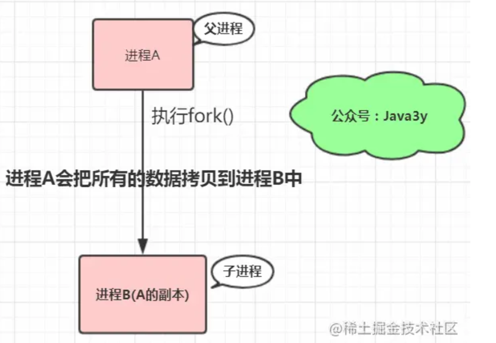
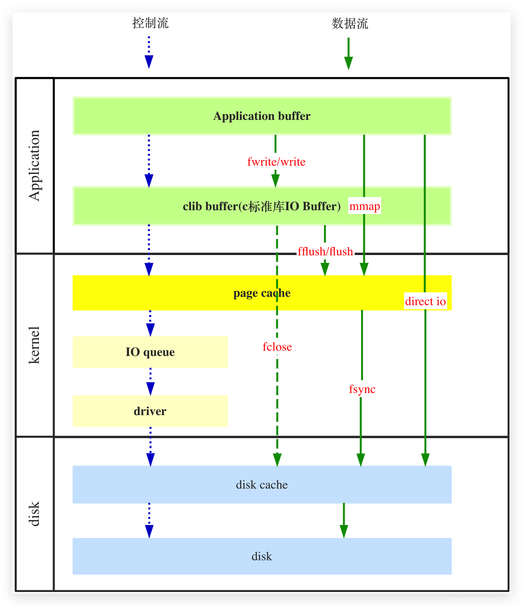
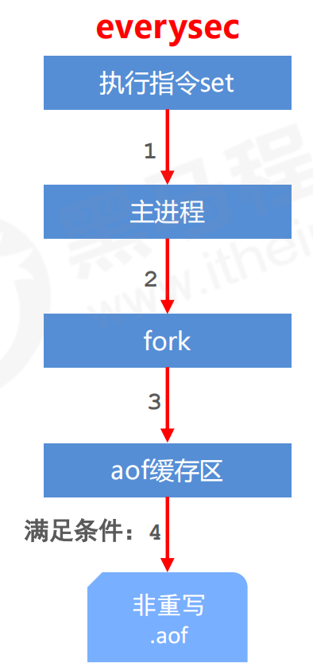
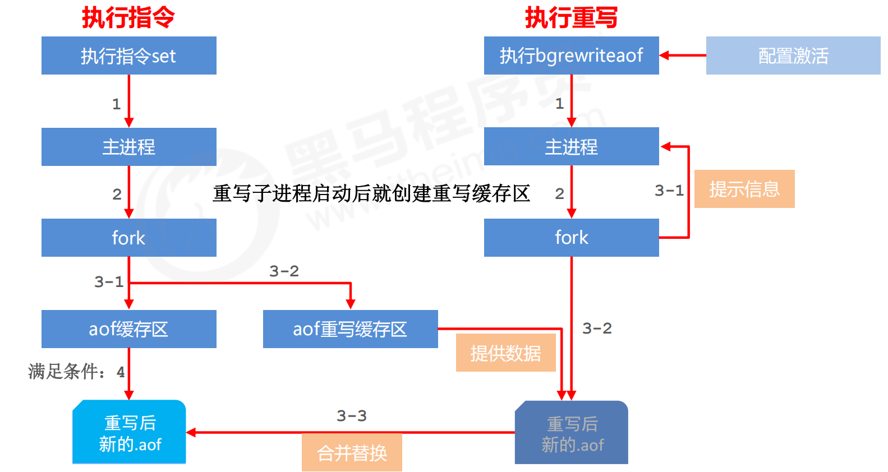
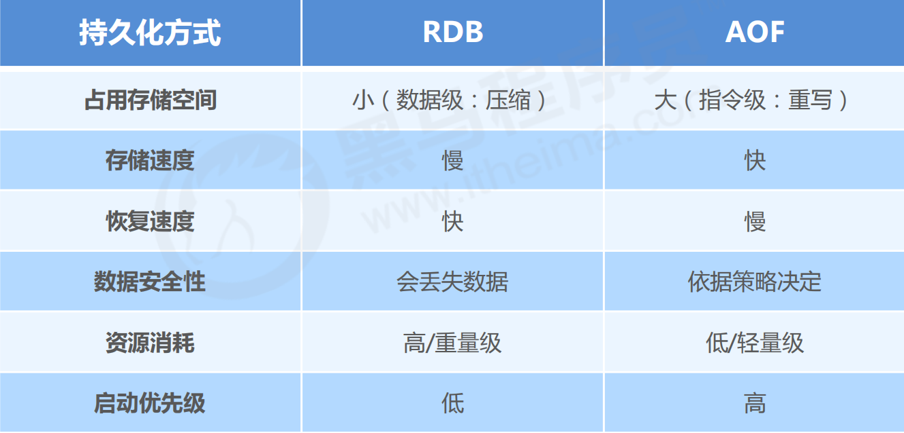

# Redis —— 持久化

**持久化**

> 利用<font color='red'>永久性存储介质</font>将数据进行保存，在特定的时间将保存的数据进行恢复的工作机制称为持久化

Redis 的数据全部在内存里，如果突然宕机，数据就会全部丢失.因此必须有一种机制来<font color='red'>防止Redis数据的意外丢失，确保数据安全性</font>，这种机制就是 Redis 的持久化机制。

Redis 的持久化机制有两种，第一种是**快照**(RDB,redis database)，第二种是 **AOF 日志**

- 快照是一次全量备份，

> 快照是内存数据的二进制序列化形式，在存储上非常紧凑.

- AOF 日志是连续的增量备份

> AOF 日志记录的是内存数据修改的指令记录文本。AOF 日志在长期的运行过程中会变的无比庞大，数据库重启时需要加载 AOF 日志进行指令重放，这个时间就会无比漫长。所以需要定期进行 AOF 重写，给 AOF 日志进行<font color='red'>瘦身</font>。

## RDB快照

### RDB配置

`save`指令的执行会阻塞当前Redis服务器，直到当前RDB过程完成为止

`bgsave`指令fork出一个**子进程**完成持久化过程

**dbfilename dump.rdb**
说明：设置本地数据库文件名，默认值为 dump.rdb
经验：通常设置为dump-端口号.rdb

 **dir**
说明：设置存储.rdb文件的路径
经验：通常设置成存储空间较大的目录中，目录名称data
**rdbcompression yes**
说明：设置存储至本地数据库时是否压缩数据，默认为 yes，采用 LZF 压缩
经验：通常默认为开启状态，如果设置为no，可以节省 CPU 运行时间，但会使存储的文件变大（巨大）
**rdbchecksum yes**
说明：设置是否进行RDB文件格式校验，该校验过程在写文件和读文件过程均进行
经验：通常默认为开启状态，如果设置为no，可以节约读写性过程约10%时间消耗，但是存储一定的数据损坏风险

### 快照原理

我们知道 Redis 是单线程程序，在服务线上请求的同时，Redis 还需要进行内存快照，内存快照要求 Redis 必须进行文件 IO 操作，可文件 IO 操作是不能使用多路复用 API。

这意味着单线程同时在服务线上的请求还要进行文件 IO 操作，文件 IO 操作会严重拖垮服务器请求的性能。还有个**重要的问题是为了不阻塞线上的业务，就需要边持久化边响应客户端请求**。持久化的同时，内存数据结构还在改变，比如一个大型的 hash 字典正在持久化，结果一个请求过来把它给删掉了，可还没持久化完呢，怎么弄？

[**Copy On Write**](https://juejin.cn/post/6844903702373859335)

Redis 使用操作系统的多进程 COW(Copy On Write) 机制来实现快照持久化，这个机制很有意思。

Redis 在持久化时会调用 glibc（是GNU发布的libc库，即c运行库。*glibc*是linux系统中最底层的api） 的函数`fork`产生一个子进程，快照持久化完全交给子进程来处理，父进程继续处理客户端请求。



子进程刚刚产生时，它和父进程共享内存里面的代码段和数据段。这是 Linux 操作系统的机制，为了节约内存资源，所以尽可能让它们共享起来。在进程分离的一瞬间，内存的增长几乎没有明显变化。

用 Python 语言描述进程分离的逻辑如下。`fork`函数会在父子进程同时返回，在父进程里返回子进程的 pid，在子进程里返回零。如果操作系统内存资源不足，pid 就会是负数，表示`fork`失败。

```python
pid = os.fork()
if pid > 0:
    handle_client_requests()  # 父进程继续处理客户端请求
if pid == 0:
    handle_snapshot_write()  # 子进程处理快照写磁盘
if pid < 0:
    # fork error
```

- 子进程做数据持久化，它不会修改现有的内存数据结构，它只是对数据结构进行遍历读取，然后序列化写到磁盘中。

- 父进程不一样，它必须持续服务客户端请求，然后对内存数据结构进行不间断的修改。

这个时候就会使用操作系统的 COW 机制来进行数据段页面的分离。数据段是由很多操作系统的页面组合而成，<font color='red'>当父进程对其中一个页面的数据进行修改时，会将被共享的页面复制一份分离出来，然后对这个复制的页面进行修改</font>。这时子进程相应的页面是没有变化的，还是进程产生时那一瞬间的数据。

随着父进程修改操作的持续进行，越来越多的共享页面被分离出来，内存就会持续增长。但是也不会超过原有数据内存的 2 倍大小。

>  Redis 实例里<font color='red'>冷数据占的比例往往是比较高</font>的，所以很少会出现所有的页面都会被分离，被分离的往往只有其中一部分页面。每个页面的大小只有 4K，一个 Redis 实例里面一般都会有成千上万的页面。
>

子进程因为数据没有变化，它能看到的内存里的数据在进程产生的一瞬间就凝固了，再也不会改变，这也是为什么 Redis 的持久化叫**「快照」**的原因。接下来子进程就可以非常安心的遍历数据了进行序列化写磁盘了。

### RDB的启动方式

1. save

2. bgsave

3. <font color='red'>自动间隔性保存</font>**save配置**(实际执行的是bgsave)

   > 在conf中配置:save second changes,启动后参数会保留在saveparams中
   >
   > second：监控时间范围
   > changes：监控key的变化量
   >
   > 默认:(900,1),(300,10),(60,10000)

   redisServer中保留了dirty和lastsave,用于serverCron计算是否触发了save(满足限定时间范围内key的变化数量达到指定数量即进行持久化)

4. 特殊启动方式

   > 主从同步时全量复制
   >
   > 服务器运行过程中重启:debug reload
   >
   > 关闭服务器时指定保存数据(未开启aof):shutdown save

### save 命令下的服务器状态

bgsave命令执行期间,服务器会拒绝客户端发送的save和bgsave命令,避免多个进程调用rdbsave,产生竞争条件

bgsave与bgrewriteaof也不能同时进行,虽然同为子进程不会产生竞争,但都会执行大量磁盘写入,影响效率.

> bgsave执行后,bgrewriteaof会等到bgsave执行完后再执行
>
> bgrewriteaof执行后,bgsave会被拒绝执行

### [RDB文件结构](https://www.imooc.com/article/50264?block_id=tuijian_wz)


database中的selectDB为1B的常量,表示之后会读入一个数据库号码,并执行select db_number切换数据库.

若键值对包含过期日期,则过期日期会被保存.EXPIRETIME_MS常量表示接下来读取过期的时间戳.

type说明value的类型和长度.

> 不同的类型和编码,对应不同的type
>
> 当value长度较短时,保留原数据;当value长度较长时,采用压缩存储.

### RDB文件的分析

Redis自带redis-check-dump工具,使用`od`命令分析RDB文件

```bash
redis> od -c dump.rdb
```

-c表示以ASCII码输出结果.

### RDB文件的读取

将RDB文件置于Redis安装目录,并启动Redis服务后便会自动读取RDB文件.

> 若服务器开启了AOF持久化功能,那么服务器<font color='red'>优先使用AOF文件来还原数据</font>.因为AOF更新频率高,处于最新状态的概率大.

## AOF(主流方式)

### AOF(Append Only File) 原理

AOF 日志存储的是 Redis 服务器的顺序指令序列(<font color='cornflowerblue'>redis命令请求协议格式</font>)，AOF 日志**只记录对内存进行修改的指令记录**。

假设 AOF 日志记录了自 Redis 实例创建以来所有的修改性指令序列，那么就可以通过对一个空的 Redis 实例顺序执行所有的指令，也就是「**重放**」，来恢复 Redis 当前实例的内存数据结构的状态。

Redis 会在收到客户端修改指令后，进行参数校验进行逻辑处理后，如果没问题，就立即将该指令文本存储到 AOF 日志中，也就是<font color='red'>先执行指令才将日志存盘</font>。这点不同于mysql、leveldb、hbase等存储引擎，它们都是先存储日志再做逻辑处理。

**AOF为什么要先执行命令再记日志呢？**

1. 为了避免额外的开销

> Redis在向AOF里面记录日志的时候，并不会先去对这些命令进行语法检查。所以，如果先记日志再执行命令的话，若命令有错，并在记日志之后发生宕机，日志中就有可能记录了错误的命令，Redis在使用日志恢复数据时，就可能出错。
>
> 而Mysql数据库，有分析器专门分析命令的正确性。

2. 在命令执行后才记录日志，不会阻塞当前的写操作。

AOF也有两个潜在风险。

- 相比于WAL（Writer Ahead Log），有丢失数据的风险。如果执行完命令，还没有来得及记日志就宕机了，那么这个命令和相应的数据就会有丢失的风险。
- AOF避免了对当前命令的阻塞，但可能会给下一个操作带来阻塞风险。这是因为，AOF日志也是在主线程中执行的，如果在把日志文件写入磁盘时，磁盘的写压力大，就会导致写盘很慢，进而导致后续的操作也无法执行了。
  

Redis 在长期运行的过程中，AOF 的日志会越变越长。如果实例宕机重启，重放整个 AOF 日志会非常耗时，导致长时间 Redis 无法对外提供服务。所以需要对 AOF 日志<font color='red'>瘦身</font>。

### AOF配置

1. appendonly yes|no
   是否开启AOF持久化功能，默认为不开启状态

2. appendfsync always|everysec|no
   设置AOF写数据策略

3. appendfilename filenameAOF
   持久化文件名，默认文件名未appendonly.aof，建议配置为appendonly-端口号.aof

4. dir
   AOF持久化文件保存路径，与RDB持久化文件保持一致即可

```bash
redis配置设置命令：redis-cli config  set key value
```

### fsync

#### 文件事件

redis服务器进程就是一个事件循环(loop),循环中包括文件事件和时间事件

- **文件事件**负责接收客户端的命令请求并回复.

- **时间事件**负责类似ServerCron这种定时函数的执行

事件循环代码:

```c
def eventLoop{):
	while True:
        # 处理文件事件,负责接收客户端的命令请求并回复.
        # 命令请求可能有新内容追加到aof_buf中.
		processFileEvents ( )
		# 处理时间事件
		processTimeEvents()
		# 考虑是否将aof_buf的内容写入和同步到aof文件
		flushAppendOnlyFile()
```

#### 文件的写入与同步

AOF 日志是以文件的形式存在的，当程序对 AOF 日志文件进行写操作时，实际上是将内容写到了内核为文件描述符分配的一个**内存缓存**中(<font color='red'>写AOF文件</font>)，然后内核会异步将脏数据刷回到磁盘的(<font color='red'>同步AOF文件</font>)。

如果机器突然宕机，AOF 日志内容可能还没有来得及完全刷到磁盘中，这个时候就会出现日志丢失。那该怎么办？

Linux 的`glibc`提供了`fsync(int fd)`函数可以将指定文件的内容强制从内核缓存刷到磁盘。只要 Redis 进程实时调用 fsync 函数就可以保证 aof 日志不丢失。但是 fsync 是一个磁盘 IO 操作，它很慢！如果 Redis 执行一条指令就要 fsync 一次，那么 Redis 高性能的地位就不保了。

**AOF同步数据三种策略(appendfsync)**

flushAppendOnlyFile()每次都会将aof_buf写入到aof文件中,但会根据appendfsync选择不同的同步策略.

1. always(每次）
   每次写入操作均同步到AOF文件中，数据零误差，性能较低
2. everysec（周期 1s 是可以配置的）
   生产环境的服务器每秒将缓冲区中的指令同步到AOF文件中，数据准确性较高，性能较高
   在系统突然宕机的情况下丢失1秒内的数据,在数据安全性和性能之间做了一个折中，在保持高性能的同时，尽可能使得数据少丢失
3. no（系统控制）
   由操作系统控制每次同步到AOF文件的周期，整体过程不可控

**write与fsync**
write操作会触发延迟写（delayed write）机制，Linux在内核提供页缓冲区来提高硬盘IO性能。write操作在写入系统缓冲区后直接返回。同步硬盘操作依赖于系统调度机制，例如：缓冲区页空间写满或达到特定时间周期。同步文件之前，如果此时系统故障宕机，缓冲区内数据将丢失。 

fsync针对单个文件操作（比如AOF文件），做强制硬盘同步，fsync将阻塞直到写入硬盘完成后返回，保证了数据持久化。

[持久化](https://blog.csdn.net/hilaryfrank/article/details/112200420)的各个步骤：



### AOF 重写

Redis 提供了 **bgrewriteaof** 指令用于对 AOF 日志进行瘦身。

> 无需读取原aof文件,开辟一个子进程对服务器当前状态进行遍历转换成一系列 Redis 的操作指令，序列化到新的 AOF 日志文件中。
>
> 序列化完毕后再将操作期间发生的增量 AOF 缓存日志追加到这个新的 AOF 日志文件中，追加完毕后就立即替代旧的 AOF 日志文件.

**AOF重写作用**

1. 降低磁盘占用量，提高磁盘利用率
2. 提高持久化效率，降低持久化写时间，提高IO性能
3. 降低数据恢复用时，提高数据恢复效率

**AOF重写规则**

1. 进程内已超时的数据不再写入文件

2. 忽略无效指令，重写时使用进程内数据直接生成，这样新的AOF文件只保留最终数据的写入命令

   > 如del key1、 hdel key2、srem key3、set key4 111、set key4 222等 

3. 对同一数据的多条写命令合并为一条命令

   > 如lpush list1 a、lpush list1 b、 lpush list1 c 可以转化为：lpush list1 a b c。为防止数据量过大造成客户端缓冲区溢出，对list、set、hash、zset等类型，每条指令最多写入64个元素

**AOF重写方式**

手动重写

```bash
bgrewriteaof
```

自动重写(serverCron函数检查)

```bash
auto-aof-rewrite-min-size size
当前AOF文件大小 > server.aof_rewrite_min_size(默认为1MB)

auto-aof-rewrite-percentage percentage
当前AOF文件大小和最后一次AOF重写后的大小之间的比率大于等于指定的增长百分比(默认为1倍，100%)
```

**重写流程**

服务器开启重写子进程,并开辟aof重写缓存区

服务器接收到客户端命令:

​	1) 执行命令
​    2) 写入aof缓存区
​    3) 写入aof重写缓存区

子进程完成AOF缓存区的重写后,发送信号通知父进程,父进程调用信号处理函数(<font color='red'>重写过程只有信号处理函数执行会阻塞</font>):

​	1) 将重写缓冲区的内容追加到新AOF文件
​    2) 使用新的AOF文件<font color='red'>原子地</font>覆盖原AOF文件()

未执行重写:



执行重写:

> aof重写缓存区在重写子进程启动后就创建.




## RDB与AOF对比



# 