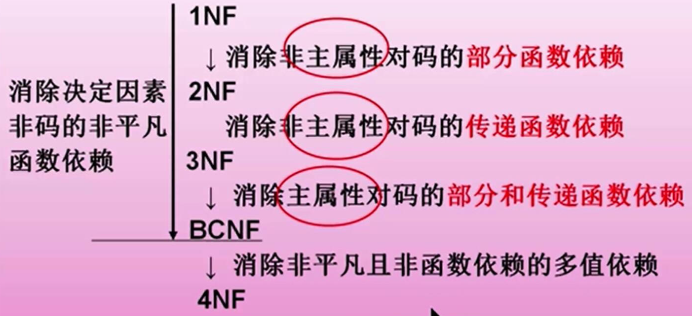

# 5. 设计开发：关系数据理论

## 5.1 问题的提出

## 5.2 规范化

### 函数依赖

**定义**

Y函数依赖于X(X→Y)：R(U)是属性集U上的关系模式。X，Y是U的子集。对于R(U)中任一个关系r，不存在2个元组中X属性值相等，而Y属性值不等。

**分类**

1. 非平凡函数依赖：X$\rightarrow$Y，但Y $ \nsubseteq $ X

   平凡函数依赖：X$\rightarrow$Y，Y $ \subseteq $  X

2. 完全函数依赖(X$\ce{->[F]}$Y)：X$\rightarrow$Y，且对于任意X的子集X‘，X‘$\nrightarrow$Y

   不完全函数依赖(X$\ce{->[P]}$Y)：X$\rightarrow$Y，且存在X的子集X‘，X’$\nrightarrow$Y

3. 传递函数依赖(X$\rightarrow$$\rightarrow$Z)：Y对X完全函数依赖，Y$\rightarrow$Z且Y$\nrightarrow$X，则称Z对X传递函数依赖

### 码

### 第一范式1NF
**要求**:不可表中有表，属性具有原子性，不可再分。

### 第二范式2NF
**要求**:非主属性对码是完全函数依赖。

**违例:**

在学生信息表S-L-C中，(SNO,SDEPT,SLOC,CNO,G)分别表示(学号，院系，住宿地址，课程号，成绩)，主键为(SNO,CNO).

学号决定学生的院系,同一院系学生具有相同住宿地址，所以

> SNO$\rightarrow$SDEPT,SDEPT$\rightarrow$SLOC.
>
> (SNO,CNO)$\ce{->[P]}$SDEPT,(SNO,CNO)$\ce{->[P]}$SLOC	不符合2NF

**修改违例：**

将S-L-C分解为SC(SNO,CNO,G)和S-L(SNO,SDEPT,SLOC)，2张表都不存在对码的部分函数依赖，符合2NF

### 第三范式3NF
**要求**：非主属性不传递依赖于码

**违例：**

S-L(SNO,SDEPT,SLOC)中，SNO$\ce{->[传递]}$SLOC

**消除违例；**

将S-L分解为S-D(SNO,SDEPT)和D-L(SDEPT,SLOC)

### BCNF

**要求:**每一个决定因素都包含码

（BCNF在函数依赖的范畴内已实现模式的彻底分解，已高度规范化）

**违例：**

在表STJ中，(S,T,J)分别代表(学生，教师，课程)。

每位老师只教一门课，每门课有多个老师，每个学生选一门课就对应一个老师。

> 若(S,J)作为主键，(S,J)$\rightarrow$T，T$\rightarrow$J	T不含主键
>
> 若(S,T)作为主键，(S,T)$\rightarrow$J，T$\rightarrow$J	存在部分依赖

**消除违例**
将STJ分解为ST(S,T)和TJ(T,J)

### 第四范式4NF

**要求:**属性之间不存在非平凡且非函数依赖的多值依赖。

**多值依赖**

设R(U)是属性集U上的一个关系模式，U可分为X,Y和Z。

R(U)中存在多值依赖X$\rightarrow$$\rightarrow$Y，当且仅当对于R(U)中任一关系r，给定一对(x,z),有一组Y值，Y值仅与x相关，与z无关。

**违例：**

在表SCT中，(SUBJECT,COURSE,TEACHER)分别表示科目，课程，教师，主键为 {SUBJECT,COURSE,TEACHER}.

在SCT中,(Physics,Principles of Optics) 具有 TEACHER{MCDONALD,BROOKS}

在(Physics,Electromagnetism) 中，Principles of Optics变成Electromagnetism ,对应相同的 TEACHER值{MCDONALD,BROOKS}

THEACHER值{MCDONALD,BROOKS} 只依赖于 SUBJECT，与COURSE无关。所以SUBJECT ${\twoheadrightarrow}$ TEACHER。

**消除违例：**

将SCT分解为SC和ST.

### 总结

